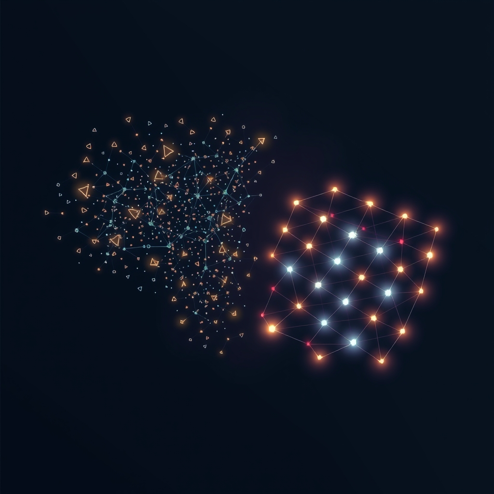

[Home](../index.md) > [Topics](./index.md)  
# 🧩🔄🧠 Self-Organization  
  
## 🤖 AI Summary  
### Self-Organization 🌟  
  
👉 **What Is It?** 🧠 Self-organization is a process where a system, without external direction, arranges itself into a structured or patterned state. 🌀 It's a broad concept applicable across physics, chemistry, biology, computer science, and social sciences. It's not an acronym, just a descriptive term. 🌈  
  
☁️ **A High Level, Conceptual Overview:**  
  
* 🍼 **For A Child:** Imagine you have a bunch of LEGO bricks. 🧱 If you shake them in a box, they might start to clump together and form little towers or patterns all by themselves! That's kind of like self-organization. 🧸  
* 🏁 **For A Beginner:** Self-organization is when a system, like a group of ants 🐜 or a chemical reaction 🧪, spontaneously forms patterns or structures without a leader telling it what to do. It's like finding order in chaos. 🌪️➡️✨  
* 🧙‍♂️ **For A World Expert:** Self-organization denotes the emergence of global order or coherent structures from local interactions between the components of a system. It's characterized by non-equilibrium conditions, positive feedback loops, and the reduction of entropy through the creation of complex, often dissipative, structures. ⚛️  
  
🌟 **High-Level Qualities:**  
  
* ✨ Emergent properties: The whole is greater than the sum of its parts. ➕➡️🏆  
* 🔄 Feedback loops: Positive and negative feedback drive the system's evolution. 🔁  
* 🌱 Adaptability: Self-organizing systems can adjust to changing environments. 🌦️➡️🌻  
* 🌐 Decentralized control: No single entity directs the process. 🙅‍♂️👑  
* 📊 Robustness: Can withstand perturbations and maintain structure. 💪  
  
🚀 **Notable Capabilities:**  
  
* 🐝 Swarm intelligence: Formation of complex behaviors from simple agent interactions. 🧠➡️🐝  
* 🧪 Chemical pattern formation: Belousov-Zhabotinsky reactions creating beautiful patterns. 🎨  
* 💻 Artificial neural networks: Learning and adapting through weighted connections. 🧠➡️🤖  
* 🌐 Social network formation: Emergence of community structures. 🤝➡️🏘️  
* 🦠 Biological morphogenesis: Development of complex organisms from simple cells. 🧬➡️🐛  
  
📊 **Typical Performance Characteristics:**  
  
* 📈 Rate of convergence to stable states: Depends on system complexity and interactions. ⏰  
* 📏 Pattern complexity: Measured by fractal dimensions or information entropy. 📊  
* 🔄 Stability under perturbations: Quantified by resilience metrics. 🛡️  
* ⚡ Energy dissipation: Often associated with the creation of dissipative structures. 🔥  
* 🌐 Network connectivity: Degree of connections and cluster coefficients. 🕸️  
  
💡 **Examples Of Prominent Products, Applications, Or Services:**  
  
* 🤖 Self-driving cars: Using sensor data and algorithms for emergent traffic flow. 🚗➡️🚦  
* 🌐 Internet routing: Autonomous systems coordinating data flow. 📡➡️🌐  
* 🎨 Generative art: Algorithms producing complex visual patterns. 🖼️  
* 🦠 Synthetic biology: Engineering self-assembling biological systems. 🧪➡️🧬  
* 💰 Financial markets: Emergent behavior of traders leading to market patterns. 💸➡️📈  
  
📚 **A List Of Relevant Theoretical Concepts Or Disciplines:**  
  
* 🌲 **Parent:** Systems theory. 🌐  
* 👩‍👧‍👦 **Children:**  
    * Chaos theory. 🌪️  
    * Complexity science. 🤯  
    * Cybernetics. 🤖  
    * Synergetics. 🤝  
    * Network science. 🕸️  
    * Evolutionary algorithms. 🧬  
* 🧙‍♂️ **Advanced topics:**  
    * Non-equilibrium thermodynamics. 🔥  
    * Information theory. 📊  
    * Dynamical systems. 🔄  
    * Agent-based modeling. 🤖  
    * Fractal geometry. 📏  
  
🔬 **A Technical Deep Dive:**  
  
Self-organization often relies on non-linear interactions and feedback loops. 🔄 These interactions can lead to the emergence of attractors, which are stable states that the system tends to converge to. 🎯 Agent-based models are used to simulate these systems, where individual agents follow simple rules, and the global behavior emerges from their interactions. 🤖 Mathematical tools like differential equations and stochastic processes are used to describe the dynamics of these systems. 📊 Information theory helps quantify the complexity and order of the emergent patterns. 🧠  
  
🧩 **The Problem(s) It Solves:**  
  
* **Abstract:** How to create complex structures and behaviors without centralized control. 🧠➡️✨  
* **Common Examples:** Traffic flow optimization, network routing, and pattern recognition. 🚗➡️🚦, 📡➡️🌐, 🖼️  
* **Surprising Example:** The formation of slime mold colonies, where individual amoebae come together to form a complex, moving organism. 🦠➡️👣  
  
👍 **How To Recognize When It's Well Suited To A Problem:**  
  
* When dealing with decentralized systems. 🌐  
* When complexity arises from local interactions. 🤝  
* When adaptability to changing environments is crucial. 🌦️  
* When robustness and resilience are needed. 💪  
* When emergent behavior is desired. 🧠➡️✨  
  
👎 **How To Recognize When It's Not Well Suited To A Problem:**  
  
* When precise control and predictability are essential. 🎯  
* When the system requires a hierarchical structure. 👑  
* When the system is static and unchanging. 🧱  
* When the system has a small number of components. 🤏  
* When the system requires a pre-determined outcome. 📝  
  
🩺 **How To Recognize When It's Not Being Used Optimally (And How To Improve):**  
  
* Lack of diversity in initial conditions. 🌈➡️😐  
* Insufficient feedback mechanisms. 🔄➡️🚫  
* Poorly defined interaction rules. 📝➡️❓  
* Overly constrained system parameters. ⛓️  
* Inadequate monitoring and analysis. 📊➡️🙈  
    * Improve by: Introducing more randomness, refining feedback loops, simplifying interaction rules, loosening constraints, and using advanced analytical tools. 🛠️  
  
🔄 **Comparisons To Similar Alternatives:**  
  
* **Centralized control:** Offers predictability but lacks adaptability. 👑➡️🚫🌱  
* **Hierarchical systems:** Provides structure but can be rigid. 🏛️➡️🧱  
* **Optimization algorithms:** Finds optimal solutions but lacks emergent properties. 🎯➡️🚫✨  
* **Machine learning:** Learns patterns but may not explain the underlying mechanisms. 🤖➡️🧠❓  
  
🤯 **A Surprising Perspective:**  
  
Self-organization is not just a physical phenomenon; it's a fundamental principle of the universe, from the formation of galaxies to the emergence of consciousness. 🌌➡️🧠. It shows that order can arise spontaneously from disorder, challenging our assumptions about control and design. 🤯  
  
📜 **Some Notes On Its History, How It Came To Be, And What Problems It Was Designed To Solve:**  
  
The concept of self-organization gained prominence in the mid-20th century with the work of scientists like Ilya Prigogine and Hermann Haken. 🧪 They sought to understand how complex patterns arise in non-equilibrium systems, addressing the limitations of traditional equilibrium thermodynamics. ⚡ It was used to explain biological development, chemical reactions, and social phenomena. 🧬➡️🤝  
  
📝 **A Dictionary-Like Example Using The Term In Natural Language:**  
  
"The city's traffic flow exhibited self-organization, with cars spontaneously forming lanes and avoiding congestion." 🚗➡️🚦  
  
😂 **A Joke:**  
  
"I tried to self-organize my sock drawer, but it just became a singularity of mismatched cotton." 🧦➡️🤯  
  
📖 **Book Recommendations:**  
  
* **Topical:** "Self-Organization in Biological Systems" by Scott Camazine 📚  
* **Tangentially related:** [🌐🧭❓🔍🗺️ Complexity: A Guided Tour](../books/complexity.md) by Melanie Mitchell 📚  
* **Topically opposed:** "The Control Revolution: Technological and Economic Origins of the Information Society" by James R. Beniger 📚  
* **More general:** "Systems Thinking" by Donella H. Meadows 📚  
* **More specific:** "Swarm Intelligence" by James Kennedy 📚  
* **Fictional:** [🌌3️⃣⚛️ The Three-Body Problem](../books/the-three-body-problem.md) by Liu Cixin 📚  
* **Rigorous:** [🌪️✨🕰️ Order Out of Chaos: Man's New Dialogue with Nature](../books/order-out-of-chaos.md)by Ilya Prigogine and Isabelle Stengers 📚  
* **Accessible:** "Emergence: The Connected Lives of Ants, Brains, Cities, and Software" by Steven Johnson 📚  
  
📺 **Links To Relevant YouTube Channels Or Videos:**  
  
* [Veritasium](https://www.youtube.com/c/veritasium) 🧪  
* [Numberphile](https://www.youtube.com/c/numberphile) 📊  
  
## 🦋 Bluesky    
<blockquote class="bluesky-embed" data-bluesky-uri="at://did:plc:i4yli6h7x2uoj7acxunww2fc/app.bsky.feed.post/3mj5h3h6fqd23" data-bluesky-cid="bafyreieucgtekbdyfve2yvnejynumdn42xhe223o4sgrfqb4lxar67fqne">
🧩🔄🧠 Self-Organization  
  
#AI Q: 🌀 Where have you seen order emerge from chaos without anyone in charge?  
  
🤖 AI Systems | 🕸️ Network Dynamics | 🌪️ Chaos &amp; Complexity | 🌿 Emergent Behavior  
https://bagrounds.org/topics/self-organization
&mdash; <a href="https://bsky.app/profile/did:plc:i4yli6h7x2uoj7acxunww2fc?ref_src=embed">Bryan Grounds (@bagrounds.bsky.social)</a> <a href="https://bsky.app/profile/did:plc:i4yli6h7x2uoj7acxunww2fc/post/3mj5h3h6fqd23?ref_src=embed">2026-04-10T13:39:23.000Z</a></blockquote>  
  
## 🐘 Mastodon    
<blockquote class="mastodon-embed" data-embed-url="https://mastodon.social/@bagrounds/116380687749157874/embed" style="background: #FCF8FF; border-radius: 8px; border: 1px solid #C9C4DA; margin: 0; max-width: 540px; min-width: 270px; overflow: hidden; padding: 0;"> <a href="https://mastodon.social/@bagrounds/116380687749157874" target="_blank" style="align-items: center; color: #1C1A25; display: flex; flex-direction: column; font-family: system-ui, -apple-system, BlinkMacSystemFont, 'Segoe UI', Oxygen, Ubuntu, Cantarell, 'Fira Sans', 'Droid Sans', 'Helvetica Neue', Roboto, sans-serif; font-size: 14px; justify-content: center; letter-spacing: 0.25px; line-height: 20px; padding: 24px; text-decoration: none;"> <svg xmlns="http://www.w3.org/2000/svg" xmlns:xlink="http://www.w3.org/1999/xlink" width="32" height="32" viewBox="0 0 79 75"><path d="M63 45.3v-20c0-4.1-1-7.3-3.2-9.7-2.1-2.4-5-3.7-8.5-3.7-4.1 0-7.2 1.6-9.3 4.7l-2 3.3-2-3.3c-2-3.1-5.1-4.7-9.2-4.7-3.5 0-6.4 1.3-8.6 3.7-2.1 2.4-3.1 5.6-3.1 9.7v20h8V25.9c0-4.1 1.7-6.2 5.2-6.2 3.8 0 5.8 2.5 5.8 7.4V37.7H44V27.1c0-4.9 1.9-7.4 5.8-7.4 3.5 0 5.2 2.1 5.2 6.2V45.3h8ZM74.7 16.6c.6 6 .1 15.7.1 17.3 0 .5-.1 4.8-.1 5.3-.7 11.5-8 16-15.6 17.5-.1 0-.2 0-.3 0-4.9 1-10 1.2-14.9 1.4-1.2 0-2.4 0-3.6 0-4.8 0-9.7-.6-14.4-1.7-.1 0-.1 0-.1 0s-.1 0-.1 0 0 .1 0 .1 0 0 0 0c.1 1.6.4 3.1 1 4.5.6 1.7 2.9 5.7 11.4 5.7 5 0 9.9-.6 14.8-1.7 0 0 0 0 0 0 .1 0 .1 0 .1 0 0 .1 0 .1 0 .1.1 0 .1 0 .1.1v5.6s0 .1-.1.1c0 0 0 0 0 .1-1.6 1.1-3.7 1.7-5.6 2.3-.8.3-1.6.5-2.4.7-7.5 1.7-15.4 1.3-22.7-1.2-6.8-2.4-13.8-8.2-15.5-15.2-.9-3.8-1.6-7.6-1.9-11.5-.6-5.8-.6-11.7-.8-17.5C3.9 24.5 4 20 4.9 16 6.7 7.9 14.1 2.2 22.3 1c1.4-.2 4.1-1 16.5-1h.1C51.4 0 56.7.8 58.1 1c8.4 1.2 15.5 7.5 16.6 15.6Z" fill="currentColor"/></svg> 
Post by @bagrounds@mastodon.social
 
View on Mastodon
 </a> </blockquote> 