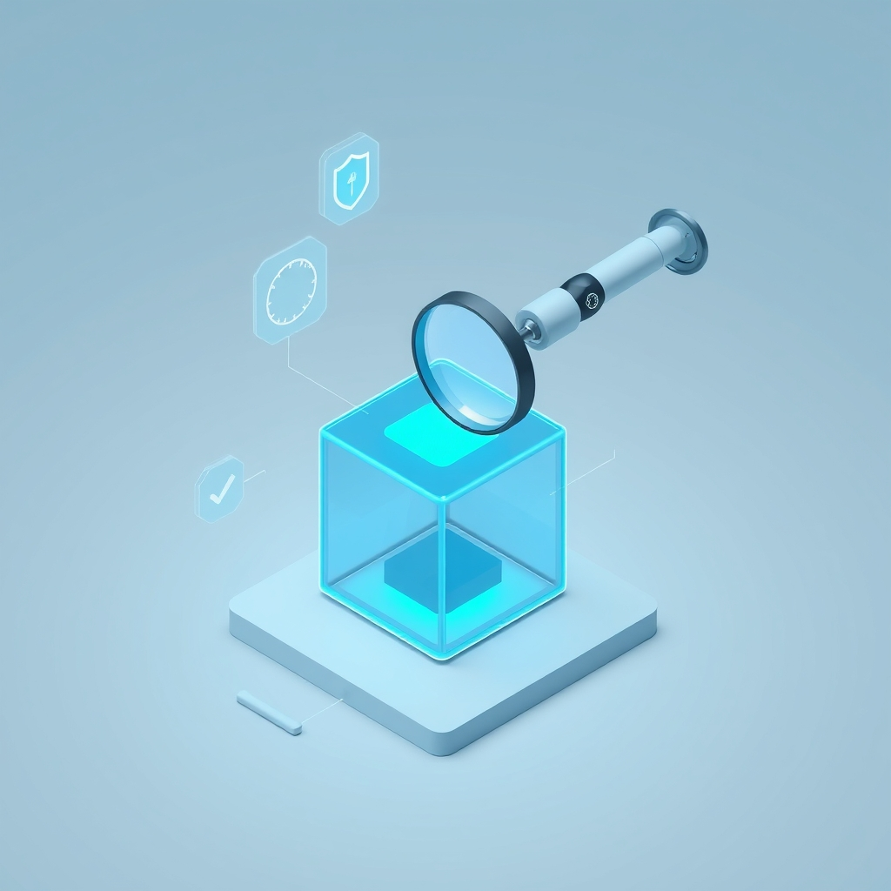

[Home](../index.md) > [Topics](./index.md) > [Knowledge](./a-hierarchical-view-of-human-knowledge.md) > [Engineering](./engineering.md) > [Software Engineering](./software-engineering.md)  
# 🧪✅ Software Testing and Quality Assurance  
  
## 🤖 AI Summary  
**High-Level Summary:**  
Software Testing and Quality Assurance (QA) are crucial processes that ensure software products meet specified requirements and user expectations. The core principles revolve around preventing defects, identifying issues early, and delivering reliable, high-quality software. The goals include minimizing risks, maximizing efficiency, and enhancing user satisfaction. The significance lies in building trust in software, reducing costs associated with post-release fixes, and ultimately creating better user experiences. 🌟  
  
**Subcategories:**  
Here are some major subcategories within Software Testing and Quality Assurance:  
  
1.  **Functional Testing:**  
    * This focuses on verifying that the software performs its intended functions correctly. It checks if the features work as designed. 💻  
2.  **Non-Functional Testing:**  
    * This evaluates aspects beyond functionality, such as performance, security, usability, and reliability. It assesses how well the software performs. ⏱️🔒🤝  
3.  **Automation Testing:**  
    * This involves using tools and scripts to automate repetitive testing tasks, improving efficiency and coverage. It's about letting machines do the work! 🤖  
4.  **Performance Testing:**  
    * This assesses the software's speed, responsiveness, and stability under various loads. It's all about seeing how much the software can handle. 📈  
5.  **Security Testing:**  
    * This aims to identify vulnerabilities and weaknesses in the software that could be exploited by malicious actors. It's about protecting the software from threats. 🛡️  
6.  **Usability Testing:**  
    * This evaluates how easy it is for users to interact with the software and achieve their goals. It's about user-friendliness! 😊  
7.  **Regression Testing:**  
    * This ensures that new code changes or bug fixes haven't introduced unintended issues in existing functionality. It's about maintaining stability. 🔄  
8.  **Acceptance Testing:**  
    * This is conducted by end-users or stakeholders to determine if the software meets their requirements and is ready for release. It's the final stamp of approval! ✅  
  
**Book Recommendations:**  
Here are some influential and accessible books that provide a good introduction to Software Testing and Quality Assurance:  
  
1.  **"Software Testing" by Ron Patton:**  
    * This comprehensive guide covers a wide range of testing concepts and techniques, making it suitable for beginners and experienced testers alike. It provides practical examples and clear explanations. 📖  
2.  **"Lessons Learned in Software Testing" by Cem Kaner, James Bach, and Bret Pettichord:**  
    * This book offers valuable insights and practical advice based on real-world experiences. It focuses on the art and science of testing, emphasizing critical thinking and problem-solving. 🧠  
3.  **"The Art of Software Testing" by Glenford J. Myers, Tom Badgett, and Corey Sandler:**  
    * This classic book covers the fundamental principles of software testing and provides practical techniques for designing and executing effective tests. It's a foundational text in the field. 📜  
4.  **"[How Google Tests Software](../books/how-google-tests-software.md)" by James A. Whittaker, Jason Arbon, and Jeff Carollo:**  
    * This book provides an inside look at Google's testing practices and methodologies. It offers valuable insights into how a leading tech company ensures software quality. 🔍  
5.  **"Explore It!: Reduce Risk and Increase Confidence with Exploratory Testing" by Elisabeth Hendrickson:**  
    * This book focuses on exploratory testing, a dynamic and creative approach to finding defects. It encourages testers to think outside the box and explore the software. 🗺️  
  
## 💬 [Gemini](https://gemini.google.com/app) Prompt  
> For the category of Software Testing and Quality Assurance, please provide:  
A High-Level Summary: A concise overview of the core principles, goals, and significance of this category.  
Subcategories: A list of the major subcategories or branches within this category, with a brief description of each.  
Book Recommendations: A selection of 3-5 influential or accessible books that provide a good introduction to this category or its key subcategories.  
Use lots of emojis.  
  
## 🐘 Mastodon    
<blockquote class="mastodon-embed" data-embed-url="https://mastodon.social/@bagrounds/116383529203684969/embed" style="background: #282c37; border-radius: 8px; border: 1px solid #393f4f; margin: 0; max-width: 540px; min-width: 270px; overflow: hidden; padding: 0;"> <a href="https://mastodon.social/@bagrounds/116383529203684969" target="_blank" style="align-items: center; color: #d9e1e8; display: flex; flex-direction: column; font-family: system-ui, -apple-system, BlinkMacSystemFont, 'Segoe UI', Oxygen, Ubuntu, Cantarell, 'Fira Sans', 'Droid Sans', 'Helvetica Neue', Roboto, sans-serif; font-size: 14px; justify-content: center; letter-spacing: 0.25px; line-height: 20px; padding: 24px; text-decoration: none;"> <svg xmlns="http://www.w3.org/2000/svg" xmlns:xlink="http://www.w3.org/1999/xlink" width="32" height="32" viewBox="0 0 79 75"><path d="M63 45.3v-20c0-4.1-1-7.3-3.2-9.7-2.1-2.4-5-3.7-8.5-3.7-4.1 0-7.2 1.6-9.3 4.7l-2 3.3-2-3.3c-2-3.1-5.1-4.7-9.2-4.7-3.5 0-6.4 1.3-8.6 3.7-2.1 2.4-3.1 5.6-3.1 9.7v20h8V25.9c0-4.1 1.7-6.2 5.2-6.2 3.8 0 5.8 2.5 5.8 7.4V37.7H44V27.1c0-4.9 1.9-7.4 5.8-7.4 3.5 0 5.2 2.1 5.2 6.2V45.3h8ZM74.7 16.6c.6 6 .1 15.7.1 17.3 0 .5-.1 4.8-.1 5.3-.7 11.5-8 16-15.6 17.5-.1 0-.2 0-.3 0-4.9 1-10 1.2-14.9 1.4-1.2 0-2.4 0-3.6 0-4.8 0-9.7-.6-14.4-1.7-.1 0-.1 0-.1 0s-.1 0-.1 0 0 .1 0 .1 0 0 0 0c.1 1.6.4 3.1 1 4.5.6 1.7 2.9 5.7 11.4 5.7 5 0 9.9-.6 14.8-1.7 0 0 0 0 0 0 .1 0 .1 0 .1 0 0 .1 0 .1 0 .1.1 0 .1 0 .1.1v5.6s0 .1-.1.1c0 0 0 0 0 .1-1.6 1.1-3.7 1.7-5.6 2.3-.8.3-1.6.5-2.4.7-7.5 1.7-15.4 1.3-22.7-1.2-6.8-2.4-13.8-8.2-15.5-15.2-.9-3.8-1.6-7.6-1.9-11.5-.6-5.8-.6-11.7-.8-17.5C3.9 24.5 4 20 4.9 16 6.7 7.9 14.1 2.2 22.3 1c1.4-.2 4.1-1 16.5-1h.1C51.4 0 56.7.8 58.1 1c8.4 1.2 15.5 7.5 16.6 15.6Z" fill="currentColor"/></svg> 
Post by @bagrounds@mastodon.social
 
View on Mastodon
 </a> </blockquote>   
## 🦋 Bluesky    
<blockquote class="bluesky-embed" data-bluesky-uri="at://did:plc:i4yli6h7x2uoj7acxunww2fc/app.bsky.feed.post/3mj6uihqtvg2a" data-bluesky-cid="bafyreigg6ohhlismi2a5xfcr74kvnhqn2s3oyrpcxc4lzvcwptolyxeuwa">
🧪✅ Software Testing and Quality Assurance  
  
#AI Q: 🧪 Which part of software testing matters most to you?  
  
💻 Functional Testing | 🤖 Test Automation | 🛡️ Security Checks | 📈 Performance Metrics  
https://bagrounds.org/topics/software-testing-and-quality-assurance
&mdash; <a href="https://bsky.app/profile/did:plc:i4yli6h7x2uoj7acxunww2fc?ref_src=embed">Bryan Grounds (@bagrounds.bsky.social)</a> <a href="https://bsky.app/profile/did:plc:i4yli6h7x2uoj7acxunww2fc/post/3mj6uihqtvg2a?ref_src=embed">2026-04-11T03:11:58.000Z</a></blockquote>  
