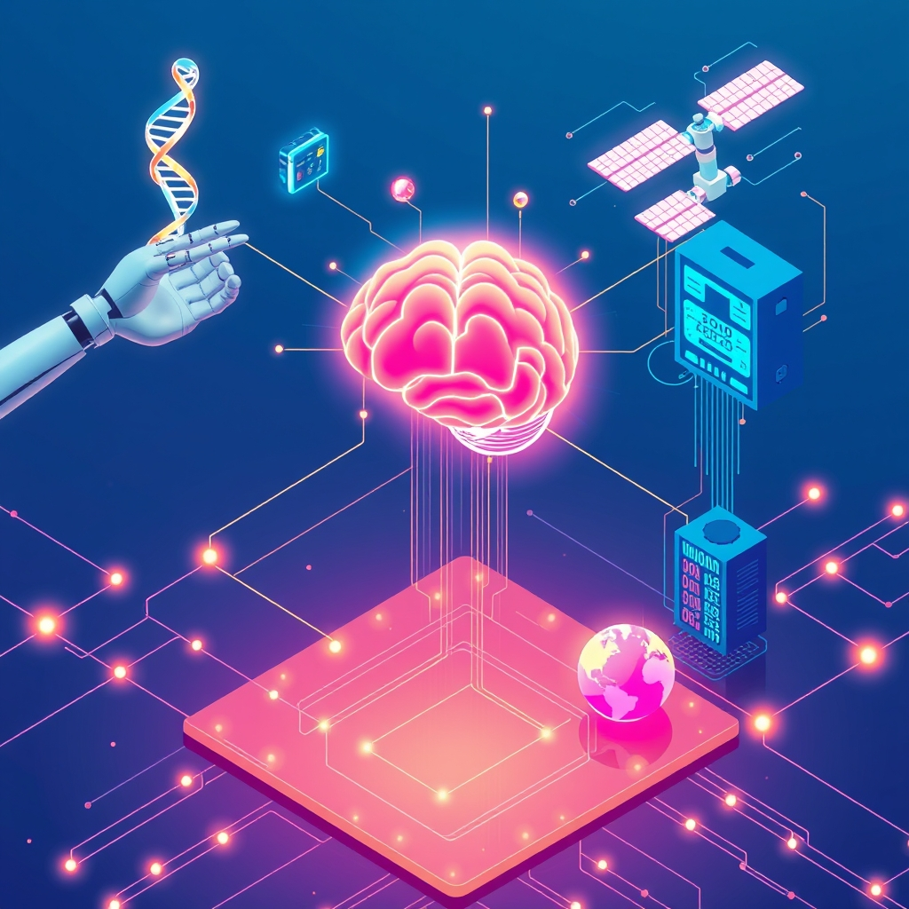

[Home](../index.md) > [Topics](./index.md) > [Knowledge](./a-hierarchical-view-of-human-knowledge.md)  
# ⚙️💡💻🤖📡 Technology  
  
## 🤖 AI Summary  
**High-Level Summary:**  
Technology encompasses the collection of techniques, skills, methods, and processes used in the production of goods or services or in the accomplishment of objectives, such as scientific investigation. It's essentially applied science, aiming to solve problems, enhance efficiency, and improve our lives. From the invention of the wheel to the development of artificial intelligence, technology drives progress and transforms societies. 💡✨ It's about innovation, problem-solving, and pushing the boundaries of what's possible. 🌍  
  
**Subcategories:**  
Here are some major subcategories within Technology:  
  
* **Information Technology (IT):** 💻 Deals with the use of computers, storage, networking, and other physical devices, infrastructure, and processes to create, process, store, secure, and exchange all forms of electronic data. Includes software development, cybersecurity, and data management.  
* **Artificial Intelligence (AI):** 🤖 Focuses on creating intelligent machines capable of performing tasks that typically require human intelligence, such as learning, problem-solving, and decision-making. Encompasses machine learning, deep learning, and natural language processing.  
* **Biotechnology (Biotech):** 🧬 Applies biological processes for industrial and other purposes, especially the genetic manipulation of microorganisms for the production of antibiotics, hormones, and other products. Includes genetic engineering, pharmaceuticals, and agriculture.  
* **Nanotechnology (Nano):** 🔬 Involves the manipulation of matter on an atomic, molecular, and supramolecular scale. Applications range from materials science and electronics to medicine and environmental science.  
* **Robotics:** 🤖 Develops and builds robots, which are machines capable of performing complex actions automatically. Includes industrial robots, service robots, and autonomous vehicles.  
* **Software Development:** 🖥️ The process of conceiving, specifying, designing, programming, documenting, testing, and bug fixing involved in creating and maintaining applications, frameworks, or other software components.  
* **Cybersecurity:** 🔒 The practice of protecting systems, networks, and programs from digital attacks. These cyberattacks are usually aimed at accessing, changing, or destroying sensitive information; extorting money from users; or interrupting normal business processes.  
* **Telecommunications:** 📡 The transmission of information by various types of technologies over wire, radio, optical, or other electromagnetic systems. Includes mobile communications, internet services, and satellite technology.  
  
**Book Recommendations:**  
Here are some influential and accessible books to explore the world of technology:  
  
1. **"The Innovators: How a Group of Hackers, Geniuses, and Geeks Created the Digital Revolution" by Walter Isaacson:** 📖 This book provides a fascinating history of the individuals and collaborations that shaped the digital age, from Ada Lovelace to Steve Jobs. It's a great overview of the evolution of computing and technology.  
2. **[🧬👥💾 Life 3.0: Being Human in the Age of Artificial Intelligence](../books/life-3-0.md) by Max Tegmark:** 🧠 An insightful exploration of the potential impact of artificial intelligence on the future of humanity. Tegmark discusses various scenarios and ethical considerations surrounding AI development.  
3. **[🤖⚠️📈 Superintelligence: Paths, Dangers, Strategies](../books/superintelligence-paths-dangers-strategies.md) by Nick Bostrom:** 🤯 A thought-provoking book that delves into the potential risks and challenges of creating superintelligent AI. Bostrom examines the implications of machines surpassing human intelligence.  
4. **"The Code: The Hidden Language of Computer Software" by Charles Petzold:** 💻 For those interested in understanding the fundamental principles of how computers work, this book offers a clear and engaging explanation of binary code and digital logic.  
5. **"Blockchain Revolution: How the Technology Behind Bitcoin Is Changing Money, Business, and the World" by Don Tapscott and Alex Tapscott:** 🔗 This book explains the technology behind blockchain, and how this technology is being used to change many different industries.  
  
## 💬 [Gemini](https://gemini.google.com/app) Prompt  
> For the category of Technology, please provide:  
A High-Level Summary: A concise overview of the core principles, goals, and significance of this category.  
Subcategories: A list of the major subcategories or branches within this category, with a brief description of each.  
Book Recommendations: A selection of 3-5 influential or accessible books that provide a good introduction to this category or its key subcategories.  
Use lots of emojis.  
  
## 🦋 Bluesky    
<blockquote class="bluesky-embed" data-bluesky-uri="at://did:plc:i4yli6h7x2uoj7acxunww2fc/app.bsky.feed.post/3mktoigw5pr2s" data-bluesky-cid="bafyreih4jn25zpeailqt2odtnzvucu2yffyauth46a7lugzq7l5upcphiy">
⚙️💡💻🤖📡 Technology  
  
#AI Q: 🚀 Which technological advancement changed your daily life the most?  
  
🤖 Artificial Intelligence | 🧬 Biotechnology | 💻 Information Technology | 🔗 Blockchain Technology  
https://bagrounds.org/topics/technology
&mdash; <a href="https://bsky.app/profile/did:plc:i4yli6h7x2uoj7acxunww2fc?ref_src=embed">Bryan Grounds (@bagrounds.bsky.social)</a> <a href="https://bsky.app/profile/did:plc:i4yli6h7x2uoj7acxunww2fc/post/3mktoigw5pr2s?ref_src=embed">2026-05-02T03:15:41.000Z</a></blockquote>  
  
## 🐘 Mastodon    
<blockquote class="mastodon-embed" data-embed-url="https://mastodon.social/@bagrounds/116509525336589953/embed" style="background: #282c37; border-radius: 8px; border: 1px solid #393f4f; margin: 0; max-width: 540px; min-width: 270px; overflow: hidden; padding: 0;"> <a href="https://mastodon.social/@bagrounds/116509525336589953" target="_blank" style="align-items: center; color: #d9e1e8; display: flex; flex-direction: column; font-family: system-ui, -apple-system, BlinkMacSystemFont, 'Segoe UI', Oxygen, Ubuntu, Cantarell, 'Fira Sans', 'Droid Sans', 'Helvetica Neue', Roboto, sans-serif; font-size: 14px; justify-content: center; letter-spacing: 0.25px; line-height: 20px; padding: 24px; text-decoration: none;"> <svg xmlns="http://www.w3.org/2000/svg" xmlns:xlink="http://www.w3.org/1999/xlink" width="32" height="32" viewBox="0 0 79 75"><path d="M63 45.3v-20c0-4.1-1-7.3-3.2-9.7-2.1-2.4-5-3.7-8.5-3.7-4.1 0-7.2 1.6-9.3 4.7l-2 3.3-2-3.3c-2-3.1-5.1-4.7-9.2-4.7-3.5 0-6.4 1.3-8.6 3.7-2.1 2.4-3.1 5.6-3.1 9.7v20h8V25.9c0-4.1 1.7-6.2 5.2-6.2 3.8 0 5.8 2.5 5.8 7.4V37.7H44V27.1c0-4.9 1.9-7.4 5.8-7.4 3.5 0 5.2 2.1 5.2 6.2V45.3h8ZM74.7 16.6c.6 6 .1 15.7.1 17.3 0 .5-.1 4.8-.1 5.3-.7 11.5-8 16-15.6 17.5-.1 0-.2 0-.3 0-4.9 1-10 1.2-14.9 1.4-1.2 0-2.4 0-3.6 0-4.8 0-9.7-.6-14.4-1.7-.1 0-.1 0-.1 0s-.1 0-.1 0 0 .1 0 .1 0 0 0 0c.1 1.6.4 3.1 1 4.5.6 1.7 2.9 5.7 11.4 5.7 5 0 9.9-.6 14.8-1.7 0 0 0 0 0 0 .1 0 .1 0 .1 0 0 .1 0 .1 0 .1.1 0 .1 0 .1.1v5.6s0 .1-.1.1c0 0 0 0 0 .1-1.6 1.1-3.7 1.7-5.6 2.3-.8.3-1.6.5-2.4.7-7.5 1.7-15.4 1.3-22.7-1.2-6.8-2.4-13.8-8.2-15.5-15.2-.9-3.8-1.6-7.6-1.9-11.5-.6-5.8-.6-11.7-.8-17.5C3.9 24.5 4 20 4.9 16 6.7 7.9 14.1 2.2 22.3 1c1.4-.2 4.1-1 16.5-1h.1C51.4 0 56.7.8 58.1 1c8.4 1.2 15.5 7.5 16.6 15.6Z" fill="currentColor"/></svg> 
Post by @bagrounds@mastodon.social
 
View on Mastodon
 </a> </blockquote> 