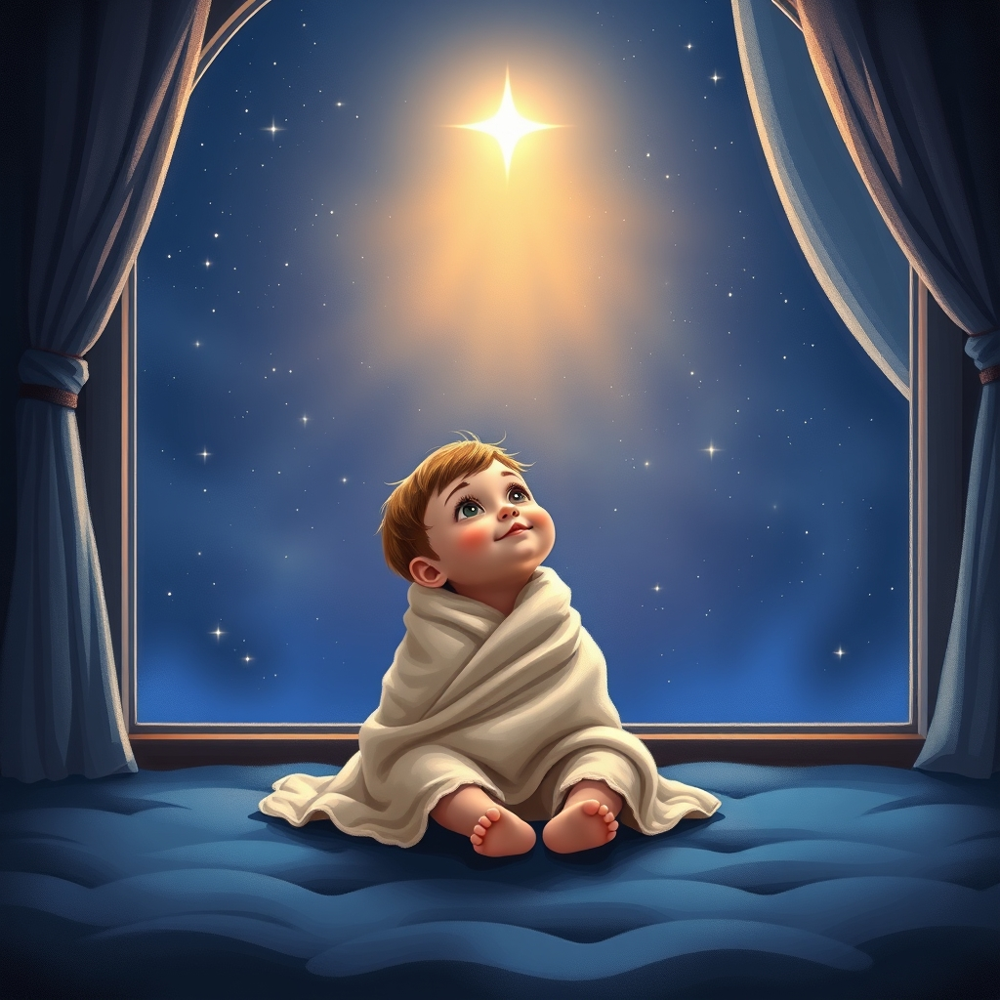

[Home](../index.md) > [Topics](./index.md) > [🧸🎶🧸 Nursery Rhymes](./nursery-rhymes.md)  
# [⭐✨🌟💫 The Star](https://www.poetryfoundation.org/poems/45316/the-star-56d224c697fbe)  
  
- By Jane Taylor (1783–1824)  
- First published in 1806 in the collection Rhymes for the Nursery, co-authored with her sister, Ann Taylor.  
## 🎶 Lyrics  
✨ Twinkle, twinkle, little star,  
🤔 How I wonder what you are!  
⬆️ Up above the world so high,  
💎 Like a diamond in the sky.  
  
🔥 When the blazing sun is gone,  
🌑 When he nothing shines upon,  
💡 Then you show your little light,  
✨ Twinkle, twinkle, all the night.  
  
🚶 Then the trav'ller in the dark,  
🙏 Thanks you for your tiny spark,  
🧭 He could not see which way to go,  
✨ If you did not twinkle so.  
  
🌌 In the dark blue sky you keep,  
👀 And often thro' my curtains peep,  
👁️ For you never shut your eye,  
☀️ Till the sun is in the sky.  
  
✨ 'Tis your bright and tiny spark,  
🔦 Lights the trav'ller in the dark:  
🤔 Tho' I know not what you are,  
⭐ Twinkle, twinkle, little star.  
  
## 🤔 Evaluation  
* 👶 The poem's perspective, authored by Jane Taylor, is a child's expression of wonder and awe at a star and its practical purpose.  
* 🔬 The poem is pre-scientific, describing the star as a jewel-like object in the sky that acts as a guide.  
* 🔭 Scientific sources offer a modern, contrasting understanding.  
    * ⚛️ NASA and other astrophysical organizations explain that stars are massive, luminous balls of plasma held together by their own gravity, contrasting the poem's description of a tiny spark.  
    * 💫 The twinkling (scintillation) described is not an inherent quality of the star but an effect caused by the Earth's atmosphere , according to astronomy texts like [🌌 Cosmos](../books/cosmos.md) by Carl Sagan.  
* 💡 Topics to explore for a better understanding include:  
    * ⚓ The history of celestial navigation: How did stars serve as essential guides for travellers and mariners before modern GPS?  
    * 📝 The literary history of children's poetry: What role did Jane Taylor's work play in shaping the genre and its themes of innocence and wonder?  
    * 🎭 Literary interpretations of stars: Compare Taylor's poem with other works, such as Sara Teasdale's Stars (themes of eternity) or Henry Vaughan's The Star (themes of spirituality), to explore how the celestial object has been used as a literary device.  
  
## ❓ Frequently Asked Questions (FAQ)  
  
### ✨ Q: What is the main message of The Star poem by Jane Taylor?  
🌟 A: The main message of The Star is an expression of a child's simple wonder and amazement at a twinkling star. It also acknowledges the star's function as a tiny light that guides the traveller in the dark, emphasizing its beauty and usefulness in the night sky.  
  
### 🎶 Q: What famous song is based on The Star poem?  
🎵 A: The famous song based on the poem The Star by Jane Taylor is the popular English lullaby Twinkle, Twinkle, Little Star. The poem's lyrics were set to the French melody Ah! vous dirai-je, maman (also used for the Alphabet song) and first published with the music in 1838.  
  
### 🖼️ Q: What literary devices are used in The Star poem?  
✍️ A: Literary devices used in Jane Taylor's poem The Star include Simile, such as the star being Like a diamond in the sky, and Personification, where the star is described as having an eye that it never shuts. Apostrophe is also present, as the speaker directly addresses the star.  
  
## 📚 Book Recommendations  
  
### ↔️ Similar  
* [🐰🥕 The Tale of Peter Rabbit](../books/the-tale-of-peter-rabbit.md) by Beatrix Potter: Focuses on the natural world and is an enduring work of classic children's literature with simple, memorable language and rhyme.  
* 🌍 A Child's Garden of Verses by Robert Louis Stevenson: A collection of poetry written from the perspective of a child, exploring imaginative themes related to play, the outdoors, and everyday life.  
  
### 🆚 Contrasting  
* [🤏📜⏳ A Brief History of Time](../books/a-brief-history-of-time.md) by Stephen Hawking: Explores the scientific mysteries of the universe, stars, and time from a complex physics perspective, completely contrasting the poem's innocent, pre-scientific view.  
* 📜 The Norton Anthology of English Literature: Provides a vast collection of more complex and adult English poetry across many centuries, offering a counterpoint to the simplicity of nursery verse.  
  
### 🎨 Creatively Related  
* [🤴 The Little Prince](../books/the-little-prince.md) by Antoine de Saint-Exupéry: A philosophical tale where a young prince travels between planets, exploring themes of loneliness, friendship, and the wonder of stars from a humanitarian perspective.  
* 💡 The History of the Telescope by Henry C. King: Details the evolution of the tool that allowed humanity to move beyond the naked-eye view of the stars described in the poem to a deeper scientific understanding.