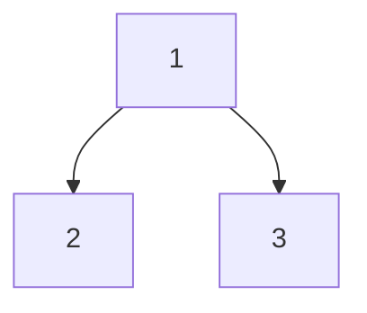
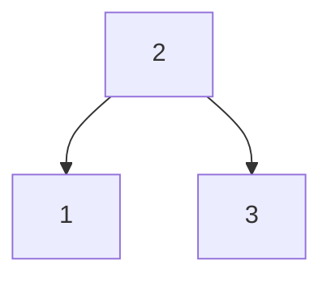
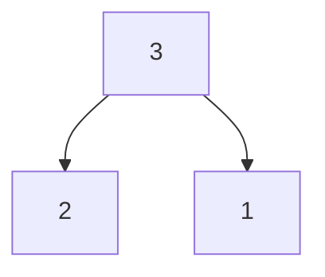

---  
share: true  
aliases:  
  - Tree Traversal  
title: Tree Traversal  
---  
[Home](../index.md) > [Topics](./index.md)  
# Tree Traversal  
From Wikipedia: [Tree traversal](https://wikipedia.org/wiki/Tree_traversal)  
- In-order, pre-order, and post-order are 3 common forms of depth-first tree traversal.  
- While traversing a non-linear data structure (such as a tree) we have choices for which node to visit next.  
  - Therefore, we must store references to nodes we're not visiting yet for later retrieval.  
  - This is commonly done explicitly in a stack or queue, or implicitly in the call stack of a recursive function.  
- Depth-first search is easily implemented with a stack (explicitly or implicitly via the call stack).  
- The sequence of nodes visited in a tree traversal is called a trace.  
- None of these 3 traversal orders produces a trace that uniquely defines a tree.  
🤔 Interesting. This fact doesn't seem obvious to me.  
> Given a tree with distinct elements, either pre-order or post-order paired with in-order is sufficient to describe the tree uniquely. However, pre-order with post-order leaves some ambiguity in the tree structure.  
  
🤔 Okay, so pre-order and post-order traversals have some sort of structural similarity that isn't shared with an in-order traversal.  
  
## Depth-First Traversal Orders  
In depth-first traversals, the children sub-trees are searched recursively.  
  
### Mnemonics  
- Pre-order visits the parent node before (hence pre) the children.  
- Post-order visits the parent node after (hence post) the children.  
- In-order visits the parent node in-between the children.  
  - also: **in-order** traversal would return the elements of a binary search tree **in order**.  
  
### Pre-order  

  
### Post-order  

  
### In-order  

  
### Reverse pre-order  

  
### Reverse post-order  

  
### Reverse in-order  

  
## Level-order  
AKA Breadth-first search (BFS)  
