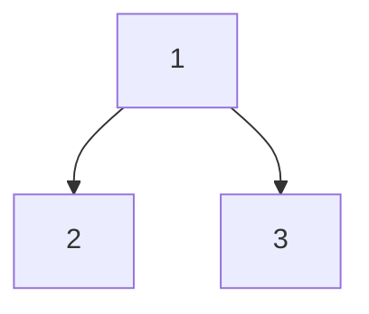
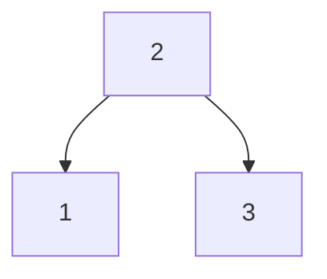
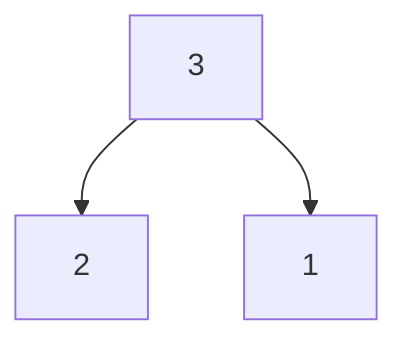

[Home](../index.md) > [Topics](./index.md)  
# 🌳➡️ Tree Traversal  
  
From Wikipedia: [Tree traversal](https://wikipedia.org/wiki/Tree_traversal)  
- In-order, pre-order, and post-order are 3 common forms of depth-first tree traversal.  
- While traversing a non-linear data structure (such as a tree) we have choices for which node to visit next.  
  - Therefore, we must store references to nodes we're not visiting yet for later retrieval.  
  - This is commonly done explicitly in a stack or queue, or implicitly in the call stack of a recursive function.  
- Depth-first search is easily implemented with a stack (explicitly or implicitly via the call stack).  
- The sequence of nodes visited in a tree traversal is called a trace.  
- None of these 3 traversal orders produces a trace that uniquely defines a tree.  
🤔 Interesting. This fact doesn't seem obvious to me.  
> Given a tree with distinct elements, either pre-order or post-order paired with in-order is sufficient to describe the tree uniquely. However, pre-order with post-order leaves some ambiguity in the tree structure.  
  
🤔 Okay, so pre-order and post-order traversals have some sort of structural similarity that isn't shared with an in-order traversal.  
  
## Depth-First Traversal Orders  
In depth-first traversals, the children sub-trees are searched recursively.  
  
### Mnemonics  
- Pre-order visits the parent node before (hence pre) the children.  
- Post-order visits the parent node after (hence post) the children.  
- In-order visits the parent node in-between the children.  
  - also: **in-order** traversal would return the elements of a binary search tree **in order**.  
  
### Pre-order  

```mermaid  
flowchart  
1 --> 2  
1 --> 3  
```  
  
### Post-order  

```mermaid  
flowchart  
3 --> 1  
3 --> 2  
```  
  
### In-order  

```mermaid  
flowchart  
2 --> 1  
2 --> 3  
```  
  
### Reverse pre-order  

```mermaid  
flowchart  
3 --> 2  
3 --> 1  
```  
  
### Reverse post-order  

```mermaid  
flowchart  
1 --> 3  
1 --> 2  
```  
  
### Reverse in-order  

```mermaid  
flowchart  
2 --> 3  
2 --> 1  
```  
  
## Level-order  
AKA Breadth-first search (BFS)  
  
## 🦋 Bluesky    
<blockquote class="bluesky-embed" data-bluesky-uri="at://did:plc:i4yli6h7x2uoj7acxunww2fc/app.bsky.feed.post/3mkvzxm4aoa2o" data-bluesky-cid="bafyreicg7bxxjffkoayw7zvlvv5dudmsefhwwpawjwg3bqq5o6fkpbscpy">
🌳➡️ Tree Traversal  
  
#AI Q: 🌳 Which traversal method makes the most logical sense to you?  
  
🌳 Data Structures | 🔍 Search Algorithms | 🪜 Recursive Functions | 📊 Graph Theory  
https://bagrounds.org/topics/tree-traversal
&mdash; <a href="https://bsky.app/profile/did:plc:i4yli6h7x2uoj7acxunww2fc?ref_src=embed">Bryan Grounds (@bagrounds.bsky.social)</a> <a href="https://bsky.app/profile/did:plc:i4yli6h7x2uoj7acxunww2fc/post/3mkvzxm4aoa2o?ref_src=embed">2026-05-03T01:46:20.000Z</a></blockquote>  
  
## 🐘 Mastodon    
<blockquote class="mastodon-embed" data-embed-url="https://mastodon.social/@bagrounds/116513798427173118/embed" style="background: #282c37; border-radius: 8px; border: 1px solid #393f4f; margin: 0; max-width: 540px; min-width: 270px; overflow: hidden; padding: 0;"> <a href="https://mastodon.social/@bagrounds/116513798427173118" target="_blank" style="align-items: center; color: #d9e1e8; display: flex; flex-direction: column; font-family: system-ui, -apple-system, BlinkMacSystemFont, 'Segoe UI', Oxygen, Ubuntu, Cantarell, 'Fira Sans', 'Droid Sans', 'Helvetica Neue', Roboto, sans-serif; font-size: 14px; justify-content: center; letter-spacing: 0.25px; line-height: 20px; padding: 24px; text-decoration: none;"> <svg xmlns="http://www.w3.org/2000/svg" xmlns:xlink="http://www.w3.org/1999/xlink" width="32" height="32" viewBox="0 0 79 75"><path d="M63 45.3v-20c0-4.1-1-7.3-3.2-9.7-2.1-2.4-5-3.7-8.5-3.7-4.1 0-7.2 1.6-9.3 4.7l-2 3.3-2-3.3c-2-3.1-5.1-4.7-9.2-4.7-3.5 0-6.4 1.3-8.6 3.7-2.1 2.4-3.1 5.6-3.1 9.7v20h8V25.9c0-4.1 1.7-6.2 5.2-6.2 3.8 0 5.8 2.5 5.8 7.4V37.7H44V27.1c0-4.9 1.9-7.4 5.8-7.4 3.5 0 5.2 2.1 5.2 6.2V45.3h8ZM74.7 16.6c.6 6 .1 15.7.1 17.3 0 .5-.1 4.8-.1 5.3-.7 11.5-8 16-15.6 17.5-.1 0-.2 0-.3 0-4.9 1-10 1.2-14.9 1.4-1.2 0-2.4 0-3.6 0-4.8 0-9.7-.6-14.4-1.7-.1 0-.1 0-.1 0s-.1 0-.1 0 0 .1 0 .1 0 0 0 0c.1 1.6.4 3.1 1 4.5.6 1.7 2.9 5.7 11.4 5.7 5 0 9.9-.6 14.8-1.7 0 0 0 0 0 0 .1 0 .1 0 .1 0 0 .1 0 .1 0 .1.1 0 .1 0 .1.1v5.6s0 .1-.1.1c0 0 0 0 0 .1-1.6 1.1-3.7 1.7-5.6 2.3-.8.3-1.6.5-2.4.7-7.5 1.7-15.4 1.3-22.7-1.2-6.8-2.4-13.8-8.2-15.5-15.2-.9-3.8-1.6-7.6-1.9-11.5-.6-5.8-.6-11.7-.8-17.5C3.9 24.5 4 20 4.9 16 6.7 7.9 14.1 2.2 22.3 1c1.4-.2 4.1-1 16.5-1h.1C51.4 0 56.7.8 58.1 1c8.4 1.2 15.5 7.5 16.6 15.6Z" fill="currentColor"/></svg> 
Post by @bagrounds@mastodon.social
 
View on Mastodon
 </a> </blockquote> 