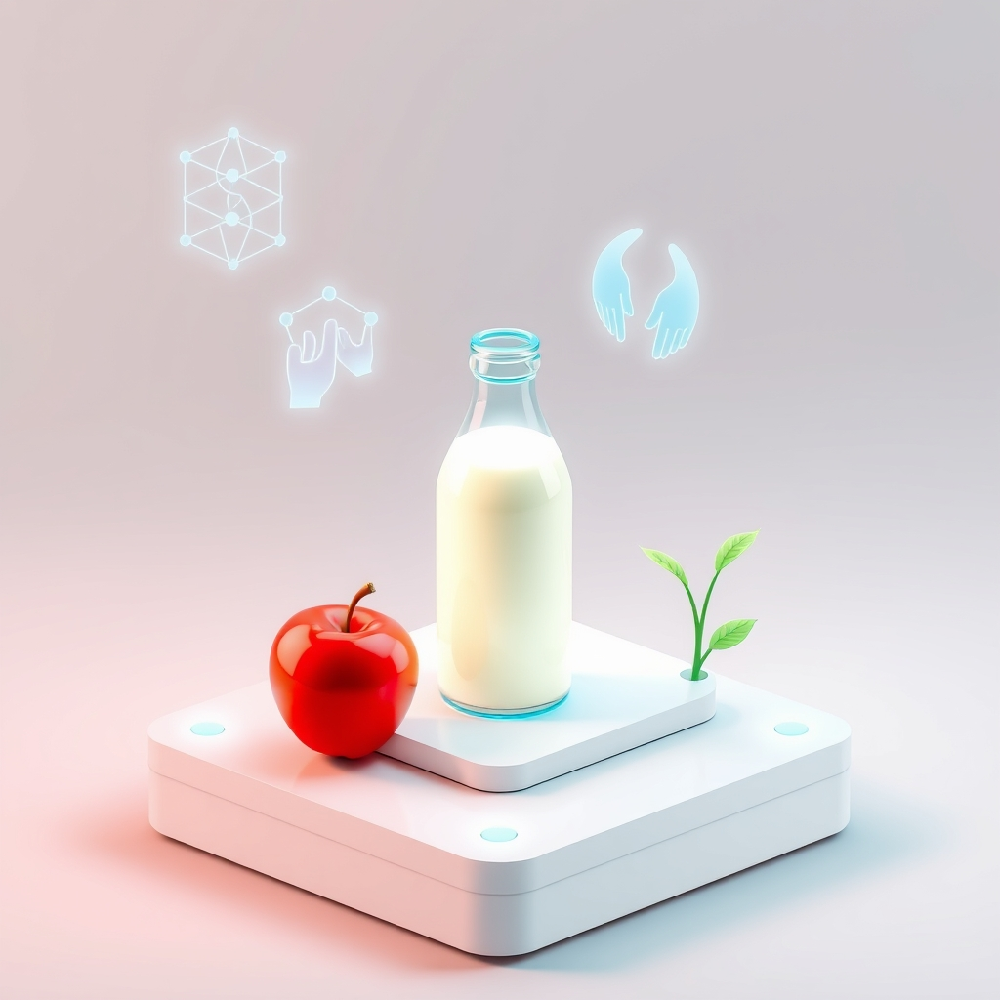

[Home](../index.md) > [Topics](./index.md)  
# 🍎🥛🔬✨ Universal Nutrition System Design  
  
  
## 🍎 Functional Goals  
- 🥗 Nutrition  
    - 👨‍👩‍👧‍👦 Everyone can eat for free  
        - 🤲 Starting with the most needy  
    - 🏠 At or close to home  
    - ⏱️💨 At lower time and effort costs over time  
- 📚 Education  
    - 🧠 Everyone can learn how the system works  
    - 💪 has the opportunity to participate in operations  
- 🎁 Charity  
    - 🌎 Excess is shared with needy neighbors  
  
## 🛡️ Non Functional Goals  
- 💪 Durability  
    - 🌊 Functional goals are resilient to personal, community, and national shocks  
- ⚡ Efficiency  
    - 💰 Resource and labor costs decline over time  
    - 🗑️ Unnecessary waste is minimized  
- 🌱 Sustainability  
    - ♻️ Indefinite balance of consumption and replenishment  
- 🔒 Security  
    - ⚔️ Defensible against physical and political attacks  
- 👁️ Transparency  
    - 🌐 Open access to  
        - 📊 operating statistics  
        - 📝 experience reports  
        - 🔬 research  
- 🚀 Continuous improvement  
    - 🎉 everyone may contribute to and benefit from innovation