---  
share: true  
aliases:  
  - How to Force Your Brain To Be Motivated (when you don’t feel like it)  
title: How to Force Your Brain To Be Motivated (when you don’t feel like it)  
URL: https://youtu.be/RMB3NsQotvM  
Author:   
Platform: "#YouTube"  
Channel: "[[Justin Sung]]"  
tags:   
---  
[Home](../index.md) > [Videos](./index.md)  
# How to Force Your Brain To Be Motivated (when you don’t feel like it)  
  
- Motivation is fickle  
- Anything that depends on motivation will also be fickle  
- How can we avoid motivation-dependent productivity?  
- Break the automatic links between feelings and thoughts or thoughts and actions  

```mermaid  
flowchart LR  
F("🫀Feelings") -- ❌ --> T("🧠Thoughts") -- ❌ --> A("🏃Actions")  
```  

  
## The DFUZ ("defuse") Method  
- **Distinguish** between feelings, thoughts, and actions  
  - Feeling demotivated does not require acting demotivated  
- **Fake** the emotion you'd like to have by acting like someone who displays that emotion  
- **Uptime**  
  - gradually increase the amount of time we can act differently than how we feel  
- **Zone**  
  - Create a zone of focus  
  - Note distractions as they occur  
  - Systematically eliminate distractions from the zone  
