[Home](../index.md) > [Videos](./index.md)  
# How to Force Your Brain To Be Motivated (when you don’t feel like it)  
  
- 💪 Motivation is fickle  
- 📉 Anything that depends on motivation will also be fickle  
- 🤔 How can we avoid motivation-dependent productivity?  
- 🔗 Break the automatic links between feelings and thoughts or thoughts and actions. 🧠✨  

```mermaid  
flowchart LR  
F("🫀Feelings") -- ❌ --> T("🧠Thoughts") -- ❌ --> A("🏃Actions")  
```  
  

  
## 💣 The DFUZ ("defuse") Method  
- 🧠 **Distinguish** between feelings 😔, thoughts 🤔, and actions 🏃‍♀️  
  - 😞 Feeling demotivated does not require acting demotivated 🙅‍♀️  
- 🎭 **Fake** the emotion you'd like to have 🤩 by acting like someone who displays that emotion 🥳  
- ⏰ **Uptime**  
  - 📈 gradually increase the amount of time we can act differently than how we feel 💪  
- 📍 **Zone**  
  - 🎯 Create a zone of focus 🧘‍♀️  
  - 🚨 Note distractions as they occur ✍️  
  - 🚫 Systematically eliminate distractions from the zone ✨  
  
---  
  
## 🤖 AI Summary  
### ⭐ **Introduction: 🪤 The Motivation Trap**  
- 🧑‍💼 Many people struggle with staying motivated, especially when 😴 feeling lazy or 🔥 burnt out.  
- 🔑 The key issue is being 😩 **"motivation dependent"**, meaning 📉 productivity fluctuates based on how motivated we feel.  
- 📣 Instead, the speaker introduces a 🪜 **four-step method called DEFUSE**, which promotes ✨ **"motivation enhancement"**—allowing 🚀 productivity regardless of motivation levels. 💪  
  
### ⚠️ **The Problem with Motivation Dependency**  
- 🎢 Motivation fluctuates due to 🌍 external (💰 money, 🏆 rewards, 👥 social pressure) and 🧠 internal factors (🔋 energy levels, 😞 mood, 😴 sleep).  
- ⚠️ Relying on motivation means 📉 **inconsistency in productivity**.  
- 🔬 Research suggests 🧠 **willpower depletion** can lead to 🔥 burnout, making it harder to 🌱 sustain long-term success.  
  
### ✨ **The DEFUSE Method: 4️⃣ Steps to Sustainable Productivity** 🚀  
#### 🛑 **1. D – Distinguish (Separate Feelings, Thoughts, and Actions)** 🤔  
- 🧠 Recognize that 😴 **feeling tired or lazy is just a sensation**, 🚫 not a command to stop working. 💪  
- 🗣️ Example: Feeling anxious 😬 before a public speech can be 🌈 **reframed as excitement**, 🔄 changing our response to stress. 😥➡️😄  
- 💡 This technique, known as **[Thought-Action Defusion](../bot-chats/effective-thought-action-defusion-techniques.md)**, 👩‍⚕️ is widely used in clinical psychology. ⚕️.  
  
#### ✨ **2. 🎭 F – Fake (Act as If You’re Motivated)**  
- 🎭 Instead of waiting to feel motivated, 🎬 **pretend to be productive**, just like an actor in a movie. 😴 Waiting for motivation is like ⏳ waiting for a miracle! 🙅‍♂️ Don't wait!  
  
- 🏃‍♀️ Example: A tired athlete still trains because 🎭 **they act like someone who isn’t tired**. 🏋️ Even when exhausted, athletes 🧠 embody the mindset of someone ⚡ energized. 🏆 This leads to success!  
  
- 🧠 Actions shape thoughts—by 🎭 **acting productive**, we start feeling more motivated. 📈 This creates a positive feedback loop! 🎉 Keep acting, keep feeling! 🚀  
  
#### ✨ **3. U – ⏰ Uptime (📈 Gradually Increase Focus Periods)**  
- ⏳ Extend the time you can function without motivation.  
- 🚀 Start with **🔟 10 minutes of focused work**, then 📈 increase gradually.  
- 🧠 Neuroplasticity 🔄 allows the brain to adapt, making this state easier to 💪 sustain over time. ⏳✨  
  
#### **4. 📍 Z – 🧘‍♀️ Zone (Create a 🚫 Distraction-Free 🏢 Work 🌍 Environment)**  
- 💡 Identify 🗣️ common 📱 distractions (📞 phone, 🔔 notifications, 🗑️ clutter) and ❌ remove them.  
- ⚙️ Use ✨ **focus-enhancing 🛠️ tools** like 🚫 app 🚧 blockers, 🖥️ dedicated 💼 workspaces, and 📅 structured 🔄 routines.  
- 🎯 The 🥅 goal is to 📉 **reduce 💪 reliance on 🧠 willpower** by 🏗️ creating an 🏞️ environment that ✅ supports 🎯 focus.  
  
### ✨ **Key Takeaways: Becoming Motivation Enhanced** 💪  
  
- 💡 You **don’t need motivation** to be productive—you need ⚙️ **systems and strategies**.  
- 🛡️ **DEFUSE helps separate feelings from actions**, allowing for 🚀 consistent performance.  
- ⏳ Over time, applying DEFUSE reduces 🚫 procrastination, 🔥 burnout, and the need for 🌟 external motivation.  
  
### **Further Learning Resources**  
- **Books on Productivity:**  
  - *[Atomic Habits](../books/atomic-habits.md)* by James Clear (habit formation)  
  - *[The War of Art](../books/the-war-of-art.md)* by Steven Pressfield (overcoming resistance)  
  - *[Deep Work](../books/deep-work.md)* by Cal Newport (focused productivity)  
- **Scientific Research:**  
  - Willpower depletion studies: [Baumeister’s research on ego depletion](https://en.wikipedia.org/wiki/Ego_depletion)  
  - Cognitive behavioral therapy (CBT) techniques for thought-action defusion  
- **Tools for Focus:**  
  - [Freedom](https://freedom.to/) (blocks distracting websites)  
  - [Pomodone](https://pomodoneapp.com/) (Pomodoro timer for task management)  
