[Home](../index.md) > [Videos](./index.md)  
# How to Force Your Brain To Be Motivated (when you don’t feel like it)  
  
- Motivation is fickle  
- Anything that depends on motivation will also be fickle  
- How can we avoid motivation-dependent productivity?  
- Break the automatic links between feelings and thoughts or thoughts and actions  

```mermaid  
flowchart LR  
F("🫀Feelings") -- ❌ --> T("🧠Thoughts") -- ❌ --> A("🏃Actions")  
```  

  
## The DFUZ ("defuse") Method  
- **Distinguish** between feelings, thoughts, and actions  
  - Feeling demotivated does not require acting demotivated  
- **Fake** the emotion you'd like to have by acting like someone who displays that emotion  
- **Uptime**  
  - gradually increase the amount of time we can act differently than how we feel  
- **Zone**  
  - Create a zone of focus  
  - Note distractions as they occur  
  - Systematically eliminate distractions from the zone  
  
## AI Summary  
  
### **Introduction: The Motivation Trap**    
- Many people struggle with staying motivated, especially when feeling lazy or burnt out.    
- The key issue is being **"motivation dependent"**, meaning productivity fluctuates based on how motivated we feel.    
- Instead, the speaker introduces a **four-step method called DEFUSE**, which promotes **"motivation enhancement"**—allowing productivity regardless of motivation levels.    
  
### **The Problem with Motivation Dependency**    
- Motivation fluctuates due to external (money, rewards, social pressure) and internal factors (energy levels, mood, sleep).    
- Relying on motivation means **inconsistency in productivity**.    
- Research suggests **willpower depletion** can lead to burnout, making it harder to sustain long-term success.    
  
---  
  
### **The DEFUSE Method: Four Steps to Sustainable Productivity**    
  
#### **1. D – Distinguish (Separate Feelings, Thoughts, and Actions)**    
- Recognize that **feeling tired or lazy is just a sensation**, not a command to stop working.    
- Example: Feeling anxious before a public speech can be **reframed as excitement**, changing our response to stress.    
- This technique, known as **[Thought-Action Defusion](../bot-chats/effective-thought-action-defusion-techniques.md)**, is widely used in clinical psychology.    
  
#### **2. F – Fake (Act as If You’re Motivated)**    
- Instead of waiting to feel motivated, **pretend to be productive**, just like an actor in a movie.    
- Example: A tired athlete still trains because **they act like someone who isn’t tired**.    
- Actions shape thoughts—by **acting productive**, we start feeling more motivated.    
  
#### **3. U – Uptime (Gradually Increase Focus Periods)**    
- Extend the time you can function without motivation.    
- Start with **10 minutes of focused work**, then increase gradually.    
- Neuroplasticity allows the brain to adapt, making this state easier to sustain over time.    
  
#### **4. Z – Zone (Create a Distraction-Free Work Environment)**    
- Identify common distractions (phone, notifications, clutter) and remove them.    
- Use **focus-enhancing tools** like app blockers, dedicated workspaces, and structured routines.    
- The goal is to **reduce reliance on willpower** by creating an environment that supports focus.    
  
---  
  
### **Key Takeaways: Becoming Motivation Enhanced**    
- You **don’t need motivation** to be productive—you need **systems and strategies**.    
- **DEFUSE helps separate feelings from actions**, allowing for consistent performance.    
- Over time, applying DEFUSE reduces procrastination, burnout, and the need for external motivation.    
  
### **Further Learning Resources**    
- **Books on Productivity:**    
  - *[Atomic Habits](../books/atomic-habits.md)* by James Clear (habit formation)    
  - *The War of Art* by Steven Pressfield (overcoming resistance)    
  - *Deep Work* by Cal Newport (focused productivity)    
- **Scientific Research:**    
  - Willpower depletion studies: [Baumeister’s research on ego depletion](https://en.wikipedia.org/wiki/Ego_depletion)  
  - Cognitive behavioral therapy (CBT) techniques for thought-action defusion    
- **Tools for Focus:**  
  - [Freedom](https://freedom.to/) (blocks distracting websites)    
  - [Pomodone](https://pomodoneapp.com/) (Pomodoro timer for task management)  
