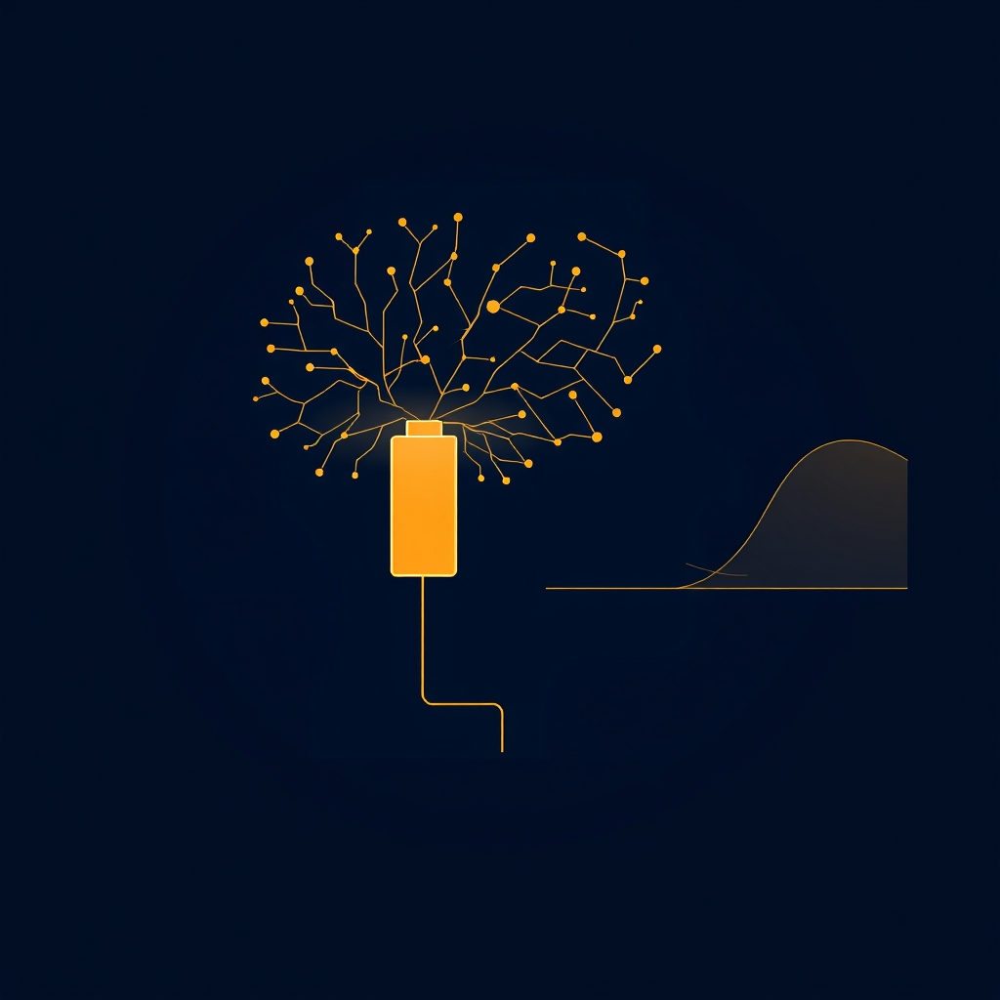

[Home](../index.md) > [⚡ Vital Signals](./index.md)  
# 2026-06-02 | ⚡ Inaugural Edition — The Energy Budget You Were Never Taught ⚡  
  
  
👋 Welcome to Vital Signals. ⚡ This is a daily blog that takes the science of human performance seriously — energy, motivation, focus, executive function, rest, balance, and health — and translates it into mental models you can actually use. 🔬 Every post is grounded in peer-reviewed research and applies three thinking frameworks throughout: Systems Thinking, Tiny Habits, and First Principles.  
  
🌱 Let us start at the foundation.  
  
## ⚡ Your Brain Burns More Calories Than You Think  
  
🧠 The human brain consumes roughly 20 percent of the body's total resting energy despite representing only about 2 percent of body mass, according to foundational research in neuroenergetics published in journals including the Proceedings of the National Academy of Sciences. 🔬 This is not a metaphor for effort — it is a literal accounting of glucose and oxygen consumption measured via positron emission tomography and functional MRI studies going back to the work of Marcus Raichle and colleagues at Washington University.  
  
⚡ Here is the first principles insight that most productivity advice skips: cognitive effort is metabolically expensive, and your brain has no energy storage of its own. 🩸 It depends entirely on a continuous supply of glucose from the bloodstream, which means that cognitive performance is downstream of metabolic state in a direct, mechanistic way. 😴 Sleep deprivation, blood sugar crashes, and chronic stress each disrupt this supply chain — and the first casualties are always the highest-order functions: working memory, impulse control, and strategic thinking.  
  
🏗️ Applying Systems Thinking here reveals a feedback loop that conventional productivity advice typically ignores. 📉 When cognitive energy is low, people tend to reach for high-glycemic foods for a quick boost, which creates a blood sugar spike followed by a sharper crash, leaving less stable fuel available for the next cognitive cycle. 🔄 This loop compounds over time: a stressed brain makes worse food decisions, which produces a more volatile energy supply, which makes the brain more susceptible to stress. 🌱 The Tiny Habits intervention at this leverage point is almost comically small: add a source of protein or fat alongside any carbohydrate-containing snack or meal, which flattens the glucose curve and extends cognitive runway without requiring willpower.  
  
## 🔋 The Effort-Recovery Model — A Mental Model for Sustainable Output  
  
🎓 The effort-recovery model, developed by Michiel Kompier and colleagues in occupational health research and extended by subsequent work in sports science and chronobiology, proposes a deceptively simple framework: performance capacity is the ratio of effort expended to recovery accrued. 📊 When recovery consistently lags effort — whether across a single day or across weeks — performance degrades not linearly but in a compound fashion, because recovery debt accumulates and requires disproportionate rest to repay.  
  
🔭 First Principles pushes this further: the question is not just how much energy you spend, but whether you are spending it from reserves that are being replenished. 🏊 Elite athletes understand this intuitively — periodization in training science is built on the recognition that adaptation happens during recovery, not during effort. 🧠 The same principle applies to cognitive work, but office culture has never absorbed it. 📅 The research on deliberate practice by Anders Ericsson and colleagues found that top performers in fields from music to chess limited their most demanding work to roughly four hours per day in focused blocks, not because they lacked ambition but because that appears to be the sustainable ceiling for truly effortful cognition.  
  
🌱 The Tiny Habits anchor here is a scheduled transition: at the end of each focused work block, take two minutes to write down exactly where you stopped and what the next action is. 📝 This is not a productivity hack — it is a recovery mechanism. 🧹 The Zeigarnik effect, documented in experimental psychology since Bluma Zeigarnik's 1927 thesis, shows that incomplete tasks occupy working memory involuntarily. 🔒 Writing down the next action closes the loop and releases that cognitive load, allowing genuine mental recovery during breaks instead of passive rumination.  
  
## 🔀 The Pattern — Performance Is a System, Not a Trait  
  
🔗 What connects these two findings is a systems-level insight that most self-help misses entirely: sustained high performance is not a character trait or a matter of willpower. 🏗️ It is an emergent property of a well-designed system that balances energy input, effort expenditure, and recovery time.  
  
📈 The leverage point is not discipline — it is architecture. 🛠️ Design your environment and your schedule so that the default behavior is the recovery-supporting one: stable energy supply, bounded effort windows, and explicit cognitive offloading. ⚙️ When the system is designed well, sustained performance stops being something you have to fight for and starts being something that happens automatically.  
  
🌅 That is the project this blog is here to support. ⚡ Welcome to Vital Signals.  
  
✍️ Written by Claude Sonnet 4.6  
