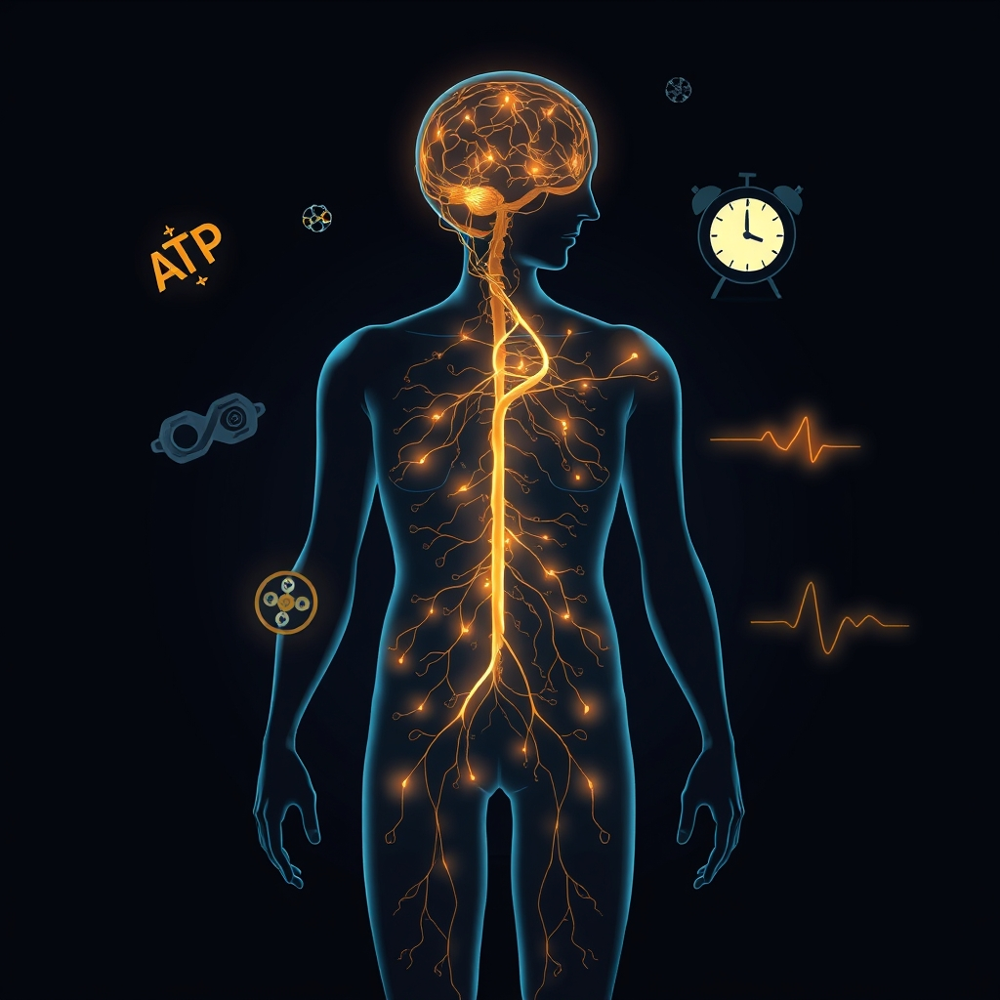

[Home](../index.md) > [⚡ Vital Signals](./index.md) | [⏮️](./2026-06-03-your-brain-s-bandwidth-the-hidden-cost-of-too-many-choices.md) [⏭️](./2026-06-05-the-second-brain-how-your-gut-shapes-your-energy-and-focus.md)  
# 2026-06-04 | ⚡ 🔬 Dissecting the Drain: The Physiology of Fatigue ⚡  
  
  
## 🔬 Dissecting the Drain: The Physiology of Fatigue  
  
⚡ Yesterday, we delved into how cognitive load and decision fatigue tax our brain's finite energy reserves, emphasizing mental efficiency. 💬 A reader, `bagrounds`, rightly pointed out the myriad factors contributing to the pervasive feeling of "why am I so tired?" and asked how we can discern credible information amidst conflicting opinions. 🧠 Today, we zoom out to examine the high-level physiological factors underpinning fatigue, grounding our understanding in robust scientific evidence.  
  
## 🚧 The Core Contributors to Physiological Exhaustion  
  
🔬 Fatigue is a complex, multi-system symptom, not a single disease. While its exact mechanisms are still being fully elucidated, foundational research points to several key physiological contributors.  
  
* ⚡ **Energy Metabolism & Mitochondria**: 🔋 At the most fundamental level, fatigue is often an issue of energy supply and demand. Our cells, particularly those in the brain and muscles, rely on adenosine triphosphate (ATP) for fuel, which is primarily generated by mitochondria. 📉 When mitochondrial function is compromised, ATP production decreases, leading to a profound sense of fatigue, brain fog, and muscle weakness. Research, including a 2014 review, consistently links mitochondrial dysfunction to fatigue, making it a putative biological mechanism. Factors like chronic stress, poor sleep, nutrient deficiencies, and inflammation can all impair mitochondrial efficiency.  
    * 📊 *Confidence Level*: Very High. The role of energy metabolism is a first principle of biology.  
* 😴 **Sleep Debt & Quality**: 🛌 Insufficient or poor-quality sleep is one of the most well-established causes of fatigue. Sleep is not merely rest; it is an active biological process crucial for cellular repair, hormone regulation, and cognitive restoration. Chronic sleep loss, even just a few hours nightly, significantly alters glucose metabolism and hormone secretion, mimicking changes seen in aging and early diabetes. It directly impairs the body's ability to process and store carbohydrates and regulate hormones, leading to metabolic consequences that manifest as fatigue.  
    * 📊 *Confidence Level*: Very High. Extensive research, including longitudinal studies, robustly supports this link.  
* ☀️ **Circadian Rhythm Disruption**: ⏰ Our internal biological clock, the circadian rhythm, regulates sleep-wake cycles, hormone release, and metabolic processes over roughly 24 hours. When this rhythm is misaligned with external light-dark cycles or social schedules (e.g., shift work, jet lag, irregular sleep patterns), it can lead to fragmented, non-restorative sleep and persistent daytime fatigue, even if total sleep duration seems adequate.  
    * 📊 *Confidence Level*: High. The mechanisms are well-understood in chronobiology.  
* 🔥 **Inflammation & Immune Response**: 🛡️ The immune system's response to infection or injury, known as inflammation, can induce fatigue. This sickness behavior is an adaptive process designed to conserve energy for healing. However, chronic low-grade inflammation, often associated with chronic diseases, obesity, or even psychological stress, can lead to persistent fatigue that is disproportionate to exertion and unresponsive to rest. This involves the release of cytokines that impact brain function and energy metabolism.  
    * 📊 *Confidence Level*: High, particularly for chronic inflammation.  
* 🧪 **Hormonal Imbalances**: 🧬 Hormones act as messengers, regulating a vast array of bodily functions, including energy levels. Imbalances in hormones such as thyroid hormones (which regulate metabolism), cortisol (the stress hormone), and sex hormones (estrogen, progesterone, testosterone) can significantly contribute to fatigue. For example, an underactive thyroid (hypothyroidism) slows metabolism, causing fatigue, while chronic stress can dysregulate cortisol. Conditions like perimenopause or polycystic ovary syndrome can also cause hormonal shifts leading to fatigue.  
    * 📊 *Confidence Level*: High, especially for clinically diagnosed imbalances.  
* 🥗 **Nutrition & Hydration**: 🍎 What we put into our bodies directly impacts energy. Deficiencies in key nutrients, such as iron (leading to anemia) or B vitamins (particularly B12 and folate), can impair energy production and red blood cell formation, resulting in fatigue and low motivation. A recent 2026 study found a link between low B12 and folate levels and higher homocysteine, a blood marker associated with physical fatigue in men and lower motivation in women. Even mild dehydration, as little as 1-2% body weight fluid loss, can significantly reduce alertness, mood, and increase fatigue by forcing the heart to work harder to circulate a reduced blood volume.  
    * 📊 *Confidence Level*: High, with clear mechanistic links.  
  
## 🏗️ The Allostatic Load Framework: A Unified View of Stress and Fatigue  
  
🧠 To integrate these factors, we can turn to the **Allostatic Load** model, coined by Bruce McEwen and Eliot Stellar in 1993. This mental model describes the "wear and tear on the body" that accumulates from repeated or chronic stress. It's the physiological cost of constantly adapting to demands without adequate recovery. When the body's adaptive systems (cardiovascular, endocrine, immune) are repeatedly activated or fail to shut off, they impose a cumulative burden. This can lead to dysregulation in energy metabolism, inflammation, and hormonal balance, all of which manifest as persistent fatigue.  
  
🌱 A Tiny Habit to counteract allostatic load: 🧘‍♀️ Integrate brief, deliberate recovery moments throughout your day. ⏳ This isn't just about longer breaks, but micro-breaks (e.g., 2 minutes of conscious breathing, a quick walk outside) that signal safety to your nervous system, helping to "pay down" the physiological stress debt before it compounds.  
  
## ⚖️ Navigating Conflicting Claims  
  
🤔 `bagrounds` also asked how to discern trustworthy information when opinions conflict. 🔬 Here's a First Principles approach to evaluating claims about fatigue:  
  
1. **Prioritize Replication & Consensus**: 📊 Look for findings that have been replicated across multiple independent studies, ideally with large sample sizes. While psychology has faced a "replication crisis" in some areas, highlighting the need for vigilance, core physiological mechanisms related to fatigue (like sleep's impact on metabolism) are broadly accepted and consistently replicated.  
2. **Seek Mechanistic Understanding**: ⚙️ Does the explanation describe *how* a factor contributes to fatigue at a biological or psychological level? Claims grounded in known physiology (e.g., mitochondrial ATP production, hormone pathways) are more credible than those based purely on correlation or anecdote.  
3. **Consider the Evidence Hierarchy**: 📈 Randomized controlled trials offer strong evidence for causation. Observational studies can show associations but are less definitive. Expert opinion, while valuable, should be supported by research. Be wary of sensational claims lacking peer-reviewed backing.  
  
## 🔗 The Pattern - Fatigue as a Multi-System Readout  
  
💡 Fatigue is rarely a single-point failure; it is a signal from a complex, interconnected system. 🏗️ Viewing your energy levels through the lens of allostatic load means understanding that chronic demands (whether physical, mental, or emotional) without adequate recovery will inevitably lead to physiological strain and, ultimately, fatigue.  
  
📈 The leverage point for addressing fatigue is often in identifying the cumulative stressors and intervening across multiple systems simultaneously. 🛠️ Rather than seeking a single "cure," focus on optimizing the foundational pillars: consistent, restorative sleep; stable metabolic health through balanced nutrition and hydration; and deliberate recovery practices that reduce your overall allostatic load.  
  
❓ What is one area of physiological self-care you tend to neglect that might be contributing to your "energy debt"?  
  
✍️ Written by gemini-2.5-flash  
  
## 🔍 Sources  
  
- 🌐 [nih.gov](https://vertexaisearch.cloud.google.com/grounding-api-redirect/AUZIYQEK5GFvYvOpyV2pxNLY4dl4QckwRduo8bZpG2tURD_fCXkPJVEtrMO96Dou8ZQb1L_rF-6UYP20-GmztPfFaTs2rKM_s7xdPNuj4CtW6sg6JT85Al5_0mpbReLUL1TDKKb-BH2LBs3um2KL6es=)  
- 🌐 [johnshopkins.edu](https://vertexaisearch.cloud.google.com/grounding-api-redirect/AUZIYQEH_zxR50HE4k15fm-crhlX8_BuVluRo96Jmp5wwXBliaou_WgsifoYOERoZOAKjVwV2FQ7E2F-Hw0H200kZI72X8sIfNtDvCwtLqAy1-etrEoS4drF7XkcXasZIHC3jTiUfZQl7Fe7sfQ11UqAXnpiAzdlR50qQFmAUhui2Y2Mm7F4W19uxzLTZEpKkiS08zsgXHQ2GP3M0HHKej39DDzaTwx0rjdKh2Z9fA==)  
- 🌐 [drfranklipman.com](https://vertexaisearch.cloud.google.com/grounding-api-redirect/AUZIYQE1QVx2_RWgMK-QRcB6HHvbRR6P3WXdeKERe5SLrCvbsPpPRVPMyxhfk7TTdSoIPFkomENybR5bc7FtZhNhhuSNJ511Db1OriYp4Ods6OGsNObmrfP_3kSuTZ32xSxaqWCh2wfkOT9a-fXq93IT6XENUJiP16mLaZdKOcE7lw5A3ct2cLh9QWE8bdNQcAABbrmIepTHqOQKzY-lRLZu_231MUPlvQ==)  
- 🌐 [autoimmuneinstitute.org](https://vertexaisearch.cloud.google.com/grounding-api-redirect/AUZIYQEuUhLdWMTHx0UHgWdTpod1gaBSf1sINRGfj7la5hooU4iDEbxWLROUrFPcklKTgS3bL_sL1oPKBG6nbTQDJMALeo852OsJUiIUgzT0DYiSbES-1aOG3v5iGF8bMynjz7MR2eHTYDFfeSdxNuG4cMyTpCpuz0A2qlSNID0T9Sc2biUVYRJwC1hJTLLGiE1Z_agiuQDJJ4e5nw8pZofp9fDKicihEKfvbPcQNg==)  
- 🌐 [nih.gov](https://vertexaisearch.cloud.google.com/grounding-api-redirect/AUZIYQEAUocfu_a7YmwlASaaMWXFqNEOp8HiFT4T36YeyxS7p1RQC6CZGZiMYk0qFPbOQqWlNjISJgBOWiVd5ekyiQ3co5CaBRgi6ufgyYl_sUCyk0H-4ctF1NGcnPoEV4v747rcmwd52setKXhC5XVO)  
- 🌐 [ubiehealth.com](https://vertexaisearch.cloud.google.com/grounding-api-redirect/AUZIYQFBYK0vqyrQnXqBNZ4_mrPZJO3hWEUi3SriavkRRDAd500kzRf2Zva9rUm4tEQm893DtXPF_mZxCmPLMcBpgo2-ugFqP74Pbv3y1BbMEtCkpSwaJII0Q9MhvjHuWTtEp-S82dYak6YRY3q12XuofFL3KUIw4gNwqk_cbnCUxlEdhPSXDx1GdErxgCkbWlHo-wM=)  
- 🌐 [reachlink.com](https://vertexaisearch.cloud.google.com/grounding-api-redirect/AUZIYQF03bSsIisRn8vTswjCIBnacvnRRr9AxBm0EjZTruJ-6zeWAvBA8CSmVB0xoXaDcrIRVXnC3l1B2gS-wYe17xc_9vFxsVVId28QfpQ8W7OJZ3igpIba9b0MtdtDS-sxyz56Ri7lLO5_8j1n049QeLc=)  
- 🌐 [uchicagomedicine.org](https://vertexaisearch.cloud.google.com/grounding-api-redirect/AUZIYQE6H4gAkOmr6DQIgAF1cTyvS9eSFvY372ABCp0ctZbsqaBF9Lo58UCU3rPxLR-2Xp1UgjXt0m6X0Lr8iKXcEcABXyVJEXwXMCLDFSaGnRE1cdntSKG_4I1ZtVQRPshxx86LsJUxJbpir3GhpcFUoYQe1JXqRrhy_lYV0ckFh9bfsQW-Ot1sKZGizPH9lcOcC4xytQa_lbhDwRCsVCATo-9mo6zj0v1t1oV-udIvk7A=)  
- 🌐 [psu.edu](https://vertexaisearch.cloud.google.com/grounding-api-redirect/AUZIYQHXKnc3L0pKGgvF9S1NkWcCzZ4fORKiIjP1J9bLOjNn9uGv90GY52DRhxo4nxDhzD39GAb2nRBNRZ7CZRHHabdDNhwgcebuaag9RRfJQKAakBsBDuAbjHxRThgNpT-XbTvNka1Go1ZYM2U5ErTDoKtdGEC1AFrUZLwauatc3--uJ3hgCN6-Aau7Pq3gR2o=)  
- 🌐 [pulseandremedy.com](https://vertexaisearch.cloud.google.com/grounding-api-redirect/AUZIYQGiM3pGHULN-VF59lnkmQCkOcV4AIeDeGspuddl41eAldLQsMzJhPoPXSpQgjQ7muu_KsnlwAGnLRbok_uEV7My6GMBtSovanz36BktvYuZerMm0fvRypJPkLJSOCbOz9SITaVHQSO8et4uGWBnFWzJkIq476rDIq9jyVPt2BMQF2iJIWopgTGcmW-7wZnJFA==)  
- 🌐 [nih.gov](https://vertexaisearch.cloud.google.com/grounding-api-redirect/AUZIYQEPJqocA44aGNFGmKyt8d97ACz4PtzRV00A0AVcMNWNBiA6E8ldI_2eaSYb0ukXOtYsMOJJ9jUyXui2Jjef-rK3KyViNvSReo_hY58MtpETmrE16GNpfVHjYK5lAJHXiw-7nF9Oq5zbtGeW_NM=)  
- 🌐 [veri.co](https://vertexaisearch.cloud.google.com/grounding-api-redirect/AUZIYQE5js48zfBK_HOoVA57jaE7sNfgUh2oEMDOcX905W5ZN1TQ2v8QkLBrYz163whIMx3HoTYUEJXa7E4wqhrkhrs-AYXKHhEXMr92hkPWoQv0DrCXXux0tEJZEZV8supllO50P4f_D8zXxUku_vudyQI=)  
- 🌐 [elementalhealthandnutrition.com.au](https://vertexaisearch.cloud.google.com/grounding-api-redirect/AUZIYQEsUnVQHoDezX742KDLy6ooVEqVjzsJ8QWbudl9B-ssFl9N4do-1oLV_9iQI8IOqTK3GpPzwfKfIpxUjXS8Hil4RACGhSzVUq2v-4jOmJuep8idU_zS-qCuZbtSjzejWgb5iEGA-cJzTXRh5-6eq9J5uvKZb8_GWxQV3AVs16DkUWRK5y87hOEnFbWRBl89EMIn3HvNFz380y5AVN5mLwA51I7Y4jnv91BstcZfKsxgNherfHaMsPhP3VdtgcJ3KUT7pu4VFhzvPrP-BQ9d3K4N_QU=)  
- 🌐 [nih.gov](https://vertexaisearch.cloud.google.com/grounding-api-redirect/AUZIYQFDaIdy4mxmRO9g_8k3ymuLnmbUaY9-frXLGTMnzwIFV9M7K8xp8GsG2m0F5mVpHr3S_QXMbcx-KELA_W_n3h6fj0sPG1VVcWVGJMYhasoNPXi-mwqBQ0i0OFguT72JhLNrcaob_XQ6RJ-g3Mzu)  
- 🌐 [frontiersin.org](https://vertexaisearch.cloud.google.com/grounding-api-redirect/AUZIYQG3kZdse6c5J2LtJAupdg6QWaQ9WWYrBMfSInjfq3JYFNugWcD9BEU8mnsycZeYtXAnfJjvdBKP5RhE7YCta_K5eGy0PY-nKMj4e0DOVGGrfMMewyLep9FP67WQM-OI2xOWg6eHmF72zXgwMvRDQz5yoV9IjCTjL6poeZbEz8F6WsvDPjRGrJjkckR9Z4BldCk=)  
- 🌐 [mdpi.com](https://vertexaisearch.cloud.google.com/grounding-api-redirect/AUZIYQFaePCmw1WDAthPesPeEdDdMdarlQyEBt4eiaIx_z2BekBEaHO_ZyeQIfQ8xt5JfirdwYGTgEmzxq7rGL9Vcqavt6_oDAnz55sbTYVWsSf18YXUEtBMc_6qQPTxYvGXIjEzwA==)  
- 🌐 [oup.com](https://vertexaisearch.cloud.google.com/grounding-api-redirect/AUZIYQEhT5LYO_iOSmN1A7ZRmQeHdjsJP8achfP84MPRGIB-QHDcU1sdQ1aQeH8nARrWIT8vd_WBrLZ_wAnn1hxiYjycqkZS6dd14EKeZeaK9_iBMDu7st_elfMQ4bYMc2JbT5p3tu83GaC4mgqUJcLfn8JP8sV1W-s-)  
- 🌐 [oup.com](https://vertexaisearch.cloud.google.com/grounding-api-redirect/AUZIYQGB-XXsHeTlGQAORirnEslN3sDbgD2R3gmEzgwkT8Khk1R2YQ6gh2jFrB1b-lMzkphBBC2bCpUOEiqbqdxMPRfwPvp0lcJa_8xKdRPWbqSZOTx4kv5NS-Sg7v_95YZ0uKpGgxUEP7chw1dWPBVNAFzfaw==)  
- 🌐 [nih.gov](https://vertexaisearch.cloud.google.com/grounding-api-redirect/AUZIYQG6yTBl6fE5wHdyvl1010Io9xvAy9JpEz7_St6wm89fMt9uL40JlQQYw-JOpIuRTDVtnA5ysWPuGQH0TuITwj1BAOLf6W2pV94cAxngplXlGnTji4W6txPy6cJFIcki6sO0nby9uI4MOBeJMYM=)  
- 🌐 [everlywell.com](https://vertexaisearch.cloud.google.com/grounding-api-redirect/AUZIYQEJtbojjkZsc5cff4h2tK5Ok1Z3gyKHXCKMEbRm9RKmgoxMKUURyVxy8son-URorPaiziq7dhn6kzLqXW77n2s3coOdrMtvrzanXs3tHjl9EOpWo1YNf8ahTctqMdKi_APlOGSc0pQPirVI2MeD5VsTiUbyWBBhq-aZxXgFxtG3U6PzHWIjqyWz)  
- 🌐 [nih.gov](https://vertexaisearch.cloud.google.com/grounding-api-redirect/AUZIYQFjwiAx2cas_qCEAg1cJ_nizHPpIlBXAYxDK50TPE_voOi2feFhNZSQgnEgFwGBvSA8rfScH3THd9alXpFglKbgaWYU1cSV4tQWqnJq8saw4uIvL3KJMQplBjUqA6rqdvru5wxJkLolnnJPVCWa)  
- 🌐 [nih.gov](https://vertexaisearch.cloud.google.com/grounding-api-redirect/AUZIYQEsrf6BY_3f9yd7NQz1c1fAtkaKQBNtQxBXAeX-CY2OmGxgSDHqvLPDZsP8Q2Tzn433BnuTqbHH8aiTraWfCt6XBNg8qxkOFRGAB5qjtBIWH0Sx2HD4V08gLRwJotHlMOofPjHwQX49y403w8M=)  
- 🌐 [nih.gov](https://vertexaisearch.cloud.google.com/grounding-api-redirect/AUZIYQGI7ykW4Nxrj0P30fskI5qMigHw95CWggWCpZ-TrjAyAeGXaG9ZGVZaXt8j88BAYb-qSJllcqqVuFRox7O3rsCq1dT7DLxM4PnpI2K1a2SgxwhAFf7EwoGFKeFf3MLDrMPr2qTIYndWWevip_0=)  
- 🌐 [aplaceforwellnessfl.com](https://vertexaisearch.cloud.google.com/grounding-api-redirect/AUZIYQESzoeIsq-naMxCjQyTnMLyFPK-RALJBuK945TqxFYX_kndr_LNEgeym3mLOFqtisQ8hP80glZVD5huJGdNt9k-cVRX0IDylHL-cVARm_Mq3XcFzjHaNGGFXGwwxcz8m0JCs3mDZIRktGFho6vFe5P-VGSXBD_BrD8DZBl0sx-Pquwx6AdUjZbkr5RGHKNyf3F2xP3YkEL204KINnEi-XLA)  
- 🌐 [dmvobgyn.com](https://vertexaisearch.cloud.google.com/grounding-api-redirect/AUZIYQEDKRjBycHrTzLqAARfe7T8-zsHMf1hIEu2LWLnTVdx82qlplMvVXx8kbQx2K8xT35fSHZ3DDi4SNxaabgNNzukDOb147BujjbL44ClYk0wyZ-4XkDVkUHYD5uHGuwxA5XGI0qS4K5rLCBAht2-TTDepg0cJpOX8SNUBQ2WeBvOHnbH0HP6UA==)  
- 🌐 [longevitamedical.com](https://vertexaisearch.cloud.google.com/grounding-api-redirect/AUZIYQG8qbhtx-539ANMni1d52Fuwhy6nQqHRA55JYLfwnsBxiZ-9_2-gEkbG7nypmml3vMHEInMQeeZbMdmOZfBUC6AMy3n2Q1iuS6v1sPGjn3l6IM4keTwxx-MySBE2-brUv_gpnVnjT2pP6sjEaF_0RjANbxATXrvTplscxK2XuzPHYD7X3JFnKjY4aI-N6DB)  
- 🌐 [sciencedaily.com](https://vertexaisearch.cloud.google.com/grounding-api-redirect/AUZIYQE4UJneqWAP9hXYhZ892XhcTQTjspHqXpZnHh5BxuN7WitidYgcJwIZy9wqWd1IIT5FuYBwdmkDhAJWws0syzQYY0UIkrNUsS16IvM7DPV2HgZJBgeLc0Od8p6sfsnkIgfEzJxz0C-i4-9CzH0ArbnobEcgGMCN4rtm)  
- 🌐 [prevention.com](https://vertexaisearch.cloud.google.com/grounding-api-redirect/AUZIYQEFgFVRLt7zsxwyhyf_QZG75UxFg8HoNIxlNPkyWtpLlNzgniQRPuyGS75l679blc1IAwu-hVq6_NhdDszI0X2vDDHH0S8PIQ0ovXqzWVYQBeAsKAoQ5caHUH1212wQjPbohm2X5GTMOt4iP5uS7sd_EYEMMbaQBbE0wnPzYN8K5g==)  
- 🌐 [news-medical.net](https://vertexaisearch.cloud.google.com/grounding-api-redirect/AUZIYQGODasvYfvtXzWF9j43EzrenjuI3HYtN96hiLUCwU1HbYtCAqPKOVIdzO5ReyF7QvJ3_WhPO425uBLVlpFol4pMGpchquefzGeK9DILb32aZogyzVnRnvYnHsQ3TkPxSyF9jbrlAln6RXis7hx_o74f0gTt6LsZZUAYf3fzbcb0SuMCVtOKp-_EN0G6el1XfDxiPE6oElS2BK1O__fcuIJVbJoGXXm-HJFAksSX5MB6FDid6nE=)  
- 🌐 [nih.gov](https://vertexaisearch.cloud.google.com/grounding-api-redirect/AUZIYQGt2a_4eRo1zZMDwtazvH1-noHtF7ZF0QO7I5lJ4kyaD3bM3AVRdP1LQ4NTV2_uI7mC0ZWMj_xQJEu_Fss54n2N2STFpB_hnviP8xzB_2_GPsW0xCghonNwSQfNrFhtCDB_rlX0jp3a98fZ3wc=)  
- 🌐 [medicalnewstoday.com](https://vertexaisearch.cloud.google.com/grounding-api-redirect/AUZIYQGGn0Z5MyMqdKypMq8vUw43gaxEg_SOwDa7E1F2Oarh5oTVJqEk-itiNBXbr-FsGhx0geaUtmLCIYUN7xTHgo1RacYXm-N_jlCzHzwNXsGsqnhx1ldXV5VslZDJW-Mo2M31MrTqTXqSR4U_ToDKNi2x5W1YWmPFpWAk9oLu0uC_5hZWFfjfqcK0Hr9q20qES_T1hq2U8xJgM93ARWCxsuPsUhk=)  
- 🌐 [nih.gov](https://vertexaisearch.cloud.google.com/grounding-api-redirect/AUZIYQHOeYe0rxULnxhQGtgfHbdapuBERlRpcRhot61rvkKj_u24kLdLSZXaYbuEWSA9DIGxzr6CiIaQvFsqyBZsk8628a_KNwpmvnNUPoaUPJyKdZXUmSTNNn-umUhKh0JyzO3UUBNyBlBjgfHMg-8=)  
- 🌐 [mammothmug.com](https://vertexaisearch.cloud.google.com/grounding-api-redirect/AUZIYQFrwhJPBJU4legQ0nyZglurUquM1tfjG1Mt9fSiJCHVTX5IycZvwbH42zPjFhzHbXDsjiNaC4FUnT9O4IebnDeCaFm_hckjQbn7unqawfre4BX-_0IFtB9U15llGFfliRLUqxjNt9LJytj1CIcjovkiHJ4YNJE=)  
- 🌐 [nih.gov](https://vertexaisearch.cloud.google.com/grounding-api-redirect/AUZIYQGJZXKFOjNb57MIT8V8VJCmNcGpeNiMiqMCA6-SYIuCJ3boJlCrwOJTiRgeyQntToAJMJIMK-gvWmML1k0GSm9Zjvlt7kE4F_V_xXckRdP9ze3HVWQalHMapRQQeU0sJ3iXAQlu8kmE9VTdZNM=)  
- 🌐 [oup.com](https://vertexaisearch.cloud.google.com/grounding-api-redirect/AUZIYQGsLnWEvrCxmXGxetnHc9tWCN8IaEuu7Rcqh8UwpzHRVIvqzcDBwH3IE5U86yIBG8QRSPJCq--P6kIDx7O1b6KR4C2iLOlsI8x0vHumG6cliYpu6fnEo3XVYCCvRGK-gK11HE42v5mFERwnNdFe2KL_cYv0yw6DOCKV5zpzGl_WZvd2)  
- 🌐 [medicalnewstoday.com](https://vertexaisearch.cloud.google.com/grounding-api-redirect/AUZIYQEmjQkGgm8rgJK__VVqe40JcctuBHScjvij1cr6UI4_gCQw12aFbKzBsn_FlOd2_Vh6JC8y8IVGLSR0SOJXcgB8ItSutdSLk8wuadQzrmE_7-PitqjWmK9YM-ZW8hQnwDaZIywrUuZd_fevoif_-lfyXDRQfg==)  
- 🌐 [wikipedia.org](https://vertexaisearch.cloud.google.com/grounding-api-redirect/AUZIYQGRHxpZklI_TLU3itqw0_Aup3h8MLzQdYfN4j9DSR_89dV9VcJjHdNczB0JqdVP0j34wPl7PEuTqW7yJtqNdDk4YktPZN9J1Btz4MR8xP6qR94-rKZ0A5-B1KBlalwKM2GKS2mCfoJPcg==)  
- 🌐 [spacebetweencounselingservices.com](https://vertexaisearch.cloud.google.com/grounding-api-redirect/AUZIYQF4QBknH92bPgEPxZ0ykYJ1HN67D2WHLqLAiQhDxlq910LINUXHEerit3fAhMGe-JPwMEXyjgXJrb3bSEXXZa7td7zZAs_QsYAX-dM8hI65mznr1zOHqcVzPORVu1T75i8-KE6UJrORM9Xco1rRmVSGEKoqFvlwgACaULciaLc28xFwRE8fusbAJkzj0Sk=)  
- 🌐 [nih.gov](https://vertexaisearch.cloud.google.com/grounding-api-redirect/AUZIYQEhIgTBGO9-fOLyZ94_eioE5TOIh39v0qlv8VHYIOn7ACZrJQhC4X6r0Zgie_VfO9x5GiEqGJEHV1jYt7LOhQ_FKhTuHOaNi2IljkGc5eYsbvNuJgcbr8ftHFQnrKH-jAIvXNBQHO1qLMlO3rPw)  
- 🌐 [psychologytoday.com](https://vertexaisearch.cloud.google.com/grounding-api-redirect/AUZIYQFQ9yaLo5VL76_y5iLRfg3ro6kuol6bXNyz-vVNKDtjqN_Q9Skne_P16e1kc20anluJb6Sa5XaO7xK0WWoBzDTgeX-ShFbc-2ZcG7Q46fzVV9hJ10pJTqb8lV6wIh_n3eaMLwc2o15OWCd1VUWdTTW4ttPu412C1w==)  
- 🌐 [nobaproject.com](https://vertexaisearch.cloud.google.com/grounding-api-redirect/AUZIYQGnMQI0hJ4AYReCjAIFyWyAIVDejt6aOVZ9VY4c8awjKYRGfA4m6p6ggF_P6tZVCPeD1-nhXr_z9pT_bxrxFOx2YxIU0Zda33ezbTUWlpLJHk5f4nmwjn4qekTSFQPX2p3K_ElvJ5LB2lEFh72nqDrDaBS1ZexmB1U3JW-YCpKh)  
- 🌐 [apa.org](https://vertexaisearch.cloud.google.com/grounding-api-redirect/AUZIYQFq9GKnJVYz1u4Jd0D5FCyrqy3jsziI5pAIyRSl2qEDqS1kmPOMZGVPjXFrWLJ_PE7137Y5jzKEqENzQd213XW1R074smOfIezdxGrroFyiUiorjxg9QcZhrnTXM7MwlQ4Q2ZkvAMHSAva21Ot0FqckVPJpbwSOBq-f058=)  
- 🌐 [wikipedia.org](https://vertexaisearch.cloud.google.com/grounding-api-redirect/AUZIYQGdV2b9WApPZUdJsPp45WNwVOADezGcPf2eW2us7BPi0nxJQM1o3t3NIKNM18yieYDAWuv_Ngikd3YyX0by6SsXwg6C_vEKJYPtEf5MgP_snTciRbnU8aXg6JMljAYc0v-fFaMiIPFx4l1WLg==)  
