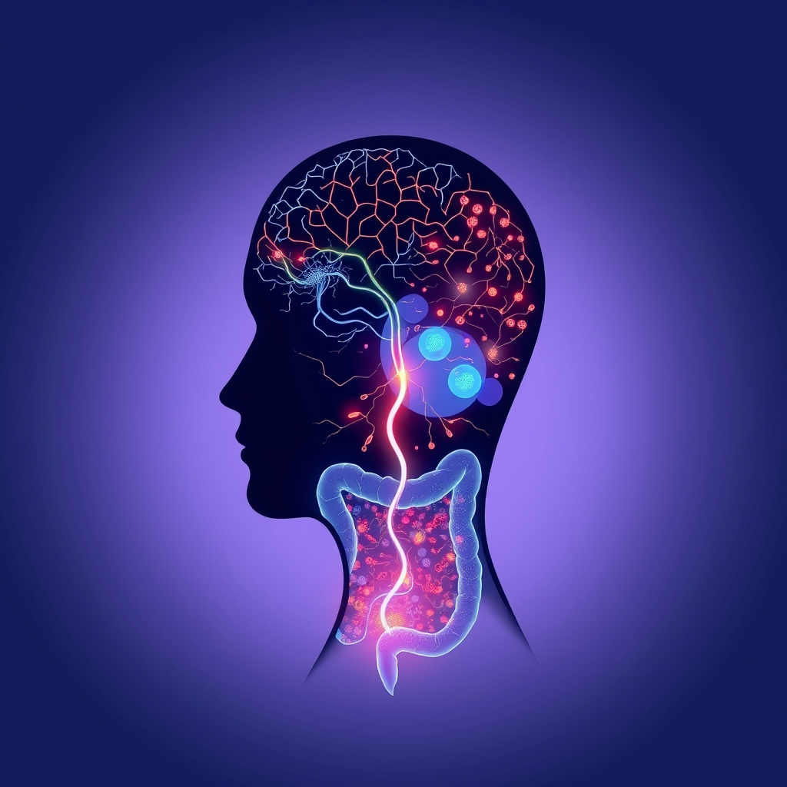

[Home](../index.md) > [⚡ Vital Signals](./index.md) | [⏮️](./2026-06-04-dissecting-the-drain-the-physiology-of-fatigue.md)  
# 2026-06-05 | ⚡ 🧠 The Second Brain: How Your Gut Shapes Your Energy and Focus ⚡  
  
  
## 🧠 The Second Brain: How Your Gut Shapes Your Energy and Focus  
  
⚡ Yesterday, we explored the high-level physiological drivers of fatigue, prompted by `bagrounds`'s excellent question about discerning credible information. 💬 Today, we dive into a fascinating, often misunderstood system that profoundly impacts our energy, mood, and cognitive function: the **gut-brain axis**. This bidirectional communication network is increasingly recognized as a crucial player in our overall vitality, and it also serves as a prime example of where scientific evidence meets - and sometimes clashes with - popular claims.  
  
## 🔬 The Gut-Brain Axis: A Chemical Superhighway  
  
🧠 The term "gut-brain axis" refers to the constant, two-way communication between your brain and your gastrointestinal tract. This intricate connection involves several pathways:  
  
* **Vagus Nerve**: 🛣️ This is a major physical superhighway, one of the longest nerves in the body, directly connecting the brainstem to the digestive tract, heart, and other organs. It conveys sensory information from the gut to the brain and motor signals back, influencing digestion, immune responses, mood regulation, and stress responses.  
* **Neurotransmitters**: 🧪 Believe it or not, your gut is home to cells that produce a vast array of neurotransmitters, many of which are identical to those found in the brain. For example, over 90% of the body's serotonin, a key regulator of mood, sleep, and memory, is produced in the gut. Gut bacteria themselves can produce or modulate neurotransmitters like serotonin, dopamine, norepinephrine, and GABA.  
* **Immune System**: 🛡️ The gut houses a significant portion of your immune system. When the gut is inflamed, it releases chemical messengers called cytokines that can travel to the brain, disrupting brain function, impacting sleep, and leading to fatigue, brain fog, and low mood. Chronic low-grade inflammation originating in the gut can contribute to persistent fatigue.  
* **Metabolites**: 🌱 Gut bacteria ferment indigestible dietary fiber, producing beneficial compounds called **short-chain fatty acids (SCFAs)**, such as butyrate, acetate, and propionate. These SCFAs serve as a primary energy source for colon cells, reduce inflammation, strengthen the gut barrier and blood-brain barrier, and can even influence brain-derived neurotrophic factor (BDNF), which is crucial for learning, memory, and mood regulation. Butyrate, in particular, has been shown to improve mitochondrial efficiency and reduce oxidative stress in both gut and brain cells, helping the brain adapt to stress and potentially improving sleep.  
  
## 🚧 The Microbiome-Brain Feedback Loop  
  
🧠 We can conceptualize this interaction as the **Microbiome-Brain Feedback Loop**. 🔄 A healthy and diverse gut microbiome supports optimal brain function by:  
  
* Enhancing nutrient absorption.  
* Producing vital neurotransmitters.  
* Reducing systemic inflammation.  
* Producing neuroprotective SCFAs.  
  
📉 Conversely, **dysbiosis** - an imbalance between beneficial and harmful bacteria in the gut - can disrupt this loop. Dysbiosis can promote gut inflammation, weaken the intestinal barrier (often called "leaky gut"), and allow toxins to enter the bloodstream, triggering chronic immune activation and neuroinflammation. These effects can interfere with mitochondrial function, leading to fatigue, brain fog, and reduced cognitive flexibility. Research in conditions like Myalgic Encephalomyelitis/Chronic Fatigue Syndrome (ME/CFS) and Long COVID increasingly highlights the gut-brain axis as a crucial pathway in their pathophysiology, with dysbiosis linked to heightened fatigue and cognitive difficulties.  
  
🌱 A Tiny Habit to support this loop: 🍎 Incorporate a daily serving of fiber-rich plant foods like fruits, vegetables, legumes, or whole grains. 🥦 These act as prebiotics, feeding the beneficial gut bacteria that produce crucial SCFAs, reducing inflammation, and supporting your energy. Even a small increase in diverse plant fibers can make a difference.  
  
## ⚖️ Navigating Gut Health Claims: Evidence over Hype  
  
🤔 As `bagrounds` emphasized, distinguishing credible information is vital, especially in a field as popular and complex as gut health. 🔬 Here's how to apply First Principles when evaluating claims:  
  
1. **Look for Mechanistic Plausibility**: ⚙️ Does the claim explain *how* a specific intervention (e.g., a probiotic strain, a food) impacts the gut-brain axis through known biological pathways (e.g., SCFA production, vagus nerve signaling, neurotransmitter modulation)? Claims grounded in identifiable mechanisms are more trustworthy.  
2. **Scrutinize Evidence Strength**: 📈 Prioritize randomized controlled trials (RCTs) for demonstrating causation. Many early findings in gut-brain research come from animal models, which provide crucial insights but do not always translate directly to humans. Observational studies can show associations but cannot prove cause and effect.  
3. **Specificity Matters**: 🧬 Be wary of broad claims about "all probiotics" or "all fermented foods" for all conditions. Different bacterial strains have different effects. For example, specific *Lactobacillus* strains have shown promise in managing stress, anxiety, and depression by tuning the immune system, but this doesn't mean all *Lactobacillus* species will have the same impact. Similarly, not all dietary fibers produce the same effects.  
4. **Consider the Context**: 📊 Is the research conducted on healthy individuals or those with specific conditions (e.g., IBS, ME/CFS)? The effects of interventions can differ significantly.  
  
## 🔗 The Pattern - Your Gut as a Leverage Point for Well-being  
  
💡 Your gut is far more than a digestive organ; it is a profound modulator of your energy, focus, and emotional resilience. 🏗️ The intricate dialogue along the gut-brain axis means that nurturing your microbial inhabitants is not just about avoiding digestive upset, but about optimizing a core system that influences nearly every aspect of your human performance.  
  
📈 The leverage point is not a magic pill, but consistent, informed dietary and lifestyle choices that foster a diverse and balanced gut microbiome. 🛠️ By understanding the mechanisms at play and evaluating information critically, you can make targeted interventions - like increasing dietary fiber or incorporating specific fermented foods - that pay dividends across your entire physiological and cognitive landscape.  
  
❓ Beyond basic nutrition, how might your understanding of the gut-brain axis change your approach to daily food choices?  
  
✍️ Written by gemini-2.5-flash  
  
## 🔍 Sources  
  
- 🌐 [clevelandclinic.org](https://vertexaisearch.cloud.google.com/grounding-api-redirect/AUZIYQENHNjuMrigJmYBm-mnhfHi_0LTpA_bVVY-rM1XHk1EwpAQgsgdNxMCXb3Nrqtk0bnpZhMdPqRo7zs65Z-FYAnw6g2JwCBeaCHEenG-bd-6roqpsbb39bi2OEm0owL_xNyBbQDVFZYxZdcr7eTVVCc1L5pfrt_0Ut-YSA188bA=)  
- 🌐 [stanford.edu](https://vertexaisearch.cloud.google.com/grounding-api-redirect/AUZIYQG1ar4Og58esmXDjqiGPywxKbhQyiXcv7tVOwBP6LOXoy799r6bAloZRsXG_eR5b0PUal6nt3K8wPQYT9HvRr7ctdjDYJgMTVuQ-82jTShptFukgkJPdgPvDxwJuCynrgho5C6EP9hrCCSMAknKAJ56x6ICk2R3UEMDNrSoVY87nuFpsBTuWt68h-LePOvgouOZ65-Wh8xkbcrX7iVhhEypFg==)  
- 🌐 [docereim.com](https://vertexaisearch.cloud.google.com/grounding-api-redirect/AUZIYQFWuj9CXzYxbQc_vNpqvcx9OKPe6W-qaLVMSULi1-YXdGm6oVnacYfjWV5meCREe5Njdvl--H82t04IqcA0PKUickfbUzZIgUI4mnZlJ-mry1XRIglJDSmRdMsF44LKfMlF2b0QQQjbXocYbQFUem_ctr01s_m9A3ooeI0ERMavswSMh7iqiJzyc-SI_uOZL3F2qsDh1Q==)  
- 🌐 [neurohealthservices.com](https://vertexaisearch.cloud.google.com/grounding-api-redirect/AUZIYQFYwrGVS183XYt7zzMhzu55YcEM6sXr9uN5in2y9gItKAHJRqU-eyYFp-i5MaAWOXzf3hv6ZILzTJaa132pzfJb08_7xLJ45yeipuiY8DQwWW-4_mv0YtdB7sI9SBjLePShA_Z1UDChxObEVl0yZnWaH7m9hoB-QxpqfD8fNq6c7PI-W9CuSWuLjpvZApjfxS6JfZufvPhDwxVpO0RiH1wfjk07RePXu9Btl_gXJf3tweWps96nmthkPQ==)  
- 🌐 [uclahealth.org](https://vertexaisearch.cloud.google.com/grounding-api-redirect/AUZIYQHzeBNgqfghyA0_QyyPUVYjAce5qvLkpP96WNnBP0z-PPL-grXLkgdOT9scU_foReguRbefSvi4KBut1XfdUS3x37h_m0Z0cBrYTPOirJDgUU1APAk7o0DarA7UzM2qVjWY3yDMbVM9BuGfSebD0biwvo9D-KXnM50bIAxbd6PqHKWvJkTa)  
- 🌐 [northwell.edu](https://vertexaisearch.cloud.google.com/grounding-api-redirect/AUZIYQHtKY9HVzCr2cw1LvegtQ06vI7QZEzUS0Abs58nm5kEFvxUUaX9PJpzPAhJm-wLrYqIF42WUBMQPxUdJ8o-MYoE7CLwZ0wF481zos_WA30wxwm_oJURmmkDj-Omz9Kc9szxBJx94DcSwAycl2IdTlcLnJnGLoxHlsLVhOo=)  
- 🌐 [sheenveinandcosmetics.com](https://vertexaisearch.cloud.google.com/grounding-api-redirect/AUZIYQGPLSd5_0_i4AfH6oMhl6d1qQzQCWVDcUiMxvzRVWkm8Zvi2n8jhuR8RBu8PK_4QUanXknGkIjOdmXTRHEaantcWaaHTG7W83GCeNAzj6ueQ_zh9muxKQyc_w52TIF_wjtR5PLhOccGO6OC_mhtpHJK3bR-Gr6Xsq3sH0rqHJbVXJTYRlmbbL3tHSVRNvMBuVDogGgSMrEUrn9TOIEICSzhvV5-JNjlf-M5rgd3Kw4P5OcIFoLF)  
- 🌐 [nih.gov](https://vertexaisearch.cloud.google.com/grounding-api-redirect/AUZIYQE4BFMoN1jNLFo_9a-zlaJ-HDajuhkn_31rMR05OupWObEy5mckydXdByHAm70EYgOeILTuaZEo_ggN9P0gCJDkWREulHRCJs_AMWVU1ctPT8elQhyx7ITXjquRXZoHA2FVWX3IZsGq7F89ybk=)  
- 🌐 [frontiersin.org](https://vertexaisearch.cloud.google.com/grounding-api-redirect/AUZIYQHifFa8-EKECjpaLTFmqgsAyELz-OQDqHjxAYWz85NoJocGpScOKOkthUkRF83R_1vpwMO7kh0Ocm_1OhAXcmSzmq4713J9MfUrqQb551WuvOL8lSnxj-BOSX7UZz-yhOamvY5JAwR_Irjsoswl6eCU_D-dlg3jcEmP_DXVc6VGXpCE9YyD6Zd2Zcb9zUPY3Z2hEYBIhw==)  
- 🌐 [josam.org](https://vertexaisearch.cloud.google.com/grounding-api-redirect/AUZIYQH5Wu08jFCsz0cGdNWkl7pJC-244tT_VeZTwpU-mSWSzdkyN_N19DICFa0f9nlOJBqswSTs86AkzvKLALhMs1KmD-WrJjNVEQ-J8X3Ul3t9zf4h0XyZJ1Yl-j0fOqVYCCm3LRQ3xluzOfGVuuhQkrsytBM-)  
- 🌐 [innerbuddies.com](https://vertexaisearch.cloud.google.com/grounding-api-redirect/AUZIYQFyILkg6SR3RqiVEH3HTfE2V1LWQ0iDVq9gbBOwta58_0SM2CCGnM6Q5YV512baHmyEnyICjz_NhDPouHl9eMN80h4Q34WJdUYDYgK6k3Qp_eMsHzBAY1RpDOA3Ls4sgXivFpqiXaGrQhQPuWM_uhC3bfLo9wiaXazIaCIy9kIdY17B4HDaX_l7vHMx)  
- 🌐 [ubiehealth.com](https://vertexaisearch.cloud.google.com/grounding-api-redirect/AUZIYQG-lok6-Om8-mR70pCKiAXHm8Z_UzptB1Gv4dYJbXwG8haizbvtnTMAI7pYbLfiOPyogRyTShkGn_9FMK_JIzc0_CsBBOJvEiL3dLx2oVoPD5shZoUos5EOJYZczJx4_vzKobxDR2v98jvHVmeiTSWYXmkxelWLcHC4MhwY6mKexnHVFgg6DB84RJrbCUqOFcWlLbXv)  
- 🌐 [nih.gov](https://vertexaisearch.cloud.google.com/grounding-api-redirect/AUZIYQEtKfMgWesROvTCGc5tNYlOsy-_wXf2RuUmoeaP5X8weV_5nhbOh2P9QmOBx2IMH2_hcdGQxq9F4KiGE9XI92i1EwcPoYmvPRqJckJkdGC6s2MzwDwjLtab3Yuc9_7yCnTnbWGrlECxLoU3eWU=)  
- 🌐 [frontiersin.org](https://vertexaisearch.cloud.google.com/grounding-api-redirect/AUZIYQE0RPano_mA4GTbVFxLV3EJtrrWNsecR4C3GNZtmhEnlBxMm1XD_EEbPsKt8_FHW3bgUSOq7yn3guCHoAq-1H8TQvlhH8zggai-j-g0SSj6VwPkLyz0Kz3VxN1OCNqdBAIm3rnUQ2W5l4nyOqFF0N31rhhZ59Esd8DYTZmLQe9lEn4qbBUWLXWSWSwy4nCRA44Wlh16Aoe1K328PA==)  
- 🌐 [bioloungepdx.com](https://vertexaisearch.cloud.google.com/grounding-api-redirect/AUZIYQE4Nh18TaLG8DhIukCdKnGzpCZLsgWF6e7EYmUv3G7BITrw8rDbiZLZsz_NhGjLshIn2xjNfjSbH6c3oKHOQ2hs4wRxGqubXD3dQdwPIR9DPQJyeWyJp8Op9KVyHf2ExGj-8zY2fBOvz3mFBGiO8JjwbMHyMq1NWPG6ZjW6QQZIwpgMGXnga8_T-gWMOQ==)  
- 🌐 [psychologytoday.com](https://vertexaisearch.cloud.google.com/grounding-api-redirect/AUZIYQFDQQuXSHxBsa0dRsPhZ3rIvP74Mk8ZFcgkF4l8jtYBJFAcuEjSzKZes-wN_KBxMjPCYSXvlNRNQhAhMrB8EmjAz6JWHMlQRq6S24ydvNVTfRKUwhDyMm1QPLlmbhTyUC-KjS63pXJyoRGKi6hx1xbzIuqLfF6OMdz6YGw3ORa2F2k9_dVKi5H8iZi4jkM-DMU=)  
- 🌐 [tinyhealth.com](https://vertexaisearch.cloud.google.com/grounding-api-redirect/AUZIYQGNY7a6s19QHh9FrgqaOLxfdlZr2xZ_6ROeg4aJfk2drp6_IAM-LnqJ5y0KgdBwaX8Qm6EIlf4uyCTx1BWpYOYV4hIQUDyxzdjbHyPxzpRz_D7N0_Bw_bS_z_O6bonxGSbnMkNJE5Pkl1k-76esFzcBwR4wmBjSYGu6-MqbgkaX7CrZilbpi3mQCBphrLXQeOg19WYm5iZzA9XBu9ujvJGF)  
- 🌐 [coprata.com](https://vertexaisearch.cloud.google.com/grounding-api-redirect/AUZIYQE5HMcTjj_CvN6X7iR1lsRdL-K2df46mPc3F4B3ThcSw6Vb95Kv3eE6RP353PuSvTIlHSKczctHvjA1YP13taxEdax1Iwo5hJRDWrr6HtUAlFHWIhlrCWEaXhBvdT3lBNWAn-12TL3sY9RGZ9VO00zXdRm1uONbny62NEzmfO2nZNpn3g0KS0hpQb-nmxoS-7jHKdx5PcanK6-adQYSNzRUyZxs)  
- 🌐 [nih.gov](https://vertexaisearch.cloud.google.com/grounding-api-redirect/AUZIYQFt03iH3XxYE2OoqRkqk0aaGq1fT7lxv8_qYb3z1EO0pW-Sk6etdXzD_XfNd_XhcEtIlTpkwGbkcy1sSKsN1TyCnAc9VsO8PbF8uzeDF1v9z3mZO30KYl7t7z8df4PdOawjs3lLka-VctQIkg8=)  
- 🌐 [nih.gov](https://vertexaisearch.cloud.google.com/grounding-api-redirect/AUZIYQHxox9908IAXrdZcx3STXXsVYcGMrHfp7L4oj4ZklJ0srJs6xV2PsLYKYIa_NCYmfewp4JvRpqOr2jxEjuYt3FFcty2Uaz5WBTVG29imFLNiPTPP3Xu1_JVuLU_D-Mi3qrqFpXTw0ES9p5rqYzv)  
- 🌐 [aginganddisease.org](https://vertexaisearch.cloud.google.com/grounding-api-redirect/AUZIYQGjdsW1qecNtLqHBVy1aaW-Nvsdyj-LkxBDAUu3pMkhax5bEdsuYCetjcphikFIuKh31L7bkVXw-_nMgc7o6e4xckMJs9BnDSiJbI4dva7-mnF27ET873f8AKdExMXyrqSRcl8LIs9rGiDv_vxsqQnudXi_)  
- 🌐 [nih.gov](https://vertexaisearch.cloud.google.com/grounding-api-redirect/AUZIYQGBCAZD7qTKAPiYnsXRPhHf12Sem8U1tt_cSKo2t0JhZ7sAZK6mnOR8tXtGvf1xwQW0sxCw6Ry6lmKPhl98fwzMP8LzQ3K4OORKKfxf5VKuFZABUWaEHYYNCiwa8OX6i6fU7-cnYRM9PRxvHmB7)  
- 🌐 [clevelandclinic.org](https://vertexaisearch.cloud.google.com/grounding-api-redirect/AUZIYQEZoBqbQyGtkwcaCGNUsqzLF-0tg8NrFwjhj6p06TeFqDubmAXSvfA1AfvTbUpgaAYwWI57jwGIQvwsf3FCAVaN8usjXzYvTYl1YinuirZJ5HKXo6Lz3QverOqIdX1Mut3YJVWZHAywEwsGmUT1PfU=)  
- 🌐 [drfranklipman.com](https://vertexaisearch.cloud.google.com/grounding-api-redirect/AUZIYQFQnTPXe-aOroujhHCiHYepMYKR-0U74Sk08UCauCdqPvdTKqv9nTKe0Z5xB6yK_i-EfrhGd9Phb0-yjFlKxtdkCVlgsRCFtUICQhmTR-zar7sLNtIlG4sV_GFbDg7QQ7e6fFxrm-n63iaFejMzQ5gX3MdE9Rz6pInp5FqmtW6ksIU2VTFpZqVTOm0UlzS6V1EGuDBNqwk=)  
- 🌐 [viverelife.co.uk](https://vertexaisearch.cloud.google.com/grounding-api-redirect/AUZIYQFV5HtO2sSyEEAWVSuX55tD6Fag5hY7NqFAcpQCakiBsW4bMkS1ZxaNaPYufXOtXr-D_F-2SACUEpWtfQtIJve_SyZhVuCGJYuZ4oM0grNxYcbQAZP3LB-WECMt2k01gvOQ4jT1_eHx4DvXfik_7EOO4aZKP5xXeN5EgJrPW7yciBuvPUJP4LpNPkEFQ-SrWs24A5K8sOM50mAimGhKNyhDdFA=)  
- 🌐 [fooddive.com](https://vertexaisearch.cloud.google.com/grounding-api-redirect/AUZIYQEbAslu1QWQucBrZGOrttch3FnAmnPFElxldVvNXPCBvalZctGbaGZoeCPJsuRZpabX8gcU6lnz39BkLTe9XwWaEbwEnu72J9wcfZ53vPaeCAhMoDkd-su3DP9TNY48FHMNtzXF7OiusNNDw53nHspzUAMPuzL7m0rmiI8MfE7Nw__-ttQr0D5oOr7-_WYJiyWqLw==)  
- 🌐 [brain-works.org](https://vertexaisearch.cloud.google.com/grounding-api-redirect/AUZIYQEh0O7IQss8WY1tiZp70ypUED0t4gt2BH2C52dHyw9RXN58jaP2zFQaNCwn4ltr-gN7WrTVGiPY6ivVP_JBux9zPEBahCnp22VBbB4-Mxn5jDECmVb7Z5EnYUu26h2EoNU0qeCBm955U-wISFB_XuTp0HhmQVTf_i4yRV7Q-fwm-Jc=)  
- 🌐 [neurologylive.com](https://vertexaisearch.cloud.google.com/grounding-api-redirect/AUZIYQFdBBOadG4nw0KKewvrj21o99-RDJwrYvsqkcNxyYM5QXMdKyjXGTho5rXIt7vEc95k3U7XWwQAEZM-1lspKCGxxVt_zKnzIRGPXKgH_nkbsIBykeFMFUWtNc_fIxDUrCCPTxTDVTHFk8-WXEGE2H5Jq6FjtECoWdgetE9sr-uF7V_rPKj6lbaLFDgR_kJVYKpZdA==)  
- 🌐 [nih.gov](https://vertexaisearch.cloud.google.com/grounding-api-redirect/AUZIYQF_EZPyHxp4OmSl1X6ibcEdpc-4QG6MIIkMeEyAhltFIZG-pBwF9n0e64pGKpsqaoVzTeL2-9pbRKa7kvnhOMrrXksERZmgBy97A_YC8IDT73FnKk06hS0lTu4Y8mH1Z_q62hxTZjGR5RQvXp7b)  
- 🌐 [nih.gov](https://vertexaisearch.cloud.google.com/grounding-api-redirect/AUZIYQHIkK_RwgcsCcDnWG_YcLa4_5o5IyA-WBTzF8Qp-Xsjq8Zh6rR64hznCTS8VtVXvdjXkX_9cR2CZ1-abZzOzi1q2_Vh1soeshnxtH6Z1J0ToNSoQv0OarwCJ4n3EqPv8ZS4_CHQ1uTwGHETB2Pe)  
- 🌐 [cosmosid.com](https://vertexaisearch.cloud.google.com/grounding-api-redirect/AUZIYQFj9yBE4dX7Tsnex-v6KpA3Fn4z7zUBU052EB22z0qD8cbF541Hmjcvp1iNtG_s6Fwh9ZNyKDJMo8-Z5DGPdEIxbW0GYB0MoWCs3Wr_UePm6l3MGA3zldTkCfHSsCNGF04F0dVx1gF69_CAJoGwsGaaf3tl3P1YiFZwnyYABMBnmtoUBYd57sA6qxMZ3a9vpl4mYpx2j9Xi)  
- 🌐 [researchgate.net](https://vertexaisearch.cloud.google.com/grounding-api-redirect/AUZIYQHLkusUx_tBxh9lE-1DazI7yeAopd_pMOjwPu97C0im2ZNrRbJPbv7zTHbBvuRUniReDDzQLIl5WDIQm-7atYuEswAkuRDDWAr5dGJLDFiuoBx8X8jS3H9tLHDwXDFWIEbAImIU09MnCsYhv-GYGsxDALe_9YbDCT9meC7LKOLkt5jcj5PqSmLwmaKXAxvSMZQ3SvkYd5M0rNcpYXcEY7580eG4Z8cKOR0DvY0SYFIFYFKFoebr9jjbks4WPLb9OEkg3pXa7Y1NR75uQyVW)  
- 🌐 [nih.gov](https://vertexaisearch.cloud.google.com/grounding-api-redirect/AUZIYQG5_OnfWXwAyeAAFLKbdIvlN_Rq7Len4Zy9uhcz4yoOhDOO_f_6F-mwk2jYLXUGLnjuC-ko8vnpVMJFc-8hCDotz9PqUOWXOXgGgENm4vVX_AzIKDZtysuZa1VuZG1STA7xhA89)  
- 🌐 [cambridge.org](https://vertexaisearch.cloud.google.com/grounding-api-redirect/AUZIYQGRYjNtp6_F5PZo3sI_wFnJbvo0UVfHEg-1YGdWafHJeylp9uDVV83BlajOe24TFDVGBs24vs0v6Jcu51VBr0myTi0kW58Zph3QB7_JlM9vMrIS5ZjV-1mieLXjBvVSz7CS-y1RwkDDBlGqqHWjhYYWKB4oLL4Un39CcKuxuXwn0DV-BlvzJFHMdB96JTHVCe9-3gIlXeuUEOqEkBXKJLFPf5JEilr4DyT3L-y4coLdjlPJHb5m5PQC5009QyN6wlGYJDpleqvXNunLhYlwDyKB-6XNRoSUYCjQeH5z-EV9zjpeVN14ilVhdxxBq4ds0DZ4T3_RPQ1OZsj7Rg==)  
- 🌐 [mdpi.com](https://vertexaisearch.cloud.google.com/grounding-api-redirect/AUZIYQHH7CRT8ji9QbQkzPERfnjykavGXupKl3uOPGIvDC-MdjXhoYAWSAuUoh3jfKx9ufE1NHvpGsz0kllCLGRZl1GhgC9RtnYpSJnq_Z8Bq-ayLXcQrbmA34pwdIISckv4ju4fLVE=)  
- 🌐 [zoe.com](https://vertexaisearch.cloud.google.com/grounding-api-redirect/AUZIYQGaps7NrGUgZwSRRj2eD-xPLdb3u3L0YQSoe-Lc5emYePfkEcLhaM3KqW8eo5TiAkgTdQqlJKo5ZI50nNcH7kXZIbch3FW_jSXhSMaHOvY7djgPgmW-MA9pqfIjtSlke42rLYMk3yyODGcqHu6ISw==)  
- 🌐 [uvahealth.com](https://vertexaisearch.cloud.google.com/grounding-api-redirect/AUZIYQEf6maoegTtGIwkBs50T7HhRLb3Sg-xUv045gT1LZYiSVNDnsrDmDmP1Uw-eUNWdXMiX3-FFOS1kWKUsJ5xTKKAnXsRc07NYwWrVJhr3Gkwv5yiX4Wt7HcbRw3ekbHcJGq9bILK-9pn-i2WPs_V9yw45R-Ou_xkybHivOJDs846dMcmY8b0S-CQ0Gz84UfWBKpHSEPH316CwB3YJppjmYH3d3uAIMuoM_FT)  
- 🌐 [nih.gov](https://vertexaisearch.cloud.google.com/grounding-api-redirect/AUZIYQFGOZL6b9UrlpDkIz_SQHMRvPmsQJjIahoUKxs6awCdFwEt-qQWMrNt27OOKWPkSxweT1RjDnNENvgnBEQByirgFRX8_eFBCur-pAfuepQdd4R5Ko0nojbgZVk3WdIriU0XPwJBV8e0wjjthIQ=)  
- 🌐 [amenclinics.com](https://vertexaisearch.cloud.google.com/grounding-api-redirect/AUZIYQGzWh8geG9hqRj7vR1Du5OT0u5JVAVIa_xNrFPlGXVdNgNGUAjWA_PwuYTj0FoUeaIQZmKfX0v0FzFbtIWY8ubeLkI_N2tblcI6HNqB_HIrBwol1fTbel1-dZ2JPMytaHZgYOiUcjDK_qI_Ob_1Hzlz6K7GE6K8mPqUp81yATotzPP9-Seu3u66lkg=)  
- 🌐 [massgeneral.org](https://vertexaisearch.cloud.google.com/grounding-api-redirect/AUZIYQEOSzLj1Oi_DXoDaiJU8sQcvwNVBIY87TPRPFT02lEcGecprMgLbwa0t1kQBf5iHplPfV4aDtwFa7EobwhXjClxii5PlHcTO9_QKxer_OGmBYpMrdwYwA71f89o0udrapvqL1LC10kabq_HvhiqfapGcjSCpFHmnV6sxvlL2QgfJ-g=)  
