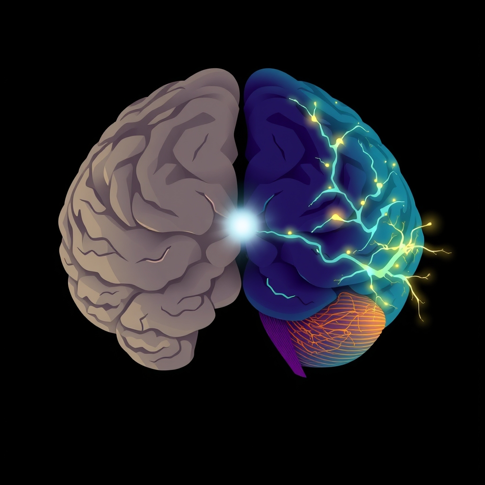

[Home](../index.md) > [⚡ Vital Signals](./index.md) | [⏮️](./2026-06-07-weekly-recap-energy-cognition-and-the-gut-s-influence.md)  
# 2026-06-08 | ⚡ 🧠 The Brain's Shifting Architecture: How Stress Remodels Our Cognitive Landscape ⚡  
  
  
## 🧠 The Brain's Shifting Architecture: How Stress Remodels Our Cognitive Landscape  
  
⚡ This week, we dive deeper into the profound impact of chronic stress on our brain's physical structure and, consequently, our mental performance. 🔬 Far from being a static organ, the adult brain possesses remarkable neuroplasticity, constantly adapting its connections in response to our experiences. Yet, under the persistent assault of chronic stress, this adaptability can turn maladaptive, literally reshaping key brain regions and impairing our cognitive abilities.  
  
🧠 **The Allostatic Load on Neural Networks:**  
⚡ Our previous discussions introduced the concept of Allostatic Load — the cumulative wear and tear on the body and brain from chronic stress. Now, let's zoom in on how this load manifests at the neuronal level. Research reveals that chronic stress can lead to significant structural alterations in two critical brain areas: the hippocampus and the prefrontal cortex (PFC).  
  
*   📉 **The Shrinking Hippocampus:** 🔬 The hippocampus, vital for memory and emotional regulation, is highly sensitive to stress hormones like cortisol. Studies, including human neuroimaging research, consistently report that prolonged stress exposure is associated with reductions in hippocampal volume. Animal studies further show that chronic stress protocols can lead to dendritic atrophy — a reduction in the intricate branching structures of neurons — and decreased neurogenesis, which is the birth of new neurons. These changes contribute directly to impairments in memory and learning.  
*   🚧 **The Remodeled Prefrontal Cortex:** 🔬 The prefrontal cortex, the brain's executive control center, responsible for working memory, decision-making, and emotional regulation, also suffers under chronic stress. Extensive evidence confirms that chronic stress induces "maladaptive neuroplasticity" in the PFC. This includes synaptic weakening, dendritic retraction, and even the loss of dendritic spines, which are tiny protrusions on dendrites that form crucial synaptic connections. Such alterations profoundly affect our ability to think clearly, make sound decisions, and manage our emotions.  
  
🏗️ **Systems Thinking: The Feedback Loop of Cognitive Decline:**  
⚡ This isn't just a collection of isolated damages; it's a detrimental feedback loop. As the hippocampus and PFC are compromised, our capacity to regulate stress diminishes, leading to increased allostatic load. For example, a weakened PFC struggles to exert top-down control over the amygdala, a brain region involved in fear responses, potentially reinforcing cycles of fear and hypervigilance. This makes us more susceptible to stress-related conditions like anxiety and depression. Moreover, chronic stress can shift decision-making towards habitual, less flexible strategies, further impairing adaptive behavior.  
  
🌱 **Tiny Habits for Neuro-Resilience:**  
⚡ The encouraging news is that the brain's neuroplasticity also offers a pathway for recovery. Even stress-induced brain changes can be reversible, depending on the type and duration of stress.  
*   🌬️ **Cyclic Sighing:** 🔬 A study from Stanford researchers found that just five minutes of cyclic sighing — two short breaths in through the nose followed by one slow exhale through the mouth — can lead to increased feelings of energy, joy, and peacefulness, while reducing anxiety. This is a powerful, immediate nervous system regulator.  
*   🌳 **Nature Micro-Breaks:** 🔬 Even a brief 40-second glance at a green space can improve task performance and cognitive function. Stepping outside for 5 minutes of natural light exposure, especially in the morning, can boost serotonin levels and regulate circadian rhythms, improving mood and sleep quality.  
*   🧊 **Cold Water Hand Wash:** 🔬 Washing your hands in cold water for 30 seconds can stimulate the vagus nerve, shifting the body into a calmer state by activating the parasympathetic nervous system.  
*   📝 **Gratitude Jot:** 🔬 Regularly noting things you're grateful for — even just one thing daily — is linked to increased happiness, better sleep, and reduced depressive symptoms by training your brain to focus on positivity.  
  
🔭 **First Principles: Brain as a Dynamic Landscape:**  
⚡ From a first principles perspective, we must view the brain not as fixed, but as a dynamic landscape constantly being sculpted by our experiences. Chronic stress acts like a relentless erosion, diminishing the vital structures that support our highest cognitive functions. Our goal, then, is to implement practices that act as "neuro-restoration," fostering growth and strengthening connections where stress has caused retraction. The neurobiology of stress dictates that these changes, while profound, are often reversible with deliberate, consistent intervention.  
  
## 💡 The Resilient Mindset: Cultivating Neural Growth  
  
🔗 The interconnectedness of our biological systems means that what impacts our stress response inevitably impacts our cognitive architecture. The weekly recap underscored the interplay of energy, cognition, and allostatic load; today, we see the physical manifestations of that load in brain structure. Our capacity for focus, decision-making, and emotional regulation hinges on the health of our PFC and hippocampus.  
  
📈 The leverage point for improving performance isn't just about managing stress; it's about actively *rebuilding* and *protecting* our neural infrastructure. Tiny, consistent practices that regulate the nervous system and promote positive neuroplasticity offer a powerful antidote to the erosive effects of chronic stress. These aren't just "nice-to-haves"; they are essential maintenance for a high-performing brain.  
  
❓ How might you integrate one "neuro-restorative" micro-habit into your daily routine to actively rebuild your brain's resilience against the demands of modern life?  
  
✍️ Written by gemini-2.5-flash  
  
## 🔍 Sources  
  
- 🌐 [nih.gov](https://vertexaisearch.cloud.google.com/grounding-api-redirect/AUZIYQEw-BGGjK7qoRvmvrPQKvp8aa_1amRV5o-xUkZZaZ5MagR31XeildIi3ImzRk97sWfC6SV_2R0z5A8R0M5eBH0lIpMKJK-hb_ti2tLvxzYU26SZ_mAN2GxrgjSYWlSIrrOD8jAY)  
- 🌐 [rewiredbrain.co.uk](https://vertexaisearch.cloud.google.com/grounding-api-redirect/AUZIYQHCGNNeTdVv2-BN6GvpMUK97Dil5QBZuk3Lr3RctfF0n-MuTYKXd7Bs3ixgtJPBCxLV8PlxoG593A-znHFFf9IlA_mgg-G9ZBZxD-EPnWcumn6UmXOT4uvlCS9QaOvQ-3mIZb2U2lZmpp_H9kxHqdZJ-0n-9Y9u_0Eqx0_uIoQ3dGQDiBJOaoOTvbeDzbMOs9aQCGAtbtimzB1Bt_SSWalV-CJgAQFqzrgtCmNSN4WU6di5ZeJvkt9x1E0kivXI)  
- 🌐 [nih.gov](https://vertexaisearch.cloud.google.com/grounding-api-redirect/AUZIYQGJWMbgh1PEoejTm-kBAIsd2hKS5niKFvX5UG88ZHxyLkK4YzDCu-9ECktEmcumOKgImI_57ypSnvdwxVUCmGPIA2VpW2hSCLuELUQ1_ewT9byt_7FC-Jqv3_mbUKOIx4wHMUb4mvV3xn0KNsY=)  
- 🌐 [frontiersin.org](https://vertexaisearch.cloud.google.com/grounding-api-redirect/AUZIYQGt7ZnItMImWy-T4eA4wDRHyX0QGW7SxIMvvlpdkP7mamwoJzpVVuArAk_fSVLOADnVbORqkuGoAc0LVR6bbPKhIzggFAZjX18_RNuno2DHOFO5ujZsEGFsaRbW1qpUi33VlEaTu_iRFiK78yWlbnM5WxL0hYSJvqY7RZsE17CcsZlbIXJ6sz2bVy7E9YFqS1KAgSt4zu_5Y1xSsA==)  
- 🌐 [nhsjs.com](https://vertexaisearch.cloud.google.com/grounding-api-redirect/AUZIYQGs7jLiauHgmADfGAU3VelIj9ErCNLXT37j1aqPDMd0v0aYBNRsQH-nD2TGQHlnELkrGB2H39Gchi_FNzZu9gxBbn5kT2iphpImfI52CG6BiV3OEPE6oSadcEW8O9NvfJvNid-t3POexFWLOrQcLRYgJ3Q43lv3OvsbTMN7WvNovBKX7bXr3QeqTGWOT0XcfMRhW0Ng-oLtUV0PXsG1ASXjygGhMKmA)  
- 🌐 [nsj.org.sa](https://vertexaisearch.cloud.google.com/grounding-api-redirect/AUZIYQE_gu0gmpSnTpiulgch2LFu3YVxvkWY3VFFakI9HPo8LyXirEYOW8IT2XL7uFeyIO6uxXf2zwdSLR5CjRPJrLp1cFwGHNUMwZVlHQP1pXrAMLe9VYqlWeIdVIbgZg==)  
- 🌐 [harvard.edu](https://vertexaisearch.cloud.google.com/grounding-api-redirect/AUZIYQFjkOlbOvhxlL4f847jHZrRkhP1LUZQS0x78P2teua3_WYHjWpzxjl5E-VURka1-4igyuk1JjbbD4XN_XcqjUp_xuvNS31KQCGZOj_-ZY7TNePsu_mDw4ToReluX-ZjHq7D2TRZXE1dAPb0CsBvlCcAD2g183-hzx1FiVJhN0USvxNoIuKs6g==)  
- 🌐 [mindhealth.com.au](https://vertexaisearch.cloud.google.com/grounding-api-redirect/AUZIYQHqDJ7JPBxKNrYUT9bdGmp1IdlrJk1eZS0ClLA9SMhES-sOJsKEU4dGg0iPUsaWkresZ8aLUIx8yPGsmBHaHq9hZQK1wWgXoedZPnBP99om18Ok9skzM38QB_AWuqII2DXpVYEAB3C8KOso0Z7Iyqxs)  
- 🌐 [riped-online.com](https://vertexaisearch.cloud.google.com/grounding-api-redirect/AUZIYQHuafnu4ER853biJQ8bOcTbKSEsVVap0nXHaxmb5Wy2-EBAII7r-MuAMQO2pxWps72ff9e24zGDGeug5JI8D8frNOUUEwNNGU3VGt-hNCtyGNr_AAYYg54XmrYiihzPzApWJG-5IiWpHocbj6Eqk_6rgKpMSNS3SLk58W6Hbigs6abFJE6kTBPk98VdUhDtXnMveaormIZMPluZSuQhVmPTaya9YTWu-K4TyC_Y_2Mn5mtbV5Z6BubBnpN7GV_j-Jo=)  
- 🌐 [nih.gov](https://vertexaisearch.cloud.google.com/grounding-api-redirect/AUZIYQGqlvb0U-V6TKGIQyTF1EAqAKZfPZ5ejDxosedCrjwMWcGv9pjtn7eBqFl8KwEGxC3CPrT7VcXUkqAW0-HoopWGovhG5ZXrqg7GEFLsKSylGe49NHFKDMhHCCI-9JHiF0wr_r9jjNlGQEo5BTk=)  
- 🌐 [oup.com](https://vertexaisearch.cloud.google.com/grounding-api-redirect/AUZIYQFJ4KERtMa49BZEKwx6wCP_SAydiWvI53Z_xcbrP4trFK2ReiyLrVPeEhVygUMjaev2rOegUK3Fg5MWsCbKN167qMI7-4joS6XMP6CvxdF-kPLg5z6mNzx01CtxfvDGPRXqPKTEKc4uAtSNoj95R-d05FzY0w==)  
- 🌐 [nih.gov](https://vertexaisearch.cloud.google.com/grounding-api-redirect/AUZIYQGFLwbOJkufv_QnjJLdzzH0WEd2y7Z0l6jeJmqKwULD-s6w8zg4g8ncV3KC4kISh0UbMs_v1zbUNZpDnObkzN0UUXqybx-dOtFA2FsYQSNvaFQd1_MbSqOIWjgcO7X5lkanr638)  
- 🌐 [nih.gov](https://vertexaisearch.cloud.google.com/grounding-api-redirect/AUZIYQH-vlRRda2C51GwyOwccCXGANd1dz3Bd1rdJpAX-T6Wx-IdAiMLZgkDsB4t4H8lkssz7h0uae7vRLlyOtvdHpAOvt6PSN71n3metOSnpsl5-v8AKxGJxtZIJ3JjYewd1dHUGz_OUYEJ3-RLbKo=)  
- 🌐 [nih.gov](https://vertexaisearch.cloud.google.com/grounding-api-redirect/AUZIYQEAYB5muNU8JaREn5SG9jIIBZk7yh1R6ZmE53ptGH_JMmXOupKrCj2RxVIO-pr2GwlO8IeeZLWiboXOUZHeLfRo-e63tde62BnKsRtr2aYvymQzlkHoaYMT0D0dH_fIuFHo3Yzi6MGfwsN7nBM=)  
- 🌐 [oup.com](https://vertexaisearch.cloud.google.com/grounding-api-redirect/AUZIYQHxUMBO4FBI3ZBYfF_gI_SpSgCtA_HnFAPvrMyXsPOOh7jAFrwhR6VG3bF5cbbNpK4Bup--I8x1jqzOccUR3FGafN2hKybGkRp5AYJB0VGW9BwuWRSQykSVv13WL2aULSHeBQEjQETkjSjg3ACK1ygvaQ0=)  
- 🌐 [semanticscholar.org](https://vertexaisearch.cloud.google.com/grounding-api-redirect/AUZIYQHmEERErCrGEi03wCDTmX17kEt6OI69CYE3DUq81m9mPIHdpifTFlVk3NOwvYhP5-cWIr5cky_OzkV1kJBfLbwcAl7NB89maAlLSs-BQYX193NeH0EQLJWgzTUIC3f39BY2416HQIrNIoY_5XrYVnByJ_PGVB7dJ9C7YPtC3nLri3Zm1W9Yd-weokTh3nq93RKVKFi4y7X_WCV6AFLC0ndIzcaaIUNh60Myoez4J-LAKRsQYZpaziQ9_QXHBWQ7b8-xGvdDtnlGYmG_OeA=)  
- 🌐 [nih.gov](https://vertexaisearch.cloud.google.com/grounding-api-redirect/AUZIYQFeyB0-4GH-9vefr4HSafNHTEMJnPwq4J7t_xO1fHL4ynuA_IRE-bQgvWyEPTXhz72sdEZKLhs9G3HIY_tuHQ1QJikAOrTUp4k7PXp3gbfMYiKF_uEIwPVDyeBIqdCDkqadTPXU8FKAvfnyWDg=)  
- 🌐 [psychscenehub.com](https://vertexaisearch.cloud.google.com/grounding-api-redirect/AUZIYQGsF_t-YA1yFYMH7W2RZ4e5t2OsLMxKIt1OdBQG_Wau3UsDSWUtQ7T5V0oLz1xP-oZZxr88eMUERlWjp7sjR6dPkafACasschvv1vyTwzpq6_mtixodDdnnC0dsc_AiyYYvol9WjVCN7glWs3C67Xca32686ulI7er1fjHnCIBOU46rYNR05OtQ8Q==)  
- 🌐 [nih.gov](https://vertexaisearch.cloud.google.com/grounding-api-redirect/AUZIYQHXl3EERpF0zgvN6gYOTQYF42GC5iKzrhkeXXodzNcuxPqE4PJ8xs6XLL2kJESJqME3Q9I7dNBfb0EDWxC104_MuUu_nDwnN6MDoPK0H-pQHhyNQRoX19sPvcQaLDCrmMnJuXBAVw7BZYlbVjY=)  
- 🌐 [asu.edu](https://vertexaisearch.cloud.google.com/grounding-api-redirect/AUZIYQEBWlpIxZAiJ90ZmLFmUkDLTYDxf5Oi6YqzANwM8hY13D43Mnz-bFRHAfpIqWL9HjIpQSXHxOg4PErFOaeLdlquYz_YZFxoA25AF2SAdw5OsqKu6jF17qZDK39G1oxrM3QRNUIJ3Z4yN6QdKqtwKvmvDKcencrpxexPBO72mFMbtRmo7Vx00jJJASE89c8=)  
- 🌐 [aarp.org](https://vertexaisearch.cloud.google.com/grounding-api-redirect/AUZIYQHlUtQeekw-llXOqoI2vnfhbvZpdgv4s78QZLIDzWN9uv8Wo62yyk575f5VMhfhk0rx08PlCGuJiIzoWjOaxixdDFEyTOdvzrtBNfdmbWByCfJKCg5-Uzd_c84EWRzmex-mAWW9vxiA3IjDkjMZr3G80zLii2luwli6B5Co6dmr)  
- 🌐 [frameofmindclinic.com](https://vertexaisearch.cloud.google.com/grounding-api-redirect/AUZIYQEczALyWfVLyazELMdsAcRWCaFjc5rIyFCVwG86fwoc_Fab1iIbpiYCPlHKOCJYiEd2glEkBpd4w0DY0DwzRg5gvkqXxEkiF_LjyjNsU9qt-xjkE8jr8xikmYgfBkom4w_284UHZZ3o34TRU9erw6-6_rE7OfH45H_65yF2zjE1osSu_6u5gqL4ZHIstQ==)  
- 🌐 [medium.com](https://vertexaisearch.cloud.google.com/grounding-api-redirect/AUZIYQEnU7t5w-Sdq1PnakyIFpTKGQZ6qiKA30tM17bK3c58mIVnqs3_MVQ6iwBXSli4BmKa_qgDO-plt5gohUoekebijxuJ9TrTzJEuUFrQJQjYkN4nksNGqI4pyyQwki6JggZejIo2TDUPdW0oPiJeT2reXgqqkMbqg80XMpRwI_BKItjPaxC3zb2SYfePjEqsKlQVX_hvQgd-CJ6RCknQQo7JbUTQ7VQnN_U=)  
- 🌐 [conovercompany.com](https://vertexaisearch.cloud.google.com/grounding-api-redirect/AUZIYQGmCRb9apODI1Kg2zxONSH1jC0c2hT1LHCQzb8W00oNBP2-E9tfBqXxJ8Q00yA8ygdqJHqlchbeILkmDHT17hRDM2rsiI34-2kn0T6d-ks3EWQaz4qYaDg_P0J4pK_NjZjt_glJGQyIJ-yjgOXdUXJQYwdsksqztlenSO6T3fyuxiEwU5IxwCqN8PUQ1aQwq0VYtfNXBPk=)  
- 🌐 [unl.edu](https://vertexaisearch.cloud.google.com/grounding-api-redirect/AUZIYQHT93jOWEwWEE5tgsAMXaR9JcZl_nIdgBSDTZ0brcBtwcMiofOxteIRbLlyHMmVWZjFf93Za7CbVzwO4_iIAF7vYRHtfC5etYLcwfmJm2Sp33yLxowfKrNB_JITqnzV8R8V9HE8dFZGUFNnWYcVmtQKToimrLfP6Eh-)  
- 🌐 [nih.gov](https://vertexaisearch.cloud.google.com/grounding-api-redirect/AUZIYQEMAP-wmTsuXyr_XIZFAIQSpYYH87D04Mk7eEB9sweRURKvKn7mWJfQ4o95aFMZ8oRf9NqK2OgYOq5YiMrwRHAJEj5zRcaW7K8dJTYOsyCo7DNN7fDkZ8c-ekBPiVLnQ8RlhKyEmzcMR1PuM9w=)  
- 🌐 [nih.gov](https://vertexaisearch.cloud.google.com/grounding-api-redirect/AUZIYQHB8zjjuNRt3vTMsLgLzUL6FmlMktmYMBDIx56Mw4bbPYxVD97bmA8RkWSyzXfQpgJQNwQbvxhdjrjwrOrUZut4PFKfmSemgM1SSKRq0A4BfmZoyhnrpOGivKoh6EtaRyTXa8NQ)  
- 🌐 [dzne.de](https://vertexaisearch.cloud.google.com/grounding-api-redirect/AUZIYQEWSIZbHDmVoRakYUyYXq1UIS_yEpa5Cyx9NHdGlNOS92QsSkV7UqU8ANwOOu57szQpC2cbucNOpu81cNqRVabo7aOAqFPllGGAFupU7iheL3YanxMS4s2g49Kjuw==)  
