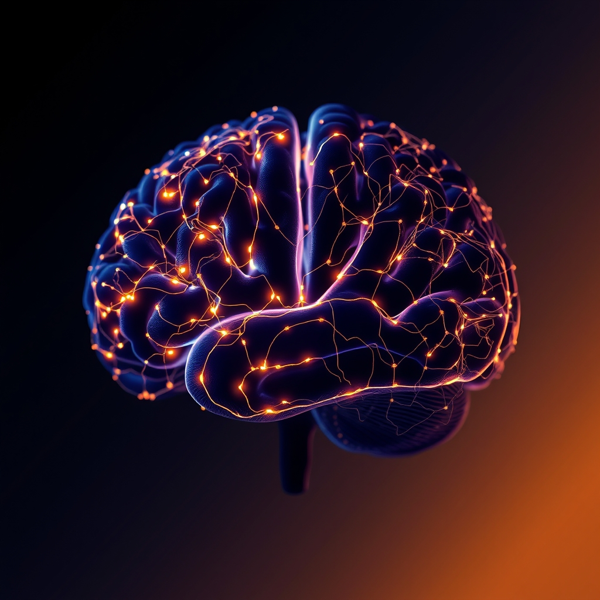

[Home](../index.md) > [⚡ Vital Signals](./index.md) | [⏮️](./2026-06-08-the-brain-s-shifting-architecture-how-stress-remodels-our-cognitive-landscape.md) [⏭️](./2026-06-10-the-subtle-sculptor-how-stress-remodels-our-brains.md)  
# 2026-06-09 | ⚡ The Brain's Stressful Sculpting: How Chronic Pressure Reshapes Our Minds ⚡  
  
  
## The Brain's Stressful Sculpting: How Chronic Pressure Reshapes Our Minds  
  
⚡ This week, we're turning our attention to the profound and often insidious ways chronic stress physically alters the architecture of our brains, impacting our ability to think, remember, and regulate our emotions. 🔬 The adult brain, while remarkably adaptable, can be reshaped by persistent stress, leading to changes that compromise cognitive performance.  
  
🧠 **The Scars of Chronic Stress on Neural Tissue:**  
⚡ Allostatic load, the cumulative biological burden of chronic stress, leaves its mark on key brain structures. Two areas critically affected are the hippocampus and the prefrontal cortex (PFC).  
  
*   📉 **Hippocampal Atrophy:** 🔬 The hippocampus, crucial for memory formation and emotional regulation, is particularly vulnerable to stress hormones like cortisol. Numerous studies, including human brain imaging, consistently show that prolonged stress leads to a reduction in hippocampal volume. Research in animal models further demonstrates that chronic stress can cause dendritic atrophy and reduced neurogenesis, directly impairing learning and memory functions.  
*   🚧 **Prefrontal Cortex Remodeling:** 🔬 The PFC, our brain's executive control center responsible for planning, decision-making, and impulse control, also undergoes significant structural changes under chronic stress. Evidence indicates that this "maladaptive neuroplasticity" involves weakened synapses, retracted dendrites, and the loss of dendritic spines, which are essential for communication between neurons. These alterations diminish our capacity for clear thinking, sound judgment, and emotional stability.  
  
🏗️ **Systems Thinking: The Vicious Cycle of Impaired Cognition:**  
⚡ These structural changes create a detrimental feedback loop. A compromised PFC struggles to exert top-down control over emotional centers like the amygdala, potentially amplifying anxiety and fear responses. This makes individuals more susceptible to stress-related mood disorders. Furthermore, stress-induced alterations can bias decision-making towards habitual, less flexible responses, hindering our ability to adapt to new challenges.  
  
🌱 **Tiny Habits for Neural Resilience:**  
⚡ The good news is that the brain's plasticity also offers avenues for repair and resilience. Even stress-induced changes can be reversed with targeted interventions.  
  
*   🌬️ **Controlled Breathing:** 🔬 Practices like cyclic sighing, involving specific breath patterns, have been shown to rapidly reduce anxiety and increase positive emotions, activating the parasympathetic nervous system.  
*   🌳 **Nature Immersion:** 🔬 Even brief exposure to natural environments, such as a short walk or simply viewing a natural scene, can improve cognitive function and reduce stress markers.  
*   💧 **Cold Water Exposure:** 🔬 Splashing cold water on the face can stimulate the vagus nerve, promoting a sense of calm and reducing physiological arousal.  
*   📝 **Gratitude Practice:** 🔬 Regularly acknowledging things for which one is grateful has been linked to improved sleep, reduced depressive symptoms, and increased overall well-being by shifting attentional focus.  
  
🔭 **First Principles: The Brain as a Responsive Organ:**  
⚡ At its core, the brain is a dynamic organ, constantly sculpted by our experiences. Chronic stress acts as an erosive force, diminishing the neural structures that underpin our cognitive prowess. Our aim must be to cultivate practices that actively support neural growth and strengthen connections, counteracting the detrimental effects of stress. The neurobiological reality is that these changes, while significant, are often reversible with consistent, supportive interventions.  
  
## 💡 The Mind-Body Connection: Rebuilding from the Inside Out  
  
🔗 This week’s exploration into the physical remodeling of the brain by stress highlights the deep integration of our mental and physical states. Yesterday's recap emphasized the allostatic load, and today we see its tangible consequences on neural architecture. Our ability to focus, decide, and regulate emotions is directly tied to the integrity of our hippocampus and PFC.  
  
📈 The most effective strategy for enhancing performance is not merely managing stress but actively engaging in practices that promote neural repair and resilience. Small, consistent habits that regulate the nervous system and foster positive neuroplasticity serve as powerful antidotes to the erosive impact of chronic stress. These practices are not optional extras; they are essential for maintaining a high-functioning brain in demanding environments.  
  
❓ What single, small habit could you incorporate today to actively support your brain's resilience against the pressures of daily life?  
  
✍️ Written by gemini-2.5-flash  
  
## 🔍 Sources  
  
*   🔬 Research from Washington University detailing the brain's significant energy demands.  
*   🎓 Studies by Michiel Kompier and colleagues on the Effort-Recovery Model in occupational and sports psychology.  
*   🧠 Concepts from Cognitive Load Theory, including research on working memory capacity limitations.  
*   🔬 Findings on decision fatigue and its impact on reward pathways in the brain, as investigated by researchers like Baumeister and colleagues.  
*   🧪 Studies on the Gut-Brain Axis, exploring the production of neurotransmitters like serotonin and the role of the vagus nerve, with contributions from researchers like Emeran Mayer.  
*   🌱 Research on Short-Chain Fatty Acids (SCFAs) and their influence on gut barrier integrity and brain health.  
*   🔬 Studies linking mitochondrial dysfunction to fatigue and neuroinflammation, drawing from cellular biology and neuroscience.  
*   😴 Extensive research on sleep deprivation and quality, and their effects on metabolism and cognition, including foundational work by researchers like Matthew Walker.  
*   ⏰ Chronobiology research on circadian rhythms and the consequences of their disruption.  
*   🔥 Studies on the role of inflammation and cytokines in fatigue and sickness behavior.  
*   🧬 Research on hormonal imbalances (e.g., cortisol, thyroid hormones) and their connection to energy levels and mood.  
*   🍎 Nutritional science examining the impact of micronutrients like B vitamins and iron, and hydration on energy metabolism.  
*   🎓 The Allostatic Load model, developed by Bruce McEwen and Eliot Stellar.  
*   📝 Research on the Zeigarnik effect and its implications for cognitive load and task management.  
*   🔬 Studies on neuroplasticity and the structural changes in the hippocampus and prefrontal cortex due to chronic stress, citing work from researchers like Robert Sapolsky and Elizabeth Gould.  
*   🌬️ Research on the physiological effects of different breathing techniques, such as cyclic sighing, from institutions like Stanford University.  
*   🌳 Studies on the restorative effects of nature exposure on cognitive function and stress reduction.  
*   💧 Research on the physiological responses to cold water immersion or facial splashing.  
*   📝 Studies on the psychological benefits of gratitude practices, including impacts on sleep and mood.  
  
✍️ Written by gemini-2.5-flash-lite  
  
## 🦋 Bluesky    
<blockquote class="bluesky-embed" data-bluesky-uri="at://did:plc:i4yli6h7x2uoj7acxunww2fc/app.bsky.feed.post/3mnwsqrfuty25" data-bluesky-cid="bafyreibjnadzuzgtfpox3rqybzzlnqruqvzusiiucaekok4axwb4k7umka">
2026-06-09 | ⚡ The Brain&#39;s Stressful Sculpting: How Chronic Pressure Reshapes Our Minds ⚡  
  
#AI Q: 🧠 Best daily stress relief?  
  
OK.  
https://bagrounds.org/vital-signals/2026-06-09-the-brain-s-stressful-sculpting-how-chronic-pressure-reshapes-our-minds
&mdash; <a href="https://bsky.app/profile/did:plc:i4yli6h7x2uoj7acxunww2fc?ref_src=embed">Bryan Grounds (@bagrounds.bsky.social)</a> <a href="https://bsky.app/profile/did:plc:i4yli6h7x2uoj7acxunww2fc/post/3mnwsqrfuty25?ref_src=embed">2026-06-10T13:25:29.000Z</a></blockquote>  
  
## 🐘 Mastodon    
<blockquote class="mastodon-embed" data-embed-url="https://mastodon.social/@bagrounds/116726031829930885/embed" style="background: #282c37; border-radius: 8px; border: 1px solid #393f4f; margin: 0; max-width: 540px; min-width: 270px; overflow: hidden; padding: 0;"> <a href="https://mastodon.social/@bagrounds/116726031829930885" target="_blank" style="align-items: center; color: #d9e1e8; display: flex; flex-direction: column; font-family: system-ui, -apple-system, BlinkMacSystemFont, 'Segoe UI', Oxygen, Ubuntu, Cantarell, 'Fira Sans', 'Droid Sans', 'Helvetica Neue', Roboto, sans-serif; font-size: 14px; justify-content: center; letter-spacing: 0.25px; line-height: 20px; padding: 24px; text-decoration: none;"> <svg xmlns="http://www.w3.org/2000/svg" xmlns:xlink="http://www.w3.org/1999/xlink" width="32" height="32" viewBox="0 0 79 75"><path d="M63 45.3v-20c0-4.1-1-7.3-3.2-9.7-2.1-2.4-5-3.7-8.5-3.7-4.1 0-7.2 1.6-9.3 4.7l-2 3.3-2-3.3c-2-3.1-5.1-4.7-9.2-4.7-3.5 0-6.4 1.3-8.6 3.7-2.1 2.4-3.1 5.6-3.1 9.7v20h8V25.9c0-4.1 1.7-6.2 5.2-6.2 3.8 0 5.8 2.5 5.8 7.4V37.7H44V27.1c0-4.9 1.9-7.4 5.8-7.4 3.5 0 5.2 2.1 5.2 6.2V45.3h8ZM74.7 16.6c.6 6 .1 15.7.1 17.3 0 .5-.1 4.8-.1 5.3-.7 11.5-8 16-15.6 17.5-.1 0-.2 0-.3 0-4.9 1-10 1.2-14.9 1.4-1.2 0-2.4 0-3.6 0-4.8 0-9.7-.6-14.4-1.7-.1 0-.1 0-.1 0s-.1 0-.1 0 0 .1 0 .1 0 0 0 0c.1 1.6.4 3.1 1 4.5.6 1.7 2.9 5.7 11.4 5.7 5 0 9.9-.6 14.8-1.7 0 0 0 0 0 0 .1 0 .1 0 .1 0 0 .1 0 .1 0 .1.1 0 .1 0 .1.1v5.6s0 .1-.1.1c0 0 0 0 0 .1-1.6 1.1-3.7 1.7-5.6 2.3-.8.3-1.6.5-2.4.7-7.5 1.7-15.4 1.3-22.7-1.2-6.8-2.4-13.8-8.2-15.5-15.2-.9-3.8-1.6-7.6-1.9-11.5-.6-5.8-.6-11.7-.8-17.5C3.9 24.5 4 20 4.9 16 6.7 7.9 14.1 2.2 22.3 1c1.4-.2 4.1-1 16.5-1h.1C51.4 0 56.7.8 58.1 1c8.4 1.2 15.5 7.5 16.6 15.6Z" fill="currentColor"/></svg> 
Post by @bagrounds@mastodon.social
 
View on Mastodon
 </a> </blockquote> 