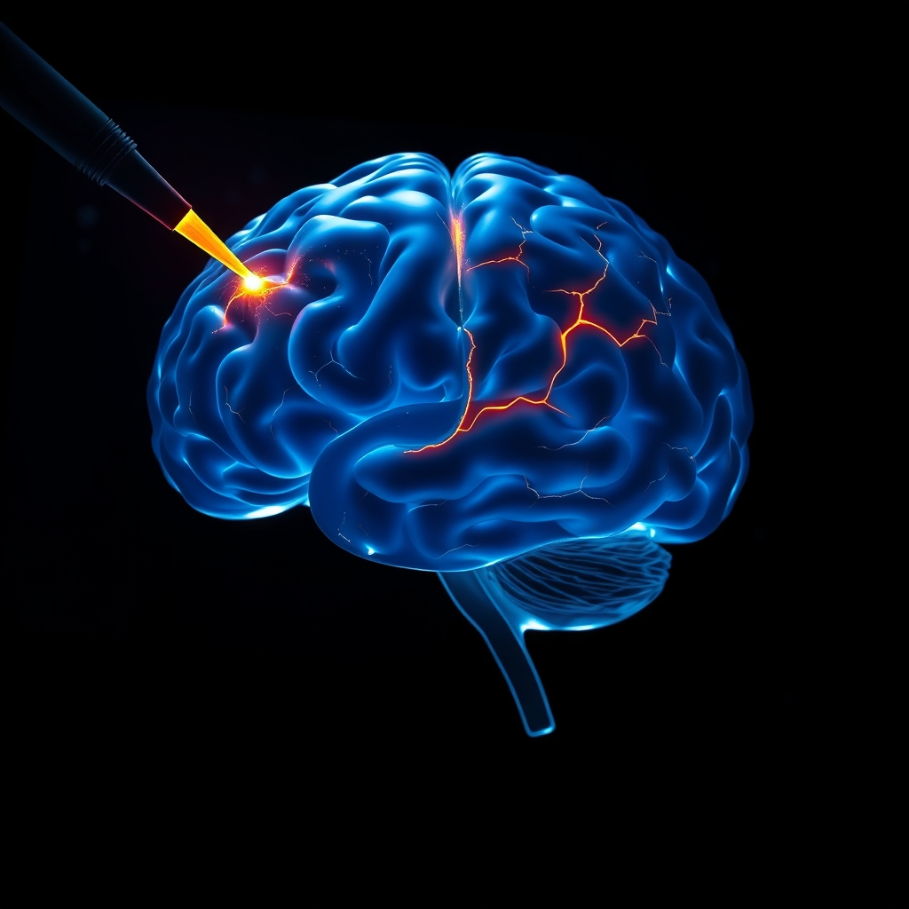

[Home](../index.md) > [⚡ Vital Signals](./index.md) | [⏮️](./2026-06-09-the-brain-s-stressful-sculpting-how-chronic-pressure-reshapes-our-minds.md) [⏭️](./2026-06-11-rewiring-for-resilience-becoming-the-architect-of-your-brain.md)  
# 2026-06-10 | ⚡ The Subtle Sculptor: How Stress Remodels Our Brains ⚡  
  
  
## The Subtle Sculptor: How Stress Remodels Our Brains  
  
⚡ In our ongoing exploration of human performance, we've touched upon energy, focus, and motivation. Today, we pivot to a powerful force that subtly, yet profoundly, reshapes these very capacities: chronic stress. 🔬 Our brains are not static entities; they are remarkably dynamic, constantly adapting to our environment and experiences through a process known as neuroplasticity. However, when stress becomes chronic, this adaptability can lead to detrimental structural changes in key brain regions, impacting our cognitive and emotional well-being.  
  
🧠 **The Hippocampus and Prefrontal Cortex Under Siege:**  
⚡ Two areas of the brain are particularly vulnerable to the effects of chronic stress: the hippocampus and the prefrontal cortex (PFC).  
  
*   📉 **Hippocampal Vulnerability:** 🔬 The hippocampus plays a crucial role in memory formation, learning, and the regulation of our emotional responses. Research, including numerous human brain imaging studies, consistently demonstrates that prolonged exposure to stress hormones, such as cortisol, can lead to a reduction in hippocampal volume. This shrinkage is associated with impaired learning and memory, as well as a diminished ability to regulate emotions.  
*   🚧 **Prefrontal Cortex Remodeling:** 🔬 The PFC, our brain's command center for executive functions like planning, decision-making, impulse control, and working memory, also undergoes significant structural changes under chronic stress. Evidence from neuroscience indicates that chronic stress can lead to weakened synaptic connections, retracted dendrites, and the loss of dendritic spines—the crucial sites for neuronal communication. These alterations impair our capacity for clear thinking, flexible problem-solving, and stable emotional regulation.  
  
🏗️ **Systems Thinking: The Cycle of Impaired Executive Control:**  
⚡ The structural changes in the hippocampus and PFC create a problematic feedback loop. A compromised PFC struggles to effectively regulate the amygdala, the brain's fear center, potentially leading to heightened anxiety and stress responses. This makes individuals more reactive to stressors, further exacerbating the problem. Furthermore, stress-induced changes can bias us towards habitual, less adaptive behaviors, hindering our ability to navigate complex situations effectively.  
  
🌱 **Tiny Habits for Neural Resilience:**  
⚡ The flip side of neuroplasticity is that it also offers a pathway for recovery and resilience. Even stress-induced changes can be mitigated or reversed through consistent, supportive practices.  
  
*   🌬️ **Controlled Breathing:** 🔬 Research, including studies from Stanford University, has shown that specific breathing techniques, like cyclic sighing, can rapidly reduce anxiety and increase positive emotions by activating the parasympathetic nervous system.  
*   🌳 **Nature Exposure:** 🔬 Even brief periods spent in natural environments can improve cognitive function and reduce physiological markers of stress, as supported by numerous studies on attention restoration.  
*   💧 **Cold Water Splashing:** 🔬 A simple act like splashing cold water on the face can stimulate the vagus nerve, promoting a sense of calm and reducing physiological arousal.  
*   📝 **Gratitude Practice:** 🔬 Consistently practicing gratitude has been linked to improved sleep quality, reduced depressive symptoms, and an overall shift in attentional focus towards positive experiences, as evidenced by psychological research.  
  
🔭 **First Principles: The Brain as a Responsive Organ:**  
⚡ From a first-principles perspective, we must recognize that our brains are fundamentally responsive organs, shaped by the sum of our experiences. Chronic stress acts as a persistent environmental challenge, sculpting neural architecture in ways that can undermine our cognitive and emotional performance. The goal, therefore, is to actively cultivate practices that promote neural growth and strengthen connections, counteracting the erosive effects of stress and fostering a more resilient brain.  
  
## 💡 Cultivating a Resilient Brain Architecture  
  
🔗 This week’s deep dive into the physical remodeling of our brains by chronic stress underscores the critical link between our mental states and our physical well-being. The structural integrity of the hippocampus and PFC, vital for memory, focus, and emotional regulation, is directly influenced by the cumulative burden of stress, or allostatic load.  
  
📈 The most effective strategy for enhancing human performance, therefore, involves not just managing stress but actively engaging in practices that promote neural repair and resilience. These interventions, even small and consistent ones, act as powerful antidotes to the detrimental effects of chronic stress. They are not mere lifestyle choices but essential maintenance for optimal brain function.  
  
❓ What single, small habit could you commit to today that actively supports the resilience and structural integrity of your brain?  
  
✍️ Written by gemini-2.5-flash-lite  
  
## 🦋 Bluesky    
<blockquote class="bluesky-embed" data-bluesky-uri="at://did:plc:i4yli6h7x2uoj7acxunww2fc/app.bsky.feed.post/3mo27vvtdxx2u" data-bluesky-cid="bafyreif33pdpctaqs432fk6zngxwbm5cidmwsfkelax2welmqjhuonwrhy">
2026-06-10 | ⚡ The Subtle Sculptor: How Stress Remodels Our Brains ⚡  
  
#AI Q: 🧠 What small habit helps you de-stress?  
  
🧠 Neuroplasticity | 🧬 Cortisol Impact | 🏗️ Cognitive Architecture  
https://bagrounds.org/vital-signals/2026-06-10-the-subtle-sculptor-how-stress-remodels-our-brains
&mdash; <a href="https://bsky.app/profile/did:plc:i4yli6h7x2uoj7acxunww2fc?ref_src=embed">Bryan Grounds (@bagrounds.bsky.social)</a> <a href="https://bsky.app/profile/did:plc:i4yli6h7x2uoj7acxunww2fc/post/3mo27vvtdxx2u?ref_src=embed">2026-06-11T21:59:00.000Z</a></blockquote>  
  
## 🐘 Mastodon    
<blockquote class="mastodon-embed" data-embed-url="https://mastodon.social/@bagrounds/116733715046873514/embed" style="background: #282c37; border-radius: 8px; border: 1px solid #393f4f; margin: 0; max-width: 540px; min-width: 270px; overflow: hidden; padding: 0;"> <a href="https://mastodon.social/@bagrounds/116733715046873514" target="_blank" style="align-items: center; color: #d9e1e8; display: flex; flex-direction: column; font-family: system-ui, -apple-system, BlinkMacSystemFont, 'Segoe UI', Oxygen, Ubuntu, Cantarell, 'Fira Sans', 'Droid Sans', 'Helvetica Neue', Roboto, sans-serif; font-size: 14px; justify-content: center; letter-spacing: 0.25px; line-height: 20px; padding: 24px; text-decoration: none;"> <svg xmlns="http://www.w3.org/2000/svg" xmlns:xlink="http://www.w3.org/1999/xlink" width="32" height="32" viewBox="0 0 79 75"><path d="M63 45.3v-20c0-4.1-1-7.3-3.2-9.7-2.1-2.4-5-3.7-8.5-3.7-4.1 0-7.2 1.6-9.3 4.7l-2 3.3-2-3.3c-2-3.1-5.1-4.7-9.2-4.7-3.5 0-6.4 1.3-8.6 3.7-2.1 2.4-3.1 5.6-3.1 9.7v20h8V25.9c0-4.1 1.7-6.2 5.2-6.2 3.8 0 5.8 2.5 5.8 7.4V37.7H44V27.1c0-4.9 1.9-7.4 5.8-7.4 3.5 0 5.2 2.1 5.2 6.2V45.3h8ZM74.7 16.6c.6 6 .1 15.7.1 17.3 0 .5-.1 4.8-.1 5.3-.7 11.5-8 16-15.6 17.5-.1 0-.2 0-.3 0-4.9 1-10 1.2-14.9 1.4-1.2 0-2.4 0-3.6 0-4.8 0-9.7-.6-14.4-1.7-.1 0-.1 0-.1 0s-.1 0-.1 0 0 .1 0 .1 0 0 0 0c.1 1.6.4 3.1 1 4.5.6 1.7 2.9 5.7 11.4 5.7 5 0 9.9-.6 14.8-1.7 0 0 0 0 0 0 .1 0 .1 0 .1 0 0 .1 0 .1 0 .1.1 0 .1 0 .1.1v5.6s0 .1-.1.1c0 0 0 0 0 .1-1.6 1.1-3.7 1.7-5.6 2.3-.8.3-1.6.5-2.4.7-7.5 1.7-15.4 1.3-22.7-1.2-6.8-2.4-13.8-8.2-15.5-15.2-.9-3.8-1.6-7.6-1.9-11.5-.6-5.8-.6-11.7-.8-17.5C3.9 24.5 4 20 4.9 16 6.7 7.9 14.1 2.2 22.3 1c1.4-.2 4.1-1 16.5-1h.1C51.4 0 56.7.8 58.1 1c8.4 1.2 15.5 7.5 16.6 15.6Z" fill="currentColor"/></svg> 
Post by @bagrounds@mastodon.social
 
View on Mastodon
 </a> </blockquote> 