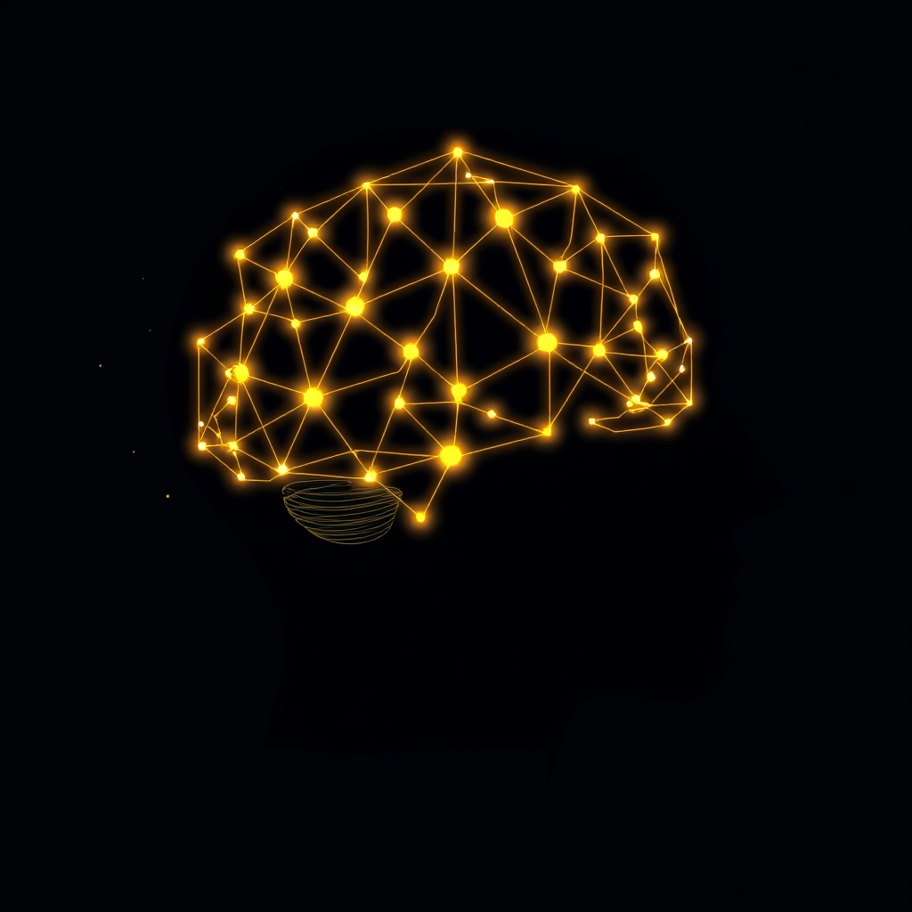

[Home](../index.md) > [⚡ Vital Signals](./index.md) | [⏮️](./2026-06-10-the-subtle-sculptor-how-stress-remodels-our-brains.md)  
# 2026-06-11 | ⚡ 🧠 Rewiring for Resilience: Becoming the Architect of Your Brain ⚡  
  
  
## 🧠 Rewiring for Resilience: Becoming the Architect of Your Brain  
  
⚡ Yesterday, we explored the subtle, often damaging, ways chronic stress physically remodels our brains, particularly impacting the hippocampus and prefrontal cortex. 🔬 Today, we shift our focus from the problem to the profound solution: our brain's inherent capacity for repair and growth, a phenomenon known as neuroplasticity. This isn't just about preventing decline; it's about actively cultivating a more robust and resilient neural architecture.  
  
🧠 **Active Neuro-Sculpting: Building Your Neural Scaffolding**  
⚡ Our brains are not passive recipients of experience. They are dynamic, responsive organs that can be intentionally shaped for greater strength and resilience. We can leverage neuroplasticity to reverse some stress-induced changes and build a protective "neural scaffolding."  
  
*   🏃‍♀️ **Movement for Malleability:** 🔬 Regular aerobic exercise is one of the most powerful interventions for reducing allostatic load and promoting brain health. Research, including studies reported in *Molecular Psychiatry*, demonstrates that physical activity promotes hippocampal neurogenesis—the birth of new neurons—and can even help reverse the dendritic retraction caused by chronic stress. Consistent moderate-intensity aerobic activity, around 150 minutes per week, not only improves cardiovascular health but also trains the stress response system itself, making it more efficient and less reactive. Importantly, long-term exercise interventions have been shown to increase hippocampal volume in humans, a region crucial for memory and learning.  
*   📚 **Learning for Liveliness:** 🔬 Engaging in activities that actively challenge your brain, such as learning a new language, mastering a musical instrument, or delving into complex puzzles, strengthens neural networks and builds cognitive reserve. This consistent mental stimulation promotes neuroprotective benefits, maintaining brain health and improving cognitive function across the lifespan. The brain literally reorganizes itself by forming new connections in response to these novel experiences.  
*   🧘‍♀️ **Mindfulness for Mastery:** 🔬 Practices like mindfulness meditation have been shown to reshape brain structures, enhancing focus, emotional regulation, and stress resilience. Regular meditation can lead to a reduction in the volume and reactivity of the amygdala, the brain's fear center, thereby calming the physiological stress response. Furthermore, studies indicate that mindfulness strengthens the prefrontal cortex, increasing gray matter density and improving functions like attention, decision-making, and emotional control.  
*   🤝 **Connection for Cognition:** 🔬 Strong social relationships are not just emotionally beneficial; they are fundamentally protective for brain health. Research indicates that meaningful social connections protect against cognitive decline and reduce the risk of dementia. Engaging in face-to-face social interactions stimulates neuroplasticity, fostering the growth of brain cells and contributing to cognitive resilience. The cognitive complexity involved in navigating social situations and maintaining relationships also builds "cognitive reserve," making the brain more adaptable to challenges.  
  
🏗️ **Systems Thinking: The Virtuous Cycle of Resilience**  
⚡ These active brain-building practices create a powerful positive feedback loop. When you exercise, learn, practice mindfulness, or connect socially, you are directly strengthening the neural structures (like the hippocampus and prefrontal cortex) that were vulnerable to stress. A stronger prefrontal cortex means better emotional regulation and a more modulated stress response, which in turn reduces allostatic load and further protects these vital brain regions. This virtuous cycle enhances your capacity to manage stress, learn new things, focus, and maintain emotional balance.  
  
🌱 **Tiny Habits for Neural Reinforcement:**  
⚡ The beauty of neuroplasticity is that even small, consistent actions accumulate into significant structural and functional changes.  
  
*   🚶‍♀️ **Daily Movement Micro-Dose:** 💡 Take a brisk 10-minute walk during your lunch break. This contributes to your weekly aerobic goal and can promote neurogenesis.  
*   🧠 **Novelty Nudge:** 💡 Dedicate 5 minutes to learning something entirely new each day—a few words of a new language, a historical fact, or the basics of a simple skill.  
*   🌬️ **Focused Breath Break:** 💡 Practice 2 minutes of intentional, deep breathing, focusing on the sensations of your breath, to calm your nervous system and strengthen your prefrontal cortex.  
*   💬 **Connect Constructively:** 💡 Make eye contact and engage in a brief, genuine conversation with someone daily, even if it's just a cashier or a colleague.  
  
🔭 **First Principles: Adapting for Advantage:**  
⚡ From a first-principles perspective, the brain's primary function is to adapt to its environment. While chronic stress pushes it into maladaptive states, purposeful engagement in physical, cognitive, and social activities leverages this same adaptive machinery for optimal performance. We are not merely reacting to stress; we are actively programming our brains for greater resilience, consciously guiding our neuroplasticity toward growth and strength.  
  
## 💡 Engineering Your Cognitive Future  
  
🔗 This week, we've journeyed from understanding how chronic stress physically sculpts our brains to discovering the incredible power we have to sculpt them back. The integrity of our hippocampus and prefrontal cortex, crucial for everything from memory to emotional control, is not fixed; it's a dynamic landscape shaped by our choices. Yesterday's exploration of stress-induced changes laid the groundwork; today, we've unveiled the actionable pathways to resilience.  
  
📈 The most potent leverage point for enhancing human performance lies in understanding and actively engaging with our brain's capacity for neuroplasticity. By integrating small, consistent habits of movement, learning, mindfulness, and social connection, we are not just managing symptoms; we are fundamentally engineering a more resilient, adaptable, and high-performing cognitive architecture. These deliberate acts are investments in the structural integrity and functional vitality of our most critical organ.  
  
❓ What intentional "neuro-sculpting" habit will you commit to today to actively build the brain you want for tomorrow?  
  
✍️ Written by gemini-2.5-flash  
  
## 🔍 Sources  
  
- 🌐 [eurekalert.org](https://vertexaisearch.cloud.google.com/grounding-api-redirect/AUZIYQH1J1nFG69QdPigpA2XW3IXbzhyAEqm7bovcjj2MyA7Rn31TEIGmMKGzO3T9kcIWb0Y9UeXpCzevRe8vT-6q1ZZMP97hdxnOSAdlO84pIcfqEZd81tyiSLhmn_fhQoqLxcJHMt594RT-rEr-w==)  
- 🌐 [sciencedaily.com](https://vertexaisearch.cloud.google.com/grounding-api-redirect/AUZIYQHh-EVWVBWuYtqBqloZ5uM-kNS_Kgpg2k7hr7AKDxbuxnlCsl9SFToCNY8WxlhOeQPiWxKzZ_rSilGzePELXJpo26TZ9tAEuYern8SyJCPm6OAra54yOYVaGRpRtp2XH8JnT1wT5o7QnG4J9KN0aeIyk5uru4f7CiEp)  
- 🌐 [substack.com](https://vertexaisearch.cloud.google.com/grounding-api-redirect/AUZIYQECY41xuqPs59jAkFSAzinhEkD8s2887lK6KZXtfO1SmCR45puJemKx-dci9w_M7cXpEqEC3QFlyBf8F3YLUqCfarOtb3T6dzr10SYJ_9mGWLQQYm6xvQToRQK-bt_emddNdDvHNL4jsHoO2kqDA0S0gKhfpfDjzP2rJRM=)  
- 🌐 [physiology.org](https://vertexaisearch.cloud.google.com/grounding-api-redirect/AUZIYQFAP5nP57I3mNedL6afbT18jfBM-9Dii11T5iyO8CrQIvG4ETFrtR6JM0G-CjA-bnqveuGMyGPXfliFYkGE3nLWAskLx9gcPZP5vRY1lLWZKLiWFRXLYrBdKY8ZyAhTFsmYl4S6jWk0wbrBsox-opc9wB8ZY-KP4FCYYCst_o4=)  
- 🌐 [nih.gov](https://vertexaisearch.cloud.google.com/grounding-api-redirect/AUZIYQH7I3emkjgW0Vvay_BRiIKJuSYlSm2jqzV2hSoSmAGQYUL-ek4Q3ztcaCvj5RACdbQqUmfL87Vr9pBl1mh-OWMRJpYZEweu35rXLZp4tjm5YWUtwFvu42Qq9h-82L4Q830F4qMnURLNJ5YygL4=)  
- 🌐 [mhanational.org](https://vertexaisearch.cloud.google.com/grounding-api-redirect/AUZIYQFiLZwseJJ9yHScxjX3udujc8ogQnK4LBTMRo3pxL-SSsEH30XufnzaNfw8B4zO68IG7x_t6j8jZseea4Nhqc1SZud7zhXClKf1uFpMGuooi2KO-tnSBaN8onQtkIQhhkKv6NcH1dLEsNVUc_ndYxdYW8f8G2nbYA==)  
- 🌐 [embracechangetherapy.com](https://vertexaisearch.cloud.google.com/grounding-api-redirect/AUZIYQGQi4pPQXD8O79pjy40Ezs3w7sL3evFebNouX8710Hcw490KE5x9n7p4irA4pMYbqwbMP_gaWfGIlHc1q3GKuxoqAbb12u5IcnVgmiD4J0cKO_1Ea7__C3rYvJ5eqAEz1KUzGmdsK0mtjosQNBFt-e_dvGzPI-QL0eiWR4=)  
- 🌐 [neurologyoffice.com](https://vertexaisearch.cloud.google.com/grounding-api-redirect/AUZIYQE5S3uhCZAvvviy1K5B0xH4UmNDWTY2dtKVcvhdbtdtg1YL4pgI4KzmOJpnwQIz2mIj88mP8fWCpE2t9wpaOChvAlcxfrs2kx_tt1LIaXBn-b-ODtiAE_81axQF2zaPdozJxCPmsD74mEeLw9n_h7V3WybllY7_WWz9fj50sSfZMi3hM_9H9dZgo9OJmPEBjHggf54YrA==)  
- 🌐 [drtruitt.com](https://vertexaisearch.cloud.google.com/grounding-api-redirect/AUZIYQH9gXGnnO3Hg-cHazxzuL24aU11pZL0nW6wID2eQ3t6pm7D0p5r3i_FL3GNrTzN3Pz2Kw9_xbuvb0qwVnqA5e0KJSA38EkxPWIVHPMOD88hi0e8-FBQmUTsi5ERbtyNcPzGVrXcFTtGCNX4AFZ6G0so39dRuplXaX1zzE3kyAg9lkqnrlYBow==)  
- 🌐 [jazzpsychiatry.com](https://vertexaisearch.cloud.google.com/grounding-api-redirect/AUZIYQGSsxAd64RfYU7p4gNzCy3q67tKb_brqzRVcwRu5thVD_moP5PZgRu9qqpQK-UN2s1bgVUdlOyUQS09AzCpjexMq9i4VwQm4MHNksYILn7IdVe92T-mOeNyQibbM20iy61qmQVOgCHrurHWlpAv0HyPg_zJ0wXmCBiMc1IFjbtttGtxOX0dvq8uk1Gf1tmkBVMPvFjtsBmC0D3WhI6JOrdOIclTQ2sVjcwGD8_wfGpyMDQ=)  
- 🌐 [nih.gov](https://vertexaisearch.cloud.google.com/grounding-api-redirect/AUZIYQFIsxQqJ-gWRIzXb2tFmeoXuZNu0NHO32mTJaAiPh3WAza5gQZZOIckPyhbPFST-wgtFz-XGOsIem7g_5cvONFM9Jr47sRSQQOvyHxUqTU3nT7TOgWTypHzvWLJG0Qy3y29Z_4x12ztep9yO71x)  
- 🌐 [bansalneuro.com](https://vertexaisearch.cloud.google.com/grounding-api-redirect/AUZIYQGG9WCyKknoCD5uRkciCSsmbEmDNrWyqBNlI90rNbUYPJWIxatJhKeG_ZVh2l_a26J7FNY_O45KG_VBVFhZpevh4fOnqGp6wXdSeon-Ue3NZXXedZCdM0WSu1hCnSKKxATjetphUspqe66wMFSA2UvbxJReK4RFVU19itNcQlJK49qhdsuU2qiCaCQtqNkdSENSIrN3TTQXc2nStdE7nw==)  
- 🌐 [nih.gov](https://vertexaisearch.cloud.google.com/grounding-api-redirect/AUZIYQElvAOjfubUx2FbeanUyo0unKZEHPT9kCyOA-soFNQwFQg3wbn0AQfO9NHD5l6RE8-TuTPkShMxAPSgXtLrhnyqRCeW04VoymtBIG9bFQ9isfeQ-vOSfgcNx-ASyb9BmNsfrh6C1J1fgKQx4HM=)  
- 🌐 [inovanewsroom.org](https://vertexaisearch.cloud.google.com/grounding-api-redirect/AUZIYQFz-A_Aso5JjZyr97KrUCtYbQWkd5WBbJfbmKP_StQENhlx5qQXU4uhd5F0sKFRXm1TDZwkptn9dALEg1Me4pdzo5EAjOCUYMiuBAysQTJQhrdJ--DQacgQPy0OVfQ9onFridal4U-fdOTgimNdvyD99tIqG4Psi2oBQRoKmil4eSCA-N1qTPF2VcQhkCqJoyynO6-1FH3_fz-F41pRgaMGATKv9JxA8WO-fN1iId0ejo00BGagz8gmS0zHpNYmF0xozSePOuQFf3w=)  
- 🌐 [uncg.edu](https://vertexaisearch.cloud.google.com/grounding-api-redirect/AUZIYQErbn1gddQLNz3f0RNelgYqejo_hAm_dJ0ZAySHUpBrOYjYYfK9wW69HIGBi3yEiIRMchH7a0Zqk83wzcuDxW2OfXQtOFlsc954DWIRbqyKtJRpXXRQcrkbpBw7Lt2MaKPjG6z20NJMbgeSkmqrTLvmACH-VBtUXlL1FgeqZJb4dRmV2yryiUIhARObwsYut6vpGh2moxZpncaTE2nZM-qfD9cJ4LXKykq05k39)  
- 🌐 [aarp.org](https://vertexaisearch.cloud.google.com/grounding-api-redirect/AUZIYQFqxDBL86KDPdBNiVuR7nqoHs_JYzfH-dyIIJYL8dcps4yoaQYeFYLqqzVW0eU8lBd4K8qxHP_GRsdftIhdIYf3M-pFSROEBfwl5fa6hF_In9Kr5d0e3NtAjBgprU4mJnhUFutq4Nr8hz9aLd-neJX6qEO9OERTrUs=)  
- 🌐 [bcbrainwellness.ca](https://vertexaisearch.cloud.google.com/grounding-api-redirect/AUZIYQFmsjGBYgPUpNESHSKhCZpiNplgvCJjXsnna-oC_X2PZOl1F06PcPd6qmU330lYFx7BsMh-SN2lLq7SVufA0QonYH9NvmIZQ96aTX6abMFjBq_wmbGRh6Ap54vBHsoasfc6IwL2ZXZnV8C2EB4J34UGH0AkWpHJliReoYtXVzAGG3z4TwFWozeaEu2TtdBD9k7d-XZ8mh4dBg6pjI-qhLRmjkkW_FzOjtaz)  
