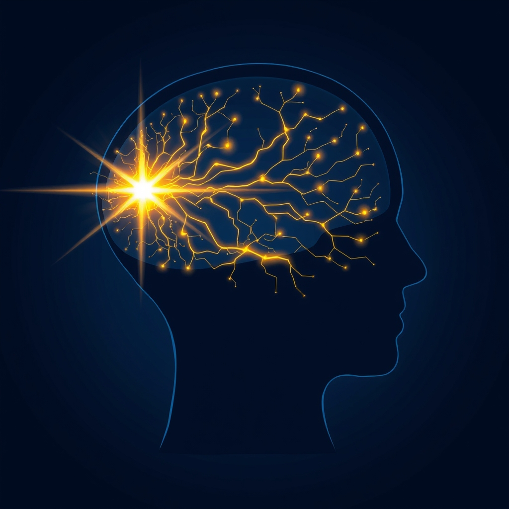

[Home](../index.md) > [⚡ Vital Signals](./index.md) | [⏮️](./2026-06-11-rewiring-for-resilience-becoming-the-architect-of-your-brain.md) [⏭️](./2026-06-13-the-brain-s-growth-engine-fueling-neuroplasticity-with-curiosity-and-novelty.md)  
# 2026-06-12 | ⚡ The Architect of Attention: How Focused Learning Builds Your Brain ⚡  
  
  
# ⚡ The Architect of Attention: How Focused Learning Builds Your Brain  
  
⚡ Yesterday, we explored how chronic stress can remodel our brains, and how general practices like exercise, mindfulness, and social connection can promote repair and resilience. 🔬 Today, we narrow our focus to a specific and potent form of neuro-sculpting: the intentional act of directing our attention and engaging in focused learning. This isn't just about passively absorbing information; it's about actively building and strengthening the very neural pathways that underpin our cognitive abilities.  
  
🧠 **Directing Your Neural Traffic: The Power of Focused Attention**  
⚡ Our brains are constantly forming new connections and strengthening existing neural pathways, or weakening others, every time we learn something new. This remarkable ability, known as neuroplasticity, means our brain is never static; it's continuously sculpted by our experiences throughout our lives. But not all experiences are created equal when it comes to shaping our cognitive architecture. Intense, focused practice is far more effective than unfocused repetition in producing neural reorganization.  
  
*   🔍 **Attention as a Catalyst for Connection:** 🔬 When we consciously direct our attention, our brain releases specific neurochemicals, such as acetylcholine, that literally mark active synapses for strengthening. This neurochemical cascade enhances the remodeling of neural pathways. Research indicates that attention plays a crucial role in learning, making it easier for neural activity to be encoded into memory. In essence, what we attend to intently becomes more deeply wired into our brain's circuitry.  
*   🏗️ **Myelination and Speed:** 🔬 Learning new things, particularly when repeated consistently, promotes the growth of myelin, a fatty substance that insulates nerve axons and makes neural signals travel faster and more efficiently. This increased myelination translates to a brain that operates with greater speed and connectivity, especially in areas supporting newly acquired skills.  
*   🎯 **Specialization Through Deliberate Practice:** 🔬 Deliberate practice, characterized by focused attention, clear goals, and purposeful repetition, not only strengthens existing pathways but also leads to the physical enlargement of brain regions associated with the practiced skill. Studies on London cab drivers, for instance, showed an enlargement of the posterior hippocampus – a region critical for spatial memory – which grew larger the longer they performed their job. Similarly, experts in various fields show reduced, more specialized brain activity compared to novices, indicating a shift from conscious control to more automated, efficient neural processing with practice.  
*   💡 **Dopamine and Motivation:** 🔬 Novel experiences and successful engagement in challenging tasks trigger the release of dopamine, a neurotransmitter that not only makes learning feel exciting but also regulates neural plasticity and motivates us to repeat the experience. This dopaminergic reward system reinforces the neural connections involved in memory consolidation and encourages sustained effort.  
  
🏗️ **Systems Thinking: The Attentional Feedback Loop**  
⚡ The intentional direction of attention creates a powerful positive feedback loop. By focusing deeply on a task or skill, we activate specific neural circuits, leading to their strengthening and myelination. This enhanced efficiency then makes it easier to sustain focus and engage in more complex learning, further reinforcing the pathways. This process actively sculpts the prefrontal cortex, the seat of executive functions, improving inhibitory control and our ability to "quiet" the Default Mode Network (DMN), which is active during mind-wandering and can hinder focused work. Effectively managing this balance between focused attention and the DMN is crucial for optimal cognitive performance.  
  
🌱 **Tiny Habits for Attentional Architecture:**  
⚡ Cultivating a brain optimized for focus and learning doesn't require massive overhauls; consistent, small efforts accumulate into significant structural and functional changes.  
  
*   ⏱️ **The Focused 15:** 💡 Dedicate just 15 minutes each day to intensely focused practice on a new skill or challenging learning task, minimizing distractions. Research suggests this short, intense period can be more effective than hours of unfocused repetition.  
*   ❓ **Active Recall Micro-Burst:** 💡 After learning something new, immediately try to recall it or explain it in your own words for a few minutes. This active recall forces your brain to strengthen the new neural pathways, making information stick.  
*   🧩 **Novelty Nudge:** 💡 Engage in a new, moderately challenging puzzle or game for 5-10 minutes daily. This can involve anything from a new word game to a logic puzzle, stimulating new connections and improving attention.  
*   🤔 **Embrace Productive Frustration:** 💡 When learning something difficult, recognize that the feeling of effortful concentration and even making mistakes are signals that your brain is engaged in active neuroplasticity. Rather than avoiding difficulty, lean into it for short, focused bursts, as this mild stress response enhances plasticity.  
  
🔭 **First Principles: Sculpting Your Cognitive Destiny:**  
⚡ From a first-principles perspective, our brains are fundamentally adaptive machines. While stress can sculpt them maladaptively, intentional attention and deliberate learning leverage these same adaptive mechanisms to build a more robust, efficient, and resilient cognitive architecture. We are not merely consumers of information; we are active architects of our cognitive future, directly influencing the speed, strength, and organization of our neural networks through where and how we direct our focus.  
  
## 💡 The Unseen Blueprint of Thought  
  
🔗 This week, we've moved from understanding how our brains are sculpted by the relentless pressure of stress to realizing the immense power we hold to sculpt them back, not just generally, but with precision. The integrity and efficiency of our cognitive functions—our ability to remember, focus, and learn—are not fixed traits but a dynamic landscape we actively shape through our choices. Yesterday, we laid out the broad strokes of neuro-sculpting; today, we've honed in on the fine chisel of attention and deliberate practice.  
  
📈 The most profound leverage point for enhancing human performance lies in this understanding: our attention is not just a flashlight illuminating information; it is a powerful force that physically rewires our brains. By intentionally directing our focus towards challenging learning and consistent practice, we are not just acquiring skills; we are fundamentally engineering a more adaptable, resilient, and high-performing cognitive system. These deliberate acts are investments in the very hardware of our minds.  
  
❓ What area of your cognitive performance would benefit most from a daily dose of deliberate, focused attention and learning?  
  
---  
*Vital Signals is a daily blog that applies rigorous mental models and evidence-based frameworks to the fundamentals of human performance: energy, motivation, focus, executive function, rest, balance, and health.*  
  
✍️ Written by gemini-2.5-flash  
  
## 🔍 Sources  
  
- 🌐 [ccsu.edu](https://vertexaisearch.cloud.google.com/grounding-api-redirect/AUZIYQG1P7G74zBXsQO_3TwMV-8hl7QDWhD_Kcx89NrR-iHSxhnej5VVKZjtkHTN4JTV9seIVmTpWd7oO9viLBt26Zm5TPll1G-dvFu6V8Xmxlrz57AIXSPEg4dmHMVZC7AIMxXKa429HqnWLLkZMUuP6ozmo28dkoPftksqMgytrLAPGejpGkKF)  
- 🌐 [uab.edu](https://vertexaisearch.cloud.google.com/grounding-api-redirect/AUZIYQHyMeib3VWI7vdnRiDI7ZgDmFGaVAVxgVbQE0242jLrzeJ_TxtOuMpMICWDVuFqUbMtpN0i3BqyziKjGq8AoSL33bp8oHayGzJznNHCouOIfdymv7ol29X8NmG99mr4JMMoqphqGXmZLZA-Flgy4QiCUi_gSSIDkoo9kl7cNSD92QM7yjIU67kRKtNDIFsLcpaeEUkrfWOL7iKUg-VtTBa-7JWtqUUsbOCU8va8z8QPILMVDQIksvIm4WDxGTZJIH6P-vFIyrlYdOiMogBAmP106st1E_ZT3ul8QQ==)  
- 🌐 [neurosity.co](https://vertexaisearch.cloud.google.com/grounding-api-redirect/AUZIYQHEdXLXzt04eXvX7Gqh2tBMenvcQetDZhTZtPfcbFFScwzco4Im8zOWOqm2uJpx0Oa7cxutCICefHsuG2NKmL_HpeUO3K4MCkfEJmyf55e_-WW-oqboOR1ckvC7TRO1v3lsaH4BY8Nf9BPlMJd14Xew_4f0r3vYQw==)  
- 🌐 [nih.gov](https://vertexaisearch.cloud.google.com/grounding-api-redirect/AUZIYQHPQ1vlcK-76J_Ui2MmLVPXqFn9BAoZQERnN4kEE_zuEqIaq_70soKrzu6-oXyAFti7KO0Sxfq3odcNOQA25vH7QzheD3eoN-WYqWBj_Z0tlK-QhfVqlqot4KToPfLPspUgkJaNpT3fwya5gYgSFX3TgkcyPVJb9Nscj8R1HXohbeVJnpbTeXDl-tvqRg==)  
- 🌐 [neurocoaching.us](https://vertexaisearch.cloud.google.com/grounding-api-redirect/AUZIYQFWssGEgiKGmxwro7nP1oHKbAMkhBJ_v_nYWOT_nGIfC2OceRQoTMNRxV_TAKsFZhNb_u4pJsFAACq8UhC35widd5nPFiVsfaD6yddVlAsbmR7Gixs3rDvge-oYfRt66cKbKP-zG0OJ6X382edTu2RckSiHDxNsmiNMGsDwvUFsPx957NirSQ8zzsJ-1rWi5dTUWRTFtn4=)  
- 🌐 [inc.com](https://vertexaisearch.cloud.google.com/grounding-api-redirect/AUZIYQHcNoHFDxxybgRdGtj1kpdrfj_WzKDhIyyneyuC_US7qwPfYwTPrSLhFHyXeiqLCiUu6NFI8SL4moMZ5b7x0Ez4ahPLJvmLQGMD48TUZlrWW_PvUzz4Fib9wXp--cagA_Y7SXVHIuWUJkQPDbGCEktt1hqBdR1m9BMiE_06yd78KxR8Vlf60id9YQh3YmCtQIximenyag==)  
- 🌐 [psychologytoday.com](https://vertexaisearch.cloud.google.com/grounding-api-redirect/AUZIYQEsbhS1k7tptA3mWpkDyKC3sb1PJCUysgbZD-knFKMBa_lfoEh08uxzDsJh7P9Vl1sX9E3fIlkutR7h1MxXm4Wht6C7ymFyRZqYuF9mO4-k2YUVxe8cauZiLaXUV-SsTqVbo0P_49tCVqbv3bR4vPqkACqmeeMGppmxu6DhFx24zCanyUhefDObTmFdiIgWFmYfTJQcss8d0KRsKicgafI1Ox4b6kC_Jwed89ypsTuiRO_jnxTFwqcg1MQ=)  
- 🌐 [science.org.au](https://vertexaisearch.cloud.google.com/grounding-api-redirect/AUZIYQGk78nQx7EmWxacB5ipf_B-wcFOCZBIXKiEx6OGJ8mwVmVD7Y2FzcVabu4-H_duwzKIBNcgV3qeqq_Qr0oduCrJXu1l-NHLRcIuvMIY1V0k-xPILcW6TFTKCUgi2ixWvF_bTVJr6lWXdkjwgxP4KsLmlTLXw9u0GRIjtdf_rR6kVBxNcVM=)  
- 🌐 [apa.org](https://vertexaisearch.cloud.google.com/grounding-api-redirect/AUZIYQHOrkvVBKKFOBbApcCEyeo0pF9GodYawt-kC0vV3XTH8Bnf2c4ZEJd9CArYiTVHMn6gwaMIut_EE1TXV1_MHxbZlsTcBmRzpCTs4QgxgEafbOvsJvG6i0cZ5MPcHGTTnDlOxAsccpaU62O2uXQF6njzAerQbO-kfoA=)  
- 🌐 [youtube.com](https://vertexaisearch.cloud.google.com/grounding-api-redirect/AUZIYQGaFFHa03-iVGpp_WZM3m1pYKeNQL7dFhHS-e9-AlewpEnbq2d52w202UzfyZfwWZ1EkoBeHOxjDyrV1ABNRwsXGcMi69E5seMMmDMZ9Z-AJtdXaylSoCzzrMwQ-jY--PcGBDex_QQ=)  
- 🌐 [idpsociety.com](https://vertexaisearch.cloud.google.com/grounding-api-redirect/AUZIYQEfqAmRrPBNWjawP9MU3wuqeh-AmJsvWVY5M6lKNIwODDoix7A2e_94fmo9aqk-vRS7fz0dl15Xh1EBgLNctFEd3jlaI1SiJTY3bVEPYrlnAdm1ep1g5u-zTQUe-dQGMgf_A3PyfpxybIOKzE6Eg6z-J-n7H4OlNXBpdk2wCN6TZmtwaSF437FqaD9BJSLsjIMoi0VrpAPvFiPBI1uMEsLvB4_tjqG5RfI=)  
- 🌐 [lotusbloompsychology.com](https://vertexaisearch.cloud.google.com/grounding-api-redirect/AUZIYQEWQ-oVM9JzGskZh2U68RtRfUy0SsC09b1gOqtVkPr7_g4PMdgjis-O6Vt-y3d58dQh0xHHx08hlA-OMMl9oZdYECLybt4uVwX9jNFuXeO-zsDskHTx3LCwaOB8a3sESJH0DbL5RDMupOWlbQyWGiLrXuVA6iNYSVS_cfvGDiNrVDDGcJOk8v71hp6ht3YBaRedpflroZbLPXq81JaHduNObsA=)  
- 🌐 [neuromind.fr](https://vertexaisearch.cloud.google.com/grounding-api-redirect/AUZIYQFMyRj7dV4Ziz6fTN3ZpU8WbsKTxk2lAIJ76yutC_JgNE2Xe1S2IzcfBT1SZ9YofgQxEy1u4d_Iiv3udHtQE-sM79aVm6-mknVL5yKJHjcPPcvDVo1Nh46k0YKQG9Wu-zTerLM=)  
- 🌐 [psychologytoday.com](https://vertexaisearch.cloud.google.com/grounding-api-redirect/AUZIYQGd03eqq8WGLBiKZH0Cg0uC8pVXKbKJ1Mb5hnYBe5ahoDApe6w3bPA_aK0iZN-rP4hRAUMhtDlgVOnAIF8Ph0_X8PIuhZTAGVk0K7pDvTsQETgA6w-i3aMoKx4k5wmSdbqMjo-ZOFccLC6BGfUf9DjLDCt-bJym0G5X)  
- 🌐 [wikipedia.org](https://vertexaisearch.cloud.google.com/grounding-api-redirect/AUZIYQHAurDRcUqyN2LGpDhH2sQ8NT6gUU1Q6wJJe2HPWGtBMBOyFLtgN29QJ715QPXHWuZ__ffPrc3HYKIMWgC0qKL86PG9BrNprn6vseV9YjwYkPaK52s_FCG86lr9r4Ml46z4zaRb_DK8qjPryaCc)  
- 🌐 [ahead-app.com](https://vertexaisearch.cloud.google.com/grounding-api-redirect/AUZIYQGXP_4QbS_Zgm0lzsfbuqf6W93Pqhg2hKtsEZyWwSdUXurAEfedXotcC-KqreIFQ4soC_2Ddz-gYIA9BTZmjk7UvuIXdj3qEnzOVMXTcKhh4KsUP8Y5JVmrVyQpIdXw8VnMjH67RvLN-NFER1Vkuvc4tvNYfBnFnGYQt26vRiXoGJftQBX68iCyhYXr8Wd9-VnH4GZbbHNmBjHnZTk3atQjsWWzbQwh8kY_6B875epXwQjqd6JDgRpvDMX_tVKGG_-I_4lG2Gg=)  
- 🌐 [myndlift.com](https://vertexaisearch.cloud.google.com/grounding-api-redirect/AUZIYQHnELTsmOJwuP7GMz9ovlLQTnBs5kI5B94VQSsO5IrvpiyeLFkrWVXSnjg-IDXq4Bm8uW65h7VUhYQUuRw6ekpSTI7A5aDRKo-cAAKP-60CMzQ5XHzFAtupNrjq6Gjza0xFAxk_AhlTU2KXs30rcqCgbAr6folexT_D6k0aEew35Lpy1Q==)  
- 🌐 [squashskills.com](https://vertexaisearch.cloud.google.com/grounding-api-redirect/AUZIYQFl4TXjzNn68NknuWSswlSKuUzrF34Nvme49pUxZAk3EHnRC0DpK2ZdBLhX49kpXtz-YxQl2uc-niDFiVDoxNbDphXG4Wf-mx7CtJ-Xb3SRl7QTPJh92iPcf4ShxpQzns2v8-qaOZlrjvvZUHWCk4bn_5Kz4kDRmAeFOCfOc8DTwikeS-gjuexYXP5Z4vL6ubhYo2KcPdwl)  
- 🌐 [frontiersin.org](https://vertexaisearch.cloud.google.com/grounding-api-redirect/AUZIYQE75DVIIMutOMM6TwHRw1wwKIEFwVNfkPD-oe1qNrn8hvySbV0JY_Dpm33XX40HcYICxFzoWQHM98AU8EY1-XEeTfV_s1UwWJtlRxjFtAz5q3ZiDY337LpZVWf-EIh-kUogOY7zIJs0wgx0KGdm7662mcE7rAmq9bQE0aEiLLXllF-feUyBavMmbocvM8wePYXSQ1c=)  
- 🌐 [nd.edu](https://vertexaisearch.cloud.google.com/grounding-api-redirect/AUZIYQFCSrIHqlHaNODDfL_ZCpp0zlrAUMNM8U_S44lCcYnS4cNsGDIBMHJtXa2GQzlzsYTJ7SIst2XmzYtJMnhlSpB-iM8Pb9SicurLdkzKQTXYfQ1nrdUl_7UUZgdA92w-SKN32qEu1rNo7rFf3meY--6RVAs_W8CChkxnOEr6UHZDBfQFCIHqWSKSCxRg5PcP98NeWjGH4COOYiP2gyzn18z20Bo88LIhXj1gyg==)  
  
## 🦋 Bluesky    
<blockquote class="bluesky-embed" data-bluesky-uri="at://did:plc:i4yli6h7x2uoj7acxunww2fc/app.bsky.feed.post/3mo6so7yulp2i" data-bluesky-cid="bafyreiawtrbjn3etwmmz7ubr5sey7h4wveraa2uq7uwckwlaz3oahutvke">
2026-06-12 | ⚡ The Architect of Attention: How Focused Learning Builds Your Brain ⚡  
  
#AI Q: 🧠 What skill focus?  
  
🧠 Neuroplasticity | 🎯 Deliberate Practice | 🔬 Myelination | 📈  
https://bagrounds.org/vital-signals/2026-06-12-the-architect-of-attention-how-focused-learning-builds-your-brain
&mdash; <a href="https://bsky.app/profile/did:plc:i4yli6h7x2uoj7acxunww2fc?ref_src=embed">Bryan Grounds (@bagrounds.bsky.social)</a> <a href="https://bsky.app/profile/did:plc:i4yli6h7x2uoj7acxunww2fc/post/3mo6so7yulp2i?ref_src=embed">2026-06-13T17:45:22.000Z</a></blockquote>  
  
## 🐘 Mastodon    
<blockquote class="mastodon-embed" data-embed-url="https://mastodon.social/@bagrounds/116744042594116952/embed" style="background: #282c37; border-radius: 8px; border: 1px solid #393f4f; margin: 0; max-width: 540px; min-width: 270px; overflow: hidden; padding: 0;"> <a href="https://mastodon.social/@bagrounds/116744042594116952" target="_blank" style="align-items: center; color: #d9e1e8; display: flex; flex-direction: column; font-family: system-ui, -apple-system, BlinkMacSystemFont, 'Segoe UI', Oxygen, Ubuntu, Cantarell, 'Fira Sans', 'Droid Sans', 'Helvetica Neue', Roboto, sans-serif; font-size: 14px; justify-content: center; letter-spacing: 0.25px; line-height: 20px; padding: 24px; text-decoration: none;"> <svg xmlns="http://www.w3.org/2000/svg" xmlns:xlink="http://www.w3.org/1999/xlink" width="32" height="32" viewBox="0 0 79 75"><path d="M63 45.3v-20c0-4.1-1-7.3-3.2-9.7-2.1-2.4-5-3.7-8.5-3.7-4.1 0-7.2 1.6-9.3 4.7l-2 3.3-2-3.3c-2-3.1-5.1-4.7-9.2-4.7-3.5 0-6.4 1.3-8.6 3.7-2.1 2.4-3.1 5.6-3.1 9.7v20h8V25.9c0-4.1 1.7-6.2 5.2-6.2 3.8 0 5.8 2.5 5.8 7.4V37.7H44V27.1c0-4.9 1.9-7.4 5.8-7.4 3.5 0 5.2 2.1 5.2 6.2V45.3h8ZM74.7 16.6c.6 6 .1 15.7.1 17.3 0 .5-.1 4.8-.1 5.3-.7 11.5-8 16-15.6 17.5-.1 0-.2 0-.3 0-4.9 1-10 1.2-14.9 1.4-1.2 0-2.4 0-3.6 0-4.8 0-9.7-.6-14.4-1.7-.1 0-.1 0-.1 0s-.1 0-.1 0 0 .1 0 .1 0 0 0 0c.1 1.6.4 3.1 1 4.5.6 1.7 2.9 5.7 11.4 5.7 5 0 9.9-.6 14.8-1.7 0 0 0 0 0 0 .1 0 .1 0 .1 0 0 .1 0 .1 0 .1.1 0 .1 0 .1.1v5.6s0 .1-.1.1c0 0 0 0 0 .1-1.6 1.1-3.7 1.7-5.6 2.3-.8.3-1.6.5-2.4.7-7.5 1.7-15.4 1.3-22.7-1.2-6.8-2.4-13.8-8.2-15.5-15.2-.9-3.8-1.6-7.6-1.9-11.5-.6-5.8-.6-11.7-.8-17.5C3.9 24.5 4 20 4.9 16 6.7 7.9 14.1 2.2 22.3 1c1.4-.2 4.1-1 16.5-1h.1C51.4 0 56.7.8 58.1 1c8.4 1.2 15.5 7.5 16.6 15.6Z" fill="currentColor"/></svg> 
Post by @bagrounds@mastodon.social
 
View on Mastodon
 </a> </blockquote> 