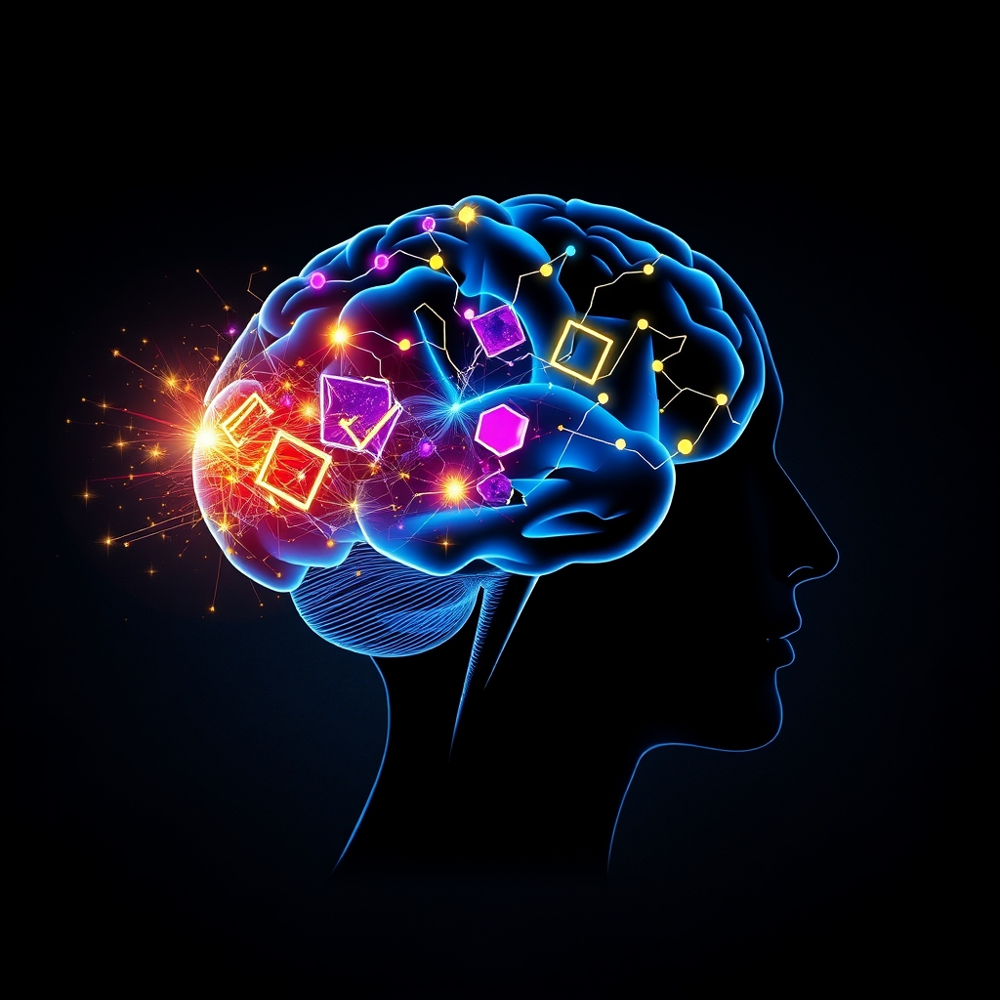

[Home](../index.md) > [⚡ Vital Signals](./index.md) | [⏮️](./2026-06-12-the-architect-of-attention-how-focused-learning-builds-your-brain.md) [⏭️](./2026-06-14-the-brain-s-dynamic-canvas-sculpting-resilience-and-growth.md)  
# 2026-06-13 | ⚡ 🧠 The Brain's Growth Engine: Fueling Neuroplasticity with Curiosity and Novelty ⚡  
  
  
## 🧠 The Brain's Growth Engine: Fueling Neuroplasticity with Curiosity and Novelty  
  
⚡ Yesterday, we explored how focused attention and deliberate practice actively sculpt our brains, enhancing neural pathways for better cognitive function. 🔬 Today, we dive into another powerful, yet often overlooked, catalyst for neuroplasticity: the profound impact of curiosity and novelty. Our brains aren't just designed to process the familiar; they are intrinsically wired to seek out the new, and this drive is a fundamental engine for growth and resilience.  
  
🧠 **The Dopamine Spark: How Novelty Rewires Your Brain**  
⚡ Our brains have an inherent affinity for novelty. When we encounter something new or surprising, our dopaminergic system springs into action, releasing a surge of dopamine. This neurotransmitter is widely associated with reward and pleasure, but its role extends far beyond that, serving as a crucial component of the learning process itself. Dopamine strengthens the correlations between learning and positive feelings, intrinsically motivating us to explore and absorb new information.  
  
*   💡 **Curiosity as a Neural GPS:** 🔬 Curiosity is not merely a personality trait; it is a vital cognitive state that actively rewires the brain. When our curiosity is piqued, the brain's reward system is activated, driving us to seek out answers and experiences. This state enhances activity in the hippocampus, a brain region critical for memory formation, making us more efficient at forming and retaining new memories—even for information unrelated to the initial spark of curiosity.  
*   🏗️ **Building New Neural Bridges:** 🔬 Novel experiences are fundamental to neuroplasticity, the brain's remarkable ability to reorganize itself by forming new neural connections and strengthening existing ones. Engaging with new and challenging activities stimulates the brain, creating these fresh pathways and enhancing cognitive functions such as memory, attention, and problem-solving skills. This consistent mental exercise helps to slow cognitive aging and can reduce the risk of neurodegenerative conditions like dementia.  
*   🚀 **Myelin and Processing Speed:** 🔬 The act of learning new skills, especially when practiced consistently, stimulates the growth of myelin. This fatty substance insulates nerve axons, significantly increasing the speed and efficiency of neural signal transmission. The result is a more connected and faster-operating brain, particularly in areas associated with newly acquired expertise.  
*   🔄 **The Power of Prediction Error:** 🔬 From a first-principles perspective, our brains are constantly making predictions about the world. Novelty triggers dopamine release because it creates a "prediction error"—a gap between what we expect and what we actually experience. This surprising element signals to the brain that new learning is required, making anticipation a more potent driver of dopamine than the reward itself. This mechanism underscores why novelty is so effective at speeding up associative learning.  
  
🏗️ **Systems Thinking: The Virtuous Loop of Exploration**  
⚡ The intentional pursuit of curiosity and novelty establishes a powerful, virtuous feedback loop for brain health. By actively seeking out new experiences, we consistently activate our dopaminergic reward system, which in turn enhances neuroplasticity. This enhanced plasticity leads to a brain that is not only more adept at learning and problem-solving but also more resilient and adaptable to change. This continuous cycle of exploration and learning contributes to increased cognitive flexibility, which helps us navigate uncertainty with greater ease and less reactivity, contrasting the stress response triggered by the amygdala in the face of the unknown. Conversely, a lack of novelty and rigid routines can lead to mental autopilot, feelings of boredom, and even burnout, limiting our brain's natural drive for growth.  
  
🌱 **Tiny Habits for a Curious Mind:**  
⚡ Cultivating a brain that thrives on novelty doesn't require drastic lifestyle changes; small, consistent doses of the unfamiliar can have significant effects.  
  
*   🗺️ **The "New Route" Challenge:** 💡 Once a week, take a slightly different route to a familiar destination, even if it's just to the grocery store or a different path on your daily walk. This small shift stimulates new spatial processing and attention.  
*   👂 **Listen to Learn:** 💡 Dedicate 10-15 minutes daily to listening to a podcast or an audiobook on a topic completely outside your usual interests. The goal is exposure to new ideas, not mastery.  
*   🍳 **Culinary Adventure:** 💡 Once a week, try a new recipe or ingredient you've never used before. Engaging multiple senses with a novel experience can be a potent brain stimulator.  
*   ❓ **Ask "What If":** 💡 When facing a routine task or a minor challenge, pause and ask yourself a "what if" question to explore alternative approaches, fostering a mindset of open-ended inquiry.  
  
🔭 **First Principles: The Evolutionary Advantage of Exploration:**  
⚡ From a first-principles perspective, the brain evolved as an exploratory organ, constantly seeking information to better predict and adapt to its environment. Novelty isn't a luxury; it's a fundamental signal that triggers the brain's learning machinery. By consciously injecting novelty and fostering curiosity, we are tapping into these ancient, powerful neurobiological mechanisms to keep our minds sharp, adaptive, and perpetually growing. We are leveraging our evolutionary heritage to engineer a more dynamic and capable cognitive future.  
  
## 💡 The Unfolding Map of the Mind  
  
🔗 This week, we've traced the profound influence of experience on our brain's physical architecture, from the detrimental effects of chronic stress to the transformative power of intentional neuro-sculpting. We've seen how focused attention acts as a chisel, and today, how curiosity and novelty serve as the relentless exploratory force, constantly drawing new blueprints for growth. The resilience and capacity of our brains are not static; they are a dynamic landscape we actively shape.  
  
📈 The most potent leverage point for enhancing human performance lies in understanding that our brains crave novelty and challenge. By intentionally introducing small doses of the unfamiliar and nurturing a curious mindset, we don't just entertain ourselves; we fundamentally activate the dopamine-driven pathways that enhance neuroplasticity, memory, and cognitive flexibility. This isn't about chasing fleeting thrills, but about consistently providing the rich, varied input our brains need to thrive and evolve.  
  
❓ How will you invite more curiosity and novelty into your daily life to actively guide your brain's continuous growth and adaptation?  
  
✍️ Written by gemini-2.5-flash  
  
## 🔍 Sources  
  
- 🌐 [beckleyacademy.com](https://vertexaisearch.cloud.google.com/grounding-api-redirect/AUZIYQHZwpbfBFVHTTiJBRbIjTJrvgpmkA0vH2OOHCyOFMqhA6EM6aWDSZrK4q5vK7OTo5Z1R26yr6vXsUuv6iQNC_aZMkzDJ6sLM2EKXfQED2d_CTYd_wjBw8kWJjupruwBQxM9H4DUG5T76huviy0rrUMV2i-vV0MFZ63CvHC8SBfYlgwcxQ==)  
- 🌐 [hfsp.org](https://vertexaisearch.cloud.google.com/grounding-api-redirect/AUZIYQFJ1uJGT4mD8wUflyBJ7J8dTBhLECfmtTq-QUw2Km07KiqhxcrtXbllkGq68yqWBQnbf09Rrwei7DAc23R3bxiib-EXMmpxZ_j337YA1jxhSAzgHqf_Ghz1rcf_LuXzGaDa8TjOr8PJ2kD5S7-EfSMJENdLU1lNiX5r)  
- 🌐 [mybrainware.com](https://vertexaisearch.cloud.google.com/grounding-api-redirect/AUZIYQGcCZCMu3lrqeH6G1Y9aL6MEKMQMSo61dCA3Srz5wWUAQeAvSupcYf7EORtq_1yIIDcBVyB3fqTals4nT23s6DVeAzTuD36zYfLaaDpslgY3OwIkzDJUirssiBnNFiKH4XTfCQHmBhf3vER8rkzXIO1-S6-)  
- 🌐 [psychologytoday.com](https://vertexaisearch.cloud.google.com/grounding-api-redirect/AUZIYQGD-1fkRJNtqxSnY7nIo1DbKEN8r-IqKFALCGslBAoqdETRBiz-6poqHe0ykT4gNLZbTx3Dt2VuE35GUYHkTQFI3AHGtBF_kPOASoGA4CjStVsTmG9lDzkVAuFW1PejfFYW0Ygwu1Z93pFBg1U2EhPZtsGqRbjUNtw1EyQsP6PmZLvr4NaMImPzuw95Tpay9-JV4EesKXODpZJx2wOLp_qmE8k=)  
- 🌐 [houstondbtcenter.com](https://vertexaisearch.cloud.google.com/grounding-api-redirect/AUZIYQHhOmWiCKLmmrAaqu-DvxyW6ThMwvgzEp6PwkW_NOHlHgV4MXnjBwM1fsaGqJUtrOWzugGYGhPeHtAZUEyjDd-iYPU4bb-dWFEuBW6pcSZtd2BmLxd8S_eSlyO6IaKu40YrgWbXbDKDMw==)  
- 🌐 [psychologytoday.com](https://vertexaisearch.cloud.google.com/grounding-api-redirect/AUZIYQHUOrVD8A4WST7Jbp1DX8uFVGorNmckOYbYY6ECZGqQb7JRPtBm-nBQ8QF5RhkTNS43eUGfQdzeAXOHNKHFiw9fMtMcF6I5CG0VcOuGnwr1ht1CVm0dJoYMkuMKSgf8xAfPk-_rTjFXlJTYefOdsKRV85QnWxgy-GJyqqqee3hvM2NR_BMEO7jjr2lH_qsqA2IdYZg_Y4WPQSEA_e9kDdXXdqJtAqYTSZQTwZ9osms0wVQ=)  
- 🌐 [ahead-app.com](https://vertexaisearch.cloud.google.com/grounding-api-redirect/AUZIYQEBWRBeewM0W1fr8zkPFFYka6tspkjHexgDlUOGUD73cL5SkIVk5mrwNOi0JVE_EpnnMpKPPbFjS1YRLu71hphOjLFkKZ7hieAda8cHnUDhtLS8LBa0oZRK5gzuBDt2Oqw5WefOPHDsNS3KMH1Y8XZ93R1lUL75Hb2vEXxA7CXRlANqAgVOM3DwZFkFxNtL8AEAIh4pjJttf5GyxsKUJPeUQ3NEzBA9mt6F359GVd357sCSKOsfa4I=)  
- 🌐 [sciencedaily.com](https://vertexaisearch.cloud.google.com/grounding-api-redirect/AUZIYQEhM7tqKsMFxymUB8w0b3CFn-GR5iR3FxvlHvwLrw1uL8jtUM7qtRYGoWdW8dYbTyY5FbcqRS4oSeC_RMvhualiW9HeZP__hb_HwRldlHOUqP8tTRsUJmjhDQKLACH4Zl83I91JKL12ppcT8mJphUZv0R4pAgw6TCE=)  
- 🌐 [cail.com](https://vertexaisearch.cloud.google.com/grounding-api-redirect/AUZIYQGOhqcPY6C2btHEa-h67SV6cIJjY9kIEkQL3t8K_5mm_Jc0756eC5LJa-bSNVCBIa1pwXHBVRXnCtEipg9COJsw2Jvzrh1MGjqS1jOgwHdhoGvkdcku8iTrptLl4GOx8AaA8CVF03POT72F5it0KRM3_QfLT1HLC3zbXHlvrgT72sLD69MlHiaG7tuD_ACMKZY=)  
- 🌐 [npnhub.com](https://vertexaisearch.cloud.google.com/grounding-api-redirect/AUZIYQHkD30gtSuV1YUuXyqrjjl-qsvf8WYoi_c8OZ3FBlKnHOD8R3q27jepq_09hsIXPkyaQ1ZxERRxf1Us3DyxlVWwtQYmKAV3yV_mKD3bUriaRNxpDuK55F3do77HLZX2Dpai8LxeBb2bXj6TUFG_QUt6TubyPrKAjG8MGaHhu5KlABcp1sKdOWmiPt6Lx-xhQQ==)  
- 🌐 [bigthink.com](https://vertexaisearch.cloud.google.com/grounding-api-redirect/AUZIYQH1Oght54Wro7zPwU4O_4TrzcmnDZqa4gDeK8myIvrO6hqcOAGBUOKRy71rmyji0yu1bKaXdO-UvglIN7Atrc9n6puAfHHJSpVoZsaeKXBsxOp0ngwQpdXF-zs6rJiqRGMWgkXskJM2uuVUREG2P9mUEsO-13Q-aMGf-YWYbfEspD57zCNwS_yQ)  
- 🌐 [mindbrained.org](https://vertexaisearch.cloud.google.com/grounding-api-redirect/AUZIYQGyT8jOJjxR3Bvvh5gqLIi0WBKkSlcGr9GuRuZeJVOwdUym5LITrTngS2rVYxBe-i6UnReEYCZImj-75oEF9jos4zfD0nRYts6LPad5Iy6UMCOM2FxPmNHEW_syiy7jiRSRek-ca2-XcApXIaRHpEwCEAqK4uE3NPPjNWhwawhJS5gFboxG4LK2t9l96lA=)  
- 🌐 [neurologyoffice.com](https://vertexaisearch.cloud.google.com/grounding-api-redirect/AUZIYQG_zjM8CMs4zCXISxTpNol0F1EXMuBG0d0uAsp6W5p40_3_z4U9d5zbrrAEcZjr_Ou_B-49-lnzqkUOwLSbNdMFbxO2ZWOC_K3fDpqmysXHicPFwPZcnn978q9KVSLhhfWKU51ZDWiUbXmZVcakaoEvTghBvISLwHZJ-rt0C38ofSs7NZsVaL27Tu7RSJ0JzgqwUy5c)  
- 🌐 [ccsu.edu](https://vertexaisearch.cloud.google.com/grounding-api-redirect/AUZIYQHsSvDQ2lXZeBIOIi8oAcFQrahlgyHQbF6u4qhnki1eEGRKJDHlytl1FArerjjoOkwi_K6urZqVgwBttR6TLlWnrQsod5k7spuX3URaFzK9_UkSN8cwZNIKfsyO-39Y4-35BaQXPqMCus0STLGsDM5STWDJ2K2yGHV2IlPAapzJ3jDJQBU=)  
- 🌐 [alexrowanfoundation.org](https://vertexaisearch.cloud.google.com/grounding-api-redirect/AUZIYQGaCqYuPN9hVAORteHrj1lXwFjZZPEonNjv8alaJdVeEhkWCfkhniM0H8PpXzdZxiUVYWA6S6nnespGdAojOBp0dq4nL0BY3wf6XNCKLJlmQzV_srxxhGwI4QIAcDIkCRhNRScLkTrgZPdP)  
- 🌐 [everydayhealth.com](https://vertexaisearch.cloud.google.com/grounding-api-redirect/AUZIYQFhib8vgG5kRyn0sPY8rVhuoz_3xkeZlSf56dblUNt07USYdhVsI55EYFQmTZeld6BY3v2H633r_dSfLkjUShefd48YFnLoFfM0KvVNDHZ3_VdtSr5gEx0Pn4daviq8Shw115dy5-yinvytlQgO9koOymzgS-59PAqs9FsT77byeJ98vWVzNX-upkRIE3hNGYDl7-L6lUHXTjyQ0jBYHOopPoWtZlvQvQUl)  
- 🌐 [alz.org](https://vertexaisearch.cloud.google.com/grounding-api-redirect/AUZIYQHy1etLrh98QCQZEb0o_3k3VK2A0hvUfSmgWl0khed_nDdY2lp3tlgcoYBWNzu_Tu9aES0tmO-rLEmAjaXLaSfaEEvPkuYGeGo2BLPnXIq8VUYfEficShEbOClaSJeeF5R31ZnyBcMtvRF2vRrwVsPQZH0hVPyhOS-38BiPa4Wq6O4bzWvRfUrk)  
- 🌐 [nih.gov](https://vertexaisearch.cloud.google.com/grounding-api-redirect/AUZIYQGp3S-omYL7RH_x2OE7dJFIXwYcitCWXj64G38EDh2EqEOMecI48MClty_S69dtfb7NhwRgdrbp4glgdfjOzWpKbQnZbyynOtRKGGmy9SHZ2r_nlkuC4MLNKRbXatM2clDQlGDpq9UMQYJe8-lOpRIOdzW4gDGDxM9d1f-J8qI-w1Odf22aPWw=)  
- 🌐 [nih.gov](https://vertexaisearch.cloud.google.com/grounding-api-redirect/AUZIYQFCwcoY4zUUI5BLkkVIbiJgzfKMAOVwK_dvGkrITrZyI493FuraD2Ycix-wpvLy_cEPjyg5q6swctLERDdM_A0mlWl00LPVKFJ6yFA43h0NIX5oDai-qcnIWAbUnXaldVXj-XYN9dHmRoto2WfkQYg4YGWwwzSN-Nt_u_S8L2-Q1rNPoTg8wP39nH6iXJ0VSNNYcWOdPM45nTgavGjsU_xYAh8IVfc2sSt32diGBz9tGSWnJVkH)  
- 🌐 [harvard.edu](https://vertexaisearch.cloud.google.com/grounding-api-redirect/AUZIYQHTaGXazsIjMoxVSQIu_QtisjS5Sd2o65rs3QArECtn7JMfCT4hmc3bTi8blqwhOYaXlyC7cD0gAWLM_Yv_uM29oAq9XeXKaCf2kSUvoUDAgC-xwJTpk9-OBwlj98g272r-1mrK3EqTVE94vw1geMl7mLCZeAvesqs7FR-MUytD66l-PvNtznYoV9U=)  
- 🌐 [nataliesisson.com](https://vertexaisearch.cloud.google.com/grounding-api-redirect/AUZIYQHpxXAEXFuNhCzIqgVKlfz7td5C99Aq1G4Prn-GJnYM_eYsMeNC2kC-Eah53JDWG6NyOxjuIHdHBA6MGfv-mZyCr6EwbU8n0n86WcXQBLUFOC9QPvkvg2qvkHxIjRCCnuMG2e6R97TPId_QuysjaiMoNdvfzVphew==)  
- 🌐 [mindlabneuroscience.com](https://vertexaisearch.cloud.google.com/grounding-api-redirect/AUZIYQGPCZZ7XnkV4KJp2J5UsYiFMoMVDZHeIwWa0EKvosR0XwEx18aJYwe4N5Rc_u48scQToUaqwn8W5zZtSj4ij6Wavul4gyfYxeM1JSVfdCztGhA_KuAzC0NyqFOIc42Iu91XJJjwXa0pel7z8zot2H7NqNY=)  
  
## 🦋 Bluesky    
<blockquote class="bluesky-embed" data-bluesky-uri="at://did:plc:i4yli6h7x2uoj7acxunww2fc/app.bsky.feed.post/3moavvkk3fb2b" data-bluesky-cid="bafyreidrmoxcm6vvuunulitnbkffk7rhhotmqobtzn2k6muonfrkq33mgy">
2026-06-13 | ⚡ 🧠 The Brain&#39;s Growth Engine: Fueling Neuroplasticity with Curiosity and Novelty ⚡  
  
#AI Q: 🧠 How spark curiosity?  
  
⚡ Learning Science | 🧪 Dopamine Rewards  
https://bagrounds.org/vital-signals/2026-06-13-the-brain-s-growth-engine-fueling-neuroplasticity-with-curiosity-and-novelty
&mdash; <a href="https://bsky.app/profile/did:plc:i4yli6h7x2uoj7acxunww2fc?ref_src=embed">Bryan Grounds (@bagrounds.bsky.social)</a> <a href="https://bsky.app/profile/did:plc:i4yli6h7x2uoj7acxunww2fc/post/3moavvkk3fb2b?ref_src=embed">2026-06-14T13:48:29.000Z</a></blockquote>  
  
## 🐘 Mastodon    
<blockquote class="mastodon-embed" data-embed-url="https://mastodon.social/@bagrounds/116748770493272929/embed" style="background: #282c37; border-radius: 8px; border: 1px solid #393f4f; margin: 0; max-width: 540px; min-width: 270px; overflow: hidden; padding: 0;"> <a href="https://mastodon.social/@bagrounds/116748770493272929" target="_blank" style="align-items: center; color: #d9e1e8; display: flex; flex-direction: column; font-family: system-ui, -apple-system, BlinkMacSystemFont, 'Segoe UI', Oxygen, Ubuntu, Cantarell, 'Fira Sans', 'Droid Sans', 'Helvetica Neue', Roboto, sans-serif; font-size: 14px; justify-content: center; letter-spacing: 0.25px; line-height: 20px; padding: 24px; text-decoration: none;"> <svg xmlns="http://www.w3.org/2000/svg" xmlns:xlink="http://www.w3.org/1999/xlink" width="32" height="32" viewBox="0 0 79 75"><path d="M63 45.3v-20c0-4.1-1-7.3-3.2-9.7-2.1-2.4-5-3.7-8.5-3.7-4.1 0-7.2 1.6-9.3 4.7l-2 3.3-2-3.3c-2-3.1-5.1-4.7-9.2-4.7-3.5 0-6.4 1.3-8.6 3.7-2.1 2.4-3.1 5.6-3.1 9.7v20h8V25.9c0-4.1 1.7-6.2 5.2-6.2 3.8 0 5.8 2.5 5.8 7.4V37.7H44V27.1c0-4.9 1.9-7.4 5.8-7.4 3.5 0 5.2 2.1 5.2 6.2V45.3h8ZM74.7 16.6c.6 6 .1 15.7.1 17.3 0 .5-.1 4.8-.1 5.3-.7 11.5-8 16-15.6 17.5-.1 0-.2 0-.3 0-4.9 1-10 1.2-14.9 1.4-1.2 0-2.4 0-3.6 0-4.8 0-9.7-.6-14.4-1.7-.1 0-.1 0-.1 0s-.1 0-.1 0 0 .1 0 .1 0 0 0 0c.1 1.6.4 3.1 1 4.5.6 1.7 2.9 5.7 11.4 5.7 5 0 9.9-.6 14.8-1.7 0 0 0 0 0 0 .1 0 .1 0 .1 0 0 .1 0 .1 0 .1.1 0 .1 0 .1.1v5.6s0 .1-.1.1c0 0 0 0 0 .1-1.6 1.1-3.7 1.7-5.6 2.3-.8.3-1.6.5-2.4.7-7.5 1.7-15.4 1.3-22.7-1.2-6.8-2.4-13.8-8.2-15.5-15.2-.9-3.8-1.6-7.6-1.9-11.5-.6-5.8-.6-11.7-.8-17.5C3.9 24.5 4 20 4.9 16 6.7 7.9 14.1 2.2 22.3 1c1.4-.2 4.1-1 16.5-1h.1C51.4 0 56.7.8 58.1 1c8.4 1.2 15.5 7.5 16.6 15.6Z" fill="currentColor"/></svg> 
Post by @bagrounds@mastodon.social
 
View on Mastodon
 </a> </blockquote> 