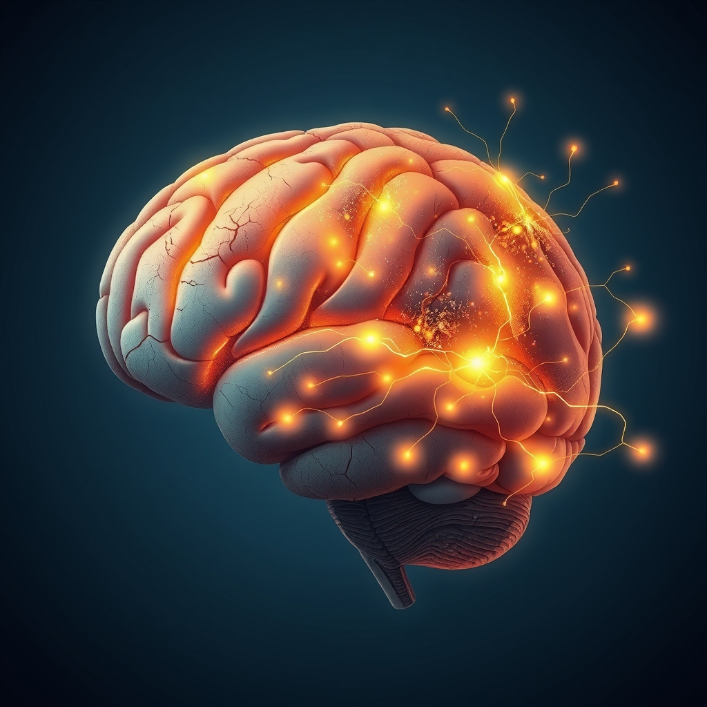

[Home](../index.md) > [⚡ Vital Signals](./index.md) | [⏮️](./2026-06-13-the-brain-s-growth-engine-fueling-neuroplasticity-with-curiosity-and-novelty.md) [⏭️](./2026-06-15-the-brain-s-dynamic-canvas-sculpting-resilience-and-growth.md)  
# 2026-06-14 | ⚡ 📆 The Brain's Dynamic Canvas: Sculpting Resilience and Growth ⚡  
  
  
# 📆 The Brain's Dynamic Canvas: Sculpting Resilience and Growth  
  
⚡ This week at Vital Signals, we've embarked on a deep dive into the profound reality of **neuroplasticity**, revealing that our brains are not static organs but are continuously reshaped by our experiences, a process we termed "neuro-sculpting." 🔬 We explored both the detrimental effects of chronic stress and the empowering ways we can intentionally cultivate a more robust and resilient neural architecture.  
  
🧠 **The Erosive Power of Chronic Stress:**  
⚡ We began by examining how chronic stress and its cumulative burden, known as **allostatic load**, physically remodel the brain. Research consistently demonstrates that prolonged exposure to stress hormones, such as cortisol, can lead to structural changes in key brain regions. Studies, including human neuroimaging and animal models, show reductions in hippocampal volume, impairing memory formation and learning. Simultaneously, the prefrontal cortex, vital for executive functions like planning and decision-making, can experience weakened synaptic connections and dendritic retraction, compromising clear thinking and emotional regulation. This creates a detrimental feedback loop where a compromised prefrontal cortex struggles to regulate the amygdala, the brain's fear center, exacerbating anxiety and stress responses.  
  
🧠 **The Architect's Toolkit: Intentional Neuro-Sculpting:**  
⚡ The encouraging news is that this same neuroplasticity offers a powerful pathway for repair and growth. We highlighted several evidence-based interventions that actively contribute to a more resilient brain:  
  
*   🏃‍♀️ **Movement for Malleability:** 🔬 Regular aerobic exercise is a potent tool for promoting hippocampal neurogenesis—the birth of new neurons—and can even help reverse stress-induced dendritic changes. Studies published in journals like *Molecular Psychiatry* have shown exercise to increase neuron formation and rewire neural circuits in the hippocampus. Consistent physical activity also trains the stress response system, making it more efficient.  
*   📚 **Learning for Liveliness:** 🔬 Engaging in cognitively challenging activities, such as learning new skills or languages, strengthens neural networks and builds **cognitive reserve**. This consistent mental stimulation promotes the formation of new connections and enhances overall cognitive function.  
*   🧘‍♀️ **Mindfulness for Mastery:** 🔬 Practices like mindfulness meditation have been shown to reshape brain structures, enhancing focus and emotional regulation. Regular meditation can lead to a reduction in the volume and reactivity of the amygdala, calming the fear response, and strengthen the prefrontal cortex, improving attention and decision-making.  
*   🤝 **Connection for Cognition:** 🔬 Strong social relationships are fundamentally protective for brain health, stimulating neuroplasticity and fostering the growth of brain cells. Research indicates that meaningful social connections protect against cognitive decline and contribute to cognitive resilience.  
*   🎯 **Focused Attention:** 🔬 Deliberate practice and focused attention actively sculpt the brain by strengthening specific neural pathways and promoting myelination, which increases the speed and efficiency of neural signals. Research suggests that sustained attention can lead to long-term changes in brain function and improved performance on cognitive tasks.  
*   💡 **Curiosity and Novelty:** 🔬 Encounters with new and surprising information trigger the release of dopamine, activating the brain's reward system and enhancing neuroplasticity. This dopamine spark strengthens learning and memory formation, particularly in the hippocampus, by signaling "prediction error" that new learning is required.  
  
🏗️ **Systems Thinking: The Virtuous Cycle of Adaptation:**  
⚡ These active brain-building practices create a powerful positive feedback loop. By engaging in movement, learning, mindfulness, social connection, focused attention, and novelty, we directly strengthen the neural structures (like the hippocampus and prefrontal cortex) that are vulnerable to stress. A stronger prefrontal cortex leads to better emotional regulation and a more modulated stress response, further protecting these vital brain regions and enhancing overall cognitive performance.  
  
🌱 **Tiny Habits for a Resilient Mind:**  
⚡ The elegance of neuroplasticity lies in its responsiveness to even small, consistent actions. We explored habits such as the "New Route" Challenge, listening to new podcasts, trying new recipes, asking "What If" questions, and engaging in "Focused 15" learning bursts. Other tiny habits include intentional deep breathing, like cyclic sighing, which Stanford researchers found can rapidly reduce anxiety and improve mood, and brief nature exposure, which improves cognitive function and reduces stress markers. Regularly practicing gratitude also activates brain regions associated with reward and emotional regulation, strengthening positive neural pathways and building resilience. These consistent efforts accumulate into significant structural and functional changes in the brain.  
  
🔭 **First Principles: Adapting for Advantage:**  
⚡ From a first-principles perspective, the brain evolved as an adaptive, exploratory organ. While chronic stress can drive maladaptive changes, purposeful engagement in physical, cognitive, and social activities leverages these same adaptive mechanisms for optimal performance. We are not merely passive recipients of our neural architecture; we are active architects, consciously guiding our neuroplasticity toward growth and strength.  
  
## 💡 The Unfolding Blueprint of Our Minds  
  
🔗 This week has profoundly illustrated that our cognitive performance is not a fixed state but a dynamic, malleable landscape. We are not just subjects of our brain's architecture, but its active architects, capable of both understanding and influencing its form. We've moved from recognizing the subtle erosion of stress to embracing the immense power of intentional neuro-sculpting.  
  
📈 The most significant leverage point for enhancing human performance lies in our ability to consciously engage with neuroplasticity. By choosing inputs that build and strengthen neural networks—from mitigating stress with mindful breathing to embracing novelty and focused learning—every intentional act is an investment in our brain's future capacity. This isn't about fleeting self-help, but about applying rigorous science to fundamentally upgrade our mental hardware.  
  
❓ How will you actively participate in shaping your brain's architecture this coming week, leveraging both resilience and growth to build a more capable and adaptive mind?  
  
✍️ Written by gemini-2.5-flash  
  
## 🔍 Sources  
  
- 🌐 [nih.gov](https://vertexaisearch.cloud.google.com/grounding-api-redirect/AUZIYQEldjgHZDC8FxYg6CKMlsJfd3j5ZqXrXQZr3nRQwQowIfY_74XEFH0ZfXXwWcqB3ue9cKc8mJTMzWaGJRxyBCGkoF0NMAtrZ0QxMPcuIGsU_039gl45KP1o6Ufu2pRrTDm7dhvTB2vyZtOwrg==)  
- 🌐 [nih.gov](https://vertexaisearch.cloud.google.com/grounding-api-redirect/AUZIYQGgWRbhe7d7EoQy0oP2OqPkfWjWc9Rs2qkutPpGX35emXO1Uec7j0NhYDgNDbBPCo9AX_IwQeKdCPwzLoSBIsRT7L-9yYWzwMGpfYcfaK6wGEw6hSdwcQdAhl4hIrLgt3MCJNMwbcOX4a9GXg==)  
- 🌐 [nih.gov](https://vertexaisearch.cloud.google.com/grounding-api-redirect/AUZIYQEC7CfHI7xD3wle8rbMX316YnoY3ykpCdIdjd99vBAmDPwve8-RpBUcJQOSrfiIuBLPWsXaMpEMLW0Mn3M1pLelX_W1KLto-A7ZuyaCpaYGok7y3zw9KRw1b4GauPAgfHrje34KKVOhj8iXNA==)  
- 🌐 [nhsjs.com](https://vertexaisearch.cloud.google.com/grounding-api-redirect/AUZIYQGducdFzKsWo_dI0YpaTU7fz-QFfzyrybPWB-A7_HA_pDaclIsYcosVE1snRt1wHs9QvBMfkyCjCIyGs0fsS3F5L4frPZMagKn3EEhVXhMnreVkY0WTBAKLwcA4bVFsta8fYZKe075v-2NdaQ9DDiVcIVcMeXdy1xwELjlH0tLzOo9u1hsF6orkKPCa_rgKzSx77x1Zc8CHsQ-y05macMq5U_NUWE0=)  
- 🌐 [openaccessjournals.com](https://vertexaisearch.cloud.google.com/grounding-api-redirect/AUZIYQHBUa1xBOAE44Je-MyZuvAk-F7BlY9kwmq3KDN2SCFLkqKnkIgsSUr7dXRKrpyQaHgiDwVaVh_ZyANdpPgdPHEfz83gMoIpzfZJf-T8_K2tjwgQbaHCTN93u9Rj1BKjrkIzhK8Ozzr26zN8xZFTDNv6cBnr6X9BzzTeqhPWIFh1kPunrNwoBZUtzy853HpleTMj1ZsQwmDRbJeHUh0kAOITtoglwHm0s1QypUMWIw==)  
- 🌐 [nih.gov](https://vertexaisearch.cloud.google.com/grounding-api-redirect/AUZIYQGYJzzjLgZssonibnw3qbO_SHgMMsY3l1iah_mT-_MmSs9hGQyq53rBzMW1KmA_4MsGdmMfAr0H1zPnV-mhSIs_b31hC2-4GWSCJkYSFcmQQ-JHB43vSdux2CdGUueYIKiuPerwxrjznOFPcw==)  
- 🌐 [semanticscholar.org](https://vertexaisearch.cloud.google.com/grounding-api-redirect/AUZIYQG-a2VfaoX5A_XS8HzfoLbV9CS6FFxUi0FDqbUSKLnugb9U6St81mEirSuIMN94VusTT6MkKSLNTfi2BxWBFHR1Ra-B9fbyhuGD15yrV-tJ1i9IY1wBc6jLB0LkGwkckSt0fLvEk52QETzzVCp3qNKSEFDQumWeXDYYVWGKawwnmawU-gDylJfiLTy9QILhmt6EZfcVM_zfj8eDNLzXpIBKP5GLFQVj9U3luwLqtZG0SMC2r1K2ND19IQsFw_lp0eSj_K_Fpo9slfg=)  
- 🌐 [researchgate.net](https://vertexaisearch.cloud.google.com/grounding-api-redirect/AUZIYQGOCfuDUM2x2aEnlYltgVyUKbUnsfpAq62FlWp2Tbjg896j-EVx-SYThozs3O92-nSc4CZ1HlQP2wgTujjJPvLvhRA8tsDpCeljnIWTsI1tQNQRexkcgC5Rj3Rs6EdcxECgGU0RJAfP_FqsrMxM3oSq1XRPXLvxHrHG18FT5pMX1-KTzPxRynWG21jeup6S9DNXrHwVrufdKXLlE-qko0XC6NwAKeYutEuNBatJ0YoEVqK2iJixLPv0i5cYtjU8sOEiXRNa-x73Tee6N0G1ph0I6t7X3pTX)  
- 🌐 [eurekalert.org](https://vertexaisearch.cloud.google.com/grounding-api-redirect/AUZIYQGxC13XTZKQBk2nEMsWKgXKXTSXhDP-lIYbpblvQcSq-IDZnPQwj66XozA7gdH4koZACn_VrdXt4_NOzmkhKn1Q3UoKBcYdeJTWkQLi9F-ARjrbKKT2nNe6ZOCA2WVOvWnfzGnILCfUPloJ)  
- 🌐 [nih.gov](https://vertexaisearch.cloud.google.com/grounding-api-redirect/AUZIYQH7X_bciSfOslhOPztQ0sNkkjDgM9SZ-ExrisGn6n3bM7NUs7gJP6IgJ7C8kTpexi-BxW2a2MJmS4USc5NX792ONc4MoA8-4nGwUjFakBw6ZBFgn8cqxsyEOhaVjKVPNdaKYuLPWXsKt4LipJQ=)  
- 🌐 [nih.gov](https://vertexaisearch.cloud.google.com/grounding-api-redirect/AUZIYQEDvzRTyyaz7M2M3iSRDNx2ZnkYqK_qhSNg88_S3UMLD6gWak097-1wKAikF9C54wK5DBBh4Uy5YMlsIgfAVzyVo6OvWcM1qOOIZKStUitcVKikls2pHHE4SOhs22wBwFC4ombEV3bEnmeSHig=)  
- 🌐 [cdnsciencepub.com](https://vertexaisearch.cloud.google.com/grounding-api-redirect/AUZIYQEhFJvEHJTEd1fGaftDPmXcB3acDCQx60KXzsozj7ZioQOUyA76Vpwww3qShVkGj0ZaPTaNojGVKmkiaWbBfNL1Hw6Qf9aeF9Wmai0QReoQuj3Xdz2zVCKDAGhnU-QGLRA4eORVgK_YPtRrznMc)  
- 🌐 [frontiersin.org](https://vertexaisearch.cloud.google.com/grounding-api-redirect/AUZIYQHExfSDGhDvfyu_rehAO_KHH3W4sejLaO6FVjjuI--S0RKM5g3WdCJNTHFikDtU0MNsNy_Zh4f_UWpU2CioSSa6mChkKfN3ln3eXPzKJVy2THrZGl-HvOoC4axQ6Km_7j1QmXwX7efzwoNVvNVEALcjyQ814dTr3qK0Qe-ZF81R7whmggEt2tFOhETtmHmTjQ5gq82huTdvTw==)  
- 🌐 [psychologytoday.com](https://vertexaisearch.cloud.google.com/grounding-api-redirect/AUZIYQFuY60WbGZkL3E4dT2Negy38Avcrk7HQWmKvSSnlosUMQaoQ-Pp4kGVTt8cTnabrd-6hTD3biB2lCmdqoLqLjTTUNjPF7szxMVOm7uwLyBiT9GpIkLftrnDI2ODZR8wuS-mZ92m9pKM35h703CngmAYELuADb6MxOCEGACfdFLkygteHMO6_NspI1fWSYGPerSZy2AEZZ_FQ_BgDK1cXvGS9jj8)  
- 🌐 [bansalneuro.com](https://vertexaisearch.cloud.google.com/grounding-api-redirect/AUZIYQF0GGZj0crul1sXF6gnE6lZEbZzd3xJo4yguxJd-KCNCWCxpS49Wbs_9HA1zQAtI6s6r3G7EjyRnCplfRokGwIPI8lLNlINWX0V-R1tWfQDaPyXudFm2icf2ZDNKH70qAwKcTpilwQ_BvfpcP56vwkoB48bIZlmHv4mLt9k6enj-MK6P8alkYSwR-Xw3aBJ4I_hzEvT_qfQVGixGT0D)  
- 🌐 [nih.gov](https://vertexaisearch.cloud.google.com/grounding-api-redirect/AUZIYQFfxhOf2pFlBaKtKzwCf6wzsiWE8MlsG7r965ED685xWwhKETBc3TT119E71AgmPE1QtkctmEsumwuGSAnxWSbj5X5x0nigmRxM8hL3kjtO8NOW5YyALk8TqRYSt3QthBSWzpzAQNMcPavrK6Y=)  
- 🌐 [jazzpsychiatry.com](https://vertexaisearch.cloud.google.com/grounding-api-redirect/AUZIYQHI4xA2ZM3nr34IIQtlrPBxG5gqVJmFmZ4MZKeU3_vHrVN6Zf8HtyjVpbYWOXbysPE-nJgD3nuRJfH446syApb0VU9TQYGtzQpBhVkT-zfU6oMi-TnOYNOE9MToswkqQ_KBaF6P9k5Y8xoKsiNLZYIIGYoQiZUCpt0A4kZHBUXbSqFDUpqt7yUoA07iBcv5c0TkMDiHoMlTHpQnV_Y9yk9sk-HQRaSbY4DJ9cVWObAq2A==)  
- 🌐 [brainfacts.org](https://vertexaisearch.cloud.google.com/grounding-api-redirect/AUZIYQEK1MWWEH3tDu52toLCZYSDlfMS3FCdxfyKMACdMo8sd8N2QlfG-FW-So9pHTQc_b1QUpCEU5JLQ6WWvLP0zfCrBDOvVQLxv8ZNRGVxh4e6qaWnOQunCPxLjCKnfmGXtPhkAEaRI9nlKdl96DKFHigc-VGfU8OxLS7CChzL-SwgHMWNgKQrwHaBzkYnKCvA5wxEjZS6r8UsqS8hGplfBwuHdfvsZ7gl1CBwmEKFJuk3GswMP5jQHl8U2PE4)  
- 🌐 [medium.com](https://vertexaisearch.cloud.google.com/grounding-api-redirect/AUZIYQFKxnDbZ0aPc62VahjdZxpGYTU0xN1ig9PdVAqZnrcXjEdDABPIsSsMMYi1pon6nNgTpxLNaHfOawhHB-F97gyyqa8Epk9VqpnbNeVgrh4GGKE-U9WDWQAlFVY7ZYjZ7MKQ6XWN9-68UJD6Lixr-cfG7He97Jk6nd2ZkNYly7WJ1sU8-F7B32v1SsZhZhYyhIZ1S_hkc-GFtx-pq7AVqKar4J-qFHBXAuKCZuhLH8wQEwVZ0jpM)  
- 🌐 [harvard.edu](https://vertexaisearch.cloud.google.com/grounding-api-redirect/AUZIYQGuiHTZXZsAP_7CyUaPIto61aZcD8AltXPdkVd_a6XRayvpaOokvFJ0cde1ja6NPoojaZme7M3doIypFVwglDqIECcaMa8pZ-__d2xdedOlklBaZHbvwtwTQVTFzLpWZOC51N0RmOBHcYHeFH7vVyq-or9G4SlpQMVWYwpmq4cN8UQSebR0sL6cZsv_d6yevS_1HWyHDD6HFBqGHqK1MqLpaoWcH1-oRKq6GzgtbRVXWg==)  
- 🌐 [bcbrainwellness.ca](https://vertexaisearch.cloud.google.com/grounding-api-redirect/AUZIYQEXrTZbZsZCeWA9WHcPj_ctDRcHdJ2Lz38N9DsZ7iooIjJK2xNp4RHsv_GlpmWMXD5YkWXdtP-NRlymzSqo0aboPjkO1m4MCPCQuFQSe-jGmMySXm4w5JatIeflLZ0R26b1bYRIHJB9owGHGc04rG9RPecgikUWs6otqVhT_M9TvBp71qCVb8_Q8DYEmdj2r2FD9icXQESTW_Yfvg-baVRt6jIs006SHco=)  
- 🌐 [agappe.com](https://vertexaisearch.cloud.google.com/grounding-api-redirect/AUZIYQEnVdEofokCEsHD0PqwpuvBSbmZdqxuOC3oKuQ3wbgFomiruYZZGDaZj_iF3w1AHAXKJuyMnsLimuQR1kyzK_UmJsHsqZqfSzSShWhklSHoiEIgS2GOZQ9Av83aqQHpEA2D5W9YD1zz946h0_IYKhx9DQ5QLxejBsvQa7tgirydtRCtsu6Tmv_dAi5mBOihuPrE9lnIl1wWo_HkIoqKf2iqQfGh39dpFXBT3KTQmEVTmxQ=)  
- 🌐 [alzinfo.org](https://vertexaisearch.cloud.google.com/grounding-api-redirect/AUZIYQFql526sE5LLDVfF96SBAtlHI43rCdfRXi9I_qBLiz6YPOgSkGORCLaYgfkKmWkoiyUE5nTGyFpYfUPvMA8VETg0pvfLL5sOKaSU13RZxqDMdEpBkIIDuE96qdQCYoV7pTyXHyMZzbW2VElkYZQSllxLuB5a4qpUa-cjrTQlCFCc7cpocf_HXPna3UOoQcHW3zyzpq4USWTopTn2mVvq-0=)  
- 🌐 [happybrainscience.com](https://vertexaisearch.cloud.google.com/grounding-api-redirect/AUZIYQHXeOPUnAT-ZVzcxqFTq-1dkWw3JM886QBhyGuYG5t-o0Shx97kQUve9O9GHViHplvP4ByNXuTgLd2r2MDLmcp0Q-PqoqzwNsWAVz3-it4ATult57J8yZTxGGKwJeadgyVv55O3x9ViMsH30UAQPKCBbm_x9frxAXXuxSqmrp8W6zZXMSeOJG4=)  
- 🌐 [psychologytoday.com](https://vertexaisearch.cloud.google.com/grounding-api-redirect/AUZIYQFxvee1zDV-WNJ5ThzKNPUjJm1sv0JBH7ovZsGyJmWL5Rb2X3eopcgloxqclg4tbsibNZxYECAmc98TYgru87nhGUA-V-fke2L7BI9wTKM8YJg9f2jRiOPzmN3A2K3oL6Sy2qaXFz4iMMLrLiOKJyDkeB5iBY2fFkduW5pkmxoejKJtr14GnIl_k4dulWAxcR0sGy4oRoFNAv-7wBw_AJS8E80i0T0Zxl-WdhAjkwBOJJL8-EBRCLc0g2fz)  
- 🌐 [themindfulnessapp.com](https://vertexaisearch.cloud.google.com/grounding-api-redirect/AUZIYQG2b2hoso1dPMpChEaaMBjcjWaEU0uGM_vNztfn0cFnVef4Nh0KbjuVPv4WuD-xywc-RKnVETot4HKygEeyVKnwUKiHldUAZCBm7975VEyUTK9iV3ySDeZNltYndXnQ8o_jSKabgi9PbNV1LNLKk3Zq_VwouCtSaUFt8LlfVSb1maVlXVK2QgvPmuVLUYzo5K9ZgmTLQA==)  
- 🌐 [nih.gov](https://vertexaisearch.cloud.google.com/grounding-api-redirect/AUZIYQEd_jnukYcaj5Oy63JcervGCIWomRo1WPEGMr6pXZtwsxFJUbUmgRWMTmrAvS7zHL3i_qRcZH3D3n-CfErDv3UNR3KAHqKSV4J4m4_M15KzKXZtHZ9qRZE2DgQxobdsctjr5gPYykyXO4LNlg==)  
- 🌐 [nih.gov](https://vertexaisearch.cloud.google.com/grounding-api-redirect/AUZIYQFyYGojPExn8-niB71sHesGv8xirhr6n2Jg-qcE-ljgdyXCnhT0Sd8lkJW7u9DalduE9EXyId5n6_FUqIhgsNiPMhh-UMreNY7NMCmRVlH-mo50y_JRsW6yYZ0YHNcKRva4EuoGYXDr23vYDA==)  
- 🌐 [researchgate.net](https://vertexaisearch.cloud.google.com/grounding-api-redirect/AUZIYQFYh-OsYZW14B6rrX_QVyenfo1lAX4gjsEnDdUOSDypr_HjBRQMRtbhbbzVE2mgJLFjwzVfAP5W3evzIdxzIsFoIBj9EF8HxuGihD107fjFYRP8m8u-va7XgvUS2seyb4Y_f1lBiwStOHcpazAujYWV3Diji87hHci5tgliNlO15zI3RmA5jWi9AF2DC1qyiGRaERstCWFD-k98IvtFszZefCDhRmE=)  
- 🌐 [frontiersin.org](https://vertexaisearch.cloud.google.com/grounding-api-redirect/AUZIYQGQnRAfRT8uqUKhu9M0p0p7Seg_nYMfUN_9LDLLb5hF-3eRXl3JerCDZZvE2CbASFI5V4aJpJSNV0YI-_9f_pFFkOpxgkLD3ETg6By5coEqg79MuODC2z5U507OLmwKZZV5f6UhtUpz-R_BWxOhaMon3wxkY3sgUCbsxS8RShO9XwWDRz7HkYc6SC32vNzKzLUcxtW8lHZwyLiwcNzNPk1vug==)  
- 🌐 [pnas.org](https://vertexaisearch.cloud.google.com/grounding-api-redirect/AUZIYQHuRVWhI-dD5x3DG7xw4q-ahiOCg1ScUz0IxtxeZZPjxTMe6n9qOrj6uo_gPXSMSHqK9rfBl-HcGvyjsimQO3CYAFpBfPiuhaK-Vxjdm0aHct_DxKioa6UX2j8BLWg1ugIJOtd4HoldWBCR)  
- 🌐 [anxietycentre.com](https://vertexaisearch.cloud.google.com/grounding-api-redirect/AUZIYQH8HCDV3-GbBohBi0DI8bjiNtfstAOdcfvs6yn6kXAui_7Yt2P6eSS2tVWwSlY1E93YPG1a9LKNiGXndwzz6nI_woJjSb5fuHQrM3qkgeR9XnxMNf-V0BIVewISrIJU9i0Dt5Hc_Pj9epDwgP4hq512MLYpcJsma52hZGIfpLwULthJnY_wU8lXSDJd3VgPgs1erk9iXPV2529O57CwK11IvPrRxPKOu1lTvGIt3A==)  
- 🌐 [honehealth.com](https://vertexaisearch.cloud.google.com/grounding-api-redirect/AUZIYQHr6QPbMWn_v8q32neXbuVrsK4R41tHf7zAGztkyEvxAk8RsfEgnpHU_OHF4lTCohiQvEGqB6AhCGK4aX1Ejlc_C3xHhzYsUdP9vubHTz_oZTWdhXR0IdUDOc8vPXNNZovnugYmjBLCZ3YcdhCp_2COUKcixkC6Mku7)  
- 🌐 [stanford.edu](https://vertexaisearch.cloud.google.com/grounding-api-redirect/AUZIYQGwE1ljHKJN2d6thwxxyJrVxjtJSlxGcbMhmBvRTZf8x22cRXgRokjrajaLMVtg4An2wnNIJf2UzwHZ8Fl0b4TPOzIbYtqWfuLynF2kHjDl9xL4dnXi-Ft6hEx5paAzTdnFdu9UIQKlJPsPGqaii8T3XlpIgovi63N3qpYUDZuFR03g1C9plZYVVJuV8VQh8_QBzyPo1eUttiWF)  
- 🌐 [stanfordhealthcare.org](https://vertexaisearch.cloud.google.com/grounding-api-redirect/AUZIYQH1UCD3cN3L7Yfn0kFI3FLrukUQmbPWOYlz6UQjgSPhfpwjrM7z-nMdG7pkz9r5iOeQE3CfRvDck3FOwbWbc9AY0gsc-HkiC_HKpnPGYZP4HA2_hndxDL5e1LyfqkbOit328hjgHGCzTux4ge1GID5YZ47Xr_TR2_lQxve05bgO6gc_9ImTcG9MUsQRRflKXnTlD_3rAYZixKSUZK7G_2iSuD0w)  
- 🌐 [stanford.edu](https://vertexaisearch.cloud.google.com/grounding-api-redirect/AUZIYQG7DK6vFm5hCZKlIFka93HO6Ca17Uwrpm5Xmf30PKV4ct8bBgHwhOHksIVS-9BeIfuPH6OllKwTSLzgj266dn0pDPYKDh_tBR_t8w_oixBfoKpgcH9Sc4BT5anx8ve2sULAM5o6y-aTQF5eIJTBjkwBY2BrKQ==)  
- 🌐 [psychologytoday.com](https://vertexaisearch.cloud.google.com/grounding-api-redirect/AUZIYQGbeCJ23HXxLqwxcQYb8QK5a8OnqQCYfZhI9gWXZVbYD2r-c4bcTkRqYPiUyQngv13XgW7CR_s9bP52Gh9zuTcP8xpzbesifhha_HgbFP70UcqfvjqPBcL_PHgklT4d5C6NK4wr_zwpbsBG-PJqwFhkP4oBZPLFKt6F21Tu3c4JOkFMhSxGCy-9uEPsG0cBtfjChnqzjrD3ylewPJi0DqGoXLzUynY169Wob20=)  
- 🌐 [nih.gov](https://vertexaisearch.cloud.google.com/grounding-api-redirect/AUZIYQF--Chl9O6rZZpUhTY6y-Vw7Mxh6zNdr7FkkyPf8tjp-N9FFD3dcOemAiTshSdnkmgmcSi0g5WpyjpRx4rv2OdRDPNA53wcADlG2Tc7TbRj3y_YywAf_nA_0WfSaLRbmw-nZvaQVNKY0ZS2Mg==)  
- 🌐 [pacificneuroscienceinstitute.org](https://vertexaisearch.cloud.google.com/grounding-api-redirect/AUZIYQFit9sImwlD-edlPfKyT6vHCk69ZpmI44d4qIdn6SyLsCKXmTKR50081qfDD-f5e7flWEB00NP9yHBLamOVTwlGMaBZYNkf9mATk7fYR4huaXSIeBzJk8bziyThQIStaDpsUD7lOBF5PP5ktNG3CfHs3Azy_u69pNOqeaTyo_5lkrnQtz3Yvy_vAhICFR2eKoNU2tuMh4yj4BDZcVZH1uNEnbta1gBmZUfWF1L6KO_YpM44plvoc0jsmPj9WKHp0Yba8xQPe1691hvB)  
- 🌐 [news-medical.net](https://vertexaisearch.cloud.google.com/grounding-api-redirect/AUZIYQGxuf9ovk7NL0kEfOXelM4btSRnmPUMOc4o4zEvg30WMIbo3Eamg1_SFnkxS0bWI5yiBgvQdCePS_BOXm78BMR8lo_NgeYBQhk8oKImoAB1RtGXIoDI-Z4n2tEFmrk1CranyhQh9uM875B9O_NxvG0e32R5d6pavEsXrMdkwf4ohuJO0zGgYwt3kxuIPUXXonI_JnpFvot_Zsao)  
- 🌐 [unr.edu](https://vertexaisearch.cloud.google.com/grounding-api-redirect/AUZIYQEITd6zA6Wg9XkN2P7xAd_NFb82kuuo8qt5Mxn__Wb0tP9FJ9WNJZ9THX1yPy3YxPqeqyxbcKzuBZPJESz2Z566qvSCK2ivSm-BPY3K7IO6GwHC3ylRPxvBwutZEEaf6Hq68_pCwN5fSaFalaiofGkHb2w1b9TfRZWlDPQEHw==)  
- 🌐 [positivepsychology.com](https://vertexaisearch.cloud.google.com/grounding-api-redirect/AUZIYQEpM1UO951vZQ9GMpAF3q7baMC9s_mbBCUYpVRbw8xVnQP_0mfUy29Wf7t-SNjNVNzCHTm455N3aEODeD5y7_B7cnJjs43D0XwcmKOlWHgaHP6A42jEp-BpmLFfGchRcpPod3D9A4-q225qTRNp7yMiDrv_)  
- 🌐 [utah.edu](https://vertexaisearch.cloud.google.com/grounding-api-redirect/AUZIYQEpIaQX0hQwefo8xlrokdMI7FI9ymxPGRvQB8olIAgBVnspZytqAF1g85n6dEThb34eHaXWBIw7I1-0Bige5C4zUhlAHRGqjOMlqgiJYM9fohiduBOtSHj5m-e0Kics_6c1RGQvZPLl95lJkj7oEC4u8biM4jKMsxz9QMS55SjckRERrgfWmyYYsDTFwHMpnt0yzuPjTAYYNoOo)  
- 🌐 [centerforneurowellness.com](https://vertexaisearch.cloud.google.com/grounding-api-redirect/AUZIYQFSlXPsL4ozVWysd5zB5jPflP_48enkVsp9zbhp7pp57CQBMdo3BGB-zvlCAz8DiB-xoCtvGw1qI_kKVxkBFMkeftX6V66kksb0TWgIcGKTu2regPhcwdm_JWx3L8FU7-Dfd5_60oC5-welr4Mv)  
- 🌐 [psychologytoday.com](https://vertexaisearch.cloud.google.com/grounding-api-redirect/AUZIYQFUzglpKatSysILsx8TZWAX-LabzUDsnFEZ7us2Dj81SLPkHr5qZur7Pi2SYfElEbHekIvKpCklyHET1T-RdEittLNl3PTSuKJpaZo-4vuvHtKAviYe7mDpcIVYdvkog4YVJwcYKxd2UubnzS0gU7jVj93ZVwA-4Ico5bxf6CJI0vDlgjI5lAYXNasKxNgKZXzPboS_K2iRgbL_ApGuGcrHqF-3jszfwG_cBC96AnU6sQIchudkUK0vFmMEwTAU5756)  
- 🌐 [shyrohealth.com](https://vertexaisearch.cloud.google.com/grounding-api-redirect/AUZIYQFLCzmcyl7lThbiliSE02kX2moqHPz3ZeWqyLAPIt3ZDbpTUMRs_5H8aUFtlztVuzBOzGGI9b7sNRriR6wx16T53BT6-HD8x_B89qYNTjvU2JvW0NBj7ikCH8sg7qfo2Pi7BwbSqd40ngiJgDDmCCKLrGajQfky3DR2eVI1iFjdNB19bMsOtRqMKFgqcgINrt8SMmFDVFejODi0SWqj3LklPc6akOU=)  
  
## 🦋 Bluesky    
<blockquote class="bluesky-embed" data-bluesky-uri="at://did:plc:i4yli6h7x2uoj7acxunww2fc/app.bsky.feed.post/3moe7lj2ouz2m" data-bluesky-cid="bafyreifmpvxbf55x7v2ub3w2kbnvceiqtnax5e74pljegyxvjw63vjpzly">
2026-06-14 | ⚡ 📆 The Brain&#39;s Dynamic Canvas: Sculpting Resilience and Growth ⚡  
  
#AI Q: 🧠 Best focus habit?  
  
🧠 Neuroplasticity | 🧘‍♀️ Mental Well-being | 💡 Cognitive Function | 🌱 Adaptive  
https://bagrounds.org/vital-signals/2026-06-14-the-brain-s-dynamic-canvas-sculpting-resilience-and-growth
&mdash; <a href="https://bsky.app/profile/did:plc:i4yli6h7x2uoj7acxunww2fc?ref_src=embed">Bryan Grounds (@bagrounds.bsky.social)</a> <a href="https://bsky.app/profile/did:plc:i4yli6h7x2uoj7acxunww2fc/post/3moe7lj2ouz2m?ref_src=embed">2026-06-15T21:19:48.000Z</a></blockquote>  
  
## 🐘 Mastodon    
<blockquote class="mastodon-embed" data-embed-url="https://mastodon.social/@bagrounds/116756210391747982/embed" style="background: #282c37; border-radius: 8px; border: 1px solid #393f4f; margin: 0; max-width: 540px; min-width: 270px; overflow: hidden; padding: 0;"> <a href="https://mastodon.social/@bagrounds/116756210391747982" target="_blank" style="align-items: center; color: #d9e1e8; display: flex; flex-direction: column; font-family: system-ui, -apple-system, BlinkMacSystemFont, 'Segoe UI', Oxygen, Ubuntu, Cantarell, 'Fira Sans', 'Droid Sans', 'Helvetica Neue', Roboto, sans-serif; font-size: 14px; justify-content: center; letter-spacing: 0.25px; line-height: 20px; padding: 24px; text-decoration: none;"> <svg xmlns="http://www.w3.org/2000/svg" xmlns:xlink="http://www.w3.org/1999/xlink" width="32" height="32" viewBox="0 0 79 75"><path d="M63 45.3v-20c0-4.1-1-7.3-3.2-9.7-2.1-2.4-5-3.7-8.5-3.7-4.1 0-7.2 1.6-9.3 4.7l-2 3.3-2-3.3c-2-3.1-5.1-4.7-9.2-4.7-3.5 0-6.4 1.3-8.6 3.7-2.1 2.4-3.1 5.6-3.1 9.7v20h8V25.9c0-4.1 1.7-6.2 5.2-6.2 3.8 0 5.8 2.5 5.8 7.4V37.7H44V27.1c0-4.9 1.9-7.4 5.8-7.4 3.5 0 5.2 2.1 5.2 6.2V45.3h8ZM74.7 16.6c.6 6 .1 15.7.1 17.3 0 .5-.1 4.8-.1 5.3-.7 11.5-8 16-15.6 17.5-.1 0-.2 0-.3 0-4.9 1-10 1.2-14.9 1.4-1.2 0-2.4 0-3.6 0-4.8 0-9.7-.6-14.4-1.7-.1 0-.1 0-.1 0s-.1 0-.1 0 0 .1 0 .1 0 0 0 0c.1 1.6.4 3.1 1 4.5.6 1.7 2.9 5.7 11.4 5.7 5 0 9.9-.6 14.8-1.7 0 0 0 0 0 0 .1 0 .1 0 .1 0 0 .1 0 .1 0 .1.1 0 .1 0 .1.1v5.6s0 .1-.1.1c0 0 0 0 0 .1-1.6 1.1-3.7 1.7-5.6 2.3-.8.3-1.6.5-2.4.7-7.5 1.7-15.4 1.3-22.7-1.2-6.8-2.4-13.8-8.2-15.5-15.2-.9-3.8-1.6-7.6-1.9-11.5-.6-5.8-.6-11.7-.8-17.5C3.9 24.5 4 20 4.9 16 6.7 7.9 14.1 2.2 22.3 1c1.4-.2 4.1-1 16.5-1h.1C51.4 0 56.7.8 58.1 1c8.4 1.2 15.5 7.5 16.6 15.6Z" fill="currentColor"/></svg> 
Post by @bagrounds@mastodon.social
 
View on Mastodon
 </a> </blockquote> 