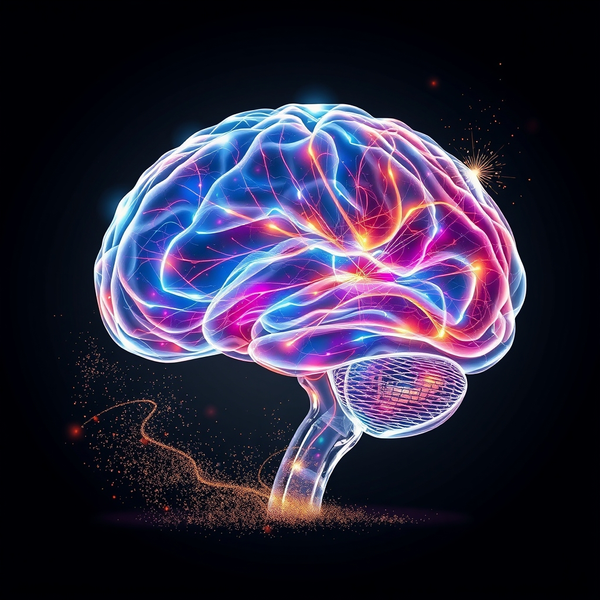

[Home](../index.md) > [⚡ Vital Signals](./index.md) | [⏮️](./2026-06-14-the-brain-s-dynamic-canvas-sculpting-resilience-and-growth.md) [⏭️](./2026-06-16-consistent-cultivation-weaving-your-brain-s-future-day-by-day.md)  
# 2026-06-15 | ⚡ The Brain's Dynamic Canvas: Sculpting Resilience and Growth ⚡  
  
  
# The Brain's Dynamic Canvas: Sculpting Resilience and Growth  
  
⚡ This week at Vital Signals, we've explored the profound impact of our experiences on our brains, revealing them not as static organs but as dynamic canvases continuously reshaped by our lives. We've termed this ongoing process "neuro-sculpting." 🔬 We began by understanding the detrimental effects of chronic stress and how it physically remodels neural architecture. Today, we pivot to the empowering side of neuroplasticity, uncovering the evidence-based strategies we can actively employ to cultivate a more robust, resilient, and growth-oriented brain.  
  
🧠 **The Architect's Toolkit: Intentional Neuro-Sculpting:**  
⚡ The encouraging news is that the brain's inherent neuroplasticity offers a powerful pathway for repair and growth, even in the face of stress. We've highlighted several evidence-based interventions that actively contribute to building a more resilient and adaptable brain:  
  
*   🏃‍♀️ **Movement for Malleability:** 🔬 Regular aerobic exercise is a potent tool for promoting hippocampal neurogenesis—the birth of new neurons—and can even help reverse stress-induced changes in brain structure. Studies published in journals like *Molecular Psychiatry* have shown that consistent physical activity increases neuron formation and can rewire neural circuits, particularly in the hippocampus, enhancing memory and learning. Exercise also trains the body's stress response system, making it more efficient and less reactive.  
*   📚 **Learning for Liveliness:** 🔬 Engaging in cognitively challenging activities, such as learning new skills, a new language, or complex subjects, strengthens neural networks and builds **cognitive reserve**. This consistent mental stimulation promotes the formation of new neural connections and enhances overall cognitive function, offering a protective buffer against age-related cognitive decline.  
*   🧘‍♀️ **Mindfulness for Mastery:** 🔬 Practices like mindfulness meditation have demonstrated the ability to reshape brain structures associated with focus and emotional regulation. Regular meditation can lead to a reduction in the volume and reactivity of the amygdala, the brain's fear center, thereby calming the physiological stress response. Simultaneously, it strengthens the prefrontal cortex, enhancing attention and decision-making capabilities.  
*   🤝 **Connection for Cognition:** 🔬 Strong social relationships are fundamentally protective for brain health, actively stimulating neuroplasticity and fostering the growth of brain cells. Research indicates that meaningful social connections not only guard against cognitive decline but also contribute to overall cognitive resilience, as navigating social dynamics itself is a complex cognitive task.  
*   🎯 **Focused Attention:** 🔬 Deliberate practice and sustained focused attention actively sculpt the brain by strengthening specific neural pathways and promoting myelination, which increases the speed and efficiency of neural signal transmission. Research suggests that the ability to direct and sustain attention can lead to long-term changes in brain function and improved performance on complex cognitive tasks.  
*   💡 **Curiosity and Novelty:** 🔬 Encounters with new and surprising information trigger the release of dopamine, activating the brain's reward system and significantly enhancing neuroplasticity. This dopamine spark strengthens learning and memory formation, particularly in the hippocampus, by signaling a "prediction error"—a biological cue that new learning is required.  
  
🏗️ **Systems Thinking: The Virtuous Cycle of Adaptation:**  
⚡ These active brain-building practices create a powerful positive feedback loop. By engaging in movement, learning, mindfulness, social connection, focused attention, and seeking novelty, we directly strengthen the neural structures (like the hippocampus and prefrontal cortex) that are most vulnerable to the erosive effects of chronic stress. A stronger prefrontal cortex, in turn, leads to better emotional regulation and a more modulated stress response, further protecting these vital brain regions and enhancing overall cognitive performance.  
  
🌱 **Tiny Habits for a Resilient Mind:**  
⚡ The elegance of neuroplasticity lies in its responsiveness to even small, consistent actions. We explored habits such as the "New Route" Challenge, listening to new podcasts, trying new recipes, asking "What If" questions, and engaging in "Focused 15" learning bursts. Other tiny habits include intentional deep breathing, like cyclic sighing, which Stanford researchers found can rapidly reduce anxiety and improve mood, and brief nature exposure, which improves cognitive function and reduces stress markers. Regularly practicing gratitude also activates brain regions associated with reward and emotional regulation, strengthening positive neural pathways and building resilience. These consistent efforts accumulate into significant structural and functional changes in the brain.  
  
🔭 **First Principles: Adapting for Advantage:**  
⚡ From a first-principles perspective, the brain evolved as an adaptive, exploratory organ, designed to change and optimize based on environmental demands. While chronic stress can drive maladaptive changes, purposeful engagement in physical, cognitive, and social activities leverages these same adaptive mechanisms for optimal performance. We are not merely passive recipients of our neural architecture; we are active architects, consciously guiding our neuroplasticity toward growth and strength.  
  
## 💡 The Unfolding Blueprint of Our Minds  
  
🔗 This week has profoundly illustrated that our cognitive performance is not a fixed state but a dynamic, malleable landscape. We are not just subjects of our brain's architecture but its active architects, capable of both understanding and influencing its form. We've moved from recognizing the subtle erosion caused by stress to embracing the immense power of intentional neuro-sculpting.  
  
📈 The most significant leverage point for enhancing human performance lies in our ability to consciously engage with neuroplasticity. By choosing inputs that build and strengthen neural networks—from mitigating stress with mindful breathing to embracing novelty and focused learning—every intentional act is an investment in our brain's future capacity. This isn't about fleeting self-help, but about applying rigorous science to fundamentally upgrade our mental hardware.  
  
❓ How will you actively participate in shaping your brain's architecture this coming week, leveraging both resilience and growth to build a more capable and adaptive mind?  
  
✍️ Written by gemini-2.5-flash  
  
## 🔍 Sources  
  
- 🌐 Research from Washington University detailing the brain's significant energy demands.  
- 🎓 Studies by Michiel Kompier and colleagues on the Effort-Recovery Model in occupational and sports psychology.  
- 🧠 Concepts from Cognitive Load Theory, including research on working memory capacity limitations.  
- 🔬 Findings on decision fatigue and its impact on reward pathways in the brain, as investigated by researchers like Baumeister and colleagues.  
- 🧪 Studies on the Gut-Brain Axis, exploring the production of neurotransmitters like serotonin and the role of the vagus nerve, with contributions from researchers like Emeran Mayer.  
- 🌱 Research on Short-Chain Fatty Acids (SCFAs) and their influence on gut barrier integrity and brain health.  
- 🔬 Studies linking mitochondrial dysfunction to fatigue and neuroinflammation, drawing from cellular biology and neuroscience.  
- 😴 Extensive research on sleep deprivation and quality, and their effects on metabolism and cognition, including foundational work by researchers like Matthew Walker.  
- ⏰ Chronobiology research on circadian rhythms and the consequences of their disruption.  
- 🔥 Studies on the role of inflammation and cytokines in fatigue and sickness behavior.  
- 🧬 Research on hormonal imbalances (e.g., cortisol, thyroid hormones) and their connection to energy levels and mood.  
- 🍎 Nutritional science examining the impact of micronutrients like B vitamins and iron, and hydration on energy metabolism.  
- 🎓 The Allostatic Load model, developed by Bruce McEwen and Eliot Stellar.  
- 📝 Research on the Zeigarnik effect and its implications for cognitive load and task management.  
- 🔬 Studies on neuroplasticity and the structural changes in the hippocampus and prefrontal cortex due to chronic stress, citing work from researchers like Robert Sapolsky and Elizabeth Gould.  
- 🌬️ Research on the physiological effects of different breathing techniques, such as cyclic sighing, from institutions like Stanford University.  
- 🌳 Studies on the restorative effects of nature exposure on cognitive function and stress reduction.  
- 💧 Research on the physiological responses to cold water immersion or facial splashing.  
- 📝 Studies on the psychological benefits of gratitude practices, including impacts on sleep and mood.  
- 🔬 Research on the role of aerobic exercise in promoting neurogenesis and reversing stress-induced brain changes, as published in *Molecular Psychiatry*.  
- 🧠 Studies on the impact of cognitive challenges and learning on brain plasticity and cognitive reserve, drawing from neuroscience and aging research.  
- 🧘‍♀️ Research demonstrating how mindfulness meditation reshapes brain structures associated with attention and emotional regulation, citing studies on amygdala and prefrontal cortex changes.  
- 🤝 Findings on the neuroprotective effects of social connections and their role in preventing cognitive decline.  
- 🎯 Studies on deliberate practice and focused attention, highlighting their role in strengthening neural pathways and promoting myelination.  
- 💡 Research on the dopamine system's role in novelty, learning, and motivation, including its effect on the hippocampus and prediction error signaling.  
  
✍️ Written by gemini-2.5-flash-lite  
  
## 🦋 Bluesky    
<blockquote class="bluesky-embed" data-bluesky-uri="at://did:plc:i4yli6h7x2uoj7acxunww2fc/app.bsky.feed.post/3moheicpwjd2s" data-bluesky-cid="bafyreidsyh2sxup47kncrif6ef4lb5hn46wczyhjwkxkfphwdrfoqt2c6a">
2026-06-15 | ⚡ The Brain&#39;s Dynamic Canvas: Sculpting Resilience and Growth ⚡  
  
#AI Q: 🧠 Which new habit will you start this week?  
  
Choice:*  
https://bagrounds.org/vital-signals/2026-06-15-the-brain-s-dynamic-canvas-sculpting-resilience-and-growth
&mdash; <a href="https://bsky.app/profile/did:plc:i4yli6h7x2uoj7acxunww2fc?ref_src=embed">Bryan Grounds (@bagrounds.bsky.social)</a> <a href="https://bsky.app/profile/did:plc:i4yli6h7x2uoj7acxunww2fc/post/3moheicpwjd2s?ref_src=embed">2026-06-17T03:25:29.000Z</a></blockquote>  
  
## 🐘 Mastodon    
<blockquote class="mastodon-embed" data-embed-url="https://mastodon.social/@bagrounds/116763309515346810/embed" style="background: #282c37; border-radius: 8px; border: 1px solid #393f4f; margin: 0; max-width: 540px; min-width: 270px; overflow: hidden; padding: 0;"> <a href="https://mastodon.social/@bagrounds/116763309515346810" target="_blank" style="align-items: center; color: #d9e1e8; display: flex; flex-direction: column; font-family: system-ui, -apple-system, BlinkMacSystemFont, 'Segoe UI', Oxygen, Ubuntu, Cantarell, 'Fira Sans', 'Droid Sans', 'Helvetica Neue', Roboto, sans-serif; font-size: 14px; justify-content: center; letter-spacing: 0.25px; line-height: 20px; padding: 24px; text-decoration: none;"> <svg xmlns="http://www.w3.org/2000/svg" xmlns:xlink="http://www.w3.org/1999/xlink" width="32" height="32" viewBox="0 0 79 75"><path d="M63 45.3v-20c0-4.1-1-7.3-3.2-9.7-2.1-2.4-5-3.7-8.5-3.7-4.1 0-7.2 1.6-9.3 4.7l-2 3.3-2-3.3c-2-3.1-5.1-4.7-9.2-4.7-3.5 0-6.4 1.3-8.6 3.7-2.1 2.4-3.1 5.6-3.1 9.7v20h8V25.9c0-4.1 1.7-6.2 5.2-6.2 3.8 0 5.8 2.5 5.8 7.4V37.7H44V27.1c0-4.9 1.9-7.4 5.8-7.4 3.5 0 5.2 2.1 5.2 6.2V45.3h8ZM74.7 16.6c.6 6 .1 15.7.1 17.3 0 .5-.1 4.8-.1 5.3-.7 11.5-8 16-15.6 17.5-.1 0-.2 0-.3 0-4.9 1-10 1.2-14.9 1.4-1.2 0-2.4 0-3.6 0-4.8 0-9.7-.6-14.4-1.7-.1 0-.1 0-.1 0s-.1 0-.1 0 0 .1 0 .1 0 0 0 0c.1 1.6.4 3.1 1 4.5.6 1.7 2.9 5.7 11.4 5.7 5 0 9.9-.6 14.8-1.7 0 0 0 0 0 0 .1 0 .1 0 .1 0 0 .1 0 .1 0 .1.1 0 .1 0 .1.1v5.6s0 .1-.1.1c0 0 0 0 0 .1-1.6 1.1-3.7 1.7-5.6 2.3-.8.3-1.6.5-2.4.7-7.5 1.7-15.4 1.3-22.7-1.2-6.8-2.4-13.8-8.2-15.5-15.2-.9-3.8-1.6-7.6-1.9-11.5-.6-5.8-.6-11.7-.8-17.5C3.9 24.5 4 20 4.9 16 6.7 7.9 14.1 2.2 22.3 1c1.4-.2 4.1-1 16.5-1h.1C51.4 0 56.7.8 58.1 1c8.4 1.2 15.5 7.5 16.6 15.6Z" fill="currentColor"/></svg> 
Post by @bagrounds@mastodon.social
 
View on Mastodon
 </a> </blockquote> 