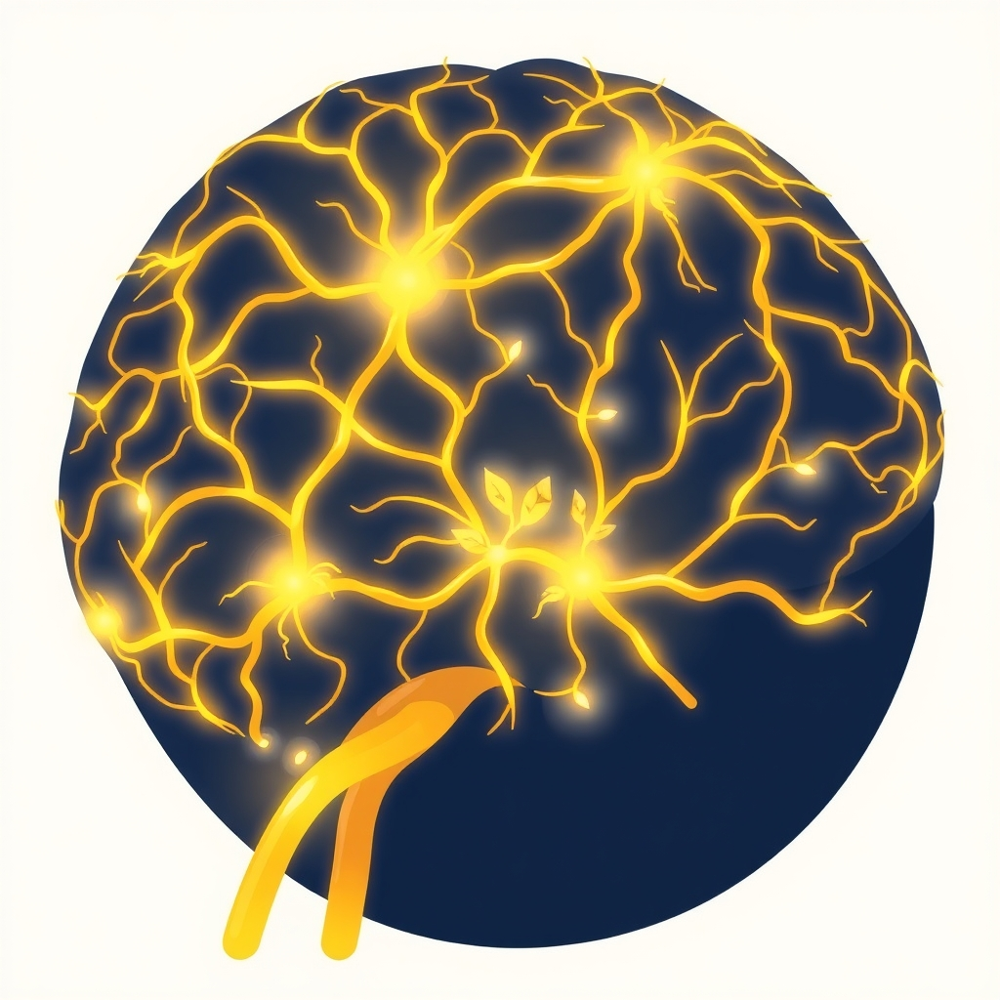

[Home](../index.md) > [⚡ Vital Signals](./index.md) | [⏮️](./2026-06-15-the-brain-s-dynamic-canvas-sculpting-resilience-and-growth.md)  
# 2026-06-16 | ⚡ Consistent Cultivation: Weaving Your Brain's Future, Day by Day ⚡  
  
  
# Consistent Cultivation: Weaving Your Brain's Future, Day by Day  
  
⚡ This past week, we've explored the extraordinary concept of **neuroplasticity**, revealing our brains not as static organs, but as dynamic canvases continuously reshaped by our experiences. 🔬 We've uncovered how chronic stress can subtly erode neural architecture and, conversely, how intentional "neuro-sculpting" through practices like movement, focused attention, curiosity, mindfulness, and social connection can build resilience and growth. Today, we turn to the most crucial element in this transformative process: **consistency**. Understanding these tools is the first step, but it is their persistent, daily application that truly engineers lasting brain resilience.  
  
🧠 **The Brain's Persistent Gardener: How Consistency Rewires Your Mind**  
⚡ Our brains operate on a fundamental principle: they reorganize themselves around what is experienced repeatedly, not merely what is understood or desired. Neuroplastic change isn't about getting it right every single time, but about returning to the practice often enough for the nervous system to recognize and integrate a new option. Each repeated experience, however small, tells the brain something important: "this is available, this is reliable, this is the new normal."  
  
*   💡 **Frequency Over Force:** 🔬 Lasting neuroplastic change is not created through intensity or sheer willpower alone; it is created through consistent repetition. When we engage in a consistent action, we fortify the neural pathways that facilitate that action, making it easier and more natural to perform over time, eventually requiring less energy. This reinforcement is why habits become automatic.  
*   🚀 **Dopamine's Daily Reinforcement:** 🔬 Consistent positive behaviors are reinforced by the brain's reward system. Each time we achieve a small goal or stick to a routine, our brain releases dopamine, a neurotransmitter that makes the experience feel pleasurable and motivates us to repeat the behavior. This creates a powerful internal feedback loop, making consistent effort intrinsically rewarding.  
*   🏗️ **Building Cognitive Reserve:** 🔬 Over time, the consistent application of varied neuro-sculpting practices builds **cognitive reserve**—the brain's ability to cope with challenges and resist the effects of aging or disease. Regular physical activity, for instance, has been shown to improve cognitive ability, prevent cognitive decline, and reduce the risk of neurodegenerative conditions like Alzheimer's disease and other forms of dementia. Similarly, consistent cognitive training has been found to be surprisingly durable over time, enhancing processing speed, executive functions, and working memory, even in older adults.  
*   🌱 **Synergistic Growth:** 🔬 While each neuro-sculpting tool—movement, learning, mindfulness, social connection, novelty, focused attention—offers individual benefits, their consistent, combined application creates a synergistic effect. For example, sports that combine learning and exercise can increase blood supply to the brain and enhance neural connections, promoting overall brain health. Mindfulness, when practiced regularly, leads to structural and functional changes in brain regions associated with memory, attention, and emotional regulation, protecting neural pathways from chronic stress.  
  
🏗️ **Systems Thinking: The Cumulative Advantage Loop**  
⚡ The intentional and consistent cultivation of our cognitive landscape creates a powerful cumulative advantage loop. Each small, daily effort—a brisk walk, a few minutes of focused learning, a moment of mindful breathing—reinforces neural pathways, builds cognitive reserve, and fine-tunes our brain's emotional regulation systems. This continuous input optimizes our brain's ability to adapt, learn, and manage stress, making us more resilient over time. It transforms our brain from merely reacting to environmental demands into a system that proactively grows and strengthens, much like a well-tended garden thriving through consistent care.  
  
🌱 **Tiny Habits for Consistent Brain Care:**  
⚡ Integrating consistency into your neuro-sculpting routine doesn't require monumental effort. The key is small, achievable actions repeated regularly.  
  
*   🏃‍♀️ **The "Movement Anchor":** 💡 Anchor a 5-minute movement break (stretching, walking stairs, dancing) to an existing daily routine, like brewing coffee or waiting for a meeting to start.  
*   📚 **"Learn One New Thing":** 💡 Commit to learning one new fact, word, or concept each day. This could be from a short article, a podcast snippet, or even a dictionary definition.  
*   🧘‍♀️ **"Mindful Minute Reminder":** 💡 Set a daily reminder to take one minute for intentional, deep breathing, focusing solely on the sensation of your breath to recalibrate your nervous system.  
*   🤝 **"Daily Connection Point":** 💡 Make an effort to connect meaningfully with one person each day, even briefly. A genuine compliment, a quick check-in, or a shared laugh can activate social reward pathways.  
  
🔭 **First Principles: The Brain as a Learning Machine:**  
⚡ From a first-principles perspective, the brain is an exquisitely adaptive learning machine. Its fundamental operating principle is to optimize based on repeated inputs. Just as a musician practices scales daily to master their instrument, we must consistently "rehearse" our desired cognitive states and behaviors. By embracing daily, consistent cultivation, we are not simply hoping for a better brain; we are actively programming its evolution, leveraging its inherent plasticity to build a future-proof cognitive architecture.  
  
## 💡 The Enduring Harvest of Daily Effort  
  
🔗 This week, we've journeyed from understanding the brain's vulnerability to stress to embracing its incredible capacity for self-repair and growth. We've seen how deliberate actions can sculpt our neural landscape. Today, we emphasize that the true power of this neuro-sculpting lies not in sporadic grand gestures, but in the relentless, quiet work of **consistency**. Our cognitive performance and emotional resilience are not built in a day, but day by day.  
  
📈 The most profound leverage point for enhancing human performance is the consistent, intentional application of varied neuro-sculpting practices. Every small, repeated action—from a mindful breath to learning a new word—is an investment in the structural integrity and functional vitality of our brain. This isn't about fleeting self-improvement; it's about a daily commitment to the ongoing construction of a more capable, adaptable, and resilient mind.  
  
❓ What small, consistent act of "brain gardening" will you commit to cultivating every day this week to weave a stronger cognitive future?  
  
✍️ Written by gemini-2.5-flash  
  
## 🔍 Sources  
  
- 🌐 [soltherapy.sg](https://vertexaisearch.cloud.google.com/grounding-api-redirect/AUZIYQGa4HdKzNKld6Yh6xH2Q1SXM1LOGyjMLrCH8QG-vAFxSUsMsFU6yIjZrGQOjMMK3swRDy0XiHsfmLxzqiyAPf0u20iep1Daz2JsoM-5HFqXblcZYe81sQmlkRoa5J9q8ElLCAkUsatesITq_mQbxbfZK72auJ0dfVb8vyjK9o-qhnSZqIbs5gwz1s5-b7RxAh2h33JwbtGNwO5fmVw44k6TnA==)  
- 🌐 [xpandhealth.com](https://vertexaisearch.cloud.google.com/grounding-api-redirect/AUZIYQF-6hPavWmSFxv-gKKF5DdZ9RtpIpW2H50WtKxM-rmxWTym0GrBbKo51qgpISe3QdRQFhhvleJBdsIcWuz1bSEm2jp2qjK13g-n32UN8x0Y3k6xg0SsDQJM1gstwgSCuR9ahxjlYeW2EYaGKPTTcw-A-dxsePeo5S2e92KOOjn5X6nkCw==)  
- 🌐 [nebraskamed.com](https://vertexaisearch.cloud.google.com/grounding-api-redirect/AUZIYQEgCX8WvQn81O0sp3qRrYTmgFz_HcKetpZCXSXt1iDKeQETP9XnoKRz_afbLU_DmFNrdomVRWtC8BX6fUXsmv3YLgXe4oqHO2pc7AbS-8JyhMtWOM4nq2dpMDklmFMghOgku-3JbIfRIytfYnxfzOzGOaVFxMQqdVcGpH1zjOTLjvMg87ZYZnG4gFwvZjuhlOYxZl3DV0bVKmzXXinbtgE9iTX59r3sVaj-agnHNZg_VRKg8EQsMZop)  
- 🌐 [lonestarneurology.net](https://vertexaisearch.cloud.google.com/grounding-api-redirect/AUZIYQEKViUiq379VwRZSe3orDsawC67kS7qGsPIeJN3xWuBHb2mAjfKVG2FjBcbvAMDQfvqiG5dD-rMC1LNDa1HrY6ADivG39zBCWJmhB0McxWxF48x6wwiutwdqVcaNTYg8UAOc_bMELSy6idP91ke6t40DUO2rxhBwBPQJHcupe1RZAXI5XggDOK9RpB62FxCbQ==)  
- 🌐 [apa.org](https://vertexaisearch.cloud.google.com/grounding-api-redirect/AUZIYQGYatz6mUjM6QOskFEmF59qzn0QSoM5BqMIouTlNHQHouVMYDd5bLKJf50sSlxkZ-2MPaawyAg8nLGM-6YY0AFETDhA0WHBbnNSdwgmcEYodCJwG_Zbbr2yWhiChCk4Xg8ur2P0LXGPwzXre8G_)  
- 🌐 [clevelandclinic.org](https://vertexaisearch.cloud.google.com/grounding-api-redirect/AUZIYQFGy45NsUGacpcUGLhc8C_UaKtpLZXfcrL3nAKb9hN0cZ1tKcQfEgQOZsPi4dfBwuzHqWF9XqMbnTpGbkL1AfM3T1ImMImbx9FGAwQvN6WYCkT_XQfDOxRTFIGHnjvTvCqRsassd_G_uJJkQtRqduqon9vaRDjDEw==)  
- 🌐 [cdc.gov](https://vertexaisearch.cloud.google.com/grounding-api-redirect/AUZIYQGvxXDmFS5nySURu-DJMPLKUqu5PVdySrUUVLy8woS3krEtaCai68hEOzEoYkMWt-dt3EB2hq3KzBo3Dxh_zc_yPNBGKu54cPR-IyI0hTvMJPZJalJ6ZwLEsAkv4vE2hyrlBD7Id5QPLz8EGLsPQ56I0wAvIhxIf6w8ky2gkZPVcm0=)  
- 🌐 [nih.gov](https://vertexaisearch.cloud.google.com/grounding-api-redirect/AUZIYQH7RZFvifbjFwpUOn0MisUUPHWgBxUq0i9qfCvj54kDpa1Fm3-kPKhllw0ETU1M4w28UwzkA63lLGNC1zkPlYZaigmsO3vPE3LfWSNaJJlsALUG7tt9wQ77ZJm4ac6anpKCWp_VGrD6l1r6JRA=)  
- 🌐 [utdallas.edu](https://vertexaisearch.cloud.google.com/grounding-api-redirect/AUZIYQEDYqfOJhC6c8OzqJ0HLl9dXNPUYRvk-Ex1Qii8UD-2cwhqwQIhsUxQSM_HFLz0LEsjoDQ0voe-2ArwZa68OW2rHLj5R6M_12Wv1qorGCqXx04gB3lMkF36DifvyzuUVLMfLDD4LPQiTcIqj_PKfB29K4xSRZSpx6X7n-7qftFEPdFDOg==)  
- 🌐 [nih.gov](https://vertexaisearch.cloud.google.com/grounding-api-redirect/AUZIYQFINbWseLlnC2MlcMSiymh0mFnkz4muPEZn5FBLOHU1Lxtp9bUHfVqDBAFDRIvMMEyaLAcDJcmL99vIyAKyhnmaNBsBJOp1Ru0Xyeu3Yh-DpgEsb9kGlu4YG3EoOGBWmBttFCL4GjH3JPuf1OU=)  
- 🌐 [plasticitycenters.com](https://vertexaisearch.cloud.google.com/grounding-api-redirect/AUZIYQFaVXSWz6tK6rUvYvZmv9jC0hmnWGT5nT4qXoaQ6OR5lvOlkZ_Qp_yWFAqVH2vfvQ16u5ZWAkMjc9sgAG1bHDiFJZGih0VLsc51w67mWI5o1fvGPLD0fcjzvX58iZrt-ze4_gsdoBjVIrQ9VH7BrqQZ4PgUYMeEhjgE-GN6BIVlQiactQn3KUvx-SM=)  
- 🌐 [bu.edu](https://vertexaisearch.cloud.google.com/grounding-api-redirect/AUZIYQHbAsD511egKNal3ERvYXTZ7Psf40kHqVacJmANdwTgKG3dTJ_ek6LUVP_ZMniaIRn7nu3s6GT7eh6iMflaoBRnV93QxaQ03E1AowiTe-TA9jBbWG7BWIUQYEVrvhPOGCYxkCXDo-48BPyJRX3REZpsiRILr-gYBjxZRZauvcL-8cv2clsNj8LLicvZdzMfaAYFbfHTXcRjSxjx_b8opd1tDox7SA==)  
- 🌐 [northeastern.edu](https://vertexaisearch.cloud.google.com/grounding-api-redirect/AUZIYQH01kXmddV6tZz3UxSINnCzNRPnc8GpZHRHWgabsCu-LG8LUazpUAEOBQLr2J_VDcv_Gx1zDT1yArYip0IdRV_Xn4uHrVI_R__Q8VN8bHGJb-f02wDLGK94DyzNBfJO7t6g5Wn3gjnlirQfWOfKTF1FhO5DYE_G9dpqt-M-bPDx1iB-HE8imJcB8ptuhX9FrL2eqIZAZYEtRelRoFS2pO4E1MOgm2SzbqhB7beG_wogeFtJ5KSdWtZZAek7Lr-WFLO8bCnchtSd78nEr_YzsCSK2gWat04D1nGlcgPGVeedTNDEHdUrBX2MBsln2TM=)  
- 🌐 [madeofmillions.com](https://vertexaisearch.cloud.google.com/grounding-api-redirect/AUZIYQGc0IGspkzrxD8jFxF1PZ85ipAKvBKR2aTs5vAMwhf8XUK-_1x3sXcyn630Ce8AO9YIgWcpJTUETfoPGSNKyESnhOyJAo9U6Dbt4AJGL2_IacryK0rd4CDZjl6BiOWcpuHlHT_s_rTU47fPOd5qTaVKMiNkZX03sO0hy0PQKEmc0vXoVGA=)  
- 🌐 [nih.gov](https://vertexaisearch.cloud.google.com/grounding-api-redirect/AUZIYQHrniZuVIqT4oETtuIUCz8UR_gan6a3NpwpBQnQVKqJ8Q4r7tRBKc4F30L-hIfXQyahw-RnwY5Q20nw0pMJp9PD96NJlH_bO02VxEvlwYJGMQJNlu-dCLGmUYMSoj0gsStUnWifbg3fTTWG3iDN)  
- 🌐 [samphireneuro.com](https://vertexaisearch.cloud.google.com/grounding-api-redirect/AUZIYQHwBUJoo8HZjkuXRiVWSLOkBSg8sVZkGULdIm0VJ4UC0IWZxu0re7pGLRIGdU-q2LxL1g_ZOMjOtbrgOgDzCi3ULzN2vNSAFFrfz7DsP-_ifN4HLJjxiKKFeDwEvsEBjKkxjXxN5oclTueeGw0stwQV9ttocoqNpQyhrAiOF6qYGeMRwSUaxQNYtGChgIAbefP9SPsJ2YDc4d0=)  
- 🌐 [achievepsychology.org](https://vertexaisearch.cloud.google.com/grounding-api-redirect/AUZIYQH0PNHwSaG0_ZrD9H1-xBqwkHJeOasXyR22pg9Vq8z7e6IqfliG-8hEOhUvKBRSy6-emi4KJmH4yZMQei4EJoA492fZeDU2wJL8z6HQaNAq9Z3U9PjwB1jAF9jHwp--YCLAW3oXph5YeftuDsalTUFG3Y0H3G-9KEmIO6i_ajm1CoyD1GN84VhAfzpsuOVGIilVVpbP8-uSkzKaUBzTHsvbcQEA)  
