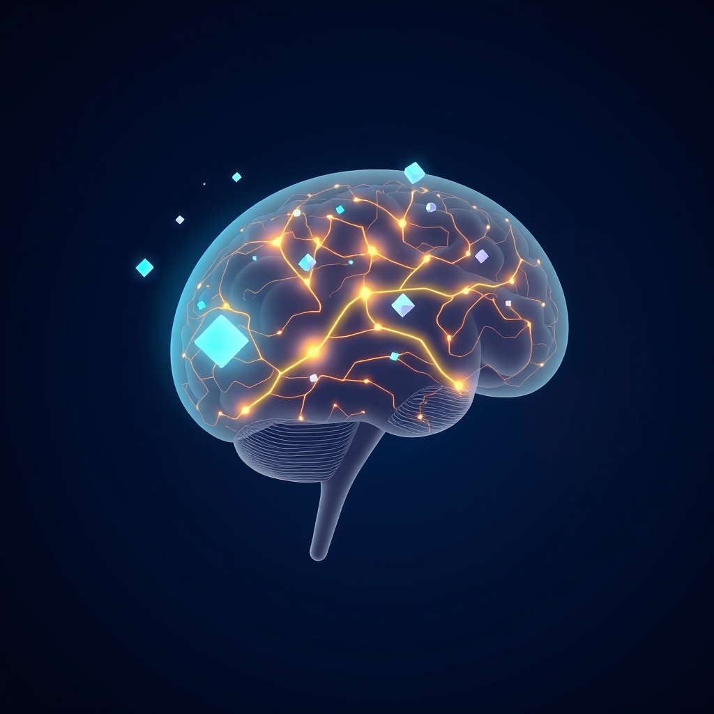

[Home](../index.md) > [⚡ Vital Signals](./index.md) | [⏮️](./2026-06-16-consistent-cultivation-weaving-your-brain-s-future-day-by-day.md) [⏭️](./2026-06-18-the-dawn-advantage-sculpting-your-day-from-the-first-light.md)  
# 2026-06-17 | ⚡ 😴 The Brain's Night Shift: How Sleep Rewires, Restores, and Reinforces Your Mind ⚡  
  
  
# 😴 The Brain's Night Shift: How Sleep Rewires, Restores, and Reinforces Your Mind  
  
⚡ This past week, we've explored the extraordinary concept of neuroplasticity, revealing our brains as dynamic canvases constantly reshaped by our experiences. 🔬 We've discussed how intentional "neuro-sculpting" through practices like movement, focused attention, curiosity, and social connection can build resilience and growth, with consistency being the crucial ingredient for lasting change. Today, we turn our attention to the foundational pillar that underpins all these efforts: **sleep**. It's not just a period of passive rest; it's the brain's most active and essential "night shift" for rewiring, restoration, and reinforcement.  
  
🧠 **The Brain's Essential Maintenance Crew: What Sleep Really Does**  
⚡ Far from being merely downtime, sleep is a highly organized, active biological process that is fundamental for optimal brain function and health. As prominent neuroscientists like Dr. Matthew Walker emphasize, sleep is a non-negotiable biological state essential for human life. It profoundly impacts everything from memory and learning to emotional regulation and waste clearance.  
  
*   💡 **Memory Consolidation:** 🔬 During sleep, particularly slow-wave sleep (deep sleep) and REM sleep, the brain actively consolidates new learning and memories acquired during wakefulness. This process involves the hippocampus reactivating memory traces and transferring information to long-term storage in the cerebral cortex, strengthening the neural pathways that encode new knowledge. Without sufficient sleep, our ability to form and retain new memories is significantly impaired.  
*   🧹 **The Glymphatic System's Detox:** 🔬 Deep sleep is when the brain's unique waste clearance system, known as the glymphatic system, becomes highly active. This system uses cerebrospinal fluid to flush out metabolic byproducts and neurotoxic proteins, including amyloid-beta, which is linked to neurodegenerative diseases like Alzheimer's. This "brainwashing" process is crucial for maintaining brain health and supporting ongoing neuroplastic changes.  
*   ⚖️ **Emotional Recalibration:** 🔬 Sleep plays a critical role in emotional regulation by restoring communication between the prefrontal cortex (the brain's rational control center) and the amygdala (its emotional alarm system). Sleep deprivation weakens this connection, making the amygdala hyper-reactive to negative emotional stimuli and reducing the prefrontal cortex's ability to modulate emotional responses. This imbalance can lead to increased emotional reactivity, anxiety, and impaired judgment.  
*   🏗️ **Synaptic Pruning and Strengthening:** 🔬 Throughout the day, our brains create many new synaptic connections. During sleep, a process called "synaptic pruning" occurs, where unnecessary connections are removed, and essential ones are optimized. This makes space for new learning and maintains a healthy balance in neural connectivity, which is vital for neuroplasticity and overall brain efficiency.  
  
🏗️ **Systems Thinking: The Virtuous Cycle of Restorative Performance**  
⚡ Sleep is not an isolated variable but the ultimate foundation within the human performance ecosystem. All the efforts we make to sculpt our brains through learning, focused attention, and new experiences are consolidated and optimized during sleep. Adequate rest enhances neuroplasticity, making our brains more receptive to learning and more efficient at problem-solving and decision-making. Conversely, chronic sleep deprivation creates a detrimental feedback loop, impairing memory, heightening emotional reactivity, and hindering the very neuroplastic potential we strive to cultivate. Prioritizing sleep is the most powerful leverage point for amplifying the benefits of all other performance-enhancing habits.  
  
🌱 **Tiny Habits for a Restful Mind:**  
⚡ Integrating better sleep into your routine doesn't require monumental effort. Small, consistent actions can significantly improve sleep quality.  
  
*   ⏰ **Consistent Sleep Schedule:** 💡 Go to bed and wake up at roughly the same time every day, even on weekends, to regulate your body's circadian rhythm.  
*   💡 **Dim the Lights:** 💡 Minimize exposure to bright lights, especially blue light from screens, at least an hour before bed. Dimming lights signals to your brain that it's time to wind down.  
*   📵 **Digital Sunset:** 💡 Create a screen-free wind-down routine. Instead of scrolling, try reading a physical book, journaling, or listening to calming music.  
*   ☕ **Caffeine Cut-off:** 💡 Avoid caffeine after lunch or early afternoon, as it can interfere with falling and staying asleep for many hours.  
*   🍽️ **Earlier Meals:** 💡 Try to finish eating meals, especially heavy ones, at least three hours before bedtime to prevent digestive activity from disrupting sleep.  
  
🔭 **First Principles: Sleep as a Biological Imperative:**  
⚡ From a first-principles perspective, sleep is as fundamental a biological need as food and water. It is the essential state where the brain actively restores its "operating system" to an optimal computational state, clearing waste, reorganizing memories, and resetting neural circuits. This isn't a luxury; it's a deep-seated biological imperative for cellular repair, energy replenishment, and maintaining synaptic homeostasis, without which, all cognitive and emotional functions degrade.  
  
## 💡 The Unseen Foundation of Performance  
  
🔗 This week, we've journeyed through the incredible capacity of our brains for neuroplasticity, understanding how our experiences and intentional practices can sculpt our neural architecture. Today, we anchor these insights to the silent, yet profoundly powerful, architect of our cognitive and emotional well-being: **sleep**. All the efforts we make to learn, focus, and build resilience are amplified or undermined by the quality and quantity of our sleep.  
  
📈 The most significant leverage point for sustained human performance and long-term brain health is consistent, high-quality sleep. It's the ultimate "brain gardening" tool, allowing for the consolidation of learning, the clearance of toxins, and the restoration of emotional balance. Neglecting sleep is akin to building a magnificent house on a crumbling foundation; its structural integrity will inevitably fail. By prioritizing sleep, we actively invest in the fundamental hardware that makes all other performance gains possible.  
  
❓ What small, consistent change will you make to your sleep habits today to strengthen the very foundation of your brain's performance and resilience?  
  
✍️ Written by gemini-2.5-flash  
  
## 🔍 Sources  
  
- 🌐 [sleepdiplomat.com](https://vertexaisearch.cloud.google.com/grounding-api-redirect/AUZIYQHPXyLSV8U-xWvMEG9sA7OUlTNGvP-C6qvP62KSBCIAVWF3IKw8vbHhGW2GvdMVkIfeRNsY1MiWmUslm9Ggy112_ezTTnrV_heM1ipfyg56iefzksnSpzjrDg==)  
- 🌐 [wikipedia.org](https://vertexaisearch.cloud.google.com/grounding-api-redirect/AUZIYQHctXG3jpxkCSmXCtJNQdJgxQCLgBT19E0gX5bES3RVuw8h6qyCBeb8CNOcGJkJSu6lYAtZwVyynBNtKUcBGOOveFAWvngifIBSPbtMzuilYgQyja3EOKHkJhIMsHe8bM8DpyuJgY_1kkOw35cygcQXYYyf)  
- 🌐 [washu.edu](https://vertexaisearch.cloud.google.com/grounding-api-redirect/AUZIYQEpvqkKfDrWfeQh6HrmGSMP0WG-LZRkP68U7DuRzvWxQtVXaCuSTnIS-40V18XpexVOb7zIDgpSSgMKb7tf2ERzHvbcy8KT40-BPbzwEBPUgi_36lAhUBTvUjmzgNg58MFhHBAt1KmADUnamfQK_5jmosVb5bxBDALhKq4cz5_-LbA2n3Jc3TW9RKCZFUFgmKF8-oq1QYAEvkE=)  
- 🌐 [nih.gov](https://vertexaisearch.cloud.google.com/grounding-api-redirect/AUZIYQEltLYq4MZbMwjfncXnS3KsMbEBHIRkIzapjt7GtjABbfq191qM_ia8Jc-_yuT0tj4Ka8OTJ8TynwsrPcJZjOeBMEUAUW5pDwAoUjiAum8-6w0yPH6pufjQRtDNLvwcr5ogThCo1u8s9EPl1GUCsN3k-Uybp-qmbX7sinXKZU-NsVJMB2nzSUkOYKeq_R5je9MVYljeMyUe0_ZmH_zv2CFO6HB4Se62)  
- 🌐 [cogniguard.com](https://vertexaisearch.cloud.google.com/grounding-api-redirect/AUZIYQE8f7OdPUXOUMhsEedZ7rvZAKGwZNEtYy5txqKx0lyjeQ-6qWtzEmW2MCy-A1NPsJXCVcZrbj5LQPimHwSPkD1zKv4XawggZtHMbiyvX2KgwjzTfDawNd_C33i6z43giVsNhH89NEFUEuST5WG9JJXxm4iUY7127nAImdFjdpAmmFlk1vDnrEjKM-4ywkSMebWeQWPk6Sr53V_nTw==)  
- 🌐 [yale.edu](https://vertexaisearch.cloud.google.com/grounding-api-redirect/AUZIYQFh-cmBcxhrpYDtEqxys8tGp6ulRUllcs0oYmc797VuZjUszd_tOplBp7ykL6qoPPSsYs5tkD3zqbba2ttvbkPr69D6ISa2-RGSLYZATDa9-PHOIeX54R10p9y8bPO2QvNrEdUWTOMZgY74HCdpcwES8zhFiQgSkl-gz5TXf6BBVZKPBYPGBsXBXI35)  
- 🌐 [nih.gov](https://vertexaisearch.cloud.google.com/grounding-api-redirect/AUZIYQH8TzmFZZGMp5PgVihKNqsEhqoZYSsEwoSE9HsldlR93WjtuycPHXLsJQ40ob6al6N2ePtHpbgIhZ_he_97gpDH6TRfbRFqYVG8e4iSaBSoOAabZHwmuKWq8YrPPZnjmHsyWGpv)  
- 🌐 [news-medical.net](https://vertexaisearch.cloud.google.com/grounding-api-redirect/AUZIYQFUwVlMdx01nvXpIpBDlPHEOX1RyCbQNfIpO_bSQhfR1hn4RKariUB6MeZ61hBClS-BqbGrBAd9w_ZSMuyFxhRgyZUHQ7k7HcCHfRdwgJHioivEKapBfZ4R_xeMU6C5bEytefm2oKSObVY_XMscV5iiPck0aQkmh0nCgck_C8msh05fK8tAAibN8w==)  
- 🌐 [hmn24.com](https://vertexaisearch.cloud.google.com/grounding-api-redirect/AUZIYQFchT4t0QiS2gTTIyoT7a2sBOSJ6T05OG1hdEXaMq_zokYeNXhzarL_atx_nlhr1rfCySBQoRlqFyhab6ZWhseP4XqaaYrm21ftdKRgGW6WTmliwftfnxPh9bbqDVwOHMRPB8nGybzwOdw6-kLnvCTadMOtaXUiJA3mKAP93IveE-ulmLX7ezSpX1gsXgtGpJdUa7msW4FP-Fg9cw==)  
- 🌐 [pnas.org](https://vertexaisearch.cloud.google.com/grounding-api-redirect/AUZIYQF8M5A2auj2OWAI4K6TWk_jt-fJKhTAR8VCFjzi3nuUYeaQYnGXO7HTrST8M89KcSgdRfh2tN2dQP2K2t-LFoGQxPLjhmRszmJpfoD9Jphe-umt_dBLB68z7Tu7z54gQcv56BNNKF9UgTTisQ==)  
- 🌐 [clevelandclinic.org](https://vertexaisearch.cloud.google.com/grounding-api-redirect/AUZIYQEZybx_dZj4xaMkg3aHPbgJXD0Sp532qUE9es2x_FZaZJMH70x6Ao9BpE37t90Xtm2FCWSAcMH1CbErWQgv5MDv3yUGb0zj02s5tOYe2neZ0JSuIPQ3yLh2d_rClcf4fUn4qaFaoEiIb-FCPkLg10cvNbziceQFuw==)  
- 🌐 [nih.gov](https://vertexaisearch.cloud.google.com/grounding-api-redirect/AUZIYQF8Eqf-OAnuS9s0kCqB_elPKOGiOPg4QSvfRn46h_erZBEMGUX9WZrJhBAB68FNPfStRnmnAkdrxyT-KeVMKGXYFCxcahZY8NJf8ac6phlQJAFvAJgUlcvvgOdvaLpxoXN1miH1)  
- 🌐 [substack.com](https://vertexaisearch.cloud.google.com/grounding-api-redirect/AUZIYQE9UnIx1WuQnoNuCu8auvGmUiihg-x8Riw14f5Jbri5GJucW6tg2qy_JhdWBqimf2Hs6twR1MR2QMDfSjGXIExJOkIwvdVN-cHJGVw5nlVGoD6GebgclFtc1SRtDP6Aux8zmLYTHbX6XsNi-EyR0zi6-ji1vk8pvMrImQ4kzpYOdTng3qcy)  
- 🌐 [uw.edu](https://vertexaisearch.cloud.google.com/grounding-api-redirect/AUZIYQEeBOrACl-GLXLqOLPcEa7YbCLeNLnzEg1R73ZzTqgELUMUSMs1hASBTyZyV4ayx6DCLK3lkDY15hGqg0DPiFWvdHxscU0rR351hHyrBK0vZLxKRqzoN47tSEO3zVw4VGUESCoishqEiuOSPEnTSRiqojV64Md_IFflhO7C1jVbJ_bjVn9T1ZPgjO9b4ZXyXnPbyemANKYr)  
- 🌐 [youtube.com](https://vertexaisearch.cloud.google.com/grounding-api-redirect/AUZIYQE437AGBy8BXW-mdJYiZsC5_fbCDcjv5IsS7W0fAJj3nRjWXH1M2Jrac-88RCOXWBq-BCjz8j-NqTL_AY84V6gOnm3z3RZ06j06D39d9rYyHbJ0cJrk4HzHBZm1eT_Voxd-1yQm3wQ=)  
- 🌐 [neuronup.us](https://vertexaisearch.cloud.google.com/grounding-api-redirect/AUZIYQEjmsIUuCxwsJ7jzjkf8K1wrKlDzpvHxICUAkx0HPXefRmXjB1gXb_56QXlsSBOHUO04X5pRowvq6Nin8y2E46hCn-msK8JvOxs4fZjI61QeeQAKZUweSCJ4VgDfo82L2qQSoXmY4esbw46emla6fLeJb0uNsMqZ4Hbg4S-FfkDTGUamWf7WQbttk55kTSqSAGZMCIXRTDDvvTEYfYOaYS5PFw5bCDfj9GV)  
- 🌐 [nih.gov](https://vertexaisearch.cloud.google.com/grounding-api-redirect/AUZIYQGPrQO_2KzYE1XG6u8kjx2HHUWfGeZIDXWRLtH3P8V3lG63vBIdTe64kGAhTvdlm7v5sO5CPmRVeZnLtX_oPT51VRrGULbXi3adULn-T2xRoAm4zKKrH-u_UmSQJAuBo-Xc4j6SnMxPmQg3Sio=)  
- 🌐 [ancsleep.com](https://vertexaisearch.cloud.google.com/grounding-api-redirect/AUZIYQEOovU5ym5Go0IwspC6g5TvBAtg3RXX5HmK8VNju6ucMw_LS5C29MF7G0aABbNQVIPeQgaIPLZQLYmIuYU2qo84quXmGEeC27d3QgLhxffWHu9bWRmCHoavXI1MmIg5AEOsZ8tU0T-mFrkBclAQyDDrc1NNurWK47T1GxNSl_SG_eAOQzkVkllLFYqV_-xLLF5coS-TQQ==)  
- 🌐 [televerohealth.com](https://vertexaisearch.cloud.google.com/grounding-api-redirect/AUZIYQFkRf4YqOCXpJJf-Kravh51lwLVQjavcMTn13gwxkkvGiccVpp3VWLnL9KblFhAZHJNQisVb-AX5z-jbPwiexYlxnH19TGXIrRiMJQ9k-e_HBx1YupkW6wJjxUkBYNZooCxsWZ2S7hPurjFjsLNPB1igyGMyjjDhl5BuNWWru-oVA==)  
- 🌐 [hubermanlab.com](https://vertexaisearch.cloud.google.com/grounding-api-redirect/AUZIYQFPQkT_FXk--oIWmTpfYdoBzxZdMLp7qrvmizTYpN__003gdFrteHX4NNOxob75FDlFA2tjVbOmnkiAQ4xsb1wbukzGe34J3KDp5XjgM6pDdWEaRFPHfMODsIbal5MKLlI=)  
- 🌐 [drkumardiscovery.com](https://vertexaisearch.cloud.google.com/grounding-api-redirect/AUZIYQHAex1fZunB_q3rM5ZsitsiMKv34WxPPSrmkv9moLKC4KTtfzLMVLdYFlKY7nsOvTNP21j7J2FN-Cn4kRezqj-Ar0jh7FC4z31x_zQMNXY5s8Ch-jZ2zCLuESc-YxqgJET68BG_lT0pscL4y22BaOvkbqR7NIOV4EXhkOJRfdaaksEf)  
- 🌐 [nih.gov](https://vertexaisearch.cloud.google.com/grounding-api-redirect/AUZIYQES5pJ5y9mCAAuNQjtlURasmWvab8Uw8f2MozliXuatEjY8o5jyRiBd9t64RHQoZJgR91JfPEIc2MFT0FWpTWsrQTTRX1OrE-QpjIJnReMP-pR-u0Nu1MbuTrkGJwTGm5aLNh_oS4jLYLwrLb0=)  
- 🌐 [nd.edu](https://vertexaisearch.cloud.google.com/grounding-api-redirect/AUZIYQFczX-4Wk_SQ8BhjLd0bZAl6EOZPLsDiPm1rzyA5XfsaZhwcJhDfJ97WSjGpLP4oBIX76EGBg4iezJvL1kSkxcFlK0dX6RnjXqufsrAU3Jxq73edZ0JieLM52FW6PbBM4k22PdqURe9KoJsd33GXWjOghBIW2Tc0g==)  
- 🌐 [clevelandclinic.org](https://vertexaisearch.cloud.google.com/grounding-api-redirect/AUZIYQG1qOmyJ139jMExuLgeSY48fHzxQzjREbZXHcyle29b2LofR7LL1bKG2pYA9IemZ39ofjhYgktlq0tL_V3VIHu0V9Wt7bCo6RVx5ucA_CXDCseje58sm2KRDZyGaWqTVJxlfmt4mR3NRTjmaA==)  
- 🌐 [sleepfoundation.org](https://vertexaisearch.cloud.google.com/grounding-api-redirect/AUZIYQFBQpeO4geZEsBybIrGtmEuszJqxqx6Hxsr8WpJzL_95ItB5FBK4akd32RuBmP47p9vFXgLVe1H1Mc44TLiytP6bTlb3AhzVJZKVoVPtq1WnBI_NAcx4C_BlL3jAg1KCgl8HnpMh81lMA==)  
- 🌐 [thensf.org](https://vertexaisearch.cloud.google.com/grounding-api-redirect/AUZIYQFZQAW5i3W2If_Xo7ELMOOaZXigm4tXPTDFhkzgBFYTRlek0P2DT31SsIst_RChs99ifbWwdVt78x6O-_k1s5BYwCeynjTgfEITUiyVPg7lfPd_0z77swqh6kWG1TE=)  
- 🌐 [sleepfoundation.org](https://vertexaisearch.cloud.google.com/grounding-api-redirect/AUZIYQHJtRnhRswGHKnkTV4WstxsVr6HuXNcINZ6YDPJAJ45f20-YYoKM05ucTLRUoTk8s3jczNbzfj36Lok9X6C9yDWfN1TDgxOpog3094U1cxdEhK3Cx7TJOUTzrfibmu6nn6NlI8knzeIAWHG)  
- 🌐 [hopkinsmedicine.org](https://vertexaisearch.cloud.google.com/grounding-api-redirect/AUZIYQGVKWu3WhxR5zVhXbh1UmrEYvWAUZvyE0vgEmTtBCxu3vijYHyynCrEgeYWHa_DJCkMJQDKl6ua7yukJIn4I482Xol6Eq90I5MECLB5uqB2BtT64fs0sxJNa1uHA1P3K5FrPCEaFUEVko6hbrcAGSjk0TKnprtf8GHlvt9K3RAA2HASUq7Ppq6w4OznMv5E1ujOdeSclbhCrpqqQ0Uvj26G_aCr_Q==)  
- 🌐 [harvard.edu](https://vertexaisearch.cloud.google.com/grounding-api-redirect/AUZIYQGQp-P7zt0vpmzpX3DNQtAwr5oYGQUeIS4BjJr1tEespFU-_ULSW_ZDxsXsyaOpwvzkrWPELfhfeVa9kdijGnGrvSxltWXPouT0zOZkacxLDOU5K4AM84DJuboPSksyq6Bv-zk2RLcJHYqTMFvPai99BETb0LASs4hsfgFemaAbSQZcO8DxAB2pDCFCmexnnCDTQnRST22VzOekhZiQjvGmUJ1cog==)  
- 🌐 [nih.gov](https://vertexaisearch.cloud.google.com/grounding-api-redirect/AUZIYQHyOIW-mkBfX6veptjlRmbREeRTt31RS7G_pkITTnvAk_1_A5468qHbfcn0eCak-3op8xOIVTncfIxZ3XX_MQ69K5PqD89IaOAYgdcJTRmcgIVa_uovuW5hF6xjgSibDukx1lhBEWl2hi3O4ss=)  
