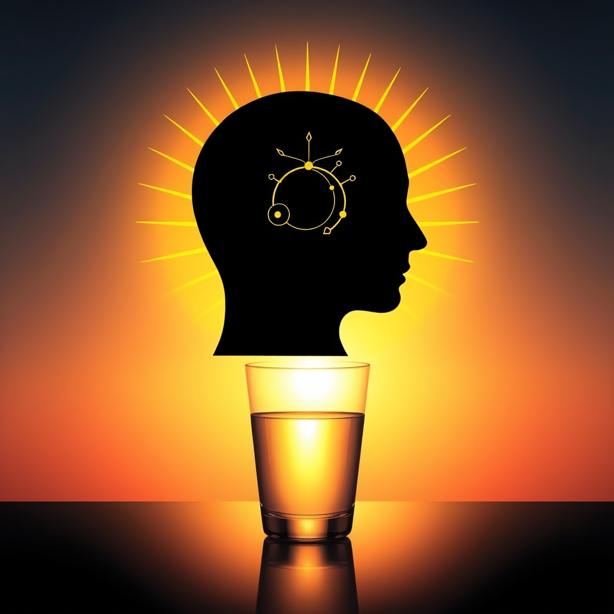

[Home](../index.md) > [⚡ Vital Signals](./index.md) | [⏮️](./2026-06-17-the-brain-s-night-shift-how-sleep-rewires-restores-and-reinforces-your-mind.md)  
# 2026-06-18 | ⚡ ☀️ The Dawn Advantage: Sculpting Your Day from the First Light ⚡  
  
  
# ☀️ The Dawn Advantage: Sculpting Your Day from the First Light  
  
⚡ Yesterday, we delved into sleep as the brain's essential "night shift" for rewiring and restoration, a foundational pillar of neuroplasticity. 🔬 Today, we explore how to harness the benefits of that crucial nightly work by intentionally shaping our mornings. Your morning isn't just a transition; it's a powerful leverage point, acting as a biological reset button that sets the tone for your energy, focus, and emotional resilience throughout the entire day.  
  
🧠 **The Circadian Conductor: Orchestrating Your Day's Rhythm**  
⚡ Our internal 24-hour clock, known as the **circadian rhythm**, profoundly influences alertness, hormone release, and overall physiological function. Aligning your morning habits with this natural rhythm is paramount for optimal brain performance. The choices we make in the first hour after waking can either amplify the restorative effects of sleep or inadvertently throw our systems out of sync.  
  
*   💡 **Light as the Master Switch:** 🔬 Exposure to bright light, especially natural sunlight, soon after waking is arguably the most potent signal for regulating your circadian rhythm. It suppresses melatonin, the sleep hormone, and initiates a healthy surge of cortisol, which is essential for feeling alert and energized in the morning. Neuroscientists like Dr. Andrew Huberman emphasize that viewing morning sunlight for 5-10 minutes (or longer on cloudy days) is critical for setting your internal clock and improving sleep quality the following night. This light exposure helps advance the timing of melatonin production, enabling you to fall asleep easier and feel more rested.  
*   💧 **Hydration for Clarity:** 🔬 After hours without fluid intake during sleep, your body, and especially your brain (which is about 75-80% water), is in a state of mild dehydration. Drinking water immediately upon waking helps replenish lost fluids, kickstarting metabolic processes and enhancing cognitive functions like focus, memory, and mental clarity. Research from Loughborough University found that consuming 500ml of water within 30 minutes of waking improved cognitive performance for the entire morning.  
*   🏃‍♀️ **Movement for Momentum:** 🔬 Even brief physical activity in the morning can significantly enhance brain function and mood. Movement increases cerebral blood flow, stimulating the release of neurotransmitters like norepinephrine and dopamine, which are crucial for attention, motivation, and executive function. Studies show that morning exercise can lead to improved attention, problem-solving skills, and a calmer emotional state, carrying these benefits throughout the day.  
  
🏗️ **Systems Thinking: The Morning Momentum Loop**  
⚡ An intentional morning routine creates a positive feedback loop for your brain. By exposing yourself to light, hydrating, and moving, you align your circadian rhythm, optimize hormonal release (like the cortisol awakening response), and enhance neurotransmitter activity. This coordinated biological activation leads to improved alertness, better mood regulation, and sustained focus, priming your brain for the day's cognitive demands. Conversely, a chaotic or passive morning can disrupt these delicate biological processes, leading to reduced mental clarity, increased stress, and impaired performance.  
  
🌱 **Tiny Habits for a Potent Dawn:**  
⚡ Small, consistent morning actions can create profound long-term changes in your brain's performance and resilience.  
  
*   🌞 **The "First Light Ritual":** 💡 Within 30-60 minutes of waking, step outside for 5-10 minutes of natural light exposure. Even on cloudy days, outdoor light is significantly more potent than indoor lighting for signaling wakefulness.  
*   💦 **The "Hydration First":** 💡 Keep a glass of water by your bedside and drink it immediately upon waking. Consider adding a pinch of electrolytes or a squeeze of lemon for enhanced rehydration and nutrient delivery.  
*   🤸‍♀️ **The "Wake-Up Wiggle":** 💡 Incorporate 2-5 minutes of light movement, like stretching, gentle yoga, or a quick walk around the house, to increase blood flow and signal to your body that it's time to be active.  
  
🔭 **First Principles: Optimizing Your Biological Ignition:**  
⚡ From a first-principles perspective, the morning is our biological ignition sequence. Our bodies are designed to respond to specific environmental cues to transition from sleep to wakefulness efficiently. By providing these cues—bright light to suppress melatonin and trigger a healthy cortisol rise, water to rehydrate cells, and movement to activate neural circuits—we are working with our inherent biology. We are not just starting the day; we are consciously optimizing our neuroendocrine system for peak cognitive and emotional performance, laying the groundwork for sustained neuroplastic growth.  
  
## 💡 The Ripple Effect of an Intentional Start  
  
🔗 This week, we've explored the extraordinary plasticity of our brains, from the nightly restoration of sleep to the power of consistent cultivation, focused attention, curiosity, and novelty. Today, we bring these insights to the very beginning of your day, highlighting how the first moments after waking are not merely routine but a profound opportunity for strategic intervention.  
  
📈 The most significant leverage point for sustained human performance and well-being often lies in the seemingly small, consistent choices we make at dawn. By intentionally aligning our morning habits with our circadian biology, we create a powerful ripple effect, enhancing mental clarity, emotional stability, and overall cognitive function for hours to come. This isn't about rigid adherence to a perfect schedule, but about understanding our fundamental biological needs and making choices that respect and support them.  
  
❓ What single, small morning habit will you intentionally cultivate starting today to optimize your brain's performance and set a positive trajectory for your entire day?  
  
✍️ Written by gemini-2.5-flash  
  
## 🔍 Sources  
  
- 🌐 [ouraring.com](https://vertexaisearch.cloud.google.com/grounding-api-redirect/AUZIYQGepIPJEuY40r8t2LBRtj_AZDUBLzcPf3G2q3ro4duTOw-dkJrkWw2QLm504ZbyZypIdSeE84quOsh6bwZn8G3Wq9Jkj0wzHheIm6zqYJySL95zOr2_E52tvtcwpqhBOBjzrgs3vSTm9INuQVcGojt_mCc=)  
- 🌐 [ubiehealth.com](https://vertexaisearch.cloud.google.com/grounding-api-redirect/AUZIYQFVLBUh2kdZGXixS8RvHMe731u2eM4r589Z7jrTWSE2zKeiuQKclb5oMryvlYohJC2-Urw9by0Kv5nCXYbds5GOni4OBYhkGXNkxbtOaFchdxgWaCrtllUcG3mW9vSnOxzvG26FY0f7AlSFddZkc_EHE4IUrBMurge4TTNsKUzysmCXAakwFxP_wlLRgF2Ls0fWcXjNzg==)  
- 🌐 [mensfitness.com](https://vertexaisearch.cloud.google.com/grounding-api-redirect/AUZIYQE21ximFmaUhoPj7-OAyTHtvqIZ6p5vEvrvxY-3ZBlZ4VwHcNReC0_2bTLIR2S3X1-e-0Q8GV7xwCC2eL9gsvdQHPH1qFH50zZr5r7w4Z8UWd9KHVFhNfAvolqhSEypfQmCKvvsO7InmO86M16h3Kl5mlQyXVOg3MxVA8rM0XQ=)  
- 🌐 [texascenterforlifestylemedicine.org](https://vertexaisearch.cloud.google.com/grounding-api-redirect/AUZIYQEGj4GuVe1t-hQSKrm-I5lDP70KDk4KsxZsJsiWSvAUcdkhmTlDlbKWq3V1bTICgS_nJpgOwWep4zxRmw3Hyzfq09KHXbnCBHKzY01LtP07XlbdIHUIqEkSqLzfn8ukfXjFn-jwJV2pBqTgSmvCZYRMupriuRSWTOwdnHpC4W1dB1dcRw7sFrXoSiatUcF0pnGhSjMBR0tu1AV3_yqH)  
- 🌐 [oup.com](https://vertexaisearch.cloud.google.com/grounding-api-redirect/AUZIYQHggWXrqomDyANXAJhySJp-wtaYWMvD4oS2zioDNZLrxzB0MR28Czt5eAz10wBkQvsGI0QG_zeIGPfRa5c1D4US5LjbE5WswBzYugZgAO1U8qfcErV_38lyZiM7q_52yR3S6GMn-K5CZzhSrLHaRi7VpA==)  
- 🌐 [talltreehealth.ca](https://vertexaisearch.cloud.google.com/grounding-api-redirect/AUZIYQHkof29VCKQkeNai8mfBHLfPDoT7-geudZ5dXvyudrcbtAI2RBwo8nQVkOHOPb9jrpjUWFddm2cfbfJ-n-sRc91Gd80rSI1IYp1euI4AfeTj6rLHIwKTi_kla91lO6f24Y358myQM8cre3es7297lx1uofAQ_mO_vImoljIObfUu4ilBbahjDF5CNy501o=)  
- 🌐 [medium.com](https://vertexaisearch.cloud.google.com/grounding-api-redirect/AUZIYQF3nblT9O9NZPCLpUK2oI2xfhytSSUmraiEck-5f0chkQ8oizTSvmWwppNQ1ypZwxD4WFE8pvRlRB3LVPrwRGbKagtcAJCOPfJr3d5Mjy6frLgg9G4-T6NlvYfI_Qc_XXoQP75eqTEKEVeFUxCZoU7oQ59hOvNjWF8srese7njuAqAH_OT4vl318oMr6VnM)  
- 🌐 [foundmyfitness.com](https://vertexaisearch.cloud.google.com/grounding-api-redirect/AUZIYQFVrYwMn4Fnihz_aK6FNmAgVdxmJ5EDDBjM070Ji2ZmtTY0xw9H_P_2zWsQr8rbFDQgHORJGM5zyMbzUoBiMf-rA4fsGfFXkfA_T4ItQanoyZgwN__x2y0zHmOP1UIBq6J-aQhr01nagIgSlb5-WxdK5qRVNfHn7TfhhGzh)  
- 🌐 [umich.edu](https://vertexaisearch.cloud.google.com/grounding-api-redirect/AUZIYQHJueW4EyqZwikRfaBTwfaM67zWBcCMjbZBRWI358TWjrmm2CI7EAGfeQJpJIKzg1YgrJQGTnfTP9erXEoy3LLFsdqGQFLsr4Cvve3uJxW56VEFej0NASMRqRsk4uVJttL_j60Gg9nG8Nw_-MpbdI9few-iSguxU247avVK2iAhspYWyhsPJdufq5AnM2kwAtdY3g==)  
- 🌐 [cognizin.com](https://vertexaisearch.cloud.google.com/grounding-api-redirect/AUZIYQHXjF87kCQ2h46isaJEpooB_dTe5tLvC8cOnQ1LZsg9yUc7spNU096wKu-9G6mxNhjrefrsBIv5sxEu6RcoXz3-qjROuFhktn6GJyXP0pmrUxIRQ3h6bF-IATvgJs5-D6dUhvkEznNmcUv4iFVvKa72vqOCOK5eYNX6tBYNCQ2yX3QXtl4JOJlmsCSa)  
- 🌐 [mindflowperformance.com](https://vertexaisearch.cloud.google.com/grounding-api-redirect/AUZIYQG1Sps34UqO9T7y_eJY4CQ9-bXS80pSXY2KlfvljxuV_igPw1HLPsAI8f19bacndRIq0_PEx00xyaRS4G-jg5WWmCCPaObyQV74oT2Q_sgASWnIi7-9cdDcKMLpZpl8KiVy4KfOSO1wPA_kim8Gifa1CuElCihjz6RkSHMMCUlsFM2fSGAzPLJc8IvRnwLQRbfFiVbAdZkK5NJxdipUrXEz9PMAc4U=)  
- 🌐 [amenclinics.com](https://vertexaisearch.cloud.google.com/grounding-api-redirect/AUZIYQHUp9vUh1wBQMsjmvOh5MUheYy4wcBqfCg1SLyBbL-O8zYrUB0WeMugAFnvOh5DcIzga2lq85VBdPjAUSCZ0cIcZzjKl-iv4pgaP1-INohULWT_3MX9gXvo0UqzzBFVk4mcAfzeYJeV-P8xOnAQohf6vIToHcUziQjyQjvK5p_79NlP-_8LcaVj8hP0ZLQ=)  
- 🌐 [theonlinegp.com](https://vertexaisearch.cloud.google.com/grounding-api-redirect/AUZIYQHaY2RdKJueGzfBY1STtIA1CVns6bwHHOSCkgKFd8hiPVw46Hu6q6NHFBG7wpFAIRaPHg_G9mCWJmzmWFX59FLt4FGriqSVbKFbcaPUldFin5hhVSLzx684XxcUz-YuUKRspQA18ZI5_Ey333YSqgNb8X2rRUO1K5xG7QtxylrozRHaZBqf44X5urs=)  
- 🌐 [medicalnewstoday.com](https://vertexaisearch.cloud.google.com/grounding-api-redirect/AUZIYQEBPvTVOlbQfqf6F7G_XfXkzF7flP94t6tpehlVIqJ4W83-XGTwY0FLgvvFK9s7HLahcwWTSwdcix7tIdQlGDl6LbI-vRDaIGzJshkZYlqa9oE4MoL_rGij8LkWKbPMAkZi_wHXT90KszslshfBGmG3ZS2if9RnYyFWgcW0FSLQA4OprW66N_a56S-hbztl)  
- 🌐 [lonestarneurology.net](https://vertexaisearch.cloud.google.com/grounding-api-redirect/AUZIYQElQ0CR1Pu2xIoc6zqoedpv708JAI69dRWGwAdvVva7Ykg8koMKHURzclJJtW-h884oQQt-nAGHcS3Se2ceIrsQOmHrxCWk4omA9l2iAFFGTrYyJ6YyTtVrIpuzC1r9DDx88n4cyXq71b3mws7Z5Bwy6yr6jnDl8SsAv0C2KNuVZPNJWKPbh3o1w1yJiw2sHAr2ZMurma1g2oJ0xsKPLauZYScg8-pp-C-oeEYfIq8=)  
- 🌐 [technologynetworks.com](https://vertexaisearch.cloud.google.com/grounding-api-redirect/AUZIYQFJdPuWFYqAZhIgYbjUlLfhQGAe4MeqnF4ZdYFBmSQE8J3ian_ilXyl9kx8NquI1QxFQSAwgs2KG-6qu05YjKDgo316MH2HewFAgtGjwu4yMKMHYiyvA3jwBdnh-8oAZ7t1T1HhbcT_ky1rmzg1CuQh2A21nO12ZNhwteyUFxwpLU62wdIv0IHzUHDbzH1I8oWBxQNCaKP-dAZU1wT-XCAMsO5fd1vQCzfd3j8=)  
- 🌐 [apa.org](https://vertexaisearch.cloud.google.com/grounding-api-redirect/AUZIYQF-x7mVBGsbbP5OzunVGF6cz7KuvwYFebu4LGxe23R7Qlao5JQCwNGZEIxfh3zG4V58v8Ms78d9QRZ54Q6bFcrHu6_nTIgqFUNpMSsTocD3o1ZTBYym0Npt6qljfQxUVoslZFwd9HXWjksHmbHB)  
- 🌐 [insportsfoundation.org](https://vertexaisearch.cloud.google.com/grounding-api-redirect/AUZIYQFbypuvflG62mXMMjwiR0xIeGpdBH4MQiUwDaFDPe0jj8jPREJBGM7af_xAnPzaOF36gk-avp9ar54T-3U-f50mCV6ddv4GLXB3wXtC1TCGSlZu52Y5ivwXwmt0vYiwW55M_-0Y4RfLjKCJm4ko2B9QRtB-ekhS8yhvaCvyLcDWlo8fTm-wMvsmKybpEA==)  
- 🌐 [nih.gov](https://vertexaisearch.cloud.google.com/grounding-api-redirect/AUZIYQEx2LvFWF830XX81y4JJX4chPyqhmnCPouL94vA33EYNmq_VRjJnqAHPq5Af6uXgnRKTDG6mp3oupDyvMzYByYZRvBnw1_b9EXpg1QOSo1RIijKWr9JSFM3nJjDkyVVD6Kr_XYU_mb_ZwuKktkZ)  
- 🌐 [atpscience.com.au](https://vertexaisearch.cloud.google.com/grounding-api-redirect/AUZIYQEviRh8zBuiNfB_nBlmBRamvcKgTK44lHBKMjtQHzg2aj3EIEoPfUBvhdjcjdB8dYtPe6Bbg0wyR6RySRWKserNcM7cvCRcAs8n4dwAoWepY2sSzu-ySu1QdIR11wuyY28rEVoYzR1pfRT9UxVdgIrY_y2Wcb_bM_fnZpYYYpA05nIsMA41ohvPJ4DfwrRaFM-iVFU=)  
- 🌐 [atpscience.com.au](https://vertexaisearch.cloud.google.com/grounding-api-redirect/AUZIYQE4EHZePjSx8tbc1L5u5hQm8N0cz1N6dgX7FShj2066T0AJA2DTJh56zSajEWTQ_upFufgXUk2Ia-2uU772JjcRd_p__PlFHTaXMAEew-vIRni1pgI5ad-wcbd5c0goBuHQbosvfZCTsNx4V8GBzGiZVyM0kmQ9OK6VDFrPsUYDDFfOWvmTWHLbrg0Jn4XKyblcZDdsdyyDuoM=)  
- 🌐 [sereniumwellness.com](https://vertexaisearch.cloud.google.com/grounding-api-redirect/AUZIYQHg5POTvlINnk4bvnonv7r65cxxdNqgrAtOWHp2T19PHlUP_sA-3CvL-umbkWjKxHGtsxPz4JhfWI_BPchRGpeZlPZrT2q2_Vc4CQWwbAM0aDzGciGgZxwgzBpkFs8RZv8ibL_eWvb8LNm5xPMq3mUrBrCBCOW2Vp75mNOs3pQ2hHUk)  
- 🌐 [medium.com](https://vertexaisearch.cloud.google.com/grounding-api-redirect/AUZIYQGcZpgtHUYS5GjP9HifpBJS2YZQWUNuQTP-OjV779Ms1S3oprlMgSFh4XvoMeh09UGDhpLo1N961RPurf3QCqW8APQU34rizWCHqFSvmrX987xU9xBiDFMZyRPrYfF6VtTGL0ABBVFHcubhJqYYuBQt43Z-sKREKgmBLhFeODQUX0TyMBp2Lmi8Z-Be8spC3BSCJWK2-g0G-rogBqg3FQ7uGgnSTwltiJr29qk9jQa1ILJqT2Y=)  
- 🌐 [anxiousminds.co.uk](https://vertexaisearch.cloud.google.com/grounding-api-redirect/AUZIYQHsjppJQcFfxl1Q6hdDhtvAbNqzvfV1efgvuyx2tBGbbq9oZvjI7BfCE5P0q9ULNH6OBvOrAgflMN-WqVG6EBZFA0Kpjx02r_0DMRZn8SqTva0OLZj8vxdbgxcVV-gsCDS75_eC8jsQA_PR8AVnA_-RK3DlAN-DXEUcFH6I1Ue7OHZd)  
- 🌐 [news-medical.net](https://vertexaisearch.cloud.google.com/grounding-api-redirect/AUZIYQF9tnwVlJ15QBUQYVKnCrE-dBfAQiW0p7LY3IdcJaebFn6RbrpKNXPStb5zpNGIhajv5JK8o2JZJw__1GEzi_GzWUGINut9qtxbO3jE8ZfP0Eu27aWoIWrPoiugnAEE6oEH69WORyKQwignBIlpmEaxFin0ruBGLwaaUI_9GC9j4nJVOfQiOqB5lFI2Aubdgwkm0F48eu8ccjSvBYm24x1QxVQH6KtYOZP0Co1tcgwQwOcB)  
- 🌐 [earthy30.com](https://vertexaisearch.cloud.google.com/grounding-api-redirect/AUZIYQHymlvbxCUvF24C4dJ4AhCEZaDB7g-5fDW7aEY7wHbixquIzjt2az0w81EkLHEGvy0icr0i_B6SZEiv69DOG3BtOUVjc_91r02-tUdcfFkNgYPYSz8oDC8uOtYFNto2UQ4Nkk8Ea-oocKsDJoFsIQN8EEKz7GY-B8H6s9kFgJmJBYHvv5Ft-1lDk9UWswwi_JGnkQ-C)  
- 🌐 [jazzpsychiatry.com](https://vertexaisearch.cloud.google.com/grounding-api-redirect/AUZIYQGoW6wOz0iQFooiYVAaCCsr0WEIE2-EgbAoHsr2dj8k7ZXnwC6DprFvBR-gYp4L4k2lqS8zgQcCCDJKaXzDo2bFNK4afNQ947L7KzF1-ljWyyfPew7PeBh6KgcjQKFgogtpyI7-1ZQr2Ldj1tR0ZMoxRgM2Dz1qhPwBECq_hzFshMav49QKtzJs7dA0I9BaVrY-y9bhBHhB6AfkbWYKLslfuMpJn5Lns5o_VqDCJQrruRAM)  
