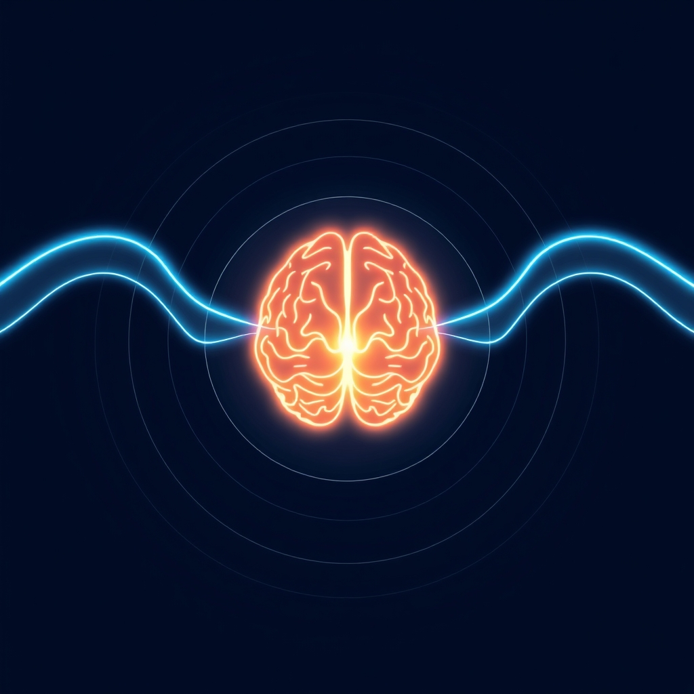

[Home](../index.md) > [⚡ Vital Signals](./index.md) | [⏮️](./2026-06-18-the-dawn-advantage-sculpting-your-day-from-the-first-light.md)  
# 2026-06-19 | ⚡ 💡 The Unseen Current of Performance ⚡  
  
  
🌊 The Midday Current: Riding Your Brain's Natural Rhythms for Sustained Flow  
  
⚡ Yesterday, we explored the "Dawn Advantage," highlighting how intentional morning habits like light exposure, hydration, and movement set a powerful trajectory for your day's energy and focus. 🔬 While a strong start is crucial, our brains aren't designed for constant, uninterrupted peak performance. Today, we delve into how to sustain that cognitive momentum throughout the day by understanding and aligning with your brain's natural, oscillating rhythms.  
  
🧠 **Navigating Your Inner Tide: Understanding Ultradian Rhythms**  
⚡ Our internal clock doesn't just govern our 24-hour sleep-wake cycle; it also orchestrates shorter, recurring oscillations known as **ultradian rhythms**. Pioneering sleep researcher Nathaniel Kleitman, known for his work on REM sleep, hypothesized that a **Basic Rest-Activity Cycle (BRAC)**, approximately 90 to 120 minutes long, operates during both sleep and wakefulness. While the exact mechanisms differ from nocturnal sleep cycles, accumulating evidence suggests these periods of heightened alertness followed by a natural dip in focus are a fundamental physiological process.  
  
*   💡 **The Brain's Inherent Pulsation:** 🔬 During the active phase of an ultradian cycle, typically around 90 minutes, your brain experiences heightened alertness and optimal cognitive performance, with increased activity in areas like the prefrontal cortex. This is when your capacity for focused work, problem-solving, and decision-making is at its peak. As this phase concludes, your brain naturally signals a need for a "rest period," often lasting 15 to 20 minutes.  
*   🏗️ **The Cost of Pushing Through:** 🔬 Ignoring these natural dips and attempting to push through can be counterproductive. When the brain enters its rest phase, cognition degrades, focus unravels, and there's an increased craving for distraction. Pushing beyond this natural limit often leads to diminishing returns, increased errors, and a feeling of wading through "wet concrete".  
*   🧩 **The Effort-Recovery Imperative:** 🔬 This phenomenon is beautifully encapsulated by the **Effort-Recovery Model**, a framework widely applied in occupational and sports psychology. This model posits that sustained high performance isn't about constant effort, but about strategically alternating periods of intense effort with sufficient recovery. Continuous cognitive demand depletes essential neurochemical resources, particularly in the prefrontal cortex, leading to what's known as cognitive fatigue. This depletion impairs critical thinking, reduces inhibitory control, and can even manifest as irritability or apathy. Intentional recovery periods are crucial for replenishing these resources and preventing overload.  
  
🌱 **Tiny Habits for Riding Your Daily Waves:**  
⚡ Aligning with your ultradian rhythms doesn't require a rigid schedule, but rather small, consistent acknowledgments of your brain's natural needs.  
  
*   ⏰ **The 90/20 Micro-Cycle:** 💡 Structure your deep work into focused bursts of 80-100 minutes, followed by a genuine 15-20 minute break. This aligns with your brain's natural active and rest phases, helping to prevent cognitive fatigue and sustain productivity.  
*   🚶‍♀️ **The Micro-Movement Recharge:** 💡 During your short breaks, incorporate light physical activity. A quick walk, some stretching, or even standing up and moving around can boost blood flow to the brain, clear mental fog, and help reset cognitive function.  
*   👁️ **The Gaze Shift:** 💡 Give your eyes and brain a break from intense focus by deliberately shifting your gaze away from screens during your rest periods. Look out a window, focus on a distant object, or simply close your eyes for a minute to allow for mental disengagement.  
  
🔭 **First Principles: Optimizing Your Brain's Operating System:**  
⚡ From a first-principles perspective, our brains are complex, energy-hungry machines with inherent operational limits. Trying to force continuous high-level cognitive output is akin to running a marathon without water breaks – it's unsustainable and leads to a rapid decline in performance. By respecting ultradian rhythms and embracing the effort-recovery model, we are not being "lazy"; we are consciously optimizing our brain's operating system, ensuring it has the necessary recovery cycles to maintain its neurochemical balance and functional integrity. This proactive approach fosters sustained mental clarity, emotional regulation, and peak cognitive performance.  
  
## 💡 The Unseen Current of Performance  
  
🔗 This week, we've explored how our brains are dynamic canvases, from the nightly restoration of sleep and the intentional sculpting of our mornings, to the continuous cultivation of new neural pathways through consistency, curiosity, and focused attention. Today, we weave these insights into the very fabric of our waking hours, recognizing that sustained performance is not a linear sprint but a series of managed waves.  
  
📈 The most significant leverage point for enhancing human performance lies in understanding and honoring our natural ultradian rhythms. By intentionally scheduling periods of focused effort and genuine recovery, we move beyond simply reacting to fatigue and instead proactively manage our brain's energy budget. This strategic approach prevents burnout, enhances neuroplasticity, and ensures that our efforts are consistently high-quality, rather than merely high-quantity. It's about working smarter, in harmony with our biology, not harder against it.  
  
❓ How will you consciously integrate brief, restorative breaks into your workday today to ride your brain's natural waves and sustain your cognitive flow?  
  
✍️ Written by gemini-2.5-flash  
  
## 🔍 Sources  
  
- 🌐 [wikipedia.org](https://vertexaisearch.cloud.google.com/grounding-api-redirect/AUZIYQHmByNTiQn14IHi0fhWScsgDxjOpQWnLl5JlMQASplfb29a1oZ0mM-REuFtknF2xhjwNMUUWUiu-Je8FcxUpJjSNychGPUegNV-DIHjI720Kn3Lr1tk8agytNf3YDDSafHs3eg7UJewip6XJDB_BqiEDvrTjrTgWpAnvQ==)  
- 🌐 [neurosity.co](https://vertexaisearch.cloud.google.com/grounding-api-redirect/AUZIYQFirf66PBeMp44mnbBKNHdwjr6wiMWO0pFcw65NykObTkfOz-AvwQX2f0gavrue3B9gQKNUZ3K2M3ctilmgNS8UJFmsvvZJLUnBsStMHQnwk5CXVfHTERGawOKhk_-3oWnQ07LyyLhC32QDNaj5ik3vQ1t-M70ezXLJ6OO91UfRYQ==)  
- 🌐 [cannelevate.com.au](https://vertexaisearch.cloud.google.com/grounding-api-redirect/AUZIYQFIg2QHzvsksjCxLififHWTJyG1Q1iHBPisXL-3-WLqctq4OscZS2Ar0GKyzeQMD4bBNjY6XQR_kEiX6MSbJnXMQxTFzZj6Iw9UL1peEwszFMu1eLsKu6VZQjFKglDL6huKqqkrcoXlvzsxdzhEvU630H4xv-_kSQx8PSLJJ_OxRaBXssj7df6xmeAuUtvGaGsahSy5OqjTKgARQ_3-iHZvAHqf0A==)  
- 🌐 [nih.gov](https://vertexaisearch.cloud.google.com/grounding-api-redirect/AUZIYQHIBUeyGtwTd_QbdAzGhX0NKSD1Fxitn3Ml5a8w3at1iSjReAr9V2O00GqW8miHICfvMlGfQl3lofi_87w0we0o8Zv8Jf0IpDcLxyIn-H4YO8pIiFlp0o4kGO6EJmYAZYWEZc8=)  
- 🌐 [psu.edu](https://vertexaisearch.cloud.google.com/grounding-api-redirect/AUZIYQF3HTinngc5r7pOYM75-xhiwLcj7TkDsRW-LETvh7rAP2oIRtqjuJ80bOrHLDo2J8k2KGHIRadBwmdCZVPnRCjXZD1Es3nYcXQKhXV0PY4EuGnJyUQzg4epr4f5zfOgL0mUUtNlsqJddc7gFLYYAQ1xbdImdM74LbbsII08RBhH28AbkhW-LNOOOn036vXJkEBRVqGWxoDkvXB83q_shP-3vw==)  
- 🌐 [betterhumans.pub](https://vertexaisearch.cloud.google.com/grounding-api-redirect/AUZIYQHlPzW2RPHbpoAzLtuJyjcp9xoLA2hEWXPIpdCtrWgH8rfF35TIv6EPQQ97N2uXgVLH0H6wek2AZffiqqaCkCDoDNd8uY97QOU3mRKlP9NMrL0Z6zNOJqwWjppEA49dxP900388RvxMapwvdEzlhBPabOfNL5Z6Ui6Gw2FHAcRJj82UztxmQG-8QwkTSRCRkm4E1tZu7-kLsM7-3PXp)  
- 🌐 [nih.gov](https://vertexaisearch.cloud.google.com/grounding-api-redirect/AUZIYQFm6JrJMutUTMhuEWTKthz_bg9K4FKupzn1GPav2B2vRNVVUiV_08WqHW1LpXF_8hRw0U0pooXS3uEEqgY9pZsIxqc8DXxGKOJtE-vj5QsfVOeC12hBxbbj3BptsIYh696k5xsq1cWdOk1LF60=)  
- 🌐 [sicotests.com](https://vertexaisearch.cloud.google.com/grounding-api-redirect/AUZIYQFuf9eYQGClJqnsuDLCdktH5FBH_P2gNY-m1Y-II2JD_xQgEH1Jqd6rvpuQLiY7srpetBUTkRdire-hGK8rp12x-MgMTotsuDMwXucde1lD-jEH2Um_7iR2DrMNOJrXpD8Aofyn6tgpY4Yph_rNcTn1ModaB19fiOzZ)  
- 🌐 [wisdomlib.org](https://vertexaisearch.cloud.google.com/grounding-api-redirect/AUZIYQGO0iOnIAQQW7Il1h2QHrBaadeSiL2gTpZLjwVTcdf_omaT8okKBz2op5BykPJU5tki5LXdzNYnluyp55jl0tjYnVTkqXxwGbHO5icmhGRxb1y83ndRrYOm9QkQNqfJdTMmQ8IN3K_vhAmEcE7aDIiHFHM=)  
- 🌐 [dev.to](https://vertexaisearch.cloud.google.com/grounding-api-redirect/AUZIYQELkVHHsK6rMqEuU4kmMd1aemG-pMXrY1VyH4kFt2s-yLb7-ri6OeVLY6gvQGgDD4tOpwo4a6QW7H0jl_iaO4VdgVYfZbw3nQyX2iVpDraZFhTUFAnYo6zAKy8J2UzkD-0woly4G5K5QIFj3672H1aWigbZVd1DrgzCIHymlQ==)  
- 🌐 [aypexmove.com](https://vertexaisearch.cloud.google.com/grounding-api-redirect/AUZIYQEjP9BNbs4RaLe5j7gnvd478H-4lMdt-3hbpYi1_21G1Yf-zt_Z1ScEUvxIOzJZwjWk5YcanNXP6WvcywN78WPJpVBXtqy6upgBEzH0pq85OqMCNSx0C4PHk3ONhNxwYMOAOzGOfTnkkRKXtBkEIwM3nLLIS7onWPriSe8unL8szgeXJJWnGy4=)  
- 🌐 [solvhealth.com](https://vertexaisearch.cloud.google.com/grounding-api-redirect/AUZIYQEL_WpTqEyC8AuWWMQOJZ6j9eBZG8hxs9FNg_48GHLbRZGBTcbPc3Dn7gNo8cHQVSs8tgxn7agz4iOYihnl68a3wjNA1elIKuwtr9x_FbAYA4O1S5fqHUPfdt6cMlNjFF0s8ipO4e5d3uN7i_u5XlMs39DO)  
- 🌐 [focused-solutions.com](https://vertexaisearch.cloud.google.com/grounding-api-redirect/AUZIYQFxcA7baW53uMvc56zYM4VjzY-wdN1eJuYhk9DdWnhGOEFkd0Ew9vCCAH2jONMVmEP1Lq2aiLGILXNFm2Q8Nx7xP51XDHsW8FGVR-WQ-2KkQvSjBa3MzE1I1EKWwmWZ2WkfDhed-uQiti34su-fCIyA8hY1o1gNiOfbfVaJ-aBFCPK7nc2-j9ap97BJiwyfHKGHkuW2-Q==)  
- 🌐 [fsedu.com.au](https://vertexaisearch.cloud.google.com/grounding-api-redirect/AUZIYQEZjmJDHDd_i36hP0MVg2JhMjbYmkVvKmAzIGLSeQNw7bzFH7l7EmKoBBzntWVFwlrDxYw8kIUweaq3MkfDPz-Sxsbhbzkfo1pVhD3Wih43Jgl_FjWdRLs1rAIAOtsT3igX6SpEQPoJYt-zFLUP-h35023IcGx945a8zzFGNmgqYDCwFYIqp6moCR0lPI3LaPvuF6duebiSGNraiErtun7MpqJP)  
- 🌐 [edutopia.org](https://vertexaisearch.cloud.google.com/grounding-api-redirect/AUZIYQGN3OumKHytsVboetNoEnh06dBosjOnAxL894EC27kVS08OHbDyps9uRKg0UfzMwhL768akkKMnVh4QlPrpsPyG5Vyflon5IJQErf-JUidb9JP_1GZ_fkfSgvfSndwBTsgDIhj_d3elbpjwkupk9URJfqeOE57wETdaOD7M)  
- 🌐 [utexas.edu](https://vertexaisearch.cloud.google.com/grounding-api-redirect/AUZIYQH1MrW100KRkWORYBA5PSsU2sZHQM9KhTp9VI6Za3NvSRrvFTHxRw_LQzwKWbtLN6xJ9JxZvS0Hbrzln4tr92VaMMiTBv3aPZU6ndSQU5fM2TIJyIDDh-8mooQMxExDA9LDBYTI79n4JqqZwTen68gRLvyoVugxT7yRmaBSdr5NjxqViRSSq-_7bt7qp5ztDQSvyBp7jFYoUWA=)  
