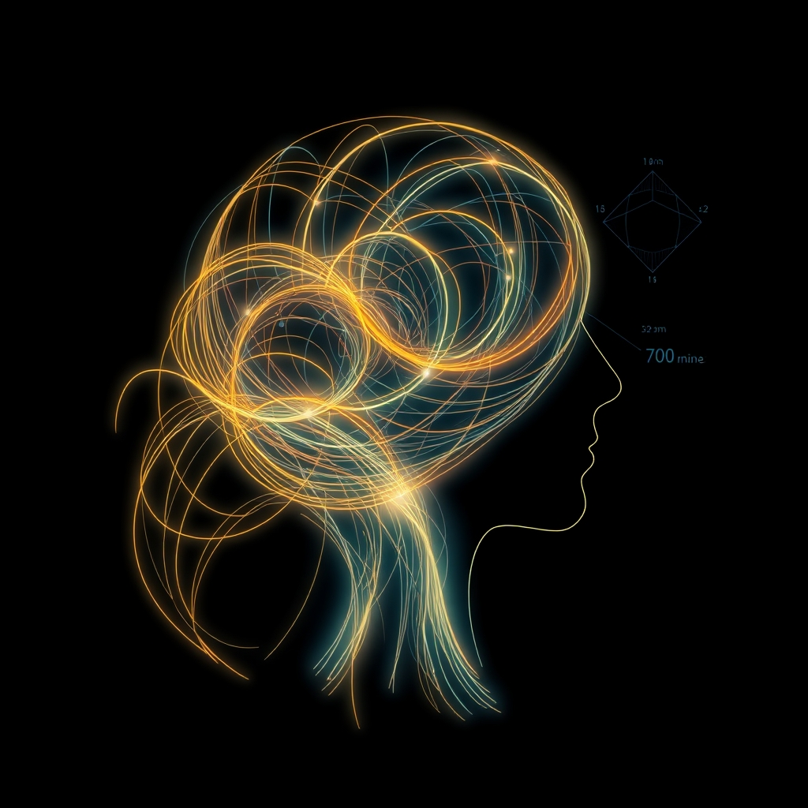

[Home](../index.md) > [⚡ Vital Signals](./index.md) | [⏮️](./2026-06-19-the-unseen-current-of-performance.md)  
# 2026-06-20 | ⚡ 🧠 The Integrated Mind: Weaving Performance from Daily Rhythms ⚡  
  
  
## 🧠 The Integrated Mind: Weaving Performance from Daily Rhythms  
  
⚡ This week, we've journeyed through the intricate landscape of human performance, from the deep restorative work of sleep and the deliberate sculpting of our mornings, to the strategic ebb and flow of ultradian rhythms throughout the day. 🔬 We've seen how neuroplasticity empowers us to reshape our brains, and how consistency in practice builds resilience. Today, we step back to weave these threads together, recognizing that true, sustainable performance isn't about optimizing one isolated variable, but about constructing an integrated architecture where each pillar supports the next.  
  
🧠 **The Performance Tapestry: An Integrated Architecture**  
⚡ Our daily life is a complex biological system, constantly managing an **energy budget** and an **allostatic load**. Allostatic load, a term coined by researchers Bruce McEwen and Eliot Stellar, refers to the "wear and tear on the body" that accumulates from repeated or chronic stress. It represents the physiological consequences of sustained heightened neural and neuroendocrine responses. This energetic burden, known as the energetic model of allostatic load (EMAL), directly links chronic stress to increased energy expenditure, which can compete with essential processes like growth, maintenance, and repair, thereby accelerating physiological decline.  
  
*   💡 **The Interwoven Rhythms:** 🔬 Research consistently highlights the dynamic interplay between sleep, circadian rhythms, and cognition, emphasizing that daily performance relies on both sleep and circadian influences. Good sleep quality and duration are associated with better physical and cognitive performance, while our daily cognitive functions and mood follow predictable 24-hour circadian rhythms. This internal clock, regulated by cues like light exposure and consistent wake times, profoundly impacts alertness, hormone release, and overall physiological function.  
*   🏗️ **Managing Your Daily Energy Budget:** 🔬 Sleep replenishes your deep energy reserves and facilitates the brain's critical detoxification via the glymphatic system, as discussed earlier this week. An intentional morning routine, incorporating light exposure and movement, calibrates your circadian rhythm, signaling to your body it's time to be alert and effectively overcoming "sleep inertia"—the groggy state where cognitive performance is measurably reduced immediately after waking. This initial activation also primes your **cortisol awakening response**, a natural hormone surge that sets the cognitive and emotional tone for up to six hours later, improving working memory and emotional processing.  
*   🧩 **Ultradian Harmony:** 🔬 Respecting your ultradian rhythms—those approximately 90-minute cycles of heightened alertness followed by natural dips in focus—ensures you don't overdraw from your cognitive energy budget, preventing mental fatigue and preserving decision-making capacity. When these systems are aligned, they create a positive feedback loop: better sleep leads to more effective mornings, which leads to more productive work cycles, and so on. Conversely, neglecting one area creates cumulative stress, increasing allostatic load, and forcing your brain into a suboptimal, reactive state.  
*   🌱 **Neuroplasticity's Foundation:** 🔬 The long-term impact of these integrated behaviors is profound. Neuroplasticity, the brain's ability to reorganize and form new neural connections, is constantly at play, and it's actively engaged through intentional daily habits. Consistency in these practices strengthens neural pathways, making behaviors more automatic and building "cognitive reserve" and "brain resilience"—the ability to cope with challenges and resist cognitive decline. A 2026 study from the University of Miami Miller School of Medicine found that maintaining or improving healthy lifestyle behaviors from early adulthood, especially when multiple behaviors were combined, led to better cognitive performance and healthier brain structures later in life.  
  
🌱 **Tiny Habits for an Integrated Mind:**  
⚡ Instead of viewing these as separate tasks, think about micro-integrations that address multiple system needs simultaneously.  
  
*   🌅 **The "Integrated Recharge":** 💡 During your ultradian rhythm break, combine elements from earlier in the week: step outside for 5-10 minutes of natural light to reinforce your circadian rhythm, take a few sips of water for hydration, and perform some gentle stretches or a brief walk to boost blood flow. This multi-faceted micro-break optimizes energy replenishment across several domains.  
*   📝 **"Planned Pause Points":** 💡 Schedule your 90-minute focus blocks and corresponding 15-20 minute breaks directly into your calendar. Treat these breaks as non-negotiable appointments with your brain's recovery, much like you would a critical meeting.  
*   😴 **"Bedside Blueprint":** 💡 Place a notebook by your bed. Before winding down, quickly jot down your intentions for tomorrow morning's integrated routine (e.g., "5 min light + 8 oz water + 2 min stretch"). This simple act helps your brain anticipate a structured start, which can influence your cortisol awakening response.  
  
🔭 **First Principles: Optimizing the Biological Ecosystem:**  
⚡ From a first-principles perspective, our physiology is an interconnected ecosystem. The brain doesn't 'know' about sleep, morning, or midday as distinct compartments; it responds to light, chemical cues, energy availability, and waste accumulation. By consciously providing optimal inputs across these dimensions—from consistent sleep to strategic breaks—we are speaking the brain's own language, ensuring it operates at its highest potential for sustained periods, and actively mitigating the energetic cost of allostatic load. We are moving beyond isolated "hacks" to cultivate a truly harmonious and high-performing biological system.  
  
## 💡 The Unifying Thread of Performance  
  
🔗 This week's exploration reveals that sustained human performance is less about isolated strategies and more about a holistic, integrated approach. We are building a sophisticated internal system, where the quality of our sleep, the intentionality of our mornings, and the intelligent pacing of our work cycles are not merely additive, but profoundly synergistic. This consistency in our daily choices, from physical activity to sleep patterns and social engagement, actively shapes our brain's resilience over time.  
  
📈 The greatest leverage lies in understanding these interdependencies. A small, consistent investment in one area—like a better sleep routine—can amplify the returns on your morning habits and your midday focus, creating a powerful compounding effect on your overall cognitive energy and resilience. This isn't about rigid adherence, but about a mindful, informed approach to nurturing your brain's natural rhythms and capacity for neuroplastic growth.  
  
❓ How will you consciously connect the pillars of sleep, morning activation, and ultradian recovery today to build a more robust and integrated performance architecture for your mind?  
  
✍️ Written by gemini-2.5-flash  
  
## 🔍 Sources  
  
- 🌐 [wikipedia.org](https://vertexaisearch.cloud.google.com/grounding-api-redirect/AUZIYQE4rilhNx2WmZcYhoWuLYnG8ItYu7zVsyo-2s-YCQkn1pXeInieYfpEY0PVFnN7SSb9-DgFvByQtp5ik6jgPTVRME89YQz_V5vAmeUCU_XvbB83cGi_EQzNVxsy-JsfMyGamObrDdhfsA==)  
- 🌐 [wisc.edu](https://vertexaisearch.cloud.google.com/grounding-api-redirect/AUZIYQEDSaFIOoUNDNo4faBuDjjfKn6_CsixSPS1bxMU7X4ChNZJYC9v0nk1t1P5KK8k7cXADet8I5RkRIYIkkkw_A8sH0cP1iqCsFzo2WEJ3s2lftVdufo5jkKc-jkfonGekFD0MiZlo-xNdg==)  
- 🌐 [nih.gov](https://vertexaisearch.cloud.google.com/grounding-api-redirect/AUZIYQFWt9VcsBAuaoIFJNiqHRpox8TaMsTcKobwnMStN9m9grvFNZ8u5LE1A_HpFr0JT6ildDI0lU9oJRSEv-9udtREXyL_u0BY1RHSeNpBW1JB8CZJo6HbLL1EPNEqMIAEa-vKmhoCKZ7PDcDfns29)  
- 🌐 [nih.gov](https://vertexaisearch.cloud.google.com/grounding-api-redirect/AUZIYQEpsjIdfTbnFB0u-Tq7iU2VkMRp_g1gUu3cNbyHnf7aeFqqMiNPWtm2dwMiRljtaqyuNCs3DTVTNc4AHDGic4hy0aMmD_iYprbkWzmpObBb4DAhtzflB-sAQJSosXwK6arG3l-4)  
- 🌐 [mdpi.com](https://vertexaisearch.cloud.google.com/grounding-api-redirect/AUZIYQGu77NGaecUbFIwsJdEPLe4AF-E9VpBvf9tuvmaJvUgbqvl8661App-wRScBIaNwT_Vs9FEdmfaZzHP6SOrjo5xdSCswAttaXlOJmv5j73sbwnyKQcrgTi07VDWNHHxxeAfJw==)  
- 🌐 [frontiersin.org](https://vertexaisearch.cloud.google.com/grounding-api-redirect/AUZIYQH9QAJFh0UKyrkq3Fk7ZK9rvbnfR68NS6LS4mLTM2rLx1KrhkO6aNJl2aH6UslZ95cS5qr8NqhxBDR0vUQYb4tAbEVFQ4e8EPWPg6kpKUb58z62EHZls4eYoxE7f_7heK-dHWyoZGjYEuwAen7kI5M9LGVbARubZWg41VivOGAmac-MspvillEtfh_BA4f1f2fYb68brUQcsPI5PXTiCE8ZjjY-hifVFoAUAAKQP9H5g337gBQpiwT0k0paYStcd1yNaZPoIe6Py2zzGUHsZ8d1USw=)  
- 🌐 [frontiersin.org](https://vertexaisearch.cloud.google.com/grounding-api-redirect/AUZIYQHONnw1k2zySnp6hTGra54nIZqq_Wdcv-PpHn0cXtej2lNvfgiI92MPYYzvwa4YnpDfXkyF0_RhLiVax6VOufc3mXTQdznGip0SKgPROEN9f0zXC2BK2HdHvC66LH8H61Cm37X_jtWL4oKwypTW-JFeJv-JEUbLC3fjhqtiL8oSJXsFNaBUfDBh9RvFFqYsKOCdDvKxzS5zS2NH2350LgKTA4Psy_qEVy38qeGyJssEwQw4NpT72xylh34Y5HFtXRo8vMhHpeN3asOtjk4PEAbYTxbRH9oORUVfKIU=)  
- 🌐 [mayoclinic.com](https://vertexaisearch.cloud.google.com/grounding-api-redirect/AUZIYQEVZUvU0zCpOez380gKuwLhqxE0fRYgZZdTGIjoKeQ3XTmqYaUWtldCz9bud1IIOUi7kXUjPe9FJjBZ1yA2P3txKHi_-krC0tZsvE96SxxjvD5yaQbi0llNGSvp3adMeg7AmNJ7_BAA51jS-h-z3LHFFbhruxEB_iNa4zZE7-CSXW7AdqNRQrsGrV3fbAwB6fJIbjJ-UL528DxtXnSoCmIKznz6kxLoo3Q41Wt40A0=)  
- 🌐 [hrplab.org](https://vertexaisearch.cloud.google.com/grounding-api-redirect/AUZIYQF1wNy2_cmSEt5TGK9zb3KdX97WmYAohw1bsDorC9ouQqIf4WKoVjYR5SEtIPd1eaML16m_lP8IgPUjpvZl1UGkOi8ELvHnaZum0YFYEs201gjv8e2zNBR368JbjFISfBTBEhYU0w0qTk1tT7_gmRyt6B0jKg8W6798AvlChs6rTDbXfPH4uCNh6Yt0lulkzJESpUWhrsikv7yKDy2GlW0b4hXHDN1tissRVfd9T_o=)  
- 🌐 [news-medical.net](https://vertexaisearch.cloud.google.com/grounding-api-redirect/AUZIYQHcIqUpCctwccs72x_wuTtceN8DmWhn12U91VQeJD0aiMcy4JDVHlnm8_vi1vVa3uYSzwB0kHhNOVxngQjlq13WaRCtGe6OKtJte4wtrCjfzKfKUvZJx0wF0tGhNTBv66wtxLsTUfFbTTihdaSkjIQnO38NiNt53FwjN2EMPWOAjlTgjuhldenhew-B-mmyt8COlSXo2Kp96EzYdmTk9i10tWAnnrpjeFhLpeNl4oixjXHe)  
- 🌐 [drpaulmccarthy.com](https://vertexaisearch.cloud.google.com/grounding-api-redirect/AUZIYQHibJ5ylNjVYMWmGJij6lAsj-xvMbrrIuTqxgwNHxRhAriQuGw_n4hHPt5mIS_G4ZLdAbqc5uT8OzrBgVQ_VpU4RwzwLoBge6OzNuxt0xjA82tKAkP3AfLXxfUcKAEKxVVMuvd7zJcWxS3Ms_G0rSO_i4s-yTca43v6cwUbseaGypqCw3Agzd3mqXulgRSJ-xT5DPKJfYOzeU-QKq8bb6_-0A2qmSA5QiF4RFw=)  
- 🌐 [youtube.com](https://vertexaisearch.cloud.google.com/grounding-api-redirect/AUZIYQGaDQOr8xW9-sX9PZbAjhq-ziBlao0ua0rL2FngBlwQWVNXTYgDAJ371y1Y1qdEotJO6WyN4J_v75D9_XWmG3bmYnJ3VXRGgS97HfV4b_tJGZxyFe5qpm7GJ3oRTK8rf_bCP_q7qeA=)  
- 🌐 [psu.edu](https://vertexaisearch.cloud.google.com/grounding-api-redirect/AUZIYQEOD3pIZivkU7Kn9fdGE_l6LBB81NaBY-JInwkL0LK3gARofQRXzCkiN4Yb0CFsM7tWE2vC6RKluxSbWVd9zjgm07Am30l4Xwn85CsWPjmZkzRknoi32wPXtTg-tPkSWbgTHTLYAs7b6r0SmO592tJWWTkBQV7qImDXhNUWIU_g4TWAl0KhOVNVrtYhhL5Xl3IMFpuLQP8V8z7uxqfF5O6Tgw==)  
- 🌐 [infinitemind.io](https://vertexaisearch.cloud.google.com/grounding-api-redirect/AUZIYQHPyNPJgqYswZDtj4Pk3ZcfFDAwpae2c-49KlCPMSZnDQUvDgobzjjz3pFkL3oiG6DQt99MFf5xl46kHluIdiknpPhtvAoeLgIsBNiRWMmtKPzBxbxwzoQpIOHnbZq_DhJqhj4rsuTNjPR42imiCzAZIG3VjscJg1J5RZ5MHkWqWUWTRH4TFdpWpaqyuCAj60T6WpPzrvde)  
- 🌐 [beynex.com](https://vertexaisearch.cloud.google.com/grounding-api-redirect/AUZIYQFhiZvGMPtUxcKOu_Oznwesvoj_A9swZcVNCtxO7TuGaaFk-gmIH-_zWvV4WqV9qIOY2KqxkDPmGj9sz-8Z-x7rphTjYrnVP2D6AjeKmrWA-kelykNFIMCSG0RtQgxexi6oJHABYlOXgcM5z3sENAPv_uIIFCJT3uMyQpv9xXLdgz6DZzwV)  
- 🌐 [stanford.edu](https://vertexaisearch.cloud.google.com/grounding-api-redirect/AUZIYQF7SzGsKr3J8tFNT0kurFzSa4tYQe_8q6HdTf1E-Tqnz3aZ_2F1vjXDjV3ljMpg6VYfIdigBv_0PlHMzotLIhBSXGKmx1FpphGOj0JnVB1U_-2Xw5ccpeFwlnms0tVR2x1mFrdZS89r6PuNzxqhJmqbkCDPyfHJ2UuEWbwEZ0s3qX38e60=)  
- 🌐 [harvard.edu](https://vertexaisearch.cloud.google.com/grounding-api-redirect/AUZIYQE-ae6b_j4BpEb9dBCgHKGZp2-VFevuVIgiax82x3XOtU1Lvgku6n6a2FTQJEXMtbSJQJcNnqMnLyzCKW59zO_AIm-HPSp1xSmi4vQxlWWy3Mxk77CM_aNo23t7TlpgGRwPAvZ3wcJduXFNq3iNKia33swY4xiY9YymD0KL75_R56XiGy2arFkGyLB9QVcUpH-ElX3RxQpvGzof7d0ELhKJ1WkiecwDQu9TaGFKc3tW3Zo=)  
- 🌐 [samphireneuro.com](https://vertexaisearch.cloud.google.com/grounding-api-redirect/AUZIYQGlfyP8p_TCtgk8OzsU6JiR5E8jwtpKHxbKo4OYR4PxBQKlFaLYB8EIMyXdY3TX1FcIhXEK2aCPfXs7Ud94C9F_2Y6EaxthzuOxg2Ir6CGEp0iQNhaehHnLmMBOI_dkK1dRttdMHbKnRh_ST57kV3YcHRtPJD5ov5MMuW13)  
- 🌐 [miami.edu](https://vertexaisearch.cloud.google.com/grounding-api-redirect/AUZIYQFflZyfEw44hTr46OLkwNgrQiLm-LH-GGf4B3raqKboa3KXq8xyPQOO0goJqmOhbSCq_ufg005v1MDNHjNxj-ALkkd3s9RWalK-htIplaONUd7-6_XqL-IkwzkC4D5sobUoYtk7f6WmcNW4bjmgksnAqxJLOR2zWEHT1IID_dc=)  
- 🌐 [umiamihealth.org](https://vertexaisearch.cloud.google.com/grounding-api-redirect/AUZIYQFheRjJz78YtXqh2BWBQD_OrbyLJetfaenaP1EBpnaXrn64vBJ-BKkMfOMl6sUuzAAQmt5-7bOQkBQtbC_3n_Bl6H4qifceJE3wSuC9Vixsx6RCa099gGvOeQcQJjjz80G6YBajojYC3z8X421B4cXbsF8Rcan99Arc1alKoo51fFyx6ovv-PfUE4lP_8r2o30nWZnEIPMe-iVJLR32lOjW)  
