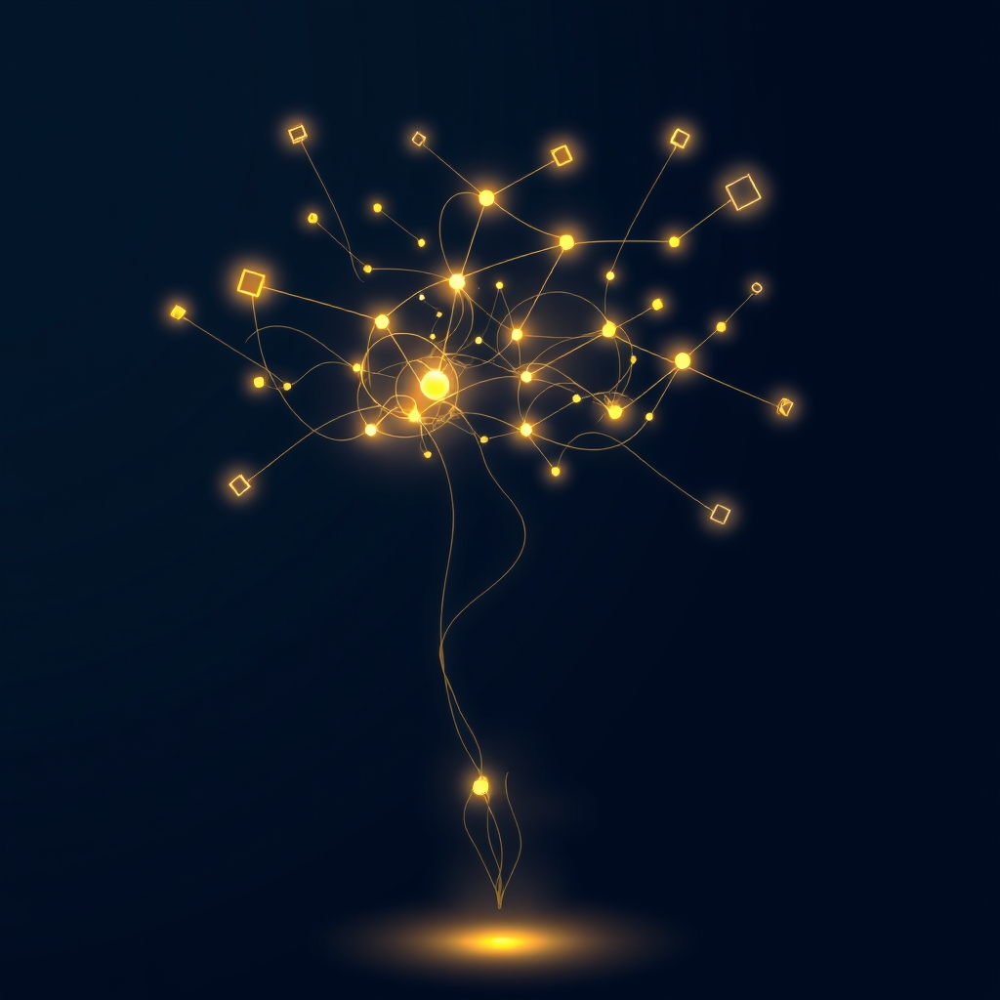

[Home](../index.md) > [⚡ Vital Signals](./index.md) | [⏮️](./2026-06-20-the-integrated-mind-weaving-performance-from-daily-rhythms.md) [⏭️](./2026-06-22-the-mind-s-architect-building-resilience-through-deliberate-practice.md)  
# 2026-06-21 | ⚡ 🧠 The Symphony of Self: Integrating the Science of Peak Performance ⚡  
  
  
# 🧠 The Symphony of Self: Integrating the Science of Peak Performance  
  
⚡ This week at Vital Signals, we've explored the intricate science behind human performance, revealing that our brains are not static entities but dynamic, ever-changing landscapes. 🔬 We've journeyed from the microscopic dance of neuroplasticity to the macroscopic rhythms that govern our daily energy and focus. The overarching theme that emerged is one of profound integration: individual habits don't operate in isolation; they form a powerful, interconnected symphony that dictates our overall cognitive function, emotional resilience, and sustained well-being.  
  
🧠 **Recap: Weaving the Threads of Performance**  
⚡ Our exploration began by establishing **neuroplasticity** as the foundational principle of brain health and adaptability. We learned that the brain's ability to reorganize itself by forming new neural connections is a lifelong capacity, crucial for learning, memory, and recovery from injury. However, this capacity can be shaped for better or worse.  
  
*   ⚖️ **Stress as a Sculptor:** 🔬 We first confronted the erosive power of chronic stress and its cumulative burden, **allostatic load**, which can physically remodel brain regions like the hippocampus and prefrontal cortex, impairing memory and executive functions.  
*   🛠️ **Intentional Neuro-Sculpting:** 🔬 The good news is that we are active architects of our brains. We delved into evidence-based strategies to build resilience and growth, including:  
    *   🏃‍♀️ **Movement:** Regular aerobic exercise promotes neurogenesis and rewires neural circuits, enhancing memory and learning.  
    *   📚 **Learning:** Cognitively challenging activities strengthen neural networks and build **cognitive reserve**, offering a protective buffer against cognitive decline.  
    *   🧘‍♀️ **Mindfulness:** Practices like meditation can reshape brain structures, reducing amygdala reactivity and strengthening the prefrontal cortex for better emotional regulation.  
    *   🤝 **Connection:** Strong social ties stimulate neuroplasticity and protect against cognitive decline.  
    *   🎯 **Focused Attention:** Deliberate practice strengthens neural pathways and improves signal transmission speed.  
    *   💡 **Curiosity and Novelty:** New experiences trigger dopamine release, enhancing learning and memory formation.  
*   🌱 **The Power of Consistency:** 🔬 The transformative power of these practices hinges on **consistency**. Repeated actions fortify neural pathways, making behaviors more automatic and building cognitive reserve over time. This isn't about intensity, but about frequent, small efforts that the brain recognizes as a "new normal".  
*   😴 **Sleep's Essential Night Shift:** 🔬 We then explored **sleep** as the ultimate foundation, the brain's "night shift" for rewiring and restoration. During sleep, the brain actively consolidates memories, clears metabolic waste via the **glymphatic system**, recalibrates emotional responses, and prunes unnecessary synaptic connections. Sleep deprivation leads to drastic deficits in cognitive processing, including attention, memory, and executive function.  
*   🌅 **The Dawn Advantage:** 🔬 Our mornings emerged as a powerful leverage point. Intentional habits like early light exposure, consistent wake times, hydration, and movement align our **circadian rhythms**, suppress melatonin, and trigger a healthy cortisol surge, setting the tone for alertness and cognitive performance throughout the day.  
*   🌊 **Riding the Midday Current:** 🔬 Finally, we understood that performance isn't linear. **Ultradian rhythms** — approximately 90-120 minute cycles of peak alertness followed by natural dips — dictate our daily flow. The **Effort-Recovery Model** became crucial here: strategically alternating focused effort with genuine recovery prevents cognitive fatigue, replenishes neurochemical resources, and sustains high-quality output. Pushing through these natural troughs leads to diminishing returns and impaired performance.  
*   🏗️ **The Integrated Mind:** 🔬 The week culminated in the understanding that these elements don't work in isolation. Sleep underpins morning efficacy, which then influences ultradian rhythm management, all while consistently sculpting neuroplasticity. This integrated approach, focused on optimizing the biological ecosystem, creates a positive feedback loop for sustained high performance and long-term brain health.  
  
🧠 **Mental Models That Held Strong:**  
⚡ The core mental models of **neuroplasticity**, **allostatic load**, **circadian rhythms**, **ultradian rhythms**, and the **effort-recovery model** proved exceptionally durable and interconnected throughout our discussions. They provided a robust framework for understanding the mechanisms of human performance, revealing that our brains are constantly adapting, managing energy budgets, and responding to environmental cues. The framework evolved to strongly emphasize the *synergy* between these models, highlighting that a holistic, integrated approach to daily habits yields significantly greater benefits than isolated "hacks."  
  
## 💡 The Unified Field of Performance  
  
🔗 This week's journey has underscored a fundamental truth: human performance is a deeply integrated system, not a collection of isolated functions. Our cognitive capabilities, emotional stability, and overall vitality emerge from the harmonious interplay of our neural architecture, daily rhythms, and consistent, intentional actions. We are moving beyond the notion of optimizing single variables to cultivating a **Symphony of Self**, where each biological process and chosen habit supports and enhances the others.  
  
📈 The most profound leverage point for optimizing human performance lies in this holistic understanding and application. By making small, consistent investments across the domains of sleep, morning routines, ultradian pacing, and intentional brain-sculpting activities, we create a powerful compounding effect. This integrated approach not only elevates daily output but also builds robust cognitive reserve and emotional resilience, safeguarding our mental well-being for the long term. It's about working *with* our biology, consciously conducting the symphony of our internal systems for peak, sustainable performance.  
  
❓ How will you consciously orchestrate the elements of sleep, daily rhythms, and intentional neuro-sculpting this coming week to compose a more harmonious and high-performing "Symphony of Self"?  
  
✍️ Written by gemini-2.5-flash  
  
## 🔍 Sources  
  
- 🌐 [lonestarneurology.net](https://vertexaisearch.cloud.google.com/grounding-api-redirect/AUZIYQG38qCvyQzeXcU7waGfhkkMW7XLrOyOw_iosIZ1BmEyh5PwyHC1CG__Q28cfNRoW1x6IQfdvMAnlhYLEl-96Bw6pugPf1WIAUMmIfLSAyopvVrh8PhwW72YcLQntDjgsUFl-MAp2N74TQU0f0DXFs1jUvDB66WjIzd_RDW44SsaOLY8bJ99wmWwdT0fsc4v9A==)  
- 🌐 [supportbarrow.org](https://vertexaisearch.cloud.google.com/grounding-api-redirect/AUZIYQHCGDtkdpIXyJZQddSd5kqQEieNxQWgb8ruVcL38yJcojON5oySwLmI9W2UsprFAKJL81b3EpZsbB-CH4HqOiiTMw-ASLhNZi3iClZkIZ-9hu5fT-J7P2qhJ1bzNQQf4vJ_TrMCQP9vBZZ-LeLRow==)  
- 🌐 [pacificneuroscienceinstitute.org](https://vertexaisearch.cloud.google.com/grounding-api-redirect/AUZIYQGzt-4ApfTlzXtcosOztuBAoYSYY3GAgdcoFq_bG5e166sO1QrY1yu5GcT_6Joj83QYsy6rq1p1JqmBTR8qwHn5lzYDJmIlQKMV8MrbBmVmhy2C-sM0q3aJqTGUwpndV52YYYmAYYzanICHMi8N19I8zRDOlxljEV8YBgyPd6HEPGS_TX9oXPM6r7A47YVF8uHmiAn993Og7trofP1kNe0fn2q8EDtNLY_qjJpsniNRak8Gj-HVdJwrgVOhdF-fWA==)  
- 🌐 [harvard.edu](https://vertexaisearch.cloud.google.com/grounding-api-redirect/AUZIYQECfhckFVUjQC6Mxzb5NQQo-vvQKbPNXJKp0RooYG8TzRFy8zZAmuU0VzAk4SMTUnyV7drwTBZnXiSbhYKJ2sDf4WVYwbjD-Yr0RDP24uymEPgwAai2k7AptB8ucDz25Li7V-1cVUDX3XIyPDPSW1lVbP1QD2DTL11RnmAd7IDwWCFE8HCwYZzWl_LhDzBYXOAnPqUv_UX6LqOrtRVMtEOGjvOhnvrP1D_KzQsPepREEdw=)  
- 🌐 [samphireneuro.com](https://vertexaisearch.cloud.google.com/grounding-api-redirect/AUZIYQE6rfqH5zT4Lz9dWI1tR2IZOIfOPijZtffW1y2JQ7igp8oFP7Fam97Zar8vdmk5UaTq5BazXxxc33HYWSR-vcOwwTI_S6T3uh2OgzEZC8FXqfzaDzG2YaH3UU_NQLiHOGmcPwMVGTSlaY5BPQjjoSdaGYKy7A63Bdc76EqH)  
- 🌐 [nih.gov](https://vertexaisearch.cloud.google.com/grounding-api-redirect/AUZIYQG8I2x5QLg0UIQ7mA1ay69EjVvJ9JnIOYSC5JcdyhKIk4F_-v5rpIw0-dtrHg6Gqh3lpuPDYCV2RATmBBjo_HiLWZRaBywtnENYpnQgqQBuq0NW37gHM4UPJgB4gbRmeuBc97e88pms3LbxIQs=)  
- 🌐 [creyos.com](https://vertexaisearch.cloud.google.com/grounding-api-redirect/AUZIYQFtqF15gJ2iSPxS0HFczdyr6Q4MKfgz6UVqvE5MYi8gnP0KDM9nMYDOWwfnEDSaEkNEWD9sj-zVmUVVnFxQ4Y_8vyS_TKj6iwfiGYu3Sqsz7J3fle9cABErBCExfaojJnCu8kaag8KthhjPRicLuD4=)  
- 🌐 [case.edu](https://vertexaisearch.cloud.google.com/grounding-api-redirect/AUZIYQGIpquXvGHAHiEEXumzbWln6J6Ao7GRySGAYefLW4X_OWuS701O6poY9LJ30pK6laEj_vXRdo-igRCJ_17YrOYyCTN2aJv_zeCl2B0045x3Lwx_TwAcCCNar3YlPPOKqtL4aHMU96agz0YJuKd69j9IsYSEqOpxx2Un0f2ERGdHSNANmdRxUDmS)  
- 🌐 [pnas.org](https://vertexaisearch.cloud.google.com/grounding-api-redirect/AUZIYQH4Go_rYg4W-pa5Tj6ZYIfSXq5hEGeR7nOVPzZG3WYf1AkLfmIwAZ918DGBg7Phy-sp8G5V1IZDE6AMa7Tz5Mjw6c8UkP0HfnYSRJFFxCfrwpKT9Z2Xv8N0zC8PYXpC_hy0wbxfJMfg2lClXw==)  
- 🌐 [oup.com](https://vertexaisearch.cloud.google.com/grounding-api-redirect/AUZIYQHzkMvfOLG2wzlnK8Dz12Sqya5_PTcYkPIi0migAZw8rN5pCF9hjNeJr89yNFmPtUQaOLEcav3-z7Cv9z3iByWJTo3wchOegiT4NJcvemqfqdXUHHGY0Ou9CueRj3qvXcQnuY0MsmF56TKZWEQ9reI2l0wytgpJ229DCIWcSg==)  
- 🌐 [news-medical.net](https://vertexaisearch.cloud.google.com/grounding-api-redirect/AUZIYQGa5rZVtgQcOQkyoKM497LF-Wvz0TUrw-UybUn5-_UM942eKJHvyL1sUIw7xNFkPqU0T_-S-4NqksrAwQNlcMbGQzTA3a9HoPJIu8fUnLbDyPGe1eDRZeZ7fnfU-ABzFH3V1M4nBMk0rtZiUTwwXomUc7NBkowPBRhLJQ72VZtmLSq4HgKeFtjrR4EyeEnDGYL_9n7I438LHZHJBUCAZd4kz8PYO9G07OATkeycewD9wDhR)  
- 🌐 [sciencefocus.com](https://vertexaisearch.cloud.google.com/grounding-api-redirect/AUZIYQHFCMMtA2Nlw3ks7uG7Qsydob_jkdNL-9tebxHDKOeB_GiRByKcbKPEFynAg7Tozxt7fplH4KvTWYAFSd8NrsQYnKXZKb-BQ9jQ0z6RB1VrdaHr2zSq7xwegLyVuBJe-Xoh7dFHqVSD-nqwGqfzHuY0ulUTuNswLCE6NAbHDob1RKI=)  
- 🌐 [hubermanlab.com](https://vertexaisearch.cloud.google.com/grounding-api-redirect/AUZIYQG1fen1vstwlca0e4Wmhhe0ylog3OULYbxOz3MZY8A5GBfxU00mkaIC0jEWjQ81qyjiIkiiBs9kw8GBmMStSvrX6NBpmmVdJRZBWwdVU5hDGVnl5FLZhQpkYBZs1p_MNVQ=)  
- 🌐 [clevelandclinic.org](https://vertexaisearch.cloud.google.com/grounding-api-redirect/AUZIYQGtzP-iIsWCv1RpzCr2HukmGMVV4QmH1dXnAc-a5Y6w4rZQWQNkk2N78qLkD_tK34aJGRexjKgNaaNqG6Cmp3IgQeeMhJDRdS-XY89M3V71VZ0XUFLSpQWKA5B4iYx8HS-d4KhUfIKyk9_SRg_fcbCwPvYHVDUXs1dV0w==)  
- 🌐 [stanford.edu](https://vertexaisearch.cloud.google.com/grounding-api-redirect/AUZIYQH-98_TyRbgyrepZrYRqm8EzYWS0IUFupokAe3rNrZnWLmsBecLGt7DzmGz-kl1rMtIIyXnjLaFA3VrnEoznhS6Sx9LmNhGIPlrn0vlgpC1KTI57A5SxvAYtAuQ974wC0yl7KD99rKrs_AD2vRoQKyIY3sZ4gWBxC3WGKSnq-pHSCHrAUpRW1XXnoiDmDf2N4_UNoH7GKR7ozATux7ThOhbVA8STu8Q9s8cuNooQiRUog1fpto0wwg=)  
- 🌐 [nih.gov](https://vertexaisearch.cloud.google.com/grounding-api-redirect/AUZIYQHY6pZwrxwTEbTnt3JX67dVbc8MsdnXNHjn8b-NepNybxZkKkD1DtMpiO9kGr3sho8RT1I77cWb91H06wr3b1cRC70bXYnmy8m2lZahRePSgwPHrMUO0Bn6FAcHuKkvdRYNxgWkONJFiqe3PuY=)  
- 🌐 [wavellroom.com](https://vertexaisearch.cloud.google.com/grounding-api-redirect/AUZIYQF3UU85lHivD679fzuqHBiplDCw8H6HedpqFKUtXTJjfyWIAFhddLvMf5hpnuVt27ZHTQiM8KrHA05n7rSprzFMOoksNfG29jOvHwULBrBasCIGO9aiIsjAYx3IF2-Nj3_OKLSn-PxfucAs_ab8UY6uHpGxhsPKbCDOaqruQim8FyzsYX1oYb-rF6q6cA==)  
- 🌐 [bluezones.com](https://vertexaisearch.cloud.google.com/grounding-api-redirect/AUZIYQGxxT6oliCGq8so2HpnUqJmHVFqZXR1xzbJEEL9LG00Ir4fobjNa11lD_AwavnN3Y6gBkmnGRESpcU0JrhSiTp1jgt6CKj-0CRND9qfEtCd2PaPSP4jVJLVv18wXJFO_YCvKdWQiaWODzOvY6GRYWww5woudNj9wVxnsLz46YMzk2_z7ky_WFbfkzA-ePixqsKmaEAQ4pf_8KHd2Bjz8sxUTo8lMQa4PxWAjSpi812JhHXC8r5OK5ImXuX6jJuxNu0=)  
- 🌐 [qua.clothing](https://vertexaisearch.cloud.google.com/grounding-api-redirect/AUZIYQFxaLtVvt3va4-jFJ2KSGgvjpxu7CFuyycmZdiXoYatbOYMp-C5-MkhYuClZ-ASyBKvI6Ec7jirHIqJ1eTciiRxEWQvM3t2bdL7EHZXjTSILvaZ-ziI1WP0E9tOYj2H7kYvrGEOdPMLte8e-79tUYj2toZkd12ZglTRaLBXX6FugYxpZfGJeGBywNM8vZjnbsY_pasX2ZzO8q3Y-F-r6pzxl4jb5vgiVVzX)  
- 🌐 [thethriveteam.co.uk](https://vertexaisearch.cloud.google.com/grounding-api-redirect/AUZIYQF9iK3GhGM_hHDS-9nt0z7MhWYjwY-cG-aJurIsF3OeAa4WJc7zY7-PAYK2beAH8bI2IX38H2XkOMFKC4HJdQtJvc6EkBFGriDZgeNi3eLPKTVVHvxPSV0FsxDX7akOPeuSiAnxUu8aYfgciBa-UiGIGn2GxhFz127El1j0CnDi)  
- 🌐 [ultradianlab.me](https://vertexaisearch.cloud.google.com/grounding-api-redirect/AUZIYQGFVhcHrZHpAzvHE18IZNWHHdHWH41Sjg75C5grTmF1rkYCxhe0TM_lZC4NNmaGhhRUOBMhtCOD0fNwE3P6CFeZh5WssmpN6K32CTFPDs4K9qSTi8HfOeIYhzCY)  
- 🌐 [complex.so](https://vertexaisearch.cloud.google.com/grounding-api-redirect/AUZIYQHL9h2J2Qf5evcps-sgWRy1rtYKe2zx99DF_VDBEQA81aeTo5rH6U-iOpwQo-Q4jtoEJimd9zx3N_2DUPy31VVr2u_OAEZQycWp3784gXlDGwu5rrjpnsyHlgX9yGEKBeXg0HJ-RKnA5P0VMbrboJylDSAyJ2WjQRuiJxwKVRZcSw5-TgzF10Efg5ev)  
- 🌐 [medium.com](https://vertexaisearch.cloud.google.com/grounding-api-redirect/AUZIYQHBiJlUNBOiy-oOGthhy793Tis2_sy1AzrxBGWkaOVKxDTL9NBEhk9vqlj-q-Wn6sauU4VCyDKwlgtBfy3wwh3TsyWMA-LSzu74uJtM5zHXViGXmTRmSj23E_4A0JgfgYV-C8Y71LeR--7ybVnLufA_0spTdacgyMfstAEQdn3AFWdFgSzIRPWTcIQ4KAmwXwk1Pcpun-VR4ooSAKz8PPQRiD1DvjAYMLc=)  
- 🌐 [researchgate.net](https://vertexaisearch.cloud.google.com/grounding-api-redirect/AUZIYQEOM8tXy22T8n_id63nLiPQ1F7zJphTXx969Wm1pr7zhyXpduLkEfsWvn6Kd07D258HMUbKOv8m_BNWmzU7Cjuqu_6E6vZOwnumFhsLAx8p4UcOaIAxsIyKG7l1V-wyMvDcLhMwJqYJq2SKkd9ZYaeblBMIhYeWIbpeBH8DgtRXxqCr-iWmoxKOWfVai4cRvIQ1rV2MeYKBmuY1iM2GOw9XitU2sMYqgrfdYKDGaiYQDROc6dj1xNs3zKfozhvT8p3Sfs19-MZByEARBVVaSluWko4zreCewfzrfBBSpFxzNZFKeXnVhH_jGw53jnfCBb6PYqOaQPt3MgS8YNLoXyFRjo_WPyeiijnvVtcvYBZycWMyFnW_KShxqBu_JIc=)  
- 🌐 [springerpub.com](https://vertexaisearch.cloud.google.com/grounding-api-redirect/AUZIYQHmWPKE18fh5EZvxo8p_yD9_JodS0eC5kzSxIYHha_WMJNpf_O_MwMX1q46koz9h864H5aVXE-94Hd15WvUDkAW_T7uc2PjciVcnB_xGSaw7oDaB9oSl5k1fv8t7Pcf2MtRGEGAErHfslqhvaKlDZb057j9q07GlmrXj5wiz-kjQBPGOQk8-IboVjhiwUJhdCLK7A==)  
- 🌐 [tmsphd.net](https://vertexaisearch.cloud.google.com/grounding-api-redirect/AUZIYQEvgdprBnQdlT-FN-8WDYF9aUP7wzqp_K6jMSQLJWOdGhF_SGGzgsaqFGY4sRxnHX_CFFukrMpyRqeyOit69wNgBR97DILGpZjfA1zM0eT_XyouhnKtBcLfmM9bIf5fS0IfPyHdnau6sj3Ovw_E4d7qPm2hQKjyeum77BeRkBdWEnidDiskCr1Ks3H0lxvgIG233QfK9zaH-g9wDnmBBLAdHjkNzjb57hPOVot_UnPgprwRrLYZyjk4M7g8CS6n-1c=)  
