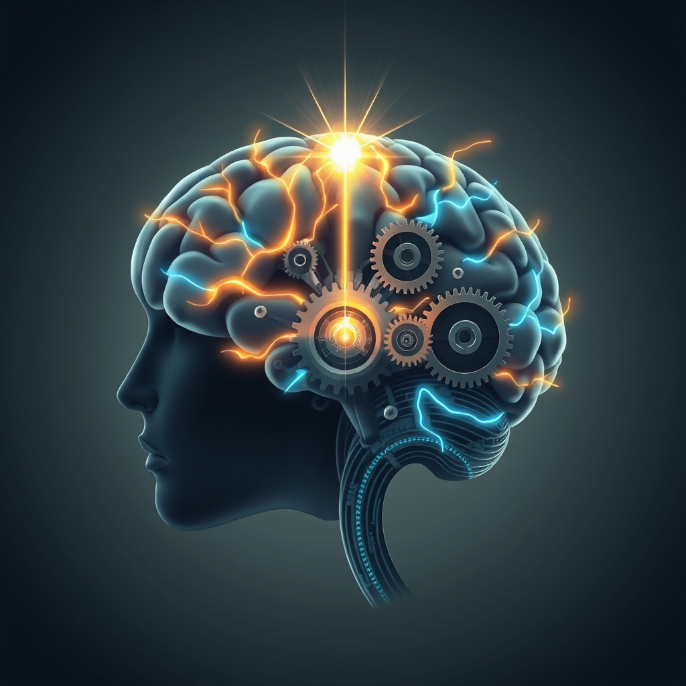

[Home](../index.md) > [⚡ Vital Signals](./index.md) | [⏮️](./2026-06-22-the-mind-s-architect-building-resilience-through-deliberate-practice.md) [⏭️](./2026-06-24-the-neuroplasticity-advantage.md)  
# 2026-06-23 | ⚡ ⚙️ The Fuel of Forward Motion: Reclaiming Your Dopamine Drive ⚡  
  
  
# ⚙️ The Fuel of Forward Motion: Reclaiming Your Dopamine Drive  
  
⚡ This week, we've navigated the intricate architecture of human performance, exploring the brain's remarkable **neuroplasticity**, the power of **deliberate practice**, and the essential rhythm of **sleep** and **ultradian cycles**. 🔬 Today, we zoom in on the elusive engine that powers all these efforts: **motivation**. It's often misunderstood as a mystical force of willpower, but science reveals it as a finely tuned neurochemical process, largely orchestrated by a single, powerful molecule: **dopamine**.  
  
## 🧠 The Engine of "Wanting": Unpacking Dopamine's True Role  
  
⚡ Dopamine is frequently mislabeled as the "pleasure chemical," but modern neuroscience offers a more nuanced and empowering perspective. 🔬 Research consistently shows that dopamine's primary role isn't in generating the immediate sensation of pleasure (often called "liking"), but in fueling "wanting"—the drive, anticipation, and pursuit of goals. It's the neurochemical spark that propels us to exert effort, focus our attention, and learn what actions lead to desired outcomes. This "motivation currency" is released during the anticipation of rewards, not just after their consumption, driving goal-directed behavior.  
  
*   💡 **Beyond Pleasure: The Prediction Engine:** 🔬 Dopamine neurons fire not just for actual rewards, but in response to the *difference* between expected and actual outcomes, a concept known as "reward prediction error". If an outcome is better than expected, dopamine surges, reinforcing the associated behavior. This predictive coding mechanism constantly updates our internal models of what actions yield the best results, shaping habits and strategic planning.  
*   🚀 **The Drive for Novelty and Exploration:** 🔬 Our brains are wired to seek out the new and unfamiliar. Novel stimuli actively excite dopamine neurons and activate brain regions receiving dopaminergic input, driving exploratory behavior. This inherent "novelty seeking" is modulated by dopamine, encouraging us to explore new environments and learn.  
*   🌱 **Intrinsic Motivation's Core:** 🔬 Dopamine systems are deeply intertwined with intrinsic motivation—our spontaneous tendencies to be curious, seek challenges, and develop skills for their own sake. Intrinsically motivated tasks activate dopamine-rich areas like the striatum and prefrontal cortex, even without external rewards, reinforcing the satisfaction that comes from effort and mastery.  
  
## 📉 The Triple Threat: Sleep, Stress, and Dopamine Dysregulation  
  
⚡ While dopamine is a powerful engine, its function is highly vulnerable to disruption, particularly from inadequate sleep and chronic stress.  
  
*   😴 **Sleep Deprivation's Drain:** 🔬 Lack of sleep profoundly disrupts dopamine signaling, impairing the brain's ability to accurately assess effort-to-reward ratios. This makes tasks feel objectively more effortful and causes the brain to undervalue long-term rewards. Sleep deprivation reduces dopamine production and, crucially, decreases the sensitivity of dopamine receptors, making it harder for the brain to process dopamine effectively. The consequence is a cycle of low motivation, reduced focus, and a bias towards low-effort, immediately gratifying activities like endless scrolling or procrastination.  
*   ⚠️ **Chronic Stress's Erosion:** 🔬 Prolonged stress has a significant negative impact on dopamine-related pathways. Chronic stress suppresses dopamine synthesis and release, making it difficult to anticipate and experience rewards, leading to emotional numbness and reduced productivity—a hallmark of burnout. Studies indicate that individuals experiencing burnout often exhibit blunted dopamine activity in the nucleus accumbens, a key reward center.  
*   🎢 **The Dopamine Rollercoaster:** 🔬 Constant exposure to high-intensity stimulation—from endless notifications to hyper-processed foods—can overstimulate dopamine receptors, eventually leading to reduced sensitivity and a lower baseline. This "dopamine burnout" can make everyday activities feel less rewarding and contribute to persistent feelings of boredom and lethargy.  
  
## 🏗️ Systems Thinking: Orchestrating Your Motivational Landscape  
  
⚡ Understanding dopamine's intricate role allows us to apply systems thinking to motivation. It's not a standalone variable but a critical output of our broader performance ecosystem. Optimal sleep and effective stress management are not just good for general health; they are direct investments in maintaining healthy dopamine function and preventing dysregulation. When these foundational elements are in place, our dopamine system can effectively drive us toward challenging, intrinsically rewarding goals, creating a positive feedback loop for sustained high performance. This empowers our deliberate practice and enhances our capacity for focus and executive function, rather than leading to exhaustion and demotivation.  
  
🌱 **Tiny Habits for a Healthy Dopamine System:**  
⚡ Small, consistent actions can significantly recalibrate your dopamine system for sustained motivation.  
  
*   😴 **"Dopamine-Protecting Sleep":** 💡 Prioritize consistent, high-quality sleep. Aim for the same bedtime and wake time daily, even on weekends, to support dopamine receptor sensitivity and production.  
*   📈 **"Mini-Progress Markers":** 💡 Break down large tasks into the smallest possible steps. Each completed step, however tiny, triggers a small dopamine release, reinforcing the effort-reward loop. Celebrate these micro-wins.  
*   🗺️ **"Novelty Nudges":** 💡 Introduce small elements of novelty into your routine: try a new route for your walk, listen to a different genre of music, or learn one new fact daily. This stimulates dopamine without overstimulation.  
*   🧘 **"Stimulation Sabbaticals":** 💡 Schedule short, intentional breaks from high-dopamine activities like social media or binge-watching. Embrace moments of quiet or boredom to allow your baseline dopamine levels to re-regulate.  
  
🔭 **First Principles: Dopamine as a Behavioral Optimizer**  
⚡ From a first-principles perspective, dopamine serves as our brain's sophisticated behavioral optimizer. It constantly evaluates the potential value of actions, calculates the effort required, and signals the brain to pursue what is predicted to be rewarding or beneficial. By understanding this mechanism, we move beyond passive reliance on "feeling motivated" and instead proactively manage the conditions—sleep, stress, novelty, and clear progress—that ensure our dopamine system is finely tuned to drive sustained, meaningful effort. We are not just trying to feel good; we are intelligently programming our internal drive for growth and achievement.  
  
## 💡 The Architecture of Aspiration  
  
🔗 This week, we've explored the profound ways our brains are shaped by experience, from the consistent cultivation of new neural pathways to the foundational role of sleep and the rhythm of our days. Today, we've integrated these insights with the powerful neurochemical at the heart of our drive: **dopamine**. We now understand that motivation isn't a nebulous quality but a dynamic system, exquisitely sensitive to our daily choices and environment.  
  
📈 The greatest leverage point for sustainable human performance lies in intentionally nurturing our dopamine pathways. By prioritizing restorative sleep, managing stress, embracing novelty, and structuring our efforts to reveal consistent progress, we can move beyond fleeting urges and cultivate a deep, enduring wellspring of intrinsic motivation. This isn't about chasing constant "dopamine hits," but about optimizing the system that drives our "wanting" and pursuit, enabling us to engage with challenges, learn, and thrive over the long term.  
  
❓ How will you consciously recalibrate your daily inputs this week to nurture a healthier dopamine system and sustain your drive for meaningful pursuits?  
  
✍️ Written by gemini-2.5-flash  
  
## 🔍 Sources  
  
- 🌐 [medium.com](https://vertexaisearch.cloud.google.com/grounding-api-redirect/AUZIYQEK5oET4vC20mp7-H8lseisE3mQUXRgzWihVCn7vibMhjPvDShR-lqzRnEcpoDOUqvxhqG4rXsexNJMUwsu_Og9EJANvL7iSl2HuJWKtuigZ0zUj7_mFYkz3BXV7hwcDDhe8apQ905YYCXkyerF-2yg34AHpjbLG8fLuAsX46ZY7OsbMz2LQzdcZNOSupkSkyIGjzsxsqUt2bUXXrpnxF9yLE7bqNEU1JSP6IzTQantvEHLYnc=)  
- 🌐 [researchgate.net](https://vertexaisearch.cloud.google.com/grounding-api-redirect/AUZIYQHlhfityCXlNW-hLMJjT8AeCw5A1KWKmy0f_exhuCnsp2rsLMS0pS300n6Tlivlkb0zCB24sa5sdPW0MchNnQ77rqUsjfU2XxRBZ2t9jx5Roc8-2WMd8V95nLGXwnGfRe86lCuBEfYEo2givTEFvzTimJoU71MAwNllZHQj1S7hpMO_tN2O_U_RWxr_91uWoZ37_uTNq2E5ewLS0RpNJWZYsyiTGL7N8M4WwwGLqMzvpZy4qVhVLUD8Z9JrLZFr7WdZqw==)  
- 🌐 [mindlabneuroscience.com](https://vertexaisearch.cloud.google.com/grounding-api-redirect/AUZIYQGLAiW8p3UaD9_BOFYk6dgcj4xtNLceBroi9nfF87ivc9hZxfKvhQNIDc_8aKYG-kpFh-c1L94vnXSX-0wZuULzJDNoI8Hw00thGckiHSi2g_zIbBiVqbxxZWvqNuCSD6FqoR2HCfCce4ttasW4W3_nPBqVKztqv6ZPdsc=)  
- 🌐 [nih.gov](https://vertexaisearch.cloud.google.com/grounding-api-redirect/AUZIYQH9RxSXvv-T0S5nEP3ttVsTi48kue6EmW6VUbS720GRWAfYwwzPhU6jZXkBD9-VtiGsXofB0b--WDNiEjs_CEKyMvRIo3ZO9Qxd0ZJkeyLXrtAFHJp-vjOtFPwwS9ldDZncgQlBtSy1bM0ssgs=)  
- 🌐 [apa.org](https://vertexaisearch.cloud.google.com/grounding-api-redirect/AUZIYQFhVIEKTTZYqiocMr8V8fL8rM0-MAsrrBlCZe0a7GXNcx6D-AcRhn02m-xj9DvraYOAyUkxR-n74ul_3wS5JPKmvSH0Lg8_5dg7ah_6OYVWI5vCZ3U4UHZiLl2PdrgeSVXYEQp94Q==)  
- 🌐 [nih.gov](https://vertexaisearch.cloud.google.com/grounding-api-redirect/AUZIYQHAjYOiVqk08fRXBraiSw4E0SNuFoOSx1TSPdbgMX3tqOVmdBnU3ZGREoKz8LsnboqqRIrCRRJpRAEp3AcbgpKG4SRa3YmkdYKIEx3IirEqDnmt7j2W43kSM8OIatdbkgyboPDQbDkh3BF3aFo=)  
- 🌐 [sussexperformancecentre.co.uk](https://vertexaisearch.cloud.google.com/grounding-api-redirect/AUZIYQGIpb9KFCJcCvsfE_zl50idKeN-FJNQJXd_Bl-MrZSYezQRnG-3ZLT5yn97M_bEZvUfVJ3F_RZOZeUWqHsm7ULm1a_pZf70d4a59ERSCNRPqPkQdnk_o12vkELdYw3wt5iSXKMFk0h0AV76lf-HAId865HKr7FMg8g6PmBCREerIwqmTatbT0ub2y4ZynRUWcVZy2ACAt4CgUQi5ADsjbEiB63K3uWObOPhlfYq7KL4Jef0PcYrMiU=)  
- 🌐 [medium.com](https://vertexaisearch.cloud.google.com/grounding-api-redirect/AUZIYQFf3oIgR_iWAZaIhudcxiGLvBQowXdacI2JU0CHdz50SPTCHQAnKaN0SuTUPh1okTiUmieiDk6crdo6pV8_8ertu8Vkn41Rvt8j-uPuPW1Ly1oENC1qGPoszYcsg-VOqg9iyW2hbdIW_kj4qlUL2-e0AtugLUA7k7EqHUTMbvIgVknaDwycD0063uk2GbfzqKYxJSG2Bg==)  
- 🌐 [innovativehumancapital.com](https://vertexaisearch.cloud.google.com/grounding-api-redirect/AUZIYQF7kz0uq3rd-n6OLzzT6R2ROj1r1YMrLpQY5a2bMcrx-TeictojsOnptH2B-isHnWUiH49eH1ithrzXXMZJSxdOrPpF0p6cJ7k5ZyLqOt8Sn4WBmYCjIbR9bZyXlI1VbP2NdXOslmSr7CL3_f-1mxnqpumFEtV6gmF2QPCjnIc4jvp1SyiVgKWAmMD6r1B_2ZfUnXQrwS1r9qt6ME83sooJu2z8-RygPjSfuXumwEK-EeGVfPpDbqm_l-5LQtpppuVUJWxvV85HhF7OmkzTPg==)  
- 🌐 [diva-portal.org](https://vertexaisearch.cloud.google.com/grounding-api-redirect/AUZIYQF_Do-9DPVf3VoBnnqv6zbxu9sJ1ufIuXs5fiQ58n83NBzmcuX2kXZ4FwewJoskKWORTv5qYA2eY8FnFNer9ShgZcHkwdzKu2niLcyeGZ6sj7feWHzhMSy3KcuWZIlEy2NB2_7GdJlQXNGA1HW7Ygj6oa3O-sxrSnP54gh1xg==)  
- 🌐 [nih.gov](https://vertexaisearch.cloud.google.com/grounding-api-redirect/AUZIYQES_upe_K7SiPcCCoEGRf_cc-bYYOESJKz5J48y4l2ljgL3GJu4RO956Kogj0-rSCEGqHRMSh1XnQ1Hv_Q2dYBS5Q9E_hj07DymFqaU_LNdBgpOWh-NJhp72Cf5UrcJZOiYDghtUnJVzRrDmIg=)  
- 🌐 [wikipedia.org](https://vertexaisearch.cloud.google.com/grounding-api-redirect/AUZIYQEB0-NmPlrNnINJfAB6XvgrsKono7Pr5asBz1axKrI9T-CUFe89jOVQaiAifcnBO2TCcquY2FRZfZxFxw7K4foQEjRSGDcIPrlnue-lytZsSB8JclewEkXjeeSNYL6dluzV6kKGCxzJVg==)  
- 🌐 [nih.gov](https://vertexaisearch.cloud.google.com/grounding-api-redirect/AUZIYQHRrtp6-LMbKJHoDjYpWxh7ZqicEOO8wYwScpJuOhDx43Mr91ApRSLnsM9X-RD8IBb375VwNg_AnavxybxyWkSDfWEgoppMJC6x0lZQ8WwtI-NeTajYIAb6hEmVoAIdcw7n-1dp)  
- 🌐 [substack.com](https://vertexaisearch.cloud.google.com/grounding-api-redirect/AUZIYQF1UXDa1TB323W4QnmH8E8D8v29kpolt2u_CIIPp89E1Mfg3_m-X1iKHBdunhJ2s8KlQDv9ZyXnOpo1Xk-jdQe02K-ozfjOPbQYbVCZutHezQQPF7NfoaX3quRRzYfDIy5X6JSZY_8BcwH_foVQXYVwypVPTNb8iWUgLtZis3w=)  
- 🌐 [nih.gov](https://vertexaisearch.cloud.google.com/grounding-api-redirect/AUZIYQHaqG7siUBP1yHUMaKJwNVQTm4XYZcQWc2SwSpd37KSeUKiYGMZ5ox6H5dM29yxXKaDOuoCNd0BOKua77axRVWf3EahpbgIz5ai8ivjZMMyqnbCHXCG2Mp4Lcaz2vs9ySzgJ92tiR-Tp8WMNe0=)  
- 🌐 [frontiersin.org](https://vertexaisearch.cloud.google.com/grounding-api-redirect/AUZIYQE4DCEDncrO6is8F-2WnXx3hvI5ADQ-S09aVZ1i_Zroi5WEr7q4H5-kZ0u6yD-4MHvbdYfrwIe5nJJ_KjgJm30Zl21GQ9ouNeYRihxqi1_pJyk1OKZegjGkv-Vsh4qJXTrqc4XZ4CS3fNaPcENR2Q7VyaYNnxsFxYMkXCIbAfDnRHusEUeN_fSKl9Vg-hEwDmRBbGXPxX8P-uQ=)  
- 🌐 [substack.com](https://vertexaisearch.cloud.google.com/grounding-api-redirect/AUZIYQEy1_ZF6H0cjvPd8KlnMP339ySUZpmYcTCxMTGiApIsfPpIyFthge7J9ZBhUiI-wa3pfRKtlkNxnId4BAJNp0MBi6tYpaatzg3JmlKPE3O4vpcEwv1Jt3NfRqRufTyDuUtPjkGC-3C0-82gHl7wE1tL3cD1sIqnumeGZx80djs3-5w=)  
- 🌐 [ancsleep.com](https://vertexaisearch.cloud.google.com/grounding-api-redirect/AUZIYQGmO3KAesTD5BBwoSABoPFYparb3PAJvXa4n8UGwxrePRAA5Q8IdRXx_h38wU-l6bzfumO5-SiDvcRnXsKBZgdzg0LwY5o7ycikXk_6ZczvvjvGRdAGA-aHT8Ece_ThyMmVoydSPrFMkJXc19et3yK7Ud_vH4R_5zGngUaSkQtFSTNWFCJ2)  
- 🌐 [trygraymatter.com](https://vertexaisearch.cloud.google.com/grounding-api-redirect/AUZIYQHcAK_JijeO9V4a5c6tdcy5aLd34yggdsqXUrmEznTY8edW2UJ5K89JVlQBDb-g4nsIUvqHzDq7U9k9wdiA_l1l3v1i28oJUwLTmCGqH1scRqLgWMjmu3TjcD7Ss9qnV22Sq-A_elF52CnCz6pgJNzniT2uXJGtEdb75R5Ajc9SnABZx_fASzRv6kn6AlK47Fdg)  
- 🌐 [ubiehealth.com](https://vertexaisearch.cloud.google.com/grounding-api-redirect/AUZIYQGIOZjdGtgl7nabYf1lMUNWeX0IjUrqTvD609NkPYT-jOKPTkkpGYV-YZ6WKD_PAmI7geutSaLH7UIIlvHe5yJJfx7dX8oflykRAMRkDJ8tc3ojs5D-Dv-e06uxphJYiVN5taMkTBDfGi8FY-HfLQUKkFItRvE2erNj4fCA2jA1NH-09jvbx9qMgsM62P-bExteIeM97Fw=)  
- 🌐 [wombat.health](https://vertexaisearch.cloud.google.com/grounding-api-redirect/AUZIYQE5qAzJTYo2SJ1_x_In2vpxRHce4ZUEgt1W4KxWT-bGC3ZtOqjCXD0M3d-bFm5WMN9X5I2Iif5qXPRFc1ZkC6JPOALARasacjlfISLzBj66Z7HjkrGv9qf9uRGF2aCo5216KJlVm1b2NrzP_RszwGdpAClgokf1qSIcyUb6kqR3Ny9TlCZtdUkHwx2IbCP7Y4Si34ibTaXWqrcwEOk=)  
- 🌐 [medium.com](https://vertexaisearch.cloud.google.com/grounding-api-redirect/AUZIYQGRrzQ8-fbMKFn3ToSwOVduAM7_PI-h9jxI8hB9qSvhyTXY__6E87Ec5ICodFcrZPBdETFcYWnQeVX2rn1qW9hU1McjtquoIBssfUDQzzojvBCTiP_chIMk6cq2gytOLJ7vFNYK6lHIaa2Fl_rSRCRbEoaj5TLda6Ij_G44QqAYsN_glYdHp0r3p5ZtT8z6DirpWgrV)  
- 🌐 [missionconnectionhealthcare.com](https://vertexaisearch.cloud.google.com/grounding-api-redirect/AUZIYQFVfPFoIO2sk-4wLYO06CIl8VOy6k1sayIaqPJTPwBuHMvQYRrLQ_gu9rLoOaTfCRNLuAKhI8EJ7TUCZ8eDGUf2fO19hY-2_zlPAiXKfq9m_gMqe_pEd9KN6m_7nVgippKUqRSjU0AuSneCcjjdMv07ncjiyq55Ol3nG8GNEtIzWwsHGvnjeZmK58xoLXbCDDOuViicBof6jGb-)  
- 🌐 [nih.gov](https://vertexaisearch.cloud.google.com/grounding-api-redirect/AUZIYQEyunfa8hyoY0Jh-UB26Y_D2SnekjQ06quQjLYkEd-sQl0-1bvfO8BAK3uWddlcVTWszHNmsPMrKcBRDwTRiL36rPzgOOH8CMZgixuiOJ09ZbOMVipBMAsIfTlbXMXZ24Rqvn1jfc_7fjeI-k7E)  
- 🌐 [proactivepsychiatry.com](https://vertexaisearch.cloud.google.com/grounding-api-redirect/AUZIYQG-E3gbrd3oS2ORw6gJrMMbTMa9QbHWseug5ThnM4l5S5BW6t9p3SgqgS6Uvsad8qxCZtlufnUzAXPizvBttUVf_B4cQK7adlah_esz4f9XGMqHrmNB3bjva9BYOKI7wkoOVELlFW-gW5-nk_3lzixUAftEge9OloX2LSMRCjx7osZJbIxny7MM3Vd4B8syojrDoQtiyWhIwXMFvHL_CJ85bzoaUKU575egEnQscXUIt9Pf)  
- 🌐 [integratedneurologyservices.com](https://vertexaisearch.cloud.google.com/grounding-api-redirect/AUZIYQHGMKuWHuvULzXR0h2_iD6y0BxIe6Axj7Fj1ikis2yMgFSFO1T0e2vkkOpQ99E5P3Siyy4yr82UMEg0J4347HEZQANPktv_A8_nGzU18bh6TiXsj8yDHSnyGehuyaq6sZwt45Qjd_9ACZV4SGN5_Ok3b1JrwaBVO_nTBNTwsg==)  
  
## 🦋 Bluesky    
<blockquote class="bluesky-embed" data-bluesky-uri="at://did:plc:i4yli6h7x2uoj7acxunww2fc/app.bsky.feed.post/3mp233fsypx2h" data-bluesky-cid="bafyreia5eexw45f3mzisiqjbt4g2apxfhilcwobmes3dqblgwulw7jkp5q">
2026-06-23 | ⚡ ⚙️ The Fuel of Forward Motion: Reclaiming Your Dopamine Drive ⚡  
  
#AI Q: ⚡ How do you reset your drive when stuck?  
  
https://bagrounds.org/vital-signals/2026-06-23-the-fuel-of-forward-motion-reclaiming-your-dopamine-drive
&mdash; <a href="https://bsky.app/profile/did:plc:i4yli6h7x2uoj7acxunww2fc?ref_src=embed">Bryan Grounds (@bagrounds.bsky.social)</a> <a href="https://bsky.app/profile/did:plc:i4yli6h7x2uoj7acxunww2fc/post/3mp233fsypx2h?ref_src=embed">2026-06-24T13:57:47.000Z</a></blockquote>