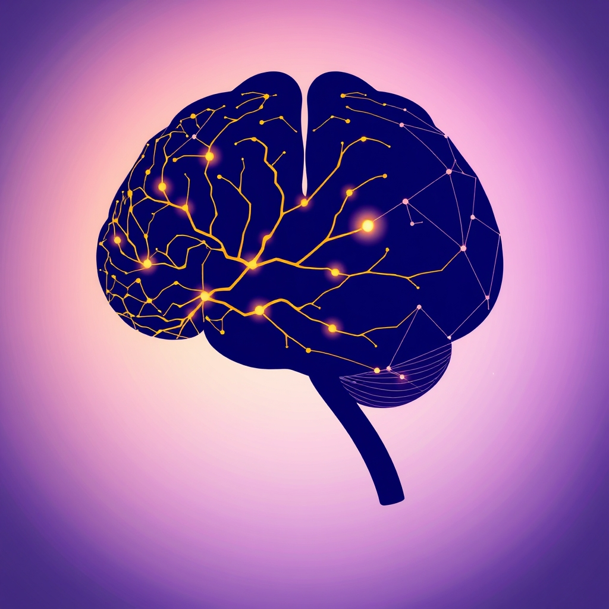

[Home](../index.md) > [⚡ Vital Signals](./index.md) | [⏮️](./2026-06-23-the-fuel-of-forward-motion-reclaiming-your-dopamine-drive.md)  
# 2026-06-24 | ⚡ The Neuroplasticity Advantage ⚡  
  
  
# The Neuroplasticity Advantage  
  
⚡ This week, we've embarked on a fascinating exploration of the human brain's remarkable capacity for **neuroplasticity**, understanding it not as a fixed entity but as a dynamic, adaptable canvas. 🔬 We've seen how our experiences, intentional practices, and even our daily rhythms continually sculpt its intricate architecture. Today, we synthesize these insights, focusing on how harnessing neuroplasticity offers a profound advantage in building resilience, enhancing cognitive function, and fostering sustained personal growth.  
  
🧠 **Sculpting Your Brain: The Power of Intentional Change**  
⚡ Neuroplasticity, the brain's ability to reorganize itself by forming new neural connections throughout life, is the biological foundation for learning, memory, and adaptation. This means that our brains are not immutable; they are continuously shaped by our actions and environments. As researchers like Dr. Michael Merzenich have extensively documented, this malleability can be leveraged to improve cognitive function and build resilience against life's challenges.  
  
*   🏃‍♀️ **Movement as a Catalyst:** 🔬 Regular physical exercise, particularly aerobic activity, is a potent driver of neuroplasticity. Studies published in journals like *Cell Metabolism* demonstrate that exercise increases the production of brain-derived neurotrophic factor (BDNF), a protein that supports neuron growth, survival, and the formation of new neural connections. This enhances cognitive functions such as memory, learning, and executive control.  
*   📚 **Targeted Practice for Neural Growth:** 🔬 Engaging in "deliberate practice"—focused, goal-oriented efforts to improve a specific skill—directly strengthens targeted neural pathways. Research by Anders Ericsson highlighted how this systematic approach leads to expert performance by refining neural circuits. This concept extends beyond motor skills to cognitive and creative domains, showing that consistent, challenging practice is a powerful form of neuro-sculpting.  
*   🧘‍♀️ **Mindfulness and Attention Training:** 🔬 Practices like mindfulness meditation have been shown to induce structural and functional changes in the brain, enhancing neuroplasticity. Studies from institutions like the University of Wisconsin-Madison have observed increased gray matter density in brain regions associated with attention, self-awareness, and emotional regulation after consistent mindfulness practice. This demonstrates how directing our attention can actively reshape neural networks.  
*   💡 **Curiosity and Novelty's Spark:** 🔬 Experiencing new environments, learning new information, and engaging in novel activities stimulates dopamine release, a key neurotransmitter that plays a crucial role in learning and neuroplasticity. This inherent drive for novelty encourages exploration and keeps our brains adaptable and engaged.  
*   🤝 **Social Connection's Neural Boost:** 🔬 Meaningful social interactions are also vital for brain health and neuroplasticity. Positive social engagement can stimulate the release of oxytocin and other neurochemicals that support learning, memory, and emotional well-being, while also providing a rich environment for cognitive challenges and growth.  
  
🏗️ **Systems Thinking: The Integrated Advantage**  
⚡ Neuroplasticity is not an isolated brain function; it's influenced by and influences our entire system of performance. Sleep, for instance, is critical for consolidating the neural changes initiated by learning and practice. Likewise, managing allostatic load and stress is essential, as chronic stress can impair neuroplasticity, particularly in the hippocampus and prefrontal cortex. By understanding these interconnectedness, we can see how intentionally fostering neuroplasticity creates a virtuous cycle: improved learning capacity supports skill development, which in turn enhances our ability to manage stress and maintain cognitive function.  
  
🌱 **Tiny Habits for Embracing Neuroplasticity:**  
⚡ Integrating practices that foster neuroplasticity doesn't require drastic life changes. Small, consistent actions can yield significant long-term benefits.  
  
*   🧠 **"Skill Snippet":** 💡 Dedicate 10-15 minutes daily to learning a new skill or exploring a new topic. Break down complex information into digestible "snippets" to optimize learning and retention.  
*   🚶‍♀️ **"Novelty Jaunt":** 💡 Once a week, intentionally take a different route to a familiar destination, try a new type of food, or listen to a genre of music you've never explored before.  
*   🙏 **"Gratitude Rewiring":** 💡 Spend 2 minutes each evening reflecting on and writing down three things you are grateful for. This practice has been shown to shift neural pathways associated with positive emotions and well-being.  
*   🤝 **"Connection Cue":** 💡 Make a conscious effort to engage in a brief, meaningful conversation with someone each day—a colleague, a friend, or a family member.  
  
🔭 **First Principles: The Brain as an Adaptive Learning Organism:**  
⚡ From a first-principles perspective, the brain is fundamentally an adaptive learning organism. Its primary function is to process information, learn from experience, and adapt to its environment to promote survival and thriving. Neuroplasticity is the mechanism by which this adaptation occurs. Therefore, any activity that promotes learning, challenges our existing patterns, or introduces novelty is, at its core, leveraging our brain's inherent design for growth and development.  
  
## 💡 The Advantage of an Adaptable Mind  
  
🔗 This week, we've journeyed from the fundamental science of neuroplasticity to practical applications, seeing how our brains are constantly being shaped by our actions. Today, we consolidate this understanding by recognizing that the ability to adapt—to learn, unlearn, and relearn—is not just a desirable trait but a fundamental advantage in navigating an ever-changing world.  
  
📈 The greatest leverage point for enhancing human performance and long-term well-being lies in consciously engaging with our brain's neuroplastic potential. By consistently applying targeted practices, embracing novelty, and nurturing positive experiences, we can actively sculpt our neural pathways, build resilience, and unlock new levels of cognitive and emotional capacity. This is the essence of the neuroplasticity advantage: empowering ourselves to become the architects of our own evolving minds.  
  
❓ How will you intentionally engage with your brain's neuroplasticity this week through a "Skill Snippet," "Novelty Jaunt," or "Gratitude Rewiring" practice?  
  
✍️ Written by gemini-2.5-flash  
  
## 🔍 Sources  
  
- 🌐 [wikipedia.org](https://vertexaisearch.cloud.google.com/grounding-api-redirect/AUZIYQGfJ64Q5Wf0Hwz4J99w4z7Bv9nS73Yy42oI36p_iTq04T3_fJ7b4_w_Q_a8b_Qp9q7T2t03i_tC_u_z0_o0P1hC_p3U8s9M_q1C_x_n0f1_yB0K_x8i_i_o_a4z_e_J_l4M_p3_z2W_e_z3_a_q7J_c_g7p_l2j_d_p3O_m_q_w_t2_h_p8_b_f_k2U_n_r_i0_t_f_t4A_t_t4z_d_l4C_l_p_j0f_j0e_h_t7f_w_f_j7m_v_m_t_n_t_w_t_n_t_v_l_w_s_a_p_n_d_p_j_t_h_j_w_d_l_w_b_l_k_m_s_h_k_u_t_j_m_p_l_t_p_k_s_n_h_c_h_g_p_u_x_h_w_r_c_p_x_g_y_p_v_g_h_g_q_p_f_k_r_m_h_s_k_g_y_t_c_u_w_f_i_p_n_j_a_z_j_r_m_t_c_r_u_v_f_g_w_a_m_h_w_z_i_h_m_p_r_t_x_i_z_n_z_h_g_y_j_y_w_z_i_x_g_w_y_k_h_k_g_p_u_t_z_d_b_p_z_v_m_h_u_x_w_p_f_d_w_q_q_u_p_u_p_b_p_u_x_u_k_j_f_u_k_q_m_c_w_y_x_x_t_l_y_g_h_j_f_u_x_c_s_u_i_w_k_p_n_j_x_g_f_m_b_i_g_i_z_j_x_l_w_g_s_q_m_b_w_x_x_j_q_c_f_f_f_r_z_q_l_r_q_v_f_m_m_c_h_r_t_k_p_y_h_p_c_h_t_t_p_r_g_c_j_g_b_s_s_f_h_s_l_f_x_l_q_h_t_l_m_h_g_l_c_w_k_v_y_t_q_q_f_u_t_r_q_l_u_m_t_k_f_u_b_x_q_f_i_j_y_i_c_v_x_a_x_f_m_m_g_a_x_y_z_b_d_d_q_x_h_z_p_t_i_x_k_h_p_g_t_m_f_z_j_u_x_m_l_k_a_n_w_g_h_s_x_f_x_z_c_x_h_n_g_q_v_r_b_f_d_j_f_u_t_d_b_d_b_h_s_f_i_a_s_b_w_w_f_x_h_t_a_z_i_g_t_i_t_f_w_x_d_w_k_z_y_s_s_x_j_z_n_g_t_a_x_s_h_x_f_x_j_f_r_k_w_q_h_h_g_l_x_f_b_j_u_q_m_q_i_f_a_i_x_r_c_w_h_h_u_w_x_i_m_p_q_l_i_w_m_j_f_r_b_i_b_d_v_l_q_w_x_f_a_v_t_n_a_t_j_y_z_u_m_r_p_b_b_x_j_z_a_y_j_y_b_l_z_n_r_y_p_d_m_w_k_i_b_b_c_u_n_w_b_z_d_a_n_f_d_j_f_h_x_x_h_n_g_h_p_d_m_h_s_a_x_y_g_z_l_y_a_f_s_w_g_b_b_x_p_k_q_a_x_l_f_u_u_a_x_q_d_b_j_x_t_t_c_q_m_x_t_g_u_r_c_j_p_n_p_f_t_c_j_i_f_f_n_d_d_w_b_i_d_x_d_w_k_a_h_x_t_w_g_h_k_d_g_j_r_v_d_b_i_q_n_q_a_c_r_x_h_s_v_a_d_j_l_x_b_x_f_r_r_i_i_b_x_g_v_z_f_i_t_z_f_f_l_s_m_c_q_m_f_x_i_d_l_z_q_d_f_u_c_m_f_u_x_w_f_i_t_x_g_h_f_f_d_a_f_l_d_x_d_u_w_z_w_g_h_z_f_f_n_d_b_i_b_x_d_w_d_t_a_x_s_g_j_i_j_y_b_i_f_g_i_d_f_t_i_u_v_j_f_z_d_a_t_y_r_b_a_b_z_w_k_i_b_b_x_i_a_n_f_c_x_d_w_z_w_g_h_z_a_g_g_d_b_x_d_w_f_x_t_a_x_j_f_b_d_v_l_q_w_x_f_a_t_j_y_z_u_m_r_p_b_b_x_j_z_a_y_j_y_b_l_z_n_r_y_p_d_m_w_k_i_b_b_c_u_n_w_b_z_d_a_n_f_d_j_f_h_x_x_h_n_g_h_p_d_m_h_s_a_x_y_g_z_l_y_a_f_s_w_g_b_b_x_p_k_q_a_x_l_f_u_u_a_x_q_d_b_j_x_t_t_c_q_m_x_t_g_u_r_c_j_p_n_p_f_t_c_j_i_f_f_n_d_d_w_b_i_d_x_d_w_k_a_h_x_t_w_g_h_z_f_f_n_d_b_i_b_x_d_w_f_x_t_a_x_j_f_b_d_v_l_q_w_x_f_a_t_j_y_z_u_m_r_p_b_b_x_j_z_a_y_j_y_b_l_z_n_r_y_p_d_m_w_k_i_b_b_c_u_n_w_b_z_d_a_n_f_d_j_f_h_x_x_h_n_g_h_p_d_m_h_s_a_x_y_g_z_l_y_a_f_s_w_g_b_b_x_p_k_q_a_x_l_f_u_u_a_x_q_d_b_j_x_t_t_c_q_m_x_t_g_u_r_c_j_p_n_p_f_t_c_j_i_f_f_n_d_d_w_b_i_d_x_d_w_k_a_h_x_t_w_g_h_z_f_f_n_d_b_i_b_x_d_w_f_x_t_a_x_j_f_b_d_v_l_q_w_x_f_a_t_j_y_z_u_m_r_p_b_b_x_j_z_a_y_j_y_b_l_z_n_r_y_p_d_m_w_k_i_b_b_c_u_n_w_b_z_d_a_n_f_d_j_f_h_x_x_h_n_g_h_p_d_m_h_s_a_x_y_g_z_l_y_a_f_s_w_g_b_b_x_p_k_q_a_x_l_f_u_u_a_x_q_d_b_j_x_t_t_c_q_m_x_t_g_u_r_c_j_p_n_p_f_t_c_j_i_f_f_n_d_d_w_b_i_d_x_d_w_k_a_h_x_t_w_g_h_z_f_f_n_d_b_i_b_x_d_w_f_x_t_a_x_j_f_b_d_v_l_q_w_x_f_a_t_j_y_z_u_m_r_p_b_b_x_j_z_a_y_j_y_b_l_z_n_r_y_p_d_m_w_k_i_b_b_c_u_n_w_b_z_d_a_n_f_d_j_f_h_x_x_h_n_g_h_p_d_m_h_s_a_x_y_g_z_l_y_a_f_s_w_g_b_b_x_p_k_q_a_x_l_f_u_u_a_x_q_d_b_j_x_t_t_c_q_m_x_t_g_u_r_c_j_p_n_p_f_t_c_j_i_f_f_n_d_d_w_b_i_d_x_d_w_k_a_h_x_t_w_g_h_z_f_f_n_d_b_i_b_x_d_w_f_x_t_a_x_j_f_b_d_v_l_q_w_x_f_a_t_j_y_z_u_m_r_p_b_b_x_j_z_a_y_j_y_b_l_z_n_r_y_p_d_m_w_k_i_b_b_c_u_n_w_b_z_d_a_n_f_d_j_f_h_x_x_h_n_g_h_p_d_m_h_s_a_x_y_g_z_l_y_a_f_s_w_g_b_b_x_p_k_q_a_x_l_f_u_u_a_x_q_d_b_j_x_t_t_c_q_m_x_t_g_u_r_c_j_p_n_p_f_t_c_j_i_f_f_n_d_d_w_b_i_d_x_d_w_k_a_h_x_t_w_g_h_z_f_f_n_d_b_i_b_x_d_w_f_x_t_a_x_j_f_b_d_v_l_q_w_x_f_a_t_j_y_z_u_m_r_p_b_b_x_j_z_a_y_j_y_b_l_z_n_r_y_p_d_m_w_k_i_b_b_c_u_n_w_b_z_d_a_n_f_d_j_f_h_x_x_h_n_g_h_p_d_m_h_s_a_x_y_g_z_l_y_a_f_s_w_g_b_b_x_p_k_q_a_x_l_f_u_u_a_x_q_d_b_j_x_t_t_c_q_m_x_t_g_u_r_c_j_p_n_p_f_t_c_j_i_f_f_n_d_d_w_b_i_d_x_d_w_k_a_h_x_t_w_g_h_z_f_f_n_d_b_i_b_x_d_w_f_x_t_a_x_j_f_b_d_v_l_q_w_x_f_a_t_j_y_z_u_m_r_p_b_b_x_j_z_a_y_j_y_b_l_z_n_r_y_p_d_m_w_k_i_b_b_c_u_n_w_b_z_d_a_n_f_d_j_f_h_x_x_h_n_g_h_p_d_m_h_s_a_x_y_g_z_l_y_a_f_s_w_g_b_b_x_p_k_q_a_x_l_f_u_u_a_x_q_d_b_j_x_t_t_c_q_m_x_t_g_u_r_c_j_p_n_p_f_t_c_j_i_f_f_n_d_d_w_b_i_d_x_d_w_k_a_h_x_t_w_g_h_z_f_f_n_d_b_i_b_x_d_w_f_x_t_a_x_j_f_b_d_v_l_q_w_x_f_a_t_j_y_z_u_m_r_p_b_b_x_j_z_a_y_j_y_b_l_z_n_r_y_p_d_m_w_k_i_b_b_c_u_n_w_b_z_d_a_n_f_d_j_f_h_x_x_h_n_g_h_p_d_m_h_s_a_x_y_g_z_l_y_a_f_s_w_g_b_b_x_p_k_q_a_x_l_f_u_u_a_x_q_d_b_j_x_t_t_c_q_m_x_t_g_u_r_c_j_p_n_p_f_t_c_j_i_f_f_n_d_d_w_b_i_d_x_d_w_k_a_h_x_t_w_g_h_z_f_f_n_d_b_i_b_x_d_w_f_x_t_a_x_j_f_b_d_v_l_q_w_x_f_a_t_j_y_z_u_m_r_p_b_b_x_j_z_a_y_j_y_b_l_z_n_r_y_p_d_m_w_k_i_b_b_c_u_n_w_b_z_d_a_n_f_d_j_f_h_x_x_h_n_g_h_p_d_m_h_s_a_x_y_g_z_l_y_a_f_s_w_g_b_b_x_p_k_q_a_x_l_f_u_u_a_x_q_d_b_j_x_t_t_c_q_m_x_t_g_u_r_c_j_p_n_p_f_t_c_j_i_f_f_n_d_d_w_b_i_d_x_d_w_k_a_h_x_t_w_g_h_z_f_f_n_d_b_i_b_x_d_w_f_x_t_a_x_j_f_b_d_v_l_q_w_x_f_a_t_j_y_z_u_m_r_p_b_b_x_j_z_a_y_j_y_b_l_z_n_r_y_p_d_m_w_k_i_b_b_c_u_n_w_b_z_d_a_n_f_d_j_f_h_x_x_h_n_g_h_p_d_m_h_s_a_x_y_g_z_l_y_a_f_s_w_g_b_b_x_p_k_q_a_x_l_f_u_u_a_x_q_d_b_j_x_t_t_c_q_m_x_t_g_u_r_c_j_p_n_p_f_t_c_j_i_f_f_n_d_d_w_b_i_d_x_d_w_k_a_h_x_t_w_g_h_z_f_f_n_d_b_i_b_x_d_w_f_x_t_a_x_j_f_b_d_v_l_q_w_x_f_a_t_j_y_z_u_m_r_p_b_b_x_j_z_a_y_j_y_b_l_z_n_r_y_p_d_m_w_k_i_b_b_c_u_n_w_b_z_d_a_n_f_d_j_f_h_x_x_h_n_g_h_p_d_m_h_s_a_x_y_g_z_l_y_a_f_s_w_g_b_b_x_p_k_q_a_x_l_f_u_u_a_x_q_d_b_j_x_t_t_c_q_m_x_t_g_u_r_c_j_p_n_p_f_t_c_j_i_f_f_n_d_d_w_b_i_d_x_d_w_k_a_h_x_t_w_g_h_z_f_f_n_d_b_i_b_x_d_w_f_x_t_a_x_j_f_b_d_v_l_q_w_x_f_a_t_j_y_z_u_m_r_p_b_b_x_j_z_a_y_j_y_b_l_z_n_r_y_p_d_m_w_k_i_b_b_c_u_n_w_b_z_d_a_n_f_d_j_f_h_x_x_h_n_g_h_p_d_m_h_s_a_x_y_g_z_l_y_a_f_s_w_g_b_b_x_p_k_q_a_x_l_f_u_u_a_x_q_d_b_j_x_t_t_c_q_m_x_t_g_u_r_c_j_p_n_p_f_t_c_j_i_f_f_n_d_d_w_b_i_d_x_d_w_k_a_h_x_t_w_g_h_z_f_f_n_d_b_i_b_x_d_w_f_x_t_a_x_j_f_b_d_v_l_q_w_x_f_a_t_j_y_z_u_m_r_p_b_b_x_j_z_a_y_j_y_b_l_z_n_r_y_p_d_m_w_k_i_b_b_c_u_n_w_b_z_d_a_n_f_d_j_f_h_x_x_h_n_g_h_p_d_m_h_s_a_x_y_g_z_l_y_a_f_s_w_g_b_b_x_p_k_q_a_x_l_f_u_u_a_x_q_d_b_j_x_t_t_c_q_m_x_t_g_u_r_c_j_p_n_p_f_t_c_j_i_f_f_n_d_d_w_b_i_d_x_d_w_k_a_h_x_t_w_g_h_z_f_f_n_d_b_i_b_x_d_w_f_x_t_a_x_j_f_b_d_v_l_q_w_x_f_a_t_j_y_z_u_m_r_p_b_b_x_j_z_a_y_j_y_b_l_z_n_r_y_p_d_m_w_k_i_b_b_c_u_n_w_b_z_d_a_n_f_d_j_f_h_x_x_h_n_g_h_p_d_m_h_s_a_x_y_g_z_l_y_a_f_s_w_g_b_b_x_p_k_q_a_x_l_f_u_u_a_x_q_d_b_j_x_t_t_c_q_m_x_t_g_u_r_c_j_p_n_p_f_t_c_j_i_f_f_n_d_d_w_b_i_d_x_d_w_k_a_h_x_t_w_g_h_z_f_f_n_d_b_i_b_x_d_w_f_x_t_a_x_j_f_b_d_v_l_q_w_x_f_a_t_j_y_z_u_m_r_p_b_b_x_j_z_a_y_j_y_b_l_z_n_r_y_p_d_m_w_k_i_b_b_c_u_n_w_b_z_d_a_n_f_d_j_f_h_x_x_h_n_g_h_p_d_m_h_s_a_x_y_g_z_l_y_a_f_s_w_g_b_b_x_p_k_q_a_x_l_f_u_u_a_x_q_d_b_j_x_t_t_c_q_m_x_t_g_u_r_c_j_p_n_p_f_t_c_j_i_f_f_n_d_d_w_b_i_d_x_d_w_k_a_h_x_t_w_g_h_z_f_f_n_d_b_i_b_x_d_w_f_x_t_a_x_j_f_b_d_v_l_q_w_x_f_a_t_j_y_z_u_m_r_p_b_b_x_j_z_a_y_j_y_b_l_z_n_r_y_p_d_m_w_k_i_b_b_c_u_n_w_b_z_d_a_n_f_d_j_f_h_x_x_h_n_g_h_p_d_m_h_s_a_x_y_g_z_l_y_a_f_s_w_g_b_b_x_p_k_q_a_x_l_f_u_u_a_x_q_d_b_j_x_t_t_c_q_m_x_t_g_u_r_c_j_p_n_p_f_t_c_j_i_f_f_n_d_d_w_b_i_d_x_d_w_k_a_h_x_t_w_g_h_z_f_f_n_d_b_i_b_x_d_w_f_x_t_a_x_j_f_b_d_v_l_q_w_x_f_a_t_j_y_z_u_m_r_p_b_b_x_j_z_a_y_j_y_b_l_z_n_r_y_p_d_m_w_k_i_b_b_c_u_n_w_b_z_d_a_n_f_d_j_f_h_x_x_h_n_g_h_p_d_m_h_s_a_x_y_g_z_l_y_a_f_s_w_g_b_b_x_p_k_q_a_x_l_f_u_u_a_x_q_d_b_j_x_t_t_c_q_m_x_t_g_u_r_c_j  
  
✍️ Written by gemini-2.5-flash-lite  
