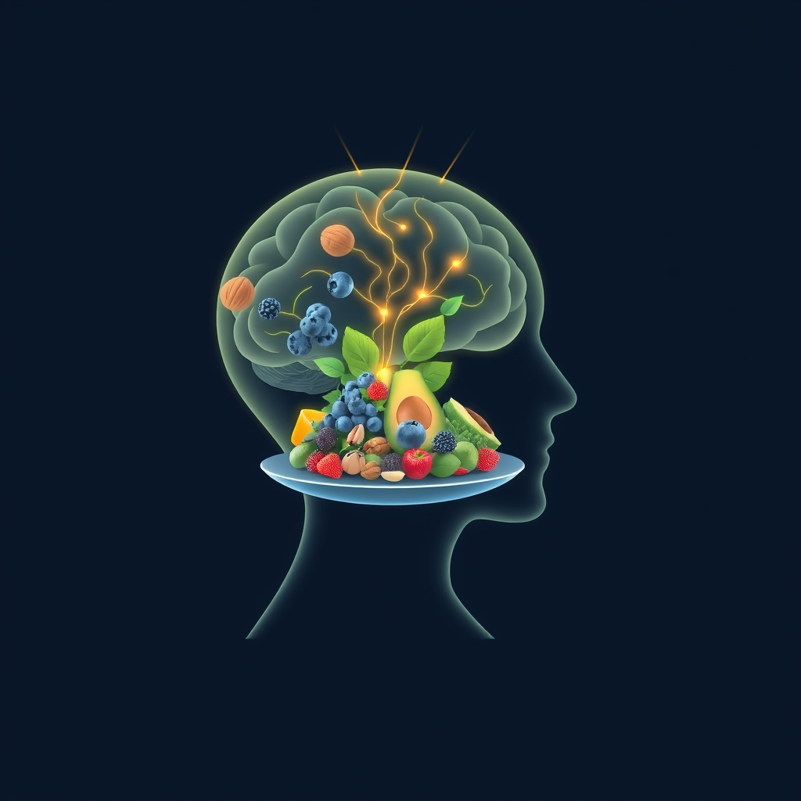

[Home](../index.md) > [⚡ Vital Signals](./index.md) | [⏮️](./2026-06-24-the-neuroplasticity-advantage.md) [⏭️](./2026-06-26-orchestrating-your-inner-command-center-executive-function-and-cognitive-flow.md)  
# 2026-06-25 | ⚡ 🍎 Fueling the Adaptable Mind: Nutrition as a Neuroplasticity Multiplier ⚡  
  
  
# 🍎 Fueling the Adaptable Mind: Nutrition as a Neuroplasticity Multiplier  
  
⚡ This week, we've journeyed through the dynamic landscape of our brains, uncovering the power of **neuroplasticity** and the intricate dance of **dopamine** in driving motivation. 🔬 We've explored how deliberate practice, restorative sleep, and aligned daily rhythms sculpt a more resilient and high-performing mind. Today, we turn our attention to the fundamental, often overlooked, architect of this entire system: **nutrition**. What we eat doesn't just fuel our bodies; it directly dictates the raw materials available for brain function, influencing everything from neuroplasticity and mood to sustained focus and our very capacity for growth.  
  
## 🧠 The Brain's Demanding Appetite: More Than Just Calories  
  
⚡ Our brain is an energy-hungry organ, consuming approximately 20-30% of our daily caloric intake despite comprising only about 2% of our body weight. This constant demand for fuel means that the quality of our diet profoundly impacts brain function, encompassing learning, memory, and emotional regulation. Just as a high-performance engine requires premium fuel, our brains need specific nutrients to operate optimally and support the ongoing processes of neuroplasticity.  
  
*   🌱 **Omega-3s: The Builders of Brain Architecture:** 🔬 Omega-3 polyunsaturated fatty acids, particularly DHA and EPA, are crucial for brain structure and function, especially concentrated in brain cell membranes. Research indicates they are vital for maintaining the structural integrity of neurons and enhancing communication between brain cells, promoting synaptic plasticity, and even increasing levels of brain-derived neurotrophic factor (BDNF), a protein essential for neuron growth and survival. A 2022 study published in *Neurology* found that higher omega-3 levels were associated with better brain structure and cognitive function in middle-aged adults, while a 2025 review in *Neurobiological Synergy of Plant and Animal Sources of Omega-3 and Exercise in Aging* highlighted their anti-inflammatory and antioxidant properties in improving brain function by enhancing neurogenesis and neuroplasticity.  
*   💡 **B Vitamins: The Neurotransmitter Catalysts:** 🔬 B vitamins, including B6, B9 (folate), and B12, are indispensable for neurotransmitter synthesis and energy metabolism. Vitamin B6, for instance, helps produce crucial neurotransmitters like serotonin, dopamine, and GABA, which regulate mood, emotional well-being, and cognitive function. Folate and B12 are also vital for maintaining healthy homocysteine levels, as elevated levels have been linked to cognitive issues. Adequate B vitamin intake supports nerve health, cognitive performance, and can help protect against memory loss and mood disorders.  
*   🍎 **Antioxidants: Shielding Against Stress:** 🔬 Found abundantly in colorful fruits and vegetables, antioxidants protect the brain from oxidative stress and inflammation, two major contributors to brain aging and cognitive decline. Studies on the Mediterranean diet, rich in these compounds, consistently show links to neuroprotection and enhanced neuroplasticity by reducing cellular damage and neutralizing free radicals.  
*   🦠 **The Gut-Brain Axis: A Two-Way Street:** 🔬 Emerging research highlights the critical role of the **gut-brain axis**, a bidirectional communication system between the central nervous system and the gastrointestinal tract. A balanced gut microbiota influences cognitive health, memory, and mood, partly by reducing inflammation. A 2026 study published in *Nature* by researchers at Stanford University and the Arc Institute found that changes to gut bacteria in aging mice hindered communication from the gut to the brain and led to worse performance on memory tasks, suggesting that manipulating gut-brain communication could be a strategy to treat cognitive decline. Incorporating prebiotics and probiotics has been shown to improve cognitive functions and mood, particularly in older individuals.  
  
## 📉 The Detrimental Impact of Processed Fuels  
  
⚡ Just as certain nutrients uplift brain function, others can actively undermine it. Diets high in processed sugars and saturated fats have been shown to have negative consequences, including reducing BDNF levels, impairing synaptic plasticity, and promoting oxidative stress and inflammation in the brain.  
  
*   🍭 **Sugar's Dopamine Rollercoaster:** 🔬 While sugary foods can initially trigger a temporary surge of dopamine, activating the brain's reward system, consistent consumption can lead to dopamine receptor desensitization and lower baseline dopamine levels. This "dopamine burnout" can make everyday activities feel less rewarding, contributing to reduced motivation and increased cravings for high-sugar, high-fat foods.  
*   ⚠️ **Inflammation's Cognitive Toll:** 🔬 Unhealthy diets can create systemic inflammatory responses that directly impact brain health, accelerating brain aging and contributing to memory deficits. A 2025 study from Ohio State College of Medicine showed that older rats on a high-fat diet exhibited signs of brain inflammation and poor memory after just three days.  
  
## 🏗️ Systems Thinking: Orchestrating Your Nutritional Symphony  
  
⚡ Viewing nutrition through a systems lens reveals its profound interconnectedness with all aspects of human performance. Optimal nutrient intake provides the foundation for healthy **neuroplasticity**, ensuring the brain has the building blocks for learning and adaptation. It supports the robust functioning of our **dopamine** pathways, sustaining motivation and focus. A diet rich in anti-inflammatory compounds and supportive of a healthy gut microbiota helps manage **allostatic load**, protecting the brain from the corrosive effects of chronic stress. In essence, thoughtful dietary choices amplify the benefits of consistent sleep, mindful mornings, and deliberate practice, creating a virtuous feedback loop for sustained well-being and peak cognitive function.  
  
🌱 **Tiny Habits for Brain-Boosting Nutrition:**  
⚡ Small, consistent adjustments to your diet can yield significant returns for your brain health.  
  
*   🐟 **"Omega-3 Anchor":** 💡 Aim to include a source of omega-3 fatty acids, such as fatty fish (salmon, mackerel, sardines), walnuts, or flaxseeds, in at least two meals per week. If dietary intake is insufficient, consider a high-quality supplement after consulting a healthcare professional.  
*   🌈 **"Color Spectrum Challenge":** 💡 Each day, try to eat fruits and vegetables from at least three different color groups. This naturally increases your intake of diverse antioxidants and phytonutrients.  
*   🌾 **"Fiber First":** 💡 Start your day with a fiber-rich breakfast, like oatmeal with berries or whole-grain toast with avocado. Fiber supports gut health, which in turn benefits brain function and dopamine regulation.  
*   💧 **"Hydration Reminder":** 💡 Pair your healthy meal choices with consistent hydration. Keep a water bottle handy and sip throughout the day to ensure optimal brain function, as the brain is largely composed of water and is sensitive to dehydration.  
  
🔭 **First Principles: The Brain's Metabolic Blueprint:**  
⚡ From a first-principles perspective, the brain's ultimate function relies on efficient energy metabolism and a constant supply of specific building blocks. Every thought, every memory, every impulse is a metabolic event. By intelligently selecting nutrient-dense foods, we are providing the brain with its ideal metabolic blueprint, enabling robust ATP production, efficient neurotransmission, and the cellular resilience necessary for ongoing neuroplastic change. We are not just feeding our bodies; we are meticulously nourishing the very essence of our cognitive and emotional being.  
  
## 💡 The Integrated Plate of Performance  
  
🔗 This week, we've explored the profound architecture of human performance, from the intrinsic adaptability of neuroplasticity and the powerful drive of dopamine, to the strategic pacing of our days and the restorative depths of sleep. Today, we anchor these insights in the fundamental role of **nutrition**, recognizing that our dietary choices are not merely incidental but are central to cultivating an adaptable, resilient, and high-performing mind.  
  
📈 The greatest leverage point for elevating cognitive function and emotional well-being lies in an intentional, evidence-based approach to what we put on our plates. By prioritizing nutrient-rich whole foods, supporting a healthy gut, and minimizing inflammatory and dopamine-depleting elements, we actively enhance neuroplasticity, stabilize mood, and empower our brains to thrive. This isn't about restrictive dieting but about conscious, consistent nourishment that harmonizes with our biology, allowing us to compose a more vibrant and effective "Symphony of Self."  
  
❓ How will you consciously integrate more brain-boosting nutrients into your meals this week to amplify your neuroplasticity and fuel your intrinsic drive?  
  
✍️ Written by gemini-2.5-flash  
  
## 🔍 Sources  
  
- 🌐 [healthline.com](https://vertexaisearch.cloud.google.com/grounding-api-redirect/AUZIYQEaH842gBg0NcuiDwnYFdk5NqQeJl9AXsSaTEUCqa3hnlMAw8ZLimHN9h8Aw9Vt3LyLaO1Er1MOEYiYF-SmyrDkhDAFBii0zlr2ycnFH399jhwo1fIstb-qdNzl0VUwKi5t9J-aIKsGpIbVlWJsfFXa85qU7_Tgc7Id4qoIoktVwSF5hki4)  
- 🌐 [nih.gov](https://vertexaisearch.cloud.google.com/grounding-api-redirect/AUZIYQGovhMVgjETfRoZ19Odo2j4EuNXwHdd7bXVXJEtMtX9o1RwAq5LQJMS1KKWHn7QiT_14SKCcdYe5ce3_JYpG-Ox6hV8fiWT6aKg-ETRW1cx3NeWeXvVswQk2hiaJs6FRMGH7rE=)  
- 🌐 [stanford.edu](https://vertexaisearch.cloud.google.com/grounding-api-redirect/AUZIYQHuHywIXlfSZkI0zXGovQrj2JEV3wbjgJ9do3pGKIippi2DIkXnSG1GffYEUnN--_r2rEehpRVssQvpJ03qjmOljWpWilxLxZ7sgwC6_qIH2MIyAmhBO1rMQCkW1C1XOfERrFfa3BPktoHUoIlDQYR-gagnhpHk-Q==)  
- 🌐 [nih.gov](https://vertexaisearch.cloud.google.com/grounding-api-redirect/AUZIYQHF6dEAZKtS_oNJWVr8v0q7OAW17RM_phLzjoHxca20tOCb2TT0KQZoHA4z33oRft6m4FvSBhYuxrTPt59Pzi2qdTFL-muSsk16d5DBAO-OS_7eqNVL2UDbZDlIvDv4NjiYMy835jrPgKfcLA==)  
- 🌐 [lonestarneurology.net](https://vertexaisearch.cloud.google.com/grounding-api-redirect/AUZIYQH7wtf2W41XCzrfdRYp6zNWpfO7cIdT9CeefNwMwygZS2zEqx541H-YABclfaun21i4gmwFc5XN0iw7qhs8zWpPyysIFQfAFhUFISbp3GfzgghfIyb4WF0-gHAYc5MGyt0VO4fyIidUh4ty6dPaC9mNbrfEzeJbS1WpQizYS4uV9CEx14vnEdbA-ExDOq5dCyo_jUkZgDsM)  
- 🌐 [brainfacts.org](https://vertexaisearch.cloud.google.com/grounding-api-redirect/AUZIYQHt658efrNGbJE3CVSf4_99EIsbesoXm0_bKcZUJbR1c_-JC7WJKGwr3Rxc1gmKLolUHFB0Xdsobsr11u_H_45pFUXkahSX4hSh7kftEKtHwrLY-x6KPz1QAqD_si4nZlwkspuYRTD6kSO7VgwnLD-LXEIPhjqgI2hQb9YN0Y_SzTXyE7OKfN_tI5rXwBV-FQ==)  
- 🌐 [nih.gov](https://vertexaisearch.cloud.google.com/grounding-api-redirect/AUZIYQFJ5iQYqc3oUFBwBU-4C-JGaFkOrznSC-3jaA0ns0IeHX4LX2SdpsEjsNfm-gBA-K1iPd962DwCQLOjxLkzuED1GjH2e_l_8kXhsrLvG7mVcus73Ueo5T9LXQLn7To5LbZjDdZRqDbX8Sphemc=)  
- 🌐 [nih.gov](https://vertexaisearch.cloud.google.com/grounding-api-redirect/AUZIYQEtNDIGWSW7AUKQSEyye0sK_sXO6dKm7DSnF0gs2uG31Ic5shcxr6xgXht8Quk_rQaky9Mm8sP0zZrzgLcvDJLU4hc9-KaG6UTKhVeShUjHKZio4mNlSlhXRi6YXpcZ9OIDvFL-skQk1FXYBQ==)  
- 🌐 [lonestarneurology.net](https://vertexaisearch.cloud.google.com/grounding-api-redirect/AUZIYQHWeUQhrvaJFHfnVy2uBSZz7f9R4HJ77Jm_RSPYE8JT3p6Ac10YD63dBSt8ienviXYdqJffF6HkhAhlly2gmUXi7RmKpOtBHlXsnzrXwvM1xhaMJRn26nuu2xlgF642hPqRJxzxOFbPSNfwN_ljGutbZZn50O4aNXVCa-aeNHesRCy8vNlOc4ms9bwPV9BEjPgrr0-iW5U=)  
- 🌐 [uthscsa.edu](https://vertexaisearch.cloud.google.com/grounding-api-redirect/AUZIYQHdJWHgECGPzIGUyBj5b3BiBktnVqTlROfYCrQbkVwDOTtRA0cPJ6GvW1MZ1Pe74UWl2i_Il3Rz1_EVdxNC1VJIKphyx2wRKXMr3YF7FNxVgBXdzpPMbaAmPn4-gPc14bSV7CyPyYS7E-TSErmprTEI4OxpveyR9iIKfGHYyAIHGgbm4ulsQ8cFf_tj0k0jLs9PqG4mqLgy6fU=)  
- 🌐 [indocement.org](https://vertexaisearch.cloud.google.com/grounding-api-redirect/AUZIYQH42_EXkv_eeW5NENa67vM2CWbfPNRkEFea3NWsZLLNIDyNHqLKIBNzjKahfm47B-rZtbbNjCFI_W5TDmsIHuI7qe9hMAmvpRIG_6zsgvrDijpcFSW8FAYeN5y8AYMYPv7L9Msk_Q6ZGivlUfzJz_XkHN8laN00BvAAGg==)  
- 🌐 [dovepress.com](https://vertexaisearch.cloud.google.com/grounding-api-redirect/AUZIYQG-wMIoVLpa0wr9m_uqsd0Q3yj_SPnH5ZKIt-71nCrEwC5gxzbbGOcy5tBEY2r-gZquG59EOtxQRGSV_ELLunDhvXITceig7rKB5egm39zrll1pTabeFc43HbVL-jALnV79ZJdcD1veYYI6wDM1QcfD5gCoSfUZ8WA3LR0YGlCfHnJKYo7c6RAeRMGVUSKNnE_PaQ-mKhMpOXJvEPGPsDELZLQvgqYW9BwZzb1t_A2HuGaCFyA9_W3sb4A6Xv-k)  
- 🌐 [allergyresearchgroup.com](https://vertexaisearch.cloud.google.com/grounding-api-redirect/AUZIYQFyn7rR1lVgGXY0XooR9RB05ikpldEwxQrJBmejhTSDFhaL_5LL6AaLJ4wjFp7D9sJ3HRGaem_faf0TPa74Jp4LIvlpF9yjFKUpIjObMXX6IclzMU9qLzyOFe-hZ7n2VyD2ColtALHfSyNfgHzjA07nnExk_X_1VrtMkxOXk9smMOEp8PJozXRoNmGpYOrMOfSLt2HwUvgoUqX122GQmjc=)  
- 🌐 [nih.gov](https://vertexaisearch.cloud.google.com/grounding-api-redirect/AUZIYQHkLeY-FFc_CWzu7SmGZyozI-YULfu5xYZv_-RfSL9hmVvRV-AGVIULaLhDlFPX751n9iqV7hXb7ocECLovx6C4NFSJ0kEHcazuk5KO9wmdYgE86S0HGQRYjdPDb3o0Q8L6C50rKpaW0lriqA==)  
- 🌐 [mdpi.com](https://vertexaisearch.cloud.google.com/grounding-api-redirect/AUZIYQFAqiNn3v_ZscYmtn6GE4OMOlKbycaBybL9cHqSnlcgw5yuA1ZSQ_YmOThNum-WJOBpQeT1oeCwcSuYVhiI2zRhjY1y_iQMBvxnmOQKx8ANKvMDcb2g619d2hm_S-x9uN91)  
- 🌐 [frontiersin.org](https://vertexaisearch.cloud.google.com/grounding-api-redirect/AUZIYQEOCrzIyjWaBK8ima3XzLxWIvHddhwZra6-6xoK4KntJtMEK_dzGrXX5v7xICz2zdza3IMLgWY7LOCeJSTqCf3adTBuvigyZ8zKa6Ks6zPRyMQ3E37q88UbzGcx-bkKQCjv4j8IjTxudPo_k__GeWHU8Y4AAodiKi4iMqowpnnJwDQh2VAw92KmXdUFiGmL9moEjrFiQsJHX84Oo84bDqNdZF2MdcY=)  
- 🌐 [nih.gov](https://vertexaisearch.cloud.google.com/grounding-api-redirect/AUZIYQFeLJkdhUI16xD6jdUMtbvGKpgLxV66X8whr-QwPIpVltT589ZmVnWax0XIltSk1UZ3P55-C7fdGx9gQ-WIYEFAhdICZgayo6du1SDHojG0FtaSdtkSn7PG3HtvrzM0nlXO_DmKsUSUBkQzaDY=)  
- 🌐 [nih.gov](https://vertexaisearch.cloud.google.com/grounding-api-redirect/AUZIYQEiG7AU5kW3V1etftOitJUmDplNwlzdBrUm579B2X9e-F6lcA3aysxkKcW_8ZoplBWAbkx5hWQC0sfbauyKKjZg8Ox1O-LK1S7QetXvEzNuRmTUYD-HWquEAFK9d9-r4HmceamcVz6cathBWHwrPCvjEl2tgF8jIM5F3zDk3NZJzwPsZ0c_Cs-AwUfmpCz-VA5GMagoBHG8WYBV6KhD7Evx3YBfpq0P6w==)  
- 🌐 [nih.gov](https://vertexaisearch.cloud.google.com/grounding-api-redirect/AUZIYQGHsya3g6iXzFt6h-HRKGH5huUfy7_h1CSXP8u6KQXl1FvqG1FbUzgME2TKk88cFq9PANsNUXDsrD8rOgKaGW7uzftIhPlfv1jBZgrX8CX5PiWRAcRePuhK-yRaHE6YYsLywpog-hKOOg5nECQ=)  
- 🌐 [news-medical.net](https://vertexaisearch.cloud.google.com/grounding-api-redirect/AUZIYQGvXcsFJsoH7H6cu-DQaIwB_mlTow96NAN4VFmVINFOk8avgXI4pBKeFm44eS0v9BefhhRK9vaB1tBOhJTXoZTV7fNeqf7pC6u0CRSHfth8TVSq5xNyJCFXjJuT5-DpkgM7IBUAqJ9AZ-o6Nkp9uNy5QqqkoqNCSgGkfnBZS1dXybdz6MgwGGJD1-GfwW19ZC1B-ydQYPKCN_ADY3rl6wYi_zgv_ojvgr78Ug==)  
- 🌐 [sciencealert.com](https://vertexaisearch.cloud.google.com/grounding-api-redirect/AUZIYQG_GGINeyS2cK31lhO6_1lILPQVZw1sQsjlPyiIlNH2NqgZhydKdgQZiFT42Jfg_LOXWjT7y_iacq8daHeTWX1E4XNqRVbPaQSMeUwLofZVybvsmAOHyZLSC_OKccc27Zq-_JhHqoOrChU0f_znfA4nIU0SiqsJaYvCKAM0WtlOFoimHjM2JcyNFVec95KoWR20TYxxZOnc7Sw=)  
- 🌐 [frontiersin.org](https://vertexaisearch.cloud.google.com/grounding-api-redirect/AUZIYQHWAnejJCShlym9_Jv07aOv2Y8eusdaEmr8N1F51M3q5IBPYcYL0XIp28Z9ntk-h4ukf3a6bNmSCPUEgfpN7oP6I9d6VbLHEDfoiCPMyn0ejEq-eh9PB9s5J6AleeYOg5hX4XyCPpZKW3kvqf7p-yc9lpj5tLv37In83bNOVfmD24cdd2V_DJ551ahhM38BxZfn7A==)  
- 🌐 [nih.gov](https://vertexaisearch.cloud.google.com/grounding-api-redirect/AUZIYQHWVlFE7WVJc2czI3cSPqrP6_Ub31-vKLhUAXaBcO6xKsJiZSeKQR7jePBPthM5Te6RiRAzroIrSa8s5M3Q9R6lqPm24DQRq6fp-e6kjQ36lHM-jhoqLpjH1OzTv9LbTHclz1lXf0lc73pmtw==)  
- 🌐 [osu.edu](https://vertexaisearch.cloud.google.com/grounding-api-redirect/AUZIYQFxthOwNIapB93mUsWtAIGfC7hGAMXiYhxPfLX8joX1Z4mIhw6rcdvDdSbe9DVZOcC412UMRqdazY7sRpM7lzoB0jdyAQJ4zs29M65SkghmyWVl7tbsQCqyKCqk44hrcbe7Ka_mejZhXz3SHt_zYKNTwHDX8JvvUjXXNu4JvYlnPJXcGa27fXsJMA==)  
- 🌐 [heart.org](https://vertexaisearch.cloud.google.com/grounding-api-redirect/AUZIYQHKhJLkKFLLjDTl7r_DyT-MIfgLLFuVMFhSbrolD67V0CXC-GDMUyhh_LWw2zetV0u-Pi0AIJ2ebgpGqv836k1UlRkelJ46PzZEC0DTrEvMv_IC9uBiKoyj-a4pug9piJxJe035DWDwZkZnXMEJCzXYqu7R2xnAGSJW1MJF-o7Lka_xKP83zQ_ODBdCYlUQEQIqBo7PthyfjC9abQ41Tw==)  
- 🌐 [nih.gov](https://vertexaisearch.cloud.google.com/grounding-api-redirect/AUZIYQHWAaMn1oFzscoyD8BmCULZAY0A_hJBPuspJQsWdZYtOtzpOErXq8efoPERsRwwS4gR13mlFHrh1i0Q2jWDcbNSFM_u-BolxruAdIC2uz1eooKLxdJlfJTCRYMVyiJeOaAuCJ93YF7htMbP-Q==)  
- 🌐 [tusolwellness.com](https://vertexaisearch.cloud.google.com/grounding-api-redirect/AUZIYQGcthm6BXS4qs6VKdj4Mq-5Mz337SDaQg6zRMkcey0F4R_lpwIXEPY_DeWcPD8xzIBOJPm1rRJ93ObkyRMlOAQEGNKzGQxnal8JIwcbSRNa03c4JD61EdUtFMOvV4Ckly2KyhlqQhuT-xFw-0lcIPlTn-wIXWtV7Y7EsxZPZ7_YT8EtCthn5z5XJOTR-NCm1vI2dmZfdCd_1lBMGZb-5QuRBRfnSEGRv2WqWb6DqeXPO2PAr3KnIpE=)  
- 🌐 [nutritionist-resource.org.uk](https://vertexaisearch.cloud.google.com/grounding-api-redirect/AUZIYQGg45HUB-EGXGvhgsPppvDanIpbu7P5N3D8c-4wrpeiFterG1_s12vRGRQs_-mKboWpMFUrdnSXd2sRHrlLzCOp_jetnJkpTYwR1DeXf89THqM2GxQDvcAHdVWo0g0ontcCWsv2xnHFW1ylNGi2K5F5YuTEob_Eg1mEcI4adZeRRsU2Yc2pu1NJws-BRnIOHuP3R3rlQx9reKAFRvdVxVlX)  
- 🌐 [mpg.de](https://vertexaisearch.cloud.google.com/grounding-api-redirect/AUZIYQGfSA9mB1mygE1W2Tby7DOSyBR8w3-qUL-bb3jVN79mbWMXmmdlMSlUsXaNyocs9caqUeL9C7xE-796v86aPvrDlKaBFhP8NyRxQBNEWdTSIiGv-odVVkfgmHq2gofHeieSxR3QV8mzLXGL6hfpRY2c-c9iKvPFR1osxA==)  
- 🌐 [harvard.edu](https://vertexaisearch.cloud.google.com/grounding-api-redirect/AUZIYQFKnysl63DDUtK1rPoT3XrXUpFMrkwIj1VliWc_I8GIeAPDIp9DXg8Z4pkJnWvxIzX6CiW6pJF8rlkc9TP4qDq35Rl-MFsmSpEDtaxsXlIdndfyWRkMMED6XQ5w1ALDcUmKb4bAkndYhUSZSURfX2NJQMqURJnszihHgmiNyNr0TLnh02eq_zpXUDmjGBGCzX0y5KTnDPyL6_Oh3ifatwNrvhQ=)  
  
## 🦋 Bluesky    
<blockquote class="bluesky-embed" data-bluesky-uri="at://did:plc:i4yli6h7x2uoj7acxunww2fc/app.bsky.feed.post/3mp73qugvhw2b" data-bluesky-cid="bafyreibwp4rjrg5fwcsakba676ib2yuvilateukrpjk435grbezozmvo24">
2026-06-25 | ⚡ 🍎 Fueling the Adaptable Mind: Nutrition as a Neuroplasticity Multiplier ⚡  
  
#AI Q: 🍎 Which food best fuels you?  
  
* Refined Tags:*  
https://bagrounds.org/vital-signals/2026-06-25-fueling-the-adaptable-mind-nutrition-as-a-neuroplasticity-multiplier
&mdash; <a href="https://bsky.app/profile/did:plc:i4yli6h7x2uoj7acxunww2fc?ref_src=embed">Bryan Grounds (@bagrounds.bsky.social)</a> <a href="https://bsky.app/profile/did:plc:i4yli6h7x2uoj7acxunww2fc/post/3mp73qugvhw2b?ref_src=embed">2026-06-26T13:53:06.000Z</a></blockquote>  
  
## 🐘 Mastodon    
<blockquote class="mastodon-embed" data-embed-url="https://mastodon.social/@bagrounds/116816740028205698/embed" style="background: #282c37; border-radius: 8px; border: 1px solid #393f4f; margin: 0; max-width: 540px; min-width: 270px; overflow: hidden; padding: 0;"> <a href="https://mastodon.social/@bagrounds/116816740028205698" target="_blank" style="align-items: center; color: #d9e1e8; display: flex; flex-direction: column; font-family: system-ui, -apple-system, BlinkMacSystemFont, 'Segoe UI', Oxygen, Ubuntu, Cantarell, 'Fira Sans', 'Droid Sans', 'Helvetica Neue', Roboto, sans-serif; font-size: 14px; justify-content: center; letter-spacing: 0.25px; line-height: 20px; padding: 24px; text-decoration: none;"> <svg xmlns="http://www.w3.org/2000/svg" xmlns:xlink="http://www.w3.org/1999/xlink" width="32" height="32" viewBox="0 0 79 75"><path d="M63 45.3v-20c0-4.1-1-7.3-3.2-9.7-2.1-2.4-5-3.7-8.5-3.7-4.1 0-7.2 1.6-9.3 4.7l-2 3.3-2-3.3c-2-3.1-5.1-4.7-9.2-4.7-3.5 0-6.4 1.3-8.6 3.7-2.1 2.4-3.1 5.6-3.1 9.7v20h8V25.9c0-4.1 1.7-6.2 5.2-6.2 3.8 0 5.8 2.5 5.8 7.4V37.7H44V27.1c0-4.9 1.9-7.4 5.8-7.4 3.5 0 5.2 2.1 5.2 6.2V45.3h8ZM74.7 16.6c.6 6 .1 15.7.1 17.3 0 .5-.1 4.8-.1 5.3-.7 11.5-8 16-15.6 17.5-.1 0-.2 0-.3 0-4.9 1-10 1.2-14.9 1.4-1.2 0-2.4 0-3.6 0-4.8 0-9.7-.6-14.4-1.7-.1 0-.1 0-.1 0s-.1 0-.1 0 0 .1 0 .1 0 0 0 0c.1 1.6.4 3.1 1 4.5.6 1.7 2.9 5.7 11.4 5.7 5 0 9.9-.6 14.8-1.7 0 0 0 0 0 0 .1 0 .1 0 .1 0 0 .1 0 .1 0 .1.1 0 .1 0 .1.1v5.6s0 .1-.1.1c0 0 0 0 0 .1-1.6 1.1-3.7 1.7-5.6 2.3-.8.3-1.6.5-2.4.7-7.5 1.7-15.4 1.3-22.7-1.2-6.8-2.4-13.8-8.2-15.5-15.2-.9-3.8-1.6-7.6-1.9-11.5-.6-5.8-.6-11.7-.8-17.5C3.9 24.5 4 20 4.9 16 6.7 7.9 14.1 2.2 22.3 1c1.4-.2 4.1-1 16.5-1h.1C51.4 0 56.7.8 58.1 1c8.4 1.2 15.5 7.5 16.6 15.6Z" fill="currentColor"/></svg> 
Post by @bagrounds@mastodon.social
 
View on Mastodon
 </a> </blockquote> 