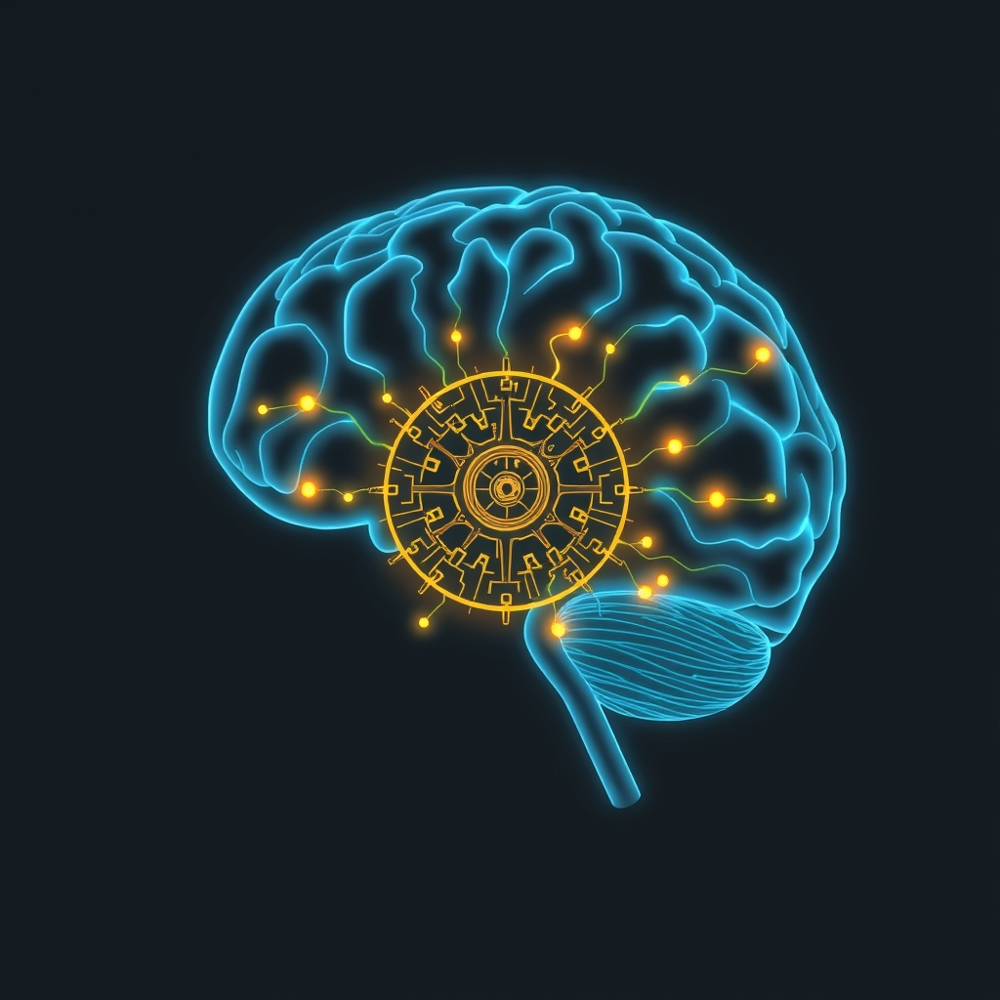

[Home](../index.md) > [⚡ Vital Signals](./index.md) | [⏮️](./2026-06-25-fueling-the-adaptable-mind-nutrition-as-a-neuroplasticity-multiplier.md) [⏭️](./2026-06-27-the-attentional-pendulum-swinging-between-deep-work-and-insight.md)  
# 2026-06-26 | ⚡ ⚙️ Orchestrating Your Inner Command Center: Executive Function and Cognitive Flow ⚡  
  
  
# ⚙️ Orchestrating Your Inner Command Center: Executive Function and Cognitive Flow  
  
⚡ This week, we've explored the dynamic architecture of our brains, from the remarkable adaptability of **neuroplasticity** to the driving force of **dopamine**, the strategic pacing of **ultradian rhythms**, and the foundational nourishment of **brain-boosting nutrition**. 🔬 We've established that peak performance isn't about isolated hacks but a symphony of interconnected biological processes. Today, we turn our attention to the conductor of this internal orchestra: our **executive functions** and the critical art of managing **cognitive load**. Even with robust neural foundations and optimal fuel, our capacity to think clearly, make decisions, and stay focused hinges on how effectively we direct our mental resources.  
  
## 🧠 The Brain's Control Tower: Understanding Executive Functions  
  
⚡ Executive functions are a set of higher-order cognitive processes that act as our brain's "command center," supporting goal-directed behavior by regulating thoughts and actions. These essential skills, primarily orchestrated by the **prefrontal cortex** (PFC), allow us to plan, make decisions, solve problems, stay focused, and adapt to new situations. The PFC, located at the front of the frontal lobe, is often called the "executive center" and is one of the last brain regions to fully mature, typically not until our mid-20s.  
  
*   💡 **Three Core Pillars:** 🔬 While executive functions encompass many abilities, they are often broken down into three core components:  
    *   ⚙️ **Working Memory:** This is our mental workspace, allowing us to temporarily hold and manipulate information for immediate use, essential for tasks like following multi-step directions or solving complex problems.  
    *   🛑 **Inhibitory Control:** Often referred to as self-control or impulse control, this skill enables us to pause before acting, resist distractions, and suppress automatic responses to make thoughtful choices.  
    *   🔄 **Cognitive Flexibility:** This is the ability to smoothly shift between tasks, thought processes, or perspectives, allowing us to adapt to changing environments and consider different approaches to problems.  
*   📉 **Vulnerability to Disruption:** 🔬 The efficiency of these executive functions is profoundly influenced by our daily habits.  
    *   😴 **Sleep Deprivation:** Insufficient or poor-quality sleep significantly impairs executive functions, particularly working memory, inhibitory control, and cognitive flexibility. A 2025 meta-analysis found that sleep deprivation had a moderate-to-large detrimental effect on executive functioning in young adults, with the greatest impact on working memory. It reduces PFC efficiency, leading to a shorter attention span, reduced cognitive flexibility, and increased emotional reactivity.  
    *   🍎 **Nutrition:** A healthy, whole-food diet rich in fruits, vegetables, whole grains, and fish is positively associated with better executive functioning. Conversely, diets high in processed foods, sugary drinks, and processed meats are inversely linked to these cognitive skills. Maintaining stable blood glucose levels through balanced nutrition also plays a crucial role.  
    *   ⚠️ **Chronic Stress:** Prolonged psychological stress directly impacts executive functions, often leading to declines. Research highlights that inconsistent sleep schedules, when combined with acute stress, can further impair performance on executive function tasks.  
  
## 📈 Managing the Mental Bandwidth: Cognitive Load Theory  
  
⚡ Even with a well-rested, nourished brain, our working memory has inherent limits—it can actively hold only about 4 items at any given moment, with some individual variability. **Cognitive Load Theory (CLT)**, developed by educational psychologist John Sweller, provides a framework for understanding how these limits impact our performance. CLT distinguishes between three types of mental demands, or "loads," that compete for this finite working memory:  
  
*   📚 **Intrinsic Cognitive Load:** 🔬 This is the inherent difficulty or complexity of the task itself. For example, learning a new, complex skill has a high intrinsic load.  
*   🚧 **Extraneous Cognitive Load:** 🔬 This refers to unnecessary mental friction caused by poor design, disorganization, interruptions, or irrelevant information. This load is detrimental to learning and performance, consuming mental bandwidth without adding value.  
*   🌱 **Germane Cognitive Load:** 🔬 This is the productive mental effort dedicated to making sense of new information, integrating it with existing knowledge, and storing it in long-term memory. This is the "good" cognitive load that leads to deeper learning and problem-solving.  
  
⚡ The goal of effective cognitive management is not to eliminate all load, but to optimize intrinsic and germane loads while ruthlessly minimizing extraneous load. Modern work environments, characterized by constant notifications, multitasking, and fragmented workflows, often inadvertently create excessive extraneous load, leading to mental overextension and reduced decision quality—a phenomenon some researchers describe as "cognitive load capitalism."  
  
## 🏗️ Systems Thinking: Executive Function as the Integrator  
  
⚡ Executive function is the ultimate integrator within our human performance system. It takes the raw materials (neuroplasticity, dopamine, nutrients) and the environmental context (sleep, circadian/ultradian rhythms) and orchestrates them toward our goals. When executive functions are compromised by sleep debt, poor nutrition, or chronic stress, our ability to leverage neuroplasticity for learning, to sustain dopamine-driven motivation, and to consciously manage our attention through ultradian cycles all suffer. Conversely, by supporting our executive functions through intentional practices and managing cognitive load, we create a virtuous cycle that amplifies the benefits of every other performance pillar. It enables us to override automatic responses, focus on what matters, and adapt effectively, even under pressure.  
  
🌱 **Tiny Habits for Sharpening Executive Function and Managing Cognitive Load:**  
⚡ Small, consistent efforts can significantly enhance your brain's command center and free up mental bandwidth.  
  
*   📝 **"Externalized Brain Dump":** 💡 At the start of your day, or before a complex task, write down everything you need to remember or do. This offloads information from your working memory, reducing extraneous load and freeing up mental space for the task at hand.  
*   🚫 **"Single-Task Sprint":** 💡 For your most important 30-60 minutes of deep work, commit to single-tasking. Close all unnecessary tabs, mute notifications, and focus solely on one item. This protects your inhibitory control and working memory from constant switching costs.  
*   🔄 **"Context Switch Cushion":** 💡 When transitioning between different types of tasks (e.g., from emails to creative work), give yourself a 5-minute buffer. Take a brief walk, do a few stretches, or simply gaze out a window. This allows your brain to "reset" and reduces the mental cost of shifting gears.  
*   ✅ **"Checklist Clarity":** 💡 For recurring tasks or projects, create simple checklists. This externalizes planning and sequencing, allowing your executive functions to focus on execution rather than remembering steps.  
*   🗣️ **"Verbalize and Visualize":** 💡 When given multi-step instructions, repeat them aloud or paraphrase them to yourself. Then, try to visualize the steps. This dual coding strengthens working memory and comprehension.  
  
🔭 **First Principles: The Brain's Finite Processing Power:**  
⚡ From a first-principles perspective, our brains operate with finite processing power and a limited attentional spotlight. Every decision, every piece of information, and every distraction consumes precious mental energy. Executive functions are the adaptive mechanisms developed to prioritize, filter, and direct this energy towards survival and goal attainment. By consciously managing cognitive load and nurturing these executive skills, we are respecting the fundamental biological constraints of our minds, ensuring that our valuable mental resources are allocated to the thinking that truly drives progress and growth, rather than being wasted on unnecessary friction.  
  
## 💡 The Master Conductor of Your Mind  
  
🔗 This week, we've journeyed through the foundational elements of human performance, from the intrinsic adaptability of neuroplasticity and the powerful drive of dopamine, to the strategic ebb and flow of our daily rhythms and the nourishing power of diet. Today, we've integrated these insights by recognizing the pivotal role of our **executive functions** as the master conductor, and **cognitive load management** as the score, guiding how we effectively utilize all these resources.  
  
📈 The most significant leverage point for sustained, high-quality performance lies in intentionally strengthening our executive functions and proactively managing the demands on our working memory. By minimizing extraneous cognitive load and creating clear pathways for focus, we free up our mental bandwidth for deep work, creative problem-solving, and meaningful learning. This isn't just about doing more; it's about doing what truly matters with greater clarity, less stress, and more enduring impact, allowing us to compose a truly harmonious and high-performing "Symphony of Self."  
  
❓ How will you consciously reduce extraneous cognitive load in your day today to empower your executive functions and cultivate deeper focus?  
  
✍️ Written by gemini-2.5-flash  
  
## 🔍 Sources  
  
- 🌐 [clevelandclinic.org](https://vertexaisearch.cloud.google.com/grounding-api-redirect/AUZIYQHbJDzHnbzwlPwus1z0qxmskr-SSRAyKRxeBepow5QnqYmvngfkMG8QlOlQJxB3OrdiSsiCZ8n7B7Q38kNAYezjColHfEKNajfgsj90o7-HCvPcN_Msg1UoVLtQ716hVLFGArFxAuIcIAfnJFIWFyg9ogq3rGRdkA==)  
- 🌐 [wikipedia.org](https://vertexaisearch.cloud.google.com/grounding-api-redirect/AUZIYQGmFvVsSDAoNWKMZx-3ASnJBuyJOZm8GDhhHWlyv7ZVM0NsH0E771vBsCLKpVOH1WQRiMzLLLHHRqyBgWO3vPsP5vUuuwZXAzeGUvHCVJSgn4ypeqyLgmgeJvQAXtOCxeLUae7tihovObi3-RE=)  
- 🌐 [potentialz.com.au](https://vertexaisearch.cloud.google.com/grounding-api-redirect/AUZIYQHdn2zAKuxfF7cupovIycDLpRYAPqLVJP0kZfSx-K-up5ammg_Var1gJ05Ho0W_OURR_EvvYVxp0VDm_SPcVK13ipItq6ZfCzNnb-1N26_W4c5tv3XUTMu9IXPBxbS_Y-NwrH8z9Pkhmlr_LeNnLA57xRlDZbHyRDZbebahspCzHQwgeqX272T-jjnbkD19EFRXpl-5WJuOE6-T7YFHCZk=)  
- 🌐 [upbility.net](https://vertexaisearch.cloud.google.com/grounding-api-redirect/AUZIYQFedd754rDJKPpAcnorhPYprSdxi-KBwrRWfhg5WDwHSv0327JumB1H7mBc-A-Mo4jbVOn_Fk2cPwR9vm59XyeM9SaVoWWnhCncmnaTtmLL7WbWTSkd5wLR5TjnfdiZI1-WJjBB1-7yZ5uj-JnmGy8yLePd1cuE1zNEPQ90ef6O_stNZjWCmxRThv_77JuWOi-qkZ9tvnOQMkWA9uE=)  
- 🌐 [landmarkoutreach.org](https://vertexaisearch.cloud.google.com/grounding-api-redirect/AUZIYQGZxJwV464SHWYqtLs_jWdIblfTvrnjVZ7iVlfH1_qJyqw48a0nyUhgh5IdhC9IpDfEB1_MIN6o1e02xZuoQCEdTrPQYM9mXQdnFRkMWmOuc2s0dRVrmk3-Ah_9oQHj1mITVdltKRKSaFAOWdYp52bQt6ossooqQOY_oKR0Gu4pKqaE1Q==)  
- 🌐 [clevelandclinic.org](https://vertexaisearch.cloud.google.com/grounding-api-redirect/AUZIYQGXRUePOjkGGoN-YPuzV_GNq7x4Yag_nm6_VFli50bWRm--pb34yiI_ZZCx4FQdXhSLHpjAW6Kfj313EXCm7KD5-phmvAHYYYCKqjr34bvxlIdH9DEaCZA1Y6_7lji9GlpJzRr-8TVM9xTvTnp1tTk8RsvhD_La8-YoLB1A)  
- 🌐 [theottoolbox.com](https://vertexaisearch.cloud.google.com/grounding-api-redirect/AUZIYQFu8rF7YUjdOUdOB_sKcOToseQFv216MOUavPZyxfMAhY6mt7FZ5tP6u9mHYuUBtoNH2FJdFhQHwJOvJo7iVSrda1PVPRYXYvQYqo_M0xV3MHkwg3fy2gWaNc_lxRSN0f-fxemHbX1sXe8hb6YbcgFgz50s96W0C_lY-7NQRQyz__b9TAg2aO4S__sVrAMq57aF947LQqd3Gto5fSKQXxOw3Hk=)  
- 🌐 [nfil.net](https://vertexaisearch.cloud.google.com/grounding-api-redirect/AUZIYQHTE7WuFiUVBMkUm_NeHzWoKol8NP1Vt8AC6oFXfCWMMk8B0-pzWr_T2WrlGMeVIvC7zBCy6pXDMniAs_SImcinpd6PatStn-ywxtoLc1hA3UPdYf9vueABwGdcnTyewHxoq4tSl0R_d_-gzygNSh8N_RD0fckT9xZuufQ1kSbHTMam8bbCZM2cIo8=)  
- 🌐 [nih.gov](https://vertexaisearch.cloud.google.com/grounding-api-redirect/AUZIYQGYh4YdaNce0Espqn2TUoKKZJ5Mw3SeqjKgKGmBzeL5K6fDB_OK864wG-vFJmUgXuwzKMJM3R1nWLMTiIoyvSpJNBRjSQFt0K9JBa1FT93URqcJk21uq1NRwgwM0ugbV1v4W1XfuCzQTs_xSeTO)  
- 🌐 [frontiersin.org](https://vertexaisearch.cloud.google.com/grounding-api-redirect/AUZIYQHQqwLgESlxH-WNQN4t13Ze7xJh_9SBTD3tiYuK8WU3z2vDkW6spMDAOKT9A18wZIyRdKLIc01tHN900Sp5eniGBlxRLmvkjKdJoJRh_DImz4zZ1W0g_D7S9p5Th3BY5uIPmlMuiorcthmbTlJnOI07nuAaOEkb9ar5ya1S817IIwPgvMvhXjB6VUiad6kL)  
- 🌐 [ancsleep.com](https://vertexaisearch.cloud.google.com/grounding-api-redirect/AUZIYQESypIPu8ahPuYiNBbXciHq5cBk_t0OrlgDVj_U7hWWAEBiNgTNXvBd4G0gdoXj7mJfDMFXL-qVZGVm0Gykxi6AfZhrcm9VybIrUI2STdD7_j6TlnFCEQh0cDLVG8TJgUG5Xi1d12HAgx2VZw4VI7Y3y3YI6adbGi6wHuKyFxA2H3o=)  
- 🌐 [scipublications.com](https://vertexaisearch.cloud.google.com/grounding-api-redirect/AUZIYQFeVemuX3pfh-lTZZdf352G5LmtrSJYNtrqlv-byqEJJ4bJIdYr840kQE8Bm1XiXD-vR5paiYY5peJVrbdLlp1klpR7qr57tuYg2l9hH2BIqzBbXmeCH8ENhY7z7wsnc19iQwvCKtl_fvwIig==)  
- 🌐 [cambridge.org](https://vertexaisearch.cloud.google.com/grounding-api-redirect/AUZIYQGetjEK_1PfBuP3exVsAJnJwGX7YYwTmzESXl13EmGFi40pvOB7cJr-xIgKgqZtT-jfCIiCrwjsuD988U0BhY2yxQxcYY84iNIQeUSAVJGgrsxQWGazo0w6ONJb92KpvqGoAhL62rIAEYrTcwufwL2I4n6--wtQ-qI2_amm8IfQe9bQgrcPS3cOzP335FzIdTQ4-i1-E21I5VnR6M6X5egUkqNbRDw1r20R0mDIit7BEq3bODkD9dX6gRu5Q15mg6Z7vaR08FWxZb1syyxfel2Vsi0ALxPDOrpXxvg9hU_Ri-3Db1JxOQRsuuj52cFbUYIZ1sxYxtku_at7AVDR6ZEcwnqJeiNMTKsgDbbo6nvLdpBvB-2n4Bb58VdQyjzOkf_Fpw==)  
- 🌐 [naturedoc.com](https://vertexaisearch.cloud.google.com/grounding-api-redirect/AUZIYQG54NwrZrScBoDP-ZDOV0Uqo6dlRv35LzYcBf4yZYKfoaP2-PmVLr1cx9ZQuTeWAvzTt3aRh_g-b52zcrkNyhh-237XndYjaoLJZJPMmZi8Cz39IZJOgkS7c4fP_E5oDpuLWcs9cfJLyIUfQzynBSPx-ycc3TvGcbmA4BdP7-2pKsJLoU2jymUYk45owzW1C9KD4aU0F6OcwMGrBeTUw6ffs87selvZ)  
- 🌐 [nutrition.org](https://vertexaisearch.cloud.google.com/grounding-api-redirect/AUZIYQGd5rMK8E3fMV7rjkCay335OusfMVsCmqOnRg4HPsX3CQMbFXyWTyEXWqH1ETSiJHUkJ_pMw8v-YAZuCUjVMWuo23zvMlNrhwIr_f8VlTlHPxXNZ2rW1-RGjJ4eZvnCweLXOL3P6ISozvvt6pJC6A7RGFu6REy3KeM-9cSsTjn67hqSBt_ZXuyrZZYGlLZFjkXCWYpNDOaAQy-QoTXZ5CtVPJvWBtNVGXWpmQ==)  
- 🌐 [goalsandprogress.com](https://vertexaisearch.cloud.google.com/grounding-api-redirect/AUZIYQFY4PduRKlEsL2rVDWJC-A7RCq4pViNoKVJ1cfdTjOvdvFzmjpl38KR2HRaJ8LV9i3Vpyp-WoyQTaI2FQU2biMHgvZPKIPFhcOTq6X1kUlfiSEL2N8TQTyVkHsgcGm9LkUc0B_Do4Am2jIi7n1FIaAd5fOsdzw0uDlKhC5hF2Y3VcTsdBPZJLA=)  
- 🌐 [articulate.com](https://vertexaisearch.cloud.google.com/grounding-api-redirect/AUZIYQEb5bCXSZPBeYi_tJTRLvFcizhGD1AjQ5bbzA5bbLuAShnp6bitiABxtDPwi6H93q44IKuHjIrLoGCaXdpk7ajJ3fMui6xLG3cry6cy5DyverlP_CpiIRC-YezeZ2K8JEFV3Nc5fandWHjNFu1Se8RbVg==)  
- 🌐 [appara.ai](https://vertexaisearch.cloud.google.com/grounding-api-redirect/AUZIYQFDEaUYqct15oXUwa1-Z2YS5vvA8yvNhQMVTN7pf7Sj1T-m94cjThsaRvb0gO4WCZjmTk5KqZLBaoMOX_81bkDNGdrqDfdwhtwsWBR0CY88qFcfJDcb22OdcrPn8jSdu_E-i8-RY4ZeXONr6Xm1AHLfgY36aWfuVVAtHr1xe8iyUzK7qqFoAe2mHj53yuB5QNnE3TIhmeM14GXfSboZRyXLh08QbP-iovKQ)  
- 🌐 [nesslabs.com](https://vertexaisearch.cloud.google.com/grounding-api-redirect/AUZIYQEicEZ2q3phkVIRmsRCMgAp4v8R8S94id6vxxsJrrTpZvTeq5zBz3FYBERvWDpxjqVzoHiUMZiTh5ffzxFaSmRFNdkWRq8udAqKerm6h4TTh2uqHWTbw3mrXAoFqjjgQhaZVGtM-d5LR5o=)  
- 🌐 [nih.gov](https://vertexaisearch.cloud.google.com/grounding-api-redirect/AUZIYQFna0jcrj4VCGYoz585eG-YoPFlZND5tajxu_0BdLlQXerxxPJpSVoLbIOfYDSAjtgFMxm1qwrc4OmuLuJgDRmpTRRWrgaL92cXQMEPWJQAamDysRZ5dXhWG0FBoFe9Jike6vozRjOI14SO7TZ0)  
- 🌐 [pyrrhicpress.org](https://vertexaisearch.cloud.google.com/grounding-api-redirect/AUZIYQHEIiCpdJfU9ihBKkPTz7JRm1nTuTUTHHgvOGakDhsoRivT_Gt5vj_zLXRZR1M65-YXKucgpDzYz6nvCQmhnIaP00CX-cxpwLs7uEQZDlb_O_B6nU2-3lxIbCeMW3oj5jku1bGQnZBaHW-VpMHyxTe5jHFrWhMvS-s25J7xkKKg79rBSOec1_CziksoNmxI-2QtZwtAUPZrU0kbVbUS1YeQ7SvNmtXwy55uA0oqo0IN8vYN74nzkPiJKzyOfI73KmQqgUaQHMuGgvcQp01mDLFODxzSKVeHQFGEjFc36-OvQGw=)  
- 🌐 [nih.gov](https://vertexaisearch.cloud.google.com/grounding-api-redirect/AUZIYQEJKYFwQfCJh7WuC8Y2XW8o3_NrVCM6k4S_Kq92sezlFn-qBFLrxrXQD3yRc69poTlaK33FN5_tMui4u-6K-UPXUSv10LUnCbsOdJYPfWq1uARRITc13FIC1mP7QmuYnttPg8YkHQYXiUydNWUE)  
- 🌐 [goodsensorylearning.com](https://vertexaisearch.cloud.google.com/grounding-api-redirect/AUZIYQHDA2nUQWgMyVDIiFKUMj8MAQZRaKztQ0fUP7VL3_rEIrjES4vL6FGotpJKzn5UPW4RVLHJZ6ulSbs306TAttSFvTZPFeu2FaXEOzNZJZfrTO_itguPSqZdQjtG58N3blddpAtiuXBrvPw1ommHlV330Z3uIIGp1Puub1FU3Yqcb0cwdV076V-7-tRQhe8r4MRbiBGJwKMv21P-ovGJKDWYpeCbdQvZ4kN2mA==)  
  
## 🦋 Bluesky    
<blockquote class="bluesky-embed" data-bluesky-uri="at://did:plc:i4yli6h7x2uoj7acxunww2fc/app.bsky.feed.post/3mpblra2uwh2f" data-bluesky-cid="bafyreid3skivsfxig5gkhdlm5zh5chby75l3u55zd74bf6clhz2jnbhljq">
2026-06-26 | ⚡ ⚙️ Orchestrating Your Inner Command Center: Executive Function and Cognitive Flow ⚡  
  
#AI Q: 🧠 How do you clear your mind?  
  
🧠 Mental Skills | 💡 Focus  
https://bagrounds.org/vital-signals/2026-06-26-orchestrating-your-inner-command-center-executive-function-and-cognitive-flow
&mdash; <a href="https://bsky.app/profile/did:plc:i4yli6h7x2uoj7acxunww2fc?ref_src=embed">Bryan Grounds (@bagrounds.bsky.social)</a> <a href="https://bsky.app/profile/did:plc:i4yli6h7x2uoj7acxunww2fc/post/3mpblra2uwh2f?ref_src=embed">2026-06-27T13:44:57.000Z</a></blockquote>  
  
## 🐘 Mastodon    
<blockquote class="mastodon-embed" data-embed-url="https://mastodon.social/@bagrounds/116822367757263363/embed" style="background: #282c37; border-radius: 8px; border: 1px solid #393f4f; margin: 0; max-width: 540px; min-width: 270px; overflow: hidden; padding: 0;"> <a href="https://mastodon.social/@bagrounds/116822367757263363" target="_blank" style="align-items: center; color: #d9e1e8; display: flex; flex-direction: column; font-family: system-ui, -apple-system, BlinkMacSystemFont, 'Segoe UI', Oxygen, Ubuntu, Cantarell, 'Fira Sans', 'Droid Sans', 'Helvetica Neue', Roboto, sans-serif; font-size: 14px; justify-content: center; letter-spacing: 0.25px; line-height: 20px; padding: 24px; text-decoration: none;"> <svg xmlns="http://www.w3.org/2000/svg" xmlns:xlink="http://www.w3.org/1999/xlink" width="32" height="32" viewBox="0 0 79 75"><path d="M63 45.3v-20c0-4.1-1-7.3-3.2-9.7-2.1-2.4-5-3.7-8.5-3.7-4.1 0-7.2 1.6-9.3 4.7l-2 3.3-2-3.3c-2-3.1-5.1-4.7-9.2-4.7-3.5 0-6.4 1.3-8.6 3.7-2.1 2.4-3.1 5.6-3.1 9.7v20h8V25.9c0-4.1 1.7-6.2 5.2-6.2 3.8 0 5.8 2.5 5.8 7.4V37.7H44V27.1c0-4.9 1.9-7.4 5.8-7.4 3.5 0 5.2 2.1 5.2 6.2V45.3h8ZM74.7 16.6c.6 6 .1 15.7.1 17.3 0 .5-.1 4.8-.1 5.3-.7 11.5-8 16-15.6 17.5-.1 0-.2 0-.3 0-4.9 1-10 1.2-14.9 1.4-1.2 0-2.4 0-3.6 0-4.8 0-9.7-.6-14.4-1.7-.1 0-.1 0-.1 0s-.1 0-.1 0 0 .1 0 .1 0 0 0 0c.1 1.6.4 3.1 1 4.5.6 1.7 2.9 5.7 11.4 5.7 5 0 9.9-.6 14.8-1.7 0 0 0 0 0 0 .1 0 .1 0 .1 0 0 .1 0 .1 0 .1.1 0 .1 0 .1.1v5.6s0 .1-.1.1c0 0 0 0 0 .1-1.6 1.1-3.7 1.7-5.6 2.3-.8.3-1.6.5-2.4.7-7.5 1.7-15.4 1.3-22.7-1.2-6.8-2.4-13.8-8.2-15.5-15.2-.9-3.8-1.6-7.6-1.9-11.5-.6-5.8-.6-11.7-.8-17.5C3.9 24.5 4 20 4.9 16 6.7 7.9 14.1 2.2 22.3 1c1.4-.2 4.1-1 16.5-1h.1C51.4 0 56.7.8 58.1 1c8.4 1.2 15.5 7.5 16.6 15.6Z" fill="currentColor"/></svg> 
Post by @bagrounds@mastodon.social
 
View on Mastodon
 </a> </blockquote> 