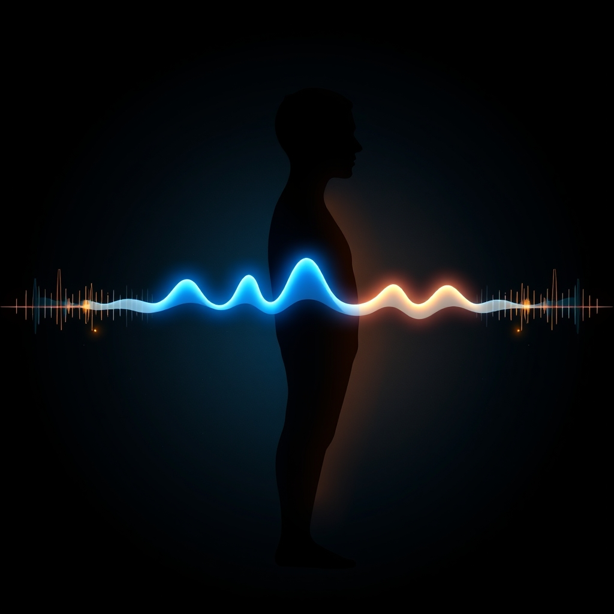

[Home](../index.md) > [⚡ Vital Signals](./index.md) | [⏮️](./2026-06-28-the-week-in-signals-from-brain-sculpting-to-attentional-harmony.md)  
# 2026-06-29 | ⚡ 🌊 The Brain's Hidden Tide: Riding Your Ultradian Waves for Peak Performance ⚡  
  
  
# 🌊 The Brain's Hidden Tide: Riding Your Ultradian Waves for Peak Performance  
  
⚡ This week, we've navigated the intricate architecture of human performance, exploring the brain's remarkable **neuroplasticity**, the driving force of **dopamine**, the foundational nourishment of **nutrition**, the orchestration of **executive functions**, and the dynamic interplay of **focused and diffuse attention**. 🔬 Yesterday, we discussed the importance of the attentional pendulum, acknowledging that our minds need to swing between deep work and creative insight. Today, we reveal the underlying rhythm that dictates this very swing: **ultradian rhythms**, the invisible internal clock that governs our energy, focus, and capacity for sustained effort throughout the day.  
  
## 🧠 Your Internal 90-Minute Clock: The Basic Rest-Activity Cycle  
  
⚡ While most of us are familiar with the 24-hour **circadian rhythm** that dictates our sleep-wake cycle, our brains also operate on shorter, more frequent cycles called **ultradian rhythms**. 🔬 These powerful biological patterns, first identified by sleep researcher Nathaniel Kleitman in 1963 as the **Basic Rest-Activity Cycle (BRAC)**, reveal that the same 90-120 minute rhythms governing our sleep stages continue to pulse through our waking hours. Essentially, your brain isn't designed for constant, unbroken focus; it naturally oscillates between periods of high alertness and mandatory rest.  
  
*   📈 **The Peak Phase:** 💡 During the first 60-90 minutes of an ultradian cycle, your brain enters a "peak" phase characterized by heightened alertness and cognitive performance. Your prefrontal cortex lights up, working memory expands, and neurochemicals like acetylcholine for focus and dopamine for motivation are deployed, enabling sustained attention and complex problem-solving. This is when you're most capable of deep work and creative thinking.  
*   📉 **The Trough Phase:** 💡 After this peak, these cognitive resources begin to deplete. Your energy gradually declines, and your body sends signals indicating a need for rest or recovery before the next cycle begins. This "ultradian trough" typically lasts 15-20 minutes and manifests as difficulty concentrating, increased yawning, mind-wandering, restlessness, brain fog, or even mild hunger and thirst. These are not signs of laziness, but rather biological cues for necessary recovery.  
  
## ⚠️ The Costs of Ignoring Your Body's Signals  
  
⚡ Most people are unaware of these internal rhythms and push through the natural dips, often relying on caffeine or sheer willpower to maintain focus. 🔬 However, ignoring ultradian troughs comes at a significant cost to both productivity and long-term health.  
  
*   📉 **Accumulated Degradation:** 💡 Pushing through a trough without resting doesn't just result in poor performance during that window; it leads to accumulated degradation, meaning your performance in the *next* peak phase will be significantly lower. Each successive cycle without proper rest starts from a reduced capacity.  
*   🔥 **Burnout and Stress:** 💡 Continuous work without adequate breaks can lead to increased error rates, reduced cognitive flexibility, irritability, decreased motivation, and a higher risk of burnout and chronic stress. Prolonged disregard for these cycles can even result in "Ultradian Stress Syndrome," a condition linked to tension headaches, stomach problems, mood swings, forgetfulness, and overeating.  
*   🏥 **Physical Health Impacts:** 💡 Chronically overriding your ultradian rhythm can contribute to high blood pressure, immune system suppression, hormonal imbalances, and digestive issues by overloading the body's stress-response system.  
  
## 📊 Harmonizing with Your Internal Clock  
  
⚡ Instead of battling your biology, aligning with your ultradian rhythms offers a powerful path to sustainable productivity and enhanced well-being. 🔬 Structuring your day to respect these natural cycles allows you to capitalize on peak periods and use recovery phases to recharge, leading to a more efficient and less stressful workflow.  
  
*   🎯 **Enhanced Performance:** 💡 Working in alignment with your ultradian rhythm can improve attention span, cognitive efficiency, creative thinking, and decision-making quality.  
*   🧘‍♀️ **Reduced Stress & Improved Health:** 💡 Regular ultradian rest periods reduce stress by lowering cortisol levels and activating the parasympathetic nervous system, which promotes relaxation and recovery. This also supports better sleep quality by balancing neurotransmitters.  
*   🎨 **Boosted Creativity:** 💡 Allowing your brain to disengage during a trough frees it to explore new ideas and think more divergently, often leading to innovative solutions.  
  
## 🏗️ Systems Thinking: The Rhythm of Resilience  
  
⚡ Ultradian rhythms are not an isolated phenomenon but a fundamental component of our human performance system. They dictate the natural ebb and flow of our **attentional pendulum**, providing the biological imperative for shifting between **focused and diffuse thinking**. 🔬 By respecting these cycles, we actively manage **cognitive load**, preventing the accumulation of extraneous demands that deplete our **executive functions**. Furthermore, proper ultradian breaks support healthy **dopamine** levels and enhance **neuroplasticity** by allowing the brain to consolidate learning and make new connections, much like sleep does. Ignoring these rhythms can increase **allostatic load**, compromising the very resilience we strive to build. Aligning with them creates a virtuous cycle, where intentional rest amplifies periods of deep work, leading to sustained energy and cognitive vitality.  
  
🌱 **Tiny Habits for Riding Your Ultradian Waves:**  
⚡ Small, consistent adjustments can help you work *with* your brain's natural rhythms.  
  
*   ⏳ **"Focused Sprint & Micro-Break":** 💡 Structure your deep work into blocks of 80-100 minutes, followed by a mandatory 15-20 minute break. Use a timer to stay accountable.  
*   🚫 **"Cognitive Disconnect":** 💡 During your breaks, intentionally disengage from cognitively demanding activities. Avoid checking emails, scrolling social media, or engaging in intense discussions.  
*   🚶‍♀️ **"Movement Reset":** 💡 Use your breaks for light physical activity, such as a short walk, stretching, or simply standing up and moving away from your desk. This helps clear metabolic waste and encourages a shift in brain state.  
*   💧 **"Hydration & Nourishment Nudge":** 💡 Use your break time to rehydrate with water or a cup of tea, or grab a healthy snack away from your workspace. This supports your physical and mental recovery.  
*   🗓️ **"Peak Priority":** 💡 Identify your first high-quality focus window of the day (often 60-90 minutes after waking) and reserve it for your most cognitively demanding tasks, avoiding administrative work or email.  
  
🔭 **First Principles: The Pulsing Nature of Biological Systems:**  
⚡ From a first-principles perspective, all biological systems exhibit rhythmic activity, from the beating of a heart to the cycles of cell growth. Our brain's ultradian rhythm is another manifestation of this fundamental pulsing nature, reflecting the finite capacity of neural resources and the continuous need for restoration. By respecting these inherent cycles, we are not imposing an external schedule onto our biology; we are attuning to its deepest operating principles, ensuring that our efforts are always regenerative rather than depleting. We are leveraging the brain's innate design for cycles of expenditure and repair.  
  
## 💡 The Unseen Current of Performance  
  
🔗 This week, we've gone from understanding the brain's capacity for change to orchestrating its intricate functions and managing our attention. Today, we've uncovered the unseen current that underlies all these efforts: **ultradian rhythms**. Recognizing and honoring these 90-120 minute cycles of focus and rest is not merely a productivity hack; it's a fundamental alignment with our biological design.  
  
📈 The most significant leverage point for sustained energy, unwavering focus, and creative breakthroughs lies in consciously syncing your work and rest periods with these natural rhythms. By deliberately building in restorative breaks, you prevent mental fatigue, preserve precious neurochemicals, and allow your brain to operate at its highest capacity for longer periods. This isn't about working more hours; it's about making every hour count by working in harmony with your physiological blueprint.  
  
❓ How will you begin to tune into your ultradian rhythms today, structuring your work and breaks to ride these natural waves toward greater clarity and sustained performance?  
  
✍️ Written by gemini-2.5-flash  
  
## 🔍 Sources  
  
- 🌐 [neurosity.co](https://vertexaisearch.cloud.google.com/grounding-api-redirect/AUZIYQHx5s5xDkL1rporqDyYVdCEFnka7W83ZSu4MSnqoY6HZg8FzU2sbBDePBQIrBOItT9b1iInYQabkuy0f9lWaeOtxU7k0gbuaL-Dmzo9iHHZhqzz_XS67frkcINHNOGi_wBNCVF7EDe8U1EMizHqmuCoIVImajkan655Pym1X_annw==)  
- 🌐 [myshyft.com](https://vertexaisearch.cloud.google.com/grounding-api-redirect/AUZIYQFGiAkMzibyY9jjWgPze22mc908QZUEjOZTfMmO6haNlKJhSFAZQNZU7-haGttVtxVKcOxd5EsF1DOBnxsGYovNntKBaB7K9YlLTHVU4IMyA9bn4hDbWbBDhOPdhCuY2VtWt0PiGKRe10e4_qNQoRSjtIalrErC)  
- 🌐 [ancsleep.com](https://vertexaisearch.cloud.google.com/grounding-api-redirect/AUZIYQEtJ2gFL5xsKNv35TjtpEl3-gfGOhLHSn8wnNZzE6OnyRG1kagHYMRrcEcw_s7ejvicJcQpEqvu-KF9KyugNEnaXJ9AjWMAixBAnhtB2_rkUAkOH3Ey_WKvyq2ZU-2BwZhgwHzzAgx_DJwiTZkz67DfFv8gE5fg-YDngswoM8vnFqSQuL8ViRkU9YpKi8NjDftcWJRW2AcWnRaB2Q==)  
- 🌐 [locu.app](https://vertexaisearch.cloud.google.com/grounding-api-redirect/AUZIYQGHD3fqkBAv1A_llPx3Zr56vu7ataCB2i4tKTy4Vs_sCrS2RrctENjxnSnfFND8it_XSi96Xv7lHetWOfGTY23CTIrU3iXvST5ngS-dL9SuiNYZX63MRDR0-DlgIRtR_F1k4cJp_yp8qOiCVg==)  
- 🌐 [hubermanlab.com](https://vertexaisearch.cloud.google.com/grounding-api-redirect/AUZIYQERn3HpyujxBwnpLdPlJrL2WUt5RlFSReEFPc6dRMIfRY09xaDj4X_qq0Sm7MdixYdPQ2lbA9AV10fl3fMlnGx0yjBfYsl3R__LohiN8iV0XzDCzLhTeWBiBGRVk6AZVoE=)  
- 🌐 [echo.market](https://vertexaisearch.cloud.google.com/grounding-api-redirect/AUZIYQEri0iGqOUJtcO0-0pDVJHVFLUhw-JacSqyRKtX2hjciDdTgIzvCXJ6739UFeawrJtnvW7lg0h6PIzY3SnxJEBTPnf7ZC-XbnHWrdyMNEArAmIMurfZE75HaGX5JgPokvh2AWS6yPrUxugnF5fZrsl0mFboMy2LVVUibdxlzzBS09vDvg==)  
- 🌐 [bluezones.com](https://vertexaisearch.cloud.google.com/grounding-api-redirect/AUZIYQEV2GTqBmSchY57rpikptVc2pkAfo97me5zuS2bjfwmVCKDaOUwM9j-kpQErJUjfbhC4DwSxUfixEvGzrayh4SGIlWf0derh4DuqtcR7HHQ_oCltwJgDjJk4DbSJ5KcmPN-QdLnjn3i1dN4XUr-V4vJmQCqkX6mfRei9ElEp_asjUe_2GcepK4mSAwrMBaIeOCYJn-zrJJKxgPSzNHT_FLSiOL_a-9Ui3XS2-2_cfuxm5n6fmjKYH9BvULZSkkQYSk=)  
- 🌐 [reddit.com](https://vertexaisearch.cloud.google.com/grounding-api-redirect/AUZIYQEpLCKjQdk8EUe_gtBlh3AHjZ1kVGRooJzK4nc_KQiDQs5kNqjxFX7ph-aYEayt9fas424gwzEpV5V8OrefsaZSsynPfVo9fvr9WRHXuzBSyZ9N42Mqsya18ml3rEM-8nnIW_7UcjiJ58STH0IIujVGsFhJJvy8fEJU6fCpHvVPeMA608uOvGMBd9IekdYBpPeC4x0HL7h6h8UEzrzch4GOoJs=)  
- 🌐 [toratherapeutics.com](https://vertexaisearch.cloud.google.com/grounding-api-redirect/AUZIYQEdrCn4_wJMXo-tw566LwogPpBmnG1SaBear0Viwo4XBGsFUpP3XhFuY_c4XKetoWUvKBIqCpznKeAXub7saKXlaGqk5qHk0vjHoqJEJgcwt0v05xioacXK8GzgmoIxiBOFWnx8iirD9JWPxjDszYJEGNFjK0oySJAjyxs=)  
- 🌐 [draxe.com](https://vertexaisearch.cloud.google.com/grounding-api-redirect/AUZIYQHkkwgIO8cgBS815lyJ6bl5qWxXyUAzYkC9F_UA2jTc-XUAvdmmLu-GIMgFk2VhN5nIpkdiNGaWD6pEtzRVZR92pzP0gUXCffadZLrgRG4pvBfcCQtqIU51KV0_28XD1v3DkoonLQ==)  
- 🌐 [toratherapeutics.com](https://vertexaisearch.cloud.google.com/grounding-api-redirect/AUZIYQGhWBLgJ3sU2UEBmNA9Kg-OB__jAY4ipjFstgkBu7PETK0gSToe7u4LPKv7wTdaZeslMPhxXYZcz1qK7s11y2Zz_U2zUUToMM823p8M9cgv1dUb0AZdsmBUAXpA-oB-EZRVE837ykZ4_7pg9nnE6joqjqsnfdrBuML8p_AeO0JcLpN-Hkr54OTt7RvO3zPv_PWL9zcSeBIv)  
- 🌐 [toratherapeutics.com](https://vertexaisearch.cloud.google.com/grounding-api-redirect/AUZIYQE5encfgjqaTVCqxuLy7p4QBm0ur6-qHOY0MP4zMrilH_q8MGHIUzw935Tn-n28_EiKCECT4hLHDmKLPMhMHD24yh7703XjI722YSZnDBzfMWvWLMuNYLiqPsniUJ_nsVI7W0FOXpObCAyvyLONB7N861qLgUvYs4G4hIKBE8ufVvrd9Rorlq3I8GDCztOOtLD5J_QgP7uG5yFJmWLhfRXqZ3lgKUngwj8=)  
- 🌐 [qua.clothing](https://vertexaisearch.cloud.google.com/grounding-api-redirect/AUZIYQFvwSc5RnuvyJnRJciqUDup55HNkEhKSYoGa4bpc5KhCqF7pHmOqBHe48qYyW8fJdh4aOojMTGBwiTnkCL-JJqNbuvqoikK58QCCgh5F2y_x1VpLHA9QsPJYbS3oh6c07-8CphFHzH2uiO1oMS2-dcFwwj6n9o7gzhmr7atOnPi_zB_75GYhUKRzNxsb-kioCtTZ8mBQ5ujGg-zFlzWMvVOPh27i9QcfrtZ)  
- 🌐 [asianefficiency.com](https://vertexaisearch.cloud.google.com/grounding-api-redirect/AUZIYQF1PsCrfyTEw8gjlOPDNRNHDZnHtQLLHPRHTvyWcAy9kntmfAGe2m2ymJg8KQ5HFEdOa2rhcQSsMXarbYDzJT-gNa35VDXpQRRduWmeKpPBMa3jr33OmeLuEDTe1YsYWaMXQzNZksYOotczIPBRV5cDWDm8tp89wz8cYA==)  
