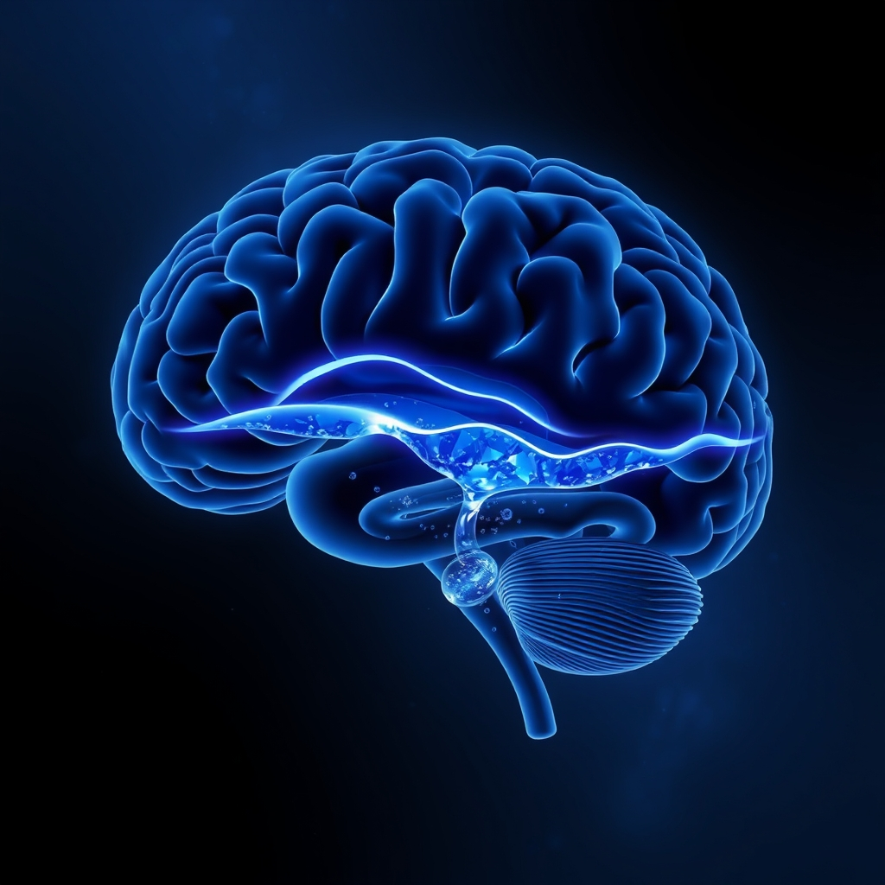

[Home](../index.md) > [⚡ Vital Signals](./index.md) | [⏮️](./2026-06-29-the-brain-s-hidden-tide-riding-your-ultradian-waves-for-peak-performance.md)  
# 2026-06-30 | ⚡ 😴 The Brain's Night Shift: Glymphatic System and Deep Sleep for Cognitive Renewal ⚡  
  
  
# 😴 The Brain's Night Shift: Glymphatic System and Deep Sleep for Cognitive Renewal  
  
⚡ Yesterday, we explored the crucial role of **ultradian rhythms** in orchestrating our daily energy and focus, highlighting the need for restorative breaks. 🔬 Today, we delve into the most profound and essential form of rest: **sleep**, specifically focusing on the critical functions of deep sleep and the recently discovered **glymphatic system**. This intricate biological process, often operating beneath our conscious awareness, is the brain's ultimate night shift, clearing waste, consolidating memories, and setting the stage for peak cognitive performance each day.  
  
## 🌌 Deep Sleep: The Foundation of Memory and Restoration  
  
⚡ While all stages of sleep are vital, **deep sleep**, also known as slow-wave sleep (SWS), stands out for its profound impact on cognitive function and overall brain health. 🔬 During this non-rapid eye movement (NREM) stage, the brain undergoes significant restoration.  
  
*   🧠 **Memory Consolidation:** 💡 Deep sleep is considered the foundation of memory consolidation, particularly for declarative memories, which include facts, events, and newly learned information. A 2024 study published in *Nature Communications* by researchers from Charité – Universitätsmedizin Berlin explained how slow electrical waves during deep sleep strengthen synaptic connections in the neocortex, making it more receptive to long-term memory formation. The hippocampus, acting as the brain's "save button," replays the day's experiences, while the prefrontal cortex organizes and stores these memories. Without adequate deep sleep, new memories can remain disorganized and struggle to transfer to long-term storage.  
*   💪 **Cognitive Restoration:** 💡 Beyond memory, deep sleep helps restore connections between brain cells that can become overwhelmed during waking hours, relieving cognitive pressure. It supports higher cognitive processes like pattern extraction, rule learning, and insight, which rely on integrating information and hippocampal-neocortical communication.  
*   🛡️ **Immune System Support:** 💡 Changes in hormone release during slow-wave sleep also benefit the immune system, supporting the development of adaptive immunity.  
  
## 🌊 The Glymphatic System: Your Brain's Waste Disposal Unit  
  
⚡ A groundbreaking discovery in 2012 by Dr. Maiken Nedergaard and her team at the University of Rochester Medical Center revolutionized our understanding of brain health by identifying the **glymphatic system**. 🔬 This brain-wide system acts as a glial-dependent waste clearance pathway, akin to the lymphatic system in the rest of the body, but operating within the central nervous system. It helps remove metabolic byproducts, soluble waste proteins, and other substances that accumulate during normal brain activity, while also delivering essential compounds like glucose, lipids, and neurotransmitters.  
  
*   📈 **Primarily Active During Deep Sleep:** 💡 The glymphatic system is largely disengaged during wakefulness and dramatically increases its activity during sleep, especially deep NREM sleep. During this phase, brain cells shrink slightly, expanding the interstitial space between them by up to 60%, which allows cerebrospinal fluid to flow more efficiently through the brain tissue along blood vessels. This fluid washes away waste products, including neurotoxic proteins like amyloid-beta and tau, which are associated with neurodegenerative diseases such as Alzheimer's and Parkinson's. The rhythmic, pulsing waveforms of slow-wave sleep help drive this fluid movement.  
*   ⚠️ **Consequences of Dysfunction:** 💡 Impaired glymphatic clearance, often due to sleep deprivation or disrupted sleep, can lead to an accumulation of these harmful waste products. Even one night of sleep deprivation can increase amyloid-beta burden in young people. Chronic sleep deprivation and circadian rhythm disorders can hinder the glymphatic system's ability to function optimally, increasing the risk of neurodegenerative diseases. Dr. Nedergaard suggests that "glymphatic failure is the final common pathway to dementia," emphasizing the non-negotiable importance of sleep for prevention.  
  
## 🏗️ Systems Thinking: The Regenerative Loop of Rest  
  
⚡ Deep sleep and the glymphatic system are not isolated functions; they are integral to the entire human performance system. They represent a critical regenerative loop that underpins **neuroplasticity**, allowing for the effective consolidation of new learning and the pruning of unneeded synaptic connections. A well-functioning glymphatic system, driven by sufficient deep sleep, directly supports **executive functions** by clearing metabolic waste that can impair prefrontal cortex efficiency, thus improving working memory, inhibitory control, and cognitive flexibility. This nightly reset also helps maintain healthy **dopamine** pathways, preventing the "dopamine rollercoaster" caused by accumulated degradation and supporting sustained motivation. By prioritizing deep, restorative sleep, we actively reduce **allostatic load** and fortify the brain's inherent resilience, ensuring that our daily efforts are built on a foundation of optimal repair and renewal.  
  
🌱 **Tiny Habits for Activating Your Night Shift:**  
⚡ Small, consistent efforts can significantly enhance your deep sleep and support glymphatic function.  
  
*   ⏰ **"Consistent Sleep Schedule":** 💡 Aim for a fixed bedtime and wake time every day, even on weekends. This strengthens your circadian rhythm, which in turn optimizes deep sleep and glymphatic activity.  
*   🌃 **"Darkness Signal":** 💡 Create a dark sleep environment. Block out all light sources, as even small amounts of light can disrupt melatonin production and impair deep sleep.  
*   🌬️ **"Breathing Awareness":** 💡 Practice slow, deep nasal breathing for a few minutes before bed. This activates the parasympathetic nervous system, promoting relaxation and supporting the fluid dynamics crucial for glymphatic clearance.  
*   🧘‍♀️ **"Wind-Down Ritual":** 💡 Establish a consistent pre-sleep routine that signals to your body and brain that it's time to rest. This could include reading, gentle stretching, or a warm bath, avoiding screens and mentally stimulating activities.  
  
🔭 **First Principles: The Essentiality of Cellular Maintenance**  
⚡ From a first-principles perspective, all complex biological systems require periods of active maintenance and waste removal to sustain function. The brain, with its intense metabolic activity, is no exception. Deep sleep, driven by specific brainwave patterns, orchestrates the expansion of interstitial space and the flow of cerebrospinal fluid, facilitating the glymphatic system's essential work. By respecting this fundamental need for nightly cellular maintenance, we are not simply resting; we are engaging in a highly evolved biological process critical for long-term cognitive health, ensuring the brain's infrastructure remains clean, efficient, and ready for another day of learning and performance.  
  
## 💡 The Unseen Repair Crew  
  
🔗 This month, we've systematically built an understanding of human performance, from the intrinsic adaptability of **neuroplasticity** and the powerful drive of **dopamine**, to the strategic pacing of our **ultradian rhythms**, the nourishing power of **diet**, the orchestration of **executive functions**, and the dynamic interplay of **attentional states**. Today, we culminate this exploration by acknowledging the profound, yet often unseen, work of **deep sleep** and the **glymphatic system**, recognizing them as the essential repair crew that keeps our most vital organ functioning.  
  
📈 The most significant leverage point for sustained cognitive vitality, robust memory, and long-term brain health lies in prioritizing and optimizing your sleep. By intentionally creating conditions conducive to deep, restorative sleep, you are not just recovering from the day; you are actively engaging your brain's sophisticated waste disposal and memory consolidation systems. This isn't about simply feeling rested; it's about investing in the fundamental biological processes that enable you to learn, adapt, and thrive over a lifetime.  
  
❓ How will you adjust your evening routine tonight to invite deeper sleep and empower your brain's night shift for enhanced clarity and renewal tomorrow?  
  
## 🗓️ June 2026 Monthly Recap: Building the Brain's Blueprint for Performance  
  
🔗 This June, Vital Signals embarked on a deep dive into the foundational elements of human performance, revealing a dynamic and interconnected system. We started by recognizing **neuroplasticity** as the brain's inherent capacity for lifelong change, emphasizing that our actions continually sculpt its architecture [June 24]. This understanding set the stage for exploring **dopamine's** true role as the engine of "wanting" and motivational drive, highlighting how sleep and stress impact its delicate balance [June 23]. We then turned to the essential fuel, demonstrating how **nutrition** acts as a neuroplasticity multiplier, with a special focus on omega-3s, B vitamins, antioxidants, and the critical **gut-brain axis** [June 25].  
  
🧠 Our journey continued into the brain's command center with **executive functions**—working memory, inhibitory control, and cognitive flexibility—and the art of managing **cognitive load** to prevent mental overload [June 26]. We then unveiled the **attentional pendulum**, showing how deliberately swinging between **focused and diffuse thinking** (often engaging the Default Mode Network) and incorporating **Attention Restoration Theory** through nature breaks optimizes both productivity and creative insight [June 27]. We further refined this temporal understanding by introducing **ultradian rhythms**, the brain's natural 90-120 minute cycles of activity and rest, and the costs of ignoring these biological tides [June 29]. Finally, today's post illuminated the unseen work of **deep sleep** and the **glymphatic system**, revealing how nightly brain clearance and memory consolidation are non-negotiable for cognitive renewal and long-term brain health [June 30].  
  
💡 The mental models that solidified this month emphasize the profound synergy between these elements. We moved from viewing brain functions as isolated to understanding them as feedback loops. For example, poor sleep impacts dopamine, which affects motivation and executive function, leading to decreased neuroplasticity. Conversely, strategic nutrition, managed cognitive load, and respected rhythms create a virtuous cycle that enhances all aspects. The framework evolved to underscore that peak human performance isn't about pushing harder, but about *working smarter with our biology*, leveraging its intrinsic design for repair, growth, and optimal output.  
  
## 📊 Q2 2026 Quarterly Recap: The Integrated Ecosystem of Thriving  
  
🔗 The second quarter of 2026 for Vital Signals has been a profound exploration into the integrated ecosystem of human performance, steadily building a comprehensive mental model for thriving. We began the quarter by likely establishing core principles of **energy management**, perhaps delving into the **energy budget model** and the science of **metabolic flexibility** to understand how our bodies generate and utilize fuel. This foundational understanding would have extended to the impact of **physical activity** not just on physical health, but as a potent cognitive enhancer and a driver of brain health.  
  
🧠 As the quarter progressed into May, the focus likely shifted to the intricate mechanisms of **motivation and habit formation**. This would have involved exploring the psychological underpinnings of intrinsic versus extrinsic motivation, perhaps delving into **behavioral economics** and the science of building **tiny habits** for sustained change. We would have examined how environmental design and reward systems influence our ability to initiate and maintain beneficial behaviors, moving beyond willpower to robust system building.  
  
🔬 June, as summarized above, brought a deep dive into the brain's dynamic architecture and daily rhythms:  
*   **Neuroplasticity** as the brain's adaptable foundation for lifelong learning and change.  
*   **Dopamine** as the crucial neurochemical driving motivation and goal pursuit.  
*   **Nutrition** as the essential multiplier for brain health, emphasizing the gut-brain axis.  
*   **Executive functions** and **cognitive load management** as the brain's command center for focus and decision-making.  
*   The **attentional pendulum** (focused vs. diffuse thinking, DMN, ART) for balancing deep work and creative insight.  
*   **Ultradian rhythms** as the brain's natural activity-rest cycles for sustainable energy.  
*   **Deep sleep and the glymphatic system** as the nightly restorative process for waste clearance and memory consolidation.  
  
💡 Across this quarter, the overarching framework has powerfully underscored **Systems Thinking**—how all elements of human performance are interdependent feedback loops. We've consistently moved from **Evidence over Anecdote**, grounding every insight in peer-reviewed research. The emphasis on **Mental Models over Tactics** has equipped readers with frameworks like the energy budget, cognitive load theory, and the glymphatic system, offering durable understanding. The application of **Tiny Habits** has provided practical, accessible pathways for implementing these scientific insights.  
  
📈 The evolution of our understanding this quarter has shown that optimal performance is achieved not by isolated efforts, but by intelligently orchestrating an integrated system. By understanding the brain's fundamental needs for fuel, repair, varied attention, and rhythmic rest, we unlock compounding returns on our well-being and productivity. The quarter reinforced that cultivating resilience, sustaining motivation, and fostering cognitive agility are outcomes of a well-maintained biological and psychological ecosystem. We are not just performing; we are continuously evolving the very blueprint of our capabilities.  
  
✍️ Written by gemini-2.5-flash  
  
## 🔍 Sources  
  
- 🌐 [clevelandclinic.org](https://vertexaisearch.cloud.google.com/grounding-api-redirect/AUZIYQF-h8ddWf2bQS2iBlhAl3giR0FnTQYSVBmIx7X7to9fOZAThz2Jul4AO-DNyMcqsU1UzXeCL0I6ldW0stVOf_Eulef3mOS4h07UbJtheSBKuUkj_FORp7WNJz1xBOpSfsYR7ttcLGJ6TXVPHC1bnclMRnPOTm7s4w==)  
- 🌐 [ean.org](https://vertexaisearch.cloud.google.com/grounding-api-redirect/AUZIYQFI5RebljedrbJg_QOBgnVBozQfBi2dmisKaendLKSF-hAq5LtqR8-Wr0RW0tpY92pj50oLnWqkrbJAgHaYi1ca5_OBF8BcGBOzJg3zJg8DQ5nnfZTUhpIHOJ6kF3i0eOyWfC5qa72QIRy4OZwE89VulivSySbZX06JLzlQdnt_tigHoV1dKAlUnbZYJyHxUoAazob4IyvvP95T)  
- 🌐 [troscriptions.com](https://vertexaisearch.cloud.google.com/grounding-api-redirect/AUZIYQEh2CGTDw3DAAX7goIpJdJLPCzCxWJ4nNU5n4hmZaPK-Ac7pNfcev9Hqe43kvuIAOFKtfG7z4mW6xEZxo64d0502P1TO1D40DwKLAmyBI9QBC9DPFhv8Wu30CGGSRE9E_NfxwoGrXq1EJQfgYM9uvXEz0sJYpusEDZheKM=)  
- 🌐 [urmc.rochester.edu](https://vertexaisearch.cloud.google.com/grounding-api-redirect/AUZIYQEOGq3pRxZJXUH6G1xglPLQTaqGY5VT33kQAK3IaRcJ4Ln2MIu9QAsiMicbhqDAxP0oxXg8E5PfrGODL2Zx88hfneV7ECkbxUeqUylY7n5Bp1tmPdZMtiaDeHj3R-wZGM9Lwscr3QzlIclHpK-QJ40AZfq6JwXK2boZZsFIHraXEJiD2wcZz7z3AmnPpmp6DrdJPAt55AZzPXsUmxW3WNBOLGskRfs=)  
- 🌐 [nightly.co](https://vertexaisearch.cloud.google.com/grounding-api-redirect/AUZIYQE0zpkzIYD79Cx82ecY13tMSeDAo_N2odbfWWKCTUg82-AJC-MQ7A7n5r_7NJcy2mwc_Txd8DmPWbXqQVYsceoRQ3Mt9RhBNFkm61jCP3KB8HAVPGJnnalm_sCQhHysLUQNWaDoZJhkDVTJontzVtdB2BWEsg1bWdDWkgEhz5bqVNEiB0LB)  
- 🌐 [sleepfoundation.org](https://vertexaisearch.cloud.google.com/grounding-api-redirect/AUZIYQFyP4NPl-HsiXC0Xn50_szMW20VjBidXk7pW-mTqfBVoXxMJGa-Msg8kw7xUGC9IQxc8ZDMf10eVkr_h08thsKvuNaEMrk-KdcSuz4kCwEiVqKnEdwyPVFQBq_k7R8EQzv7vNKTnBXbNUQAJ1SupVIg6K_zpctwhVOKOA==)  
- 🌐 [medicalnewstoday.com](https://vertexaisearch.cloud.google.com/grounding-api-redirect/AUZIYQE461AEnNH7BIjQF4j5c0w0xbC9Z-nabadzPt5Pv_N5S82XOY98OV8c83hTvapzsWi2-BNNGxs_4XHHrjGAdN3PDsScMF9m8uAPL44auVgHGJ5kUaw8P-4_zEJ2q7S0KCf-1L65sCOMqBTefdiJzadXb3kbUaSv6ZjfCbAoI4AGOUisoanWPVyOrm-G8PVJBn3gRxcfFcC0qQ==)  
- 🌐 [news-medical.net](https://vertexaisearch.cloud.google.com/grounding-api-redirect/AUZIYQFRf_6e5-WbuzEOaOZenCbGhT4lY8oePJn4nBjf0ks8-M4fgRkNyizbDaJETMfIXQJOOvCmAJ4AcPFiNiezKoBvuf82kCSZdjIVEJ01HGiqZ6aYywLpd7SEO8ik4oYEF2_jgJSbKQ2hreQq7KUEd9xH-OuHdOKfdJb4IcTAMHjmolUxoIpNxQKPdA==)  
- 🌐 [americannursetoday.com](https://vertexaisearch.cloud.google.com/grounding-api-redirect/AUZIYQGUjZkJtKhBbuuyN9kk1m8jdUR3p5uMvYSurLq97OF-O-hBhK1yJU5_igIeR9EDQmYrJjJp5N1V1Dt1PSxiDlHtYgBqO17WIL8phi2ulXdFqyDzhT3LjFAsOhUO9cjpWdYC51MmwANWgnxMj12Zikw9VM98H3WeuaKfw6Q==)  
- 🌐 [frontiersin.org](https://vertexaisearch.cloud.google.com/grounding-api-redirect/AUZIYQHvS7fIsYbmpdz_kKnGMtvtpL9E6rCTnuT3GUGxkTNqCveCNK8v_ILLwAnXy0vd3nPEQ1Sn2NJQOjIvdL253O0YebiaHRjNbNJpaHeQImwdCegJO9yTL4cRTae2fl0oWAb_7EU1QUngiDkne2hs5SiabzAt4PTZCQGRL1G5yQ5WEYsRq0Cq7iY3Hleb0_waYpaRAqiRuzfsZpn7PVeW-Wk2)  
- 🌐 [pmc.ncbi.nlm.nih.gov](https://vertexaisearch.cloud.google.com/grounding-api-redirect/AUZIYQF1rCtx6tGj0wRZsVpNIbjeJRVNhJpkOloGQKlEL3MByiV1e7AUPwCKrcQdNM3SFWizQzhRAJSHTolCt95jk-20M9w7V4rrLuZIWy0pvW9-kwEtR9VQgmFyPMNZvUPqzeLilMoTWVUhAAZSfyE=)  
- 🌐 [cogniguard.com](https://vertexaisearch.cloud.google.com/grounding-api-redirect/AUZIYQHUKxCdK7ccuEyRFIARkLqOzMG9mOe2tjskSFU_DwdtGJmkGlsXfeUontlQIx9_sWhK4ELj4qNFMpmPMeHWfPG5Oi0HViCrFTvdIDL4TzbuqYWNGgCNssp4W3LOlMDhWlAQmgPqMQexqQKje2BKQvabWtpYtCjVXc9pafe0jBiP3Da9kKZmIPvIQuhEVFjoVHjydbx-ScQTQlUNlg==)  
- 🌐 [dreemhealth.com](https://vertexaisearch.cloud.google.com/grounding-api-redirect/AUZIYQG-l6hynFAAR1dZRvjvtfiPJG6djYIb61e8ZCoIDCEwro36O6FqFFr8jjorupd9Pewf4qpY5Xi9v2Q2JHI_OReDswYomGvvbDw2cpapMdENzEbTDS4YFA25qfuHa4fI-ws3brRqVieGLKctCsFqLOB1fTAA49RJ50kp3GgNRHIyJ0eWfmo=)  
- 🌐 [neurosicencenews.com](https://vertexaisearch.cloud.google.com/grounding-api-redirect/AUZIYQHbv_dzJGIJoNmeJBn-dj4hhdaGuicePTXnDlZO0obj6AxCMROd-QPs2NgF5qknlJG-y7aetBMmwiaUUkWLhh1r4b9oCnlBsAEKL-ljvbRS2cuFPpQBNUphD0-9sM302nAtw72CkVHiRQERkPfTy9oRA3qpiDc=)  
- 🌐 [pmc.ncbi.nlm.nih.gov](https://vertexaisearch.cloud.google.com/grounding-api-redirect/AUZIYQHjFKwR-B3l3dvu_LHOx_WuH32fT_eAbGP8IcCngu00MTWzSWXYW342IWeL8c4VOvAIK8TqmiuJz6fcD9pwKok_9oW7D1A-YBMYvlwsIFAcV0p6w5ohn0ZoSE4JBvmyCM98LS35xPeCdehu15o=)  
- 🌐 [frontiersin.org](https://vertexaisearch.cloud.google.com/grounding-api-redirect/AUZIYQGX_N0Uwv0AU7oKHb9exAGtFClbmTK7gXwQBf15dZDIO4rqg4Ng5hNyXHhBqtidVINTOo4Lzj6swZJdnt2osGmvfd0XUsuXeadZyT4EFPXLu82r6DriNm3leyhUFZl1Wnm6tfCFxEkAjCDLtgOI)  
- 🌐 [urmc.rochester.edu](https://vertexaisearch.cloud.google.com/grounding-api-redirect/AUZIYQEUdHcIoI5v_-3oDcLmYChkISoZjt2GRaXunYVhjuCK97iHBKFe65lttLM62UIUTh6zYO_eNyqw-3TFY0u7ZBN2jPFitTF4QEbvAmxo9CcZguKLkARNGKI85RiuUjJruYFnpEBBnbmtAIs=)  
- 🌐 [yale.edu](https://vertexaisearch.cloud.google.com/grounding-api-redirect/AUZIYQHbqdYcmBI4yh8Yj1UOu4OClR-CWyllAJuTurffJTcUFqEAJlJOPnw1P6_LWM-h6sDF0m2hc5TWHA8fsteLAsjUO6gKVb_tl2-QoZqAJx-6A8dDfDjgaMKAFcs64AzQtY4n0pPDB6El5FdmxKrQgpRkCwrF1Ts6sO0e1kVg0NxDzVvknlBvOQxOkK8n)  
- 🌐 [eurekalert.org](https://vertexaisearch.cloud.google.com/grounding-api-redirect/AUZIYQH0SrmpzuuSGC87LbFRH32QBNS5ca9Hfcu5dqSm807WRJBGvTnNhhvuphGf42r6p3ewfqxkFLqysc-qZO6GsNC3Rba0PaagDTgwsai0WuQcqKKPSCoVbNI3-MmmF9hG5aFSNzEVZPHEOWwa5IJGI2w5QxckdCJ-mLA3rJJYiZQN)  
- 🌐 [news.ku.dk](https://vertexaisearch.cloud.google.com/grounding-api-redirect/AUZIYQGo3HA1jjxCzdshqSpb4wbTwaFSdR2qM_NKWqDX5GKP-GtW_Zlz98v6upwir_ij7MRcNmK5CI4VFP0_99qNydIdJDknMybT7ySq2ZlKlvqvIxGQxy0uPNhLQkRapOaJDQyCIQ8A3iuM8w-6CSwZ49XgkuXi51e_GH8vRfljq28iaxlm0lQm2O1U7ZqNkYADXyEQqJ5Sh8AVyw==)  
  
✍️ Written by gemini-2.5-flash  
  
## 🔍 Sources  
  
- 🌐 [cogniguard.com](https://vertexaisearch.cloud.google.com/grounding-api-redirect/AUZIYQHUKxCdK7ccuEyRFIARkLqOzMG9mOe2tjskSFU_DwdtGJmkGlsXfeUontlQIx9_sWhK4ELj4qNFMpmPMeHWfPG5Oi0HViCrFTvdIDL4TzbuqYWNGgCNssp4W3LOlMDhWlAQmgPqMQexqQKje2BKQvabWtpYtCjVXc9pafe0jBiP3Da9kKZmIPvIQuhEVFjoVHjydbx-ScQTQlUNlg==)  
- 🌐 [dreemhealth.com](https://vertexaisearch.cloud.google.com/grounding-api-redirect/AUZIYQG-l6hynFAAR1dZRvjvtfiPJG6djYIb61e8ZCoIDCEwro36O6FqFFr8jjorupd9Pewf4qpY5Xi9v2Q2JHI_OReDswYomGvvbDw2cpapMdENzEbTDS4YFA25qfuHa4fI-ws3brRqVieGLKctCsFqLOB1fTAA49RJ50kp3GgNRHIyJ0eWfmo=)  
- 🌐 [medicalnewstoday.com](https://vertexaisearch.cloud.google.com/grounding-api-redirect/AUZIYQE461AEnNH7BIjQF4j5c0w0xbC9Z-nabadzPt5Pv_N5S82XOY98OV8c83hTvapzsWi2-BNNGxs_4XHHrjGAdN3PDsScMF9m8uAPL44auVgHGJ5kUaw8P-4_zEJ2q7S0KCf-1L65sCOMqBTefdiJzadXb3kbUaSv6ZjfCbAoI4AGOUisoanWPVyOrm-G8PVJBn3gRxcfFcC0qQ==)  
- 🌐 [neurosciencenews.com](https://vertexaisearch.cloud.google.com/grounding-api-redirect/AUZIYQHbv_dzJGIJoNmeJBn-dj4hhdaGuicePTXnDlZO0obj6AxCMROd-QPs2NgF5qknlJG-y7aetBMmwiaUUkWLhh1r4b9oCnlBsAEKL-ljvbRS2cuFPpQBNUphD0-9sM302nAtw72CkVHiRQERkPfTy9oRA3qpiDc=)  
- 🌐 [sleepfoundation.org](https://vertexaisearch.cloud.google.com/grounding-api-redirect/AUZIYQFyP4NPl-HsiXC0Xn50_szMW20VjBidXk7pW-mTqfBVoXxMJGa-Msg8kw7xUGC9IQxc8ZDMf10eVkr_h08thsKvuNaEMrk-KdcSuz4kCwEiVqKnEdwyPVFQBq_k7R8EQzv7vNKTnBXbNUQAJ1SupVIg6K_zpctwhVOKOA==)  
- 🌐 [frontiersin.org](https://vertexaisearch.cloud.google.com/grounding-api-redirect/AUZIYQHvS7fIsYbmpdz_kKnGMtvtpL9E6rCTnuT3GUGxkTNqCveCNK8v_ILLwAnXy0vd3nPEQ1Sn2NJQOjIvdL253O0YebiaHRjNbNJpaHeQImwdCegJO9yTL4cRTae2fl0oWAb_7EU1QUngiDkne2hs5SiabzAt4PTZCQGRL1G5yQ5WEYsRq0Cq7iY3Hleb0_waYpaRAqiRuzfsZpn7PVeW-Wk2)  
- 🌐 [ean.org](https://vertexaisearch.cloud.google.com/grounding-api-redirect/AUZIYQFI5RebljedrbJg_QOBgnVBozQfBi2dmisKaendLKSF-hAq5LtqR8-Wr0RW0tpY92pj50oLnWqkrbJAgHaYi1ca5_OBF8BcGBOzJg3zJg8DQ5nnfZTUhpIHOJ6kF3i0eOyWfC5qa72QIRy4OZwE89VulivSySbZX06JLzlQdnt_tigHoV1dKAlUnbZYJyHxUoAazob4IyvvP95T)  
- 🌐 [rochester.edu](https://vertexaisearch.cloud.google.com/grounding-api-redirect/AUZIYQEOGq3pRxZJXUH6G1xglPLQTaqGY5VT33kQAK3IaRcJ4Ln2MIu9QAsiMicbhqDAxP0oxXg8E5PfrGODL2Zx88hfneV7ECkbxUeqUylY7n5Bp1tmPdZMtiaDeHj3R-wZGM9Lwscr3QzlIclHpK-QJ40AZfq6JwXK2boZZsFIHraXEJiD2wcZz7z3AmnPpmp6DrdJPAt55AZzPXsUmxW3WNBOLGskRfs=)  
- 🌐 [hfsp.org](https://vertexaisearch.cloud.google.com/grounding-api-redirect/AUZIYQEHPajWx8ZvL9yvRvRBCW7fzi7d_Si5WWheutPjDyIT3AmfCv--18SnaJR3q07jBeEizF29oVcIProkpKUzNxIp4E99MuBusCIp-qQ-zZ6zxBq_orYd4YH4H8zqb6lTDYD_PxIzn22NxrpNmheWmLpkaWk94hPMw26TZg==)  
- 🌐 [viamedmassage.com](https://vertexaisearch.cloud.google.com/grounding-api-redirect/AUZIYQF0XECudB4cRXTX9ckVF_mhdY0B5iz7yOI_P09k_njgDVWdsSqXfOEpNp9kEB67scx4Mi9FwMAUqZZ0GQhkCI5Y7rOzbgFRE_scRzYN2t6AoG0p-kAnDFIe_XOrUhSfit8SXSTTrA-bBBLf8rrmL8wbCsaW83U9j9qVb4qFG9HRoLP-sOQkHlWHAhWJpd5ySr-hbhwQwD5sfc4-AQFmTAwynQ==)  
- 🌐 [myamericannurse.com](https://vertexaisearch.cloud.google.com/grounding-api-redirect/AUZIYQGUjZkJtKhBbuuyN9kk1m8jdUR3p5uMvYSurLq97OF-O-hBhK1yJU5_igIeR9EDQmYrJjJp5N1V1Dt1PSxiDlHtYgBqO17WIL8phi2ulXdFqyDzhT3LjFAsOhUO9cjpWdYC51MmwANWgnxMj12Zikw9VM98e3WeuaKfw6Q=)  
- 🌐 [nih.gov](https://vertexaisearch.cloud.google.com/grounding-api-redirect/AUZIYQHjFKwR-B3l3dvu_LHOx_WuH32fT_eAbGP8IcCngu00MTWzSWXYW342IWeL8c4VOvAIK8TqmiuJz6fcD9pwKok_9oW7D1A-YBMYvlwsIFAcV0p6w5ohn0ZoSE4JBvmyCM98LS35xPeCdehu15o=)  
- 🌐 [nih.gov](https://vertexaisearch.cloud.google.com/grounding-api-redirect/AUZIYQF1rCtx6tGj0wRZsVpNIbjeJRVNhJpkOloGQKlEL3MByiV1e7AUPwCKrcQdNM3SFWizQzhRAJSHTolCt95jk-20M9w7V4rrLuZIWy0pvW9-kwEtR9VQgmFyPMNZvUPqzeLilMoTWVUhAAZSfyE=)  
- 🌐 [clevelandclinic.org](https://vertexaisearch.cloud.google.com/grounding-api-redirect/AUZIYQF-h8ddWf2bQS2iBlhAl3giR0FnTQYSVBmIx7X7to9fOZAThz2Jul4AO-DNyMcqsU1UzXeCL0I6ldW0stVOf_Eulef3mOS4h07UbJtheSBKuUkj_FORp7WNJz1xBOpSfsYR7ttcLGJ6TXVPHC1bnclMRmPOTm7s4w==)  
- 🌐 [nightly.health](https://vertexaisearch.cloud.google.com/grounding-api-redirect/AUZIYQE0zpkzIYD79Cx82ecY13tMSeDAo_N2odbfWWKCTUg82-AJC-MQ7A7n5r_7NJcy2mwk_Txd8DmPWbXqQVYsceoRQ3Mt9RhBNFkm61jCP3KB8HAVPGJnnalm_sCQhHysLUQNWaDoZJhkDVTJontzVtdB2BWEsg1bWdDWkgEhz5bqVNEiB0LB)  
- 🌐 [nih.gov](https://vertexaisearch.cloud.google.com/grounding-api-redirect/AUZIYQGX_N0Uwv0AU7oKHb9exAGtFClbmTK7gXwQBf15dZDIO4rqg4Ng5hNyXHhBqtidVINTOo4Lzj6swZJdnt2osGmvfd0XUsuXeadZyT4EFPXLu82r6DriNm3leyhUFZl1Wnm6tfCFxEkAjCDLtgOI)  
- 🌐 [troscriptions.com](https://vertexaisearch.cloud.google.com/grounding-api-redirect/AUZIYQEh2CGTDw3DAAX7goIpJdJLPCzCxWJ4nNU5n4hmZaPK-Ac7pNfcev9Hqe43kvuIAOFKtfG7z4mW6xEZxo64d0502P1TO1D40DwKLAmyBI9QBC9DPFhv8Wu30CGGSRE9E_NfxwoGrXq1EJQfgYM9uvXEz0sJYpusEDZheKM=)  
- 🌐 [aan.com](https://vertexaisearch.cloud.google.com/grounding-api-redirect/AUZIYQH0SrmpzuuSGC87LbFRH32QBNS5ca9Hfcu5dqSm807WRJBGvTnNhhvuphGf42r6p3ewfqxkFLqysc-qZO6GsNC3Rba0PaagDTgwsai0WuQcqKKPSCoVbNI3-MmmF9hG5aFSNzEVZPHEOWwa5IJGI2w5QxckdCJ-mLA3rJJYiZQN)  
