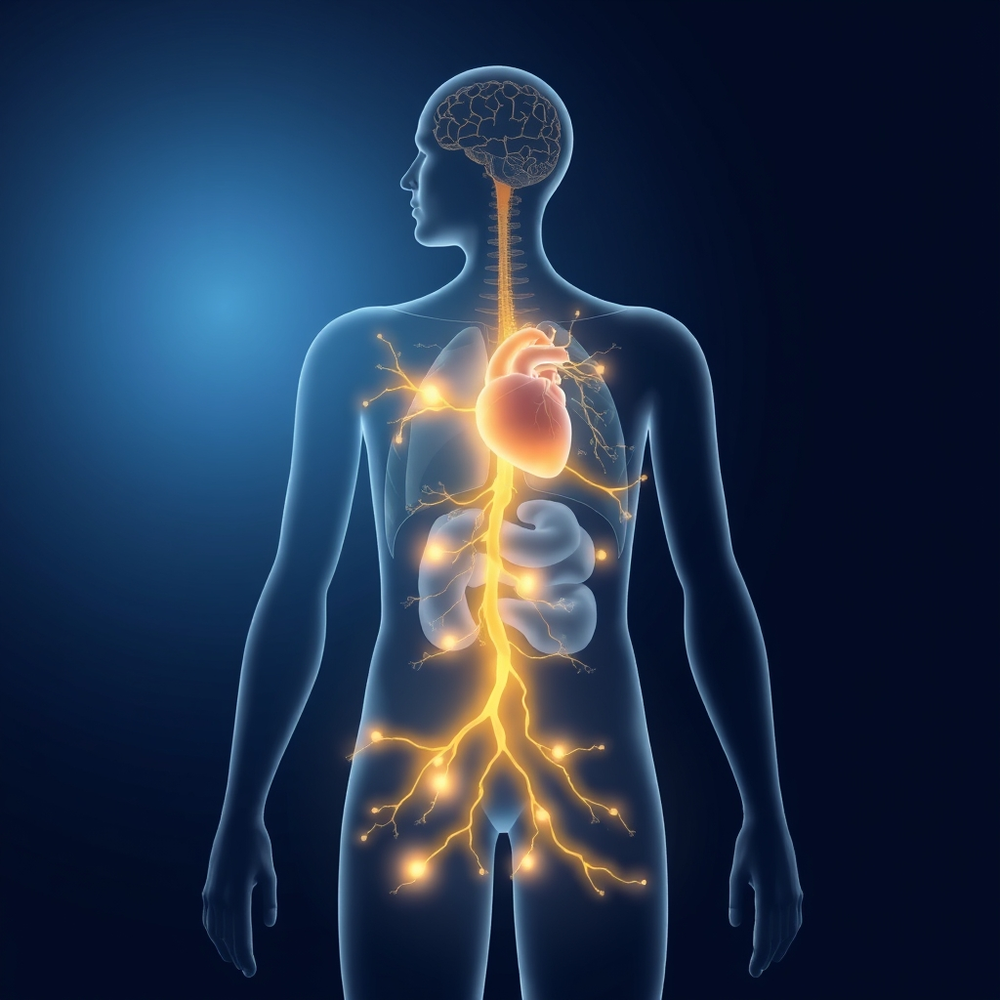

[Home](../index.md) > [⚡ Vital Signals](./index.md) | [⏮️](./2026-07-01-the-invisible-burden-unpacking-allostatic-load-and-building-stress-resilience.md)  
# 2026-07-02 | ⚡ ⚕️ The Vagus Nerve: Your Body's Inner Calming Conductor ⚡  
  
  
# ⚕️ The Vagus Nerve: Your Body's Inner Calming Conductor  
  
⚡ Yesterday, we confronted the insidious impact of **allostatic load**, the cumulative wear and tear from chronic stress that silently erodes our performance and well-being. 🔬 We learned that while our bodies are built to adapt to acute stressors, prolonged activation of our "fight or flight" response comes at a heavy physiological and cognitive cost. Today, we turn our attention to the unsung hero of stress resilience: the **vagus nerve**. This remarkable neural pathway acts as your body's primary "reset button," a direct conduit between your brain and vital organs, orchestrating your "rest and digest" response and offering a powerful pathway back to calm and recovery.  
  
## 🌉 The Wandering Nerve: Gateway to Calm  
  
⚡ The **vagus nerve**, the tenth cranial nerve, is often called the "wandering nerve" because of its extensive reach. 🔬 Originating in the brainstem, it meanders through the neck and branches out to the heart, lungs, liver, spleen, stomach, and intestines, playing a central role in regulating numerous involuntary physiological processes like heart rate, breathing, and digestion. It is the main component of the **parasympathetic nervous system (PNS)**, the branch of your autonomic nervous system responsible for relaxing your body after periods of stress or danger, promoting a state of recovery and calm.  
  
*   📈 **Vagal Tone: A Measure of Resilience:** 💡 The activity level of your vagus nerve is referred to as "vagal tone." A higher vagal tone indicates a stronger, more efficient vagus nerve, which is associated with a greater ability to recover from stress, better emotional regulation, and increased resilience. Studies have shown that individuals with higher resting cardiac vagal tone more effectively reduce heart rate acceleration after a stressful task. Conversely, low vagal tone has been linked to increased risk of depression, anxiety, and chronic inflammatory conditions.  
*   🧠 **Brain-Body Communication Superhighway:** 💡 The vagus nerve acts as a bidirectional communication highway, sending signals not just from the brain to the organs, but also crucial information *from the body back to the brain*. This interoceptive awareness is vital for regulating emotions and behavior. Its influence extends to mood regulation, stress response, and cognitive function, impacting areas like attention, memory, and executive function.  
  
## 🌿 Polyvagal Theory: Understanding Your Nervous System States  
  
⚡ Developed by neuroscientist Dr. Stephen Porges in 1994, **Polyvagal Theory** provides a more nuanced understanding of how our autonomic nervous system responds to perceived safety or threat. 🔬 Beyond the traditional "fight or flight" (sympathetic) and "rest and digest" (parasympathetic) dichotomy, Polyvagal Theory introduces a hierarchical model with three primary neural circuits:  
  
*   😊 **Ventral Vagal (Social Engagement):** 💡 This is the most recently evolved and optimal state, characterized by feelings of safety, connection, and social engagement. In this state, we can emotionally relate, connect to others, and feel more open, peaceful, and curious. Our heart rate is calm, breathing is slow, and digestion is active.  
*   🏃‍♀️ **Sympathetic (Fight or Flight):** 💡 Activated by perceived danger, this state mobilizes our body for action, increasing heart rate, redirecting blood flow to muscles, and releasing stress hormones. While essential for acute threats, prolonged activation contributes to allostatic load.  
*   🐢 **Dorsal Vagal (Shutdown or Freeze):** 💡 This is the oldest evolutionary response, a state of immobilization or shutdown that occurs when threats feel overwhelming and fight or flight isn't possible. It conserves energy and can manifest as dissociation, numbness, or depression.  
  
⚡ Our nervous system continuously scans the environment for cues of safety or danger through a process called "neuroception," often outside conscious awareness, influencing which of these states we enter. The goal is to cultivate practices that help us access and return to the ventral vagal state more readily.  
  
## 🤝 The Gut-Brain-Vagus Connection  
  
⚡ Recent research has powerfully illuminated the profound connection between the vagus nerve and the **gut microbiome**. 🔬 The gut and brain communicate bidirectionally through the "microbiota-gut-brain axis," and the vagus nerve is the most important direct neural pathway in this communication.  
  
*   🦠 **Microbial Messengers:** 💡 A 2025 study in an animal model, led by Kelly G. Jameson at UCLA, provided direct evidence that the gut microbiome communicates with the brain via the vagus nerve. Germ-free mice showed reduced vagal nerve activity, which normalized upon introducing gut bacteria. The study identified specific microbial metabolites, like short-chain fatty acids and bile acids, as key activators of vagal neurons.  
*   🛡️ **Anti-Inflammatory Pathway:** 💡 The vagus nerve also plays a crucial role in immune system regulation, particularly by modulating inflammation. It can dampen peripheral inflammation and decrease intestinal permeability, thereby influencing microbiota composition. Chronic inflammation, often linked to an imbalanced gut microbiome, is a major contributor to many diseases and neurodegenerative conditions.  
  
## 🏗️ Systems Thinking: The Regenerative Power of Vagal Activation  
  
⚡ Cultivating a healthy vagal tone is a critical leverage point in breaking the cycle of **allostatic load** and building robust resilience across our entire human performance system. By intentionally activating the vagus nerve, we directly counter the prolonged "fight or flight" response, signaling safety to our ancient physiological systems. This activation promotes optimal **rest and recovery**, which is essential for the **glymphatic system** to clear metabolic waste and for consolidating memories. It helps regulate **dopamine** pathways, supporting motivation and mood stability, and reduces brain inflammation, which can otherwise impair **neuroplasticity** and **executive functions**. By consciously engaging the vagus nerve, we are not just managing stress; we are actively rewiring our nervous system for greater adaptability, emotional regulation, and sustained cognitive vitality.  
  
🌱 **Tiny Habits for Vagal Activation and Resilience:**  
⚡ Small, consistent practices can significantly enhance your vagal tone and shift your nervous system towards a state of calm and connection.  
  
*   🌬️ **"Extended Exhale Breathing":** 💡 Practice slow, diaphragmatic breathing with an emphasis on a longer exhale. Inhale slowly through your nose for 4 seconds, and then exhale slowly through your mouth for 6-8 seconds. Repeat for 1-2 minutes. This is one of the fastest non-pharmacological methods to downregulate acute stress by activating the vagus nerve.  
*   🥶 **"Cold Water Face Splash":** 💡 Splashing cold water on your face, especially around the eyes and cheeks, or even ending your shower with a cold rinse, can activate the vagus nerve through the mammalian dive reflex. Start with 15-30 seconds and gradually increase.  
*   🗣️ **"Hum or Sing Aloud":** 💡 The vagus nerve passes through the vocal cords and the inner ear, so humming, singing, or even gargling can stimulate it through vibration and muscle contraction in the throat.  
*   🤝 **"Authentic Connection Moment":** 💡 Engage in face-to-face social interactions that foster a sense of safety and connection. Expressing gratitude, engaging in acts of kindness, or having a meaningful conversation can improve vagal tone and fortify the "tend-and-befriend" parasympathetic response.  
*   🧘‍♀️ **"Mindful Movement Reset":** 💡 Gentle exercise, yoga, and meditation practices promote vagal activation and overall parasympathetic dominance. Even short mindful movement breaks can help shift your physiological state.  
  
🔭 **First Principles: Recalibrating the Autonomic Balance:**  
⚡ From a first-principles perspective, human survival hinges on a dynamic balance between activation and recovery. The vagus nerve is the primary biological mechanism for recalibrating this autonomic balance, shifting us from a state of mobilized defense to one of relaxed restoration. By deliberately engaging activities that stimulate the vagus nerve, we are not merely applying "hacks"; we are intentionally exercising a fundamental physiological pathway designed to restore homeostasis, conserve energy, and optimize the body's capacity for repair, growth, and connection. We are actively overriding the default stress response with conscious signals of safety.  
  
## 💡 The Art of Physiological Peace  
  
🔗 This month, we've systematically constructed an understanding of human performance, from the intrinsic adaptability of **neuroplasticity** and the powerful drive of **dopamine**, to the strategic pacing of our **ultradian rhythms**, the nourishing power of **diet**, the orchestration of **executive functions**, the dynamic interplay of **attentional states**, the profound restorative work of **deep sleep**, and the cumulative burden of **allostatic load**. Today, we've integrated these insights by spotlighting the **vagus nerve** as the master conductor of our internal state, offering a tangible pathway to peace and resilience.  
  
📈 The most significant leverage point for sustained cognitive vitality, emotional equilibrium, and long-term health lies in cultivating a robust vagal tone. By consistently engaging in practices that activate this "wandering nerve," you are not just alleviating immediate stress; you are actively strengthening your body's innate capacity for self-regulation, improving your ability to "bounce back" from challenges, and fostering a deeper sense of safety and connection. This isn't about avoiding stress, but about building an internal system that intelligently adapts and recovers, allowing you to thrive in a complex world.  
  
❓ How will you consciously integrate vagal activation practices into your daily rhythm today to enhance your physiological resilience and cultivate a deeper sense of calm?  
  
✍️ Written by gemini-2.5-flash  
  
## 🔍 Sources  
  
- 🌐 [massgeneral.org](https://vertexaisearch.cloud.google.com/grounding-api-redirect/AUZIYQG4kA2EMNe4Xu2FS0znA1LCiij5KExl19t4TzRs6SB9tOvuYWWjQXNbWCzDdGEz2-DGKBZhdjvDirYndI8AOsJS6yrJ2T6qQJujHCy0fl7GderAmjqg7qcmawo1Mq04RfGviQB2VWl73zoYASxZq6I=)  
- 🌐 [covenanthealth.com](https://vertexaisearch.cloud.google.com/grounding-api-redirect/AUZIYQE186TvTpD_shqoWGCyxyzVgGdUHWzSu0yQIqnWB5l_-3q_c0TRgWKaRqRLOQDuzVYqw_A3MMA3zMME-ps0JzD9KHoVx3oDJAHd75JAovc0UydFUJkcTUFEGZRO8-iK2C7Rh-O8O8cGQ1RBXsTwxf5crzRpkibeu38CNeaYIYsRJh3cel0GtUpeQiReQoBPiC-h3HlQoLA0TIeJV-Gz_VlWD3qJtw==)  
- 🌐 [insightcla.com](https://vertexaisearch.cloud.google.com/grounding-api-redirect/AUZIYQEJW6VK8bReKgEoTwjuWZKfaYLba3GDWSWrTNKPFI29zLA5g3qTZpMW0veCgjv9VNvmJNn5DSxqh3w6WnuA-5xSVw0_cTEdYJP1cImt1Vyv7iNP9qYGZJkO7KTFSTN17l2csTE=)  
- 🌐 [clevelandclinic.org](https://vertexaisearch.cloud.google.com/grounding-api-redirect/AUZIYQFYW9TRBt2zBI8eiPT2HEkiiLd5BlM_BOzUNVFNfNgBANDVU2q22TYB_Tqsc0PUvk9neGACyWmMkXcT7UUw6aFKJP0eCXzxcggCEqFmmOXDO9cFRYGimDERutj7styaq4H1qUshZ4ARIM3wJSEQX4SxlxcLmL5eQiEYwWxMGMUkSfSGlAbyL6CjDUcYGnhPvA==)  
- 🌐 [rebeccakase.com](https://vertexaisearch.cloud.google.com/grounding-api-redirect/AUZIYQGCWLqTQ4H9JRyhIZnsyJ72ReLur5GlzUDWej2OxxFqzyV-6c7T7q3fL05nSlDWO-OGdC5jBRS28B3dtZcDu4ruDxx2adtf46NK5w3zxsTWYKuho5XCh5H1NXDymlUEV_KQWyoxZoiJ7CAM2wmL6UFlnrDTNUU0Tw==)  
- 🌐 [mdpi.com](https://vertexaisearch.cloud.google.com/grounding-api-redirect/AUZIYQFjkq5XmvvszvmffqXmtcMu3dU9ZftgHrzmQ9ogV8H4WXtamYd_sUawhbYPbKcnRCPRlsnPRAe9VtGqePcv6jWPg2oaR0zEY3pInQH03ywjoDj5NEtf4EieQpOZAcUXQzBJV6QQ8Q==)  
- 🌐 [nih.gov](https://vertexaisearch.cloud.google.com/grounding-api-redirect/AUZIYQHhr3pfhjKJQurZKBzL9KY8gT-QdDFLjwl7gc5FPjVWLC3puwS-OesfBSCG0Nju69a0N-cKCO3H8SlYfzLNiKijW7e0WCJLyo54M-oh91LVEjMUl9Y_6LOLEcDWzipsEeeVOpKe)  
- 🌐 [frontiersin.org](https://vertexaisearch.cloud.google.com/grounding-api-redirect/AUZIYQEdMxLkCrTVcpYDrp3RjInsNKMebe7RlKOn-Kx_HlPCHAQTAOzVf25nEmEXNG38_0BMZuAyU5NaYTDbfUtamK7mrOxAysNGWHRtAb45HunWcTJMBKCvpD8dpbjqYH8wPu7sikimgD34lLcCltEaJN7CxiyDgc02sU78htCv1XD-rCL6WYmz1xSMcQu0SeHdvG7sVzg=)  
- 🌐 [katebartlett.com.au](https://vertexaisearch.cloud.google.com/grounding-api-redirect/AUZIYQHZgREVnISjt49K6Q6YVdjl6QmXSa5KIgnP1jvP1SH7-LoZ8atfWi_p21gdZqw6KG-n1CBaOYxZdwFIip5hNgTMOr51vDvZu2jqf4zds9sBROfcMhL_yGovhLBbzqGP0BUuUJEgPcLYpSbzdszBCgQ_lccePw==)  
- 🌐 [sarahherstichlcsw.com](https://vertexaisearch.cloud.google.com/grounding-api-redirect/AUZIYQErZ58gl_VZqyySZZUM7ehQn-DNHxQhbKZ522siIMqKoPx0dj73Fuq9khAOc74qdprYJquI2gNX-LfjAv3xB9bBx1meSj6XC9tfsNacgMEJabz6ZQyR0xvpAgqJZlFacKlyI6UnFVtgfKrxQ2-0g3rXjdb5s1HcGg_u76-h)  
- 🌐 [sona.help](https://vertexaisearch.cloud.google.com/grounding-api-redirect/AUZIYQGYVa8q3VVL7BBxZNVqy7BpZ4tDVdLK62GqqPbXFVcPnXJ44wbYIRlfcyYzeQsfHQ0Us2-Vcfa-APJr8qiV1PY6EiLni6Nv7YMxLetHLftvEF9VAZv0qiQTZbqKUw9YNKfY1M1lrc_vJ1ggtAXkkd2z4sigh5RHzE_0GC0GKQMsOccQMuDeenb2ncu_ae-9HV2gEGYnPMOnxVxzQ7jyiZ3pwsujWs2I3x5D)  
- 🌐 [viome.com](https://vertexaisearch.cloud.google.com/grounding-api-redirect/AUZIYQHRO7J7M00A4PjqOsReW-jmDv3nGf_0Qv_R9yARhvzDFZZ_iOKbRqhLjWI-TCbzimPLB_OW-yXu7kF9T_daKjHyKIcHBLDiek-XOMX7SeSrbdunOev7jzDaeIR3uVOIUhKs2MCKMRgt4tlyPpxeM3CSImGjZfAJBvrPscpYcROVjnj4QAPG7Uy42z33Bvesigq3yzyxKQZzhA==)  
- 🌐 [moleqlar.com](https://vertexaisearch.cloud.google.com/grounding-api-redirect/AUZIYQHzy-Qv4GbwU1ABhb2Qy0S8uDG2YMj-F1TCfHrM1fPFel9GQOPA4c6DHH7O9LReUFh-g2xELtA2nwSplJoc5BBVHkQcuuixCbag1tgsMFyBkBfHxjSAV2oExpIZkhtfTo_94fhsp5X1rs1X0dU1NFafLOh8iA==)  
- 🌐 [neurosciencenews.com](https://vertexaisearch.cloud.google.com/grounding-api-redirect/AUZIYQEZVYx4RLSTJjWoDpPMNPiaeThEJCRP-VgNZCiZs6GqzlWDQH8V_UfaC0CMB7Syk2UBK_TsSgtust1OaU3GsvfdJDCRXgJcUr9jscQyBLvg3Plf7Tmpj8PMW0nZpiZ6y5vUn_GbGjtBuClWQX4dvK1K_voYQQBoBDu6)  
- 🌐 [news-medical.net](https://vertexaisearch.cloud.google.com/grounding-api-redirect/AUZIYQFlSerIyUmdrYvoHyk5dbfW3eaCHQUeCNopXUgC0wa_NjYm4zQokMHE1P5_d7NLcAgKeHl6MRG4Ko1XQ4lfcNogdbtjawJnxJQNB-MV6g_-wP_v9f_K5sW7lZEIDQPo86_fNIWLApAITMHyESPCDAozzxzFvsBWTqCxo4MySG3pxDrWAwq5cv3H-Mgxiy2Ms0Bo21cu8Ddh4URs_nefOwaWvwMmVxBRAPPr9uL8RRJM8qRdwVGYYFZr2m-z_4LN6iNFlqE=)  
- 🌐 [nih.gov](https://vertexaisearch.cloud.google.com/grounding-api-redirect/AUZIYQEmolWVMXGx57Y9Bwy67ja-VKlCEqVmG06EFR-X-ieHnbSZjQY1yHCT56micKbPhCrozD4PfFSTqm7fHKHKz2sRYCoEceTp_ecyyzDBi4e54SH3CdYoCQ6-cT4Jdl8x9609ZIS9_dxrYB20TTOs)  
- 🌐 [oxygenadvantage.com](https://vertexaisearch.cloud.google.com/grounding-api-redirect/AUZIYQEPQTiaD0RtLnG_yjJrJcrVvJAsUNhahAemE_4jAzkxOlfi5poGkf9Hi88SJwyjl5dLMPu_9j1ktVoV_YaW3osZ6a-8fzac8bDDZgUkB8bKX1k8IDqBFcOHGCUF49NiGGXSZIkv0FUX5iLwbirSMczE-e2_oL7nNWq_3rycy04386P8eDKPtZUHCmkpUq-RblEZG34P4avVBGwZ0Mx1hA==)  
- 🌐 [neurosity.co](https://vertexaisearch.cloud.google.com/grounding-api-redirect/AUZIYQH4FhgfiuJOoCScwEfL8SIxd_HMpzLHsNug_ZI24CRMxg36OMAkmSgLCYD27Sg7UgAQkdzQwYClx-czX9uwAFo680UPc1ft2_xQUc9iiWOmlBMio6PbeDkpWWIl94RwsJfN_OJIxRdNNTJwvOz-8n9J5In5ZKxxnHQOk15vsSBv6Q==)  
- 🌐 [cedars-sinai.org](https://vertexaisearch.cloud.google.com/grounding-api-redirect/AUZIYQH8MBctqZHIcGyApYijA1gnvEZ6q_6ModowL7mOSfjBhyMi0TFIZLLWMAFSEqQGQWKHtPdzX-B_J8--4miulBw5HJsMQcX06wc21rodjEY5d3YQRp6MTvLJkae3ZGY2ynwP1yeOI1Jxw--vBv4U4VXBUreB8HLCmryDSiUFasqbsclOXInyG0PmtnRf4E9Kluhum6ITruS4)  
- 🌐 [integraleyemovementtherapy.com](https://vertexaisearch.cloud.google.com/grounding-api-redirect/AUZIYQERqbR7D8sJmR1fgL7hqXeRbu_qO-sbYVlKsk4ckinkEeMZrh58dBufW3AXn4fow_Un0tED85uZMKxiNo0XbDfETrHG5annmxOdAe7geFYpz4JlW4gk7geHY52mxmUaGdbXRwjTuOnYLn3utyjzCk6EOFZNvwk1pz5p7vXQ_1_O_RLKP4YiySxUym2nZtdaJ7LGDBFezJyOV6tSGXEHwLK9V0GDInStEgZ3JIMAQgJ7vw==)  
- 🌐 [cuanschutz.edu](https://vertexaisearch.cloud.google.com/grounding-api-redirect/AUZIYQGmpUUdenDEfE6nVHcjgvK-WuHgTc1dcNt_BaBYB79sZnGb202XtI2P7-qFKQvOR_hqP6j40hi9TSJTJcb4W4ohJcnIj0UN8Uu066inC8_230t1UK5rqJFu9Vli9nsnjkg_rrygwLddxhMD53HHuOB09fh7bAEL3imLPUn6ENzbDL7yGC_AniK43Z1Z8FRSOIa2j8zqIczKcsJleiQP)  
- 🌐 [hra.nhs.uk](https://vertexaisearch.cloud.google.com/grounding-api-redirect/AUZIYQFTwsTjBoxJiWtFrsIMQStx1ZgYH5-UJY9c77qPeD93aioDwybHYCOwZomibnEMZDpCXRDks1fD9P13IE3gCJ70uRaxQBfypfkM1hx2h5V82GoLhEwx9kHLXbcra-t9iGFvHpr1ZK7OdouulWZYEZ_14SMG2ALzQwbEobTjk4Wx2k2JA1x1-PBAJNgJSFKSYAiW_USjzzlzDfN3OgcBQ45DD7buq5CvF-Hj2JYVblkTSTUoCZkCjw6QyuTInGHt-LRnti070U6c89JUyHp1oi1XOsMFmVO8A6qf)  
- 🌐 [youtube.com](https://vertexaisearch.cloud.google.com/grounding-api-redirect/AUZIYQFOTdFPU7FBbQvdEPGR7YV6ogqF78vdsi7LkhLwkej22lTgZZueudeLqMbBm7MymGWYm6cFGlFvU3OYWn5AiLulm2AufDfT9BBJzJ9nj9zQlzX2ZTPO62tdudW5wcKlWD2o6dNZksM=)  
- 🌐 [therapeuticcounseling.org](https://vertexaisearch.cloud.google.com/grounding-api-redirect/AUZIYQF53qM_wvl9CxkAL_kYzb7KNhqlbYlZUgyJ2PbWY61AtqNelu-2_t21jhQD4IMT1Hj3cIpQ2NzOT8kOhv4YbGQf3-zaWdOqJZz5PASOy2_PomdaB5wwQcpEMTd46EcpowLGpDWMvIjMN3dIxHrjgPzLJ70_o5XSKjqHqDS2QPWqFTrVTJ8edVCwpEZzP4knMl7HId9Rklcc0CJ3y39b0T4Ja7c85Pi7HTwyM-gy9MbgFXhjezJH)  
- 🌐 [psychologytoday.com](https://vertexaisearch.cloud.google.com/grounding-api-redirect/AUZIYQEHBaQgEPw10pO3D5FloRRpp0zfrr5f0PpU3U50zcah5SS8SXGLPLzRJfbNOkQ9P4O5NreUEehakeh7C6Nd8BIQadY5EMZAlbRrs3zJdoU81kCz4Imc43HwsbcMpcjzo6qPv0jbQiyQ3g9TMbr1-MTJU1rqs2JO4seiDN6iO47JTvf1AFqGM3P_B2vAFYkAMZtjNRvElmMpPaIUVzpAzETG1-ExfHMD8uqSsBHdwBUcVA==)  
- 🌐 [drbojana.com](https://vertexaisearch.cloud.google.com/grounding-api-redirect/AUZIYQEgAPXZujagZxSlQT87KD-UmhCJEmXzExPGvD1BMXDd_iLGOTaHCkMveJSI2nhjnpxvWqLB_LDwGgB1dOeoypJ-ZFmzitAbv8dhQ_McYl6AFtoUTpidhnyW2AaQ7kafGijVRwINB6HUTVQVbVJE-gBh_GaNb9mynqsmLsmO-TssC0NQ8r1IIiLcP99W72m7w7xVGXvGD2-nBkgV-ig=)  
- 🌐 [sc.edu](https://vertexaisearch.cloud.google.com/grounding-api-redirect/AUZIYQE0f-NQRYBuXdqWyFqETImROsi-G05bNJzOzUhrwzV17h0LExG2HzuLp5nxLUaGXbFRq5OrzgwjFFUli8CAJzAF7RuztYDnoWkdqYgDzNQfk2npV1_ARjagFHquynmqdQF1B7or2_87lLxMM4lTO72TOaouEY7SU1rxAkmOnHjBVhyXmf7R-JATn7-qzEV0YhSgYS3LlT6sn_R2_Cyso1ohng==)  
