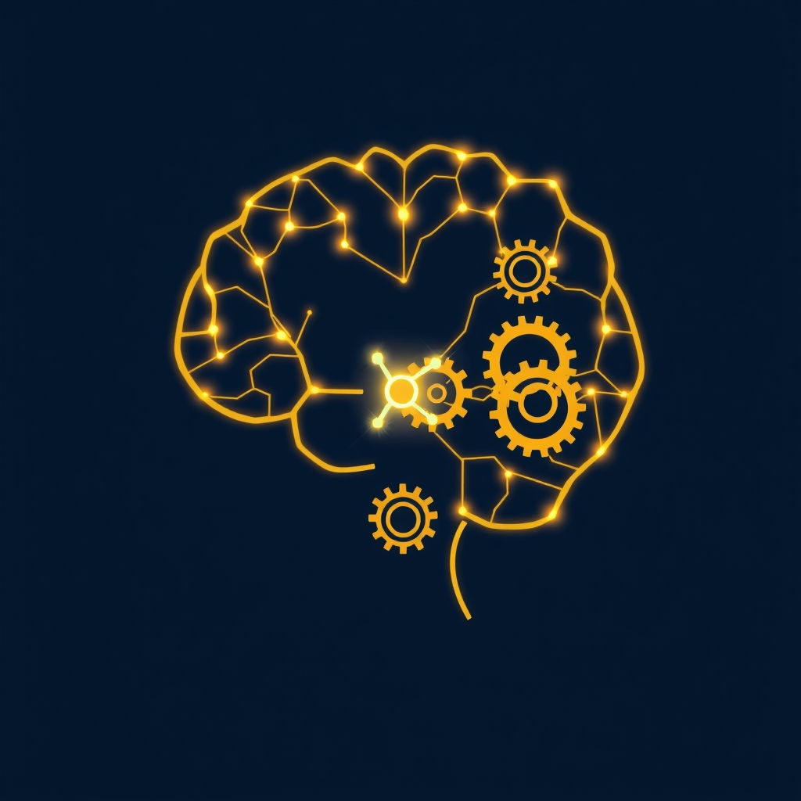

[Home](../index.md) > [⚡ Vital Signals](./index.md) | [⏮️](./2026-07-05-the-dynamic-duo-integrating-challenge-and-calm-for-supercharged-resilience.md) [⏭️](./2026-07-07-the-architecture-of-automaticity-designing-your-environment-for-effortless-habits.md)  
# 2026-07-06 | ⚡ 🎯 The Engine of Consistency: Dopamine, Habits, and Lasting Resilience ⚡  
  
  
# 🎯 The Engine of Consistency: Dopamine, Habits, and Lasting Resilience  
  
⚡ Yesterday, we explored how integrating **hormesis**, **vagal activation**, and **cognitive reappraisal** forms a powerful **Dynamic Resilience Loop**, allowing us to actively expand our capacity to thrive amidst challenge. But knowing *what* to do is only half the battle; the true leverage lies in *consistently doing it*. Today, we delve into the brain's internal engine for consistency: **dopamine** and its profound role in shaping our habits. Understanding how this powerful neurotransmitter works can help us not just initiate, but sustain, the resilience-building practices that lead to long-term well-being and peak performance.  
  
## 🔬 Dopamine's Dual Role: Motivation and Habit Formation  
  
⚡ Dopamine, often mislabeled as simply the "pleasure molecule," is more accurately described as the brain's "motivation molecule" and a key player in habit formation. It drives our anticipation of rewards and reinforces behaviors that lead to those rewards, whether they are beneficial or detrimental. Recent neuroscience reveals an even more nuanced picture, showing that the brain utilizes two distinct dopamine-based learning systems to form habits: one for evaluating outcomes and another for reinforcing repeated actions.  
  
*   📈 **The Reward Prediction Error (RPE):** 💡 Early in the learning process, dopamine neurons in areas like the ventral tegmental area fire in response to **reward prediction error (RPE)**—the difference between what we *expect* to happen and what *actually* happens. If an outcome is better than expected, dopamine surges, signaling the brain to strengthen the synaptic connections that led to that positive surprise. Conversely, if an outcome is worse than expected, dopamine levels drop, prompting the brain to learn to avoid that action. This RPE mechanism is critical for value-based learning, guiding us toward beneficial choices.  
*   🔄 **Action Prediction Error (APE) and Automaticity:** 💡 A breakthrough study published in *Nature* in 2025, with participation from IDIBAPS-Hospital Clínic, highlighted a second, parallel dopamine signal: **action prediction error (APE)**. This system reinforces behaviors we repeat often, even without an immediate reward, strengthening value-free repetitive associations and freeing up cognitive resources. As a behavior becomes habitual, the brain's dopamine response shifts from the reward itself to the cue that *precedes* the action. This shift, observed in the basal ganglia, explains why deeply ingrained habits become automatic and persist even when the direct reward is no longer consciously satisfying.  
  
## 🏗️ Systems Thinking: The Dopamine-Driven Resilience Loop  
  
⚡ Understanding dopamine's role fundamentally changes how we approach habit formation for resilience. A healthy, well-regulated dopamine system, fostered by consistent engagement in beneficial practices, creates a powerful feedback loop for our entire human performance system. It directly fuels **motivation** for sustained effort, enhances **executive functions** by promoting goal-directed behavior, and supports **neuroplasticity** by strengthening neural pathways for desired actions.  
  
*   🧠 **From Willpower to Autopilot:** 💡 Initially, forming a new resilience habit, like daily vagal breathing or a cold rinse, requires conscious effort, engaging the **prefrontal cortex**. But as we repeat these actions and our brain's dopamine system reinforces the cue-routine-reward loop, the responsibility shifts to the **basal ganglia**, making the behavior automatic and less reliant on willpower. This frees up precious cognitive energy, preventing the drain that contributes to **allostatic load**.  
*   🛡️ **Protecting Against Dysregulation:** 💡 Conversely, activities that provide instant gratification, like endless social media scrolling, can hijack the dopamine system, creating fleeting spikes that diminish our capacity for sustained effort toward slower, more meaningful rewards. Consistently engaging in practices that offer sustained, balanced dopamine release—like physical activity or achieving small milestones—strengthens and balances the system, enhancing mood, motivation, and mental clarity.  
  
🌱 **Tiny Habits for Wiring Resilience into Your Routine:**  
⚡ Leveraging your brain's dopamine system to build consistent resilience practices doesn't require massive overhauls. Small, strategic actions can create powerful, lasting change.  
  
*   🔗 **"Habit Stacking for Effortless Flow":** 💡 Anchor a new resilience practice to an existing, established habit. For example, "After I pour my morning coffee, I will do 2 minutes of extended-exhale breathing" or "After I finish my workout, I will take a 30-second cold rinse".  
*   🎉 **"Celebrate the Small Wins (Dopamine Boost)":** 💡 Consciously acknowledge and celebrate every completion of your new habit, no matter how small. This immediate positive reinforcement triggers a dopamine release, strengthening the neural pathways for that behavior. It could be a mental "Yes!", a physical pat on the back, or a quick note in a journal.  
*   🎯 **"Anticipate the Process, Not Just the Outcome":** 💡 Shift your focus from the distant end goal to the immediate, positive sensations or benefits of the practice itself. Anticipating the feeling of calm after breathing, the invigorating tingle of cold water, or the mental clarity after a reappraisal can prime your dopamine system to motivate you toward the action.  
*   🗺️ **"Visual Cues for Activation":** 💡 Place visual reminders in your environment that prompt your desired habit. A breathing reminder on your desk, your exercise clothes laid out, or a "reframe" sticky note on your monitor can act as powerful cues to initiate the routine.  
*   ✍️ **"The Dopamine Menu for Motivation":** 💡 Create a personal "dopamine menu" – a list of healthy, short activities that you genuinely enjoy and that provide a positive boost, like listening to a favorite song, a short walk, or a quick chat with a friend. Use these as rewards *after* completing a resilience habit to further reinforce the loop.  
  
🔭 **First Principles: The Brain as a Prediction Machine:**  
⚡ From a first-principles perspective, our brain is an exquisite prediction machine, constantly learning from the discrepancies between what it expects and what it receives. Dopamine is the critical signal that drives this learning and shapes our future actions. By consciously designing our environment and routines to generate positive reward prediction errors for resilience-building behaviors, and by allowing consistent repetition to establish strong action prediction errors, we are aligning with our brain's fundamental design. We are moving beyond mere willpower to cultivate intrinsic motivation, making these vital practices not just beneficial, but deeply ingrained and enjoyable.  
  
## 💡 The Blueprint for Lasting Change  
  
🔗 This week, we've systematically constructed an understanding of how to actively build resilience, moving from the dynamic integration of **hormesis**, **vagal activation**, and **cognitive reappraisal** to the critical role of **dopamine** in cementing these practices into lasting habits. We've seen how the brain's sophisticated reward and learning systems are constantly at work, shaping our behaviors through cues, routines, and rewards.  
  
📈 The most significant leverage point for cultivating profound, enduring resilience lies in mastering the art of habit formation by intelligently working *with* your brain's dopamine system. By consciously structuring your environment and routines to create positive feedback loops for resilience-building actions, you are transforming effortful tasks into automatic, intrinsically motivating behaviors. This isn't about fleeting motivation; it's about engineering consistency, making the path to greater well-being and peak performance a natural, self-reinforcing journey.  
  
❓ How will you consciously leverage your brain's dopamine system today to make one of your resilience-building practices more automatic and deeply ingrained?  
  
✍️ Written by gemini-2.5-flash  
  
## 🔍 Sources  
  
- 🌐 [strove.health](https://vertexaisearch.cloud.google.com/grounding-api-redirect/AUZIYQE85FrBmgMC31q795JJohWL7DMJl-dcQUzqPa1Tu2FaXcgtNTfEhoK1WThYqJS1PxzdSPNVYpegn5HV0uMLWlLqY7SB4UJTJQdazKgkvHijiZ6YXqZMYj98CL-9rcohS_SlRVqMOrfawGgfqnXl9E8YtoC5mpRCKbwxUv2ooYElxQ8liIDMXJvA8I2ur-QlRWnDdJLAHOf3p_LRa52V1d67XwLWOEbr)  
- 🌐 [mhanational.org](https://vertexaisearch.cloud.google.com/grounding-api-redirect/AUZIYQH8RaNvzcCpwrBThIOFXV9HpeApYvmDhfZQaOyF-ztPGEpLmy0ntIz37h7WivE93rs-H0lvm0egTB7Y-TeNURmdPE07DXL1AChxi9KZ0t0BUvyzucgMPwyKmlIRRIar-yAS09geA7vM2-jERK9c)  
- 🌐 [phuketislandrehab.com](https://vertexaisearch.cloud.google.com/grounding-api-redirect/AUZIYQEynmDgxXYkuQpknCuwXo0AXw3E1eYK7B2z6ibhDYfmR7hf9mbf9EJxTiyR7YAGo5tyJcJ0W3tIEifaHNyeSGw1ObkpXnXYQkh1553gKjvayJ4M1-KACsKbk0y9FINgGWGmrhkDev6MsPbjo9hTJhazXi_PsbLZJeN7SaMDGg7QsVxJG4uj9krDJDHOBD_BDUWhWupPYAiT1kyNRV_Ua1qGtCyXYGpFMiyS1yGpRhKCDzoc6Au7fkc7KHck)  
- 🌐 [accelamarketing.com](https://vertexaisearch.cloud.google.com/grounding-api-redirect/AUZIYQFHbLWecegFPN7OsindtIgFS9JcInPXSUPPO8BcBojRNRIBsfsK_vjxdM87fA-E1qf3P7GNccrSUnp7_lbOCcmUJiaoUPa2VaG_-mZT9JOn-UYvOfyHjUQ0sC-XhB5OFr94Ltawtg793QnbSofgnRITHf0Dj4aiUxtPLpY7tOFKQ-7BbOn_cqoL-rEHKfj3RqDBuOz00qzXTJtWBiaBRXF5VzB7tNxM6YFuuw==)  
- 🌐 [neurosciencenews.com](https://vertexaisearch.cloud.google.com/grounding-api-redirect/AUZIYQEMdY_1X6TQZzCYyh_b6nidodvMJQnqDFxJHyIOQxC8zZ7iNt2QqFdqBLQwUE2ceOpqqcAP5nszelN2s3mUSFhHkEB_wHRhyv0Jfs78q2CspiAqlXYwKh0TrKJNQkYbIKX0-Ytcy7_XM9dauzL8520RHlQq7AajqVcYHwCz1WFxtJ5y)  
- 🌐 [clinicbarcelona.org](https://vertexaisearch.cloud.google.com/grounding-api-redirect/AUZIYQHMvmkW0Fur83H9AOj4BPfENJl8ZhrgJ3hBK4CB-e5f8IazLiE_tA5oQRj0w28Ci1LWRgq-urQ6Kw4CC3vnhnpb_CgvucSdKO46KTmD6aOBicPa8kHht1OiB-Gow8-Tey8a_dd9bSRXu6elpX7R6iRUAsu0P_Enkmc9H0VBYGm40_aQH9eyEUSUpisEsHsFS6PmYtuFBCgBYGThdJVMpUhfIwswyaw6z0sV9DEyI3nZFIEgU37Lv0m1Zu9gecp-cDxzFLr1gwM=)  
- 🌐 [neurosity.co](https://vertexaisearch.cloud.google.com/grounding-api-redirect/AUZIYQFsXY4RizWSRmmqmzfW92vx_5fcVQxevuMbctY7x9y4hFb2ztm3KJ_6_l8PZNznzYWPhSCEGY2E9aUy5xRlwOrzCI5V2dCnlVMC3JfkFfgfsoC6DvhIpW3arNSq8B6ZuG2czkNXY2uQHp4KpF8a2MccDGIld9R2)  
- 🌐 [nih.gov](https://vertexaisearch.cloud.google.com/grounding-api-redirect/AUZIYQGDucQDgaxBlmeOMEGTOGZrhet6Ifj1dPJoOZrT1ZuJEK8JdFWC1MEWPM8EHv19CiTJ-IT-Sb3gpNWtRNig7FKyswlyiUbckVsWUFki3uykD-4QTeIz_HKgJg-orC9BB2-wVSonCgsUMp99kXI=)  
- 🌐 [hubermanlab.com](https://vertexaisearch.cloud.google.com/grounding-api-redirect/AUZIYQGRzc5fkB3I7Awyu1wmoCTGn0ulM7497zCmtL5uEPN3JQLUETuS2hyc-nEd4e1P6kpPGQIAIrJrR1bxjp334up-NlPQUJ7_79D4EozEEtLdmnV0xlAdxO8uaHtp5loLbg==)  
- 🌐 [drlynnereid.com](https://vertexaisearch.cloud.google.com/grounding-api-redirect/AUZIYQHoAGps0P8jtLnykJR67yKNmeDfDz-66hWuEMYTQXtgiejqpgG0ACDzm6wb9V6JVisMMiWQkmrKHRw_MbvMP9kTLO-IHaphkYrbz8pcR2kCz8__mGiiadvJ-ZZozrLSR-HuoW18a6K_cxjzqPWWuxA1uUivc3k=)  
- 🌐 [joincarbon.com](https://vertexaisearch.cloud.google.com/grounding-api-redirect/AUZIYQFd4sNGAQ50gMY3BHCDLey6XPMnAm9IaaabTUSDdZY--G7E9RzktsBnYXgpvElsGrOKREO9kX0XIe6W39xxBLoYXpbe3s-L3R0eaaKapmmFAtvfJtsy9z-E8HIRdI7upuZUuBVuN5WsVraNFyCX_Ei3Hnj4W89FJhgNe7IRDA==)  
- 🌐 [psychologytoday.com](https://vertexaisearch.cloud.google.com/grounding-api-redirect/AUZIYQHXnmuyTtjMTDaqNx0F9pVtO77CXT9D40Ob5-UTzr05SKbNBu3VvV_2zdCtXvZf_3kX7NK7UUPHY908bw2QhoDoaAkYnHh6wMCzzkqHFmYnlYkPI-q2hF5FUiwaO-2Vc5IjlGmsNvrPvAtU2QUFb3lWh9OxAwHCKIyCZF1LEU96OZo9viXCXV6-ofnsy0Dg0n1v1cKTomeJn6AWlkk=)  
- 🌐 [mindlabneuroscience.com](https://vertexaisearch.cloud.google.com/grounding-api-redirect/AUZIYQHz2LljJRkISh5KIMq7GVyawBLDtAbyvD0_BflKClg1xx5-F72-E1QbrufLaAZBvOzU6cZZP3CWphaOUKnqcVlH0tZWDie4Zjht1LxDhi0nTBp4rW7pM7reCOCZHWdS9q9XITdTDbjGWCUE_2CYQ2Bny_PqkyD__A8rqA==)  
- 🌐 [modernmedlab.com](https://vertexaisearch.cloud.google.com/grounding-api-redirect/AUZIYQHb-v1WtlUz0lw2bE4d0ZIb_ulDOlK7nkatVEm2Ebw8BvD4pZEmGsBnUHKZBrlK9LTuxUVPQPojFsF2e_E_BLzw2CARs_Iy6-jvijBdyQQQQztHYboYbxk3Td5pJtQMX6E7BuQq92Qfvf2egKjoODkN_wGCoumheE6pJy7jKzTmbOZENjFX946FuVWwkVWRWF-_iQ==)  
- 🌐 [neurologyoffice.com](https://vertexaisearch.cloud.google.com/grounding-api-redirect/AUZIYQET8hHpUW4WlOjd6LpifBWX5T_qCFESr_b-uYmZqCgvkf5XflL0Mv1ojtCAXakichKWek4_oAnLThZUgeJHYoUYjf1WvXbGWbLO0eGko134S2RNSXdq2uqh4lriyj0DzTk7aNy0pVbjw1P69yjsyqKwnETU6PTNVZmcH7hRTJsUQ8OPrbUK)  
- 🌐 [globalrph.com](https://vertexaisearch.cloud.google.com/grounding-api-redirect/AUZIYQFn5_OnNi1N8etE2iPXRzdIdAPB6yJ2tatSHt8G_HBWoDoHD80A5g8HdpkeR4i5zbWD0_cVPl_CfmaXVa0p3bj49pPpxGAXGpJczR4_FGcOTf-GoptBccRw-8tFLqDVe6sWOuv5tlVEEZ7w-u4oE0eSMFramzmjAC9TGWm1OrVzhwmgacbW98tr3X2Jtk1kSnInytKja74=)  
- 🌐 [seekinghealth.com](https://vertexaisearch.cloud.google.com/grounding-api-redirect/AUZIYQE5XwDgQLZcPKhurNKGOjjlVU0CEF-SEvlBe5yfmOdsaci3gBDeGn3EH56Ad0GYeTgzB12ngAM-84DyboDctCFRFRsLAcqjFLZkbx_2_P43eJ3KROyaUNMjM0FWTsk3IM5GjqoPzg1Fn2ALI7IANUJPsSbKkd2XOrnhTgE1_3xPkTNHrStWhqC13qESdisc_v-uTF5oHNgK1pBi_coNq_K5gpYbgg==)  
- 🌐 [arootah.com](https://vertexaisearch.cloud.google.com/grounding-api-redirect/AUZIYQHLEw0BLRo0bQaLqagYtn1cmVNhfQ-GY9AZ5UNIv7fPkzA7xb3z4HgokQrJfjtcf286q_6Yx0_inKD1JLVDxxiVrG9bomTIG-Df5ev1QAoxN5kPUvx3Luz7LnhnMvxCmv6HtPGqOGW3C_33vxkwUGKlIJtWeZeaMGzRemeOFPVVZN-eQCaCWGjNcAE=)  
