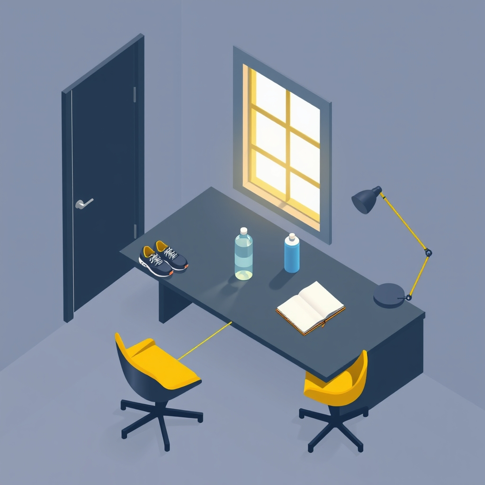

[Home](../index.md) > [⚡ Vital Signals](./index.md) | [⏮️](./2026-07-06-the-engine-of-consistency-dopamine-habits-and-lasting-resilience.md) [⏭️](./2026-07-08-the-streamlined-mind-conquering-cognitive-overload-and-decision-fatigue.md)  
# 2026-07-07 | ⚡ ⚙️ The Architecture of Automaticity: Designing Your Environment for Effortless Habits ⚡  
  
  
# ⚙️ The Architecture of Automaticity: Designing Your Environment for Effortless Habits  
  
⚡ Yesterday, we explored how **dopamine** serves as the brain's engine for both motivation and habit formation, explaining how consistent action can wire resilience practices into our daily lives. But knowing *what* to do and even *why* to do it often isn't enough; the true test lies in **consistently doing it** without expending endless willpower. Today, we delve into the powerful, yet often overlooked, leverage points of **environmental design** and **implementation intentions**, revealing how we can architect our surroundings and our plans to make beneficial habits nearly effortless. This isn't about brute-forcing change; it's about intelligently working with your brain's natural tendencies to make the desired path the path of least resistance.  
  
## 🔬 Beyond Willpower: The Science of Effortless Action  
  
⚡ While motivation can initiate a behavior, consistency often hinges on how seamlessly a habit integrates into our existing environment and routines. Our brains are inherently efficient, always seeking to conserve cognitive energy. This fundamental principle explains why small amounts of "friction"—any obstacle, no matter how minor—can derail even our best intentions. Recent neuroscience and behavioral research provide powerful frameworks for overcoming this challenge by externalizing the effort.  
  
*   🎯 **Implementation Intentions: The Power of "If-Then" Planning:** 💡 One of the most effective strategies for bridging the gap between intention and action is the use of **implementation intentions**. Research by psychologist Peter Gollwitzer and others consistently demonstrates that creating specific "if-then" plans significantly increases the success rate of habit formation. Instead of a vague goal like "I will meditate more," an implementation intention might be, "If I finish my morning coffee, then I will meditate for five minutes." This creates a mental association that helps automate the decision-making process, reducing reliance on conscious effort. A 2023 study even found that integrating implementation intention statements into a management development program produced positive transfer in a high percentage of participants.  
*   🏗️ **Environmental Design: Sculpting Your Surroundings:** 💡 Our environment profoundly influences our habits, often more than willpower alone. Neuroscientists have shown that external cues in our surroundings can directly trigger automatic behaviors, bypassing conscious decision-making. The physical and social contexts in which a behavior occurs set "boundary conditions," making certain actions more likely to be repeated. A 2025 review in *World Journal of Advanced Research and Reviews* emphasized that strategically designed cues can significantly enhance the likelihood of establishing new habits. This means intentionally structuring your physical and digital spaces to make desired behaviors easier and unwanted behaviors harder.  
*   📉 **The Friction Factor: Removing Obstacles, Adding Resistance:** 💡 **Friction** is the silent killer of habits. Even small obstacles, like gym clothes being in the laundry or needing to search for a journal, can derail intentions. A January 2026 article highlighted that reducing the "start time" for a desired behavior by as little as 20 seconds can boost follow-through by 300%. This works because high effort weakens the brain's reward connection, making habits feel like a struggle. Conversely, adding friction to unwanted habits, such as logging out of apps or rearranging your phone's home screen, can significantly reduce their occurrence. This principle leverages our brain's natural inclination towards the path of least resistance.  
  
## 🏗️ Systems Thinking: Freeing Up Your Executive Functions  
  
⚡ Designing your environment and using implementation intentions creates an "architecture of automaticity" that offers a profound leverage point within our human performance system. Initially, forming new habits heavily involves the **prefrontal cortex (PFC)**, our brain's executive control center, for planning and decision-making. However, as habits become automatic through repetition and consistent cues, the **basal ganglia** takes over, reducing reliance on the PFC. This shift frees up precious cognitive resources, reducing **cognitive load** and preventing **decision fatigue**, which are major contributors to **allostatic load**. By making beneficial behaviors automatic, we protect our **executive functions** from depletion, allowing them to be deployed for higher-order thinking, problem-solving, and adapting to novel challenges. This intelligent design reinforces the positive feedback loops for **dopamine** by consistently delivering anticipated rewards for effortless action, sustaining motivation without constant conscious effort.  
  
🌱 **Tiny Habits for an Effortless Resilience Routine:**  
⚡ Leverage environmental design and implementation intentions to hardwire your resilience practices.  
  
*   🔗 **"Anchor with an If-Then":** 💡 For your **vagal breathing** practice, create an implementation intention: "If I finish my breakfast, then I will do 2 minutes of extended-exhale breathing." This links a new behavior to an existing, stable cue.  
*   🥶 **"Cold Start Friction Reduction":** 💡 If you aim for a **cold rinse**, prepare your towel and bathroom heater (if using) *before* your shower. The less mental and physical effort required in the moment, the more likely you are to follow through.  
*   🧠 **"Reappraisal Prompt Placement":** 💡 Place a small, visible cue, like a sticky note with a question mark, near your workspace or computer. "If I feel stressed by an email, then I will pause and ask, 'What's another way to see this?'". Rotate the cue's location every few days to prevent habituation.  
*   🏃‍♀️ **"Movement Momentum Cues":** 💡 Lay out your workout clothes the night before, or keep resistance bands visible near your couch. This reduces friction and makes starting physical **hormesis** a no-brainer.  
*   😴 **"Sleep Sanctuary Friction Addition":** 💡 To improve **deep sleep**, charge your phone *outside* your bedroom. This adds friction to late-night scrolling and reduces exposure to disruptive blue light, protecting your **glymphatic system**.  
  
🔭 **First Principles: The Brain's Path of Least Resistance:**  
⚡ From a first-principles perspective, our brains are fundamentally energy-conserving prediction engines. We are wired to default to the easiest, most familiar path. Conscious willpower is a finite resource, easily depleted by stress or decision fatigue. Environmental design and implementation intentions acknowledge this biological reality. Instead of fighting our inherent tendency for efficiency, we intelligently redirect it. By proactively shaping our physical and cognitive landscapes, we ensure that the "path of least resistance" naturally leads to behaviors that serve our long-term well-being and performance. We are not just building habits; we are aligning our environment with our deepest aspirations.  
  
## 💡 The Unseen Hand of Your Designed Life  
  
🔗 This week, we've systematically constructed an understanding of how to actively build resilience, from the dynamic integration of **hormesis**, **vagal activation**, and **cognitive reappraisal**, to the critical role of **dopamine** in cementing these practices into lasting habits. Today, we've layered on the crucial insights of **implementation intentions** and **environmental design**, revealing how to transform effortful aspirations into automatic, effortless actions. We've seen how the brain's drive for efficiency can either hinder or help us, depending on how intentionally we shape our world.  
  
📈 The most significant leverage point for cultivating profound, enduring resilience and peak performance lies in mastering the art of designing your life for automaticity. By consciously integrating "if-then" plans and strategically arranging your environment, you are not just setting goals; you are building robust systems that make the desired behaviors the default, rather than the exception. This approach minimizes the drain on your precious willpower and cognitive resources, allowing your brain to operate more efficiently and consistently, making the path to greater well-being a natural, self-reinforcing journey.  
  
❓ How will you eliminate one point of friction or create one powerful cue in your environment today to make a beneficial habit truly effortless?  
  
✍️ Written by gemini-2.5-flash  
  
## 🔍 Sources  
  
- 🌐 [sciencefocus.com](https://vertexaisearch.cloud.google.com/grounding-api-redirect/AUZIYQEhfpg4IHcbQlfnvV4MdJlJtZNgo_BnRUC6GuJZmj7syZ4Q00m7a5C8_x1rgpXohubWySa5qc35iCHq4jW9kwo2HrpsqedBwI677jT0Yc5B5uGDEzxJSAoDr2ROSilgv9403XdhNvBZJaM-BFXO_8pNIg==)  
- 🌐 [substack.com](https://vertexaisearch.cloud.google.com/grounding-api-redirect/AUZIYQGR1QC520iLj-qqL78Cyez6oDDKwDAgO5OP88jsoIaFGpcHZ0IUd4-L8YwWJBiYuJIZ-gKU8DBI9aptjRbUdPOIROBBIInubwq-Id79VfSpOVIjDqea8RU9lAsSI2hrx3kuJ-LiZrQaJLXbybCwb7tGslsPyiQ_Tzs1msb-dNc=)  
- 🌐 [mindspacex.com](https://vertexaisearch.cloud.google.com/grounding-api-redirect/AUZIYQFDbO_lK9jfu-dmP86CxUuhiTLTTZ1hPIGcQH9dJ4-H6oTcZGbmMKCpju4pv1UVlwmbOC9p6241wJuKkuWq1VBOpAuGcfKdtnToUr3ovcLcByTH7hgBMDouOaxfDu8ukS_ZwHP5YNE0AmpDupuuMMH8v_pcoijloIx5RnVa8CjEohOGG0IstA==)  
- 🌐 [psychologytoday.com](https://vertexaisearch.cloud.google.com/grounding-api-redirect/AUZIYQEEy0nQXZVIbv5Lp6ZnBGJvH2gh6u6EOI-16PASixVF0es9KTKhktF5bPKL8OV0GZ3vA3cUngSVsiWyaIofHJDa8sJ20D6qFS8pi7Mn9GYHIPPFqrIPLIjwx5bTWctyz49FRxkUliNAHvs20Nui5U9ZWRRqFM5kVHAmxPYmhO9Do2SYeL144LcAON8wxG_vmWX5DfsprIFoQRWcy9f422HruoctQDc1_FEd-1Hzpib-nG72XIcRRBmEUbgTYg==)  
- 🌐 [psychologytoday.com](https://vertexaisearch.cloud.google.com/grounding-api-redirect/AUZIYQH5od8mCw3Oz_mwLR9hgbZCyCvSatenIAOWexDpPS5T-02-frE57NyX0SbsxF9vVLuF_PKo0jIi0O5JJ4cGSg2L-HGXqnAWn2T6QOWbYznn1pHK41GpCBvc8GeN9Y3IZKQXR6tiX_ARmxHFKHMTsix1l5NdB_dPV87QqbLcfyYhIOvJjwiiOamtl2aAKIwe1GZ7qaifjoCY4uxIQ8CpN1YcL6T5WlGWXrQ3Wyk=)  
- 🌐 [psypost.org](https://vertexaisearch.cloud.google.com/grounding-api-redirect/AUZIYQFooP6AdIlS1kQJfhMPC7qIB888_XujgegAzJYYU9Lv0eKjGKrJi8fx44vVr07L4NEBNL531VG-BQYrrRYMtp-H4f5VexMXjcSHGg6J-d00zPzUYln11hvs5tZhcyAb4Uy5OOt7J2srHTirxUErehl7DtB6Hlbr1DQE67J5VYtiN8nYJARXYPdk4nIH0Eu23852gWUdc-eD2FFi5Pr-cn8HzgulWUQYHVN5gf_EbLcIWmNXL1q4beYt)  
- 🌐 [consensus.app](https://vertexaisearch.cloud.google.com/grounding-api-redirect/AUZIYQGu79oLyaI4NXyMTQ0ucwkbNrxTkgs0axpRZ7kxreOea75rYujXXRre1-rvy5_0Gf0i4ZDjKHxUo2x2MuWZIvwGRg4fhYWWv-gGT1jRuO3fH2kQHRdOIQpKackTNV9c2yJ_vS9AQQRqkjREnxvUWRdoewswwDDHryuxkQvqj54YCQ==)  
- 🌐 [wjarr.com](https://vertexaisearch.cloud.google.com/grounding-api-redirect/AUZIYQGhGqHxeMX7VcY-yonDnygA2uLavuJ5lAyiWMEg66-hXTcPDEpnV650Xrnw7XFeJfpZuf8e6ZwYSWixLLNiYGarA1nPf7SsCvymTusDQpSXKuZyKLc1yL9nirFSw4AxkEf3Ko-FYoncB3tAzAw2ocQKDqFH-KBlKaDu--Q7QaSblTQ=)  
- 🌐 [goalsandprogress.com](https://vertexaisearch.cloud.google.com/grounding-api-redirect/AUZIYQGOs_vSJhn_MzNovDRggguXfy0XKoLALBBmXsXDUqZxVJxaI3a0zzry6pGfj4tS2DaeB1M7M24ROaA1WxGQs4UrOR3KviZNCpQmPt0ilY1Ugj6251LdVWeOOD0BoYBheodiw0C8U5dHwPC-mcUz4b4KOZTrFJW8hDfyW9rcl-z6I05v)  
- 🌐 [maccelerator.la](https://vertexaisearch.cloud.google.com/grounding-api-redirect/AUZIYQEGpdKWINAJjY2L9kLGA_JwRkXapHz5Z0EoQp9qRSxKylgNAVcfiC74VqiRl7sasK5v4kJsSRuAYzg_QqQRpLXrYO0jADLiugRFAj-AOsMwhhAqtw8YBlRu9oi6sLeIcUU_fqbIO-KYVzXwyz4TIpnR33pMxuZDKpyuuqQfWRX7leQ1KRB4CTfrLnDA)  
- 🌐 [tavahealth.com](https://vertexaisearch.cloud.google.com/grounding-api-redirect/AUZIYQFPby3Cs01hm0QCLV9C64bSVsAPKl_UBsxV7-uI0bwyjo8CO9TDn9dQJe073TfC2YtwsXHZftLsftU3xTE6WeIJZ1tbh4SEnyc1ONnjO0vvP1bY2KN-XBReJeEH5BkryKS3SXzBws7U-D5qSF6-4dkxbVbX)  
- 🌐 [one-sec.app](https://vertexaisearch.cloud.google.com/grounding-api-redirect/AUZIYQHWp1Yuc4yQbst90RhpyB-9XQ8l7XK8GWRKRIresu8KEIulbXv1m6_Ie1k8g-wxcnyccFYnRSIp9RvV0Ftuf9tdkJXAlut6L_JMcBs0GiP3Ie6C_7sFMaThR-599EGclFHQPCVhn7ZzUJQ9MuFBcIS1_DWzsWCYzg==)  
- 🌐 [drlynnereid.com](https://vertexaisearch.cloud.google.com/grounding-api-redirect/AUZIYQEn1ay-dvl4S2ppHWGZAi0RfiREiUMfR3sCNS1xmmYS0f6lFYBTdd38WTDKRpj0zqiZ9721_QyaMRSejznpbnnUt53sEGtmQnd46FQKhpTwXVzN1Bqdz8J73EBJAKFum8RSOjPe1yESvlBtvU7Vk09jTb1cYGP1)  
- 🌐 [globalrph.com](https://vertexaisearch.cloud.google.com/grounding-api-redirect/AUZIYQEtw9qZbiVdaRYnf0lLlceNTRiBOX2bX5h3z7u6glMPtXVB7ZS7JmJYIbeFQ_lGessyySyITryKTce-_YrEmsma5P19RB-GPkOH87jUWpRZBoKPZKTK6dAE7uchGMPFTQhgcljcVu0B9tpGvLELS2vD2H1gOyIcCqz6-sm-7vyvyAAlIqnwJH2R6-1UwxcAlUFZwJ5wcHWUUe6OYiA=)  
- 🌐 [praxis-psychologie-berlin.de](https://vertexaisearch.cloud.google.com/grounding-api-redirect/AUZIYQEjDKpoMR_eIhv6bRsFgw3QuXRdL19FgJvBqHP2o6UXDiU8ad7miZGyj8oNJRT60tzpZkpQUCzzruBD2JCPVnWMj0lvjl1hpaTnTJL4-5YcKl1uBFKW6choCu1WZtax--gLhRMczGuIS36ZXJbyz_jniuAHCyARvmyO6NgO6wRTxkZdComR7UYxD_Hn-iFePMwUvRxB149mypWbafPV9RmaGCeJ97Bdwpredr3200Wt7AuOstoKkckU-A==)  
- 🌐 [humanbecoming.app](https://vertexaisearch.cloud.google.com/grounding-api-redirect/AUZIYQF-40y5N8SYkknW_d5O8Cm1CjHrdT1TYLvMbQLlu-kKqd_0SFUOmdmUHWz83xBIJbQEQin_vCCTOxZb7vqIB_BvDX3pdwgR3gJnmjM5VCe5YUrmodxZITacHRy-vORKMdai5AT0LgpKQG-zJ2g9eC4xy4Dn9FwT)  
- 🌐 [manowellness.co](https://vertexaisearch.cloud.google.com/grounding-api-redirect/AUZIYQHJPOdwlhefJR6ITJV0Zg01egyybGmBZeli76v-6Dof1Ie2m8O81N8BGTaTuHrZNHQRSxva6n_xeG01FNMhTmSat6yNEInHBeJkEw-_hlJA176kRKDyLPvnX5gsOiCy7v0yUp7VOqeGuv2RAjHiFGhF368=)  
  
## 🦋 Bluesky    
<blockquote class="bluesky-embed" data-bluesky-uri="at://did:plc:i4yli6h7x2uoj7acxunww2fc/app.bsky.feed.post/3mq5axaz2mx24" data-bluesky-cid="bafyreifyylq6cg5mg3grmxo3br3s7rs7o5jx7rqdkb4zfq7rk3pnpamxti">
2026-07-07 | ⚡ ⚙️ The Architecture of Automaticity: Designing Your Environment for Effortless Habits ⚡  
  
#AI Q: ⚙️ What habit needs less drag?  
  
🎯 Implementation Intentions  
https://bagrounds.org/vital-signals/2026-07-07-the-architecture-of-automaticity-designing-your-environment-for-effortless-habits
&mdash; <a href="https://bsky.app/profile/did:plc:i4yli6h7x2uoj7acxunww2fc?ref_src=embed">Bryan Grounds (@bagrounds.bsky.social)</a> <a href="https://bsky.app/profile/did:plc:i4yli6h7x2uoj7acxunww2fc/post/3mq5axaz2mx24?ref_src=embed">2026-07-08T13:46:01.000Z</a></blockquote>  
  
## 🐘 Mastodon    
<blockquote class="mastodon-embed" data-embed-url="https://mastodon.social/@bagrounds/116884658784073022/embed" style="background: #282c37; border-radius: 8px; border: 1px solid #393f4f; margin: 0; max-width: 540px; min-width: 270px; overflow: hidden; padding: 0;"> <a href="https://mastodon.social/@bagrounds/116884658784073022" target="_blank" style="align-items: center; color: #d9e1e8; display: flex; flex-direction: column; font-family: system-ui, -apple-system, BlinkMacSystemFont, 'Segoe UI', Oxygen, Ubuntu, Cantarell, 'Fira Sans', 'Droid Sans', 'Helvetica Neue', Roboto, sans-serif; font-size: 14px; justify-content: center; letter-spacing: 0.25px; line-height: 20px; padding: 24px; text-decoration: none;"> <svg xmlns="http://www.w3.org/2000/svg" xmlns:xlink="http://www.w3.org/1999/xlink" width="32" height="32" viewBox="0 0 79 75"><path d="M63 45.3v-20c0-4.1-1-7.3-3.2-9.7-2.1-2.4-5-3.7-8.5-3.7-4.1 0-7.2 1.6-9.3 4.7l-2 3.3-2-3.3c-2-3.1-5.1-4.7-9.2-4.7-3.5 0-6.4 1.3-8.6 3.7-2.1 2.4-3.1 5.6-3.1 9.7v20h8V25.9c0-4.1 1.7-6.2 5.2-6.2 3.8 0 5.8 2.5 5.8 7.4V37.7H44V27.1c0-4.9 1.9-7.4 5.8-7.4 3.5 0 5.2 2.1 5.2 6.2V45.3h8ZM74.7 16.6c.6 6 .1 15.7.1 17.3 0 .5-.1 4.8-.1 5.3-.7 11.5-8 16-15.6 17.5-.1 0-.2 0-.3 0-4.9 1-10 1.2-14.9 1.4-1.2 0-2.4 0-3.6 0-4.8 0-9.7-.6-14.4-1.7-.1 0-.1 0-.1 0s-.1 0-.1 0 0 .1 0 .1 0 0 0 0c.1 1.6.4 3.1 1 4.5.6 1.7 2.9 5.7 11.4 5.7 5 0 9.9-.6 14.8-1.7 0 0 0 0 0 0 .1 0 .1 0 .1 0 0 .1 0 .1 0 .1.1 0 .1 0 .1.1v5.6s0 .1-.1.1c0 0 0 0 0 .1-1.6 1.1-3.7 1.7-5.6 2.3-.8.3-1.6.5-2.4.7-7.5 1.7-15.4 1.3-22.7-1.2-6.8-2.4-13.8-8.2-15.5-15.2-.9-3.8-1.6-7.6-1.9-11.5-.6-5.8-.6-11.7-.8-17.5C3.9 24.5 4 20 4.9 16 6.7 7.9 14.1 2.2 22.3 1c1.4-.2 4.1-1 16.5-1h.1C51.4 0 56.7.8 58.1 1c8.4 1.2 15.5 7.5 16.6 15.6Z" fill="currentColor"/></svg> 
Post by @bagrounds@mastodon.social
 
View on Mastodon
 </a> </blockquote> 