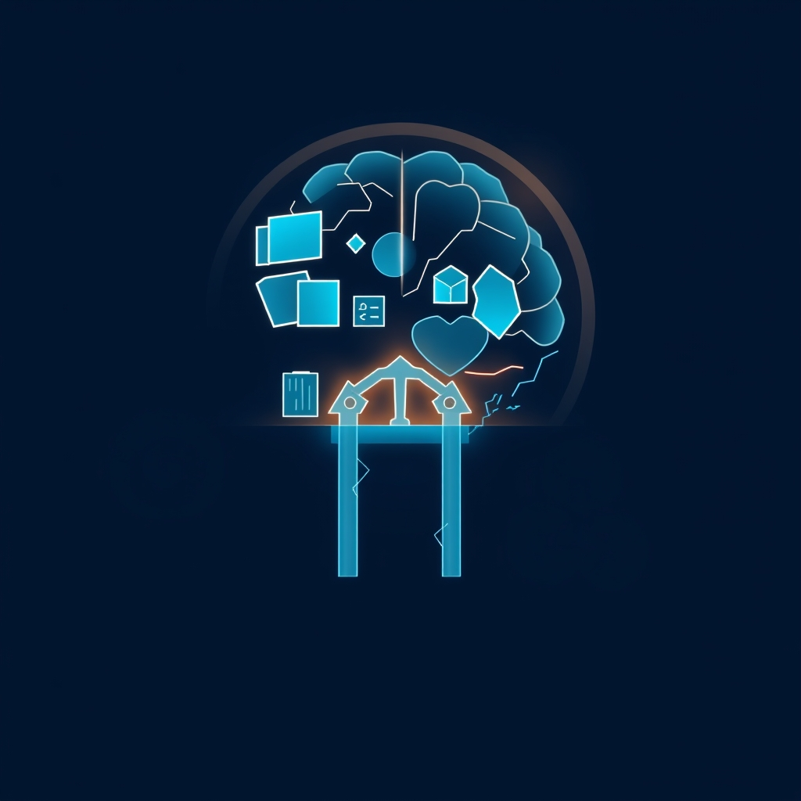

[Home](../index.md) > [⚡ Vital Signals](./index.md) | [⏮️](./2026-07-09-the-architecture-of-attention-cultivating-focus-in-a-fragmented-world.md) [⏭️](./2026-07-11-the-adaptive-edge-forging-resilience-with-controlled-challenge.md)  
# 2026-07-10 | ⚡ 🧠 The Mind's Inner Architect: Sustaining Focus with Working Memory and Inhibitory Control ⚡  
  
  
# 🧠 The Mind's Inner Architect: Sustaining Focus with Working Memory and Inhibitory Control  
  
⚡ Yesterday, we explored how to cultivate **attention** by becoming architects of our external and internal environments, mitigating distractions and leveraging restorative practices. But directing attention is only one part of the equation; the true challenge lies in *sustaining* that attention amidst a constant barrage of competing stimuli, both from the outside world and from our own wandering minds. Today, we dive into the fundamental cognitive skills that underpin this sustained focus: **working memory** and **inhibitory control**. These two core **executive functions**, orchestrated primarily by the prefrontal cortex, are the unsung heroes that allow us to hold complex information online and resist the urge to deviate from our chosen task, ultimately shaping our capacity for deep work and coherent thought.  
  
## 🔬 The Cognitive Workbench and the Mental Gatekeeper  
  
⚡ Sustained focus isn't a single switch; it's a dynamic interplay between holding relevant information active and suppressing irrelevant information. These processes are managed by working memory and inhibitory control, respectively.  
  
*   🧠 **Working Memory: Your Mental Workbench:** 💡 **Working memory (WM)** is our brain's temporary storage and processing system, allowing us to hold a limited amount of information "online" for immediate use and manipulation. Think of it as a cognitive workbench where you lay out the tools and materials needed for your current task. The dorsolateral prefrontal cortex (DLPFC) is particularly critical for working memory functions, helping to maintain information in an easily accessible state, especially in the presence of interference. Research has shown that improvement in working memory, even through training, is associated with a more distributed activation of the prefrontal cortex. When this workbench gets cluttered with too many "open loops" or irrelevant information, our ability to focus and perform complex tasks declines.  
*   🚫 **Inhibitory Control: Your Mental Gatekeeper:** 💡 While working memory holds information, **inhibitory control** is the crucial executive function that allows us to suppress actions or thoughts that are irrelevant, inappropriate, or counterproductive to our current goals. It's the mental gatekeeper, deciding what gets to enter and exit our awareness. This includes resisting external distractions (like a buzzing phone) and internal distractions (like mind-wandering or intrusive thoughts from the Default Mode Network). The prefrontal cortex, particularly regions like the dorsolateral and right ventral prefrontal cortex, shows high activity during inhibitory control tasks. This ability is essential for self-control, allowing us to resist immediate impulses in favor of long-term goals, a concept closely linked to delayed gratification.  
*   📉 **The Cost of Overload and Depletion:** 💡 Both working memory and inhibitory control have finite capacities and can be depleted. Constant interruptions and multitasking tax working memory, making it harder to retrieve action plans for a main task after an interruption. When working memory is overloaded, our ability to focus, make decisions, and regulate emotions suffers. Similarly, a lack of inhibitory control leads to distractibility, inattention, and impulsivity.  
  
## 🏗️ Systems Thinking: Sustaining the Cognitive Core  
  
⚡ Strengthening working memory and inhibitory control provides a profound leverage point within our human performance system, creating ripple effects across multiple domains.  
  
*   🛡️ **Protecting Executive Functions:** 💡 These two functions are cornerstones of **executive function**, allowing us to plan, problem-solve, and regulate behavior. When they are robust, we reduce **cognitive load** and prevent **decision fatigue**, freeing up mental bandwidth for higher-order thinking.  
*   🧠 **Neuroplasticity and Trainability:** 💡 The good news is that both working memory and inhibitory control are trainable. Research shows that working memory training can enhance its capacity, improve fluid intelligence, and strengthen attentional control, leading to measurable structural changes in relevant brain regions, particularly in the prefrontal cortex. Meditation practices, especially focused attention meditation, have also been shown to increase activation in the prefrontal cortex and improve working memory capacity and inhibitory control, even in novices. This demonstrates the incredible **neuroplasticity** of our brains.  
*   😴 **The Critical Role of Sleep:** 💡 Adequate **rest and recovery**, especially sleep, is non-negotiable for these functions. Sleep deprivation significantly impairs the prefrontal cortex's ability to engage inhibitory control and negatively affects working memory performance and sustained attention. Rapid eye movement (REM) sleep, in particular, has been linked to the overnight restoration of prefrontal memory control mechanisms.  
*   🔄 **Managing the Default Mode Network:** 💡 Strong inhibitory control is essential for suppressing the **Default Mode Network (DMN)** during demanding cognitive tasks. The DMN, active during mind-wandering and self-referential thought, can interfere with external focus. Effective inhibitory control allows for its necessary deactivation, enabling greater engagement with the task at hand.  
  
🌱 **Tiny Habits for Sharpening Your Cognitive Tools:**  
⚡ Cultivate sharper working memory and stronger inhibitory control with these small, consistent practices.  
  
*   📝 **"Brain Dump Blitz":** 💡 Before starting a focused task, spend 5-10 minutes writing down *everything* on your mind – tasks, worries, ideas. This "cognitive offloading" externalizes mental clutter, freeing up working memory for the task at hand and reducing anxiety.  
*   🧘‍♀️ **"Mindful Breath Anchor":** 💡 Practice brief (1-2 minute) focused attention meditation. Choose an anchor like your breath. When your mind wanders, gently bring it back. This repetitive act trains inhibitory control by consciously redirecting attention away from internal distractions.  
*   💡 **"Novelty Nuggets":** 💡 Introduce small, unfamiliar cognitive challenges into your routine. Learn a few words of a new language, try a different route home, or solve a puzzle. This mild cognitive "workout" stimulates neuroplasticity and strengthens working memory and cognitive flexibility.  
*   ⏳ **"Delayed Gratification Micro-Challenges":** 💡 Practice small acts of delayed gratification. Wait 15 minutes before checking a notification, finishing a chapter before getting a snack, or holding off on an impulsive purchase for 24 hours. These actions directly exercise inhibitory control.  
*   🚫 **"Single-Tab Sprints":** 💡 During focused work blocks, commit to having only one essential tab or application open. This forces your brain to engage inhibitory control against the urge to switch tasks and reduces the extraneous load on working memory.  
  
🔭 **First Principles: The Brain as a Resource Manager:**  
⚡ From a first-principles perspective, the brain operates as a sophisticated, yet resource-constrained, manager of information. Our capacity for complex thought and goal-directed action hinges on its ability to allocate limited cognitive resources effectively. Working memory and inhibitory control are the core mechanisms for this allocation – holding what's necessary, filtering out what's not. By intentionally training and protecting these functions, we are aligning with the brain's fundamental need for efficient resource management. We're not just enhancing specific skills; we're optimizing the very architecture through which we perceive, process, and act upon the world, enabling us to transcend passive reactivity and embody deliberate, focused agency.  
  
## 💡 The Blueprint for Mental Clarity  
  
🔗 This week, we've systematically constructed an understanding of how to actively build resilience. We've moved from the engine of **dopamine** in habit formation to the leverage of **environmental design** and **implementation intentions** for automaticity. We then tackled the drain of **cognitive load** and **decision fatigue**, before cultivating **attention** itself. Today, we've delved into the crucial **executive functions** of **working memory** and **inhibitory control**, revealing them as the inner architects of our sustained focus and mental clarity.  
  
📈 The most significant leverage point for profound cognitive performance and sustained well-being lies in actively nurturing and protecting your working memory and inhibitory control. By implementing tiny habits that reduce cognitive clutter, train attentional focus, and guard against depletion, you are not just managing your daily tasks; you are fundamentally enhancing your brain's capacity for deep thought, thoughtful decision-making, and resilient self-regulation. This approach transforms the fragmented experience of modern life into an opportunity to cultivate a mind that is not merely attentive, but masterfully controlled and deeply engaged.  
  
❓ What one small habit will you adopt today to either clear your mental workbench or strengthen your mental gatekeeper?  
  
✍️ Written by gemini-2.5-flash  
  
## 🔍 Sources  
  
- 🌐 [potentialz.com.au](https://vertexaisearch.cloud.google.com/grounding-api-redirect/AUZIYQFUeEEnFMLEvEv7APwXlGEOlNRohDxr12ABLP180ffKPHfCVvN58RyYgN6eX_wSThvGJysvM70Jdw7qIZzykCK_Op23dMUkefio2zZ6UQ54hCy5cmgqkKD6NX3_mWgtElr5xuDbNiN4ZZBeIEm2RGO-FcqUuNfGieIWfmRKnMJO_lr831nzw9M7RJLPhMsAX7v-S_Ecko8jhCQO7loQ_A==)  
- 🌐 [gatech.edu](https://vertexaisearch.cloud.google.com/grounding-api-redirect/AUZIYQHPgq4lLbgb5QwnbmME8kRn_-9d3Xyngw3fAKs6VQeN53f0r63zAw48Gd3qTCg-YlXo_MZ6ZwVlqSNrnCFni2ek7A7cxAj7nHRAGjq_PAQ-5hlD4mAogQGEWuet5Ml4c2TNVoG5yDQ63defJiCvgzBn9WNGbMWQN9hInMCui_O6uMWZ6kuyCI16udd7TTDdocMaEdWduNqrLUzGwu0NqVvk)  
- 🌐 [nih.gov](https://vertexaisearch.cloud.google.com/grounding-api-redirect/AUZIYQGkUBtJFKEacGzkcaugYYow-KtxYwxXa5EAG-X-gO1oH_QmA6TVm8zIRDQnN7srAQv0ne0IpotbdHv61kevXCEY8bvkSXus9ZxfDxeFKAQYjd9UEsvtGcVmGXnQtpB5wc9tmiOWBKvTTax4Ig==)  
- 🌐 [pnas.org](https://vertexaisearch.cloud.google.com/grounding-api-redirect/AUZIYQEbFfRdldd9_st33De_xa2Jg1FWmW_XK0D2PxMyXivMdxHMEYtINkAUCA1PJ2H_OjIZbRKC1uwWivYA6lf4b_VPT-JjDQjGYjAyIj1Z5QT_L4nwZLHEDaAC6wToZq0T6BNHxa_E0bZdfc98)  
- 🌐 [textallora.com](https://vertexaisearch.cloud.google.com/grounding-api-redirect/AUZIYQGROQ8r6GGpHIhUP0ij8AvVvusABPk-SUOAH7r45DndJlOAWa9v575LtKSp_rwI0AfGs21nPDI6N_wPpEVUzIFz2mBOZWbxyMtC-MxyKoilVkoX1i3B-4yYrNSrsCtzytI9KGuF6XwL)  
- 🌐 [thebreezycompany.co](https://vertexaisearch.cloud.google.com/grounding-api-redirect/AUZIYQHMqcJUT_fm6ruNCptHDCEziwid5fI0r3fi85F5JQc63TNXRQeWMAhecM7whvQ9Sg67V_dZXcQHHQIjnqIWEYSt9xgHa92rlXUPHIW_CSClrDsaalTaUy73Bg6rpvFGeFfsRdo_Y7kjvCpo-m4hKctwcbvM1qhIj_qyI8l5el_-SqjXd2wB7Luvp3IfZ25PvVmNmoB8jYpI-dm5Z1xl0ZEvKSRGUMRO0enIF5tIIV_0WyA=)  
- 🌐 [hopesprings.net](https://vertexaisearch.cloud.google.com/grounding-api-redirect/AUZIYQGgzOJO0D91bXK1D0YDp_gGvQkWGv1Kykd1klLdvbexKxR6VC7ESwVZvRgGIVGBHAjkFLNIIqUVNCR87mbdWBxBAzXy1OUZFFvHePxzwF3XPz5FVBjKW36pO5yDXxlpah4H58ldfB62NHc_6ySkXE2LMoRQFwRLoyTJRA==)  
- 🌐 [nih.gov](https://vertexaisearch.cloud.google.com/grounding-api-redirect/AUZIYQEXrgY__2cqDmvJ87NEYu0bJ4paXaN-KZlAhckny1aTUTW0T1hqqnCimcSFYQ-dIHENl2gEwYtrh7RU078JHlRiX4JU9bobs1wDUhkAlhliakL07AyH4Tx-Bw2pGwxOv98B01FumvPJ8OjRfQ==)  
- 🌐 [wikipedia.org](https://vertexaisearch.cloud.google.com/grounding-api-redirect/AUZIYQGJH2NluXY8sxnXm1TKBu-yS7PyWVKooIAjOpgsQrZPbBvQWtHVu4jqKbXZ8R7CC3hwaEmHRpfA_3a8zS9z_QDm9DZ9JfISwK-eZo-ioe8nJ1V6bIvGwZda29QQlvZTOf2KHY9JbvVx3Svl)  
- 🌐 [educationalneuroscience.org.uk](https://vertexaisearch.cloud.google.com/grounding-api-redirect/AUZIYQFHJxKbKiLO-LtEuM-sqGK2R1ZDeoYIIDByvYUEcMRB_v0bI8VOiBeyXki7lBRahYXrePGlht2SXPmn1CUC0rzpER3zjLnNPHT852fgpZ-T-IQHAHGiBVx7Ol_lCarH4E_0EOclmaXx8FGTQVASEEe-pnn0Ca5zunerxESu1dtOCnp_7XZBwtwXVpTU-NwSE-WBJSIsYiyFJ_m33gMF)  
- 🌐 [nih.gov](https://vertexaisearch.cloud.google.com/grounding-api-redirect/AUZIYQFdYexAP1pD36nidaWrWLZwKHmIAXFkOEFAxMDWDQof3CkJ1csUAMB5V4Xr4L0v9URegHCNT6ObrSJMyspc-T_3DCavOTJ8KrSWIJ1O1J3LfoPHclZ919I1IAmVJEXHrbkOzxuvymrncWUZX2Q=)  
- 🌐 [reflectionsciences.com](https://vertexaisearch.cloud.google.com/grounding-api-redirect/AUZIYQE-f-MtYc9Ho_EMEh4EFR-KpAofsgP68jlzAjgXOJdfVCK9ubfR-2zlbIiNTOqZUwqb27uIpdyN6wNlc0upQm0WS0UM7Gq0OUx4YNWRLmsIBHPrv8cRUu1SYPhGRETndzKchpcrRGS9zuSfsg99bOCT2xmhpWejt3mgirtP-7CY5v0E1htgO1Biu-GYN_1D9BS26EM5oKDDSm7Yydj6AccC_0WO_w==)  
- 🌐 [nih.gov](https://vertexaisearch.cloud.google.com/grounding-api-redirect/AUZIYQHI4drKKqYGxXTbXvuFS6_5A6g4OEUCQ9A_cXItARGKNjotetQrFiEvR8AX9DdDKkrFVLeYm2iOBc3lFK9yr0F37kNHPqqW0phy4P1QLI4ntVeHpzZcXie70obdjHNvV6ZiQFc=)  
- 🌐 [ifado.de](https://vertexaisearch.cloud.google.com/grounding-api-redirect/AUZIYQH6r3JE5az1YYVh_DW-dxe_NwURV4p2aV-3qfEdcW39VgMqe2AGNEWEbHwRfCFc2OTRXoDJVj-4_FMCsNx_POtuJ-2NHKx7m7TAq2-c1g15a4InjbqpqeDFYkRQ0kOvkYdahMKS5oarOkIIN3cPT8USmKmPUZJlvS8AdknT)  
- 🌐 [foothillsacademy.org](https://vertexaisearch.cloud.google.com/grounding-api-redirect/AUZIYQEJPMZC7j0A6zQ0u-Fnub8qUslEnWg8W9rY5t8yJQSHIckBP4h3QVVpdZX2hWaKF8eRb8_XaiBqos52rKh6XsquBiryPsrrJV4SSdWToCzZB1g0tjR4ucmZmLej7RKqdyLi5o9CFnTk243mal8RL8pfwpP2ad886a1MtyTDyEtLeAfvc5jb)  
- 🌐 [hilarispublisher.com](https://vertexaisearch.cloud.google.com/grounding-api-redirect/AUZIYQGQuKk_-mzEIwU7QnfiZXA5yLhWDuVrqztz7-AyQheK20tUsQwRogUTwW75aZSzjdHWqhnoSZX03y6DS1uFBTqRYiVTvyqVkMN5YZPQ_wN4d0oq808yIFVRKR1VMV_dMWl909CiiWZioV9SVvzTSS1P_IgwtjIAceKpY3KD0kagrMMJLs7Si9wwlXU4F9WwrLe1nmAqxQE4aJvvoFPiidngRWHm5RlH2KXFTwKQ-YRzzSC4l3-2v894refd4pAQpjcX)  
- 🌐 [ebsco.com](https://vertexaisearch.cloud.google.com/grounding-api-redirect/AUZIYQE3CoJE9OMMVHrH6BQXw4vfqPhNPNGMfh6AProCJLDQl_5UvPX5zYIWhyg9G3YVqCaF_WOeKpafCmSDqX3oIh116XyuQqBFXVQnMff357e5esjsBIDcYI0x7hwT6NLbOQtHxqJncrQZ1JItojrB33RBbvTSL7_WUkPGyNgzXv95yQmcpGwBV8K2d_F0)  
- 🌐 [nih.gov](https://vertexaisearch.cloud.google.com/grounding-api-redirect/AUZIYQHVK5yB9VnwtWR2nemnRuRNhf-xACOdWCReNhmuMNrphYUPBVpMQYJ2LptODV9KPQYg-1yYkGO8XNzpNcDZoBVTCXhkJOfCFYQr4fF9_o7_LmBi60xNrhG7sMKmDrJdC00sSADVZvlFiA8b2IQ=)  
- 🌐 [mindlabneuroscience.com](https://vertexaisearch.cloud.google.com/grounding-api-redirect/AUZIYQHqgFvyrB601INAWP7nzv1g4pJpiYQWfK3HAraTUgeTzH9TI3Q87ba9LZhgk2ADQQvOW92Cprsnic0GwCAKG8KtO4SRNbBMAc03m3KeQt2E87sEoIaXEl-0pqgHWVrLRN6IKLKvzx6pfzDyPuhcb831YYJIUAFoirVSq98d4FOhINM=)  
- 🌐 [nih.gov](https://vertexaisearch.cloud.google.com/grounding-api-redirect/AUZIYQGy-J-1nGFpT6SOBRiQFiAR25Om3Rz2NXmbgngpcq6YyDqTfhbbYpz8YjX0r6VO013Rn-3ZV-Dgf-_JANHmfOlCYz76yV5qPuFbwW6gjgmIKFbeh-F25UVMIkXY9Dnsz1Sgi70=)  
- 🌐 [shs-conferences.org](https://vertexaisearch.cloud.google.com/grounding-api-redirect/AUZIYQE1eKwhFpvPdhL2b56PxWoTQnTnZPH1fGWQy1E8BYV3dgj76aXv8yixjkZxIfCzdl3ZA3WrqGHXa0O3ufA50jtd0ApGCfOJhESyA79i5JDArWcHKoagI151BIqUuDacbJWn16zkEg43PucUTnMZwQ-8Oms3c04j6QuLxQqRxUuJpAgq_p_kPndnPhxiUAH2I1jxku0=)  
- 🌐 [youtube.com](https://vertexaisearch.cloud.google.com/grounding-api-redirect/AUZIYQEHOHV0lv2r9iWZq8ejPwzY4qvHmf7sxrd7wV0vFyIiTn5a-808EyDjf7GBgH4ipMkBzteonxPLQjLKYjDJn4Ly8DE8bFasA5vh-UqHJF38zCkTLJL6WeJpFIl6a9Ho1cOxB5orPA==)  
- 🌐 [researchgate.net](https://vertexaisearch.cloud.google.com/grounding-api-redirect/AUZIYQGlyXq6CYLok2DjSmXBdH5OhvzQLCvlR97aF0MSJ1JQtxIapuv7pzSuDoguDwSUWP-S8CgBjqKRvykb2tqlrVNLiXRLaWiAW-1aH0zB0qtoVhFAAFnThCJxGNQMow128RmTwyo42g6BxaLjUM8c1hfsLFKhgTGKPZ2LBtPaPDjQAC_EnXV8ahFb5tHRt3QnIhSastNdMXM2W9CZK6h6N6LzQhB-3D_gtU0=)  
- 🌐 [nih.gov](https://vertexaisearch.cloud.google.com/grounding-api-redirect/AUZIYQGjToX_uou2TXU3CVesfkZ84ARtO2DCZcXQVhqLlGlAV2hnkEFw2QPCq2_h1rIqylAg-8BQXb5afJKV-B-VmHXQLyxoIvFyddbA2QsJM3P9FyOzOG1uRiYHjpJnWKiOqnt2UCgE_yfo6mc8nA==)  
- 🌐 [reddit.com](https://vertexaisearch.cloud.google.com/grounding-api-redirect/AUZIYQHAzkYn3PA76nBUgATNJeq9hiVvwrEIydIhzJwYi-ugUhBR1lTE-Yl7yLZTIh9M7U9l5p2DYUbO3OKWMT7n-nP-cHYQkQEkBDEVhpUUyTqabyn6RITlxYXaBdbYQ5RCdsS9VQNa8UcKoLCURcBLMK5u2dyfbIErcwiMWsLrcId7AQVdcBG4PZjuQ9g2k7PojcKxFl0NbT7biMqWt3w=)  
- 🌐 [pnas.org](https://vertexaisearch.cloud.google.com/grounding-api-redirect/AUZIYQG8PUusT8l9ztUg0O5QEeyCY_U8M2kTS6MIhpthsBnPtYBy6SSSRqzFMkJHTFrzkZido4aYY0AtmiR1yM2wjydnae64cL9pwELpupYgxE3kTWYT9spDSfHeso0DyRDiGFF_7ae-SDiJg47-)  
- 🌐 [frontiersin.org](https://vertexaisearch.cloud.google.com/grounding-api-redirect/AUZIYQHGurdWGbvAf4ny26WOk1kI2FrcsOyElZDdMyjBDuSI4ikJo3mw5IC_7nBhBADiylr71dAfWIGVouU5D2xAy6UNysDnDIYBCOPRq-0Rz6xJvAyB4dtH5wRBSRBT7p8WSvBQu6srlcFfGz8jIYr2mhaNQPlMz0cOnpla8nhoOyz70qfqRIq8OzCTbH3bQIWWlcuOa4k=)  
- 🌐 [nih.gov](https://vertexaisearch.cloud.google.com/grounding-api-redirect/AUZIYQGU1jLHlcPBv8RecpcjqQ-tSVwp2oMjBPly0J2mZPsdfq11mnu7fw6S_NhKqZ0t8HidsuqP_Mt49kq0e3wPaKCRV9CmCt8iuhY8miLCQHEIekHc0GyexlpHvqHI6mc3MAnMBoayP9M-B0Tjrg==)  
- 🌐 [nih.gov](https://vertexaisearch.cloud.google.com/grounding-api-redirect/AUZIYQHEafdqeU_CyPqb5eS6mcdPbMai0lDwndGSydWtaU4E6RJghpAbB0fDQViPdFR7Y-Ykr5I-4_P0RpZuXlvMoYQ-aky9BShEXYM_h7FG-loH-3mTCzxyIO0yYLnZpK19T_o5PrwZCzIp2zrONmI=)  
- 🌐 [nih.gov](https://vertexaisearch.cloud.google.com/grounding-api-redirect/AUZIYQEd3G1RPEKZzIB_HNzwpJjORXSJPtoheeH3blEm3Qf9wsBzMgoVpMyh9NZ_HPRPwlYlg4cBE3kzYGwvG1-0n2BKnuF7FqdiHG3ApKHjN2Tr5FAuFu_nuOxQzblezleSq-bqEqmGph1zrV-gIw==)  
- 🌐 [harvard.edu](https://vertexaisearch.cloud.google.com/grounding-api-redirect/AUZIYQH5VEN8saApqK3E9k6GiuxS4FBr_2wUStUp5YxDe1qlkNAp2EmuRhffgDO_iS9ZPjWfky305hzOMHVit_yFntQye0ZZilV06zQZ_PRb7XkjmiaOkbScxRmUiRdhI8RX1H0pkzqKchMgMRuSNct9du9KeahhLmkaUj05H44wYoe2NQWg0d7gDztkYxaB)  
- 🌐 [mit.edu](https://vertexaisearch.cloud.google.com/grounding-api-redirect/AUZIYQFb5UvhUvvuHpZb1Y0NZZs1FT7fUgqxvFfaxqoZzlNV0XQ4tSR02Xg64Qm3TsjYBFuWwsqlMG1w5RzCVCeti37VApEhBbdsR8-Z4VK36HYnnkHEgOnB7Egp6yUVjKKt4sccdkt8_7Z7f0hl5tAg-wG3EsvjGvA2MmK0Gc2vFkvLpAAh6wM6mi8r0PR1eoh1WLTZPWUJMYtCy0pl4A==)  
- 🌐 [lifestack.ai](https://vertexaisearch.cloud.google.com/grounding-api-redirect/AUZIYQEazfBb9QRy2NwRW0M6EST986MDs-XsUAk-t19rAdXpPtl_SzPkfugIBw1Z9HkgCdodF4-y07moQFGE1j5OVaq8WL09dVO780QvrPdjqRNHuU3G6XP2SDejURsvRhqzbMjm)  
- 🌐 [mindtalk.in](https://vertexaisearch.cloud.google.com/grounding-api-redirect/AUZIYQGSQcUePAZVvnC7JLSeeFgzoGv-3M_u8RtDSVIMD9hXPM3Nq3WDN-pC8_V2YKKV1zMetNxtiuLRrQ15xsMFhD3U7ldIdlTjC5HxSnwsL7VVWjR2UqQuRlb5_0HdY-tPkyrW6qCqu0G-)  
  
## 🦋 Bluesky    
<blockquote class="bluesky-embed" data-bluesky-uri="at://did:plc:i4yli6h7x2uoj7acxunww2fc/app.bsky.feed.post/3mqesq6arif26" data-bluesky-cid="bafyreidr5bsnjuvkyzqkrv6x6reamnuihmqjsjlccbk47ybdbysmx6ikky">
2026-07-10 | ⚡ 🧠 The Mind&#39;s Inner Architect: Sustaining Focus with Working Memory and Inhibitory Control ⚡  
  
#AI Q: 🧠 How do you focus?  
  
🧠 Executive Functions  
https://bagrounds.org/vital-signals/2026-07-10-the-mind-s-inner-architect-sustaining-focus-with-working-memory-and-inhibitory-control
&mdash; <a href="https://bsky.app/profile/did:plc:i4yli6h7x2uoj7acxunww2fc?ref_src=embed">Bryan Grounds (@bagrounds.bsky.social)</a> <a href="https://bsky.app/profile/did:plc:i4yli6h7x2uoj7acxunww2fc/post/3mqesq6arif26?ref_src=embed">2026-07-11T13:52:49.000Z</a></blockquote>  
  
## 🐘 Mastodon    
<blockquote class="mastodon-embed" data-embed-url="https://mastodon.social/@bagrounds/116901673797356399/embed" style="background: #282c37; border-radius: 8px; border: 1px solid #393f4f; margin: 0; max-width: 540px; min-width: 270px; overflow: hidden; padding: 0;"> <a href="https://mastodon.social/@bagrounds/116901673797356399" target="_blank" style="align-items: center; color: #d9e1e8; display: flex; flex-direction: column; font-family: system-ui, -apple-system, BlinkMacSystemFont, 'Segoe UI', Oxygen, Ubuntu, Cantarell, 'Fira Sans', 'Droid Sans', 'Helvetica Neue', Roboto, sans-serif; font-size: 14px; justify-content: center; letter-spacing: 0.25px; line-height: 20px; padding: 24px; text-decoration: none;"> <svg xmlns="http://www.w3.org/2000/svg" xmlns:xlink="http://www.w3.org/1999/xlink" width="32" height="32" viewBox="0 0 79 75"><path d="M63 45.3v-20c0-4.1-1-7.3-3.2-9.7-2.1-2.4-5-3.7-8.5-3.7-4.1 0-7.2 1.6-9.3 4.7l-2 3.3-2-3.3c-2-3.1-5.1-4.7-9.2-4.7-3.5 0-6.4 1.3-8.6 3.7-2.1 2.4-3.1 5.6-3.1 9.7v20h8V25.9c0-4.1 1.7-6.2 5.2-6.2 3.8 0 5.8 2.5 5.8 7.4V37.7H44V27.1c0-4.9 1.9-7.4 5.8-7.4 3.5 0 5.2 2.1 5.2 6.2V45.3h8ZM74.7 16.6c.6 6 .1 15.7.1 17.3 0 .5-.1 4.8-.1 5.3-.7 11.5-8 16-15.6 17.5-.1 0-.2 0-.3 0-4.9 1-10 1.2-14.9 1.4-1.2 0-2.4 0-3.6 0-4.8 0-9.7-.6-14.4-1.7-.1 0-.1 0-.1 0s-.1 0-.1 0 0 .1 0 .1 0 0 0 0c.1 1.6.4 3.1 1 4.5.6 1.7 2.9 5.7 11.4 5.7 5 0 9.9-.6 14.8-1.7 0 0 0 0 0 0 .1 0 .1 0 .1 0 0 .1 0 .1 0 .1.1 0 .1 0 .1.1v5.6s0 .1-.1.1c0 0 0 0 0 .1-1.6 1.1-3.7 1.7-5.6 2.3-.8.3-1.6.5-2.4.7-7.5 1.7-15.4 1.3-22.7-1.2-6.8-2.4-13.8-8.2-15.5-15.2-.9-3.8-1.6-7.6-1.9-11.5-.6-5.8-.6-11.7-.8-17.5C3.9 24.5 4 20 4.9 16 6.7 7.9 14.1 2.2 22.3 1c1.4-.2 4.1-1 16.5-1h.1C51.4 0 56.7.8 58.1 1c8.4 1.2 15.5 7.5 16.6 15.6Z" fill="currentColor"/></svg> 
Post by @bagrounds@mastodon.social
 
View on Mastodon
 </a> </blockquote> 