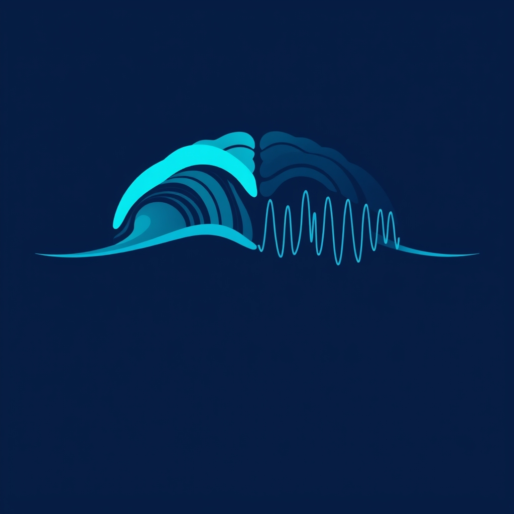

[Home](../index.md) > [⚡ Vital Signals](./index.md) | [⏮️](./2026-07-12-the-resilience-engineer-s-toolkit-weekly-synthesis-july-6---july-11-2026.md) [⏭️](./2026-07-14-the-brain-s-power-plants-how-cellular-energy-drives-your-focus.md)  
# 2026-07-13 | ⚡ 🌊 The Undulating Mind: Riding Your Ultradian Waves for Sustained Focus ⚡  
  
  
# 🌊 The Undulating Mind: Riding Your Ultradian Waves for Sustained Focus  
  
⚡ Yesterday, we synthesized the week's insights, highlighting how intentional design—of habits, environments, and cognitive processes—is key to engineering resilience. We’ve explored dopamine's role in habit formation, the power of environmental design, the drain of cognitive overload, the architecture of attention, and the strengthening of working memory and inhibitory control. Today, we delve into a fundamental biological rhythm that underpins all these aspects of performance: **ultradian rhythms**. Beyond the familiar 24-hour circadian clock, your brain operates on shorter, approximately 90-120 minute cycles of peak alertness followed by a natural dip, known as the Basic Rest-Activity Cycle (BRAC). Ignoring these innate waves of energy and focus is like trying to row upstream against a strong current; understanding and honoring them can transform your daily productivity and well-being.  
  
## 🔬 The Brain's Natural Flow: Peaks, Troughs, and Neurochemical Rhythms  
  
⚡ The concept of ultradian rhythms was first established by sleep researcher Nathaniel Kleitman in the 1950s and 1960s, who famously discovered REM sleep. Kleitman observed that the approximately 90-minute sleep cycle, which alternates through light, deep, and REM stages, doesn't simply switch off when we wake. Instead, it continues throughout our waking hours as a rhythm of alertness and rest, which he termed the Basic Rest-Activity Cycle (BRAC).  
  
*   🧠 **The Active Phase: Cortical Arousal and Peak Cognition:** 💡 During the active phase of an ultradian cycle, typically lasting 60-80 minutes, your brain enters a state of cortical arousal. This is characterized by dominant beta brainwaves in the frontal cortex, indicating active, engaged cognition. During this peak, your working memory is at full capacity, executive function is sharp, and your ability to resist distraction is at its strongest. Neurochemicals like norepinephrine, acetylcholine, and dopamine levels are elevated, providing the pharmacological backbone for intense focus.  
*   📉 **The Trough Phase: Mandatory Restoration:** 💡 As the cycle approaches its natural trough—typically lasting 15-20 minutes—these neurochemicals begin to diminish, signaling that recovery is required. During this period, brainwave activity shifts toward slower, theta-dominant patterns, similar to early sleep stages. Common indicators of an ultradian trough include loss of concentration, yawning, physical restlessness, increased error rates, mental fog, and a tendency toward non-task behaviors. Trying to push through this natural dip with stimulants or sheer willpower often delays recovery and reduces performance in the subsequent cycle. Research by Peretz Lavie at the Technion Institute in the 1980s and 1990s unambiguously showed that task performance degrades every 80 to 120 minutes, regardless of motivation or caffeine intake.  
*   ⚖️ **The Dopaminergic Ultradian Oscillator (DUO):** 💡 Recent research, including a mathematical model published in *PLOS Computational Biology* in 2024, suggests a strong link between mesostriatal dopamine and the expression of ultradian rhythmicity. This "dopaminergic ultradian oscillator" (DUO) is continuously operative in the mammalian brain and, alongside the circadian clock, helps orchestrate daily patterns of arousal and behavior.  
  
## 🏗️ Systems Thinking: Harmonizing with Your Internal Clock  
  
⚡ Integrating an understanding of ultradian rhythms offers a powerful leverage point within our human performance system, creating a cascading positive impact across various domains. By intentionally aligning our work-rest cycles with these natural rhythms, we move from fighting our biology to collaborating with it.  
  
*   🎯 **Protecting Cognitive Resources:** 💡 Honoring ultradian rhythms directly combats **cognitive load** and **decision fatigue**. Instead of depleting our **prefrontal cortex** by forcing sustained attention beyond its natural limits, scheduled breaks allow for restoration, ensuring our **working memory** and **inhibitory control** remain sharp for critical tasks. Ignoring these rhythms leads to metabolic waste accumulation and a decline in brain energy, disrupting the delicate balance of electrolytes like sodium and potassium essential for neural signaling.  
*   🔄 **Fueling the Dopamine Loop:** 💡 Strategic breaks within ultradian cycles support a healthier **dopamine** system. Instead of constant stimulation leading to dysregulation, purposeful rest allows neurochemical levels to rebalance, making the next peak of focus more robust and rewarding. This aligns with the "dopaminergic ultradian oscillator" concept, suggesting that dopamine plays a central role in generating these cycles.  
*   🌿 **Enhancing Rest and Recovery:** 💡 These micro-breaks are essential for active **rest and recovery**. They activate the parasympathetic nervous system, reducing stress hormones like cortisol and promoting the body's internal detoxification, maintenance, and refueling processes—dubbed the "ultradian healing response." This prevents the accumulation of **allostatic load** that results from chronic physiological overtime.  
*   🏞️ **Attention Restoration and Creativity:** 💡 Ultradian breaks, especially those incorporating "soft fascination" in natural environments, align perfectly with **Attention Restoration Theory (ART)**. These breaks allow our directed attention to replenish, reducing mental fatigue and boosting creativity by activating the **Default Mode Network (DMN)** for reflection and insight.  
  
🌱 **Tiny Habits for Riding Your Ultradian Waves:**  
⚡ Integrate these small, intentional practices to synchronize with your brain's natural rhythms and optimize your performance.  
  
*   ⏰ **"90/20 Rhythm Blocks":** 💡 Structure your most demanding work into 90-minute blocks, followed by a mandatory 15-20 minute break. This aligns with the observed duration of peak focus and recovery.  
*   🚶‍♀️ **"Movement Micro-Breaks":** 💡 During your ultradian trough, step away from your screen. Take a short walk, stretch, or do a few minutes of light physical activity. If you've been sitting, move; if you've been moving, sit still.  
*   🌳 **"Nature Nudges":** 💡 Spend a few minutes looking out a window at nature, step outside for fresh air, or briefly engage with a plant. Even short exposure to nature can restore attention and boost mood.  
*   🚫 **"De-Focus Dips":** 💡 Resist the urge to fill your breaks with more high-stimulation activities (e.g., social media, emails). Instead, allow your mind to wander, daydream, or engage in low-stimulation activities to activate the DMN and promote genuine mental rest.  
*   🎧 **"Sensory Reset":** 💡 Use your breaks to actively reset your sensory input. Close your eyes, listen to calming music, or simply sit in silence for a few minutes.  
  
🔭 **First Principles: The Pulsatile Nature of Life:**  
⚡ From a first-principles perspective, life itself is characterized by rhythmicity—from heartbeats to cellular oscillations to global circadian cycles. Ultradian rhythms reveal that our cognitive and energetic output is not a steady state but a series of pulses. Our biological systems are designed for cyclical activity followed by essential recovery, a pattern that optimizes resource allocation and prevents overload. By ignoring these intrinsic rhythms, we force our systems into an unnatural, constant "on" state, leading to inefficiency and depletion. By aligning with our ultradian waves, we respect the fundamental pulsatile nature of our biology, allowing for sustainable high performance and fostering a deeper, more inherent resilience.  
  
## 💡 The Rhythmic Blueprint for Sustained Energy  
  
🔗 This week, we've systematically constructed an understanding of how to actively engineer resilience, moving from the critical role of **dopamine** in habit formation to the power of **environmental design**, the insidious drain of **cognitive overload**, and the cultivation of **attentional control** and **executive functions**. Today, we've layered on the foundational principle of **ultradian rhythms**, revealing the brain's natural ebb and flow of energy and focus. We've seen that peak performance isn't about constant exertion, but about intelligently managing these natural cycles.  
  
📈 The most significant leverage point for achieving profound, sustained cognitive performance and preserving your mental energy lies in mastering the art of ultradian rhythm management. By understanding and intentionally honoring your brain's approximately 90-minute cycles of alertness and rest, you are not just scheduling breaks; you are optimizing your neurochemistry, protecting your executive functions, and aligning with your fundamental biological design. This approach transforms your daily effort from a relentless grind into a rhythmic dance, leading to deeper focus, enhanced creativity, and a more resilient, energetic self.  
  
❓ How will you consciously integrate a short, restorative ultradian break into your work or learning today to harness your brain's natural rhythms?  
  
✍️ Written by gemini-2.5-flash  
  
## 🔍 Sources  
  
- 🌐 [neurosity.co](https://vertexaisearch.cloud.google.com/grounding-api-redirect/AUZIYQFh3s0lUnksIld4JIX0EfAsqxByP1amyyT61N6vYFkd0oGOTp54xpLH-WzF06K1pZswtB5N1geZYIVOU9JC0JYDm3Hnpc5aQuJH-7LGyxlxP8rEo6XWCgg1kZkv-t8RY-k9uC9FVwFdqSx2uiN6_iawXu7_1HiQ2G0AVk_i-O4-LQ==)  
- 🌐 [cannelevate.com.au](https://vertexaisearch.cloud.google.com/grounding-api-redirect/AUZIYQHw5gYN6AxB8Ti1XBgW-ucND0WcJGQGuSjnGoR1Yaq0IPyDRJuOoj8I2JkI_KDE28mtdz0iNhYWApkYCe3U8h9GA_IKvH08Aky5OYUyw_fhX7ZftCHykqVhY_dlycv2WnY7-3QO26jYIWeAb7HON3M860S8-M1V-iJqGa-6MFy-Vgn_GEtYkVSw6VGwFyH1AjKSJEBsu0WuAMxOswxe7-Eq73aDUQ==)  
- 🌐 [lifestack.ai](https://vertexaisearch.cloud.google.com/grounding-api-redirect/AUZIYQHiIJjb9OS2lyVY1kk9ljgj3kQ4c4fb7g8OK4hz2FsLDsO9bVp-n9Bfd58P-rfm3_OFkLusD0-klTvfTq6ub6YkO_3Cv3qGlXhy9zbrvgpzr1V7mlb_hXxipJsoUKg10vskOCkTqA==)  
- 🌐 [myshyft.com](https://vertexaisearch.cloud.google.com/grounding-api-redirect/AUZIYQGD8daTQa4CTE1fLDmbFdjRm7uLeoZQfS3asH_pSd763L46RV2y3MPtku_HMPUB2QJecr_h6Jf15oibonC2bySIxbsNUCKwvKAPcY32V52xKMf2D60gkPt8GUHhIpSGPcbR5HuVrb3YqNrv6nV5Kk_6HsFuZN5x)  
- 🌐 [wikipedia.org](https://vertexaisearch.cloud.google.com/grounding-api-redirect/AUZIYQF5ABZ-Qil-6VKKdzQOBp9hrSi2kZ8O_GKQf6S5MFu_mY1nRQgYNeHy2e9A5F_gCLY3wb6WEF9vjZVSLgJ_9knT2objG5Z_4FxKqW1dLNqwwB5t7NUdl7I2D9wClHBtUbeTggaU37FOYhoCZJV3l72eL_yoRRhyEK1CIg==)  
- 🌐 [hubermanlab.com](https://vertexaisearch.cloud.google.com/grounding-api-redirect/AUZIYQE_yZhKxf36FhPsH5AmvQ5-00aSgPQRQi8VWSoP1-6clAcpeD5cu7dvC_diSDD1c4icNXn0pp2GewFyn78M61ag5IgaJG8z9PuFN0gdgcrBzSGOJVqRNGkYqJbvEsyUkwg=)  
- 🌐 [bluezones.com](https://vertexaisearch.cloud.google.com/grounding-api-redirect/AUZIYQGRzXC5sX-qViPWutps3xlGqrMB7y4uUn41ZFCw3PVpYwDUZqyP5Wc7SMkR2AUVXLAeT4x_0RC4TFaMs3py2qOqrMv-RnXXret73AYbkBhSvKD5cg3Q6PjRSUpHfiGF0slUsVbxjSNZj9r8-02S2IVahLWaFZsDehrB8ogsKQB3P89z38VFOGr9RtWhLF16QSxxVDxfrxPt2yih1OEuZ_TnjdYCMfOvIzI6p-qzAI6YCg5hDhXS1wj7zrzHZ_vM8G4=)  
- 🌐 [nih.gov](https://vertexaisearch.cloud.google.com/grounding-api-redirect/AUZIYQFLwvInCdgMcI6Haexs2u4fMbAJmddkt4KOArsYTQb-2QvJmnSRaIvZki55BatZtDuF0GZUozqDUtJumWLDsHfuQy9j01o2pcplKZFp5JN-dIrKz68SO5T4uWDjLutF5ZfJH23QaF8A2Hl67R8=)  
- 🌐 [nih.gov](https://vertexaisearch.cloud.google.com/grounding-api-redirect/AUZIYQGPLLI-p_FmBVfi5IL-CFcZviJ7Qn2U48gqKlmVJzzWvNWKqOHOU95CiDS-6AKWEaVhHLKSBJX4zYfHyPBEqi-nFk8qVFHhlXhgFWCVG06oVSKwQTA7PVD2-OgT_oWzwHe2EYKAL2x_MfqPO4Ti)  
- 🌐 [semanticscholar.org](https://vertexaisearch.cloud.google.com/grounding-api-redirect/AUZIYQEIH0cazXdMRJGhNbpyYlrG5F4WF5DQj8CQfEjHfITFnkWWYYnNBAFTf1euYmbHeEa8czQ1ZgTftkYdPAVyp94Fa7fhwXbzDRM9GVxhoZcr6CaEKV0DkUehuuenwNw2xatMtyyh6U9ueGF3rmIYpyLG8cR1_ZMRUTRfdPwoMA2c7_ibQdfDmNB3Cg==)  
- 🌐 [plos.org](https://vertexaisearch.cloud.google.com/grounding-api-redirect/AUZIYQGoOJSjztbRPPMvJqdiJUwxxUPNnsnpLgUW-uPbUS9YUMyoAzIRFGZQ0Q7tlpVAXwvE2sfRcPL1Fd2mySKMYswwEATdF-tFbntUfymQGB9piiWKk16Rb9eYXXkeUWQoRZLBsSw9vU0VGIbQbIwhNliaXhAeKABY-MtT9V6XvvsENTqajXz6G4zaOAsjcth9SLJj)  
- 🌐 [frontiersin.org](https://vertexaisearch.cloud.google.com/grounding-api-redirect/AUZIYQGZZQQ09d_87yy-tWy0vpyza_r5OQRqNsVNsh5-1O21rZIWrRb-o5XsxcTLXBvYg1hjZdH2LkKiYDnpnzKDiuNM7GAaydF3D69AV6Ms8NURHHI749bvs4JidwNlihuOgHlKLQnbBa5vGHk4zG4ngSDywmrrMp53si8w1GSi9vzfdSO2tEcSSMdt1XI836kjkN8=)  
- 🌐 [echo.market](https://vertexaisearch.cloud.google.com/grounding-api-redirect/AUZIYQEK7T8XSFz-pXqxtL9WO3mWC3JLZ0bbys9KT_JPbvIeLcVXAMIbKJbxOvorz4VoIgfP_JoCeYa82YG1kwitWaBc33u68MHrfk7-ahQp6pHMhC2hjrT0tDXzPlvXMHZuj-xZ58Cs44AxjPBRB0Xfg15wXQrCp0h5Xs0opz5q6vzblap7Iw==)  
- 🌐 [kirstyhale.com](https://vertexaisearch.cloud.google.com/grounding-api-redirect/AUZIYQEpOvM6vvDw88XdHR34Mq3mSzma8Vl206LIbFwwLKbnp-MLar5UawF3JEiGXDdY6_Z1RjJOCfM-7MmnTvaKj91ZCvJWz0m_7qN6H26BXBrOjNZ_NDzmS09WQ7dOLAgjamVrZACEz5Q0TOAjodza0iYsoS_PP1IdrzVLfuz0lOHQrD-0mAPSKhwROvyLSZW69qPSAYNYDfUJmoqh19MJJgNpmYA=)  
- 🌐 [rejuvenated.com](https://vertexaisearch.cloud.google.com/grounding-api-redirect/AUZIYQHxlPlVRTuUp5H6XaHX_Xr5e-BZsMvCaX7kLytH9UrDPPW06eYrF4hR-7DoeYv2ImPhUGsELW7sv22YgW4EB9tFRdPIepheghPY4xjESN4eAGYwjFE78LYDf8lFSzgZr8P5v_pwDtKjIGVcTLAAWdAmS0s=)  
- 🌐 [toratherapeutics.com](https://vertexaisearch.cloud.google.com/grounding-api-redirect/AUZIYQHIHulhJJTzS86TkzaMWqV2E9m-W8HLVRtVFUPeJAH0Vcu5a-OTgByKi8MTNyJ5C0aRyIs3nPCYxoZjiLMM2IMIawJuvnWqVW4bI7m5eOBHGyXl7Nt7twC6INOj683xsmplIpTlGAYQ48rhZvWISEw9TUckuFm7Ilg0DW8=)  
- 🌐 [pnas.org](https://vertexaisearch.cloud.google.com/grounding-api-redirect/AUZIYQE4svI7BFS4OA6M7_hcjn1pRGp-DVdK-8OB3ZvA_8K-PhUvQ5EtUeTqoXw_K5tP1hLKCZ9UgInD5J3V2CMssdaRaBbSrCehwSPI1RYfEwJ2ZgNFofdlMoWmwIBH1BDiRTKUnaMchKj3Ys5TKg==)  
- 🌐 [xpandhealth.com](https://vertexaisearch.cloud.google.com/grounding-api-redirect/AUZIYQEr5QwAz7hA9eqgM2nLCoZgdShKRx7eiNjRPFOeTHcvbfFKAm5TvlyA5rTzdkkhlcm9r7GDYoLRsBYWdBJO6jVVvsNY69Zsefgs7m-kwAJpT1TFiOI-BcjnSnrraLlBNe5vokf1__x9Fzlvc4MixfMadeQlfD_uYiJsj5KUH1iQFu3MJwXy)  
  
## 🦋 Bluesky    
<blockquote class="bluesky-embed" data-bluesky-uri="at://did:plc:i4yli6h7x2uoj7acxunww2fc/app.bsky.feed.post/3mqmdtk6d7o2m" data-bluesky-cid="bafyreih2kxtymmyaehpimjxka5hzb7zzogax7ohfvauvp5kxqlnhah3qpu">
2026-07-13 | ⚡ 🌊 The Undulating Mind: Riding Your Ultradian Waves for Sustained Focus ⚡  
  
#AI Q: 🌊 How do you recharge?  
  
🧬 Biological Rhythms | 🧠 Neurochemistry | 📈 Peak Performance  
https://bagrounds.org/vital-signals/2026-07-13-the-undulating-mind-riding-your-ultradian-waves-for-sustained-focus
&mdash; <a href="https://bsky.app/profile/did:plc:i4yli6h7x2uoj7acxunww2fc?ref_src=embed">Bryan Grounds (@bagrounds.bsky.social)</a> <a href="https://bsky.app/profile/did:plc:i4yli6h7x2uoj7acxunww2fc/post/3mqmdtk6d7o2m?ref_src=embed">2026-07-14T13:47:34.000Z</a></blockquote>  
  
## 🐘 Mastodon    
<blockquote class="mastodon-embed" data-embed-url="https://mastodon.social/@bagrounds/116918638641359907/embed" style="background: #282c37; border-radius: 8px; border: 1px solid #393f4f; margin: 0; max-width: 540px; min-width: 270px; overflow: hidden; padding: 0;"> <a href="https://mastodon.social/@bagrounds/116918638641359907" target="_blank" style="align-items: center; color: #d9e1e8; display: flex; flex-direction: column; font-family: system-ui, -apple-system, BlinkMacSystemFont, 'Segoe UI', Oxygen, Ubuntu, Cantarell, 'Fira Sans', 'Droid Sans', 'Helvetica Neue', Roboto, sans-serif; font-size: 14px; justify-content: center; letter-spacing: 0.25px; line-height: 20px; padding: 24px; text-decoration: none;"> <svg xmlns="http://www.w3.org/2000/svg" xmlns:xlink="http://www.w3.org/1999/xlink" width="32" height="32" viewBox="0 0 79 75"><path d="M63 45.3v-20c0-4.1-1-7.3-3.2-9.7-2.1-2.4-5-3.7-8.5-3.7-4.1 0-7.2 1.6-9.3 4.7l-2 3.3-2-3.3c-2-3.1-5.1-4.7-9.2-4.7-3.5 0-6.4 1.3-8.6 3.7-2.1 2.4-3.1 5.6-3.1 9.7v20h8V25.9c0-4.1 1.7-6.2 5.2-6.2 3.8 0 5.8 2.5 5.8 7.4V37.7H44V27.1c0-4.9 1.9-7.4 5.8-7.4 3.5 0 5.2 2.1 5.2 6.2V45.3h8ZM74.7 16.6c.6 6 .1 15.7.1 17.3 0 .5-.1 4.8-.1 5.3-.7 11.5-8 16-15.6 17.5-.1 0-.2 0-.3 0-4.9 1-10 1.2-14.9 1.4-1.2 0-2.4 0-3.6 0-4.8 0-9.7-.6-14.4-1.7-.1 0-.1 0-.1 0s-.1 0-.1 0 0 .1 0 .1 0 0 0 0c.1 1.6.4 3.1 1 4.5.6 1.7 2.9 5.7 11.4 5.7 5 0 9.9-.6 14.8-1.7 0 0 0 0 0 0 .1 0 .1 0 .1 0 0 .1 0 .1 0 .1.1 0 .1 0 .1.1v5.6s0 .1-.1.1c0 0 0 0 0 .1-1.6 1.1-3.7 1.7-5.6 2.3-.8.3-1.6.5-2.4.7-7.5 1.7-15.4 1.3-22.7-1.2-6.8-2.4-13.8-8.2-15.5-15.2-.9-3.8-1.6-7.6-1.9-11.5-.6-5.8-.6-11.7-.8-17.5C3.9 24.5 4 20 4.9 16 6.7 7.9 14.1 2.2 22.3 1c1.4-.2 4.1-1 16.5-1h.1C51.4 0 56.7.8 58.1 1c8.4 1.2 15.5 7.5 16.6 15.6Z" fill="currentColor"/></svg> 
Post by @bagrounds@mastodon.social
 
View on Mastodon
 </a> </blockquote> 