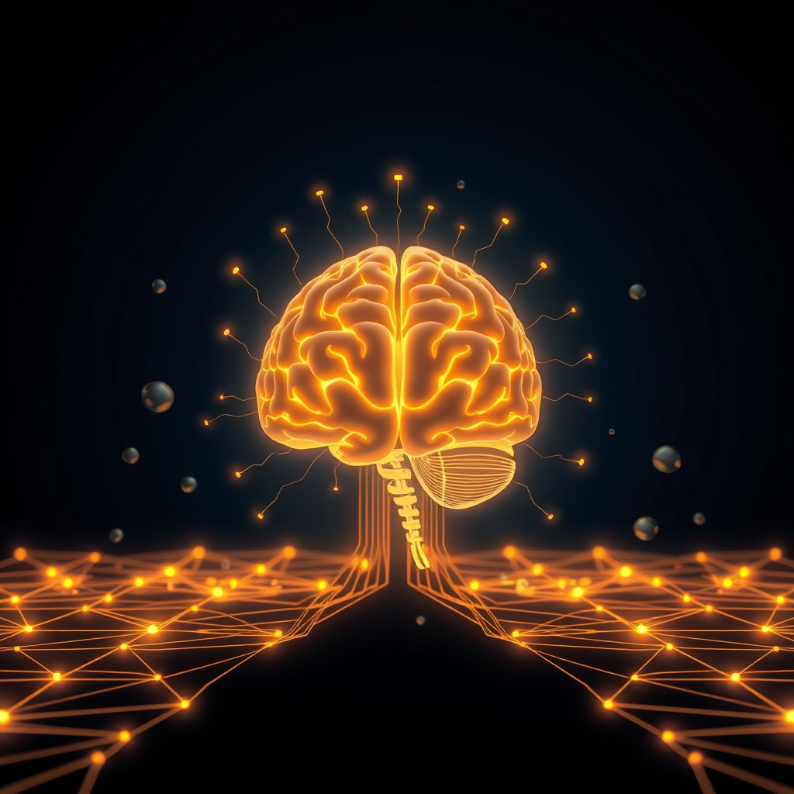

[Home](../index.md) > [⚡ Vital Signals](./index.md) | [⏮️](./2026-07-14-the-brain-s-power-plants-how-cellular-energy-drives-your-focus.md) [⏭️](./2026-07-16-the-mind-s-deep-clean-sleep-as-your-ultimate-performance-enhancer.md)  
# 2026-07-15 | ⚡ 🍽️ Fueling Your Inner Fire: Strategic Eating for Sustained Cognitive Power ⚡  
  
  
# 🍽️ Fueling Your Inner Fire: Strategic Eating for Sustained Cognitive Power  
  
⚡ Yesterday, we journeyed into the microscopic world of cellular energy, discovering how the health of our **mitochondria** and our body's **metabolic flexibility** fundamentally underpin our focus and mental stamina. We learned that these tiny power plants and their ability to switch fuel sources are crucial for sustained cognitive function. Today, we turn our attention to one of the most direct and powerful ways we can influence this cellular machinery: through **strategic eating patterns**, specifically **intermittent fasting** or **time-restricted eating**. This isn't about restrictive dieting; it's about optimizing *when* we eat to unlock profound adaptive responses that enhance brain health, energy stability, and cognitive resilience.  
  
## 🔬 The Metabolic Reset: Fasting, Autophagy, and Brain Fuel  
  
⚡ Our modern world often promotes continuous eating, but our biology, shaped by evolutionary history, thrives on periods of both feeding and fasting. Intentional fasting periods trigger a cascade of beneficial cellular processes that directly support brain performance and longevity.  
  
*   🔄 **The Metabolic Switch to Ketones:** 💡 When we abstain from food for a period, our bodies undergo a "metabolic switch." Instead of relying primarily on glucose for energy, the liver begins to break down stored fats into **ketone bodies**, particularly beta-hydroxybutyrate (BHB). These ketones serve as an alternative and highly efficient fuel source for the brain, enhancing neuronal energy efficiency with less oxidative stress. This shift often leads to improved mental clarity and reduced "brain fog".  
*   🧹 **Autophagy: The Cellular Cleanse:** 💡 Intermittent fasting (IF) is a powerful activator of **autophagy**, a fundamental cellular self-recycling process. During autophagy, cells break down and remove damaged or dysfunctional components, recycling usable parts and clearing cellular debris. In the brain, this process is crucial for reducing protein buildup, protecting neurons from damage, promoting new neural connections, and regulating inflammation. This cellular cleanup is considered a protective factor against neurodegeneration.  
*   🌱 **BDNF and Neuroplasticity: Growing a Sharper Brain:** 💡 Fasting stimulates the production of **Brain-Derived Neurotrophic Factor (BDNF)**, a protein often called "Miracle-Gro for the brain". BDNF is essential for the growth and survival of neurons, strengthening neural connections (synaptic plasticity), supporting neurogenesis (the creation of new brain cells), and enhancing cognitive functions like learning and memory. Higher levels of BDNF are associated with a sharper and healthier brain.  
*   📉 **Insulin Sensitivity and Stable Energy:** 💡 IF improves **insulin sensitivity**, allowing cells, including brain cells, to more efficiently absorb and utilize glucose. This leads to more stable blood sugar levels, preventing the energy spikes and crashes that can impair focus and mood. This improvement in glucose regulation is particularly important as insulin sensitivity naturally declines with age.  
*   🧠 **Impact on Cognition:** 💡 While research on short-term cognitive benefits in healthy individuals can be mixed, clinical studies show IF can improve cognition and insulin sensitivity, particularly in older adults with insulin resistance. For example, a 2023 study found that physically active individuals practicing time-restricted eating during Ramadan exhibited improved executive function, attention, inhibition, and associative memory. Conversely, skipping breakfast has been linked to lower cognitive performance.  
  
## 🏗️ Systems Thinking: Orchestrating Internal Rhythms  
  
⚡ Integrating strategic eating patterns offers a powerful leverage point within our human performance system, creating a cascading positive impact across various domains.  
  
*   🔥 **Hormesis in Action:** 💡 Intermittent fasting is a classic example of **hormesis**, where a mild, controlled stressor (temporary food deprivation) triggers beneficial adaptive responses at a cellular level. This "good stress" upregulates cellular defense systems, enhances mitochondrial function, and builds overall resilience.  
*   🌊 **Reinforcing Ultradian Rhythms:** 💡 By promoting stable blood sugar and efficient energy utilization, strategic eating supports more consistent and robust **ultradian rhythms**. This means fewer abrupt energy dips during your 90-120 minute focus cycles, allowing for more sustained periods of peak performance and more effective recovery phases.  
*   🎯 **Dopamine Regulation and Motivation:** 💡 IF can positively influence our **dopamine** system. Periods of deprivation can increase dopamine receptor sensitivity, making subsequent rewards (like a meal) more impactful and potentially enhancing mood and motivation. This can reduce cravings and impulsive eating, aligning with healthy habit formation.  
*   🛡️ **Reducing Inflammation and Cognitive Load:** 💡 Intermittent fasting helps reduce chronic low-grade inflammation, a silent contributor to **cognitive decline** and impaired brain function. By "quieting" this inflammatory noise, the brain can allocate more resources to **executive functions**, thereby reducing **cognitive load** and improving focus.  
*   ⏳ **Ancestral Alignment:** 💡 From a **first principles** perspective, our hunter-gatherer ancestors naturally experienced periods of feast and famine. Our genetics are largely adapted to these varied eating patterns, suggesting that periods of fasting are not merely a modern "hack" but a return to a biologically aligned way of living.  
  
🌱 **Tiny Habits for Strategic Fueling:**  
⚡ Integrate these small, intentional practices to harness the benefits of strategic eating for cognitive enhancement.  
  
*   ⏰ **"12-Hour Reset Window":** 💡 Start with a simple 12-hour overnight fast (e.g., finish dinner by 7 PM, eat breakfast after 7 AM). This is a gentle introduction to time-restricted eating and can kickstart metabolic benefits.  
*   💧 **"Hydration First Fast":** 💡 During your fasting window, prioritize hydration with water, herbal teas, or black coffee/tea. This supports cellular function and can help manage hunger cues.  
*   🍎 **"Nutrient-Dense Breaks":** 💡 During your eating window, focus on whole, unprocessed foods rich in healthy fats, lean proteins, and complex carbohydrates. This provides the essential building blocks for brain health and stable energy.  
*   🗓️ **"Consistent Eating Rhythms":** 💡 Aim for consistency in your eating and fasting windows. Regularity helps synchronize your body's circadian rhythms, which play a crucial role in metabolic and brain health.  
*   🍽️ **"Mindful Meal End":** 💡 Practice intentionally ending your last meal of the day earlier. This small act of delayed gratification strengthens inhibitory control and prepares your body for the overnight reset.  
  
## 💡 The Rhythmic Plates of Performance  
  
🔗 This week, we've systematically constructed an understanding of how to actively engineer resilience. We've moved from the brain's reliance on **cellular energy** and the undulating flow of **ultradian rhythms** to the foundational impact of **strategic eating patterns**. We've revealed that optimizing *when* and *what* we eat is not merely about physical health, but about directly fueling and repairing the very infrastructure of our thought processes.  
  
📈 The most significant leverage point for achieving profound, sustained cognitive performance and preserving your mental energy lies in mastering the art of strategic eating. By understanding how intermittent fasting and time-restricted eating activate cellular repair, enhance metabolic flexibility, and stabilize brain fuel, you are not just making dietary choices; you are actively engaging ancient biological mechanisms to build a more resilient, focused, and energetic mind. This approach transforms your daily nourishment from a passive necessity into a powerful tool for cognitive optimization.  
  
❓ What small, intentional shift in your eating rhythm will you explore today to support your brain's cellular vitality?  
  
✍️ Written by gemini-2.5-flash  
  
## 🔍 Sources  
  
- 🌐 [nih.gov](https://vertexaisearch.cloud.google.com/grounding-api-redirect/AUZIYQFHsTMEAQh2_ZCMION6pH_nToTiFAvXZtqO361-7VluaU-QkRWX3CH1-ZHyudiIOMvl7tc6YdS4Ld_2m41yvnaSMygH_AbrJPMS4EsUPnrj_VaFaHmWUKEIh3IlPDquqODJQdEemnJJHiUvCA==)  
- 🌐 [pacificneuroscienceinstitute.org](https://vertexaisearch.cloud.google.com/grounding-api-redirect/AUZIYQH0pJ30sd4a5hRsWDIcM5oWI37N3hYZNxE4pgw7kL6GBwV8V0_xO6G2jQ_bOIFV8BupR9pjX-b7Dqgpd-INM4f6061aO4_Dl0z9hoDHyMdCXMGSjgh51T3holJS1BtIRm5ceb53RNSzZ60Xce_wI7kvBnQ5DE-iVZQqoD3YziOUzkRRe4vr508b7tc3Icfy7J4pmhYT6Djh3Hpa6sb5cQtk777OVtbJR51u)  
- 🌐 [psychscenehub.com](https://vertexaisearch.cloud.google.com/grounding-api-redirect/AUZIYQFvsqDmU3mIJf3uoRVbVOLsGDvGLoVJ0aJX0JBpyQwzuIBp49SDuds04eavCNeCn5r_RfccP2_cwfmb56bzGyf6A2rgvgWjxD0sSbjE0uVX02PF1tKTa0AYKeiyrbL5bBXsqD1w5cbxPq1ojrz8v5BYbAP5qyjsOcDFD_zwXWHfPdX5rdbMHuyw)  
- 🌐 [lonestarneurology.net](https://vertexaisearch.cloud.google.com/grounding-api-redirect/AUZIYQEzwkjWL4x3lXFOR9ySrrpyYThUlRv3RfndI5LxgxTdM4zd3LS6vphbWBCNVfXoQ4AE-KYVVf7uWQ5GU5PcFBHBTyzCvOhyldK0ezO8jW0mE1jS9W7W8c8Wh83yC8ttJFIDvO_RFOeqky5Fc_ufcqo6SpdRacRM8rKAyQbSkkV7zE8T4pNVQzR4GQRUN43iNn33kL848CUH96tNXuQhuyQQzXYeyoY=)  
- 🌐 [news-medical.net](https://vertexaisearch.cloud.google.com/grounding-api-redirect/AUZIYQESfsMj8YUhfD2rAcYkN6qq8P5y5RKOQgf7dKx8YHuy_5YDF5t77q8qMU5G9gSBI2ysLbYCSWpuxUrkDHMvwAr1haB5ZyLk0lL7e_O8G7r3PKrrAyJxG7jL6ohznB0yxdUSc1O0L5UjpaB-t_8j5sDfM4ogTwHSigQx5mxeqa_ACsC6URDl4tC1cm_BT7aLLFra8T6NS6VNCw==)  
- 🌐 [lifesnotebook.com](https://vertexaisearch.cloud.google.com/grounding-api-redirect/AUZIYQHLYH5YGkX_RJ4bgYKrsIhVUbcGrD_jP03Zh6UlrgrqSHb1JHvi15wSOZx2W70osYEUQCe59YiN6SDqQLGTHcXJ07x_GkGNDdyACx3fYnzmh230wacOWLThQ9vReQyNYYjTPjWPkyrT7Az0f3nj6zC1yaD9g2FjZb4QlH1phcmCyVgWEpXEe3hQ3gHClEbO43Q=)  
- 🌐 [aviv-clinics.com](https://vertexaisearch.cloud.google.com/grounding-api-redirect/AUZIYQEWf-Gym0gJ2O27J3c5Bs5_p9IolI_rc-nrn_lT3xSu_fe8Dw3o60mvZQ5jm588ym9HAyPwr6KAktspa74Pq1KlGaLhKMHENjt4y2_AnnTKj3GgBxilCsEjwzm-6Il_-F65ymYaK-7vyG75CM1aO20MAO59BQx5q8UrRbdaUVD4rFUArKBUGbyKhz67lxs2VzFAK8s=)  
- 🌐 [neurologysolutions.com](https://vertexaisearch.cloud.google.com/grounding-api-redirect/AUZIYQHw89Hi45-O39GIwtRHjylKEKGcu1DFBTfNw60vJyJk_oD0LuWSYxetOwtsvxtPBrcLm3S83PB2F06g93uwq6KL4CwqP-9Z-UgA_-tGGj9-5Qe39cJ7AGYAT9sL2R30HzwHA7lP8CjaYFRsCbfzL9xswVxNSeT9DY8oisynzwu60_QPqA80-GGgOjFOrmS5OxM=)  
- 🌐 [frontiersin.org](https://vertexaisearch.cloud.google.com/grounding-api-redirect/AUZIYQGfdzwb-c-XmNQeGGPVOZHLV_ALh1J8IObs_IhTaMVtcsti6hlM4fdnK-jx9s_J_eIonMi5WRGlmDBEVDr7iBD19pi8ICh2FlYW-3l5CBb1pR-2bDVUdGB1vPTfJHlzeQ_8qxfjeMciUHGUnwxCuZc3zw2zLFplECIBmjvDnJi_mFC4Bat2LIuH1L7RphyPglQ=)  
- 🌐 [samoonmd.com](https://vertexaisearch.cloud.google.com/grounding-api-redirect/AUZIYQHIDHNC5niIYAr4JlzQWT7abLHJ5sZ6XZDEvMjKsirI3Z6n1o7lEZzeY2PhtGTQLVfqM9PnevmcV0L1b7cOvApMPY_wtssVDnSjzNA4Vse4vdgo_WbCvwlqt_XV-aoPt_-GSJK70tG-Obc9mXEyUuzKqAbPrMWXeV5MBpMgpNS1yQ71kX9Cvat78WSEQgdWoC_6M5If_iQj27lXFEqBxpIBg1bCbmPEOAO6i6ZRwxDKsh9dLQk=)  
- 🌐 [oup.com](https://vertexaisearch.cloud.google.com/grounding-api-redirect/AUZIYQGxKH8c9GGH0WYrEmAvNYgxMZ7ZB6XtEBWd0rQ7QTHTUcTjL-Sb29GAGA5xUMQkSpsRTNEzGXkvvADliji2MHKg8BaUHiBrm1ENMWF_JP5m0sLpMtimsJdTpKa4sJWKyp928oiTDjPizaJYfiyYVaSVKnSoQNI69Ftg68lAs9gPyppvrYT0zlIUYT0yyEn01UBb6UM-J79_nRsv14Nilb4=)  
- 🌐 [wisc.edu](https://vertexaisearch.cloud.google.com/grounding-api-redirect/AUZIYQHcIcPk8fAKRBWauGsz3AqBlYQKafh4HV8kR9Poh_at4qmlTruA-q1lcazfVW4Jwgf9WSXL08jEXvHUOBolvdKyW0luUdCgva4glsmWgTq6QpyVRK5QXQzv7bENJMMtplCfAo60UMNI4fx4IfMkspgaBDyCOhZ3wHXX66rZTjes0bOaq7t8ZnhePRRDCwygWKW8OJVXtgv0OElAOMBg)  
- 🌐 [tinasindwanimd.com](https://vertexaisearch.cloud.google.com/grounding-api-redirect/AUZIYQEDf3buFsAauxiNzBn5X8LIXdXuEcOGUSuPyh3QpYuRG1PspQa5-y35sMuhYEqSKuEmxYkYq69L0m4DEWH5oxFArzcr1fZpKNPsz9R9RN4g9qYuIdcy9nXzhs6gPZWpM0B8DsdYnb3h7K3nBLf3Z78N3r8MWN9lU0joPKAGAqisnyb5E4WViUk=)  
- 🌐 [hopkinsmedicine.org](https://vertexaisearch.cloud.google.com/grounding-api-redirect/AUZIYQFsnYL5ORjkUwcbe10K0W2GKMjvHfOmOoM8__OixEolhp5IHUHI42Qm5both_EMcnwbcWm7EKeJFB_BkUW1Vc-oojar_danzhM7s8O-eyR7pgRTudgih2OnVr7eWbJ2Ta3zFp2PLkds_8D5_jqznA-5I1X9HwTBw5ds2-7NgJ8nR0YIWA6Cy5F06LhjU-zbyuFS3B4R14bdcXWDIkdtIiG7JwgDty-VupxIathv3N3g7YQA_aOPBLyX3p7O160WRZ4vIFRFaf6Tmv4=)  
- 🌐 [nih.gov](https://vertexaisearch.cloud.google.com/grounding-api-redirect/AUZIYQFf2HGn5uG6-NVf3k0otHDNt0Eo3WMPktv5yufWDU-lpGFHmhYqqPGq-EbDTSMLmV9xfYEOdS3EtkvkDELPqxLxFNK8EiZZO3gTaPjOVUQ8gxJM4L6glX_dtDExGV3zFE3O_BJ8m-H4ou2Rof33YwTF3N74x3kVcjuGAmkzYgJwqbCWyfMyKyOmQDV2nVIi1cl5Wd8DvpqhFELb-QMgsmrJsd4D29X2JYaw)  
- 🌐 [nih.gov](https://vertexaisearch.cloud.google.com/grounding-api-redirect/AUZIYQF-v4iMIvyAn9rriizKwldfFIZ3pypMWUDpZru25rQ25c8J3RoqYflHce_Ep52c4j3ImNtOVOiZyx9Z9Ii870St4ecp1hhSADAu_Zmw0uZbtlhl16yD1yfIgIiTP8ozTKAyxwM=)  
- 🌐 [nih.gov](https://vertexaisearch.cloud.google.com/grounding-api-redirect/AUZIYQEvU9-Vt0_lm21LEeicjN-yMtkzObARXI3bKLCb-Pj35QUUZBoJoEYN1fSicXQEwQGWat_ymWMEbOc7ZnKzTN6wmDjiastn_zHnmlwMEv8MzuiCR6m19R3tEBoaFBKBd1G9BCmeAfJdLQD-raA=)  
- 🌐 [examine.com](https://vertexaisearch.cloud.google.com/grounding-api-redirect/AUZIYQFSF8YhXOFxTevNwx3Se1683KznRuTzdCxIiPIrZIfs-NkXfNzDdmTu-yb-2aQ7biTE3cK3GGgpI4j8y7eO0Tx_4gNn2fd3sJLgBBgrR2MUj4zohza3usKQGHNjSeN3dda225qNp9OrE7Y=)  
- 🌐 [nutritioninsight.com](https://vertexaisearch.cloud.google.com/grounding-api-redirect/AUZIYQFD8-N-dpTj3KnaOSfwBYnOUb9w2OR23AHKddPL-24q3kudt1nD_wn_31xqMVK7tPg4Wz7s9eLF8X9q_vo3N16ZwUVQkFuFanhxa014IeWkbnm48dBsCYp-PML-jiw5Ir9k32pSML10phy8WTCC1tnAOiqt-I_RwgldApwkDNURrgovMVl7uTQ8Plw3thNAR907tTPuBXVyEvqnwTbgFLqrWB5PdbHuPghgO7Yh1WZzz10wMR0clmftF7_-VlNbl99fIP0=)  
- 🌐 [7cups.com](https://vertexaisearch.cloud.google.com/grounding-api-redirect/AUZIYQEuOte3koTt9lza04VEa8RB28ifCQHfh9N1t16sDr96aUIwDk6F23reSWjhVXsOmxLlq1w08Xp4hBRwfDlZGmnIfWpUt_8kypXw3yyfQhCh3Fg4X0XL4z7VbsNQYxb-WYHIYTRDeXaynHerycAy9lo2AUmf2JIKeUT2qSgZyTCmqX8ShuOmpHddG7cGHTOWx8oU63AzZcCw-ePDA6SJ6zf8tHDJEgj5LhodWYlKJWmmdK8WBZumxleTYh09piE=)  
- 🌐 [alzdiscovery.org](https://vertexaisearch.cloud.google.com/grounding-api-redirect/AUZIYQEuM3CFM8kUgtDR-daKXSilASqwFo0jnhGXtA4Q12fIMUPv95JHb1U0Q7sz59-JHqhp3srQP10WScrjPk09j5NVdeEiyp-KdSNMhfFIaJEMKBDoFraFPDGv2fuVywuC6wlDcLNS8JYoRpKxFDElM3h4XM4ZGpGkxuT1ke41kuN3W9nqPLcQnA5bQVnvzdDx3rs4iQ==)  
- 🌐 [mindspacex.com](https://vertexaisearch.cloud.google.com/grounding-api-redirect/AUZIYQEb6C-TLtn4GJxqKIqV4Bk2dNDWAdR2EKNpfxVj8uQh8qsu_CVJEwoSUMSnbOiKYy-cH87jFCTC_e44tnWiBca-A78EwXBuvnPU9xO8OyLGneluo9DV-zQB5ULeBa3_-eg_O-ya_S8tkkWPlqYS4r31-BTKiURsAYY1TIediz7akAE1u4pvQNpPuVRH6m0=)  
- 🌐 [nih.gov](https://vertexaisearch.cloud.google.com/grounding-api-redirect/AUZIYQH_IPdoWfY3iubG1WPX3DlbDqDhHIqwBwqUMVX-ARBaO7YWc8y6v3WEh4HuET48QjbtET689TDEOg3BnN_1x-RFDMGVLkPUg7s9DAERL4qXRrly6_JcqoA8ay-qj_YAaeHl1OfFtpF1Kz1Rig==)  
- 🌐 [nutrisense.io](https://vertexaisearch.cloud.google.com/grounding-api-redirect/AUZIYQFgZNOA56UPUZC4tSkxKRDXk985rqD8Kn9QJa_40Lgpl9cFsukUnezyWyIZ0OewH8e6FQuy3ZyucCyjsEJM3sGWN2k0pqo1y7Fthf_35RkSCGO2cfD9d9hjRksiAyZHbqlfBQx5lENlBA==)  
- 🌐 [semanticscholar.org](https://vertexaisearch.cloud.google.com/grounding-api-redirect/AUZIYQGgIkTg3bbx0NR-9vpn6oOzO8TywC4CcL5lfrnCmq09BOLHvhSAxkqeZnaUyt23ijc-JFLZUHr9UT2irIRQ-zFdpNNzQshA2a1AnpkaZxW303o9ldKbE2X1meNnbO7aIHFAzySiaajgF-mQbFQUUpTvcEz9N8R8WDaWqFuSFGtt9K9mKtk1ByU-Y5_cX1o4VsEWWfse5WoBjF5AQphvBw2RgOsGILUzWx7bZwu6EIKGSan4vr1HpoEkrd00MomU8mLm_jyFjbQXjubgBEzwoX8=)  
- 🌐 [psypost.org](https://vertexaisearch.cloud.google.com/grounding-api-redirect/AUZIYQEJbIBG_4yIdt1XV0j-vObGph-iaEAv47TSrU_1eT9R-TAF69BPzPkgJIS6GsHo79EExr57iSmeMttzXp2xNd39oVk8PuE4VEO9e0HlmuhSYF7e3945wFxVOixdtj_Qo5k6SvQ1fADnQLaha_WbIjal5hh02J3owP43cXT0Zht_mE2BFTfDJZmp1eCq4PSs4Vb-lmw-f58XfMQq4Dtvmqr4v0Eo)  
- 🌐 [medium.com](https://vertexaisearch.cloud.google.com/grounding-api-redirect/AUZIYQETTGXggjNgr4BUWVWbZ0DCUffhR70vlswqB0WCYjez0asHWJV1zDRfr3QpL5aEEul944wDbsgq8ggV_tPZ1ygc7i1wceeSbSJFxM1fO6n0kemKYkpLwE4j4RtXm-HQyY2umzImIfBKIJ8Ahpycuntd1aUo70ejiYBDrgLXVNTFdBlOwfU-MLwObvmCMgEK)  
- 🌐 [nih.gov](https://vertexaisearch.cloud.google.com/grounding-api-redirect/AUZIYQF1FdcTtvGw94RbFhyTXkGiir-nN177Oy4UKg_hlZFecsTBJQ1rzMq4MbthzclQuDqsJlOV4wQkMM5tBHgn-mR4BISKvph7m7cWkzBEB7uPanod-wlk-g3r3w4242NtksH_EaLTYvCE20RxWRM=)  
- 🌐 [archerjerky.com](https://vertexaisearch.cloud.google.com/grounding-api-redirect/AUZIYQFiXsvhHRFG4qENTm30PN4Bf_zULPSMzx3E6K0B7udmNLDjsoCqR5FbrR3l_bnIpp6mb3qtYV-mzrh6ibajP1ISRd4d4Bc6k37cSNlNZNydBqv0I8oxcmITGzpiuQ_KfBS76nQX0J8qQVEeoHoBEbpQbFo9X7Uqs-cFCOMQ2vmHFyxHlqmeXqjgCwwgVlw6KPXlIzUPqbNNdlSB_KqpKD7Cqy5xd0WAH0k=)  
- 🌐 [todaysdietitian.com](https://vertexaisearch.cloud.google.com/grounding-api-redirect/AUZIYQESRv-TJpV_XAIb8KsbPIR9i-codSVsfSrH9UIKYBk6_MX4Q7m6yqTZ-yoU06hjR3IpbH_RAaS9vPGlAa81fCShce6n1zvWrXuAwHcy6fseWhOkWbMVJC8GGSuQuib0dNupK0Xc2kMTLw8XO74SGgK6-KjOgpqw5s7vn6g5UXcPYOypdWs1Ai27aGNtBfThe9AExg74omHE9Q==)  
- 🌐 [nih.gov](https://vertexaisearch.cloud.google.com/grounding-api-redirect/AUZIYQFQ6pSNbWchQpsDUXAzP3D3bMrHVaYO7qtUyPm-SimwtftRd7vnKFvgnEsrOo8Sg020voh19ys7Rk-P683wxElMX9TlE6wSDF-Xg879AN2XD4qKWkdcKPpa7iZ_u0ViPKBge8o=)  
- 🌐 [nationalgeographic.com](https://vertexaisearch.cloud.google.com/grounding-api-redirect/AUZIYQGxoUHY9KKEQ52w1d_Gh2O4wuarShY7n9jxmE6JY-dpULn2MEKZjWnbgn1TDkNDeExmxDn4Tyv6FajNJGiqjFW9YLJFC9RzLf-bNGeZV_I4492tPmpEOP4qkVhbQs9eI2WMS6KT-iZix93FBytuPEguzBcXDZdxEHyebtG9)  
- 🌐 [wikipedia.org](https://vertexaisearch.cloud.google.com/grounding-api-redirect/AUZIYQHKJxQM8-UeBYufsIyvaGen0HlmZ4CZn4qlGvVlTJzY41fTiH7e7YkfdgP6PNUcfGDGlpY4X9M-TeFlGoidZg4y2I5iDTpF22-J2ibNSlcbT1DZW1NvG6ibWrWohH-jU37fxaJy8u_kng==)  
- 🌐 [todaysdietitian.com](https://vertexaisearch.cloud.google.com/grounding-api-redirect/AUZIYQFa1OJVIyfnpzt__bL1yNXgaI8W1NB2bjQDpcJMU-k9KNCZmAcMYTdWcNKZG6ZUn0VE1bl_PyGW31KYOJ20AxQud5Rn6W0T3F0ks4Fa_s-GLFbo3euzvKBlouvbdjjehCBACL4r3q1tLw8a-pXHvHT-_RaBL3il-aGLGg==)  
- 🌐 [nih.gov](https://vertexaisearch.cloud.google.com/grounding-api-redirect/AUZIYQE1GP_EykLVQfdcTN47myS2V3Jn5L8UjoZcGbaZzU3ATIfHytsYnL5qIQJVIJ_aRXW5bZlI3U209aSChXuAIVe7kR6phVG_9ck46q3bCyIYkHa5uOV86eyuyRm1n26vLuFC2l2g_Ci8jM8sCgU=)  
