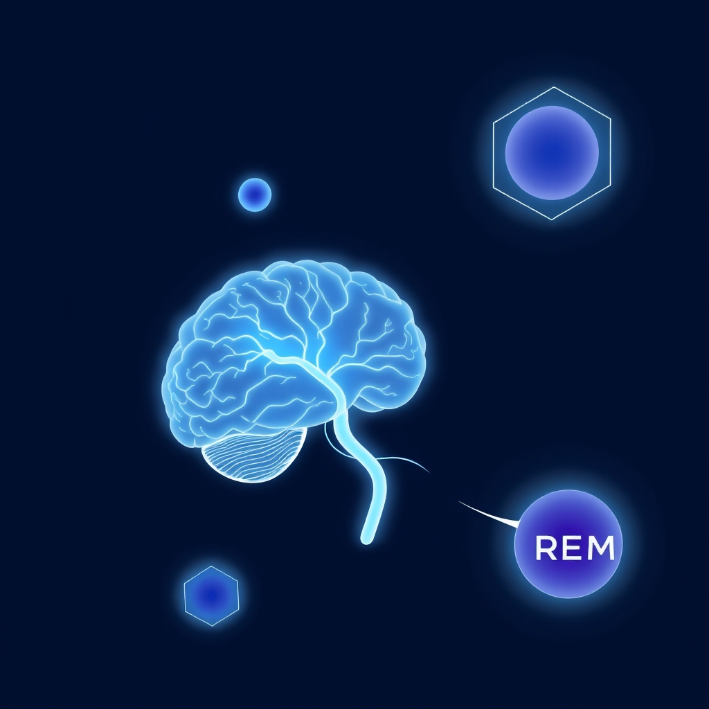

[Home](../index.md) > [⚡ Vital Signals](./index.md) | [⏮️](./2026-07-15-fueling-your-inner-fire-strategic-eating-for-sustained-cognitive-power.md) [⏭️](./2026-07-17-the-dynamic-brain-movement-as-a-master-key-for-cognitive-performance.md)  
# 2026-07-16 | ⚡ 😴 The Mind's Deep Clean: Sleep as Your Ultimate Performance Enhancer ⚡  
  
  
# 😴 The Mind's Deep Clean: Sleep as Your Ultimate Performance Enhancer  
  
⚡ Yesterday, we explored how strategic eating patterns, particularly intermittent fasting, can unlock profound adaptive responses that enhance brain health and energy stability by promoting metabolic flexibility and cellular cleansing. We learned that intelligently managing *when* we eat can optimize our internal cellular machinery. Today, we turn our attention to the most foundational and non-negotiable aspect of human performance: **sleep**. Far from being a passive state, sleep is an active, dynamic process during which your brain performs critical maintenance, consolidates learning, and detoxifies itself. Neglecting this biological imperative is a direct path to impaired cognitive function, reduced emotional resilience, and a decline in overall health. Prioritizing quality sleep is not a luxury; it's the ultimate performance-enhancing strategy.  
  
## 🔬 The Brain's Night Shift: Repair, Reorganization, and Renewal  
  
⚡ While you're resting, your brain is working tirelessly, cycling through distinct stages, each with vital functions for optimizing your waking performance.  
  
*   🌊 **The Glymphatic System: Your Brain's Plumbing:** 💡 During deep sleep, your brain activates its specialized waste removal system, the **glymphatic system**. This network of perivascular channels flushes out metabolic byproducts that accumulate during wakefulness, including neurotoxic proteins like amyloid-beta and tau, which are implicated in neurodegenerative diseases. Research, including studies by Dr. Maiken Nedergaard in 2012, showed that this system is significantly more active during sleep, making it crucial for brain health and preventing cognitive decline.  
*   🧠 **Deep Sleep: Memory Consolidation and Executive Function:** 💡 The deepest stage of non-rapid eye movement (NREM) sleep, often called slow-wave sleep, is a powerhouse for **memory consolidation**. During this phase, new information acquired during the day is reactivated and transferred from temporary storage in the hippocampus to more permanent archives in the cerebral cortex. Deep sleep also plays a critical role in restoring the **prefrontal cortex**, which governs **executive functions** like working memory, inhibitory control, and decision-making. One night of sleep deprivation has been shown to impair executive function.  
*   💭 **REM Sleep: Emotional Processing and Creativity:** 💡 Rapid eye movement (REM) sleep, characterized by vivid dreaming, is essential for emotional regulation, creative problem-solving, and the consolidation of procedural and emotional memories. During REM sleep, emotional memories are reprocessed in a low-stress neurochemical environment, helping to reduce their emotional charge and foster emotional resilience. Studies show that adequate REM sleep can lead to a significant reduction in emotional reactivity to stressful memories the following day.  
*   🔋 **Mitochondrial Restoration and Cellular Energy:** 💡 Sleep is crucial for the restoration and efficiency of your cellular powerhouses, the **mitochondria**, which we discussed two days ago. During sleep, the body reduces oxidative stress, regulates mitochondrial dynamics (fission and fusion), and enhances ATP synthesis, ensuring your cells are primed for optimal energy production during wakefulness. Research suggests that sleep pressure itself builds as mitochondria in key neurons become overworked, triggering the need for sleep to restore equilibrium.  
*   ⚖️ **Hormonal Balance and Neuroplasticity:** 💡 Sleep profoundly impacts the balance of critical hormones, including those affecting hunger (ghrelin and leptin), stress (cortisol), and growth hormone. Adequate sleep is also fundamental for **neuroplasticity**, the brain's ability to reorganize and form new connections, essential for learning and memory. Without sufficient sleep, the brain struggles to adapt, leading to reduced cognitive flexibility and impaired memory.  
  
## 🏗️ Systems Thinking: The Restorative Engine of Performance  
  
⚡ Prioritizing quality sleep is arguably the single most impactful leverage point within our human performance system. It acts as a foundational reset, creating cascading positive effects across all other domains.  
  
*   🔄 **Anchoring Ultradian Rhythms:** 💡 By fully engaging in restorative sleep, we strengthen our **circadian rhythms** and provide the necessary recovery that supports robust **ultradian rhythms** during the day. This reduces the severity of natural energy dips and enhances our capacity for sustained focus.  
*   🛡️ **Fortifying Executive Function:** 💡 Restoring the **prefrontal cortex** through sleep directly fortifies **working memory** and **inhibitory control**, the executive functions we discussed yesterday. This reduces **cognitive load**, prevents **decision fatigue**, and enables more deliberate, less impulsive actions.  
*   📊 **Metabolic Mastery:** 💡 Sleep plays a crucial role in maintaining **metabolic flexibility** by regulating hormones like ghrelin and leptin, which impact appetite and energy expenditure. Disrupted sleep can lead to insulin resistance and impaired glucose regulation, undermining the benefits of strategic eating.  
*   🔥 **Resilience Against Allostatic Load:** 💡 Quality sleep is a powerful antidote to **allostatic load**, the wear and tear of chronic stress. It allows the body to repair, reduces inflammation, and rebalances neurochemistry, building a deeper physiological resilience against future stressors.  
*   🌱 **Nourishing Neuroplasticity:** 💡 Sleep is the prime time for the brain to consolidate learning and reorganize neural pathways, directly enhancing **neuroplasticity**. This means better learning, memory, and adaptability, making every waking effort more productive.  
  
🌱 **Tiny Habits for Deeper Sleep and Sharper Cognition:**  
⚡ Integrate these small, intentional practices to transform your sleep into a powerful cognitive advantage.  
  
*   ⏰ **"Consistent Sleep-Wake Anchor":** 💡 Go to bed and wake up at roughly the same time every day, even on weekends. This strengthens your **circadian rhythm**, signaling to your body when to be awake and when to rest.  
*   🌙 **"Evening Wind-Down Ritual":** 💡 Create a relaxing routine 60-90 minutes before bed. This could include dimming lights, reading a physical book, taking a warm bath, or practicing gentle stretching. Avoid stimulating screens.  
*   🚫 **"Caffeine Cut-Off Time":** 💡 Limit caffeine intake to before noon. Caffeine has a long half-life and can interfere with deep sleep, even if you don't feel its stimulating effects.  
*   🍽️ **"Meal Timing for Melatonin":** 💡 Finish your last substantial meal at least 2-3 hours before bedtime. This allows your digestive system to process food, preventing metabolic activity from interfering with sleep onset and quality.  
*   🌬️ **"Cool, Dark, Quiet Sanctuary":** 💡 Optimize your bedroom environment. Keep it cool (ideally 65-68°F or 18-20°C), as dark as possible, and quiet. Even small amounts of light or noise can disrupt sleep architecture.  
  
## 💡 The Unseen Foundation of Mental Vitality  
  
🔗 This week, we've systematically constructed an understanding of how to actively engineer resilience, moving from the rhythmic flow of **ultradian waves** to the fundamental **cellular energy** systems, and the adaptive power of **strategic eating**. Today, we've layered on the most critical element: **sleep**. We've revealed that true human performance isn't about pushing through exhaustion, but about intelligently honoring our biological need for profound rest and repair.  
  
📈 The most significant leverage point for achieving profound, sustained cognitive performance and preserving your mental vitality lies in mastering the art and science of sleep. By understanding how deep and REM sleep actively cleanses your brain, consolidates memories, restores executive functions, and recharges cellular energy, you are not merely resting; you are engaging in a highly sophisticated biological process that underpins every aspect of your waking self. This approach transforms sleep from a passive necessity into a powerful, active tool for cognitive optimization, emotional balance, and overall well-being.  
  
❓ What one intentional step will you take tonight to protect your sleep, knowing it's the ultimate investment in your brain's performance?  
  
✍️ Written by gemini-2.5-flash  
  
## 🔍 Sources  
  
- 🌐 [clevelandclinic.org](https://vertexaisearch.cloud.google.com/grounding-api-redirect/AUZIYQEvkhUYKzDI3YqjKmANgeWm3cKkKwURjlO9xsuk5KavXmuYHJ6R4n1E4yUBCXMQTdedcnekkdaiO9huxioVO3F6IbkW2Uiwt7KTQCwGmO-V944fMd8JnKpjhdOZb0HTcZOrfUxXyCu8DW1DHhVKGfffj9dN4we5YA==)  
- 🌐 [resilienthealthaustin.com](https://vertexaisearch.cloud.google.com/grounding-api-redirect/AUZIYQF1gpTalI_bHMTP2_s1qEPPbGvHVX-_8t1QCsPyN9ZfmodSi0EQbD-tiGPlThQgNFUDpndx4Io_HWri5bPJEiavXECsinpkygqXiaIIwnRwoJaPuOJO5xH8VE7Lh0CE4uVXuGKeisKGNoEq8WPNB35uptCUtph4MsTUsz4wCOaM31sj4XXqzDemX7G3nRg=)  
- 🌐 [ean.org](https://vertexaisearch.cloud.google.com/grounding-api-redirect/AUZIYQHCWci-DlD_6cNCABgwfkN3CIsRezNCvO2VZ_OIYv1JP9zDvI4i9Gqlx0znEwEx4Ot9lfVcqVKhtb70jR7MJvdU-yJtS5KLasotK1bWKoWdpcIL-kyw2_zQDCQ_5bJRIkf2h5P5WA-PTXuQJAGk4LNHepKyV6dGXdNUfdXXCWvwBvSQ2_ut8Z131qwY90AXATM_7vF5FW4lHd2y)  
- 🌐 [nih.gov](https://vertexaisearch.cloud.google.com/grounding-api-redirect/AUZIYQFemg2Bo-lvOowxa4L9ruw3yg99TQbZhekmB6Nqp5XDVNlSczGfrYGQ8e-u733gGefUoEbEIkekMVlw7tQJIVkTprku_1g9jbH78nbIrlJB6FlkK1r-ZmWermKqWMRVY0QeT30S0dzsGUqQJY8=)  
- 🌐 [foundmyfitness.com](https://vertexaisearch.cloud.google.com/grounding-api-redirect/AUZIYQGpi0kW4OMN87Ngad30BYMFTSzMWvSJgDbVdf-GfLys_Kov3KZbLh2paFJstk3uelZZD6YTevohoQcuVPB9A90DLpwcNZ0sH60AmPsgRrquLewvb97i97USlTaAIQcF8dLxj3m3HucGQPaU5u07nwMqEQ==)  
- 🌐 [case.edu](https://vertexaisearch.cloud.google.com/grounding-api-redirect/AUZIYQG6eNZOJs750yffDIczDb0-tZ2ZJBTqZ5pEWWrbT8Es8WNQEaDojC3Un7DSCG0CrUwsAsWPjuOVroSoVJqPHSmgjGERBsMUbXDCjD_SkhCooiLYuRhzXFe9_4sEJy4op1u5Atfww7WdQJ7_v8qS--hrb46fYfO4pyiQBEokH-FAnC5cafBooBeg)  
- 🌐 [creyos.com](https://vertexaisearch.cloud.google.com/grounding-api-redirect/AUZIYQEI9xrYYt_Kw--_4DQhHpV-ImqfmwyXXrLdkGQzt4rPIN8EaXPoTOJmE2CL8qHNeMzpvHSu-C9AqpAyhVKOKiGG5xxacWZHWgT99zYVWnL7EqhRqNaw46czQMkMaBfOREq5XNmIAFv68PDu8jIaEZk=)  
- 🌐 [cogniguard.com](https://vertexaisearch.cloud.google.com/grounding-api-redirect/AUZIYQF5cYe92L1leUQhyPIrYxYwEga3JKUyVK1-k96H92xj7uJbLDxhYTb2awm7x1wvXBbk4lcw5QaIxYxUKAdsBa1HV28zwce2_yacc9Kb4CXsVzXekiEbS0O2yPiZXOzlKrTuTgoR68YvZb3Qi7FgUD4p3LfuARFg1MTzs9RGsKOxiO6bMYLWejRtpWe6FzQhRtlsy27DfPDIehg1UQ==)  
- 🌐 [atlasofscience.org](https://vertexaisearch.cloud.google.com/grounding-api-redirect/AUZIYQFiXX9vMGwbgzEaZvRtR0gjHPkc8sLJ_qMl7c7eN-N8-ccKSghsXULKKoJMECT0vXeoaoD5mlG-BYR49gPLtuPOePqpJpNwK1Bof6m15Yyw7xcwnJ2a3A1nR-CIXomfH7T2MVuUOenpsz8yNJnLXwysfoTiABabOMWZZa796RPuzLs5WDNqr1i2wgQ=)  
- 🌐 [harvard.edu](https://vertexaisearch.cloud.google.com/grounding-api-redirect/AUZIYQFllCpVaTeNQfdMBliQvJd7ytKXhIEFVbglusKd69N2ARpMS03ufFtcqxGQusE9IN_MOT6YvTLCp-Pa5EyCZ9gku5Il4srAdy6CJwlfaMurNbqllJL5XnHiIIcatwHkNeGFf_3seVFWhjiZ7tVNL65LoQviuQHVqC-IAs_D)  
- 🌐 [nfil.net](https://vertexaisearch.cloud.google.com/grounding-api-redirect/AUZIYQEZt2OaQx2H9fYX_0DhAWGQhu-TTFDssEsvXTTL6tDvNcXj_wgYjfPvkBa_2Varu5eXPLX94bfsNgnpb2alglDenj9K5oLFVWCEQDXKV_-X9BHZct8Xddb_M2EAgilhlm_GBYSaaHYCGUKGRerMcYmBNaL_4FUXrikwWHsj3FukXpBG6rOVMvbIwjc=)  
- 🌐 [ancsleep.com](https://vertexaisearch.cloud.google.com/grounding-api-redirect/AUZIYQHVuRmft8Nu8tm-Bb7fO1rjgQJuiAodmW6_te7o_3C5jFpuQLQZWwXBIUU71Xs0Y1Xzc5-e293owbxLu46VVw_QkFfC7ytaUo42A09ESA3XjGEGQzO0WTM1PTyE84o7Kh0Ep-bmtzv5mHMeuVkxUukNIUYUNLxPAUtFPP9iwwj0cxk=)  
- 🌐 [frontiersin.org](https://vertexaisearch.cloud.google.com/grounding-api-redirect/AUZIYQF0tTa9uKjrUaI1a1RuR-9qVPQ258xTZF8x8DVuFg6jzCpPnl-HAG5Mz1gkI8YekNF0mf23Bx7R83OPucoYomZ0d68x8NP9O8R2iEVBYNORFuvznlz2wrfDlbPGcm-TzIo-8a7K7oBpEumoUHVLImbbDCr-dhPFKHk7H3IrcJzDrULlP9ule1oclNnCLdLmO9-J3CMb7HtrrVL5VGCJjkB8_isl7G1WPlhMqm219eA2kDt4p5VGkZlMlfMrsMpimfOc1d0=)  
- 🌐 [psychologytoday.com](https://vertexaisearch.cloud.google.com/grounding-api-redirect/AUZIYQEwopCb7SpMPqGDDrotCPTmXdlstJOonSjoirqYqSfMmBZoxBkjWHmbnFeMEtifJ1QUR15djJ61s6_nfYn5FvRdSecH8Apd3C-M0M055Ar8-Ta3M6k5zNxCXvRMcHQq_k9pquAWsdhO8yrJ2cKDOwh1cj3G4XLh86E7Km8l508Pj4RZEu2TItEqURfmtdQXkgIywmOPKl6C44w5P-G988mQTnC_Bd7A5s8=)  
- 🌐 [nih.gov](https://vertexaisearch.cloud.google.com/grounding-api-redirect/AUZIYQEDIPcN9YOilkvGgZ2nB5xk2B7RH7r6Paxo93gMM_EMON_shYwfnRGzKkcdi8OGaG7kk64LNXSLZ8VhsnZZakg9HL-ANJJX97tjWLMyvj5na3LYEKI-Cl396z-E1AjR0Vn26-aM_5ochvXd3gw=)  
- 🌐 [sleep.me](https://vertexaisearch.cloud.google.com/grounding-api-redirect/AUZIYQEn1OtG3uWDjqCaocUwpgRWQa4l7P_340RXJMXMVFVN1Fq-EDZrmmicjsRhuWNV4WwBiyT9aaNFCjyaNB9iamen2Y7hXjgj8w1nhbNckVF_ILGVRuR0fLBuZzI8QzfTwanm5PuM0zYDpSrLxA==)  
- 🌐 [nih.gov](https://vertexaisearch.cloud.google.com/grounding-api-redirect/AUZIYQF0ySaHwdPE_T60xBAWzSopkxUQNwxc8y-sLyPJSmYzZN3ZU73v1STjwn7IqFpwgQHVwGO3AhW9tCPmbxdGNVMtARFGmpGQsq42G05qRsbvWXTSdl35-hH2tYRpGoX79pP6cY5Bs3ujUMu3Oek=)  
- 🌐 [sleepfoundation.org](https://vertexaisearch.cloud.google.com/grounding-api-redirect/AUZIYQHuSs4G_GLHWTsNK-iVZVKRSH_-AKjtGKbVTPSe5OX7fVyZkZ4nt2SExSJJjPmOFq7BWCqv78avbsvBWn29XPphDd79uCK_0s28Nw6PMQyN_YkbQ55iHWGkM0e1T6g3Ki99FNGo0rMB-ZGUBM93FsF8k3c8d66ya3IwGdw9tsKQsjyw-_NIhO7ro4B1XfHvOkfMKTk=)  
- 🌐 [berkeley.edu](https://vertexaisearch.cloud.google.com/grounding-api-redirect/AUZIYQH0VIFk7GTvW9SBK7FG1TGXaXw1XMdbwKyh-qgA3XS6HS1m2fpoLGV4JiUhm6ZyQTVtc0no1YtSS6vjfy_xvCrgs3EGSKrq4O_D4giDyr6Kxaessw9fsRYVX1NjGbWyMgeMx9D7bVp3b93RtaCdsRtWp0U9yjlVKM1mI3t5ExYfIA0B)  
- 🌐 [psychologytoday.com](https://vertexaisearch.cloud.google.com/grounding-api-redirect/AUZIYQFCYK4zjFfEgmKSm9FUi7bRHOglpr4LzyCTqwd3yNKU2K3BXkvf2PlbaO_dKTMixYPgTSOFwe_fjXEWiG6ZoQ31COhKoQVwYe2EzuxXg7psrzNexb8vrMsUihlxuje8HgtJlGBafdZAwiP6ItT2F3XZSqge2tJP0Q6fELf3TB6baHsGSV9qRcJV3IpiJXLM8kOmASHCXiN2VByLE8hENERUDBQ-BLXcxZpn9n6c)  
- 🌐 [drkumardiscovery.com](https://vertexaisearch.cloud.google.com/grounding-api-redirect/AUZIYQEzjQjsLE56C2DI8QazNiDUHW2G2Eqit5j8geFjjH1Loq5ozGP29O1MClpX5KO5RZ_MPJNaVKUDbV9Lo_9jT3wBO-BltzelqMWTCyq2B5mmbBPGutX05xGIiedB-fY3uV-XHlBb_Ia78dyoIzE_jxImblJl0CtxV7jyJv0FddoLN0yAW5gKF4MVE9q3ruhwH_qAavcHeFM=)  
- 🌐 [ubiehealth.com](https://vertexaisearch.cloud.google.com/grounding-api-redirect/AUZIYQHw6hFeB9eV6MxZDuVz-hcnT-c_EXArlt_ABjDBEZf2aepiGu-qE5H8uL4tyjWPVs3cpQWRkCxSEr5SFfc6i4-q959GBtI4Pi4MkMJzAfk2H-r0C6yts0tRG68TuhwZNahrFuRo0tY360e9eHMBpYtT3HBg8noV_Tq00k8eZAB-B7G2Pyjzo2gDT01F9XBrWWzywuwGZg==)  
- 🌐 [frontiersin.org](https://vertexaisearch.cloud.google.com/grounding-api-redirect/AUZIYQHteCjGjEeF8d1wy2cJUgsUZIwSJLnJWiWPb1c6JgYXs6c1pPKJxWwZH1Qb7wZxipLbBR9bJH4a5xZlUV73y9iKBsHG9ea4CodTwaFkVNILH0DGOjkZFiDFqQUsY3eTtPTOLtYmgkZiaOJrre6-cO6cK0glBF1M1yPoelsBsDPpjBjZSVmkFt7hMya3SU5n)  
- 🌐 [nih.gov](https://vertexaisearch.cloud.google.com/grounding-api-redirect/AUZIYQFYpG86rcouL8NkymWiay4IneYjBMGz90NQ8KD_w5GEHc2nSQHTZs36Y9SyUU0FmB3NYDryprvScTv-Gb5ev8IY7B0AcE12A8uP-J0_BjM6QIuhjVGdwFMgTGsnvlmFIldZfO-8EGURxBVUTivT)  
- 🌐 [wms-site.com](https://vertexaisearch.cloud.google.com/grounding-api-redirect/AUZIYQHVFLcq4sg3YAP12EJhFxfcFDSuTg0z5BtgFcrU8UOXcdo3TfAvyq8R-tfuUqmC4xtgGGNVp_FQ4ptGpSCZM7wJxvP13im_MoPXkIQxc1OKeprPmG8CqtI5dy3LmoCc34qZyo3F77GfUx24f2zuXk0fjGFAyQZqrKeNczMJ8e9NwUm7uJkhwCgWJBNVWEmyKqPvhGHL8KYM2BWSh07Lm9VNjdlfaWMHgem3nJcOMcAW5DGDPl7OspyqWivXVI_S9McZ5q7EZAZ6clKqffJYKu5xFan5udPWxT5u7mb7uqW0zOaNvqJX40tHFo2vLN7s7CjPeqDQ_2OIWcf-IThk_WdGg_FN-53z5J0wCm_dtV8nji5UP5mNiRbamap11_kEWpn12qWwsxqIx9P9ZbqtRzJ7cmxjiQwcsz9HvAVGnSbup93ZeObKPvAXrCRzFEdiUXALK0E0epxFPQsg4EEwqkatLg==)  
- 🌐 [ox.ac.uk](https://vertexaisearch.cloud.google.com/grounding-api-redirect/AUZIYQGlAWv5I9mNL_1tIjkiuv5zphI8Tojf76PO0fiWZPUHixn_Ocop7qqtw2Vmbmo5d3wROh8GvEvZf7pIXPpWVtwss9axmyr-zb1MXEX7YtTKTW3l1nhxRl63kEv12q6eSuI6i_9xVD36t0SJnt5c7FBHA-cVRAj0xkxi1meXnpobF4bb-5-ezs1sQw60WqKdaZdzsO1y-RU6fTBafwjcB3mgKhqwT-yIA2U=)  
- 🌐 [nih.gov](https://vertexaisearch.cloud.google.com/grounding-api-redirect/AUZIYQEibJZ98MT8A2jEIHASIs5fbgBoW0aRItQXT7x6UHJe7slH3WPIKYFfbi3zyLN5YMifmZa40440ivlwRTJOQCrzY3oWYEZ40HLw9dC1DNy8pGZDHsT6es4Q7_xibK_IcQwmgXhZIjFCSuxarH6t)  
- 🌐 [inc.com](https://vertexaisearch.cloud.google.com/grounding-api-redirect/AUZIYQEZQL8E0Rv4DmSMDtW-m4NEnbHd6CdYeaGvCo8vRWr3dgLZMwlpoBSdD8RQRiTLaZJFNHiFjMvHsKiM9v___fwN18Q_DWeR8rDGOcgfRRzKsNINL_ce5XJ6IUNzm1uNdK4tCvwGK93W6NVNltSX5B_W-pP2LxbQSxGdxevhsRpql5JnSzoHkl3VZNZERmdouET5GXwYOPJmI197speDrcG9msYVoSzsNVrfiJmCv_CuByky)  
- 🌐 [nd.edu](https://vertexaisearch.cloud.google.com/grounding-api-redirect/AUZIYQFMJwMWHtUr8ukwqoB8DahrYk9qQj3rAlM5nEzIN7FD8VbxuidDNH-RDa7nunvSaEnGPHoKWExH10FgAFHPFcsFbm7Ih6ulhukcSv0C6dxUPoOpjXXJTynb5SivXl-1-dCE3IfSrxSVSkq0JkrxyVvs3XEQDdSLug==)  
- 🌐 [neuronup.us](https://vertexaisearch.cloud.google.com/grounding-api-redirect/AUZIYQGfXbfxqRuf72xJ2LIRa8lVTlV1rYQjCyx7a8mRvJTbaCxH5uNR72Fike4rinYS93Xdu5RsFDkdzg3x8V1ch8ryoARv6lKzc-ZCZikldlN9XVAmC9cDsSxgLHSoDO_m9GMaD2lpRrjc7ZTkWYO-RnoWV7Drg3XYMGe3RpluQBXqXa0EIi66K3vwsGZTsy4Earw0C7TrmaC_olhZhFlIIiTDUs0WyuQKDXoa)  
- 🌐 [ancsleep.com](https://vertexaisearch.cloud.google.com/grounding-api-redirect/AUZIYQFQBFtctfQy_Ji82kjoSf3jI-gfCySzWx3T114yMNioeynR0tunchgJEmmBlWcFBNSQAue5cfDoPUxvX3JJAoAcH4Y8Vtfvkhd5v4JseZU68anI-DQzGITfw0GYzkPvsBDz72RevN9UwHLQEPs01DDTeBEvsnwk4bqmjJFrN_Orm_zRUK18SRvAtRx3SEE=)  
- 🌐 [frontiersin.org](https://vertexaisearch.cloud.google.com/grounding-api-redirect/AUZIYQHCKv2kLIDfPCzIGLXX9GGr29g1jByOE1-CRU9haIT2k3EpnbdPsMRUu1SASa7ige4QFS220QFo5_EW0rAO3FXx8bhQ-TXjWr_5dxxicCS4huTxqjmxwb90_D7oixejoEPqFlTF7SW97s60Ow9avelqXmaPgNcpYNYc86epJAf4v238LYYV0qiGeXjh_ympIWaaTgSL40XVIUCyhNNcKNY=)  
- 🌐 [tamu.edu](https://vertexaisearch.cloud.google.com/grounding-api-redirect/AUZIYQEXRKYekhp0P6mrp57Bp7jXlSkMNAE4--dk9kmwnvfAzk307KPbT0YeEumvbq0BCtYcBrWS9ncHxbmBGrWJnrl1RWo8oFbaKH7SfTsV8NjIpFiU18XCdqNWYT9kC3CzUlPI0IwDqc4RT7ht_09vFjWq8zDDKWdfOiNWSpZFnEI49WsMdWOgelfe1puGqU2NMGm7D1yNNuSJ6qbx6DjapijPeXu-k7Qt3Q5tndFt)  
- 🌐 [nih.gov](https://vertexaisearch.cloud.google.com/grounding-api-redirect/AUZIYQG7h5dBNmN_VydQIa3vWXAk98Ms1QBAlNJQHUwZNz6aVnvha5Coyi-9VprMQjbpjlD_EowhBArQSfbBiaHRUISZXCW9xSBtcAkBbWwthPYSFFYnWfObDuJXHJsET29cbuNQ6FplvJK2m6Uws5Q=)  
- 🌐 [lifeskillsadvocate.com](https://vertexaisearch.cloud.google.com/grounding-api-redirect/AUZIYQHe0IgQYCbNG_6Qy8BIHIoiseS_Aa8NzqLGoUh7MCQgf0QbAIGmycDdZCrI4ixD7Ck7rX9SyXjYUr9Cs-36pyDLoTrbgOzljwiY_UXdNZBbtPWn7KUgHBF8zz7RACX1ry6Z74bU3D5_5qIuIGmV1_BvEum-nbpNIcfaNJwMesU8nCDFX3jsa6UPqHXwpaIheQFg9OwzEAM=)  
- 🌐 [oup.com](https://vertexaisearch.cloud.google.com/grounding-api-redirect/AUZIYQECmifS66qX7L8UwWFTu4pPF74caDw_F1sLJwriIB4wyvAEMVCDk8yGxeOVD5pDpZWiTIska0HQJJ_YPiay0ILVOBqjpjV1DqmFMTiPW3T40xSmBYzsfUenIXiK2WBkOLFsFg3NBTmgUhQjru-GtjdLP2QAcOwqWSGK3ohUhw==)  
- 🌐 [berkeley.edu](https://vertexaisearch.cloud.google.com/grounding-api-redirect/AUZIYQHrgJTxZW_Bo1UKNySagTA5Vm1N73bXrPkfNepw6vyCk9dlGa4mqJM9EhtjerH6KO0rWIjfvE08zkl_9ytatMBJzwhJ13zAUbcKsYSKB0ZH0fHmA-PDskKzL_-QEld1zCsviXeJu1HVwh-PhxsrXq_GTQ==)  
- 🌐 [utoronto.ca](https://vertexaisearch.cloud.google.com/grounding-api-redirect/AUZIYQGYy_uUjg0FcFH6HBTGrizenYPCK4AsIz0HJIvvYh4ndCEIFyOWJ7FK0jfx92fNvUz--xhV2CVLmeg_5fcq7l6NVuXQT6Bh2NYH6L8eTnsduk9YZxzN723x1HGKd0O9KvVCo5iSimNrENz_mhal1PUvQDdhiOOvUXh9sJMx-qwPbQ5UnfveN-ARgD6cEoL7Mxqq3qSNl1cAAbRq54GOzZ9ujF5iFSGQCv_AHamieEpzMrAzjg==)  
- 🌐 [reachlink.com](https://vertexaisearch.cloud.google.com/grounding-api-redirect/AUZIYQGFZ4xinzOV56jAiGtgPcZdfG7d2cCbcwuRO78QIuLtwL-imlZTCsObE0Jv_A-EbtzRp5PRpPTWbc08KVBZ5FHOie-6BHAXoDlCU8ZOVTmctj9vhfNVzi8FsZuP3byVnJbjtJ3U7iTAfvZNfloiYzYQGuGRoY-ne-MRaV_Qc3KNYVSnIxc=)  
  
## 🦋 Bluesky    
<blockquote class="bluesky-embed" data-bluesky-uri="at://did:plc:i4yli6h7x2uoj7acxunww2fc/app.bsky.feed.post/3mquj5oqs6u23" data-bluesky-cid="bafyreief6qrqrzllcp7zgyzf5ns4cvjcc6xxzovwyv6jltuvr6bmhfeaea">
2026-07-16 | ⚡ 😴 The Mind&#39;s Deep Clean: Sleep as Your Ultimate Performance Enhancer ⚡  
  
#AI Q: 💤 Sleep tips?  
  
🌊 Brain Detoxification | 🧠 Cognitive Longevity | ⏰ Biological Rhythms |  
https://bagrounds.org/vital-signals/2026-07-16-the-mind-s-deep-clean-sleep-as-your-ultimate-performance-enhancer
&mdash; <a href="https://bsky.app/profile/did:plc:i4yli6h7x2uoj7acxunww2fc?ref_src=embed">Bryan Grounds (@bagrounds.bsky.social)</a> <a href="https://bsky.app/profile/did:plc:i4yli6h7x2uoj7acxunww2fc/post/3mquj5oqs6u23?ref_src=embed">2026-07-17T19:44:00.000Z</a></blockquote>  
  
## 🐘 Mastodon    
<blockquote class="mastodon-embed" data-embed-url="https://mastodon.social/@bagrounds/116937026161160980/embed" style="background: #282c37; border-radius: 8px; border: 1px solid #393f4f; margin: 0; max-width: 540px; min-width: 270px; overflow: hidden; padding: 0;"> <a href="https://mastodon.social/@bagrounds/116937026161160980" target="_blank" style="align-items: center; color: #d9e1e8; display: flex; flex-direction: column; font-family: system-ui, -apple-system, BlinkMacSystemFont, 'Segoe UI', Oxygen, Ubuntu, Cantarell, 'Fira Sans', 'Droid Sans', 'Helvetica Neue', Roboto, sans-serif; font-size: 14px; justify-content: center; letter-spacing: 0.25px; line-height: 20px; padding: 24px; text-decoration: none;"> <svg xmlns="http://www.w3.org/2000/svg" xmlns:xlink="http://www.w3.org/1999/xlink" width="32" height="32" viewBox="0 0 79 75"><path d="M63 45.3v-20c0-4.1-1-7.3-3.2-9.7-2.1-2.4-5-3.7-8.5-3.7-4.1 0-7.2 1.6-9.3 4.7l-2 3.3-2-3.3c-2-3.1-5.1-4.7-9.2-4.7-3.5 0-6.4 1.3-8.6 3.7-2.1 2.4-3.1 5.6-3.1 9.7v20h8V25.9c0-4.1 1.7-6.2 5.2-6.2 3.8 0 5.8 2.5 5.8 7.4V37.7H44V27.1c0-4.9 1.9-7.4 5.8-7.4 3.5 0 5.2 2.1 5.2 6.2V45.3h8ZM74.7 16.6c.6 6 .1 15.7.1 17.3 0 .5-.1 4.8-.1 5.3-.7 11.5-8 16-15.6 17.5-.1 0-.2 0-.3 0-4.9 1-10 1.2-14.9 1.4-1.2 0-2.4 0-3.6 0-4.8 0-9.7-.6-14.4-1.7-.1 0-.1 0-.1 0s-.1 0-.1 0 0 .1 0 .1 0 0 0 0c.1 1.6.4 3.1 1 4.5.6 1.7 2.9 5.7 11.4 5.7 5 0 9.9-.6 14.8-1.7 0 0 0 0 0 0 .1 0 .1 0 .1 0 0 .1 0 .1 0 .1.1 0 .1 0 .1.1v5.6s0 .1-.1.1c0 0 0 0 0 .1-1.6 1.1-3.7 1.7-5.6 2.3-.8.3-1.6.5-2.4.7-7.5 1.7-15.4 1.3-22.7-1.2-6.8-2.4-13.8-8.2-15.5-15.2-.9-3.8-1.6-7.6-1.9-11.5-.6-5.8-.6-11.7-.8-17.5C3.9 24.5 4 20 4.9 16 6.7 7.9 14.1 2.2 22.3 1c1.4-.2 4.1-1 16.5-1h.1C51.4 0 56.7.8 58.1 1c8.4 1.2 15.5 7.5 16.6 15.6Z" fill="currentColor"/></svg> 
Post by @bagrounds@mastodon.social
 
View on Mastodon
 </a> </blockquote> 