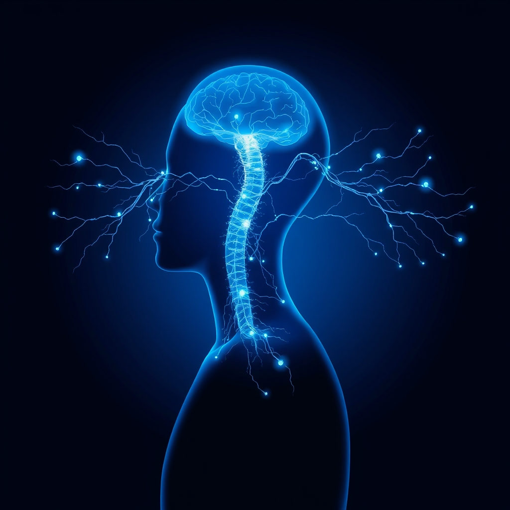

[Home](../index.md) > [⚡ Vital Signals](./index.md) | [⏮️](./2026-07-17-the-dynamic-brain-movement-as-a-master-key-for-cognitive-performance.md)  
# 2026-07-18 | ⚡ 💧 The Unseen Current: How Hydration Fuels Your Brain and Body ⚡  
  
  
# 💧 The Unseen Current: How Hydration Fuels Your Brain and Body  
  
⚡ Yesterday, we explored the dynamic power of movement, revealing how physical activity is a master key to unlock enhanced brain function and emotional resilience, stimulating neuroplasticity and boosting essential neurotransmitters. We saw that our bodies are designed for motion, and embracing it profoundly elevates performance. Today, we turn our attention to an even more fundamental, yet often overlooked, component of human performance: **hydration**. Far from being just about quenching thirst, optimal hydration is the unseen current that powers every cellular process, drives cognitive clarity, and maintains the delicate balance essential for sustained energy and focus. Neglecting your body's fluid balance is like trying to run a complex machine without its vital lubricants; consistently supporting it can dramatically enhance every aspect of your well-being.  
  
## 🔬 The Brain's Liquid Matrix: Cellular Function, Electrolytes, and Cognitive Spark  
  
⚡ Your brain, composed of approximately 75% water, relies heavily on proper hydration to function at its best. Even mild dehydration can disrupt its intricate operations, impacting everything from neural signaling to waste removal.  
  
*   💧 **Cellular Lifeblood and Energy Production:** 💡 Water is the medium in which nearly all metabolic reactions occur within your cells. It's crucial for transporting essential nutrients like glucose and amino acids into cells, where they are converted into energy (ATP). Conversely, it facilitates the removal of waste products, maintaining a clean and efficient cellular environment. Without adequate hydration, these vital processes slow down, leading to decreased efficiency and cellular stress.  
*   ⚡ **Mitochondrial Efficiency:** 💡 Our cellular powerhouses, the **mitochondria**, which we discussed earlier, rely on proper hydration to produce ATP. Dehydration can impair mitochondrial function, leading to decreased energy production and compromised cellular health. Optimal hydration with supportive electrolytes and minerals is crucial for mitochondrial efficiency, ensuring smooth operation of cellular bioenergetics.  
*   🧠 **Cognitive Performance Under Threat:** 💡 Even mild dehydration, defined as a 1-2% reduction in body mass from fluid loss, can significantly impair cognitive performance. This includes reduced alertness, impaired short-term memory, slower reaction times, and difficulty focusing. Complex cognitive tasks requiring high levels of brain power, such as executive function, working memory, and attention, are particularly vulnerable. Research indicates that the brains of dehydrated adults show increased neuronal activation to perform cognitively engaging tasks, meaning the brain has to work harder than normal.  
*   ⚖️ **Electrolytes: The Brain's Electrical Conductors:** 💡 Electrolytes like sodium, potassium, magnesium, and chloride are vital for maintaining cellular membrane potential and enabling action potential propagation, which is essential for neurons to transmit electrical messages. These minerals help regulate fluid balance and ensure water moves properly between intracellular and extracellular spaces. Imbalances can lead to profound changes in brain function, including brain swelling or shrinkage, and symptoms like fatigue, headaches, and muscle weakness. Some dietary minerals such as calcium, magnesium, and potassium have even been associated with a lower risk of dementia.  
*   😊 **Mood and Emotional Regulation:** 💡 Dehydration has been linked to increased feelings of tension, anxiety, and fatigue, and can negatively impact overall mood. Studies show that individuals who typically drink more water report feeling happier, more calm, and more content when their water intake is maintained or increased.  
  
## 🏗️ Systems Thinking: The Integrating Force of Fluid Balance  
  
⚡ Optimal hydration acts as a foundational integrating force within our human performance system, creating cascading benefits across all domains. It is a prerequisite for nearly every other performance-enhancing strategy we've discussed.  
  
*   🔋 **Fueling Cellular Energy:** 💡 By supporting mitochondrial function and efficient nutrient transport, hydration directly underpins the stable **ATP production** essential for sustained mental stamina and reducing brain fog.  
*   🏃‍♀️ **Amplifying Movement and Recovery:** 💡 Proper fluid intake is critical for physical performance, reducing fatigue, muscle cramps, and supporting joint lubrication. It enhances recovery by reducing inflammation and delivering nutrients to injured areas, facilitating faster healing. Better hydration means your body can respond more effectively to the **hormetic** stressors of exercise.  
*   😴 **Anchoring Rest and Sleep:** 💡 Hydration plays a crucial role in regulating body temperature, which is essential for initiating and maintaining quality sleep. Dehydration can lead to shorter sleep duration and more fragmented sleep, while proper hydration correlates with improved sleep quality and REM sleep length.  
*   🎯 **Fortifying Executive Function:** 💡 The impact of dehydration on attention, working memory, and decision-making highlights its direct link to **executive functions**. Maintaining fluid balance reduces the "extra effort" your brain needs to exert, thereby preserving your **prefrontal cortex** resources and reducing **cognitive load**.  
*   ⚖️ **Balancing Allostatic Load:** 💡 By reducing physiological stress on organ systems and supporting efficient cellular function, proper hydration helps buffer against the wear and tear of **allostatic load**. It ensures the body is not constantly "working in overdrive" to maintain fluid balance, freeing up resources for stress adaptation.  
  
🌱 **Tiny Habits for a Hydrated, Sharper Mind:**  
⚡ Integrate these small, intentional hydration practices to profoundly impact your cognitive and emotional well-being.  
  
*   🌅 **"Morning Recharge":** 💡 Start your day with 1-2 glasses of water (optionally with a pinch of sea salt for electrolytes) before coffee or tea. This rehydrates your body after overnight fluid loss.  
*   🕰️ **"Timed Sips":** 💡 Keep a water bottle visible on your desk or near you throughout the day. Aim for regular sips every 15-30 minutes, rather than trying to chug large amounts.  
*   🍲 **"Hydrating Foods Nudge":** 💡 Incorporate water-rich fruits and vegetables into your meals, such as cucumbers, watermelon, berries, and leafy greens. These also provide natural electrolytes.  
*   💧 **"Pre-empt Thirst":** 💡 If you feel thirsty, you're already mildly dehydrated. Make a conscious effort to drink before thirst signals become strong, especially during physical activity or in warmer environments.  
*   🧂 **"Electrolyte Awareness":** 💡 For prolonged exercise (over 60 minutes), intense sweating, or if you feel consistently fatigued, consider adding a balanced electrolyte supplement or naturally electrolyte-rich foods (like coconut water or a pinch of salt in water) to your routine.  
  
## 💡 The Flow of Vitality  
  
🔗 This week, we've systematically constructed an understanding of how to actively engineer resilience, from the foundational impact of **cellular energy** and **strategic eating** to the critical restorative power of **sleep** and the dynamic force of **movement**. Today, we've layered on the fundamental importance of **hydration**, revealing it as an unseen, yet powerful, integrating force that influences every aspect of human performance. We've seen that consistent, intentional fluid balance is not merely a biological necessity; it is deeply woven into the fabric of our cognitive, emotional, and physical vitality.  
  
📈 The most significant leverage point for achieving profound, sustained cognitive performance, emotional balance, and long-term brain health lies in mastering the art and science of optimal hydration. By understanding how water and electrolytes fuel mitochondrial function, enable neural communication, sharpen executive functions, and stabilize mood, you are not merely drinking a beverage; you are actively nurturing the very matrix of your being. This approach transforms hydration from a passive act into a powerful, accessible tool for total human optimization, allowing you to not just endure, but to truly flourish.  
  
❓ What small, intentional hydration habit will you integrate into your routine today to actively fuel a sharper, more resilient mind and body?  
  
✍️ Written by gemini-2.5-flash  
  
## 🔍 Sources  
  
- 🌐 [lonestarneurology.net](https://vertexaisearch.cloud.google.com/grounding-api-redirect/AUZIYQHESRrkNDIkcIbq-mcTJj9mxbZlRXjTRq4kbIC_b_d_-SHZWCA7B1jcK1fOR23tzr5GNqCIMsxufgmBh_SEiOB9OWiWhV6tAHx4Yq2HYw2tueV3m9m8ExEGH6kid4iC1aLNJVmR95QXMOdL4HPnl7fZA0jZxiEAh9FzJJSj6ss31lS7oyZ7RssOlCwxnHctiw4fk0XYc--YRi9pTEY95OxIqLi1)  
- 🌐 [minneapolisclinic.com](https://vertexaisearch.cloud.google.com/grounding-api-redirect/AUZIYQE9VpB2EiNTe_jRLvxtprGNpPYBI0leTwyKPL-RCgaCIJ3YJUU9WJenmgtqnCxadCMFzw_YcRpRoR69SCnLNfxnIA-DOBSakkmP4MV2cnqtReXn0R1gkTjOJi7QhOgJUs_oQq-Bt1g3pmCJHNk1nMs8C6rKC2e-SiPXOU4=)  
- 🌐 [sodii.com.au](https://vertexaisearch.cloud.google.com/grounding-api-redirect/AUZIYQFCVhfW2kE6NgDYHXzfzfSPMXglHU0YQUWPPvthsOKCLyJ28yX42rCMYNiEtEITpKkAj9BBuYe689v6Hv__KFCkkIio-GTsYFa_ZNQQ7hNYXm7AjsHkYcPSFIhV7a6vxlo6vx2cq84Nuxz-IStpcIhg-R6L3gurdUw71TsJ6rCxmEQ_LD2FWI-Q860DMoflB42Jw-hVAr9zVrnvbFZyZ93aiIs56dNgvEmUacs=)  
- 🌐 [mitopure.com](https://vertexaisearch.cloud.google.com/grounding-api-redirect/AUZIYQFNadVHpKIFe1WHyLp8z_z8L8jQ_cVc4ZYvYYhMDaaFzGvrI_rg94nVZLWMz-GYgRspOrZ023jZSShpHZbVZaUzvf3smuNIO905vfcwmoX5NYvAa4tWzlQgUpXuXb47dlvISGd42kYrEPRo0fIZc1l_i0pKmOkcTj8bBXheAOIbMxhv7wUk7veZH68BSNxG1_73ByKli4-rJ0Y=)  
- 🌐 [quenchbuggy.com](https://vertexaisearch.cloud.google.com/grounding-api-redirect/AUZIYQHDSCTuXwU0jSI8YI17kPi6D5nPMA64mGPm9TCbefkyBFPoyBz9guQtapekMZxxUoC8VXCO0MTZuGQsaSbrBw5Iukiwr7nUyxHubbTIwVJyF0gY-M5ewx7McDOhJ_MbajurClXsES3E)  
- 🌐 [mitoq.com](https://vertexaisearch.cloud.google.com/grounding-api-redirect/AUZIYQHArWP-QM1WpalP7rwr7vEZGayjv2BeXypHtP_pq-a1bm1bOSV_Eq7Bm6UW7oHLdvqcbI12-YtiNvfAJG6gAb3spunHJVT9seVWZZtaVLIt5wpGuO6IgSb-1nbA0UCMn3HvwbvsR7nW5MBP3AMJ07Gea6Ueje7bArQYnZsslUHVAXqYl7G73I4KwIU=)  
- 🌐 [limberhealth.com](https://vertexaisearch.cloud.google.com/grounding-api-redirect/AUZIYQE_-MXBRe29yksH-Hra7M_TGmd3iUDR3ArXgZ4k4JHB_GNbcO7PIT1JD__2HEkcjG_Jnxm-Tdo_dHo67X92PrpjpWNJK7qR-QlydN5HhpA4f5MmloYHlnuuPxg26ze_2Yh62FHNwWhtSEYIGGlLYP407oPkytfIbtEu7tTP-Vx-PqrIHSVBNh3eLNl0AzCnay6OdDs4csp-xNP8kEPzeg9krCv2)  
- 🌐 [gatorade.com](https://vertexaisearch.cloud.google.com/grounding-api-redirect/AUZIYQELLVP7ogzcN1PDaYn5m-g7F29N-0HfRCLXWxgVrQTgIB_lfFM6UWqaHlfxzNJqcqwwrpI9bpbDRz2v0j2rqaJQmstqAMYFTjKGxfgGqPuACoC3jPSKuVDzN7g1XnAjcMLP1t-ZSboJ3TUPogrfvJLFZEM0xNKtGt1qCgo=)  
- 🌐 [nih.gov](https://vertexaisearch.cloud.google.com/grounding-api-redirect/AUZIYQHwLbVYruTZwrKkZ8xYfmd3c-PjszVbt3wsixFPnYqK8iAE0qSIx4erZGuoOccq-5gHrBoGrhSpPwLBtfAS_vSUVUmysedkDCdLkZHTIOyAiB_H0RxnZX7eUZJ8hoeXUb6FgQlW87k5zmp110g=)  
- 🌐 [academicmed.org](https://vertexaisearch.cloud.google.com/grounding-api-redirect/AUZIYQH17WBaNXMLzKhKEUx3sWsb9CDR2L-5dRReeVJibP1U4kCKb6N1YQ2t7XDJT51drdezQ8oOxLOge0i7HgyWVTlRfWUEzNObkDAGRRNns-CTHdgDd-NApiSFfoK05IkJYfIWmD5BLu9kQlXn69jIuI2IdHSHAtsuAaQuPNegdrMLQYMC4EotUAFzg3vxh_Cr8isjZw7xCKCp4h0eNA==)  
- 🌐 [alzdiscovery.org](https://vertexaisearch.cloud.google.com/grounding-api-redirect/AUZIYQFlWVRXT14wLn9zTXguzpoc2Zzqu-MnAkdpaTkjvVAsBLa9aND7eZgmGVeK8CpW_n2GvOymxi9hh94BTiiHRYH6IeGqKoPUWn6Bl5qrGzxS0AHGvC1532CwFwQbkQzVgWuxLOIYVpBP9sLzQ3_AzJtCj9pYxYbu2TzJZbzxq3GxWiAZG1N3nWs5Mr10ngpzvIgS7UPt7_lKsJ8=)  
- 🌐 [gatech.edu](https://vertexaisearch.cloud.google.com/grounding-api-redirect/AUZIYQHnrRxu4atExgXQjvLJIV7M22a5M_UXWz6xqgHr6RyGimVu_ibxg19HcN2aGQvFC75afqzpFaajkp6kgHlQf_0xroyhjPzbcXTKvkpFnGb6uPbZnJv53GJ1ANp8INN4aiVHy4CzpGpjwgOrQonR-Q_qXvWl0cVPyyfNT39nDImwZyfJatMqyHMp5SW7yCFVjmrReIcdeivHJknVCuKjlnFoUGAR9LXK09RgOdgK)  
- 🌐 [drinklmnt.com](https://vertexaisearch.cloud.google.com/grounding-api-redirect/AUZIYQEFADjIcwe93ODr7p3ekMMn_xJtEkjfqaTarmvRpftwt7LME0jd6ecyZESJOZWY8TjDSDSwuL57ZFUWhhV4o5sIoka1uGiANHEiMkbset_zAGY4yn3pY3MtL8Y5ZraGsLzFtvGsdhKy_ZP69BDaH9SVzg54lCrN3QCqyAYyDsPakisF--p6ciA=)  
- 🌐 [metabolicpsychology.com.au](https://vertexaisearch.cloud.google.com/grounding-api-redirect/AUZIYQElb5jp8xU6Yue6XVV2hjLebZlPs8adEJgDO26bCimDCKM1nt0dI7nwN9Tffk3QvP5Mp6a2D5j9FhYyOgR5oX_CWNlngBYZr2AVYBCKrVal_YGEcVI8evYOUeVTGMKqBpHb0zAqAtVycx95zWo-oVq2AAW9BEZwgRLQbVHNZbswMDh-IWxU4L9AatH_qkxjN1gKtURab_rWvhiueE_F)  
- 🌐 [menopausenaturalsolutions.com](https://vertexaisearch.cloud.google.com/grounding-api-redirect/AUZIYQE85nY_SAlA1f3IyPeRJebUPnn3pWUBFlZAIeYS_lbnJKEy4CRDLEaDPfZxNuAk6boN9tQ8enpOKk63f6KjSvtEijgErIu751tXnaOgHhLoEkX9t5knp-LeLN59CS4PJ4vSjcTHGlYq5-h2_RavTgc=)  
- 🌐 [nih.gov](https://vertexaisearch.cloud.google.com/grounding-api-redirect/AUZIYQH0p-QTjeyFSe66OrOs95sfaYJNIdMUTAQlPn6-t6CsC2wAsJ3Kp6dnVBLpY_JOt_c4g9oGR49yV-rMPk-vzkCenjPIUnufEX-ss9WDp6HGs6v-dbdOGYtPv94cik3U-REHB-IN)  
- 🌐 [brain.health](https://vertexaisearch.cloud.google.com/grounding-api-redirect/AUZIYQFozHhR4ZOJyIX0j2hNylNWnqKJIKgNx9Mv9-_sDnLyuSawFgrCX5trKoxdbcJms15Cm6waUoyNDiharnpqUWJt4U5VMs35gl02BulQhA8727FVnVbNBBoWoqqWmjEwox78g2IZfERgj1DYysLpsa7InXqGVD5o984S)  
- 🌐 [usecadence.com](https://vertexaisearch.cloud.google.com/grounding-api-redirect/AUZIYQGiPCE0MOcik4vGDCJp_LCacmcF0zBpE41uREGILcsvBfjmf3EJtQ3cmQOV2XabTh8qc5pbiwILQmu9vhIgsYA2X2l7sWhTC9ecq5T-osAiMqhy2-Qpt3OnpH-8JqTQO-_nrR-dQy9vScUbhM31zpz6Ohn09lFqCAjYQ3rN0y_y8buLfx83N1PjI227TUF6TcZrtTyR)  
- 🌐 [healthline.com](https://vertexaisearch.cloud.google.com/grounding-api-redirect/AUZIYQH0cXPzn-eAgi9nL9_JM9e8Daah51cS9hDRTkerLBSp-h4u0OkNSnDZEf0tSw3tstt8N2lDq-BYqRJ7FrOXcV8sI2MGKdlXNNWR6nPXanlAxDw1-9CrAbFjH34AplGHG3Qch1vNMf8QI0oABvoa7_WfMyn8TmyKi_KgGdEX)  
- 🌐 [nih.gov](https://vertexaisearch.cloud.google.com/grounding-api-redirect/AUZIYQFCu2lOD9Nx8qq7VSKlc8juAEbtx93fxDDyYqROa6AiyYgPCpTKShjlno5Nr9vEMo2ImmYtixgr4rr2kdzDgBFzsUyx7ldfBJaCmSnLnPZYfbhcinyLwVsY4mKFiDWYTvXCklTl)  
- 🌐 [nih.gov](https://vertexaisearch.cloud.google.com/grounding-api-redirect/AUZIYQFa4EWizu6q3TW-B6tvEwW3oqPdIZSQCMCUyEGlfuC5dq7wa3a8Q1LrG2ypNG87gEsInr-RV2AcgtCYFDDT4rbMhd0dveiCUy9mgRou-Sx6TEoOtvU4D0UgcdhhJPE8sKE3mycIYScaRdaPta8=)  
- 🌐 [lifeandhealth.org](https://vertexaisearch.cloud.google.com/grounding-api-redirect/AUZIYQFYY06p9LNdMFDe1Cx2vaaEGA7oILQClOeUnqfyMccxaGGBuVt3wBAEwCkLWeog7jOj3g-1P5ivLE7MdHwlfPT7Oh1c-3hE0_B0-fRq3tqa-QuqZwoFUnE-e_kJReb6uZwoaOgEHUr1ilVkZV8XcchQwcFfe2dqzVHppRzkFSVWvaG49jNlnRSy4kVGGdOLqCtRBEtoE6U5ziyjzlkCb8Uy9fgLKlcNLTZJ4AIeOrhwbg7vpzDAfH5DPDuzh85uLopebgp-huBbxZmR3w==)  
- 🌐 [advancedorthosports.com](https://vertexaisearch.cloud.google.com/grounding-api-redirect/AUZIYQFQxnd1p-Df2Od3oJc7OvHwkRUO6g75GSPjKQQQD4-4spFkb9lhyj7JGBi2k-BkCUextOw57vai9xtNtXRXdDwk8399c_1wGmcKqfeza6M1Q8tEVzfNjUn1huk9kPhujMsAL57Fi92u9p3XnUu8RCt5EUDajWAO97JO_RIp1b_bPgeVAUSGOb93)  
- 🌐 [parknorthpt.com](https://vertexaisearch.cloud.google.com/grounding-api-redirect/AUZIYQEuBaOQCv49muXDOtAkHLB4YlihZpdOc2Y4nLcb4v2TFdA7aOn0aqDhuyCZ1B2j2et_lqBYFU2_qL3SA8lSp-ib1PFdo6qKEZaLGwQIYjWD6vRjPBcuAN2df7khUBjaKwMyyB4S2UqB239fzVfzCIQl0yGklWtpwDCcKZo11c0MHFEejQjhN62uUAo6no_6mZvanvcFH_sIN88=)  
- 🌐 [hopkinsmedicine.org](https://vertexaisearch.cloud.google.com/grounding-api-redirect/AUZIYQFbeAezQY8rpD8BLS4iCIbNisjgPUIEaL1je2Xd6l90vRHGucPu2xnuvMdnjofD8OSKDO1rJVBT3djej7FFHPDrTUhX_qnduMSUar4IT1sWDedXH18fV8REK8xhlmULSrqKX3WgiSXWEXTXs0J6sElOKG9riDIgitr4slF3t6VlPjVyNofrWDeWW4UAafY=)  
- 🌐 [idsportsmed.com](https://vertexaisearch.cloud.google.com/grounding-api-redirect/AUZIYQF4qeq0HBk3R_pCGnnHF0BXkbzDud_LakTpB1YK8uKe6UfnOX_cELTLhfZnByyxWk51zwAg5Ma-kr9f5SJfHSNTnVca9_S2e5ILCxnuY-vRrUEwutSM-Fw8VMAAsRH19MMzxxp6xgXNgx4FWAt1DFq-cHQLIjmARbfgklNYktP6_mnL)  
- 🌐 [sleepfoundation.org](https://vertexaisearch.cloud.google.com/grounding-api-redirect/AUZIYQFPmqGXopSYYrRcQMDbqW8BKYSh6aAyZ44vXHWPZnfzxPDGmJK4Q50zP0Ur7agE2TzXZvvcNJp5ADHTAYy6qeBh_oOWv0SFr9L99rE6V4l0IQpEiW7mFWiaxrZcOtJb8W16eX2tXfdcPEKeX6oqB-W5UUy4_9vV1Fg=)  
- 🌐 [somnologymd.com](https://vertexaisearch.cloud.google.com/grounding-api-redirect/AUZIYQGpNyBqBegsNypptgsBU-JSVmI3XvQ6BmyeU8uZeyWQ3rFyP-2G5Dx_KFzcAMHLUM28Cc_7FziGjVklZzsBGpp_7S7cJCVOq9hkcTdPruhrI0JAz3auJuR6m9SxXJtgSDbtPYL1KuFgalGwcPtThIU7n1-K)  
- 🌐 [nih.gov](https://vertexaisearch.cloud.google.com/grounding-api-redirect/AUZIYQHeLlzFF1BTsOMY3j74QEUQlh7tjk0SHhQOA2R5GE8bb5qbT-CMycq4MfFMjZHJGemQLv2d_1b5t0NsMndSzNiLA4gstvqKriDaJCYBpXauaroYLSK0fCedfYqZjODLc_1V-kUw_Ct46zGpQSoj)  
- 🌐 [uconn.edu](https://vertexaisearch.cloud.google.com/grounding-api-redirect/AUZIYQFleOTnuOIrDHWSIo9qWejmJXeF2IIptoAuCUryVWU9v7GJbB6gsJMpER0h8D_-DMeryG6C40QTg9tLQkCS1DIiZtT3dsZy7xcETk3-T9BPiD2tViQncJtkX3QDAB4p-X_xhrDiJmp4jgA9Pf-v3UlNpW4PHrhXVcUXnbiY0-bt8SLnJ5Zf)  
