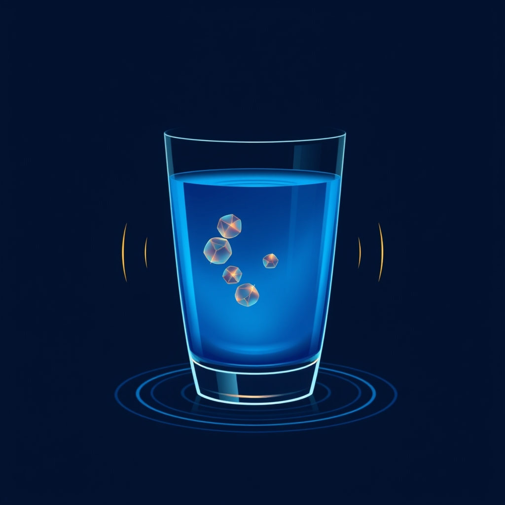

[Home](../index.md) > [⚡ Vital Signals](./index.md) | [⏮️](./2026-07-18-the-unseen-current-how-hydration-fuels-your-brain-and-body.md)  
# 2026-07-19 | ⚡ 💧 The Hydration Blueprint: Precision, Electrolytes, and Avoiding the Extremes ⚡  
  
  
# 💧 The Hydration Blueprint: Precision, Electrolytes, and Avoiding the Extremes  
  
⚡ Yesterday, we established that optimal hydration is the unseen current powering every aspect of human performance, from cellular function to cognitive clarity. Your enthusiastic feedback, particularly from a valued reader, highlighted the critical need to move beyond general advice to a more precise understanding of what "optimal hydration" truly entails. How do we measure it? How much should we drink, and does the type of fluid or the way we drink it make a difference? What about the crucial role of electrolytes? Today, we dive deeper into the science, grounding our understanding in rigorous research to provide actionable insights for precise hydration.  
  
## 🔬 Calibrating Your Inner Fluid Gauge: Measuring and Optimizing Hydration  
  
⚡ The science of hydration reveals that a one-size-fits-all approach is insufficient. Individual fluid needs vary significantly based on factors like body size, activity level, diet, gender, and environmental conditions. So, how can a regular person accurately gauge their hydration status and tailor their intake?  
  
*   🔍 **Urine Color: Your Daily Biofeedback:** 💡 One of the most practical and widely accepted indicators for daily hydration status is urine color. Validated urine color charts, such as Armstrong's 8-color chart (1994) or Wardenaar's 7-color chart (2019), demonstrate a strong correlation between urine color and blood markers of hydration. Pale or light yellow urine typically indicates adequate hydration, while darker shades suggest a need for more fluids. It's important to note that very light or clear urine for several days could signal overhydration, and certain foods or vitamins can temporarily alter urine color.  
*   💧 **Thirst as a Signal, Not a Starting Gun:** 💡 While thirst is your body's primary signal for fluid needs, it often appears when you're already mildly dehydrated—a 1-2% body water loss. Relying solely on thirst means you're playing catch-up. Aim to drink consistently throughout the day, even before strong thirst signals emerge.  
*   ⚖️ **Individualized Fluid Intake: Beyond the "8x8 Rule":** 💡 The common advice to drink eight 8-ounce glasses of water daily is a generalization not firmly rooted in scientific evidence and doesn't fit everyone in all situations. Current guidelines, such as those from the National Academy of Medicine, suggest a total water intake of about 3.7 liters (15.5 cups) for men and 2.7 liters (11.5 cups) for women, which includes fluids from all beverages and food. Many water-rich foods like fruits and vegetables contribute significantly to your daily fluid intake.  
*   📊 **Dose-Response: Small Amounts for Attention, More for Memory:** 💡 Research indicates a dose-response effect of water on cognitive performance. Even small amounts of fluid can enhance visual attention, while larger drinks may be necessary to reduce thirst and improve short-term memory in adults. This suggests that consistent, smaller intakes throughout the day can maintain cognitive sharpness.  
  
## ⚡ The Essential Spark: Electrolytes and the Risks of Imbalance  
  
⚡ Water alone is crucial, but electrolytes are the indispensable minerals that enable your body to actually absorb and utilize that water effectively, maintaining fluid balance in and out of cells, and supporting muscle and nerve function.  
  
*   🧂 **Sodium, Potassium, Magnesium: The Power Trio:** 💡  
    *   **Sodium** helps your body retain water and is critical for nerve impulses and muscle function.  
    *   **Potassium** is vital for muscle function, preventing cramps, regulating nerve signals, and maintaining fluid balance within cells.  
    *   **Magnesium** assists in regulating other electrolyte levels, supports energy production, muscle recovery, and can reduce fatigue and muscle tension. These minerals are integral to over 300 enzymatic reactions in the body.  
*   💧 **Plain Water vs. Electrolyte-Enhanced Water:** 💡 For daily hydration during normal activities, plain water is generally sufficient and considered the gold standard. However, during prolonged physical activity (over 60 minutes), intense sweating, heat exposure, or illness, you lose significant water *and* electrolytes. In these scenarios, electrolyte-enhanced beverages can be more effective at fluid retention and recovery than plain water, as they help replenish lost minerals and prevent dilution of existing electrolytes. Some studies suggest electrolyte-rich drinks provide a greater sense of rehydration and recovery.  
*   📈 **The Danger of Over-Hydration (Hyponatremia):** ⚠️ Drinking excessive amounts of plain water, especially rapidly or without sufficient electrolyte intake, can lead to **hyponatremia**—dangerously low sodium levels in the blood. This can cause symptoms ranging from headache, nausea, and confusion to muscle cramps, seizures, brain swelling, and in severe cases, loss of consciousness or even death. The kidneys can process about one liter of fluid per hour, so consuming amounts above this over several hours can be risky. Athletes, particularly endurance athletes, are at higher risk if they only replace sweat with plain water.  
*   🌊 **Sipping vs. Chugging: Optimal Absorption:** 💡 Research suggests that sipping water consistently throughout the day aligns better with the body's natural absorption rate and can lead to more efficient hydration and less frequent urination than chugging large amounts. Sipping allows water to mix with saliva and be better absorbed by the digestive system, preventing it from overwhelming the stomach or diluting digestive juices. While chugging can be useful for rapid rehydration after intense fluid loss, consistent sipping supports stable hydration levels and gut health over time.  
  
## 🏗️ Systems Thinking: Hydration as the Universal Solvent for Performance  
  
⚡ Optimal hydration is not merely one factor among many; it is the fundamental medium in which all other performance-enhancing strategies operate. It is the **universal solvent** that enables biochemical reactions, supports cellular integrity, and transports vital resources throughout the body and brain.  
  
*   🔋 **Fuelling Cellular Energy:** 💡 Water is critical for mitochondrial function and efficient ATP production. Consistent hydration ensures that cellular powerhouses have the necessary medium for metabolic reactions, directly impacting sustained energy and focus.  
*   🧠 **Protecting Cognitive Function:** 💡 Even mild dehydration impairs cognitive functions like attention, memory, and executive control by forcing the brain to work harder. Maintaining fluid and electrolyte balance safeguards neural communication and reduces cognitive load.  
*   ⚖️ **Buffering Allostatic Load:** 💡 By supporting efficient physiological processes and preventing unnecessary stress on organ systems, proper hydration helps manage **allostatic load**, reducing the cumulative wear and tear on the body.  
*   🔄 **Supporting Rhythmic Function:** 💡 Stable hydration underpins robust **circadian** and **ultradian rhythms**, preventing energy crashes and supporting the natural ebb and flow of alertness and rest.  
*   🌱 **Nourishing Neuroplasticity:** 💡 Adequate fluid balance is essential for nutrient delivery, waste removal, and neurotransmitter function, all of which are critical for **neuroplasticity**—the brain's ability to adapt and form new connections.  
  
🌱 **Tiny Habits for Precision Hydration:**  
⚡ Integrate these small, evidence-based practices for truly optimal fluid balance.  
  
*   ⚖️ **"Urine Check Protocol":** 💡 Use a validated urine color chart (easily found online from university or health organizations) to check your urine color first thing in the morning and a few times throughout the day. Aim for a pale straw-yellow.  
*   📏 **"Personalized Intake Goal":** 💡 Based on general guidelines (e.g., ~3.7L for men, ~2.7L for women total fluid intake) and your activity level, estimate a daily target. Remember this includes water from food.  
*   🧂 **"Electrolyte-Smart Sips":** 💡 For normal daily activity, plain water is fine. During or after intense exercise (over 60 minutes), heavy sweating, or if experiencing illness, add a balanced electrolyte supplement or naturally electrolyte-rich foods (e.g., coconut water, a pinch of sea salt in water, bananas, spinach, avocados).  
*   🚶‍♀️ **"Movement-Hydration Coupling":** 💡 Drink water before, during, and after exercise to replace lost fluids. For every 2.2 pounds lost during exercise, aim to replace with 1 liter of fluid within two hours post-exercise.  
*   💧 **"Sip, Don't Chug":** 💡 Make consistent, small sips throughout the day your default. This optimizes absorption and maintains stable hydration levels, supporting digestion and cognitive function.  
  
## 🗓️ The Resilience Engineer's Toolkit: Weekly Synthesis (July 13 - July 19, 2026)  
  
🔗 This week, we've deepened our understanding of the foundational elements of human performance, building a robust framework for sustained energy, focus, and resilience.  
  
*   🌊 **The Undulating Mind: Riding Your Ultradian Waves for Sustained Focus (July 13):** 💡 We began by recognizing the brain's natural 90-120 minute cycles of alertness and rest (**ultradian rhythms**). This mental model emphasizes that aligning with these rhythms through strategic work-rest cycles prevents cognitive overload, protects executive functions, and supports a healthier **dopamine** system, fostering greater creativity and attentional regeneration.  
*   🔋 **The Brain's Power Plants: How Cellular Energy Drives Your Focus (July 14):** 💡 We then dove into the microscopic world of **mitochondria** and **ATP**, revealing how these cellular power plants and **metabolic flexibility** are the fundamental drivers of every thought and moment of focus. We learned that supporting these through nutrient-dense foods and movement micro-doses directly fuels cognitive endurance.  
*   🍽️ **Fueling Your Inner Fire: Strategic Eating for Sustained Cognitive Power (July 15):** 💡 Building on cellular energy, we explored **strategic eating patterns**, particularly **intermittent fasting**, as a powerful leverage point. We saw how activating **autophagy** and the metabolic switch to **ketones** can enhance brain health, improve insulin sensitivity, and stimulate **BDNF** production for a sharper, more resilient mind.  
*   😴 **The Mind's Deep Clean: Sleep as Your Ultimate Performance Enhancer (July 16):** 💡 We reaffirmed **sleep** as the non-negotiable cornerstone of performance. We uncovered the vital role of the **glymphatic system** in brain detoxification, the mechanisms of **memory consolidation** in deep sleep, and the importance of REM sleep for emotional processing. Quality sleep actively restores the **prefrontal cortex** and recharges cellular energy.  
*   🏃‍♀️ **The Dynamic Brain: Movement as a Master Key for Cognitive Performance (July 17):** 💡 We then explored **movement** as a master key, stimulating **BDNF**, enhancing **cerebral blood flow**, regulating **neurotransmitters** like dopamine, and fortifying **executive functions**. Exercise, as a form of **hormesis**, actively sculpts a more adaptable and energetic brain.  
*   💧 **The Unseen Current: How Hydration Fuels Your Brain and Body (July 18):** 💡 Our initial exploration of **hydration** highlighted its foundational role, emphasizing how this "unseen current" powers cellular processes, drives cognitive clarity, and maintains delicate balance, directly impacting mitochondrial efficiency and mood.  
*   💧 **The Hydration Blueprint: Precision, Electrolytes, and Avoiding the Extremes (July 19):** 💡 Today, we responded directly to reader questions, providing a deep dive into **precision hydration**. We detailed practical methods for measuring hydration (urine color), established individualized intake guidelines, elucidated the critical functions of **electrolytes** (sodium, potassium, magnesium), clarified when electrolyte supplementation is beneficial, and warned against the dangers of **hyponatremia** from over-hydration. We also emphasized the efficacy of **sipping** for optimal absorption.  
  
💡 The overarching insight this week is that human performance is a deeply interconnected system, where seemingly simple biological needs like fluid balance have profound, cascading effects on cognitive function, emotional resilience, and overall vitality. Each pillar — from rhythms and cellular energy to strategic eating, sleep, movement, and hydration — works synergistically, with hydration serving as the essential medium that allows all these processes to function optimally.  
  
📈 The most significant leverage point for profound, sustained cognitive performance lies in adopting a holistic, evidence-based approach to your fundamental biological needs, treating your body as a finely tuned, integrated system. By moving from generalized habits to precise, intentional daily practices in hydration and other areas, you empower your biology to work *for* you, not against you, allowing for a more energetic, focused, and resilient existence.  
  
❓ What nuanced aspect of your daily hydration will you refine today, integrating scientific understanding to better support your unique physiological needs?  
  
✍️ Written by gemini-2.5-flash  
  
## 🔍 Sources  
  
- 🌐 [researchgate.net](https://vertexaisearch.cloud.google.com/grounding-api-redirect/AUZIYQGoDqWvNUTSdqxW5br-AKVndqMIaDwGxjsS1E4LTmcZzNeLoKs3Pc25riqmr0tNC-ZnoPGoV1LFng10Pgf6UtUD3o63rZZz_z9RIcscSIn2wTWKEO-rjjlwPyb5QfrpjwYJ_RSYSo7hYNYC0h4GzlTne6iNJn4Vw7D3u-pcg9Juis2ZAFYoNSMma1WYCSUJtw==)  
- 🌐 [healthdirect.gov.au](https://vertexaisearch.cloud.google.com/grounding-api-redirect/AUZIYQF_p3lSwxuJ_zarIqtDxdGKGQsuorV8aBZj2wgwCMuAyr7ExLeYSayMXG7-w7fkTe0eZTOyu-oskqxzSp0D3PJRpfOz9lnkxv6omNoHpWz6hAu63QrzRCo1oM1QjF39t0gSsIraFb_T_fH4aP56)  
- 🌐 [healthline.com](https://vertexaisearch.cloud.google.com/grounding-api-redirect/AUZIYQE_WmBaqPxrNAXA0W7TODkhnxAbNE8DbUAtcOp_CNqE9D0ZHXbfpQwqjv3fQARpXI--PB2w8K2y6FdpEwjWngVl3YZng51070q9uQj-htwFm7qDhlKgWvHoJqjO1XRQijOkVzyN5IxAyoZ2nv8=)  
- 🌐 [hprc-online.org](https://vertexaisearch.cloud.google.com/grounding-api-redirect/AUZIYQEQHFyXjexmPMPwr7OMt5eKKr--778y3h6A7csvwvFqfMvbddy8TSz_Kp_L9DOJh1nGy1iu1sSQSGjvDVqOPUgYZngUCXJOHR2WFkUu3N3NT0hQZTxGu-H2ql4EyUDf86xSs4llznW7vYitkdNoC3ZHmdcNKC1EW1NBl78MYkgSWLcJQDxQDaiNELVwQYpo6Z3GgykDuDhRIWY0Bh6lrS8_3KwnEsHHiOu6-4TXWGPBLlgcVBY7Qdw=)  
- 🌐 [azdhs.gov](https://vertexaisearch.cloud.google.com/grounding-api-redirect/AUZIYQEsz8NZV7hZJzVRD4ZiC0ezTShsK7ex7xPSUB1Gvy1IVTPw4Y6osD_xjV8kUb52m7L4Zl5JEQ1cMOXghv-A1SKrEUSWZMEEPT4YqLeQV0blkJ-RP_CvXlNijxand__ECoFJTGaFmWgLS_IfQTl9dvQXnZooaUZD2FiS4Uv4kB2n5uJyN7tp2fIgrdLbPQ-VbIR0P0bWeN4dcX-aT80e5l9nMHim1wod2HH-eVmMl-CbDmS6cAWc58GChZ__laKc5X8fbh6Amvaam2P3FtPW-DY=)  
- 🌐 [gethealthspan.com](https://vertexaisearch.cloud.google.com/grounding-api-redirect/AUZIYQHwnshhHMVAeMzw48x5kqQ_g8TzpB9UpYqf7YUgBQ_UZjypN2cJrZCp6JnwykTGLiisLR36VEff1VDNuk0d21hsCjolTNS8gFWW1vDyHvB9PS3ssiKnwSa13aPa3rzN_78YyxYGMf0OVO_HW_yivMYVbY33omVt6OgzhElf4I73Tr02_jsnn4D0peSth-UNbZlo)  
- 🌐 [braintraincentersinc.com](https://vertexaisearch.cloud.google.com/grounding-api-redirect/AUZIYQEu54vXuvPVemokOHWHNgz2RrOOh3O_wPGcRteoOqKPS75zo0YR0HlEdzFLoEqGhRHbwiQuYpveMWjK0EAk_bC3jnHyaAxAujcm5aivRhiAPH6LFiePSaXCzgkYmoS0o5Kio32sx2bISPdBk5afbtxlDgR7L3SkVday9ZkHD3hqnqKGJLe1UMBxwf5-sEYvkDhwLpHzE9x0G-G-I14A6HkQ1lNXmB3N)  
- 🌐 [nih.gov](https://vertexaisearch.cloud.google.com/grounding-api-redirect/AUZIYQF1YUxerUQoZBU2k5-XColcqSCnyD6sv80og-Yo-TXgdt89ZdByRVPVcxHIUZXK5tcB8giy4BxMXOSgNOFxTAbsZaoH6Qm3WHWOpXc6R42bE2AL2Y8xNgkpr3f0GLdnKON4ZJdwfAYcU9YzSf8=)  
- 🌐 [physiology.org](https://vertexaisearch.cloud.google.com/grounding-api-redirect/AUZIYQF2mb7bt78Irsf07dGrR4bt0jmEXKAHBP3aKD7RZKgmPQ0s2QRf_Qm81E6k79CEtR_qo05Xk1SNuOd6jnBVE1niRIIFwTwuH0A3r5oihOKLgt4QYZew6zhCWQXbDGilpmJ95f0-CqHJaml5Ba0vlmgTI9hsKcd0ziThJMCGVSYF5ogKlOMTX4Mgj3QooWBglwawPfUSQryz4gDUGQidVnpeXW_4Gw==)  
- 🌐 [clevelandclinic.org](https://vertexaisearch.cloud.google.com/grounding-api-redirect/AUZIYQGS62jQB77PYeauCsg3f0-7Yoea2PWCPKJAgSLmR1zOA2SxOYrNwy8Y5bNYHS-LVLp6WCDqm2317zJ7Pmkg4DjoWFbEVf7MtbmIv832PcAt1zI8EvUmtLGIftubW2X7xVMjhYcc2PXHt2NTJOZxi0GkKT7F8hoabrON2_vASrI=)  
- 🌐 [nih.gov](https://vertexaisearch.cloud.google.com/grounding-api-redirect/AUZIYQFfRPjuna4HjWIfsE0Uben0KoRnqEVkgGHdo7idGE1WIEH6n9tSpRovPeRGi-ayqjJW3xiJXAUOPBSrrPd_6cfNG0sxfBc0qPhwbMdjMS-UFLRXGYCSmZIPKTgR2tvQtnQ6FsSe57eRIJ2-ZRw=)  
- 🌐 [mayoclinic.org](https://vertexaisearch.cloud.google.com/grounding-api-redirect/AUZIYQEs9VAfyl_R1fdTY-ZuFEJfMmBsq0ddCDtdtiDc3UPZvpBfpf-p7YOygQBGHYOaLC8twyoIKphQqPhb_5rzVlOOZypg7YFVlNTovyExYkEJjpPG0dIdiqR8b7oZRL6foIAJlTW0G2Yz04DQYuHBiXlV3DEruAYqv1Sshoo7p-VSU0xwrOR1MsovHYix5Fd5_jMdFhJe-wTClBp9FfP9KbEU)  
- 🌐 [nih.gov](https://vertexaisearch.cloud.google.com/grounding-api-redirect/AUZIYQGO-OZTrZGqf2zpmL1ktlPJWVBqju1Z518FYHbIg1NGKXrX5Vnrj5i_xMg1_9ajonxX8iAhsAvQRxAQM_CPpXB2Q8s-h8Zos0qS8d6f7oco9ZvJmaatgIubgNVwD9KTzNIRuCqO)  
- 🌐 [harvard.edu](https://vertexaisearch.cloud.google.com/grounding-api-redirect/AUZIYQHkqABuO8Szf2Dl3QbrimBzYczHR5LgdKpuWBL7JYbYEyUFoovlUkNWpUh9YqEmdzHP66qg75Wu2uIKBuYU9_QCdeKYw8VKhZY0f3xTsj2abfKa1rL1agg9GgnwDNnMFAcsDP1mEInOJIiFmrZ0_p4lR6EWwivhpyOrRGu29BzkKQjafKyKezOiAd0Kcnl4xnzxsJ9BbQ==)  
- 🌐 [indiatimes.com](https://vertexaisearch.cloud.google.com/grounding-api-redirect/AUZIYQGTRJirFlDPVAO7Fd0mYDUpxNEAWUrdWDK2kotsGJ2aplaXnVjELnwkhJtdxfOB1DHjAjrmmkghLshHoR0f4SVbGEhLAyqZseyTkOQyqZqCiPxnNFUa1CQaspvgpLtLPxxmToriYowvEP7eFSRVSm5sZq61pcCZJyyw_WgelDzTfdg3LozCrcZyEGXu2rVfRwvQgOTOeEWE95ahobmEf2DLn31BEemog4rRY9i4Khjt9VC11AF_wryd3zELL7kaxQpPseEeZoe4)  
- 🌐 [nih.gov](https://vertexaisearch.cloud.google.com/grounding-api-redirect/AUZIYQHAbEPFj4PdAWnWN64XoNN-ohfUj_w8gGHM9ANscNuuphsR7m1OMrAKXe3rSvN7zhzUfV9nGVUEMO_nxYroPclWmfl6TpCeCHLwPCnyMKR6ufZnpdIvFZdXjOirTY5Uyp5GhDo9)  
- 🌐 [researchgate.net](https://vertexaisearch.cloud.google.com/grounding-api-redirect/AUZIYQGVvvVtbD5lOBRKOnv-tmpoMV5XFoJGLq31S6OlZWuxfJ25-xavWa1-vOZOUwhcx4tIOCf2VKYLrWJWFE7umeP1prNnBBbbx8Lj9Ud4SAwJX2Xl3J43bSb0k7WncXB37uUatFQpWu-3syOFWVhRLTtQIRUVtVEjpA_oJbEt_WDnUULjoKURgasduEAnfAQm8nZ1mKBcQyQAftQPKhf8qlzyrfDCM5MGb52Qdd0jbEB4A9Hh9gdax3btEyRFcfbjmk_Brm2mOc_7sRxO5JZgObHJWCmdqmHY)  
- 🌐 [cambridge.org](https://vertexaisearch.cloud.google.com/grounding-api-redirect/AUZIYQFWGUKmdHMFGZobbItRU1R3_R7mOCJ57lsoMUcAWwQJQ9EAX9oNZvk9q2Q6l10a-V-4oaNfJcxyj-qx_JmhacM6LoUlA1LbYG-sRlTDqyR3PPxgfhWADUrXj2ma_ta2pzuFKoVGCdTHAA_VF53QsGWqcBqr637xbvWsrs1fbVvhAWTSJsiqUmhIeXKawQX2bKLQmCpKgxZGyef7G2QhlJA3Lz3PcAYk8Qfi3lX4wmKDqqcWY7SFxW1qghfXDNebGRhxARuEuK-BzPe2vKxwCFkSZYy_QWT6eUKDPvhr8Id9v-7U5lP2Vck=)  
- 🌐 [samplingdepot.com](https://vertexaisearch.cloud.google.com/grounding-api-redirect/AUZIYQE8I7ezfbVVN0LXknr9BHtFq9SzzGLFNdJYZaIQkXcBLyC2QiW62XBH2wtbJvKeZHQFm7rGcJ-rr-P--ySQXnKBiPy6tRi4yZzqCXLbsArQZM2XqVItVqHsfJSuukEa6ycgQZahhbIHCmDC8PVMT1N4ovDJGr2CVtn15kZRy_N2ZVb2WU0o5-B9rbS3sKFN-EguZpyR_W7bSrAJwg==)  
- 🌐 [apexurgentclinic.com](https://vertexaisearch.cloud.google.com/grounding-api-redirect/AUZIYQGgp3aqgAeX6cza79mrHwyYvqcTk_4-9v6_qUSc1O9rTlksiG4S3-cDB4qdDE_vZ5hQ70kiLWRUsmFSKBvFqvmwV7BVzfcikHcgOocXg1PySK01MH6sAWZtKW6FShTn6Ybk7cBFZdGzOgB4zg22OWmcTp0JWghQoJAQiEIV1V7HQpxxrUhLi3ondp-BCdUpuQbKNcCXnoMyQmo-UhHyv-gEksrCiCZE870a7sqz4p5qzw==)  
- 🌐 [flowformulas.com](https://vertexaisearch.cloud.google.com/grounding-api-redirect/AUZIYQHmEP-sIvWp4F14WDxWvjJ6Tam89C0FZQSKjuXnPKy4nuS9okmDAluJHBH56xiKhSa4bKfxCNh09foJCKPM5_z-tQdf_BzpY9K5ZdNfdFCF1nztZKNYedZ3CGL6yx_ETz0un6dhvP02FB00WiPI8grTyuWoP2sKD98K5jwsCz4GVnOAV2Wpb_l8L-tGEQbWGacWhaPgBPGL03PVAo3hKJN1WG7QUjLPYU_y36WOOPqr_U68hg==)  
- 🌐 [loosen.lt](https://vertexaisearch.cloud.google.com/grounding-api-redirect/AUZIYQErjFSuwI4HRo_o8pTZW4BoSt7qlAThKrkZEJG_XT0CSlHOFgu5xLzD9Y-sxw8KrdNTnYF_F95CTZEdbr-jhOau8-2wgFy4Me15wogzDE3eZtbV7bNLVA==)  
- 🌐 [nm.org](https://vertexaisearch.cloud.google.com/grounding-api-redirect/AUZIYQGKdBy_IQHTZRPlWl9Vya8QkTXdTH_om8F9idy4w71Je6laL7Br3dePTHBquy63FL_4pkokOJSvqF-MA8nn14owPC9Amc_5L8OLmTtB9nsrIzPd1Y5HPMU6kgk-M-1MPHXavb_AYlzXhuuXB2ceYMKKPFCEthUbNmC1rzmPUMjKzijZeYZmwJnsV4roEw==)  
- 🌐 [usecadence.com](https://vertexaisearch.cloud.google.com/grounding-api-redirect/AUZIYQH9s5VCfE7lYY8UUbpSPurULbLdjEaL6ULDqxuGrYP2r6u10QTjfrxni5jwJEylbdFoV0iPLC2i980b_w03cWrJmhpqBZ3tOngDgixJiFwsT4ba1kScezTGkQgUhCqwLWVKKN0Wvvst_Yt-yi_FH8UntNHX9h5JGhX6bew5DyNT0ZX9_d15g7zhDJoJAxZjaFERRVQoeA==)  
- 🌐 [cedars-sinai.org](https://vertexaisearch.cloud.google.com/grounding-api-redirect/AUZIYQEreDc4iJtgi9Ld1BeZBfNgLg35NujmsQAqtb8KevgUHBstp8qpokyIX5lsfkGdCCYHof0EaehohTEbKsjmq_cEO2t-K9lEFQ-B6kG9FE0hYjRNMp03NJ6IA08myReaY9grmIPXVnKOC-nD2K_p3FVMHtBKQ5BbqYOOK98v2RsChm8vGihEYgvHQWJ1urcKSI_9MV2McT-220P1HXUZZn7lCFc=)  
- 🌐 [mdanderson.org](https://vertexaisearch.cloud.google.com/grounding-api-redirect/AUZIYQGTCGlJmN-OuqU9a7AISFuNcgnh1jBoywiqZt2UCtpR5_jvEydFhKKA8y6wbIn_uvPw8HdjVzofMaXwWXWjx9waxCHSE3LzE0nPMn34L2v1ZSspeqBWJ9Adi4EsdfWiOdh_7UTtIyHoxIH7eD_GO7Y483JI6arglJ4xN6wY_YNe6rfgP6y7MomIDsSgeDWSSI8=)  
- 🌐 [sqwincher.com](https://vertexaisearch.cloud.google.com/grounding-api-redirect/AUZIYQGjKDDd1OSHAvRgCdAKg6h-9imJdsMMnw0JYZmUE-fzpeyGTimaQgYVDlFlRUv5iTlhwPQ_8LTAQfG6vgdwsPQ41zwjb78dwllD58QCL298SRYEGIkBMsnz7xdfy_bS-NcKpoR9KPe_GNukgYHf27XTdmQ3Fq4_RQ7roftPTE1jtdGbUnnJ8ijP_tP8tVJFpuumhJJxXQ==)  
- 🌐 [nuwaveacupuncture.com](https://vertexaisearch.cloud.google.com/grounding-api-redirect/AUZIYQGBdaV_foTW1S3uAUGAup1eMBljecioWzOXCkP5G1fI3hKKuic4Vdv6jRvJldaq3da9VxH4mTuxjmWkWf1Zwo_2AIJIEvCls3ikwNW-mz2irUEkLKbhLFnMefDZAN4Y6jbYsfwUuPA-8-u7SYj5eq11sCEZqO9xchMzrpcpAcQ4W-expg==)  
- 🌐 [matt.it](https://vertexaisearch.cloud.google.com/grounding-api-redirect/AUZIYQGYoKVgzfSuepbovG_Cfdt3B_6TxPrzCG49D_gW6kXOyYS76tPOP59qW8SvTrvKyCr_qdiC3aJALiu5M_IkPQ8tTABkqw4cc7NYgpNlt9I3Bxe77eofpprsywIu70sfATeIAdlfsFV7X_1CiNJUgUQXNlgOyKD20RuYx1qBTmG4BGHkI1kYZU7rocUTFT9PWKmmfr_QFf2iHy2WRaE0R6lmL1-ffQbUxyNpYb7QM76S_xfh)  
- 🌐 [tufts.edu](https://vertexaisearch.cloud.google.com/grounding-api-redirect/AUZIYQEeBnidrHEkRyZrmQ4ZfzsneuE2UkSskoA5grnZwR32ENZXYqAr__alZLp0vCFja-MGYG44v26SPKeem6PgleJw9IM-7C0V4TpZvoLQnRLoSM_yLq0tLEr4ZxCKqmlTZ-zAVF_g_NxgxEIkL45uLLYAmSHn3fp3VhZU)  
- 🌐 [gssiweb.org](https://vertexaisearch.cloud.google.com/grounding-api-redirect/AUZIYQFJXKM0_wu5RHrTjmq0lRFVy9zl0iQF0lSXN17TSrqQM1Df_IbYGRE0ixLEbVvPTtwrVRZkgz63av-LNzPCrGMbsB8pEAn7xpnKnVyhLaodyqIlJ_1Jx-S6dnRXi8PAS3Co1rGFiEQZ4qFU9SnLN1HaGt3i5-R6qDEtWTq1kdjbaboSGeOu4GL8TD7MvG4LN_4zvozWWQ==)  
- 🌐 [vanderbilt.edu](https://vertexaisearch.cloud.google.com/grounding-api-redirect/AUZIYQE67kpfyGtOlRffDFqHl0viZRcDRGpInxosLPFxh1MochDSaxsT2Y-YLGHeTH9mRg7svuvT6p4yzqz_Baocg_uy1RFxbZ4uJHofeRCCgepBrsd2qjjGL_creoQw8AiEXXa9R7DKXeBAVeVA81V2k_c-kmnssAaY612JGR3sN1otowZKwC_zEKC4luOtqQAFdNI10ugBoM7VUlnnUVMZCR2NTPfTgeRqpZjPwbrxIPj5cQCZeSiLG1NVu2fqEPTNcP3O)  
- 🌐 [can-acn.org](https://vertexaisearch.cloud.google.com/grounding-api-redirect/AUZIYQGXaf27u4vqZITNBZWst-ikQjbl6gEKTS1nRfCyS6s7hB7Vw_2mBtTDGCDWZMvf0eGkr4SBk0jOsecp1bxvQKKn92boCUNF4I1a9pM9N_cWHT9d_BSvvAgnmlNGnbCMA9pqHFakl7-3aXw=)  
- 🌐 [news-medical.net](https://vertexaisearch.cloud.google.com/grounding-api-redirect/AUZIYQFRytIGM11SqudFxQSRAFKlWgP6OztP4CUy1W5Y_l5Gad7uiiq0fWbxWs09jx1cukuXUF8DWqcM-Kcl1ZdcipfilsnqB2CTX4ne6DdgCviLYCGz9YvCD0thvjNbORagg-WdSXY9WhZi2ENnHsLmDatzhhzw-8n_vzWTScl85XM=)  
- 🌐 [uhhospitals.org](https://vertexaisearch.cloud.google.com/grounding-api-redirect/AUZIYQH9soV9StVhPza9HbEIpiPEor8XJptUHx7CLVllH7R11c6quLg98xdwXea-2ORZ25G0kwP8SJC64_wcvW4zBQJvKEUJ2f2F9GAn5ZPGmvhzrAj_LWgKz_tMjNX_QBBqcPLB1GvJW-Q4sjNQmndnQIYcEn5ePHRM13gS7OfpC3Kv-obq9MCU4Opq8g==)  
- 🌐 [kidney.org](https://vertexaisearch.cloud.google.com/grounding-api-redirect/AUZIYQHkhppMJz5IYQQOJBifeepKwTbFkq5j6qqJTZfiFRA6ufDUGPcPT-BeiR0DqZ30n2Gn4Nu66twAEi5L0IVpA3E0aeYoni6BMDloPmwEiPP-XVr6QhJf-lYKO6DENVop6PQBXb-5WmoHETkPw1MM5sPps_DmGbDP4Pm9fBakN5L15YLv9g==)  
- 🌐 [modofo.net](https://vertexaisearch.cloud.google.com/grounding-api-redirect/AUZIYQF7wEpXfWawNL1H8j4aAJdrRTUWHxGf2MLsIcE2gwZP86ZpdAmOMEeq8K5ai6HjoXy4Lj9w3WwJC4U9gC5vESi0-tO6nIiPmpOlAksK88_VY8F7DYRbwwKeJDMVRgg-_hRPmhVGD3ciaSb1lPn3jtJTwM02Zojv3WWY1DwggL0EmoaLAG9j2rlqSAghPO658hDqIclUp4W9A_Ra4MSbt8b3yI8B5x4szEbTxFD6QLw=)  
- 🌐 [pelvicsanity.com](https://vertexaisearch.cloud.google.com/grounding-api-redirect/AUZIYQFg6jLzh4F-DEyEbti9lLEelxHcwiIUOscAFMRD4hO8J8J-E_KoTWMAOSR1Ggx9_E11S6Bo6HVLM5qML0CEBADoL6dKnzY_Ewg4VmNCGVMRSxlXpxK7hF3i3FiuednJ53SJwFOpkDdgnej2QQwDKnR9_coO5q1nv_Mklg4NAxUcgGk_NReoRyUJkYQeJCWev1k5qxay-dBb5yFJ-CMe3uoepA==)  
- 🌐 [news-medical.net](https://vertexaisearch.cloud.google.com/grounding-api-redirect/AUZIYQG35C6hiXseZ9mVnnXw6kWTqzxs6HjXFAVhWBND-vleLbSupqZlQA0wuRVZsOPkYm2MkPUS0DwD95Wd2n1fD34Kd_PtkVB4ZSYeL_lqZL_szTe6BwCPnN8UX464IkvJDe-IEpltio1LEV5P6JSCbyXOj7pkiAwTMXYBFKyToGpnOzYWozR-mQurnBbl84O3)  
- 🌐 [lonestarneurology.net](https://vertexaisearch.cloud.google.com/grounding-api-redirect/AUZIYQFifDgFQFYeBMiL-hxjQ-wN_XGjVtwUPscMucmGfiDeh05OEHXWL9ZT4Xlg_LcFCkTuBCt4YdpgJpUFnemw4sQyQeS3sZ18kbwYZBJW1xzwZtsjD1LNiFYIvZcxjsKHZxcauBZqohA5Ai3SI0ri9n3b6u4JF-nya9JoTWNDfHC9QKzpCFy1u2OyWg97o2VuFuMzuqbqgUb01s3Nuo01z079R3Jpou52vXqs4cS2NeQ=)  
- 🌐 [nih.gov](https://vertexaisearch.cloud.google.com/grounding-api-redirect/AUZIYQGs6pOwj7ibjPKuvC2BbqBhIU2oDhZQofmgk2_I5zNyLSdr7a1HTU4l71JzIQqCWRVQw7xd4ZI1zrOQuifdxhrSbpf5uyZwdFSzd2ydLBPZs_V9g9X1JMa6W4f1qPAPGdMPuofb)  
- 🌐 [usecadence.com](https://vertexaisearch.cloud.google.com/grounding-api-redirect/AUZIYQHZRpGM5zhwcsraWjRi36miH7M_BR7w8mZ9bDPx0fQCrLoXLaCiRnz_QR7HQ70nxXALCm0cSNC4VelSXub_cCVlYjWrWZMaHAn2OfwxiJxIdeGwlAKQlkG8ZjT-8DOwnqFz0BIspz7z8biKI6BLLbmksQqc9jA1mvKKiHZWpHE-1wLK-3v1aIfkmbIPsuJiOJMPABd4)  
- 🌐 [uconn.edu](https://vertexaisearch.cloud.google.com/grounding-api-redirect/AUZIYQGgygD4mkYRQz9klvZ4ps6h1oqQgfylQ6GhHZYgUq1GOHtjYKsEBP-4lt-6IML0NcQqKs9pU6r97NAcJClvzbuDIFKxWa3ZknfqdRqSsnNSduS7icZuoJG1WpzDCRog_bnuP_icMxDH3CFUTu2WGwI=)  
