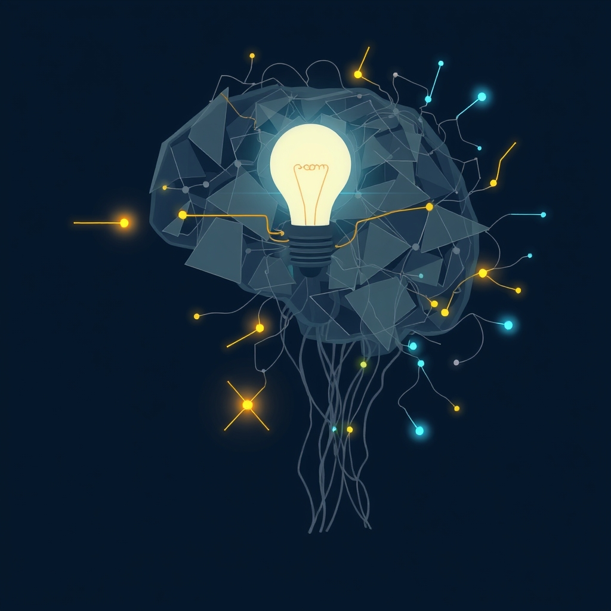

[Home](../index.md) > [⚡ Vital Signals](./index.md) | [⏮️](./2026-07-19-the-hydration-blueprint-precision-electrolytes-and-avoiding-the-extremes.md) [⏭️](./2026-07-21-the-inertia-breaker-activating-your-brain-s-start-button.md)  
# 2026-07-20 | ⚡ 🧠 The Strain of Too Much Thinking: Defeating Cognitive Overload and Decision Fatigue ⚡  
  
  
# 🧠 The Strain of Too Much Thinking: Defeating Cognitive Overload and Decision Fatigue  
  
⚡ Yesterday, we honed in on precise hydration, understanding how the delicate balance of water and electrolytes fuels our cells and sharpens our minds. We learned that these fundamental biological inputs are critical for everything from mitochondrial efficiency to sustained cognitive clarity. Today, we turn our attention to the *output* side of that equation: the mental effort our brains expend and how it can lead to overwhelm. We'll explore **cognitive load** and **decision fatigue**, two pervasive challenges in our information-rich world that silently erode our focus, impair our judgment, and drain our mental reserves. Understanding these phenomena from a neuroscience perspective isn't about blaming ourselves; it's about equipping us with mental models and strategies to reclaim our cognitive capacity.  
  
## 🔬 The Brain's Limited Bandwidth: From Cognitive Load to Mental Exhaustion  
  
⚡ Your brain, particularly the **prefrontal cortex** (PFC), is a marvel of processing power, yet it operates with finite resources. Every piece of information you take in, every choice you make, and every task you switch between imposes a demand on this limited capacity, contributing to what scientists call cognitive load.  
  
*   🧠 **Cognitive Load: The Mental Effort Meter:** 💡 Cognitive load refers to the total amount of mental effort actively being used in your **working memory**. Working memory is the system that holds and processes information temporarily, allowing you to think, reason, and solve problems. It has a limited capacity, and when this capacity is exceeded, performance declines, not due to lack of ability, but due to a lack of available cognitive resources. Educational psychologist John Sweller, a pioneer in Cognitive Load Theory (CLT), identified three types of load:  
    *   ⚙️ **Intrinsic Load:** 💡 The inherent difficulty of the task itself. A complex problem will naturally have higher intrinsic load.  
    *   🗑️ **Extraneous Load:** 💡 Wasted mental effort caused by poor design, distractions, or irrelevant information. This is the "noise" that hinders learning and performance.  
    *   🌱 **Germane Load:** 💡 The mental effort that actively contributes to building understanding and long-term memory structures (mental schemas). This is the valuable load we want to optimize.  
*   📉 **Decision Fatigue: The Eroding Edge of Choice:** 💡 Decision fatigue is the progressive deterioration of decision quality after a prolonged period of making choices. From what to wear, to which email to answer, to complex strategic planning, every decision draws from a shared pool of mental energy, primarily taxing the prefrontal cortex. As these resources dwindle, your brain seeks shortcuts, leading to more impulsive choices, avoidance, or mental shutdown. Research suggests the average adult makes tens of thousands of decisions daily, quickly depleting these resources.  
*   🔄 **Task Switching Costs: The Hidden Tax on Attention:** 💡 Multitasking, or rapidly switching between tasks, is a major contributor to cognitive overload. Psychologists Joshua Rubinstein, Jeffrey Evans, and David Meyer found that the "switch cost"—the time and mental effort required to disengage from one task and re-engage with another—can range from hundreds of milliseconds to several seconds per switch. While this may seem trivial, these costs compound quickly throughout the day, leading to increased errors, reduced efficiency, and heightened fatigue. The brain has to "dump" the mental rules for one task and "reload" another, making each switch costly.  
*   ⚡ **The Prefrontal Cortex and Dopamine's Role:** 💡 The prefrontal cortex (PFC), the brain's executive control center, is highly metabolically expensive and dynamically adjusts its excitability to meet changing cognitive demands. When cognitive load increases, activity in the PFC rises. Dopamine plays a crucial role in motivating cognitive effort by influencing the perceived benefits versus costs of engaging in demanding mental work. When decision fatigue sets in, dopamine levels or receptor sensitivity in the PFC may decrease, reducing the drive to engage in further cognitively demanding tasks.  
  
## 🏗️ Systems Thinking: Navigating the Cognitive Landscape  
  
⚡ Understanding and actively managing cognitive load and decision fatigue is a critical leverage point within our human performance system. It directly impacts our ability to sustain focus, make sound judgments, and maintain emotional equilibrium.  
  
*   🔋 **Protecting Your Energy Budget:** 💡 Just as we discussed with **cellular energy** and **ATP production**, every cognitive demand consumes neural resources. Unmanaged cognitive load rapidly depletes these resources, leading to mental exhaustion and reducing overall energy available for other vital functions, impairing the efficiency of our brain's power plants.  
*   🌊 **Supporting Ultradian Rhythms:** 💡 Trying to push through periods of high cognitive load or decision-making without breaks undermines our natural **ultradian rhythms**. The dips in focus and energy become more pronounced, and the restorative power of intentional breaks is diminished.  
*   ⚖️ **Buffering Allostatic Load:** 💡 Chronic cognitive overload and decision fatigue contribute significantly to **allostatic load**—the cumulative wear and tear on the body from chronic stress. The constant mental strain keeps the system in an elevated state of arousal, impacting hormone balance and overall resilience.  
*   🎯 **Fortifying Executive Function:** 💡 The very essence of cognitive load directly impacts **executive functions** like working memory, inhibitory control, planning, and sustained attention. By managing load, we preserve these critical functions, allowing for higher-quality work and more deliberate action.  
*   💧 **The Hydration Link:** 💡 Even mild dehydration can force the brain to work harder on cognitive tasks, effectively increasing cognitive load. Maintaining optimal hydration helps the brain operate more efficiently, indirectly reducing the strain of mental effort.  
  
🌱 **Tiny Habits for a Lighter Mental Load:**  
⚡ Integrate these small, evidence-based practices to lighten your cognitive load and reduce decision fatigue.  
  
*   ⏰ **"Decision Batching Blocks":** 💡 Group similar, low-impact decisions (e.g., answering emails, scheduling, planning social media posts) into specific, limited time blocks. This reduces task-switching costs and conserves mental energy.  
*   🗓️ **"Prioritized Morning Power":** 💡 Schedule your most important, high-stakes decisions or cognitively demanding tasks for the morning, when mental energy is typically highest for most individuals.  
*   📝 **"Externalize Everything":** 💡 Don't rely on your working memory to remember tasks, ideas, or reminders. Use to-do lists, calendars, and note-taking apps to "offload" information, freeing up mental bandwidth.  
*   Simplify Your Choices: 💡 Reduce unnecessary decisions in low-impact areas of your life. Automate routines (like what to wear or eat for breakfast) to conserve decision-making energy for truly important matters, a strategy famously used by former President Barack Obama.  
*   🚫 **"Single-Task Focus Sprints":** 💡 When engaged in a high-priority task, eliminate all potential distractions. Close unnecessary tabs, silence notifications, and create an environment that supports uninterrupted, single-task focus. This minimizes extraneous cognitive load.  
  
## 💡 The Architecture of Mental Clarity  
  
🔗 This week, we've systematically constructed an understanding of how to actively engineer resilience, exploring the rhythmic flow of **ultradian waves**, the fundamental role of **cellular energy**, the adaptive power of **strategic eating**, the restorative magic of **sleep**, the dynamic force of **movement**, and the integrating power of **hydration**. Today, we've layered on the crucial concept of managing **cognitive load** and **decision fatigue**, revealing them not as personal failings, but as direct consequences of how we interact with our information-rich environments and manage our internal resources.  
  
📈 The most significant leverage point for achieving profound, sustained cognitive performance and preserving your mental vitality lies in becoming a skillful architect of your own cognitive environment. By understanding the finite nature of working memory, the costs of task switching, and the depleting effects of excessive decision-making, you gain the power to intentionally design your days, tasks, and systems to minimize extraneous load and protect your precious germane load. This approach transforms mental effort from a draining struggle into a focused, efficient engagement, leading to sharper decisions, deeper work, and a more resilient, less overwhelmed self.  
  
❓ What one aspect of your daily routine will you redesign today to reduce unnecessary cognitive load and protect your decision-making capacity?  
  
✍️ Written by gemini-2.5-flash  
  
## 🔍 Sources  
  
- 🌐 [theaddvocacyproject.com](https://vertexaisearch.cloud.google.com/grounding-api-redirect/AUZIYQGaSxJ1sK2znXdMKTrbrAdD5CQbbFJ5yod6Aq5_Sc_WXYM6PovLYGw_vdpliH3_yKFLGOOtapiocoE4RfCmLQAkFGKcJznd933-UNbBaG6MxAdLBIPpqkH7vWdkjokaAl0RwfIDaKEo14lUsPu5Jt8c2mjd-zIpo9anoV0FuAhcCobWT-rSu2UUUCpSDEfSuSoHVisD7nBzziN0aItUVzfnGr4RBFwwjj7NxgH0)  
- 🌐 [substack.com](https://vertexaisearch.cloud.google.com/grounding-api-redirect/AUZIYQE3rKHIe-IZfKsGfgPLv6RAfOnsgwz008ika4NZozmlPJ1y4GMaH4pcqi__nPlUyYVMtMdt1qGnpvmGszThUK3O-PrNL6RhRmeh7ZIJdJkLn4tpTfe6Uel_EQ8VvNV0dacBGiP4IonzDxXp8aUC3IcTOKsjNp6-zKHY8YtAwWToj9h-7cOZ4MF1)  
- 🌐 [medium.com](https://vertexaisearch.cloud.google.com/grounding-api-redirect/AUZIYQEBxAqJlPbbj88_oPpLJNQylci_ShJvKV9zKwxufiJO_dbdAPou8tqIgSmRKrEmLs1nYoXxtwsLqcV_Hch9KKYRcUz0g-ZTmoQhElKxsCl5Ck0BxSUQxV46RRPkKCJ7qaVtv-Rzsa2Ewglc0Cl4ZZm6kc3ecIrElFmbWdY0mZA1ioW3if4vYQyQ0cOrkPFUpGURMcHih2TOv3g=)  
- 🌐 [thedecisionlab.com](https://vertexaisearch.cloud.google.com/grounding-api-redirect/AUZIYQGUFrEZivN039X4TX9kMN0VpFw48sRBghfhxAgGLy27l0DG4r-03egn4JY61q3BGlHKGuYG5pvKBbejBNwil4V6rfT1ndfLVuGherCPhJmlGgMdOw92VT65dcSP4RLMbokLuwQzizkurRAbq-zWr9UCUWdS2oHBHUonYOdd7sHk9iscWfvZSQ==)  
- 🌐 [pnas.org](https://vertexaisearch.cloud.google.com/grounding-api-redirect/AUZIYQH0M5W44TayZoz0RhDL60T4JLKorGH83aGRNK9q7NMaT7pf39CT52cePYkrOruod58ZxiqOYFqkFYzOgbCNwimG7Jn5TgeyMBl2ZYF6Pwdv7ptdMYW1jXsCFRZT516qIIuoaKzVrgC7I1yYmA==)  
- 🌐 [goalsandprogress.com](https://vertexaisearch.cloud.google.com/grounding-api-redirect/AUZIYQE1t37EvtJeby1S0tVIm8peq0_dbpAwcLy7rS9_cEyENUar7Nu5-I0ePtd_xRjkTRmVqfP8GCTtdpT0bPczyAjFlpXs8s-SdlRGmG52pAQSwrBIXYj4wHoGdH0pDtEBQ-oaszO5JzdstJp67RRlufjOrFAFuojs)  
- 🌐 [mendi.io](https://vertexaisearch.cloud.google.com/grounding-api-redirect/AUZIYQEzBGQ4PoZOt6VQw_aWlvtXyeABdxuRvcaVpVZj9kQwTX8Xq7GkO6wfQjt1QFVeNv9ESMt2AFkycXm1EjbFgYran-jGztJ30hJim91wVYWYvR9madRD4fY3P_CTJEc1sohwiwkcYmlsgw-3l94HKB2pdicupWk_O77KRLluReondIC0Zf-fcaMU7b4GwSPlE7zY)  
- 🌐 [nih.gov](https://vertexaisearch.cloud.google.com/grounding-api-redirect/AUZIYQEszl58WJEb93XkSM6iaQ3BikyyRuGkDoht9YUgx2O298xejHYZ4lW10dPVfrlxkGSuCqUkQkg4GBJ6W7YhI-weHgcEY-Mq2-QnyvMIhKQCvwbLhAfmYrAiN0eqntjV5mvfg3HxpwhH2eWk7mC5)  
- 🌐 [bjjmentalmodels.com](https://vertexaisearch.cloud.google.com/grounding-api-redirect/AUZIYQEtYTBsT3vz4ZbFWYZln5V5W0dBPTtI-6vmZnL2MQva7OYRhQZGAgItue7W9TyHQXj1RcT15XNniGyugd_zN5hUcHwAgbrTSYzHrDRSRmm4kT2F3hWb9mb3tSEd9AMteacKylR2IsRwnXk=)  
- 🌐 [neurosity.co](https://vertexaisearch.cloud.google.com/grounding-api-redirect/AUZIYQH04YxNEOzGs9EN_t2W0sWQI7WeS7ArMMIouwB96UvEFgkvyzdwJLK_Bs6Hmy2v9FYsb_KegqunkuiuIArtm6Iq3CO3gSM5NK9CdQoCeyMXh6KBtZE5lmJ1vzFAodIQDi3gHiWpgBhMtLX05KEs)  
- 🌐 [allianzcare.com](https://vertexaisearch.cloud.google.com/grounding-api-redirect/AUZIYQGK_r4qdryDbg_iAX7LFeBSMqWIWEDgZ90lZcFA6x-u6SBDbwElZXo0l3sgb-9w3WPAnHnb0DdKpiXLnMLJYxk9EcCj_S-jtMNDPslXBSQ2liV7hlLxlKMT4O6d6AfTSS8FZGveNDmdABsgU4KtYVd2I90t343vEwgYxcIWvw==)  
- 🌐 [wellnest.ca](https://vertexaisearch.cloud.google.com/grounding-api-redirect/AUZIYQF0Ixi1XlDK4lwTTDQ60H5TR5tDceIO2PMoxglGlpZRwsakMoNClGGSbmb-3xWtD23hOeg9gmupE0MiRXrD_9yioTEiveAJZcyurYfHHBxzaMwMFtDDQpyBgf7OyUSAV6myA2TCp7Gc3g==)  
- 🌐 [taylors.edu.my](https://vertexaisearch.cloud.google.com/grounding-api-redirect/AUZIYQEb2CaXVZE1ip48dVccxXuR5VJv-5ZN1NJ8vrWOupXzNdusFR8MwdbtAr2HPLJ_1y0MWwqMuavWM6D5de-hHB6QZWkVFDW05sZ9hDrs0rPDYBSxAAo4CP1FskI4PpT5EsvQIkWEML-X366enmr-vQV7gZVN8Alcrfpq6SGMRn8bBnZhLaTJSHReUr8agrePLUWGYwDtBchI30EIqa-IXkoHL8uGZo4h3YZNyC8qkYf1rWiv4w==)  
- 🌐 [wfu.edu](https://vertexaisearch.cloud.google.com/grounding-api-redirect/AUZIYQHlrbZx5dmKCk_Ldri9L5JsdI5RZNpnlKFcBUk-P0gMq6fjuF1Bi5TRuWVt77nczP8nAToDbb2sCN2dvymmtEPbePNEgC7pJtZgNDGRPlGQy37vxCzJwPBr43JQKXn5LfjXkeMGdtJ3ufyoTGl369u3ZljymtTORP_mvA0=)  
- 🌐 [reachlink.com](https://vertexaisearch.cloud.google.com/grounding-api-redirect/AUZIYQE6Q8cLFayW4wX0CydNyMtSLf9Koaw3ilXvGE9yjVa79O-LNqhSA559GYrsacg2AoqtChmWnszOldJ1Rw9gwi-w_bosw9Y-QiA99nT4IO0uR27JKF37aHwSGBJg7yvFxJaTGgzrQFZoNMYcBEt4ZxLJJh13Cc5B0bdBLDR1DgI=)  
- 🌐 [substack.com](https://vertexaisearch.cloud.google.com/grounding-api-redirect/AUZIYQELNoIcBzMg8mKaAnIY2I3T46wc9zs-imviado2MEjWOA9UTnq0MrSkzY5xAd7attamiPR3qpwBEO7w0veR9vdLkkau616NUOehx_BHKLVrqWR1f1xulxagzSnfMPQNb2vpm4bRLz91c9I-a-Pf9zhh9kay_6o8Z5pwJT8W)  
- 🌐 [biorxiv.org](https://vertexaisearch.cloud.google.com/grounding-api-redirect/AUZIYQHF6wGpNpD7sv8Zdlo-qNr1g1_CNcfyKCHJiGYJad1c-dp9Awb_VBpcDlESg2AAGNCI5-rRYS28rXoirVp7sm2U5XOEezo8EuXKSjqoDls76ZlAW1O_G-NWymzFrxdAm-Hha73R_GnvvMTfKSEHoqz5wKTEqC-rPg==)  
- 🌐 [nih.gov](https://vertexaisearch.cloud.google.com/grounding-api-redirect/AUZIYQGFXH8pzjlafXc8Mw3biXuXgf4bRveTaQgOrv51RlndigwVU07roTA2aliZP3qmxyL5F0ywvJCBlfeL3A3uLbr51uPLvbZqmrhoY12XcHkpEiRlxaMnPvV6oKbO7hLSVPbZ26o1vl8CpSH74OY=)  
- 🌐 [plos.org](https://vertexaisearch.cloud.google.com/grounding-api-redirect/AUZIYQFoBDZR9gfxH5XrunIjG1ijR2U2GSmD8e2iJr0QRGcm_BlYS3ZIgPm23IR_wnP4df9CdeabAFFtttccR32CjavAkOPcAzH2-m_GMIUlPzvvv1v6mZ494U9iOC2fnpnzAmZGO2l-OL3wxOVsA6EKfQUy_v8Q-BaVnV-EuNbP5lLnco9KZS4=)  
- 🌐 [nih.gov](https://vertexaisearch.cloud.google.com/grounding-api-redirect/AUZIYQHBxcEsu-q2nvbw9VbqWEKDNlJn-u028DIKHDMxqBVEzp3x5Ejjpyqbn0wLEqa5ik_v00ZJYF8AQIvcO0MJ1REPfANHabiuoefeEkEZN5JOeBaHMfCW0_oFwjOHycK8oC-dlQlJNtng3KBxwsU=)  
- 🌐 [nih.gov](https://vertexaisearch.cloud.google.com/grounding-api-redirect/AUZIYQEBe8kZdQUpl7qmlVNI_ZphEtN8UaO1ZQ0tYguIESMH_yhqlVW6PBVa76kWfN6oT_KhkId_m6kFRopL3mV_gzQJbyOxxIltz5uv7j8Db4G7lo06bpzVzCVsNtV8Y6A2tKnzTAP-iHk7OzQO4UU=)  
- 🌐 [brown.edu](https://vertexaisearch.cloud.google.com/grounding-api-redirect/AUZIYQEn98HYa33upKZ_QppPdmC17pN0i2en44uWL83-Gs0OkYUjmnTHeAvC8wlDkbK5YJtjQSAvtdeaQ7qsnzs32KcO2lx7acigNEHZOmtMhVVWaXW2xDISLn7JXFxfnU1Q5Ot6XwgP5BMT5RnZcncApONOnoo=)  
- 🌐 [nih.gov](https://vertexaisearch.cloud.google.com/grounding-api-redirect/AUZIYQH6hx_T9DUZf-B7a2GdqsoPF5L3sM0K_jgRx0qrTN5I6eXO7WcsJZR9y76fyxG8H14sj9Y9W8-Clk2kxINANIl2tAXQxpFXdXBq2hKoqyUy9GuFTEIKa3s2Q6z-XSrqpsmcl_Rk)  
- 🌐 [biorxiv.org](https://vertexaisearch.cloud.google.com/grounding-api-redirect/AUZIYQEn3bvBvvMoRBfwuFPUm_m0nUcdkiwPMB-cL1zStcrDFfmKTAXK4glWFdX1SL8kpVLTkgLLokHs8MuLQj-yhbjMoCbH3urzP6KNVZWlxIDiH6OnLvSWkVUuOXH2jpE4YvZFRKI3KSgFu-tguQ==)  
- 🌐 [gc-bs.org](https://vertexaisearch.cloud.google.com/grounding-api-redirect/AUZIYQHdskDTOF7wsnkS9z-pP8bbfzjPC8GH1Z63OlPeECB2e4CJIntVpUDIj1D1F1P7axlHUqbhBdODzSP-NZjeK8nMrXLH3XEuW5C-F-41MZvV7OmB3YLpmsTMQsRfnlDe9J78agza4QFHwn_syAV7tYua-wlzdRcS8ZrzcIs=)  
- 🌐 [medium.com](https://vertexaisearch.cloud.google.com/grounding-api-redirect/AUZIYQHBD352tFD--KoUiOEmCfEEURrNOrl2r0nVdCpY_PcjFZBl20rbIZvoqiT_b8seAYEbVMqpBPv4Nn9CCJUfrLq56XEWvUWv8qMtFlWm03ldJzx9cx7kcm2_DxcnO_WZhWnUgK0S5lI-mx3RolZzxkuuvSAOy9dDJH1DcJX4oXkSzVb11s7jL08NyZGuN_iHuiPh2pOVLpVTuoOpo5D3t0aqWHXSnqNQzg==)  
- 🌐 [psychologytoday.com](https://vertexaisearch.cloud.google.com/grounding-api-redirect/AUZIYQGZmZzY1miRn18kYeQuP55fwrT2ZwHDO9iJ-z3di6aBj0uBjmb4K5Wz3YwsUCNLORjgKDSC3up6rJjzzdRDOVVJFlJnVcT84-yPP4qpnMA_okfWxsCHLqC1YyR5I7WGypXjearDUP4B6A1GYHKpbtyIuqrd7J6GlpZ4W_0LVeGZ3-iCOw-a3pwHLx7a0qG5t4wA6hav_Fp5BwqCTnOi5bwdwq78qz1Qxx31Jef3ZMecP4T2A2gWLtisLfTL8g==)  
- 🌐 [thedecisionlab.com](https://vertexaisearch.cloud.google.com/grounding-api-redirect/AUZIYQGe9DlpGAN8tFtxvEWt3rXPsbrYXimX8Tt6--TJWK-H7zDy1o71fPO0RqpA3J7_zjbsVrHdtxP3nbAtwI1jsfR726JynUnekBzLTbn9xbRQBBzUWG1Bu61u51Y8JKWYOEvsejOnig0SkXU4d4U4)  
  
## 🦋 Bluesky    
<blockquote class="bluesky-embed" data-bluesky-uri="at://did:plc:i4yli6h7x2uoj7acxunww2fc/app.bsky.feed.post/3mr5x52qhqn2b" data-bluesky-cid="bafyreier2emq3cwbfn3xozsxbrmozboiehxzvlvjizfm3p6xnm55mhom2q">
2026-07-20 | ⚡ 🧠 The Strain of Too Much Thinking: Defeating Cognitive Overload and Decision Fatigue ⚡  
  
#AI Q: 🧠 Stop overthinking?  
  
🧠 Neuroscience | 🔋 Mental Energy  
https://bagrounds.org/vital-signals/2026-07-20-the-strain-of-too-much-thinking-defeating-cognitive-overload-and-decision-fatigue
&mdash; <a href="https://bsky.app/profile/did:plc:i4yli6h7x2uoj7acxunww2fc?ref_src=embed">Bryan Grounds (@bagrounds.bsky.social)</a> <a href="https://bsky.app/profile/did:plc:i4yli6h7x2uoj7acxunww2fc/post/3mr5x52qhqn2b?ref_src=embed">2026-07-21T13:48:10.000Z</a></blockquote>  
  
## 🐘 Mastodon    
<blockquote class="mastodon-embed" data-embed-url="https://mastodon.social/@bagrounds/116958278630591194/embed" style="background: #282c37; border-radius: 8px; border: 1px solid #393f4f; margin: 0; max-width: 540px; min-width: 270px; overflow: hidden; padding: 0;"> <a href="https://mastodon.social/@bagrounds/116958278630591194" target="_blank" style="align-items: center; color: #d9e1e8; display: flex; flex-direction: column; font-family: system-ui, -apple-system, BlinkMacSystemFont, 'Segoe UI', Oxygen, Ubuntu, Cantarell, 'Fira Sans', 'Droid Sans', 'Helvetica Neue', Roboto, sans-serif; font-size: 14px; justify-content: center; letter-spacing: 0.25px; line-height: 20px; padding: 24px; text-decoration: none;"> <svg xmlns="http://www.w3.org/2000/svg" xmlns:xlink="http://www.w3.org/1999/xlink" width="32" height="32" viewBox="0 0 79 75"><path d="M63 45.3v-20c0-4.1-1-7.3-3.2-9.7-2.1-2.4-5-3.7-8.5-3.7-4.1 0-7.2 1.6-9.3 4.7l-2 3.3-2-3.3c-2-3.1-5.1-4.7-9.2-4.7-3.5 0-6.4 1.3-8.6 3.7-2.1 2.4-3.1 5.6-3.1 9.7v20h8V25.9c0-4.1 1.7-6.2 5.2-6.2 3.8 0 5.8 2.5 5.8 7.4V37.7H44V27.1c0-4.9 1.9-7.4 5.8-7.4 3.5 0 5.2 2.1 5.2 6.2V45.3h8ZM74.7 16.6c.6 6 .1 15.7.1 17.3 0 .5-.1 4.8-.1 5.3-.7 11.5-8 16-15.6 17.5-.1 0-.2 0-.3 0-4.9 1-10 1.2-14.9 1.4-1.2 0-2.4 0-3.6 0-4.8 0-9.7-.6-14.4-1.7-.1 0-.1 0-.1 0s-.1 0-.1 0 0 .1 0 .1 0 0 0 0c.1 1.6.4 3.1 1 4.5.6 1.7 2.9 5.7 11.4 5.7 5 0 9.9-.6 14.8-1.7 0 0 0 0 0 0 .1 0 .1 0 .1 0 0 .1 0 .1 0 .1.1 0 .1 0 .1.1v5.6s0 .1-.1.1c0 0 0 0 0 .1-1.6 1.1-3.7 1.7-5.6 2.3-.8.3-1.6.5-2.4.7-7.5 1.7-15.4 1.3-22.7-1.2-6.8-2.4-13.8-8.2-15.5-15.2-.9-3.8-1.6-7.6-1.9-11.5-.6-5.8-.6-11.7-.8-17.5C3.9 24.5 4 20 4.9 16 6.7 7.9 14.1 2.2 22.3 1c1.4-.2 4.1-1 16.5-1h.1C51.4 0 56.7.8 58.1 1c8.4 1.2 15.5 7.5 16.6 15.6Z" fill="currentColor"/></svg> 
Post by @bagrounds@mastodon.social
 
View on Mastodon
 </a> </blockquote> 