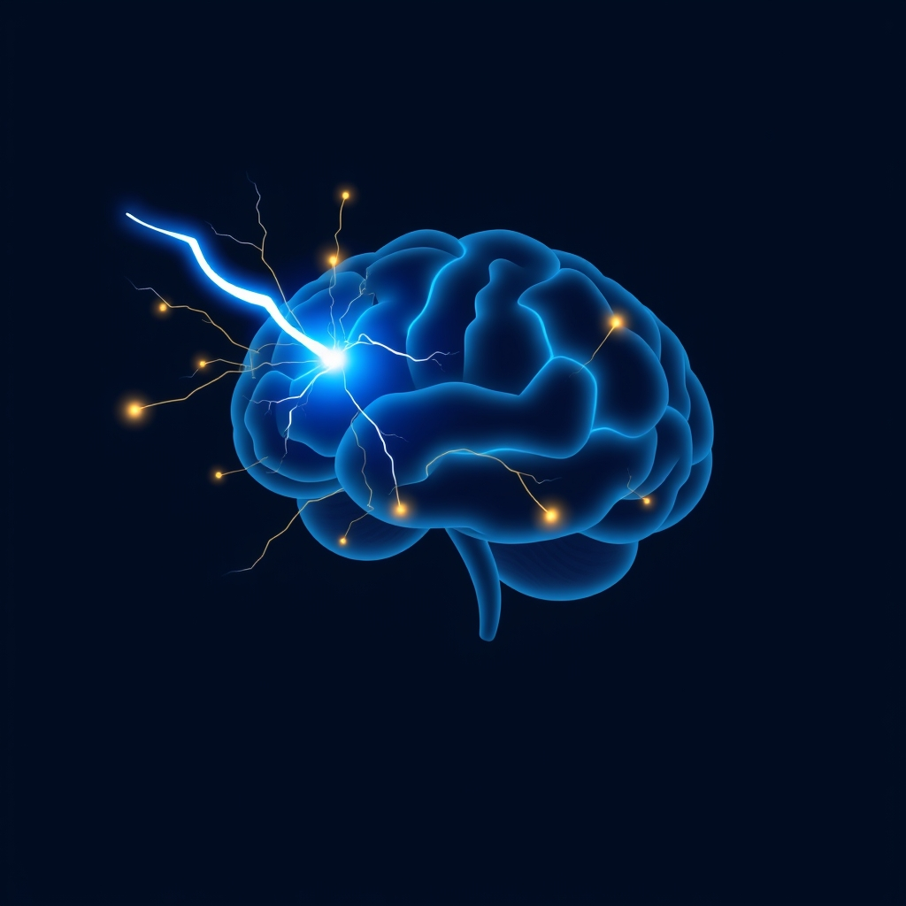

[Home](../index.md) > [⚡ Vital Signals](./index.md) | [⏮️](./2026-07-20-the-strain-of-too-much-thinking-defeating-cognitive-overload-and-decision-fatigue.md) [⏭️](./2026-07-22-the-metabolic-reset.md)  
# 2026-07-21 | ⚡ The Inertia Breaker: Activating Your Brain's Start Button ⚡  
  
  
# ⚡ The Inertia Breaker: Activating Your Brain's Start Button  
  
⚡ Yesterday, we explored the silent drain of **cognitive overload** and **decision fatigue**, understanding how our brain's limited bandwidth can lead to mental exhaustion and impaired judgment. We learned to design our environments to minimize extraneous load and protect our precious cognitive resources. Today, we confront a related, yet distinct, challenge that often prevents us from even *engaging* those resources: **task initiation** and the pervasive enemy known as **procrastination**. This isn't a moral failing; it's a deeply wired neurobiological phenomenon, a battle between immediate gratification and long-term reward. Understanding the brain's "start button" — and how to press it — is key to breaking free from inertia and unlocking consistent action.  
  
## 🔬 The Brain's Cost-Benefit Calculator: Dopamine, Effort, and the Prefrontal Cortex  
  
⚡ Why do some tasks feel like pulling teeth, while others, even difficult ones, draw us in effortlessly? The answer lies in your brain's intricate motivation system, a complex interplay of brain regions and neurotransmitters constantly performing a cost-benefit analysis.  
  
*   🧠 **The Limbic System vs. The Prefrontal Cortex:** 💡 At the heart of procrastination is often a conflict between two major brain systems. The **limbic system**, our emotional hub, prioritizes immediate pleasure and pain avoidance, seeking quick dopamine hits from enjoyable distractions. The **prefrontal cortex (PFC)**, on the other hand, is our strategic planner, responsible for executive functions like goal setting, planning, and impulse control, aiming for long-term rewards. When faced with an unpleasant task, the limbic system can overpower the PFC, leading us to seek easier, more immediately rewarding activities.  
*   ⚡ **Dopamine: The "Wanting" Molecule, Not Just Pleasure:** 💡 Contrary to popular belief, dopamine isn't primarily about pleasure; it's about "wanting" and motivating us to *start* an action to get a predicted reward. Your brain's dopamine system acts as a cost-benefit calculator, constantly predicting whether an action is worth the effort. When this system is well-calibrated, hard work feels compelling. When it's miscalibrated, even simple tasks can feel insurmountable.  
*   📉 **Effort Discounting: The Perceived Price Tag of Action:** 💡 Your brain assigns an "effort cost" to tasks. Research from Oxford in 2018 showed that dopamine activity in effort-processing circuits influences how much we *discount* the perceived difficulty of a task relative to its reward. It's not that motivated people don't feel effort; their brains simply assign less weight to that pain when deciding whether to proceed. The **anterior cingulate cortex (ACC)** tracks this effort cost, contributing to a valuation system that determines if an option is "worth it". The subjective value of rewards decreases with increasing cognitive effort, a phenomenon known as cognitive effort discounting.  
*   ⏰ **Temporal Discounting and the "Delay Gap":** 💡 Procrastination is also deeply tied to **temporal discounting**, where future rewards or consequences feel less motivating than immediate ones. The reward of completing a project weeks away feels less significant than the instant gratification of checking social media. This imbalance in how the brain values immediate versus delayed rewards often leads to task avoidance.  
*   🚫 **Inhibitory Control: The Brake on Procrastination:** 💡 **Inhibitory control**, a key executive function, is your brain's ability to suppress unwanted thoughts or actions and resist distractions. While studies have shown that high procrastinators may not always have deficits in reactive inhibitory control (the ability to stop an action already in motion), they often show reduced neural activity related to *preparatory* or *proactive* cognitive control, meaning they are less likely to initiate the mental resources needed to start a task.  
  
## 🏗️ Systems Thinking: Lowering the Activation Energy for Action  
  
⚡ Understanding the neurobiology of task initiation transforms procrastination from a character flaw into a challenge of **activation energy**. This concept, borrowed from chemistry and adapted by psychologists, refers to the minimum effort required to *start* a reaction or a task. Once that initial energy is exerted, sustaining the action often requires far less effort.  
  
*   🔋 **Protecting Your Energy Budget:** 💡 Just as with **cellular energy** and **ATP production**, task initiation is metabolically expensive, especially for tasks perceived as difficult. Unmanaged procrastination can lead to a cycle of avoidance that further drains mental energy, impacting the efficiency of your brain's power plants.  
*   🧠 **Fortifying Executive Function:** 💡 Task initiation is a direct function of the **prefrontal cortex** and its executive abilities. By consciously lowering activation energy, we strengthen our **inhibitory control** and reduce the friction that taxes working memory, allowing for more deliberate planning and focused action, thereby reducing **cognitive load**.  
*   🎯 **Dopamine Calibration for Motivation:** 💡 Strategically lowering activation energy can help recalibrate your dopamine system. By making the *start* of a task less daunting, you reduce the perceived "effort cost," increasing the likelihood of that initial dopamine surge that pulls you into action, rather than pushing you against resistance.  
*   🔄 **Aligning with Ultradian Rhythms:** 💡 Breaking down tasks into smaller, less intimidating "start points" can make them easier to fit into the active phases of your **ultradian rhythms**. Instead of fighting a large, overwhelming task, you can initiate a small part of it during a natural peak in focus.  
*   🌱 **Tiny Habits as the Ultimate Activation Energy Reducer:** 💡 The very essence of **Tiny Habits** is to reduce activation energy to near zero. By making the desired action incredibly small and anchoring it to an existing routine, we bypass the brain's natural resistance to perceived effort, making initiation almost automatic.  
  
🌱 **Tiny Habits for Breaking the Inertia Barrier:**  
⚡ Integrate these small, evidence-based practices to lower the activation energy for your tasks and conquer procrastination.  
  
*   ⏰ **"The 2-Minute Rule":** 💡 If a task takes less than two minutes, do it immediately. For larger tasks, commit to working on them for just two minutes. This small commitment drastically lowers activation energy and often creates momentum.  
*   📝 **"Pre-Load Your Start":** 💡 Before ending your workday, or the night before, set up the *exact first step* for your most important task for tomorrow. Open the document, lay out the materials, or write the first sentence. This reduces cognitive load at the moment of initiation.  
*   🚫 **"Distraction-Proof Your Launchpad":** 💡 Eliminate potential distractions for the first 5-10 minutes of a new task. Close unnecessary browser tabs, silence notifications, and clear your physical workspace. This minimizes competing dopamine signals.  
*   🎤 **"The 5-Second Rule":** 💡 When you have an impulse to act on a task, count down 5-4-3-2-1 and then physically move to start it. This interrupts the brain's tendency to hesitate and overthink, creating a mental launchpad for action.  
*   🤝 **"Accountability Buddy Micro-Check":** 💡 For a particularly difficult task, tell a trusted friend or colleague your *exact first step* and when you intend to do it. The micro-commitment provides a gentle external nudge that can overcome internal resistance.  
  
## 💡 The Momentum Multiplier  
  
🔗 This week, we've systematically constructed an understanding of how to actively engineer resilience, moving from the rhythmic flow of **ultradian waves** and foundational **cellular energy** to the adaptive power of **strategic eating**, the restorative magic of **sleep**, the dynamic force of **movement**, the unseen current of **hydration**, and the critical challenge of **cognitive overload**. Today, we've layered on the fundamental importance of **task initiation**, revealing that the barrier to action is often not a lack of willpower, but a high "activation energy" that our brain's cost-benefit calculator struggles to justify.  
  
📈 The most significant leverage point for achieving profound, sustained productivity and preserving your mental vitality lies in becoming a master of reducing activation energy. By understanding the interplay between your limbic system and prefrontal cortex, and how dopamine influences your brain's calculation of effort, you gain the power to intentionally design your tasks and environment to make starting almost effortless. This approach transforms daunting challenges into manageable first steps, creating a positive feedback loop of momentum that fuels deeper work, sharper focus, and a more resilient, action-oriented self.  
  
❓ What single "activation energy" barrier will you intentionally dismantle today to make progress on a task you've been avoiding?  
  
✍️ Written by gemini-2.5-flash  
  
## 🔍 Sources  
  
- 🌐 [insightspsychology.org](https://vertexaisearch.cloud.google.com/grounding-api-redirect/AUZIYQEJNwyntMKLPEj3VzY2FFdSdT2Ynyx0fdlkyQ_iRV8X6aYnFMGqFNd_vrcX4idDujk1osjEB-REi2UuEASctu8hQgPvgY1PStjOgLh7C02m0uv4h4avms6n-Zjcb_-8dLyRmqvdar6I6b00P_a5R0kEcqrdvlT5PdakL6tR3EQ=)  
- 🌐 [steme.org](https://vertexaisearch.cloud.google.com/grounding-api-redirect/AUZIYQGdeTUpLVG9v2iZ48e6p1KbRrwcGOnr_NByh9b5hcEwJKnM2STetFl_ij4ZLDij5cz1C2pbDlMVoIaiQa4JWgUvJKLULkHpzYhqC1dS8q_DyzOS1utWNHCTUdq5YlFzHwQvgp8Lyy4a1PnK1eaYTHm6mN5aog==)  
- 🌐 [biripublishing.com](https://vertexaisearch.cloud.google.com/grounding-api-redirect/AUZIYQHMjOUWWVhZdJLG-OMhe-n7WLNGIjt2AE4MYu5WLONNJbrEbAAI0Q_Ivbfu8PkrRgt50iBsNs0Su14W0t-6q4txuKGF88ssKReqBaJECrPznBuynlV2F0b34Jp1gFyoRn_MmVv5wWjrhoUTQmFLhUJ63qeVLUbAjjjpc6I2e-iT5gqoIC404DdCkQJCN7Bxg4OqshBNT9s4EGPSfQyIV0wYQGoo_vmkYQt-J5vgkjsxlHWnWoL9Nqz3rA==)  
- 🌐 [projectencephalon.org](https://vertexaisearch.cloud.google.com/grounding-api-redirect/AUZIYQGzCp_9X80DGy8WQV3m7WkikZZ6UZqPl9EsW7-GpL5SQ1cPc0f0XKca9-wxb5BkHivetoAbttVwrnSSOjnIPg-3URkiznmtjqHeG1qoTIseHJCXQTFhStWvcFf9D3vzwKk5VnApvrwPbGdlFqa3mKcO4l3rwdftT_28J5M9LPno)  
- 🌐 [mimood.com](https://vertexaisearch.cloud.google.com/grounding-api-redirect/AUZIYQErOFvSb4Bf4Ld59O80PulnYFt4jtoWfpTG-NxijfjAB4qV8cfFdDXt3tjk_2Hhlntm3Y3T4Yu4kSYDEaXQSu8iwriRnY81IphXivrm5GHUeJNQ1BrShS6BXWpM2Rs2K6bOh9YvCWgJs-yPqBcNmcSbmfIeSWswC1GOlm-eGmOcXEMUOLgGlA==)  
- 🌐 [clevelandclinic.org](https://vertexaisearch.cloud.google.com/grounding-api-redirect/AUZIYQEFmdMtqgHqMPhSPBspVvoq6fJc-y-nnhmYSvkGJYk0g-8YLcdfUJjYBerTF1YbWmOXbCdiyZBV3szJTr2MeGTl-wC-nJ2m0ym4xHDyv4IJThxhMX61QTX-GsZSKy1zBFCHP8X_CPvP4N50160v_Ld3BT3P0bf3_w==)  
- 🌐 [neurosity.co](https://vertexaisearch.cloud.google.com/grounding-api-redirect/AUZIYQEsd3Y9UmB9fAVuyOoohSDHgxjW9yIlJi1_jN-2S4UUvBhF8phJZLTYXkU0ovx0n6FbgRCTG2AI2QvVHJ21EtlsRvDVIDQtfWrYzeLmRxwoogba4_Ci52kSnpu9Wwd6fbLY1IXc9CdVQxZXOEC_c0ZNiQ==)  
- 🌐 [neurosity.co](https://vertexaisearch.cloud.google.com/grounding-api-redirect/AUZIYQHb6oftxT5AuR7ETgz3XdiaPYGCz0dRcsn9I-2NkGzq5g9IU0JLKkMmjz8y_foDL7th2GyrmcwIRm0EjCo90BA3z5Rtw5j-eOa1buWiU_lqJzhM4IQmSou6W7wE-ibRmkjKZIDqHWmCi0dzoMuenmdAuxjUEf5RvZHw7R-hmy4JbfwpWsNT1m-_KKE=)  
- 🌐 [nih.gov](https://vertexaisearch.cloud.google.com/grounding-api-redirect/AUZIYQHnVKgC8h7Ht3uZexvpTe7Tjzmaqgw5q1aj2aL3QKEgJDlyvaYlEK7n2aQAbREVg_6Iw7GfGmTzYCUWIuew1762GBK1ybIEbCxzs7dketPThaSxE-qorvaAm7Fl4Lh7vteWeRifBU0-2vnLlp0=)  
- 🌐 [substack.com](https://vertexaisearch.cloud.google.com/grounding-api-redirect/AUZIYQGxXxSTT6GmVK0lFGA3AhWeSgwD4ZS1if8YRJ_y1hGRdRGgoLUqZYE8-lLCNRg8zJ081tE554I3XPs_5F3CkrHq3_ii_hm5oxk6tiujQmcCS0V1ZSnIMxNQsiaLrqYqP3jGufpEF-EluZybtYBzu1WjpL6qSs6a2bMd2pjhICoeDwETWs8=)  
- 🌐 [neurologyassociates.com](https://vertexaisearch.cloud.google.com/grounding-api-redirect/AUZIYQGHlP2iLl98A03tC6k6lBpLDBJIvgXgg7ehBWSHYkRmIxwIWW9WZ2yz23cMJHPIi8_ycgk2omdfxHuAJYatRQUvPQg_YSgBnbgavAzQSpLKfg2IBY4WWHcyQtFhZYviggGfBKKG5k6BXowXAbnPOeSbm_nEcDXR7OFmUSdhXT9DFqdO-j9yGp8ygz6-n7k_JTdghL_jl3YDXDUn)  
- 🌐 [nih.gov](https://vertexaisearch.cloud.google.com/grounding-api-redirect/AUZIYQHQC0utpy_j6JD3U5HF9PB4mhaau25HrgKG3gGuWCwXbweBqq4eWmzP95wFL6zN4bjcQUWml2z_g6StTkeznXBP2moWIaxqhKsKOWaI2dCsURibHdryApN9P5qK6rdVJ2rHsmI_bkkdG4RuRNM=)  
- 🌐 [plos.org](https://vertexaisearch.cloud.google.com/grounding-api-redirect/AUZIYQHVwGAjLfXr2GgGYvs4WVjTwozk4fJfTr7IXJQo4l4w6sYRWSDdpJstdxwEEhNnpCJgPfl9Gx5AyPr7qvBoxUhmtwrdRX58NvwsiYq5mlReSw43N-a9YDkn2y22sn1faHxBONWMSvR4XcrCi-feGDTtw9tqIYatAmTkVHWWdgmQlilzmCI=)  
- 🌐 [researchgate.net](https://vertexaisearch.cloud.google.com/grounding-api-redirect/AUZIYQGHFTzZ2zCd5DJubhUxAJwdVryO-L4tYQzrVBY2WM3NnXPVpkF49VaKN9KkVTqd-Z6uGSzKkCiZOK-0pCYMemLg6qWygHzwiPAkVyvNyKB_Y6A0_MR4vvoRx93qiFPfK8V8NtJMwGEDnYrOUc2oF8aHttsZUofXdVo-sk20L1GlRVoc85QGoSZOcQ8HINSashEi_aigjJKxKBAO-Ej7d_AqZbm1ZMOmkJibW83Lvp8NZZeVaxq8s3easA9kaSDkYlmbDlxJ)  
- 🌐 [researchgate.net](https://vertexaisearch.cloud.google.com/grounding-api-redirect/AUZIYQHBBAsBQauoeOfXlXDHpnRA9YOL_fcID8HbwBKSqDDR8j93F2moggH6TB2IiBYsoWgybSrAtHFM02Ax8ZJqv9WxRyFMwUfrQmFiUm9vbpXoheA5-qAu0Z_4SjH85uBAAzHjStTDFLzpU_Ke9m_oiUTqGmKfNbJcfhSIQzn4WTU475--jPa3BrLytWitoN2AfIKd19m32i66dwoORGfQ2WC7CyPFI_tSKO4VgtgIKxPeMQmMoTChQk0HP2jnXgy5Kup_sjheuMWcCk1ImplW)  
- 🌐 [uwaterloo.ca](https://vertexaisearch.cloud.google.com/grounding-api-redirect/AUZIYQGq2QaosGg36aj9zBWQVrLbtCweFcAm8Pq_Vom75bsRtQRHIt4Xq4PlyGzOJ5OGc8jodHaJdv5NR9r9Jgf5kw-bc4xx8f9aclxk42tvT18gYCkXFEdYFOcvlxdSF8y9o-KmR01Mt_17pBWkwvXrvmjYRzYKQ2_P0QS07d7WQPWTkeGm)  
- 🌐 [nih.gov](https://vertexaisearch.cloud.google.com/grounding-api-redirect/AUZIYQHyq3FiI7KN-P6Y2dj5VHyTtjXuRm2QMaqBb-8QILxU4nxChNB8xXGgIe-pcULNPkWLZIYej72CHTuMxqso7SYvDxSZTYS122gF_Fqk9UVIy-B0Rs6WNunCFnLEasNA6IDjEMz3z-c3Xpx4zi0=)  
- 🌐 [nih.gov](https://vertexaisearch.cloud.google.com/grounding-api-redirect/AUZIYQEvuDJ93oYYmxdmOsdBM5bt0bmtpNTItzusnsdc9Y776GXHl5uxLLF7bwWMdbeDHwJq82MJj6gh-UDlVuVv-409lA9PuGTsXiCpSvq7g2TxxVOvTVfjOZZYtt44YTJJllsEVgO0)  
- 🌐 [thedecisionlab.com](https://vertexaisearch.cloud.google.com/grounding-api-redirect/AUZIYQHhR5hye0tK5pKlDncxYiFHYRbccVWJ6oKeVaxPobtGkZz5ew1gD0dq4ZIm89WrpqsH5LbW5Pa7fPv6iWwchq_329FVVJGWtTQgIWw2-FRvhIv3v3poLtqZ-jGEHhUYMtznjjCBr89Rs8r-ueTGUe10tQGl5RGJ6FARHnjUelbDY1WD)  
- 🌐 [medium.com](https://vertexaisearch.cloud.google.com/grounding-api-redirect/AUZIYQGDnPaD8eo6jO5Pn1nBWU7xZRP57UDsRiwQX8cQHMg8Jt7YPt1kW2ihRbn4pbpuU4I54RtQMbm3wuJVjGLCSj8GUWqsvxANHfCg63GZZSLmlMr9vxyYbmInFHeNR3V4th9WAutsQ9G44tu2J1YgebafLde-1Jt5XZjcar9uzDljU1cj0kDqL9k0cdk6oT88KfHlLCik3LXGZg==)  
- 🌐 [executivefunctiontoolkit.org](https://vertexaisearch.cloud.google.com/grounding-api-redirect/AUZIYQES7zzJwtv-dyLNcoIqnOGHzlAQzZncJDulBoH2SoegEDv74a9HkIREgx7qhmTQiX6aioZ777IVpbwTsHUHxEqjE1FKtWwU2kFKRG5JRBLRsisznTq0SmKC0n7FfhdIXX0cFWFApNRE2vU-GMKDeFqfQCxsDrxCa_Y=)  
- 🌐 [illinoisstate.edu](https://vertexaisearch.cloud.google.com/grounding-api-redirect/AUZIYQEb0_7KxzPRHeZKENtTEBx4nu3Pn3bow4F_jtYZmksy4_99T9ukRDbavvK0Y_T_tYzFpwpbi3R5eteWyNCiPC7LxedHrHvy9FKEe8hgH5YtonYRLsIxO-MF7PJMxoXBbLOW8AoHHj-e-t8ctJpN3eOugCwqwaVhIyiW1wWTTq_INSRmM9UOlytTLGLqIe1XWGg=)  
- 🌐 [neurosity.co](https://vertexaisearch.cloud.google.com/grounding-api-redirect/AUZIYQHHnuWrbciqbsOHNQCj8YExJkvdYWVtD8tjl1F1rEjVMvApMTM6sZJuR-v-paHDtV4eFph7SahX_I2bS-6mGQ-X_J6-Xnn3lSFJOC70kSs8qCGtglT9oj3V3cELOQrQTMcjxwSCOrSOzlbOPCSC42hv94IxieYSWJ8BSLyQ)  
  
## 🦋 Bluesky    
<blockquote class="bluesky-embed" data-bluesky-uri="at://did:plc:i4yli6h7x2uoj7acxunww2fc/app.bsky.feed.post/3mrbbzvp42z2b" data-bluesky-cid="bafyreieselqv5gn7hsnw4mhssyu47ooshr4osblxcqbxzqbwwbyxxgpp2e">
2026-07-21 | ⚡ The Inertia Breaker: Activating Your Brain&#39;s Start Button ⚡  
  
#AI Q: ⚡ What step helps you beat procrastination?  
  
🧠 Neuroscience | ⏳ Procrastination | 🧬 Dopamine | 🌱 Habit Design  
https://bagrounds.org/vital-signals/2026-07-21-the-inertia-breaker-activating-your-brain-s-start-button
&mdash; <a href="https://bsky.app/profile/did:plc:i4yli6h7x2uoj7acxunww2fc?ref_src=embed">Bryan Grounds (@bagrounds.bsky.social)</a> <a href="https://bsky.app/profile/did:plc:i4yli6h7x2uoj7acxunww2fc/post/3mrbbzvp42z2b?ref_src=embed">2026-07-22T21:41:09.000Z</a></blockquote>  
  
## 🐘 Mastodon    
<blockquote class="mastodon-embed" data-embed-url="https://mastodon.social/@bagrounds/116965799767067917/embed" style="background: #282c37; border-radius: 8px; border: 1px solid #393f4f; margin: 0; max-width: 540px; min-width: 270px; overflow: hidden; padding: 0;"> <a href="https://mastodon.social/@bagrounds/116965799767067917" target="_blank" style="align-items: center; color: #d9e1e8; display: flex; flex-direction: column; font-family: system-ui, -apple-system, BlinkMacSystemFont, 'Segoe UI', Oxygen, Ubuntu, Cantarell, 'Fira Sans', 'Droid Sans', 'Helvetica Neue', Roboto, sans-serif; font-size: 14px; justify-content: center; letter-spacing: 0.25px; line-height: 20px; padding: 24px; text-decoration: none;"> <svg xmlns="http://www.w3.org/2000/svg" xmlns:xlink="http://www.w3.org/1999/xlink" width="32" height="32" viewBox="0 0 79 75"><path d="M63 45.3v-20c0-4.1-1-7.3-3.2-9.7-2.1-2.4-5-3.7-8.5-3.7-4.1 0-7.2 1.6-9.3 4.7l-2 3.3-2-3.3c-2-3.1-5.1-4.7-9.2-4.7-3.5 0-6.4 1.3-8.6 3.7-2.1 2.4-3.1 5.6-3.1 9.7v20h8V25.9c0-4.1 1.7-6.2 5.2-6.2 3.8 0 5.8 2.5 5.8 7.4V37.7H44V27.1c0-4.9 1.9-7.4 5.8-7.4 3.5 0 5.2 2.1 5.2 6.2V45.3h8ZM74.7 16.6c.6 6 .1 15.7.1 17.3 0 .5-.1 4.8-.1 5.3-.7 11.5-8 16-15.6 17.5-.1 0-.2 0-.3 0-4.9 1-10 1.2-14.9 1.4-1.2 0-2.4 0-3.6 0-4.8 0-9.7-.6-14.4-1.7-.1 0-.1 0-.1 0s-.1 0-.1 0 0 .1 0 .1 0 0 0 0c.1 1.6.4 3.1 1 4.5.6 1.7 2.9 5.7 11.4 5.7 5 0 9.9-.6 14.8-1.7 0 0 0 0 0 0 .1 0 .1 0 .1 0 0 .1 0 .1 0 .1.1 0 .1 0 .1.1v5.6s0 .1-.1.1c0 0 0 0 0 .1-1.6 1.1-3.7 1.7-5.6 2.3-.8.3-1.6.5-2.4.7-7.5 1.7-15.4 1.3-22.7-1.2-6.8-2.4-13.8-8.2-15.5-15.2-.9-3.8-1.6-7.6-1.9-11.5-.6-5.8-.6-11.7-.8-17.5C3.9 24.5 4 20 4.9 16 6.7 7.9 14.1 2.2 22.3 1c1.4-.2 4.1-1 16.5-1h.1C51.4 0 56.7.8 58.1 1c8.4 1.2 15.5 7.5 16.6 15.6Z" fill="currentColor"/></svg> 
Post by @bagrounds@mastodon.social
 
View on Mastodon
 </a> </blockquote> 