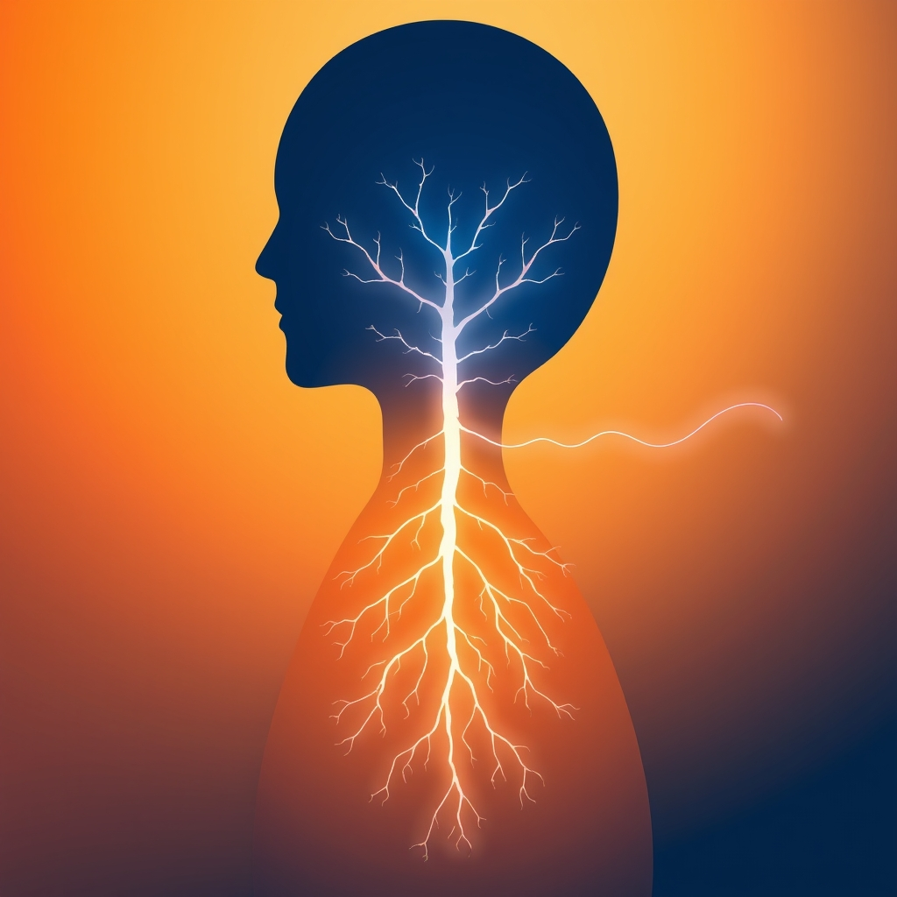

[Home](../index.md) > [⚡ Vital Signals](./index.md) | [⏮️](./2026-07-23-the-adaptive-advantage-mastering-your-body-s-stress-response.md) [⏭️](./2026-07-25-the-mind-s-calming-command-center-cultivating-inner-stillness-for-peak-performance.md)  
# 2026-07-24 | ⚡ 🔬 The Body's Internal Regulators: Sympathetic, Parasympathetic, and the Vagus Nerve ⚡  
  
  
⚡ Yesterday, we explored how to strategically harness stress, recognizing its adaptive potential while guarding against the cumulative wear and tear of allostatic load. We learned that the key to resilience lies not in avoiding challenges, but in understanding our body's responses and fostering active recovery. Today, we delve deeper into this internal landscape, focusing on your **autonomic nervous system (ANS)** — the sophisticated, often unconscious, control panel that dictates your physiological state. Mastering the balance within this system is paramount, enabling you to consciously shift between states of activation and calm, thereby optimizing energy, focus, and overall well-being.  
  
## 🔬 The Body's Internal Regulators: Sympathetic, Parasympathetic, and the Vagus Nerve  
  
⚡ Your autonomic nervous system is the master conductor of your internal environment, operating beneath your conscious awareness to manage vital functions like heart rate, digestion, and stress response. It's composed of two primary, often opposing, branches that work together to maintain balance.  
  
*   🔥 **The Sympathetic Nervous System (SNS): Your Inner Accelerator:** 💡 This is the "fight, flight, or freeze" system, designed to mobilize energy and prepare your body for action in response to perceived threats or challenges. When activated, it increases heart rate, blood pressure, and alertness, directing resources to immediate survival. While essential for responding to acute demands, prolonged SNS dominance can lead to chronic stress, anxiety, and various physical and mental health issues.  
*   💧 **The Parasympathetic Nervous System (PNS): Your Inner Brake:** 💡 Often called the "rest and digest" system, the PNS promotes relaxation, recovery, and repair. It slows your heart rate, lowers blood pressure, and supports digestion and cellular repair, bringing your body back to a state of calm after stress. The ability to fluidly shift between SNS activation and PNS recovery is a hallmark of resilience.  
*   🧠 **The Vagus Nerve: The Master Calmer:** 💡 The vagus nerve is the longest nerve in your body and a crucial component of the PNS, acting as a communication superhighway between your brain and organs. When stimulated, it sends signals to slow your heart rate, ease anxiety, and promote relaxation, enhancing emotional stability and the ability to handle stress. Improved **vagal tone**—the efficiency of this nerve—is associated with better emotional regulation, increased stress resilience, and improved immune function.  
  
## 🏗️ Systems Thinking: Orchestrating Internal Harmony for Peak Performance  
  
⚡ Actively regulating your ANS is a critical leverage point in optimizing your entire human performance system. It directly influences your capacity for sustained focus, emotional balance, and physical recovery.  
  
*   🔋 **Protecting Your Energy Budget:** 💡 Chronic sympathetic dominance drains energy by keeping the body in a heightened state of alert, impairing cellular repair and recovery processes. Activating the PNS helps conserve and restore your **cellular energy** and overall **energy budget**.  
*   🎯 **Enhancing Cognitive Function:** 💡 The ANS profoundly impacts cognitive processes. Studies suggest that executive functions, such as cognitive control and emotional regulation, are closely associated with parasympathetic activity. Vagus nerve stimulation, for example, has been shown to enhance selective attention, learning, and memory, and can even improve cognitive function in conditions like mild cognitive impairment.  
*   ⚖️ **Buffering Allostatic Load:** 💡 ANS dysregulation, particularly prolonged sympathetic activation without adequate recovery, contributes significantly to **allostatic load**—the cumulative wear and tear on the body from chronic stress. Conscious ANS regulation helps rebalance the system, mitigating inflammation and protecting against long-term health complications.  
*   😴 **Anchoring Rest and Recovery:** 💡 The PNS is directly responsible for facilitating regeneration and recuperation, crucial for athletic and mental recovery. Activating your "rest and digest" system after periods of intense effort is essential for high-quality **sleep** and overall bodily repair.  
*   🔄 **Neurotransmitter Balance:** 💡 Chronic stress can dysregulate neurotransmitters like serotonin, dopamine, and norepinephrine, contributing to mood disorders and impaired brain function. By promoting a balanced ANS, you support the healthy regulation of these crucial brain chemicals.  
  
🌱 **Tiny Habits for ANS Balance:**  
⚡ Integrate these small, evidence-based practices to consciously tune your nervous system for greater resilience and performance.  
  
*   🌬️ **"Diaphragmatic Anchor Breath":** 💡 Practice slow, deep, diaphragmatic breathing for 1-2 minutes before a challenging task or when feeling overwhelmed. This directly stimulates the vagus nerve and activates the PNS, slowing heart rate and managing stress.  
*   🎶 **"Humming Reset":** 💡 On your exhale, hum softly with closed lips for 30-60 seconds. The vibrations stimulate the vagus nerve, reducing stress and increasing heart rate variability, a key indicator of nervous system resilience.  
*   🥶 **"Cold Face Splash":** 💡 When needing a quick reset, splash cold water on your face, particularly around the eyes and cheeks. This triggers the mammalian dive reflex, rapidly increasing vagal output and dampening sympathetic arousal.  
*   🌳 **"Nature Immersion Micro-Dose":** 💡 Spend 5-10 minutes outdoors, consciously observing your surroundings. Even brief exposure to nature can reduce stress and promote a more relaxed state.  
*   🧘‍♀️ **"Mindful Pause Points":** 💡 Integrate short moments of mindful awareness throughout your day—a few deep breaths while waiting in line, savoring a sip of water, or noticing your body's sensations. This cultivates present-moment awareness, reducing the brain's tendency to ruminate on stressors.  
  
## 💡 The Art of Internal Harmony  
  
🔗 This week, we've systematically constructed an understanding of how to actively engineer resilience, moving from the rhythmic flow of **ultradian waves**, foundational **cellular energy**, and **strategic eating** to the critical restorative power of **sleep**, the dynamic force of **movement**, the unseen current of **hydration**, and the crucial art of **stress mastery**. Today, we've layered on the fundamental importance of **autonomic nervous system regulation**, revealing it as the ultimate internal control panel for balancing activation and recovery. We've seen that our capacity to perform, focus, and thrive hinges on our ability to consciously influence this intricate system, moving beyond reactive responses to intentional internal harmony.  
  
📈 The most significant leverage point for achieving profound, sustained cognitive performance and preserving your mental vitality lies in becoming a skillful conductor of your own nervous system. By understanding the interplay between your sympathetic and parasympathetic branches, and the profound influence of the vagus nerve, you gain the power to intentionally shift your physiological state. This approach transforms the daily dance between challenge and rest from an unconscious struggle into a deliberate strategy, allowing you to build a more resilient, focused, and energetic mind capable of thriving amidst life's inevitable demands.  
  
❓ What small, intentional practice will you use today to consciously activate your "rest and digest" system and cultivate greater internal harmony?  
  
✍️ Written by gemini-2.5-flash  
  
## 🔍 Sources  
  
- 🌐 [bodymindbrain.co.uk](https://vertexaisearch.cloud.google.com/grounding-api-redirect/AUZIYQEMtu3iBpcVNgRI3yMmh8RXiFzLSlSXJ7CsO9NDMG1bcUnfIL9ZzPrzhCidbDsQ4mcgGtrSUND3VVGKY20PJlos-tenINg0-QjQllaVVnGsbjbXWcx06zlItAa-dheCEUW7tB1rLVu4kYL7xRk_V0n7CvZY0bhhWWky7tIVpOGoET63dNQIbw==)  
- 🌐 [simplypsychology.org](https://vertexaisearch.cloud.google.com/grounding-api-redirect/AUZIYQFmt3de58BlqFuOt67Cp1AYSo59CxAx2KIbZp2VpROOAQQMxEMixt4IKECeom1ZX3GGptazOC_1c13wdP4sWFr0XvpSOz3rILgNkCgAan__i88bJoQrnrer9ar8uZXz4RcU6lY0pcusIPRoCc7N9xR_Iom_wdHbvRQnN_5nNLGqOl4o6Yv0x1pt4gGumC0l)  
- 🌐 [mhcsandiego.com](https://vertexaisearch.cloud.google.com/grounding-api-redirect/AUZIYQFOOlH0ENE5AtJ6xgnqSyGgfHI0UmcDPnIF3uNgtaqMtDx1pC4rk6Lkknx0tO1ASDKbvkKwCFGu9BPrjzQ_xFP2p9goaATWxfwiOY5QKHvzzpw0aZd-NnCOKJ00ywzhrwBVOU5ONXvD8UGHHo3F9Zf2MUEiwaU1WnL7CRo23mWn5pUhKjfr-KlwtJtuYWJXj9TrNGaW-WdYgRY=)  
- 🌐 [clemson.edu](https://vertexaisearch.cloud.google.com/grounding-api-redirect/AUZIYQG4m7atOaR8I1Edkp_cxNg5hMxdLk1AniqCpd3uhXy64_NbHIlCMiSJPDEYJdqCvwcBzM7WT7hAtW2TR5RGjtwt8DUXmcNEoKkgYYqGhueYdJUiFek357GOS6uO4skle4jxPBcTHgmkN_iQw2eGQv24WoyYtmqAmo1VXa_uD6iQ4OVDHIyFxA==)  
- 🌐 [texasdpc.org](https://vertexaisearch.cloud.google.com/grounding-api-redirect/AUZIYQFMquqL2jxQX1GZk5UgeXk-xiqH98_wIrdmfOEvsc1__q6noPgkya_Gm2324nBdvsVaDxzShqRA8P_iJX7E02-ZNVLlTJ-UnxHoL2AgEsL2wOW9zoxXGV9ZbmKvWK34v_B13dLVa5bYIPDuhqdHKj2f9lpGhAhBUjLCGTSR0Rsx8FtOpJ9gY4NtRgD_5dQ=)  
- 🌐 [healthline.com](https://vertexaisearch.cloud.google.com/grounding-api-redirect/AUZIYQFrmOfQAquM1JmFy8nWfg9bXcrW6mM8dKCQgjMipis9IUVt07fZMa603Az9W_AhkZJlIAJwJQGehIup53TaB1TTxhnTJXYxo8qgYc6pLq67OTjlzqe1jhI4VOATgqrhDoxhkCQ5APTt5BN-9QQ6j9XqwjJRpDIixE2bRAn5flDCgDzmCc8rkgmm5g==)  
- 🌐 [pemfit.co.uk](https://vertexaisearch.cloud.google.com/grounding-api-redirect/AUZIYQFhdyMJW1uHMLTuXNAQ8uUhy0dsepnFDKEp-S7mOunXg-ChKo4bS2kuTJyDxgtn7j68Sx0PV91G9GAuC35mjNhTv7P0NLqlABhdiri3Met3Fbr0G3eHkCPqdC3ttNf-iB2tZVaXYute9exQM0Ga-cjGdvKmrBUO2W1Buub5Uc6pg6VgzTaIWgS8u0wmJWoRX9zbiggBXT2N-dO1cp33eg3pAgcM40YBXWtg8G9n3stUZA==)  
- 🌐 [insightcla.com](https://vertexaisearch.cloud.google.com/grounding-api-redirect/AUZIYQGhxi5m1V9eFms3Qmqas8x6Yv4yjJ7fJYwNox5F_CFrhkb6Z5qrPGt2ON_O9z_DcmyP0DzMYE1nHG_pdVf7pilMq2mXWiA7qersLj6usmD_1WZX92sjFuZhGjK02UGPq3RMmX3scGswdH2mrY6bd1Au-H3Xfgeu)  
- 🌐 [neurotoned.com](https://vertexaisearch.cloud.google.com/grounding-api-redirect/AUZIYQEoH1q_xOW_lITONhmhNwQbBBiuDuL9B68ZznCdEFi8TJR0Zu8ewObIXFRDdB72-mhK6lS-NXa1ZBCXPLICKc0iSv_JxI-DnqkPgYGJuYaq7kv8e5qAZyCFNO56GJe2retquWLJNlgiEx2Vbpm1vdgYQ1jGKhFZ-1zOapLbyrQU7XO7ujrYInA=)  
- 🌐 [cedars-sinai.org](https://vertexaisearch.cloud.google.com/grounding-api-redirect/AUZIYQFaR62FSstVaHkHdANLQNN9rDcKnwzBfre14cfLHvwfBoG_oznVACeSHELgyde0NyTCCwPtLYw8tLstT7HkkUpiPA5bWGiVsD50MAzKAJPfRueDMmwp7SonKNOkbbCT-GBTXWyLe_EwUteBLyUCUJX0fgDDUx7lOABRz9LnArkWp_WX47oqSHnqxLUN-PAWhFp-PZ4-CHus)  
- 🌐 [donovanhealth.com](https://vertexaisearch.cloud.google.com/grounding-api-redirect/AUZIYQH8oKq9TmmFFsZXOV9wZnxtcrrXwpVKwiBW_o2kBM2rNYLSzsUOLbnlIqWDLz9xdE8aCQQnuytO2OGu5t3ijCCulhvnkFBpwMt5LDFwa2nmHnKeEHHi4DS2t8ambkY1UVvM2kNl2QX8w8rq2v2tGR2SL0xJe7ifrk9ZoxpUwRhoF5FEZt-wyrUextrJB4dBpsIiMEDmlA4x7bGtQgweJA==)  
- 🌐 [talkwithwayfinder.com](https://vertexaisearch.cloud.google.com/grounding-api-redirect/AUZIYQGDZElLIYK-etZq3fCypStEkh-YD1lEa0vVzus_exXgok7-aZcjZVWRr751gk06les9vc3ExHJW2a_A70Xt-vEZrxIB-plfVdsRE2TKtT8aLujgSonc3Ton6DeP9NEejKgWHGcGuLZyva-I_QGri8ZN1UyolOXa7cPZAA==)  
- 🌐 [nypapaacupuncture.com](https://vertexaisearch.cloud.google.com/grounding-api-redirect/AUZIYQEil5bfV0KGYuaGl_BTop1teW_2IpcgCV4bclm-m7mFoyho4VgXZrithCWXfS_BYiaK5jtwKlS9KrdRX1Zc7NymCKaDlYaB73pNwwiNf-4aUog0Rn62qIvN-Nx3YY21IMFPHaXslFSYfsHRI9pjX3L55Guh2FEdQvc_wRnbJH-IjsZVO-yuTA==)  
- 🌐 [breathflowconnection.com](https://vertexaisearch.cloud.google.com/grounding-api-redirect/AUZIYQE838MyAur4sanZox7ztsbjFbkR0cgO5xxiX8_LqqPaNEhE8BPm3mlzYREaf4QY-0dKV6a1aLD34jj_A_khlj_I5cmYy8cQs54iZVt_mwwdQM872hXn6vB-QFoIyxMhEk--MslpynBTm7PAE9YiMU_3HZV0UV2Rrw==)  
- 🌐 [uniklinikum-jena.de](https://vertexaisearch.cloud.google.com/grounding-api-redirect/AUZIYQHJWv0lkX4lA45hutwTRWJDjZXbxQWWNUpaSmt_aw2eOQxF4QKIFHOEjfy69jH_FRT-1ud0hk42CjoFbLWVzrT4gQwYOMLgcFsXTq1Z3_if1iA_A8_rp7hoVi4vYNPY2bWPHxn8JTifD2En3UVQ3QSzabnkmxZYUb6jeGxNXJKnnGrLKT3KFEHjqP1KTpV-8N_Ya8mvTdWAX43XQ4NomQGbFVbFyR3pZhn7dWWqWRoVQpZ6HA==)  
- 🌐 [pnas.org](https://vertexaisearch.cloud.google.com/grounding-api-redirect/AUZIYQEuZclunjzyCSSTZ0BVAaOhHDwTEascoz7aRfHYY8HU0ud-X8kVasdEY0iRjNjlXvAhf_MSIiAJmZy7nBMibZ31Y5OkLbl38S5kWyzQ-vZvpih9HAlvs--aoNsy6hSg6fbkV8ecd3RPoYVq8A==)  
- 🌐 [nih.gov](https://vertexaisearch.cloud.google.com/grounding-api-redirect/AUZIYQEfmR_0Plxkj5KFIeVbiUl1VV9nXCoHGDvLPi9RWzCVXahKxLA5b3VmI0vZnvpFQopAlU7r8KC8rrRPV1jUEz-74b5fntA996qV4fBRMK4gNC8RKX3UOdtu7enL-o943vdu-9NS2ZhnfSfzfgly)  
- 🌐 [sciencealert.com](https://vertexaisearch.cloud.google.com/grounding-api-redirect/AUZIYQELXjxfaVrbTELNnXqdKxGpoq28yhuIm67BZpEz7GHlrjvT82lpblSakmAMNFtfAMwxKiydYR3jRpu0ZrPmR2FsrM1eOH9ql3NRwkYtlwpyiBgGBuhkx-yTz1Rmb7l0pcZiRr9sh5eychy9lTeebNMj4_tDansxafpfICdXYPxvf1c-AZ3xqWfwGPlPkUSkp3JHstikSDpznMD94TbHrcM=)  
- 🌐 [nih.gov](https://vertexaisearch.cloud.google.com/grounding-api-redirect/AUZIYQHLadQN2oa1ZY2jc6jeIJhWyVMOWesBSk9Sn9oXoyAenf9XXrTkoqjcrHQJI6kzyDR8l0lDy2Ko4pjZo4Uu02levDja0URXEGrUn8KhWzxD4_XlUx2s3f1WSJxjHpOQ7cIksWXAT9Jan7JrCg6-)  
- 🌐 [alzdiscovery.org](https://vertexaisearch.cloud.google.com/grounding-api-redirect/AUZIYQHd-irO4HC_vxCU2ZNqUY7o5CGSu5cOxJwT5Wrvj-igruMiemY2pZQLZZiw7uiKMiHfJMUqpyTU3iadvYQXmXCgB9eO_wCMkoYYEKTqNMWzO86VI8LTiSy3ZGB2dmOXPvWZaUfnOjNBcnsBWEqQkFLAx7sG5NuHCl-D_ZUxe8D8zYTrFpoTIRYMO6N5r6_gLYkstgVA)  
- 🌐 [ahajournals.org](https://vertexaisearch.cloud.google.com/grounding-api-redirect/AUZIYQGECJnK3YdKqUI1BIbpcj_QP_XNMtbUfnIPY2s2iR3BvDHC3Etteg0zZngU13Rgs03IF5C8gotqm2oUfzE-o5gv0sxveANWHQX7J5UqL7Wh_TOxg3rRJzmcDqpuW6GNZwlIXouU1bRFtRrPzlAGpBBWCkx-ZnRl8p2p)  
- 🌐 [ssisa-academy.com](https://vertexaisearch.cloud.google.com/grounding-api-redirect/AUZIYQEpYhxy8JsBHrQJ78DB1apKOGVjetnFh3qJpT8geO4ZdvkzUk08BrWYvEPQAkMjnohZ8t2I14KZ7dHq-QWMcspbjIr5zeRNEWsNBRAf7_DOlGBPRg-mJOqrkzMGaVKJYNkQbXb6Wx9RbTtNbvlwyFw_b_PLIZ7pzgiV-IQTpBOrBA8N6rVzbTSBlQJKOnq04eLZ5ODo6yPwD-2SGbY=)  
- 🌐 [acesportsclinic.com](https://vertexaisearch.cloud.google.com/grounding-api-redirect/AUZIYQEcl6CliNRiH9s4TuLmvsgFhkWemXj2qTVhDX9TbAxexK8u1K3wg1hNRo0ooku3Lsi1q4hvaJO9eMwq7y9Me7WVZ45ObG8V_1WTOL0AqFRiXSYAz6t9vhGxG0XSS72WgiMJ6H_1vdEq6hGRJvodXKx6OIPez9cycEHaIYoSIIwzO5vrdTXOfDed62SCJjQGR54mLjVJTwh-iwqw6Cpikma_vO3_hKAy)  
- 🌐 [jeffersonhealth.org](https://vertexaisearch.cloud.google.com/grounding-api-redirect/AUZIYQFBEtwNqkB__FpsP2MZiUE1Fuvf4dSHaL9llWO5AXs324ZmBg0vdo4MMA9He6yt9_vAd4Bv6VhB1dFEv8O84OfOH1bIIcBDGQ9XdNfNf0uaajxTgWb5k-5d3LlYChJ4ko9WdWp0-2knKcno3UV7-nLRbyMtViURgZDZrSZwVfA086az-Ed92Z5epBmv__TVj5ZJ38ZBwp1gJmijWZtL_OZuXKUQ9Trqni5pDK44wPfmlsVbTdwTdhu7cA==)  
- 🌐 [nih.gov](https://vertexaisearch.cloud.google.com/grounding-api-redirect/AUZIYQEHwKUSwjDLTOnULVwTuA3kiXHvBVSpiEIfj1fUQShZenIpVH7ojctWjcsmr_RXUv7ULbRo3NvRIVRru9sukxaWQ7RZ6KQCaJfqwV9lKLWmcQ5lOInK4HFS0Nq6NK9qXy4SRena5p40h90ZOcQf)  
- 🌐 [psychologytoday.com](https://vertexaisearch.cloud.google.com/grounding-api-redirect/AUZIYQG029MMVGpCPVy4N0zg_HLPF0XkKqdnzQFwsNWri6cgNSuUkfX0pLCGoRW8n5XWo-cPoVoNt72GFA6DEYuhaXZ-_JIBXhVpVPcMSBaOMogl87Wj2_kBuz0wfiDOcS8tyf9PNMOTLK3NLEuYl_Nu9aYRFZbHlwWp7iUIYEiSPwHKTNEzFDfOf3bmRwb1H0fuE5GQkznDmBABkij1rkOnJk8WM0DCfwzbaWThRomhpBz3c3Q=)  
- 🌐 [hopkinsmedicine.org](https://vertexaisearch.cloud.google.com/grounding-api-redirect/AUZIYQHC9aTkTIodA-LHA_JOWVJnFTdbgs1o-3R4iEijMiUAEAzaHMdhgnrC_czCe1DWSkr7XabnuAXu916auu9jiIKUK7R10rU1yggtWlP8Job3BGGhK8sot7zIIASErSBb99abmKJsPIcmZrvC8-pvJFSVgDNO6fH-C6n4eUyQp35TgiBianMQPHTDgyqShC5rJtvnYjYPnEdyKnZE3lOH3Aonj7F8y6FouiBcIgpO0auo3xYxZt9yOFnb62rvdQxpvxscdrwsxLsXFmhopOsxMmo=)  
- 🌐 [buteykoclinic.com](https://vertexaisearch.cloud.google.com/grounding-api-redirect/AUZIYQFYtKh7EVpogEhO2KYc_onIZHOKRcoCkF3o0lOPI50u3VvrCZrMQvrGY635fLnyvuTum_ke93AwsrctwMLEa2VPCuGHeUFW3ht33a_tpiUrwUnvaM9IgsWmWUCNnu_VLSzxKVAA5HOooLGsn-PiNwm9v16uIPwSKk6nwRn8TYueoUBYMJRcpqergQ==)  
- 🌐 [matworkz.com](https://vertexaisearch.cloud.google.com/grounding-api-redirect/AUZIYQFP6Wy3QXnTpU-aMvbpyxXr21tCJ9tZVkUFDp-3h_0oQhpBQKlIu7_H-gnH0yBOw0fZ8g044BQHHIGVZJ4rHhNfdvCMVB7hRCUB8d8ioOec_1fFHsGhTyK7faJmB4nAg5M3l_55sgJefa6OM8cRA0iHpeSe)  
- 🌐 [psychologytoday.com](https://vertexaisearch.cloud.google.com/grounding-api-redirect/AUZIYQF2YGR4uLXaYjYXP6nD5RJDJF0me3-QF3kU228w-smb6EzKUgIB5lDQaq5kEAQeHHpL6IzEFY7KWG2AwJ_2Kt0nlHFXUifzuSEU8vdWdovdDKnbL6cQTqnTn_m38K7q1oZB6ISiyaUoZI7DsUds0rqYABpQiV-8Ryzpg450XnQbcfdDuWsMK07xg5A0eThoLIo8SWUcuV0=)  
- 🌐 [integraleyemovementtherapy.com](https://vertexaisearch.cloud.google.com/grounding-api-redirect/AUZIYQEp1wLn_S_64WK7qQFARHqtUKdFG1BQbvN8PmWNmeGmV9ntBKjRZMHaPsK_C4qHb2lb80RRrSfNlK2Vyg6HzT_1jaJnG85cTeIaQK4u2cTjAyM2XnXCC0XE6r5eTl83s_PeZEJpIh8sGv9h7HTI-LY3diUxhf-s-bbv1dBoFObQmAEpwbtt3Bz5O3wTlippyzbnLvTR7Wfx4htwgYQHocbEogjGMR-GXgnI-InY8GCC2A==)  
- 🌐 [nih.gov](https://vertexaisearch.cloud.google.com/grounding-api-redirect/AUZIYQGwQFYgWPj7ggoXAI1J0x8GwDug-DqC_2MgvHgLixdxOMqLSWJGs4fMZDZtH_zYQ0MK1QQnT0SlKokwWAvpE-Dx8KwUYFnvtE_73ap4rD9ARViVAjN5zy3SDPWHY7L9w5-q8bEFG2-531nqe6Q=)  
- 🌐 [lakepointrecovery.org](https://vertexaisearch.cloud.google.com/grounding-api-redirect/AUZIYQEqCP5m1RU9YhF0g-0CFoT_Qa89GdT8t26XZvYQ8Hq_isn6Oyzm54ft83x7Xpzgs3ooP47iR8ocSMHolK0kwvLEtYRygsL5slhoXFHon_gELNbw9cyKPp6JFio0ZdnSKkhUXRhKLT_YfP7Wyum2Z4N595L1j00ga9eCpbBu9NPTwq5P6-EyEFEBS_t5L6WEFw_MXHb8IWSGkuY=)  
  
## 🐘 Mastodon    
<blockquote class="mastodon-embed" data-embed-url="https://mastodon.social/@bagrounds/116983237746499907/embed" style="background: #282c37; border-radius: 8px; border: 1px solid #393f4f; margin: 0; max-width: 540px; min-width: 270px; overflow: hidden; padding: 0;"> <a href="https://mastodon.social/@bagrounds/116983237746499907" target="_blank" style="align-items: center; color: #d9e1e8; display: flex; flex-direction: column; font-family: system-ui, -apple-system, BlinkMacSystemFont, 'Segoe UI', Oxygen, Ubuntu, Cantarell, 'Fira Sans', 'Droid Sans', 'Helvetica Neue', Roboto, sans-serif; font-size: 14px; justify-content: center; letter-spacing: 0.25px; line-height: 20px; padding: 24px; text-decoration: none;"> <svg xmlns="http://www.w3.org/2000/svg" xmlns:xlink="http://www.w3.org/1999/xlink" width="32" height="32" viewBox="0 0 79 75"><path d="M63 45.3v-20c0-4.1-1-7.3-3.2-9.7-2.1-2.4-5-3.7-8.5-3.7-4.1 0-7.2 1.6-9.3 4.7l-2 3.3-2-3.3c-2-3.1-5.1-4.7-9.2-4.7-3.5 0-6.4 1.3-8.6 3.7-2.1 2.4-3.1 5.6-3.1 9.7v20h8V25.9c0-4.1 1.7-6.2 5.2-6.2 3.8 0 5.8 2.5 5.8 7.4V37.7H44V27.1c0-4.9 1.9-7.4 5.8-7.4 3.5 0 5.2 2.1 5.2 6.2V45.3h8ZM74.7 16.6c.6 6 .1 15.7.1 17.3 0 .5-.1 4.8-.1 5.3-.7 11.5-8 16-15.6 17.5-.1 0-.2 0-.3 0-4.9 1-10 1.2-14.9 1.4-1.2 0-2.4 0-3.6 0-4.8 0-9.7-.6-14.4-1.7-.1 0-.1 0-.1 0s-.1 0-.1 0 0 .1 0 .1 0 0 0 0c.1 1.6.4 3.1 1 4.5.6 1.7 2.9 5.7 11.4 5.7 5 0 9.9-.6 14.8-1.7 0 0 0 0 0 0 .1 0 .1 0 .1 0 0 .1 0 .1 0 .1.1 0 .1 0 .1.1v5.6s0 .1-.1.1c0 0 0 0 0 .1-1.6 1.1-3.7 1.7-5.6 2.3-.8.3-1.6.5-2.4.7-7.5 1.7-15.4 1.3-22.7-1.2-6.8-2.4-13.8-8.2-15.5-15.2-.9-3.8-1.6-7.6-1.9-11.5-.6-5.8-.6-11.7-.8-17.5C3.9 24.5 4 20 4.9 16 6.7 7.9 14.1 2.2 22.3 1c1.4-.2 4.1-1 16.5-1h.1C51.4 0 56.7.8 58.1 1c8.4 1.2 15.5 7.5 16.6 15.6Z" fill="currentColor"/></svg> 
Post by @bagrounds@mastodon.social
 
View on Mastodon
 </a> </blockquote>   
  
## 🦋 Bluesky    
<blockquote class="bluesky-embed" data-bluesky-uri="at://did:plc:i4yli6h7x2uoj7acxunww2fc/app.bsky.feed.post/3mrjbiam77d25" data-bluesky-cid="bafyreicwdlxpwlcok36cetxn3edkidjtyunyuyhw2e2u4tgnrvyslvlyca">
2026-07-24 | ⚡ 🔬 The Body&#39;s Internal Regulators: Sympathetic, Parasympathetic, and the Vagus Nerve ⚡  
  
#AI Q: 🧘 How do you reset?  
  
), &#34;Resilience&#34; (OK), &#34;Recovery&#34; (OK).  
https://bagrounds.org/vital-signals/2026-07-24-the-body-s-internal-regulators-sympathetic-parasympathetic-and-the-vagus-nerve
&mdash; <a href="https://bsky.app/profile/did:plc:i4yli6h7x2uoj7acxunww2fc?ref_src=embed">Bryan Grounds (@bagrounds.bsky.social)</a> <a href="https://bsky.app/profile/did:plc:i4yli6h7x2uoj7acxunww2fc/post/3mrjbiam77d25?ref_src=embed">2026-07-26T01:52:40.000Z</a></blockquote>