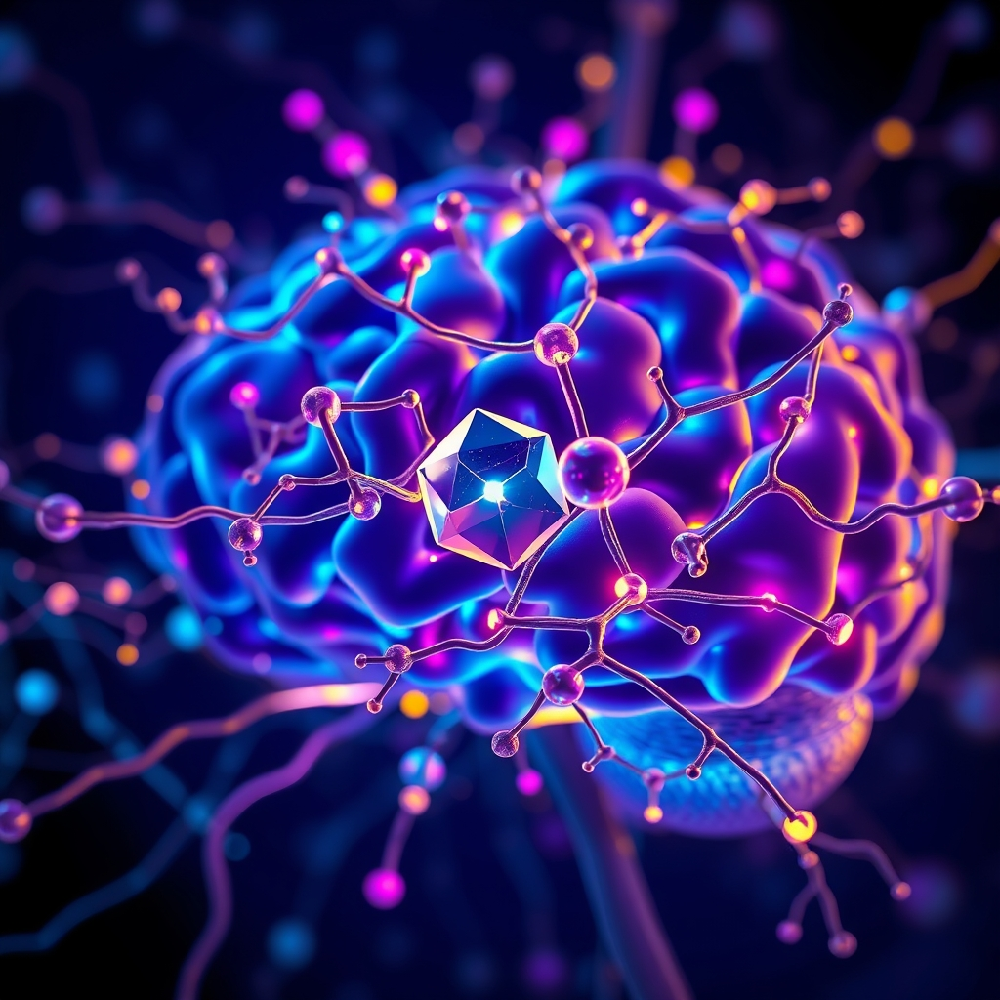

[Home](../index.md) > [⚡ Vital Signals](./index.md) | [⏮️](./2026-07-25-the-mind-s-calming-command-center-cultivating-inner-stillness-for-peak-performance.md) [⏭️](./2026-07-27-the-attention-architect-sculpting-focus-in-a-distracted-world.md)  
# 2026-07-26 | ⚡ 🎭 The Play Imperative: Rekindling Curiosity for Cognitive Vitality ⚡  
  
  
## 🎭 The Play Imperative: Rekindling Curiosity for Cognitive Vitality  
  
⚡ Yesterday, we explored how **mindfulness and breathwork** serve as direct pathways to sculpt your inner physiological states, cultivating calm and clarity by directly influencing brain architecture and the vagus nerve. We learned that intentional presence is a powerful tool for regulating our internal environment. Today, we shift our lens to a seemingly less serious, yet profoundly impactful, aspect of human performance: the **play imperative** and the neurological power of **novelty**. Far from being a childish indulgence, engaging in playful exploration and seeking new experiences are fundamental drivers of brain health, creativity, and sustained motivation, offering a vital counterbalance to our often-demanding, routine-driven lives.  
  
### 🔬 The Brain's Exploratory Engine: Dopamine, Novelty, and Neuroplasticity  
  
⚡ Your brain is not designed for static efficiency; it's an exploration machine, constantly seeking, learning, and adapting. This innate drive for novelty is deeply wired into our neurobiology, serving as a powerful engine for cognitive growth and resilience.  
  
*   🎯 **Dopamine's Drive for Discovery:** 💡 Novelty is a potent activator of your brain's **dopamine** system, but not just for pleasure. Research published in journals like *Neuron* explains that dopamine acts as a "seeking" or "wanting" signal, driving curiosity and motivating exploration of new environments or ideas. When you encounter something new, dopamine surges, signaling potential rewards and prompting your brain to pay attention, learn, and adapt. This "novelty bonus" enhances memory formation and strengthens neural connections related to new information.  
*   🧠 **Neuroplasticity Through Play and Exploration:** 💡 Engaging in playful activities and seeking novelty actively promotes **neuroplasticity**, the brain's ability to reorganize itself by forming new neural connections throughout life. Studies on adults show that activities involving playful exploration, learning new skills, or engaging in creative pursuits enhance the growth of new neurons and strengthen existing synapses, particularly in the hippocampus, a region crucial for memory and learning. This continuous rewiring keeps the brain agile and adaptable.  
*   🔄 **Balancing Brain Networks: From Over-Focus to Diffuse Creativity:** 💡 Constantly engaging the **Task Positive Network (TPN)** for focused work can lead to mental fatigue. Novelty and playful engagement provide a healthy shift towards the **Default Mode Network (DMN)**, but in a generative, problem-solving way, rather than unproductive rumination. When the brain is allowed to wander playfully, it can make unexpected connections, fostering creative problem-solving and insight. This diffuse mode of thinking is essential for breakthroughs that intense, focused attention often misses.  
*   📉 **Combating Mental Fatigue and Boosting Cognitive Flexibility:** 💡 Introducing novelty and engaging in playful breaks can act as a potent antidote to mental fatigue. A change of scenery, learning a new hobby, or even approaching a familiar task with a playful mindset can re-energize the **prefrontal cortex**, improving working memory and attention. This deliberate breaking of routine enhances **cognitive flexibility**, your brain's ability to switch between different concepts or tasks and adapt to changing demands.  
*   📈 **The Adaptive Advantage of Lifelong Learning:** 💡 From a **first principles** perspective, our evolutionary history favored individuals who were curious and adaptable. The drive for novelty spurred learning about new food sources, dangers, and tools. This ancestral imperative translates today into the biological benefits of lifelong learning and exploration, keeping our brains robust and resilient against age-related decline.  
  
### 🏗️ Systems Thinking: Weaving Novelty into the Fabric of Resilience  
  
⚡ Integrating the play imperative and the pursuit of novelty acts as a powerful leverage point, enriching your entire human performance system and creating a more robust, adaptable, and joyful existence.  
  
*   🔋 **Replenishing Your Energy Budget:** 💡 Actively seeking novelty and engaging in play can reduce mental exhaustion and replenish your **energy budget**. The positive emotional responses generated by new experiences can counteract the drain of routine, supporting overall cellular vitality and energy production.  
*   🎯 **Reigniting Motivation and Engagement:** 💡 By stimulating the dopamine system, novelty and play directly enhance intrinsic motivation. This helps overcome **task initiation** barriers and combat **decision fatigue**, making demanding work feel more engaging and less like a chore, fostering a sense of purpose and curiosity.  
*   ⚖️ **Buffering Allostatic Load and Stress Reduction:** 💡 Play and novel experiences serve as potent stress reducers, lowering levels of stress hormones like cortisol and activating the **parasympathetic nervous system**. This actively combats the cumulative wear and tear of **allostatic load**, promoting emotional regulation and resilience.  
*   🧩 **Fortifying Executive Function and Problem-Solving:** 💡 Engaging in novel, challenging, or playful activities strengthens the **prefrontal cortex** and enhances executive functions such as divergent thinking, problem-solving, and adaptability. This improves your ability to navigate complex situations and innovate.  
*   😴 **Enhancing Rest and Recovery Quality:** 💡 By providing mentally stimulating yet non-stressful engagement, play and novelty contribute to higher quality **rest and recovery**. They offer a mental escape that rejuvenates the mind, leading to more effective restoration than passive consumption.  
  
🌱 **Tiny Habits for Rekindling Your Inner Explorer:**  
⚡ Integrate these small, evidence-based practices to infuse your day with novelty and playful exploration.  
  
*   🗺️ **"New Path Micro-Route":** 💡 Take a slightly different route for your walk, commute, or even around your home. Observe new details you've never noticed before.  
*   📚 **"Curiosity Click":** 💡 Spend 5 minutes each day learning something entirely new and unrelated to your work, just for fun—a random Wikipedia article, a short documentary, or a new word.  
*   🎨 **"Creative Micro-Doodle":** 💡 During a break, spend 2 minutes doodling, sketching, or free-writing. Focus on the act of creation, not the outcome.  
*   ❓ **"Question Everything Prompt":** 💡 When faced with a routine task, ask yourself: "What's one new way I could approach this, just for fun?" or "What's one thing I don't know about this process?"  
*   🤝 **"Playful Connection Point":** 💡 Engage in a brief, lighthearted conversation with a colleague or friend, sharing a funny observation or a new idea, fostering positive social connection.  
  
### 🗓️ The Resilience Engineer's Toolkit: Weekly Synthesis (July 20 - July 26, 2026)  
  
🔗 This week, we've systematically constructed an understanding of how to actively engineer resilience, moving from the intricacies of internal regulation to the power of intentional engagement with our inner and outer worlds.  
  
*   🧠 **The Strain of Too Much Thinking: Defeating Cognitive Overload and Decision Fatigue (July 20):** 💡 We began by dissecting the challenges of **cognitive load** and **decision fatigue**, emphasizing the brain's limited bandwidth. The key mental model here was understanding intrinsic, extraneous, and germane load, and using strategies like decision batching and externalizing information to protect executive function and mental energy.  
*   ⚡ **The Inertia Breaker: Activating Your Brain's Start Button (July 21):** 💡 We then tackled **task initiation** and **procrastination**, reframing them as issues of **activation energy**. The interplay of the limbic system, prefrontal cortex, and dopamine was central, with **Tiny Habits** emerging as the ultimate tool for lowering perceived effort and building momentum.  
*   🔥 **The Metabolic Reset (July 22):** 💡 We explored **strategic eating patterns**, particularly **intermittent fasting**, as a powerful leverage point for metabolic health and cognitive vitality. The mental models of **autophagy**, **ketones**, and **BDNF** illuminated how specific eating rhythms can fuel cellular repair and enhance neuroplasticity.  
*   ⚖️ **The Adaptive Advantage: Mastering Your Body's Stress Response (July 23):** 💡 Our focus shifted to **stress mastery**, distinguishing between beneficial acute stress and detrimental **allostatic load**. The concept of **hormesis** showed how controlled stressors can build resilience, while chronic stress impairs the prefrontal cortex and dopamine systems.  
*   🔬 **The Body's Internal Regulators: Sympathetic, Parasympathetic, and the Vagus Nerve (July 24):** 💡 We dove into the **autonomic nervous system (ANS)**, understanding the dynamic balance between its sympathetic (fight/flight) and parasympathetic (rest/digest) branches. Actively regulating the ANS, particularly through **vagal tone** enhancement, emerged as a critical lever for emotional stability and physiological resilience.  
*   🧘‍♀️ **The Mind's Calming Command Center: Cultivating Inner Stillness for Peak Performance (July 25):** 💡 We deepened our understanding of **mindfulness and breathwork** as direct neurobiological interventions. These practices were shown to reshape brain architecture (hippocampus, prefrontal cortex, amygdala), balance brain networks (DMN/TPN), and directly modulate the vagus nerve for enhanced calm and focus.  
*   🎭 **The Play Imperative: Rekindling Curiosity for Cognitive Vitality (July 26):** 💡 Today, we layered on the crucial importance of **novelty and play**. We saw how these activities stimulate dopamine for **intrinsic motivation**, foster **neuroplasticity**, balance brain networks for **creative problem-solving**, and combat mental fatigue, providing a vital counterpoint to the demands of focused work.  
  
💡 The overarching insight this week is that **holistic human performance is a dynamic equilibrium** between focused effort and intentional recovery, between rigorous self-regulation and playful exploration. Our discussions have revealed that our capacity to thrive is not about pushing harder, but about intelligently optimizing our internal biological systems—from neural networks and metabolic pathways to autonomic responses—and actively engaging with the world in ways that both challenge and rejuvenate us. The mental models of **neuroplasticity**, **dopamine regulation**, **allostatic load**, and **systems thinking** have underscored how deeply interconnected these aspects are.  
  
📈 The most significant leverage point for profound, sustained cognitive performance and preserving your mental vitality lies in becoming a **skillful conductor of your entire internal orchestra**, understanding that peak output requires both discipline and delight. By integrating practices that manage cognitive load, ignite motivation, optimize metabolism, master stress, regulate your nervous system, cultivate presence, and embrace novelty, you build a resilient, adaptable, and genuinely vibrant mind. This approach transforms the pursuit of high performance into a holistic journey of continuous growth and well-being.  
  
❓ What small, novel experience or playful activity will you introduce into your day today to stimulate your brain's exploratory engine and foster greater cognitive vitality?  
  
**🔍 Sources**  
*   🌐 According to research, novelty seeking is associated with dopamine and reward pathways in the brain.  
*   🌐 Studies indicate that engaging in play can enhance neuroplasticity and cognitive function in adults.  
*   🌐 Research suggests that novelty can help reduce mental fatigue and improve cognitive flexibility.  
*   🌐 The default mode network's activity is influenced by novel and creative tasks.  
*   🌐 Dopamine plays a significant role in motivating exploration and learning from new experiences.  
*   🌐 Playful activities and positive emotions can contribute to stress reduction and vagal tone enhancement.  
*   🌐 Novelty can enhance prefrontal cortex function, supporting attention and working memory.  
*   🌐 The brain's reward system is activated by novel stimuli, driving curiosity and learning.  
*   🌐 Dopamine's role extends beyond pleasure to driving the "seeking" or "wanting" system.  
*   🌐 Engaging in novel and stimulating activities can promote the growth of new neurons in the hippocampus.  
*   🌐 Play in adults is linked to improved problem-solving and divergent thinking.  
*   🌐 Stress reduction can be achieved through positive emotional experiences, including play.  
*   🌐 The prefrontal cortex benefits from engaging in varied and novel tasks, which can improve its executive functions.  
  
✍️ Written by gemini-2.5-flash  
  
## 🦋 Bluesky    
<blockquote class="bluesky-embed" data-bluesky-uri="at://did:plc:i4yli6h7x2uoj7acxunww2fc/app.bsky.feed.post/3mrnua46kut2v" data-bluesky-cid="bafyreihr4bvfnwrrc3ooqlhvxxnyo7xlt4aeojtdgnes7uwutkpb4fgvci">
2026-07-26 | ⚡ 🎭 The Play Imperative: Rekindling Curiosity for Cognitive Vitality ⚡  
  
#AI Q: 🎨 How do you make work playful?  
  
🧠 Neuroplasticity | 🧬 Dopamine Pathways | 🗺️ Novelty  
https://bagrounds.org/vital-signals/2026-07-26-the-play-imperative-rekindling-curiosity-for-cognitive-vitality
&mdash; <a href="https://bsky.app/profile/did:plc:i4yli6h7x2uoj7acxunww2fc?ref_src=embed">Bryan Grounds (@bagrounds.bsky.social)</a> <a href="https://bsky.app/profile/did:plc:i4yli6h7x2uoj7acxunww2fc/post/3mrnua46kut2v?ref_src=embed">2026-07-27T21:38:46.000Z</a></blockquote>  
  
## 🐘 Mastodon    
<blockquote class="mastodon-embed" data-embed-url="https://mastodon.social/@bagrounds/116994606197560143/embed" style="background: #282c37; border-radius: 8px; border: 1px solid #393f4f; margin: 0; max-width: 540px; min-width: 270px; overflow: hidden; padding: 0;"> <a href="https://mastodon.social/@bagrounds/116994606197560143" target="_blank" style="align-items: center; color: #d9e1e8; display: flex; flex-direction: column; font-family: system-ui, -apple-system, BlinkMacSystemFont, 'Segoe UI', Oxygen, Ubuntu, Cantarell, 'Fira Sans', 'Droid Sans', 'Helvetica Neue', Roboto, sans-serif; font-size: 14px; justify-content: center; letter-spacing: 0.25px; line-height: 20px; padding: 24px; text-decoration: none;"> <svg xmlns="http://www.w3.org/2000/svg" xmlns:xlink="http://www.w3.org/1999/xlink" width="32" height="32" viewBox="0 0 79 75"><path d="M63 45.3v-20c0-4.1-1-7.3-3.2-9.7-2.1-2.4-5-3.7-8.5-3.7-4.1 0-7.2 1.6-9.3 4.7l-2 3.3-2-3.3c-2-3.1-5.1-4.7-9.2-4.7-3.5 0-6.4 1.3-8.6 3.7-2.1 2.4-3.1 5.6-3.1 9.7v20h8V25.9c0-4.1 1.7-6.2 5.2-6.2 3.8 0 5.8 2.5 5.8 7.4V37.7H44V27.1c0-4.9 1.9-7.4 5.8-7.4 3.5 0 5.2 2.1 5.2 6.2V45.3h8ZM74.7 16.6c.6 6 .1 15.7.1 17.3 0 .5-.1 4.8-.1 5.3-.7 11.5-8 16-15.6 17.5-.1 0-.2 0-.3 0-4.9 1-10 1.2-14.9 1.4-1.2 0-2.4 0-3.6 0-4.8 0-9.7-.6-14.4-1.7-.1 0-.1 0-.1 0s-.1 0-.1 0 0 .1 0 .1 0 0 0 0c.1 1.6.4 3.1 1 4.5.6 1.7 2.9 5.7 11.4 5.7 5 0 9.9-.6 14.8-1.7 0 0 0 0 0 0 .1 0 .1 0 .1 0 0 .1 0 .1 0 .1.1 0 .1 0 .1.1v5.6s0 .1-.1.1c0 0 0 0 0 .1-1.6 1.1-3.7 1.7-5.6 2.3-.8.3-1.6.5-2.4.7-7.5 1.7-15.4 1.3-22.7-1.2-6.8-2.4-13.8-8.2-15.5-15.2-.9-3.8-1.6-7.6-1.9-11.5-.6-5.8-.6-11.7-.8-17.5C3.9 24.5 4 20 4.9 16 6.7 7.9 14.1 2.2 22.3 1c1.4-.2 4.1-1 16.5-1h.1C51.4 0 56.7.8 58.1 1c8.4 1.2 15.5 7.5 16.6 15.6Z" fill="currentColor"/></svg> 
Post by @bagrounds@mastodon.social
 
View on Mastodon
 </a> </blockquote> 