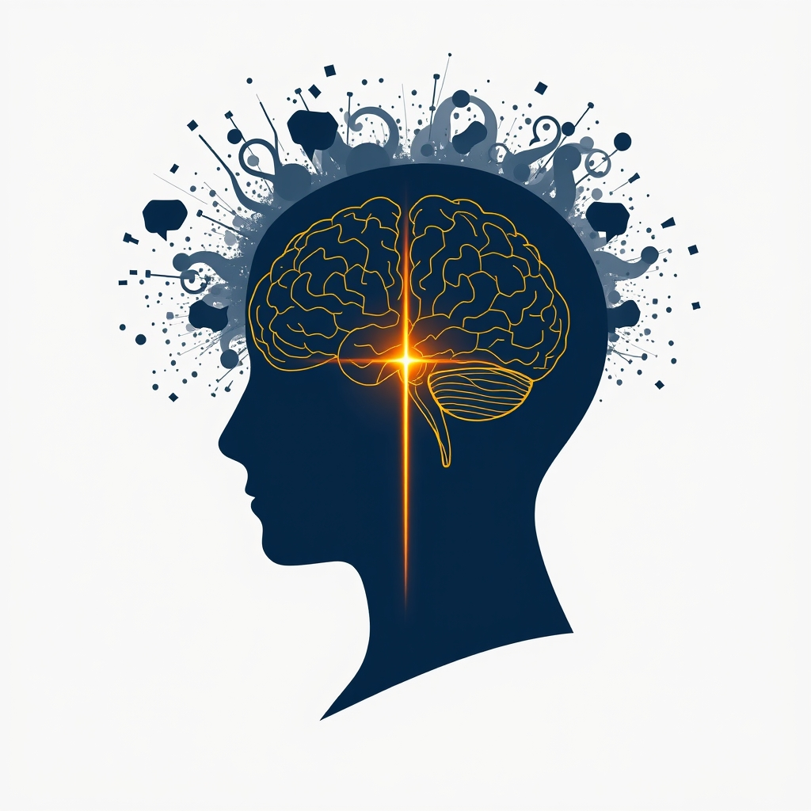

[Home](../index.md) > [⚡ Vital Signals](./index.md) | [⏮️](./2026-07-26-the-play-imperative-rekindling-curiosity-for-cognitive-vitality.md) [⏭️](./2026-07-28-the-art-of-cognitive-endurance-powering-through-with-purposeful-pauses.md)  
# 2026-07-27 | ⚡ 🎯 The Attention Architect: Sculpting Focus in a Distracted World ⚡  
  
  
# 🎯 The Attention Architect: Sculpting Focus in a Distracted World  
  
⚡ Yesterday, we celebrated the profound power of **play and novelty** in rekindling our curiosity and fostering cognitive vitality, revealing how these experiences fuel our brain's exploratory engine. We learned that integrating lighthearted exploration is crucial for balancing brain networks and combating mental fatigue. Today, we delve into the intricate art of **focus and sustained attention**—the ability to direct our inner spotlight amidst a relentless barrage of distractions. In our hyper-connected world, cultivating unwavering focus is not a given; it's a critical skill that demands intentional practice and a deep understanding of our brain's attentional architecture.  
  
### 🔬 The Brain's Executive Conductor: Prefrontal Cortex, Dopamine, and Attentional Networks  
  
⚡ Your capacity to focus is orchestrated by a complex interplay of brain regions and neurotransmitters, constantly filtering, prioritizing, and sustaining your conscious experience. It's a dynamic system that can be strengthened or weakened by our daily habits.  
  
*   🧠 **The Prefrontal Cortex: Command Center for Attention:** 💡 The **prefrontal cortex (PFC)**, located behind your forehead, is the brain's primary executive control center, playing a pivotal role in attention, decision-making, and self-control. It helps you stay focused and ignore distractions, managing your actions instead of acting on impulse. Research highlights the PFC's critical role in "top-down" attentional control—where your goals and intentions direct your focus—and its ability to filter irrelevant information. The PFC is highly metabolically expensive, consuming more glucose and oxygen than almost any other brain region, and can fatigue with prolonged effort.  
*   🔄 **Attentional Networks: Top-Down vs. Bottom-Up:** 💡 Our attention is regulated by at least two dominant neural networks. The **dorsal attention system** supports goal-driven, "top-down" control, allowing you to sustain focus on a task, like reading a book in a busy café. In contrast, the **ventral attention system** responds to salient, "bottom-up" stimuli, such as a sudden loud noise, automatically redirecting your attention. Effective focus involves a delicate balance and coordination between these systems, enabling us to intentionally direct attention while also being responsive to important novelties.  
*   🎯 **Dopamine: The Amplifier of Attention:** 💡 **Dopamine**, often mislabeled simply as the "pleasure chemical," is actually a key neurotransmitter for motivation, mood, memory, and critically, **attention**. It plays a crucial role in the brain's reward system, driving our ability to stay engaged and anticipate rewards. Research indicates that dopamine strengthens sustained attention by reinforcing focus loops. Lower dopamine activity in the prefrontal cortex and striatum, for example, is linked to difficulties in focus, goal-setting, and effort regulation, particularly for tasks that aren't immediately stimulating.  
*   🌌 **The Default Mode Network and Focused Attention:** 💡 The **Default Mode Network (DMN)** is a collection of brain regions that become active when your mind is at rest, engaged in introspection, daydreaming, or mind-wandering. While important for creativity and self-reflection, unchecked DMN activity can compete with and disrupt focused attention. Meditation experience, for instance, has been shown to improve behavioral assessments of attention and is associated with reduced DMN activity during attentionally demanding tasks, and enhanced connectivity within the Task Positive Network. Sustained attention requires modulating both external and internal distractions, including task-unrelated thoughts generated within the mind, which often involve the DMN.  
  
### 🏗️ Systems Thinking: Directing the Flow of Cognitive Energy  
  
⚡ Cultivating focus and attention is not an isolated skill; it's a leverage point that optimizes your entire human performance system, directing cognitive energy more efficiently and building mental resilience.  
  
*   🔋 **Optimizing Your Energy Budget:** 💡 Sustained attention is metabolically costly, heavily taxing the prefrontal cortex. By intentionally training focus and reducing distractions, you conserve precious **cognitive energy**, preventing the rapid depletion that leads to mental fatigue and burnout. This protects your overall **energy budget**.  
*   📈 **Enhancing Executive Function:** 💡 Attention control is a cornerstone of **executive functions**, including working memory, inhibitory control (the ability to suppress distractions), and goal management. By strengthening your attentional capacity, you directly improve your ability to plan, problem-solve, and make deliberate choices, reducing **cognitive load**.  
*   ⚖️ **Buffering Allostatic Load:** 💡 A constantly distracted state, driven by the relentless pull of external stimuli and internal chatter, contributes to chronic low-grade stress. This continuous mental effort can increase **allostatic load**—the cumulative wear and tear on your body. Intentional focus practices can help downregulate this stress response, promoting calm and resilience.  
*   🌱 **Fostering Neuroplasticity:** 💡 Regularly engaging in focused attention tasks, especially novel ones, promotes **neuroplasticity** by strengthening neural pathways in the prefrontal cortex and other attentional networks. This "use it or lose it" principle means that actively practicing focus literally reshapes your brain for better performance over time.  
*   😴 **Improving Rest and Recovery:** 💡 The ability to intentionally disengage from mental demands and quiet the mind is crucial for high-quality **rest and recovery**. By enhancing attentional control, you can more effectively transition into states of diffuse thinking or deep sleep, allowing the brain to consolidate learning and clear metabolic waste.  
  
🌱 **Tiny Habits for Sculpting Your Focus:**  
⚡ Integrate these small, evidence-based practices to strengthen your attentional muscles and reduce distractions.  
  
*   🚫 **"Single-Task Micro-Sprint":** 💡 For your next task, commit to 5-10 minutes of **single-task focus**. Close all unnecessary tabs and notifications. Notice how difficult it feels, then celebrate the small win of sustained attention.  
*   🌳 **"Nature's Attention Reset":** 💡 Spend 10-20 minutes outdoors, without devices, actively observing natural elements. This engages "soft fascination" and allows your directed attention to recover, a principle of **Attention Restoration Theory**.  
*   ⏳ **"The Focus Boundary":** 💡 Before starting a focused work block, explicitly decide what *not* to pay attention to. Write down potential distractions (e.g., email, social media) and commit to ignoring them for that specific time.  
*   👂 **"Auditory Anchor":** 💡 When you find your mind wandering, gently bring your attention back by noticing the subtle sounds in your environment. Use this auditory anchor to re-center your focus without judgment.  
*   ❓ **"The 'Why Am I Doing This?' Check-in":** 💡 Before diving into a task, pause and consciously recall your purpose or goal. This reinforces "top-down" attentional control by connecting the task to intrinsic motivation and desired outcomes.  
  
### 💡 Beyond the Blare: Cultivating Undivided Presence  
  
🔗 This week, we've systematically constructed an understanding of how to actively engineer resilience, from managing **cognitive load** and conquering **task inertia** to optimizing **metabolism**, mastering **stress**, regulating the **nervous system**, cultivating **mindfulness**, and embracing **novelty**. Today, we've layered on the fundamental importance of **focus and sustained attention**, revealing it as the critical filtering mechanism that determines what information reaches our conscious awareness and how effectively we engage with the world.  
  
📈 The most significant leverage point for achieving profound, sustained cognitive performance and preserving your mental vitality lies in becoming a skillful architect of your attention. By understanding the intricate dance between your prefrontal cortex, attentional networks, and neurotransmitters like dopamine, you gain the power to intentionally direct your mental spotlight. This approach transforms the daily struggle against distraction into a deliberate practice, allowing you to build a more focused, efficient, and resilient mind, capable of deep work and genuine presence in a world designed to scatter your attention.  
  
❓ What intentional step will you take today to consciously direct your attention and build your capacity for unwavering focus?  
  
✍️ Written by gemini-2.5-flash  
  
## 🔍 Sources  
  
- 🌐 [clevelandclinic.org](https://vertexaisearch.cloud.google.com/grounding-api-redirect/AUZIYQGb5ntfU5PWtmgUhpepG3izTrDWLpEgeuOz1plDgt84R2dXSXaw_65AT48ys_5v15pQzho_Owj8dMDmQRN_KzVosBiv3mUd4_4phEx19By4-NMnyGIMjJHkP89yNVGxA50ytuAsoI4GMzdCz7JvTuoe0F3_G_yU0A==)  
- 🌐 [nih.gov](https://vertexaisearch.cloud.google.com/grounding-api-redirect/AUZIYQGQsEYEccSggwlSqA1hShDMBFPk7XnSPqG7_a1YtrP9c9uh8S1ObOVqn646ibotI8p1zS0ezzwRSwYQzO5AOBSN850ozYutiyWukf5Y28m_MqalkSdl83lDJ8LkM0Rh9XaGPrupfIKbLBgFBzA=)  
- 🌐 [frontiersin.org](https://vertexaisearch.cloud.google.com/grounding-api-redirect/AUZIYQE5eK8mQwkg9v8lN5sqmlH_j6zyCpm_fnZ0qCLFgulNpdKJruIONH3YyHYTP4yWh-E-nZvDQDPqZdJV3pgAaOyfQ4o_yXfG-S2SgIltzccQmf4DrF7d9zZRfCC9lRQMe2jv_FN6ol5hRb2D5PrPBdfDhTUAqOy205263ShcAFRmv3O6jj_vFHogqaG5lrhaZlCL3l4=)  
- 🌐 [smha-crown.com](https://vertexaisearch.cloud.google.com/grounding-api-redirect/AUZIYQGeXh_Papd__AuQRGm3F4uenTs_nmOH6IgUrWsH6XokKUuZLWDR6ML0KxZLNJpYQWkHHDBNrR-GTtTzJRYU1VWYChX42-7Za4lpp9qtR-LT6EBQobj4NWRFq5kYK-3gNmsNzaQwdTRdnm-2Rs9NsizAvI5IaOy2AtdSsUMkXJmgYEV3GsNv_nMQh5-40rSc)  
- 🌐 [neurosity.co](https://vertexaisearch.cloud.google.com/grounding-api-redirect/AUZIYQFEzfV8j4uqwSrtuW8I0lLK5kUv3ZISuqrbey-WA9i5MArr0UEToPlYV1k9AWDSfNfOJd_Bop14tscVLrWscEr9AFDy4J3J9OkaGdDf7difKJVHkjL153hpw2yPretTuTOoT8VkcMe-uOYdfekEGhqXU2L9-BgT)  
- 🌐 [pennmedicine.org](https://vertexaisearch.cloud.google.com/grounding-api-redirect/AUZIYQGbSEcIhVrNK1QZ1kMSYCR2ryQzy8ZcYM-gIJNcUAYTAD2ds5kuzmsSEotB79NqLp-XIn2FoCXqWg_4Zy3X_t-PfZb8kC0QjGc5p_rPMv4ecQ_OI6OK2jV9t63NBIethajiyu7I8VFjCL2d_lr1Lxq6IElq9MmFpjPeREokuLrORAV7cSfOQjhDv7nIMeg7fOAp5DHTFayo)  
- 🌐 [add.org](https://vertexaisearch.cloud.google.com/grounding-api-redirect/AUZIYQE_Gs33u7LYi0EmyoZDDHiNrH0l1U0yk_cZUvxWJ5uE3mTo2gdfgBANROV39LHGHCsqhY7e5gt4FBAYquzoEiB1p8CxXfLV8J5enevtbA8WSkRgXkkwD8zPcQ==)  
- 🌐 [psychologytoday.com](https://vertexaisearch.cloud.google.com/grounding-api-redirect/AUZIYQEpzZBXP2UcwHuNO-2g3cCdviC0LgtAKmRRpD2uLHr_7IC-UORyeYLOZzfkDbW6QIy1Fme8Ta_AvZXMCMld00zr0v0G9P5AHW4ZxYIrkZc1f-7sswgPgOAitri-X6vowZvydk6HobHvpx3-4xuy)  
- 🌐 [edgefoundation.org](https://vertexaisearch.cloud.google.com/grounding-api-redirect/AUZIYQEAEal9Nhz9xDvUEX7LW6WR0mRi8PjZTFyFJIInWmNsiqA_7Ziq2wlHs1eSHyTcrkUxl2cQxiK9PtvZhmuZzgtqGcQrzvA77ZfhbGJl2snBrC21P03dvL6iIxCU_9iX2PugVeP0F8m5l2vzKY6AJEu0SGq9_zWtqFsDhjB_K70b_k2Mjt-0zQNhY_4e3Q==)  
- 🌐 [laconciergepsychologist.com](https://vertexaisearch.cloud.google.com/grounding-api-redirect/AUZIYQEUEl5uvtjHERgveqfogNZBd4zWRARS5HDAKAnH0KySIeETk4gZnLSbiWhWsZ5WwW-UlablnMGOgt3ybrf5GzC3DcAm_p6oacAhO1j6UARRyiZnRGi4pkNT59l3UTGwD9znGVryd28FbCLi8kX0e74nKE2ZJpD-8WcOBsLAGiQ=)  
- 🌐 [psychologytoday.com](https://vertexaisearch.cloud.google.com/grounding-api-redirect/AUZIYQHL9woqr9QZU2SRPI4woPPSlQCXYvHrnGruyM8BadXj9vGkS_yH2vgauFhq88i61GP5Y6ljvfWUf41kc67QrJiOybQhYRB3HTLemvepndQR2O079gbj9swudPjFn8dt9UZjPjgEK6PL7krxGypChX-9RjGf74phll5j)  
- 🌐 [nih.gov](https://vertexaisearch.cloud.google.com/grounding-api-redirect/AUZIYQEkAjdzfWTHRTgPI3H2lWXhjps6GoODhdsrBSmFP3CfjuKH1uCAHY1H_xGSTlUDgj-wZL3WbE-BX66YehGgsvwdhBcnH3Jjq48moJmbSBSntYxWC8Cftol-Bjg3_yV6oLpB1dy2BdqhHa_ARK4=)  
- 🌐 [nih.gov](https://vertexaisearch.cloud.google.com/grounding-api-redirect/AUZIYQFiDxuWVfVNH-2tc3WuYyl3sYCrrbWcnlO-Gy020fzlAzkw57VDLFChziVxvnL9SVemkg_xwXc3Fz8qaw7dDvX2lp4KKqrY7dAIcFYW25KnFIThg3bErD61QOiKsaPuIipzY2vEqfMIxxq_rpzH)  
- 🌐 [frontiersin.org](https://vertexaisearch.cloud.google.com/grounding-api-redirect/AUZIYQHZCv_GicS_iE_TUwsoeSWaC-Wf_xemNLN-dvjXE2TPAqtyAcWIMrkUyPXHhYntjmrVr0pb-MvlStmq24tFu_j3p3INgr4LwpHK6aI673ey1ii16Yzj9y5fXuO-nppIRfQoSuK2LSkxsjvYtvFdpGm348wYwb50eaZTMZuYh7JgbA1VglkaGKMNbCiMVJ0y8FnO0-Q=)  
- 🌐 [gatech.edu](https://vertexaisearch.cloud.google.com/grounding-api-redirect/AUZIYQEXGKbfVtsnsI8ouPK4sSyutpyVe4YuVAeJ0afz6nhWXGvSO69Vk1WhCMn7Y2J-j-ZChZUhbVisFSNGi03tdhGWW30ZK8Hkp7VdCN-0Af2mTCTcNDEF8y1YamU93BrFziMqygHr4KsSA8oKOPXUGeAyU0TNGOzP2vRQ672mH3i-)  
- 🌐 [arabpsychology.com](https://vertexaisearch.cloud.google.com/grounding-api-redirect/AUZIYQFh-SO2-uQoCkNokojmvHVwr6fEkxaX3RQnhvaC2dVcgbK6tE192-jsCkyHfNh0J5uTivhWKsdY-MXFtlXELlCTM6etCW5iteSG27daQJ1kmNusSjGfaMRMra9T9KTUkFUelld2H2aLXS_tUvIFRX8=)  
- 🌐 [nih.gov](https://vertexaisearch.cloud.google.com/grounding-api-redirect/AUZIYQG0DP05Ywb3nzF7fdvC-9VeAMabI-ERItoWzfO2M7z7mvw0gtVHIclSR9NURnscsYnoxWQCwiCnd2zOUT0OpXqqJWAtPSwVz9dUtDALkwRY80Plu2V77BFj8O08rxRAI2xaMBjj)  
- 🌐 [nih.gov](https://vertexaisearch.cloud.google.com/grounding-api-redirect/AUZIYQFit4vTjbwuLJmJdlW5cg--LgGRSzlNy8uMMoiVKWbg9G4kxY79efd2C8ghwfu0mRozh-UGFyFo4h9PEn9i6vWAlIDFVzI5ZIfneQ69crPLvf20zXspONLNzODHb5Gatlc4z2hQtvZEw9ivyu0=)  
- 🌐 [neurosity.co](https://vertexaisearch.cloud.google.com/grounding-api-redirect/AUZIYQE1dgeGmHMQijMUfmMJhe9tz2lXW2ZZHwJQgnI9NLx8MkGnXg8EzF0tQSTHcYltPyNE4gYrCsXtkxJGpYnVrimI8_roOyUwy8YcW_nx7pxuswvx-wl97khf87VkI3ttfGO_Hdq8MhY9zUdyN-lMaRY9A0Dg7EKBb6fTNg==)  
- 🌐 [ecehh.org](https://vertexaisearch.cloud.google.com/grounding-api-redirect/AUZIYQFL6pCnIrJ5NZ1VpPMYNKmCVQ_Bam_Sb3aW7oskqwxGzAZWBVGk6jvJl5OetzrZFpsgp_7NgzdeVPCESD-u1tKUxpGjL6dEwdFKWXXK-gXj6ZoSolRCbA-lWxTg7uM9CKAOVYsQimb-wO-LuqQ2lGvzdVHYHJT2xufTSyzS5zOIU2LmRgvRRDI893Dj)  
- 🌐 [rootsbrancheswellness.com](https://vertexaisearch.cloud.google.com/grounding-api-redirect/AUZIYQHICLPf8KB87HXzwE6RAsBsO_qYvpZ1b5CLk5-cYYHLemtZOZ_5ml-znjTsq1VW_TjiHVu6tOnZUKSQ9Ya3-Tyheoiza8GyhhUk2229ur0Nk8VmmZQoaGgjJ3-akmsZrR9_QMYB10tA6-06SbYhdGWMBFjM7a7NBZkvvwdAv4xYkrNtnzngWntBvEPp1xz8VRGdAmP-y8nR4_nYiGZxhrOzCMEZWcXOQDxv0CduZO10EKw2CMLG7W5A2jG4fDXgOZQdaRg=)  
- 🌐 [nih.gov](https://vertexaisearch.cloud.google.com/grounding-api-redirect/AUZIYQGnxvZZqFm7kQD3VeU4v3qvTN9bNOheqRlrGSYqIsWyWsK_iViUnBvd28X9L_lAjcTtRN7urU1DU7KmqyRLK6BH8qMJ_2VmwYnUOXjM9UR2b0Ae-74d1XpsIwMvZ3CTD8vGJPPzgRCueGNe_013)  
