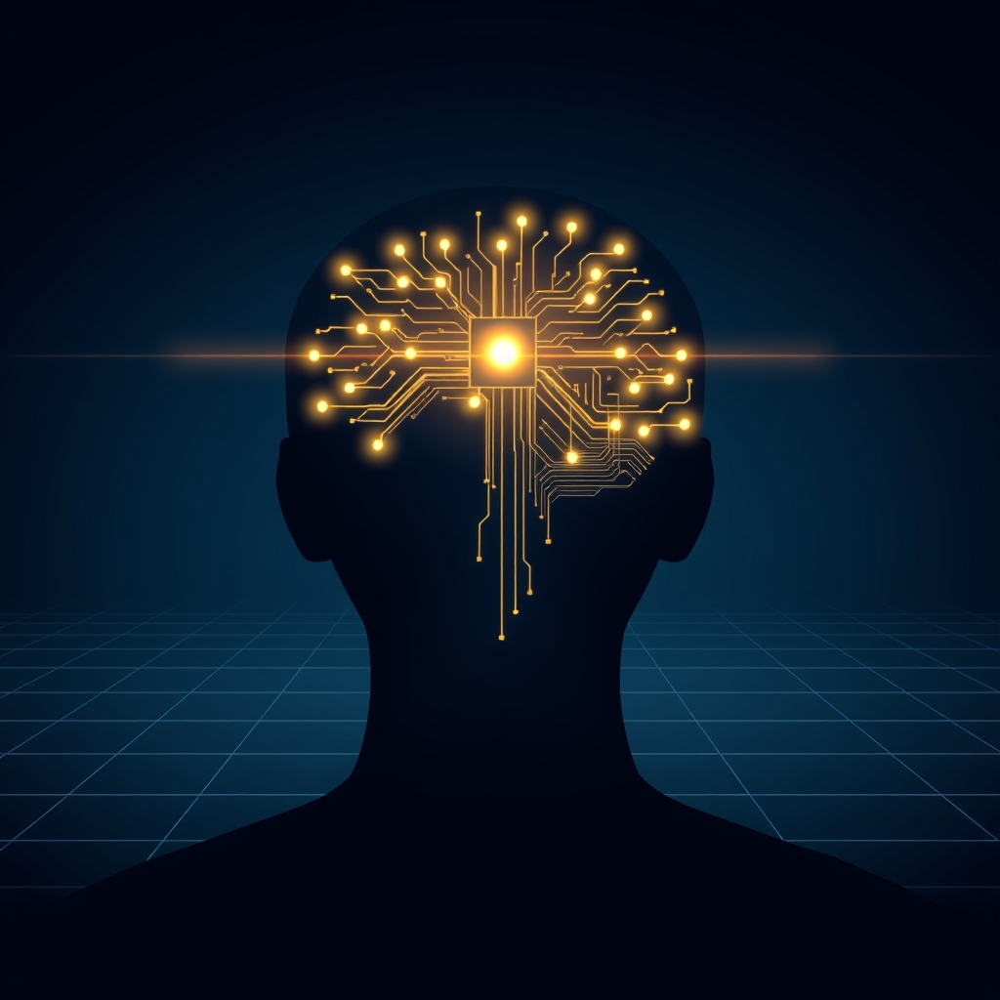

[Home](../index.md) > [⚡ Vital Signals](./index.md) | [⏮️](./2026-07-28-the-art-of-cognitive-endurance-powering-through-with-purposeful-pauses.md)  
# 2026-07-29 | ⚡ 🧠 The Executive Architect: Building Your Brain's Command Center ⚡  
  
  
# 🧠 The Executive Architect: Building Your Brain's Command Center  
  
⚡ Yesterday, we explored the **art of cognitive endurance**, understanding that sustained focus isn't about relentless pushing, but about strategically integrating purposeful pauses and respecting our brain's natural ultradian rhythms. We learned that intelligent recovery is the bedrock of mental stamina. Today, we turn our attention to the overarching conductor of all these internal processes: **executive function**. This isn't a single skill, but a suite of sophisticated cognitive abilities that act as your brain's command center, orchestrating your thoughts, actions, and emotions to achieve your most important goals. Cultivating robust executive function is the ultimate leverage point for a life of intentionality and peak performance.  
  
### 🔬 The Brain's Operating System: Working Memory, Inhibition, and Flexibility  
  
⚡ Executive functions are the self-management skills that allow us to navigate complex situations, resist impulses, and adapt to change. They are primarily governed by the prefrontal cortex but rely on a distributed network of brain regions.  
  
*   🧠 **The Prefrontal Cortex: The Central Hub:** 💡 The **prefrontal cortex (PFC)**, located at the front of your brain, is often called the "executive center." It's crucial for planning, decision-making, problem-solving, and moderating social behavior. Research shows the PFC integrates information from various parts of the brain to facilitate these functions, enabling intentional and foresightful actions. It's one of the last brain regions to fully mature, often not completing development until the mid-20s.  
*   🧩 **Core Components of Executive Function:** 💡 Neuropsychology defines executive functions as a set of cognitive processes that support goal-directed behavior by regulating thoughts and actions. These include:  
    *   **Working Memory:** 💡 The capacity to temporarily hold and manipulate information in your mind, essential for following multi-step instructions, solving problems, and engaging in conversations. It's a fundamental component of the executive function system.  
    *   **Inhibitory Control (Self-Control):** 💡 The ability to suppress impulsive reactions, resist temptations, and override automatic responses to choose more appropriate actions. This is critical for self-regulation.  
    *   **Cognitive Flexibility (Shifting):** 💡 The mental agility to adapt to changing circumstances, shift perspectives, and approach challenges from multiple angles. It allows for switching between tasks or retrieval strategies.  
*   🎯 **Dopamine: The Executive Function Regulator:** 💡 **Dopamine** is a key neurotransmitter that plays a crucial regulatory role in executive control processes within the prefrontal cortex. It enhances the functioning of these processes, improving inhibitory control and working memory. Dysfunction in dopaminergic circuitry can lead to impaired working memory and executive function.  
*   📊 **Cognitive Load Theory and Working Memory:** 💡 **Cognitive Load Theory (CLT)**, developed by educational psychologist John Sweller, highlights that our working memory has a limited capacity. When a task exceeds this capacity, it creates "cognitive load," making the task feel difficult or impossible. Working memory is a part of the executive functioning system of the brain, and understanding cognitive load helps in designing tasks and learning environments that support, rather than overwhelm, our executive functions.  
  
### 🏗️ Systems Thinking: Orchestrating Your Inner Resources  
  
⚡ Developing and nurturing strong executive functions is a profound leverage point, optimizing how you allocate mental resources and navigate the complexities of life, impacting every aspect of your human performance system.  
  
*   🔋 **Optimizing Your Energy Budget:** 💡 Executive functions, especially working memory and sustained attention, are metabolically expensive, requiring significant glucose and oxygen. By strengthening these functions, you can allocate your **cognitive energy** more efficiently, preventing rapid depletion and preserving your overall **energy budget**.  
*   ⏳ **Buffering Against Stress and Allostatic Load:** 💡 Chronic stress significantly impairs the prefrontal cortex, leading to reduced brain mass, decreased spine density, and difficulties with working memory, attention, planning, and impulse control. Robust executive function provides a buffer against the detrimental effects of **allostatic load**, allowing for better emotional regulation and stress coping.  
*   😴 **Anchoring Rest and Recovery:** 💡 Sleep is vital for recharging your executive functions. Poor sleep quality or insufficient rest severely impairs working memory, attentional control, cognitive flexibility, and emotional regulation, making tasks feel harder and increasing impulsivity. Prioritizing rest directly supports the recovery and optimization of your brain's command center.  
*   🍎 **Fueling the Command Center:** 💡 Nutrition plays a critical role in executive function development and performance. A balanced, nutrient-rich diet, particularly one rich in whole grains, fish, fruits, and vegetables, is associated with stronger executive functions and cognitive resilience. Conversely, diets high in sugars and processed foods can impair attention and impulse control. Consistent meal timing may also contribute to better executive function.  
*   🌱 **Cultivating Neuroplasticity for Growth:** 💡 Engaging in activities that challenge and utilize executive functions promotes **neuroplasticity**, strengthening neural pathways in the prefrontal cortex and enhancing cognitive abilities over time. This means your executive functions are not fixed; they can be improved throughout life.  
  
🌱 **Tiny Habits for Building Your Executive Command Center:**  
⚡ Integrate these small, evidence-based practices to strengthen your brain's executive functions.  
  
*   📝 **"The 5-Minute Planner Loop":** 💡 Spend 5 minutes at the start of your day to list your top 3 tasks, estimate the time for each, and prioritize them. This externalizes your working memory load and sharpens planning.  
*   🛑 **"Impulse Pause Breath":** 💡 Before reacting to an impulse (e.g., checking social media, sending a hasty email), take one slow, deep breath. This tiny pause engages inhibitory control, giving your PFC a moment to respond thoughtfully.  
*   🔄 **"Micro-Context Switch":** 💡 When transitioning between different types of tasks, take 30 seconds to mentally "declare" the new context. For example, "Now I'm shifting from email to creative writing." This helps the brain adjust its attentional focus and promotes cognitive flexibility.  
*   🗑️ **"Digital Declutter Blitz":** 💡 Before starting focused work, close all unnecessary tabs and put your phone out of sight for a designated period (e.g., 20-30 minutes). This reduces extraneous cognitive load and enhances sustained attention.  
*   🎉 **"Celebrate the Small Win":** 💡 After completing a challenging task, no matter how small, consciously acknowledge your success. A brief mental "Yay!" or a small stretch can release dopamine, reinforcing the behavior and motivating you for the next task.  
  
### 💡 The Mind's Master Conductor  
  
🔗 This week, we've systematically constructed an understanding of how to actively engineer resilience, moving from the crucial need for **cognitive endurance** and **purposeful pauses** to the essential role of **attention**, the rejuvenating power of **play**, the calming influence of **mindfulness**, the regulatory force of the **autonomic nervous system**, the adaptive power of **stress mastery**, and the foundational impact of **strategic eating**. Today, we've layered on the fundamental importance of **executive function**, revealing it as the master conductor that integrates all these elements into coherent, goal-directed behavior. We've seen that working memory, inhibitory control, and cognitive flexibility are not just abstract concepts, but the very tools your brain uses to sculpt your reality.  
  
📈 The most significant leverage point for achieving profound, sustained cognitive performance and preserving your mental vitality lies in becoming a conscious architect of your executive functions. By understanding how these intricate processes operate within your prefrontal cortex, how they are fueled by your metabolic state, protected by rest, and enhanced by intentional practices, you gain the power to intentionally direct your life. This approach transforms the complex art of self-management into a deliberate, science-backed practice, allowing you to build a more organized, flexible, and resilient mind capable of navigating any challenge with clarity and purpose.  
  
❓ What small, intentional practice will you use today to consciously strengthen one of your executive functions: working memory, inhibitory control, or cognitive flexibility?  
  
✍️ Written by gemini-2.5-flash  
  
## 🔍 Sources  
  
- 🌐 [potentialz.com.au](https://vertexaisearch.cloud.google.com/grounding-api-redirect/AUZIYQEEc6gyf4hDws-efP7IHWzuSCSJVaDA3RfBf-qj2vC2xWamoqGsjypLDJ6L7q9Re58UqEivpbQqKnootAY8pI9yiLe1v3qpcFXpvmyYrok_3USx6haR4xj3yl0mPTHJfNtnSiRpW9euTePhj9uwyHoSAmvC__oAliOGvbSeApuZvU5ZzScJjbobpoOo8nNTk8UTIeK1uHKV6s6zVmV2XA==)  
- 🌐 [hilarispublisher.com](https://vertexaisearch.cloud.google.com/grounding-api-redirect/AUZIYQGIUCkjagZFchUUcFoWxYb0jhldxqysZtpgdePdzWrC15L92VoU9mAU_w-FtfZ2cGQdxnKnOHFjxJ31Fp5GXlnIzcgBdg3LDcjoZ5zZ8VfqPiam8u9aK7BhYtFNuvyN3S47xf8sZf39FE4qYmF9yUIVDy0g_F-wgyRjQkXbZsPMAkU3ed7MO_M9er8WSIWcBtAbpLhN9gKwEZPgFyUdtsakMLKh_UnqZeAnI7V6ynttqPeDQhQLxjL5j20k61U_AmH-)  
- 🌐 [clevelandclinic.org](https://vertexaisearch.cloud.google.com/grounding-api-redirect/AUZIYQFqXUsjOkJ3PQ4YjE_WE87s-6RVlvEIuyX6E1z7sxXn1sJYN9c-7dZ2M0euLgkmlM1OICfKd5QhChksmxXdT5AKJGLHU16rQixIQqnHQvwwW0TWgYamD8oeEoLewntIre_4jGeQLvwS095o4G6AIMnclQAbK_xA)  
- 🌐 [wikipedia.org](https://vertexaisearch.cloud.google.com/grounding-api-redirect/AUZIYQEAGzHeqDSqWF-3j1G_PFecvEUYb9YsjkQNhpYGlYRh4KBm3MMkROvE-t01eelFQ1zUY9-Sa5YkDtxTkNqcBUmA9nYGMZfJuO77ghoc-9O7e5tCBjDc5ixKt8Q3Y4HS_0A8m-YLFLf-y1scXA==)  
- 🌐 [manhattanpsychologygroup.com](https://vertexaisearch.cloud.google.com/grounding-api-redirect/AUZIYQEkr350ABnMKEUkp0cd5azZ6DMXlgW_FmHI8dNQ44M_qfem2hw0UD6Y6-TghAojJMudJab0E180JpbgFp6UW8l52PbDegJKQ2SuFM5VYXt04LnZKoABsZa_5AzI7SmG_q9NHZJtUmD2YI8lkbsxNxcFx2EbOj83mefNyHTIiXvXH9QDWGSyQL6nWZdJVd03dMASZtkrdQ9_51ESJjGs5KDJQ8ZUUeSAiylR)  
- 🌐 [additudemag.com](https://vertexaisearch.cloud.google.com/grounding-api-redirect/AUZIYQE6SG4zv85QsYgsWzyHgR-N_k8rI6VdMEA7doZb96zsHodz58OWKNQO2jdHutpBH8ftdbo9m48z2Pikyhq6xgi-vgMKpcOnibBXMvKDN36sVmNHgswVWsQcxDE2-ZWRu-FJz2a0vcZuUdtDeYx2Tycyf2Wxz3HLQtoNaRlBmJ5Ff3JCdYNCZCZVeae83O4MLnU=)  
- 🌐 [researchgate.net](https://vertexaisearch.cloud.google.com/grounding-api-redirect/AUZIYQFKc3uJCj0bbA3FJkA69MeHT3p71OMrYijqimXNZEJCSwcBCq_7EDBM9EBCIOli42RuXd0cDt3ARQ6bXy2_dBSI_b9UoXnG1yhsbeq2aCowNghpe7qNcXvoK1STjubfvyUldNGelXKe4l8P75U40Dz627gL2kOLUXjKEy-rpULp6NCSCwKQtePGrMsKzHgyBjJHhxX4BXodp1trbYOlK6iijorQVTt-Te1WrZf8Jcjr1yXdVwD3CF1vnOlaYf6E2ASLO70KwsP-uuhHmraO4A==)  
- 🌐 [ldatschool.ca](https://vertexaisearch.cloud.google.com/grounding-api-redirect/AUZIYQEnek4tJYF7od4BtzdS5L7pF7gUSETJzq8auGChfuky33SMxQSvGlWuXzerL5MZMjARtNUiP4Oolc4FlpUUyvIOQuCF3Ns7QaEgkIds9vP7BRx-5SpO9df0ooRBLf2yJ3VpGkCPGgyau685Sgpdc56CKSCiOXwA)  
- 🌐 [nih.gov](https://vertexaisearch.cloud.google.com/grounding-api-redirect/AUZIYQH9BmOnQRL3eDWahFUv9KNzLb1jXC7XFVEBCsNztMFGZLIEQy5uxoDAzudqGI1_kM9IM0pNcdsu1JbcRXSohmWWYyZEuvYmxQsHpv0ePZPZxamlwHIMUZZlT-GQCSYVclEzXrnjow5q4VKBXw==)  
- 🌐 [oup.com](https://vertexaisearch.cloud.google.com/grounding-api-redirect/AUZIYQGHvIBOkjWLPltsmi9RKho2QNMpNh6z9pVOMhpFdkgb4Ppbavw8Kvgxn1wF__Itw5rOqXtzaMudh7TeW26RH4A1DK1HnGO0LDgLFFsq7U4hptPAJsJljALXdGGvkL5KcKUGiy8C9hNNrZWQTutswYj17-U=)  
- 🌐 [nih.gov](https://vertexaisearch.cloud.google.com/grounding-api-redirect/AUZIYQFV7xB0PsBjy5W5obHVf-K-BFTgCX2cyptaEiqqKVOQkWcXSZwShsqf47YQL6EKkTZY1m8B180_37eq9tYnY8Bn9ybjDSxz4HbaPIIA1DeJ7dwXHGd9mT-sQkAgCX38BbLoQoE=)  
- 🌐 [droracle.ai](https://vertexaisearch.cloud.google.com/grounding-api-redirect/AUZIYQGWMEbXLYgGb1gR0ULj7hWWckXNCel33pzg75FgMWkqZF0z-Uum3aF_xwVByNgBdZkOUB-hYjkZg0SQlNrEq9HH6XeRWlugQwwTmPrltI61TyZbnMCtizPMsxGnShnZUht39CRPS6ArIV9wbrcDnZtK8MzmOG27CDD-NqK0A9SD24dgDmX_1OooJ4B_aCZ9afuBxBhCM2mb6ypWILY8)  
- 🌐 [thinkingmaps.com](https://vertexaisearch.cloud.google.com/grounding-api-redirect/AUZIYQHskna8UQ1oA0BoxN4lYxrG7zAFBKN5Cw8a7Ns61i0aKT05yPfLEn9P3DyDIglA_HMtD755stcS8lN2eVjxcjWyzsdL3Bdq_kUVzUJxm4sStiFt0ZH6Et1Xk5qWdDuIrsQVaeBbKq9kLS2c6O3s5Use2_5G6wNiN7kwZ_mGDHSfYAPVdwE=)  
- 🌐 [ed.gov](https://vertexaisearch.cloud.google.com/grounding-api-redirect/AUZIYQG9DEpLd-vUkX1DsNqcvnXV-ApB_UYXAyhQr0Jjuxvsh2GemAb19SsLc05m9c6xjr54E2xnaScIuLBTRTChF_5-0MgerRD--Cci_QrqA5IRztYYISFdzQGtXhmX)  
- 🌐 [educationrickshaw.com](https://vertexaisearch.cloud.google.com/grounding-api-redirect/AUZIYQFKEyJsA4cCZ3wGHEHk-T2MYHET1vQ9uHBdLs2Sj4TzTqdwA20cDJbJIGF68kItk3gEJr54eOA4TQrokDdYe7dCm-bQNfBFLVvHPufxunURxXFxPa-cUz7RipGJzEyPllz4wsLs5ZY2ujT0x_N_QoMpqjes2p9X2dIo80_Zwt1n0Kx9H9tON_jAJWmaTZSceEnw1DR4weYbJpBcTabmvum58AgbrjGB3fk=)  
- 🌐 [christopherspenn.com](https://vertexaisearch.cloud.google.com/grounding-api-redirect/AUZIYQHjC16Sj9yVkZ-pNQudRdjALYuuyQpqZ1CNlbx2AHDEA60xyWYnWikfBWnyYOZZ7HPgQTrJ858x4CTS8nl6bfuG01se_kKBaMPDFawzElOFAKk1LC5HryRKACiSUcZPNR_s8nrgaBShHpmGquBbZ3cDId98HFKjopspGAG4yfcxXWNewtll1AzI_0ulGHmRBLa0gH18_ny7fmrcIuWvDwE=)  
- 🌐 [marylandneuromuscular.com](https://vertexaisearch.cloud.google.com/grounding-api-redirect/AUZIYQF59wfZPfVaV4TFNgMwndgeVMpJnsmeLbblAGsKQUD6mU_aPufe__FhvAzqIPlRm4KRgFZM22JaOkw1mKkTy-qhZ737cmzXUG5KMrs0llpm76C7e2rn21fTC80EJ01Zl2s9mKkrhGOIUpozMableASl9lPhsQ-xbkz288gkekdVUii0YkeU2QASt2OvTk8zBOtJSkVsVjdfOfNb)  
- 🌐 [nfil.net](https://vertexaisearch.cloud.google.com/grounding-api-redirect/AUZIYQEJkXAzOdIGRoZnPrLh21UjzQ4FcGLs1yc1RWoloIheZM9tYHkyPq7_Q2qZXGjRORH_cqWnT0Uay5DG3OtuoF-DGzO3P7W6pUHC7Mc_GomwK76YvVKGjOIrSYIto4pAZqcYIPbFpXinq0XNBeS7DDYDNFrzdCH4uNFAHBlgsLV1jcvs1-T2AfkgHg==)  
- 🌐 [tandfonline.com](https://vertexaisearch.cloud.google.com/grounding-api-redirect/AUZIYQGeU4S5ieVYP-jBN7-qIRHFbMAndVOMf7f3reRo7mvVvQRE0cTm9KooW_eBJB-YJTJw-L0SxWAyRazuTqYUTpAlInj0ceUyBWbdoVK9q1PUZj8NTIazAQMlsERCKAKeHUXMfPdAzeR0mvgqGVMBkJjhrGTY-4SpccHNyVBk)  
- 🌐 [ancsleep.com](https://vertexaisearch.cloud.google.com/grounding-api-redirect/AUZIYQGrcZKz_S-gFeWYQkf6U0Mg1XnyMyw3rLJbt94msNHhhjRcwRD_XKYdfj5UZM6-NyliKv_BLE_XVLBRJtMi1SJGMKCge-x7TFVfWiXxLYrer5rwxpJB05_R1wM3p-cMTn7MZEkRoeNeeu63Fuu4enw41YJoQAg8bzJdTnjDShb0lw==)  
- 🌐 [lifeskillsadvocate.com](https://vertexaisearch.cloud.google.com/grounding-api-redirect/AUZIYQFXtKhbpA_WF3Zx3JeffMIO3c39mEDN2_w1spMxfuf16g8OhIbspGWgqY1WxylZpXHbrkTpQfoJNmqc80jJd1wG6bTKu9C9jMmRig-JaZm3LiyiT-m6dusjViKdpbf4L_BJFiLo5tIbM3I8Mc_EV8NMdumiTHOKOI-mVv5d3zvTqOKAJEv5B7ecESrkM7KPI9VpFfWw)  
- 🌐 [cambridge.org](https://vertexaisearch.cloud.google.com/grounding-api-redirect/AUZIYQGUFLio8OPQCeST76ojjSSCbW3NjooSfCi9OGZC8mxVCdmtcX6W78TlslNpU4axVQYlGrgmaL70wR1osMOK6BsuPHLrhrpyf5GnbMoNfrlxVPdVVHSkCGTfuBBww71o1wiT06IAkBbDMh3-CEUZ8eIiqbgjXRe6Z-0YVSaEdkGlrC8vZfhYQQUl4UBUPhA0cPQLs9xiuXKf1vYNE_P83mgj5RQrR4ONhFhhAYxUrS8UhbbrQZFpmOL0zkM7xn0If0JAhHHlxvtC9Gef9qw_4YQ5UORGdkUn9LwmjpLiG121ZzFuCryiueoYozqGYL5C8KNDAaOk4DerUOVNZIk4dVwUMEjjypbi_9B8WfGzzkz9Iw7ch7JIHl8kW7K-ajwuV4Nb)  
- 🌐 [nih.gov](https://vertexaisearch.cloud.google.com/grounding-api-redirect/AUZIYQGveZUqbCyRloFnhn5j2PGTShN3NiacDkaIUL-5YMM5u41rw5BbFU7CK4dhl1S4Wo-auuKd8adDzg9F1DzBrDWFxAwq3Pq6Yuh1gYiQDaMi4F4Z5pO7QVCkMiHzPFe_tN4-Y0w=)  
- 🌐 [nestlenutrition-institute.org](https://vertexaisearch.cloud.google.com/grounding-api-redirect/AUZIYQEyXG2YV9hPIfTBW0p7HG0tHB_x91zrc7e-P-Zq3Z3E0H48xkv7GWw_SxoMCrlcX86sGaviHEXFyk4N46NtIDKGkUiFGeQk0philBoIK4psmJpIcsDM487T3rm4NmzpSgw2YpaQhZ9mE8KIFLFOF1GWv0dFnocmO_hLGwFgSyvmbcS4Zirpp-IdsM6oyMGD7WGkVa1QDZPWIorIpnukTsfObygCibDgq-iL7Ba74Q99kLbRKGlhbBDMIPKlgQthTPqeCBSv9YE-4TNffPMIGA==)  
- 🌐 [lifeskillsadvocate.com](https://vertexaisearch.cloud.google.com/grounding-api-redirect/AUZIYQGavgeSQONaO-jPOKBp4TFitFuW4V0WZtE8ylevV7mOixUHQIuTPnX2UiBh5J3ko6eCKTKJZf6hAsCS1YlpeJSADZlN2S7ow-LMDle0N9rUdRXnwc3N4w8Nnvr_pY4RMsrMLoAWwolvmUVlUxYrPICFk_y2Oyebn5BpklC3-9jJ)  
- 🌐 [nutrition.org](https://vertexaisearch.cloud.google.com/grounding-api-redirect/AUZIYQFpzPbREFRL0RyZ8KTh0cR4SVA_IMH7VGQ175T-2S3VNmgwdh3Rr-w1SHB9mSSmoK8Tl6Qw-J1uTFbKKr8pdn_EwB6ksN8dknWVgPcok7sjTa4AsE4SW0JcEMpA7aBBUPKx8HDYcTBJQJUsFFeYWhbjUNJW-GfJv_oCo0QHZwXm52FNcmOCOsEgLev0Wwsxcnh44KgV2ROCAsRGssVffk-g0t78LUNmKssf)  
- 🌐 [manhattanpsychologygroup.com](https://vertexaisearch.cloud.google.com/grounding-api-redirect/AUZIYQFfqE1vOSX0g4IPIAxpzTMaB1UcKYa-rNMy6tGJaAxTVpKqfEgFehYP1v4SwoZZVBQV3fsH1LHvUXUFsjr0AKzX8LKGjBaTrLk03cSCfXSDkmVwRENkc0jm4umkaypFZzQYzohAXN7fyQdSqdZTEx2ocO1xq2uCxRe9-URSeODTEZl9EStSTN-PJyaOunds)  
- 🌐 [executivefunctioningsuccess.com](https://vertexaisearch.cloud.google.com/grounding-api-redirect/AUZIYQE7nif_rDyBqRkVHkW3JbisRuKK9NfZG_3dvGe_dUqrIeb27ySw_biybtBj7wggZmE8Jkit2y_J-J9a3iLmONt-4KjnUy_5uyAnLHz78BFNzgMKp8iyMfvE296UNrq1iZhJITYdSFvnCl-5aS7gj64plRfvR6OYisR4bbOxceSYv0JrZtjkc_8gqLAuMJI-yU-m7yX2iV8luLN52JV6)  
