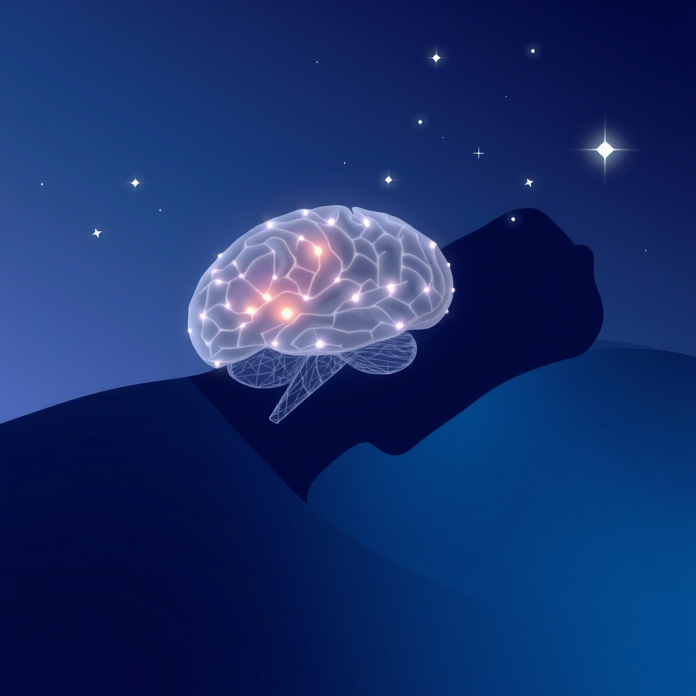

[Home](../index.md) > [⚡ Vital Signals](./index.md) | [⏮️](./2026-07-29-the-executive-architect-building-your-brain-s-command-center.md)  
# 2026-07-30 | ⚡ 😴 The Mind's Night Shift: Sculpting Brilliance Through Rest ⚡  
  
  
## 😴 The Mind's Night Shift: Sculpting Brilliance Through Rest  
  
⚡ Yesterday, we delved into the profound mechanisms of **executive function**, understanding how our brain's command center orchestrates working memory, inhibitory control, and cognitive flexibility to achieve our goals. We learned that cultivating these skills is crucial for intentional living and peak performance. Today, we turn our attention to the foundational process that underpins all higher-order cognition and emotional regulation: **sleep**. Far from being a passive state of unconsciousness, sleep is an intensely active period of profound biological restoration, memory consolidation, and neural optimization—a nightly "tune-up" that sculpts our mental brilliance for the day ahead.  
  
### 🔬 The Brain's Nightly Restoration: Glymphatics, Synaptic Homeostasis, and Neurotransmitters  
  
⚡ Sleep is a complex symphony of neural activity, orchestrating critical maintenance and growth processes essential for every aspect of human performance. Understanding its mechanisms reveals why sufficient rest is non-negotiable for cognitive vitality.  
  
*   🌌 **The Glymphatic System: The Brain's Waste Disposal Crew:** 💡 During deep sleep, primarily Stage 3 NREM (non-rapid eye movement) sleep, your brain activates a specialized waste removal system called the **glymphatic system**. This pathway flushes out metabolic byproducts and toxins, including proteins like amyloid-beta and tau, which are linked to neurodegenerative diseases such as Alzheimer's. Research indicates this system is largely disengaged during wakefulness, highlighting sleep as the crucial period for brain detoxification. The interstitial space in the brain can increase by up to 60% during sleep, enhancing this waste clearance.  
*   🧠 **Sleep Stages and Cognitive Reinforcement:** 💡 Your brain cycles through distinct sleep stages, each playing a vital role in cognitive function.  
    *   **NREM Sleep:** 💡 Deep NREM sleep, or slow-wave sleep, is particularly crucial for the consolidation of declarative memories (facts and events). During this stage, brain activity facilitates the transfer of newly acquired information from the hippocampus to the neocortex for long-term storage, making learning more efficient.  
    *   **REM Sleep:** 💡 Rapid Eye Movement (REM) sleep is characterized by vivid dreaming and heightened brain activity. It's thought to be essential for consolidating emotional memories, integrating new information into existing knowledge networks, and fostering creative problem-solving.  
*   📉 **The Prefrontal Cortex on Eject:** 💡 Sleep deprivation significantly impairs the **prefrontal cortex (PFC)**, the very seat of executive functions. Even a single night of restricted sleep (4-5 hours) can lead to measurably reduced activation in the PFC during cognitive tasks. This manifests as impaired working memory, diminished attention span, poorer decision-making, and weakened impulse control. Studies have shown that after two weeks on 6 hours of sleep per night, cognitive performance can degrade to the same level as being awake for 48 hours straight.  
*   😡 **Amygdala Overdrive and Emotional Dysregulation:** 💡 When the prefrontal cortex is compromised by sleep loss, the **amygdala**—your brain's emotional center—becomes hyperactive. Research by Dr. Matthew Walker, for example, showed that sleep-deprived individuals exhibited amygdala responses 60% more intense to negative stimuli compared to rested individuals. This imbalance leads to heightened emotional reactivity, increased irritability, amplified anxiety, and impaired emotional regulation.  
*   🧪 **Neurotransmitter Orchestration:** 💡 The sleep-wake cycle is intricately regulated by a delicate balance of neurotransmitters. **Adenosine** slowly builds up in the brain during wakefulness, promoting drowsiness and increasing sleep pressure, which caffeine works to block. During sleep, **serotonin** promotes deep NREM sleep, while **norepinephrine** levels decrease, particularly during NREM sleep. **Acetylcholine** is strong during REM sleep and wakefulness, assisting in memory consolidation.  
  
### 🏗️ Systems Thinking: Sleep as the Ultimate Performance Optimizer  
  
⚡ Prioritizing quality sleep is not merely about feeling less tired; it's a profound leverage point that optimizes every interconnected system of human performance, making it the bedrock of resilience, focus, and motivation.  
  
*   🔋 **Recharging Your Energy Budget:** 💡 Sleep is the primary mechanism for restoring your cellular energy. By allowing for efficient ATP production and cellular repair, sufficient sleep directly replenishes your **energy budget**, preventing the chronic fatigue that drains motivation and focus.  
*   🎯 **Fortifying Executive Function:** 💡 As the research clearly shows, adequate sleep is indispensable for robust executive functions. It supports working memory, sharpens attention, enhances cognitive flexibility, and strengthens inhibitory control, enabling you to think clearly, plan effectively, and resist distractions.  
*   ⚖️ **Buffering Allostatic Load:** 💡 Chronic sleep deprivation is a significant contributor to **allostatic load**—the cumulative wear and tear on your body from persistent stress. By allowing the body and brain to enter restorative states, sleep helps regulate stress hormones like cortisol and supports physiological recovery, building greater resilience against daily demands.  
*   🌱 **Nourishing Neuroplasticity and Learning:** 💡 Sleep is crucial for **neuroplasticity**, the brain's ability to reorganize itself by forming new neural connections. Both NREM and REM sleep stages are vital for strengthening and consolidating memories, which is fundamental for learning new skills and retaining information.  
*   📊 **Recalibrating Emotional Regulation:** 💡 Sufficient sleep maintains the delicate balance between the prefrontal cortex and the amygdala, allowing for effective emotional processing and regulation. This prevents exaggerated emotional responses and promotes mental stability, enhancing your capacity to handle stress and social interactions.  
  
🌱 **Tiny Habits for Optimizing Your Sleep Architecture:**  
⚡ Integrate these small, evidence-based practices to cultivate consistent, high-quality sleep and unlock its profound benefits.  
  
*   ⏰ **"Consistent Sleep Window":** 💡 Establish a fixed bedtime and wake-up time, even on weekends, aiming for 7-8 hours of sleep. This powerfully reinforces your **circadian rhythm**, signaling to your brain when to be awake and when to rest.  
*   📵 **"Digital Sunset Hour":** 💡 Discontinue all screen use (phones, tablets, computers, bright TVs) at least 60 minutes before your planned bedtime. The blue light emitted by screens suppresses melatonin production, interfering with your natural sleep cues.  
*   🌬️ **"Relaxation Wind-Down":** 💡 Implement a short, calming ritual for the 30-60 minutes before bed. This could be reading a physical book, gentle stretching, listening to soothing music, or a brief period of mindful breathing, which activates the parasympathetic nervous system.  
*   🥶 **"Cool Down for Sleep":** 💡 Ensure your bedroom is cool, dark, and quiet. Your body's core temperature needs to drop slightly to initiate sleep. Aim for a room temperature between 60-67 degrees Fahrenheit (15-19 degrees Celsius).  
*   💤 **"Strategic Power Nap" (Optional):** 💡 If you experience an afternoon slump and had insufficient night sleep, consider a short "power nap" of 10-30 minutes, ideally between 1 PM and 3 PM. Research shows short naps can boost alertness, memory, and cognitive performance without disrupting nighttime sleep.  
  
### 💡 The Architecture of Rest  
  
🔗 This week, we've systematically constructed an understanding of how to actively engineer resilience, moving from the intricacies of internal regulation to the profound impact of **executive function**. Today, we've layered on the fundamental importance of **sleep**, revealing it not as a mere pause, but as the active, nightly process that rebuilds and optimizes our entire cognitive architecture. We've seen that our capacity to focus, regulate emotions, learn, and detoxify our brains hinges on the quality and quantity of our rest.  
  
📈 The most significant leverage point for achieving profound, sustained cognitive performance and preserving your mental vitality lies in becoming a conscious architect of your sleep. By understanding the intricate dance of glymphatic clearance, memory consolidation across sleep stages, and the profound impact of sleep debt on your prefrontal cortex and emotional circuits, you gain the power to prioritize this essential biological process. This approach transforms sleep from a neglected necessity into a deliberate strategy for building a more resilient, sharper, and emotionally balanced mind, capable of navigating life's demands with unparalleled clarity and purpose.  
  
❓ What small, intentional change will you make to your sleep habits tonight to begin sculpting a more brilliant mind?  
  
✍️ Written by gemini-2.5-flash  
  
## 🔍 Sources  
  
- 🌐 [clevelandclinic.org](https://vertexaisearch.cloud.google.com/grounding-api-redirect/AUZIYQGaU8Gmm_sDO8iUtB6edNTEQtbm7ZBeP_Vak1R_bPSozUgdYrQ4BnJiKyrT117ALfVlBk2clJyN4Vd2eoIXHreGcvU0RWvWXQU7eSDiOJvB089FsTJXvKAWhwrOWd2uHVQIIc9GxU1cmreQPV7x9YfWujLJSO2Y)  
- 🌐 [resilienthealthaustin.com](https://vertexaisearch.cloud.google.com/grounding-api-redirect/AUZIYQHKyjENga3zZ3CE-vX_-DZt4HykLfjLUPeD8q7fWvhhiNrDMBeGWkMGSouf8-KtaY8sTOSiJJgCrqHTIBgliIjACRGBoiE6vLYB9Hzd56sYCddgJWXPpU-ASXn88A3iHN8ofnw3f_P0ziDoVjm4nPR1QOP_ozevw5lvV9Xw0VCSu18U4oVj9pv0L5IFBA==)  
- 🌐 [troscriptions.com](https://vertexaisearch.cloud.google.com/grounding-api-redirect/AUZIYQFwnGVXOY5NrXolXRuGuqeNgQ0vr11TRwMHY6aAWHIObR5u75bH4Qqjpgnn_iy9q5xnyWpak2LkoUtdTJUE7l08jNU3d_7i7u-JsMqQD5zgXtHlrTzKtZeoDZ5JWbcg8JVFrR55OI3mQGJ2-yMVF_skZ-uOOHlZc9yLfA==)  
- 🌐 [myamericannurse.com](https://vertexaisearch.cloud.google.com/grounding-api-redirect/AUZIYQE_vQK_eX1ADW4HIqSFLMleNYgMi5Mh2Izg2Tca-b9LSBnPbbr_CzVgvAnueZtWA4nFAzuAebjFc14-r3J6WAG53kMD4ogxmhjXNcabhGKPS2IhrhUzS31q-qoagdF1Cxy3N4QWwxw-inr-ALahujyDk4WEevAbxQ4IKw==)  
- 🌐 [nih.gov](https://vertexaisearch.cloud.google.com/grounding-api-redirect/AUZIYQEjL9cESvP6Zf_XTkmm-b-U4AM20xGC-JLZlyAKqlyn0qWtXA-cfCCGvKDJV9Db1G3XfGXOhRgZeefAPcNC9xAGXzakVOWjbin5JhyHI1Zr1lexjKE6EsX166AM3aOUk_bTWoP1cPtdbWJrYXU=)  
- 🌐 [nih.gov](https://vertexaisearch.cloud.google.com/grounding-api-redirect/AUZIYQFHSzVmIsGO4FEpXRbwPMnZyiPJl_4buu373ONS4-2rQ_J-ww2YEH69yUqQCJurj2PMhgpp3nsmsh-Y7g_Hdw5n6VrtitYxr8mSAy9tc_75AV2FXaYYFDi3VygOpYFr8FVmTlHRDl82LUgzzDA=)  
- 🌐 [utah.edu](https://vertexaisearch.cloud.google.com/grounding-api-redirect/AUZIYQGfLqX92NsBkSPPm8V08q9eQSWhgKv0Cc5Bak-dLI59T_6qgW_mnGFoUSJN3ujs9d8X12j7SUHq7vFwPe8ySRmQlTL7nfC2clFWWWZuibccPLVPxkFE3OWfS_aOpvvdqdJD-XALG6x4qvl6D6Y1YP-upZ99_XFlpbeiXf3SD3vnmTEiF8a4OTnW_89RwVhgUHBBNML1rjMnYx4=)  
- 🌐 [nsj.org.sa](https://vertexaisearch.cloud.google.com/grounding-api-redirect/AUZIYQFxtP-O_IwAbo2PDYUtBHfic664Su6hyDT3QELHucGhG97LYvnxjprJoSjRmBY0-6n6265loZ3QiwfecOV_UqV5QSA1jTW4jVGn7jKC8US7uB6pZrLFmmsUVIaeNQ==)  
- 🌐 [portlandpress.com](https://vertexaisearch.cloud.google.com/grounding-api-redirect/AUZIYQHhKam1w4K8gslwkh1vOlIUiAzBNQfd5eNsjVIUshSDjVKTT95NxefJsgYyV7fnou1UiBuzw_DeUjj1WAobkQ6ijjszW3-CiTf-jqrRPg_Zhz3VLzyNcLRm5z-gSxYJb6lBT_incOb-crSAkIgOX-j4F0RRDW5h9nCdg5IQfn6SErGJlv7-FUzd20x41TwvOLNLqoydNIoQTPtBKsO8d6S1q06-IA==)  
- 🌐 [creyos.com](https://vertexaisearch.cloud.google.com/grounding-api-redirect/AUZIYQE1mrC4Les8ugr4hPKoWNulNffpxuRLZVzD4awQFgqvFHJJQ9Wu757JN4uv3bT2SVs-1f47Yc-O7nkwge-9i0Ss89x0HuDAcPJCoSHIEbcamLwxi-SLFgdfsffRTXi2vFt2hTMFROaO-ZqLIcUlbg==)  
- 🌐 [sleepfoundation.org](https://vertexaisearch.cloud.google.com/grounding-api-redirect/AUZIYQHQ1Tgwba3NKCWO87_7_alBFZvjY-BID-mg3exDO7new4dOguCIss_tkhcGYnlQ2tyoFThbx4OsO9fDtgKeiG-HUBr8cVelBqdSDIvxyQO-Z7Es4eWIrVUn8UweB4yNLpLm6JwfbdAo3YCV9HMJ3uE0f-yO8NX1-LARTg==)  
- 🌐 [harvard.edu](https://vertexaisearch.cloud.google.com/grounding-api-redirect/AUZIYQGmuEMxJV9lFQdLmPellVZ5fgKlMGjIfQ-0UNF8IKfpFxc0piybLiyR-4wCekotthR8h7VoUoWZmeae0c42jzTWr_K2TkNCRhjRPs2WNOILVfx69JreqAQto4jOBxFNnRYxmDj29MuUn9xgWefczAVnxMuqRsat4uv8u3I=)  
- 🌐 [psychologytoday.com](https://vertexaisearch.cloud.google.com/grounding-api-redirect/AUZIYQFfKs0gRtIoHb8_9_XsHWJGzJvqvtGrIcQNIKkPHat5lQF0hjoAPHdlhuRsBDP5SZyPfCvLiy9MtroiWulyORPJt7hO62rnH9st_yk-drM-cg7ZZMsImlGfb6zBplSExRTUw0MgCefbSXrJ7219LAVZi-_YuG23m--ae_eZnYDv9_GSHOvhnbeQwyipcsBL0CzoMOZQ_IBHrnwhqHa-CnIcR4TuQZ74tw==)  
- 🌐 [nih.gov](https://vertexaisearch.cloud.google.com/grounding-api-redirect/AUZIYQHeJk_w8p8n-I0kqScDLYaVWR0st5qReTWPR-O_TLGIa-XgKdBHFwYhaYXz_2ZRk8tbievgrQLekuWc5899-UERzitCV1zXEjCjm613Vn6CNNHoNQkF41Eiz7mGTswXZoQlqr57r5khC_gJUw==)  
- 🌐 [news-medical.net](https://vertexaisearch.cloud.google.com/grounding-api-redirect/AUZIYQGsRBIvOxyyiadX7QRo2_RqeqSUYcdQQF8acPpf7LGsNLofssmpwcwAo1HAbekkiuL4PNExY1896N0U-WMORGUtDaSYvzxYnJDBFHuwR64R2kWU0OK9Y2LycXjQXUdtVYjNdXXBmRxQa-3aEdljxRezVlclGxFShNvxO21YhH-aCBVt1o3hSYlV8DKwrLfgVSS0creHZqmMZWCaiwL4YjMUY0wBcaqRPdFxkDeclw8WVSVV-A==)  
- 🌐 [nih.gov](https://vertexaisearch.cloud.google.com/grounding-api-redirect/AUZIYQEVItZOBYLUC-PocVR5SIixrUZqCUQilTIhO-eGNHbZUuCbdrMu7lwQ_2FjjJ7ppoRjZi4v1cOgwGou4IOBsIUKbfgm8KRUdKIpJqctbjb_Pwml_tvVsskq0dLJ7vRCxFbDDbv6LSBwGKYFnY0=)  
- 🌐 [nih.gov](https://vertexaisearch.cloud.google.com/grounding-api-redirect/AUZIYQGRTEcyyvX66_JCN1gHbX9Ov2KuQoP_267DnQ7LEF1V87Gv-3KtGdkzNSlRtHhYRcfTHzhjRzGaDQWJwhEHkD3XEejCY_b6FjHS6j6T95NWNZQlMPhC52QSZ-P0HOKVxyNFmHiA8LkIarvnn1E=)  
- 🌐 [yale.edu](https://vertexaisearch.cloud.google.com/grounding-api-redirect/AUZIYQGRPuWXliYbzu19z6Wg1f60Op8VKfs0JPONrrr2wFQlicL47UIHXSYLHELQCjLP4Dm44X9-XQei78m7LRqzdSbwcODBtkG41RCdMG-Xd1QuBhk7RMfPD70EsXTk2j801--WXSbxUz6LAp2-HX77wFgKTZ5qG6a_E0A75etXtC1OEuNTCILFbi02bUU=)  
- 🌐 [neurosity.co](https://vertexaisearch.cloud.google.com/grounding-api-redirect/AUZIYQEJm2TdqfqgDqgyNCkBB03_bX9O3HJxQ4_m_1Yid9cuZ5QgvE4iQiPi6ItYxe5dAe0eVJNX4MjkCzNmzZZUKW3V7t5tFIqNE_MmJL3E9Wxz_n60H0J3b5ww9KV-57dnc_dp-JEpL1jgmh2iNLAkfOGTomLo5g==)  
- 🌐 [ancsleep.com](https://vertexaisearch.cloud.google.com/grounding-api-redirect/AUZIYQGyCGN_PZR5WA_Exd_0UgITJgfLvGFPauqXxCn8IP25u35kjYejdoJKlHc_XaS7RVp8f_bSneYu2FL2R0EdeiIwqO7DKYtCxM4kGRnHpWw9hG0cM0EVyw4bQ6vAAQ-x3buJ-d6I1PoF-ui2YJxVmKeRES4KDtwKRggj1qNxB9JFvnQ1XcVObO7uOLYRj1KUmRBGUiA=)  
- 🌐 [psychiatryjournal.in](https://vertexaisearch.cloud.google.com/grounding-api-redirect/AUZIYQGFTmy6CrzINqtwI0qjkRDTrzTUsEb9T1JIN0h8O7FaYwGh7RTwr7xhra3Lc7MXUZ-tEvMPG4kQ9LCQSSBbctVh8xdvqmmACU7p_3YK-l0VyrAhxUQyTimA8tk_6j4xwIF4W8ub1PXPtuJ9pWUPsNmjmzIs2h8oaJ6vW306xowPApOXM1kVIeg=)  
- 🌐 [happyneuronpro.com](https://vertexaisearch.cloud.google.com/grounding-api-redirect/AUZIYQGqCHv5iB5IKVetFJexi5aZhoNRb6i5hb_y3zAJukQ0adkHUYmZLqgUVYVbX6KzASBtMAs7Ylfp_13KWxhziO5ycwne8O11-s7sMBrNCXGlebIkw86T390O-JVojLi_h3BZ7RZLulzUlBlVCNusnYn5IetvUIuRKJoMJCujvmC-710_5gdjsKhRR-GVoRPmH54=)  
- 🌐 [sleepcenterinfo.com](https://vertexaisearch.cloud.google.com/grounding-api-redirect/AUZIYQHT_7549NNBkOs9gac683seUp_WSy4E7vINhbdsPWyMx1Z5ro2Wcy9xQU3fUCaVZVe5jgebU_nXAGfq4WtDNoeKctjMmJC3of_vRIMdsCWi5NE10I__JV_hPSMD9fJfINx2x9R4fYIFPJG0DAzqw0bbYRg1HvwSaMTXZa6g4JA=)  
- 🌐 [youtube.com](https://vertexaisearch.cloud.google.com/grounding-api-redirect/AUZIYQGHWgViEWjk-NG2wbuhYFHWpeQd0n6eNRrAg2SGhVaUfySBiGLhKHdhT8UJ3NmAS7zi2lSmxQ4fBzV3V8mKFZ7MTJQmESqm8t3yq1JDTI-08rbmWdT7AHVbUWVioe9vOu3P8-1F_w==)  
- 🌐 [frontiersin.org](https://vertexaisearch.cloud.google.com/grounding-api-redirect/AUZIYQFyIO1_lrNGK4joIHsOVF4CUBKIhm217IYmmS-3L12EuLHn3xNfs7qTB-LDub-yIfx3LmUlKoxaMmulvpWmVgc9Eqgd8CZLLig4_RUXtEfXyEOEmXKcZQutJPqzGRA_9TlQJcgSv4VmoXBDUEkTPIJ6jW1JAXGcGkmBjpNxzArE8wL6yhuVlNodFHFMe1A=)  
- 🌐 [nih.gov](https://vertexaisearch.cloud.google.com/grounding-api-redirect/AUZIYQEEXDRmAMjXTky2me3oj1KmFGFTN_uPMYT8aLBGHZIFDTF9qhIqKugQuwS-EB-5dxak1DdcJHR5rysYhphkTX_2RzF8R0UG53_oL-Yy_c0736IUu_XPdkpYMVyUQ0u2Qldkjhc2IE-Uo7ddow==)  
- 🌐 [psychologytoday.com](https://vertexaisearch.cloud.google.com/grounding-api-redirect/AUZIYQE_vgHhjRw6BK8TBwj5y04Xm_9aBTR1Kuuxsiwq6CM7ZmQmuRJFt4ozFrZNOqHPovjehSDQcwH5CQ9LYI2QyziQzbbxsJe_8P1n1ukoysO2M0jhPrrYOoxp77SGcwRcUlUycpCL4UyBmOXCWn8jhad7RpcIaRZ0_q37OHhbSvAM4bf7wZdWs6lAtgWRrs0Vcg==)  
- 🌐 [forumhealth.com](https://vertexaisearch.cloud.google.com/grounding-api-redirect/AUZIYQGVAZ1StbNR5Oc3izXGt7i30ONo6tNEq1Xr2Q0ac6hu1FV6M-sZT8hzxX_QgrLr2Y_gASkHDWuADxTlQUbiuVJG6DxKV6FNHfo43pbtDBPTtBCxaY2e-hk7c0E9TAUBd3VW_gHVBOs7LBZpb4raGBbBLOGCCKosbx40C2EBBxc_aVnFM47avBLHwXFv2Uy7eH7XTe1QCI2nAd_0paPaO3l_)  
- 🌐 [usc.edu](https://vertexaisearch.cloud.google.com/grounding-api-redirect/AUZIYQEoNKzK7nRH8hOjIq10pU2R8GCJeQsqGfPqpSlkjg0f8lr1XNCeQUye8LfhMPGeQHNTmPuJhLV42GsFzUJdkwbfSlKV5RMjaHCFrV_h3xUme9cGcK8xj6C8GQRv0ePtUHkK1WVNXmGlwd7to32Dvd_ph2ikvQ3N)  
- 🌐 [hopkinsmedicine.org](https://vertexaisearch.cloud.google.com/grounding-api-redirect/AUZIYQGk0ep6wv2zPJy9YvDGhECTsNiCp1eiqOHKKm0525u9SDn2u5UCA_EolDemHSurdZAGV85yjoDb-GjT_Cevv_r32eVtCoosgRucBX5WPg7ax1DyVXdOdGPDkiC2cdK0BGsOtpBBCaHCZvCd50EySRZXBTwssAv4S_QvGE0nsP31otmUABBHU1M_Yg==)  
- 🌐 [mdpi.com](https://vertexaisearch.cloud.google.com/grounding-api-redirect/AUZIYQEJZNVYujSZDJq4Ci_9f_DjdmdP9zPUD5nb33bqGy-xiFijflr3S5LgrPosi3yx9DC1cb0geNW-qmjzsBkHlJj_W1Pfa94QNJ4vTZxtOGM98Gwf5svHh_UM9HLyRSj9yw==)  
- 🌐 [nih.gov](https://vertexaisearch.cloud.google.com/grounding-api-redirect/AUZIYQFJGjL4AGIHsvHYVXl263_EZb1rFY1chR4QUdGZvU5hqnsC0vV9Ue6HMXkMcS2AxLRBm8SR8qUNwHla3ekJChWiDYEqs5Uimd4Ah8tUrcW4Ve46oRgYNqcziq5VOHh6S7UnbnzgTsEeB3u_0BI=)  
- 🌐 [lonestarneurology.net](https://vertexaisearch.cloud.google.com/grounding-api-redirect/AUZIYQF2MJXJR9BhFOhaWKzwsqLfhfrBQjCy_jhcgtpExPnxv1LnKxMjVIi8JspZzm_JssmKtAukCUKE4beaIYeXsbqy9QXVpw8MUWpNIEjU8smmpzVn_HGcKr3FcfxuzHkvyunZeKD6RKwDdrQamsEoxLlfiaIf5BpIdWH1YR0GJ83gmjDAoqmdVVq0BfbLWCPsgQMSB5Vo)  
- 🌐 [alzdiscovery.org](https://vertexaisearch.cloud.google.com/grounding-api-redirect/AUZIYQHzsw4aY23WSodfXXRvlFe1zi85MHZFTVuv8g4CgkbJwNNhvY5ClDuF50Wod6M_bMrqOIY5UH_xqfigvJjIcUbQCF3nvxauv8h2jSWfJOz4Mw0jO3jLNq8CKcAaakmJLbCAVxp27sD1HV454mhUqZ-13uak3IVK9kqxEfze1qT0dC3bNL7oKNDXqXt_)  
- 🌐 [uhhospitals.org](https://vertexaisearch.cloud.google.com/grounding-api-redirect/AUZIYQHaVoPXXz3qkg4kV9vei06hoiiceWYpLtzoOeo6y4FrW6IBQUvCb0bu8DemgrpBPhouHpYNJ2oaCpc0YcT4lYLZfFOSwEfi40TA7EkJu9MRnQe0d2L_fqccFg0S8_LBMCghWy8Vsc876H5MfYG47yQ2VLr0cb-eszShaPh3Qf9MW_IkmndxOhSSc2yvU6mb)  
- 🌐 [nih.gov](https://vertexaisearch.cloud.google.com/grounding-api-redirect/AUZIYQEe6orOaxgz0xUnD3UDTS4AdH4YoAg1UK4CtjeDlG5KoEFq7Dm9JqfBL90U88fmer9RomGQtldpSeIEdmBoX9stGgqTHMsZ3RLCW-anDd2GICKDlS7FUC3_RIYibH3NDRM8cxY=)  
