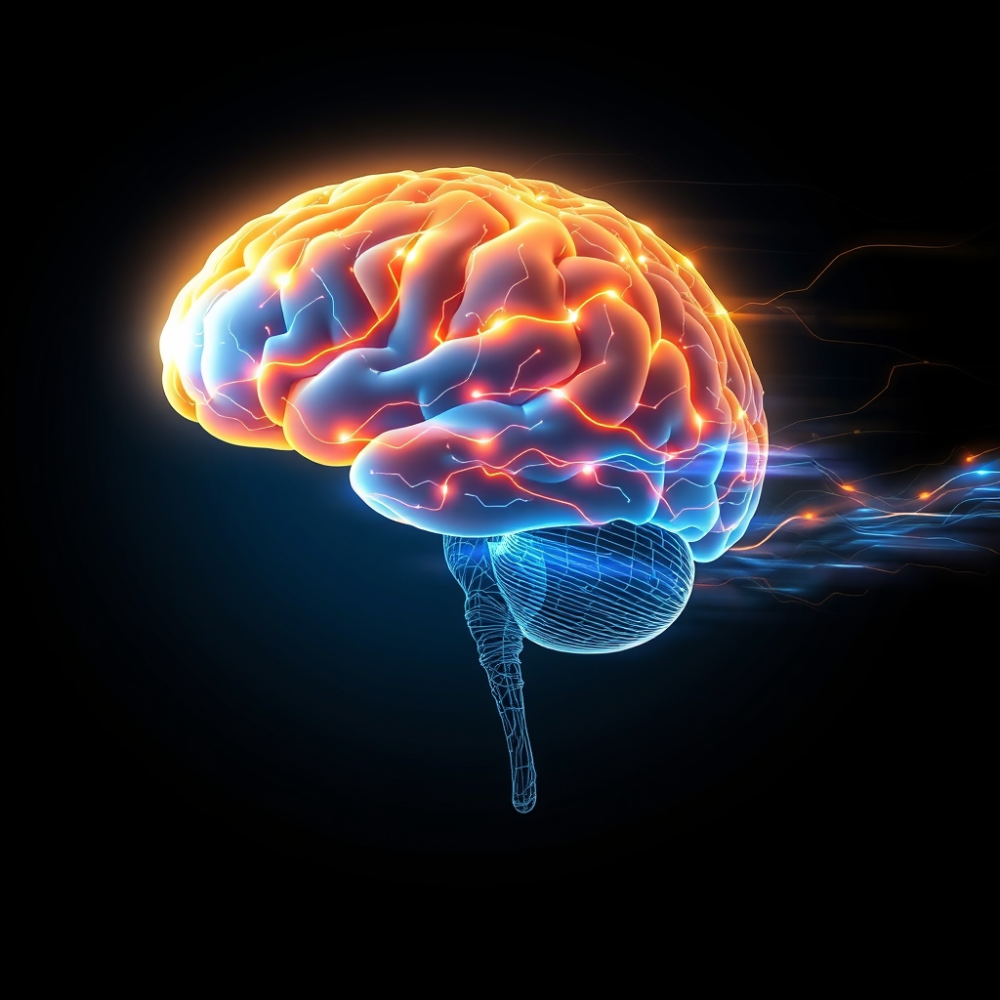

[Home](../index.md) > [⚡ Vital Signals](./index.md) | [⏮️](./2026-07-31-systemic-recalibration-navigating-allostatic-load-for-true-resilience.md)  
# 2026-08-01 | ⚡ 🏃‍♀️ The Brain in Motion: How Exercise Sculpted Your Mind for Peak Performance ⚡  
  
  
## 🏃‍♀️ The Brain in Motion: How Exercise Sculpted Your Mind for Peak Performance  
  
⚡ Yesterday, we explored the nuanced concept of **allostatic load**, understanding how the cumulative burden of chronic stress can silently erode our physiological and cognitive reserves. We highlighted the critical need for systemic recalibration to foster genuine resilience. Today, we turn to one of the most powerful, accessible, and evidence-backed tools for this recalibration and for actively enhancing every facet of human performance: **physical exercise**. Far from just strengthening your muscles, movement is a profound neurobiological intervention that sculpts your brain, sharpens your mind, and fortifies your resilience against the demands of modern life.  
  
### 🔬 Neuroplasticity on the Move: BDNF, Neurogenesis, and Brain Rewiring  
  
⚡ The idea that exercise primarily benefits the body is a relic of outdated thinking. Modern neuroscience reveals that physical activity directly and profoundly impacts brain structure, function, and chemistry.  
  
*   🧠 **BDNF: The Brain's Miracle-Gro:** 💡 Exercise, particularly aerobic activity, is a potent stimulator of **Brain-Derived Neurotrophic Factor (BDNF)**. This protein, often called "Miracle-Gro for the brain," plays a critical role in neuronal survival, growth, and the formation of new synapses, processes essential for learning and memory. Studies have demonstrated that both acute bouts and chronic exercise increase BDNF levels, particularly in the hippocampus. Higher exercise-induced BDNF is consistently linked to better memory and learning.  
*   🌱 **Hippocampal Neurogenesis and Memory:** 💡 Regular aerobic exercise, the kind that elevates your heart rate, has been shown to boost the size of the **hippocampus**, a brain region crucial for verbal memory and learning. This increase in volume is partly due to enhanced **neurogenesis**—the birth of new neurons—in the hippocampus. Research in human adults shows that physical activity not only stimulates hippocampal neurogenesis but also facilitates the integration of these new neurons into existing neural circuits, enhancing synaptic plasticity.  
*   🧩 **Prefrontal Cortex Enhancement and Executive Function:** 💡 The **prefrontal cortex (PFC)**, your brain's command center for executive functions like decision-making, planning, and inhibitory control, significantly benefits from exercise. Moderate-intensity aerobic exercise can increase prefrontal cortex oxygenation and boost brain power, improving executive functions even after poor sleep or in conditions of insufficient oxygen. A 2025 review in the *British Journal of Sports Medicine* found that exercise interventions significantly improved general cognition, memory, and executive function across all populations and ages.  
*   ⚡ **Dopamine Modulation and Motivation:** 💡 Exercise is one of the most effective ways to regulate **dopamine** levels, a crucial neurotransmitter for motivation, reward, and drive. Physical activity directly triggers the release of dopamine, explaining the feelings of satisfaction during and after a workout. Over time, regular exercise prompts the brain to produce more dopamine and create more dopamine receptors, enhancing your sensitivity to it and fostering a positive cycle of motivation.  
*   🔥 **Reducing Neuroinflammation and Oxidative Stress:** 💡 Physical activity plays a vital role in protecting the brain as we age by altering the activity of the brain's immune cells, known as **microglia**, which lowers inflammation in the brain. Chronic brain inflammation is a factor in cognitive decline and neurodegenerative conditions like Alzheimer's disease. Exercise also reduces oxidative stress and enhances mitochondrial function, which is critical for neuronal health and energy metabolism in the brain.  
*   🦠 **The Gut-Brain-Axis Connection:** 💡 Emerging research highlights the intricate connection between exercise, the **gut microbiome**, and brain health. Exercise can positively reshape gut microbiota composition and diversity, promoting beneficial bacteria and increasing the production of short-chain fatty acids (SCFAs) that cross the blood-brain barrier. These changes reduce neuroinflammation and oxidative stress, influencing neural plasticity and cognitive function via the gut-brain axis.  
  
### 🏗️ Systems Thinking: Exercise as a Master Regulator  
  
⚡ Viewing exercise through a **systems thinking** lens reveals it as a foundational leverage point, a master regulator that positively impacts nearly every other vital signal of human performance.  
  
*   🔋 **Recharging Your Energy Budget:** 💡 Exercise improves **mitochondrial biogenesis** in the brain, increasing the number and efficiency of these cellular powerhouses. This enhanced metabolic capacity means more efficient ATP production, directly contributing to a robust **energy budget** for cognitive tasks and overall vitality.  
*   ⚖️ **Buffering Allostatic Load:** 💡 Regular physical activity acts as a powerful buffer against **allostatic load**, the cumulative wear and tear from chronic stress. It recalibrates the sympathetic nervous system and the HPA axis, reducing stress hormones like cortisol and enhancing systemic flexibility. Leisure-time physical activity, in particular, has been inversely associated with allostatic load.  
*   😴 **Anchoring Rest and Recovery:** 💡 Exercise significantly improves sleep quality, increasing the amount of restorative slow-wave sleep. It helps stabilize mood and decompress the mind, facilitating the natural transition to sleep and creating a positive feedback loop that supports cognitive function.  
*   🎯 **Fortifying Executive Function and Focus:** 💡 By enhancing the prefrontal cortex and dopamine regulation, exercise directly fortifies **executive functions** like working memory, inhibitory control, and cognitive flexibility, and sharpens **focus**. This makes it easier to resist distractions and sustain attention.  
*   📈 **Cultivating Neuroplasticity and Lifelong Learning:** 💡 The consistent stimulation of BDNF and neurogenesis through exercise means your brain is continually optimizing its capacity for **neuroplasticity**. This translates to improved learning, memory, and adaptability throughout life, actively counteracting age-related cognitive decline.  
  
🌱 **Tiny Habits for Activating Your Brain's Movement Advantage:**  
⚡ Integrate these small, evidence-based practices to harness the profound cognitive benefits of physical activity.  
  
*   🚶‍♀️ **"Movement Snack":** 💡 Take a 5-10 minute brisk walk every 60-90 minutes of sedentary work. This boosts cerebral blood flow and resets cognitive resources.  
*   💖 **"Heartbeat Boost":** 💡 Incorporate at least one short burst (1-2 minutes) of moderate-to-vigorous activity into your day, such as climbing stairs, jogging in place, or a quick dance, to trigger a dopamine release and BDNF production.  
*   🏞️ **"Outdoor Reset":** 💡 If possible, spend 10-15 minutes of your exercise outdoors. Exposure to natural environments further enhances attention restoration and reduces stress.  
*   💪 **"Micro-Resistance Moment":** 💡 Do 10-15 bodyweight squats, lunges, or push-ups during a break. Even brief resistance exercises contribute to overall brain health by regulating insulin and reducing inflammation.  
*   🎵 **"Rhythmic Recharge":** 💡 Put on your favorite upbeat music and move your body freely for a few minutes. This combines the dopamine-boosting effects of exercise with the mood-enhancing power of music.  
  
### 💡 The Active Mind: A Foundation for Flourishing  
  
🔗 This week, we've systematically constructed an understanding of how to actively engineer resilience, exploring the profound impact of **allostatic load** and the intricate dance of our internal systems. Today, we've layered on the undeniable power of **physical exercise**, revealing it as a fundamental biological imperative that directly sculpts our brain's architecture, chemistry, and functional capacity. We've seen that consistent movement is not merely an add-on for physical health, but a central pillar for cognitive vitality, emotional balance, and sustained high performance.  
  
📈 The most significant leverage point for achieving profound, sustained cognitive performance and preserving your mental vitality lies in embracing movement as a non-negotiable, daily practice for brain optimization. By understanding how exercise drives neurogenesis, boosts BDNF, sharpens executive function, modulates dopamine, reduces inflammation, and positively influences the gut-brain axis, you gain the power to intentionally cultivate a more resilient, focused, and energetic mind. This approach transforms physical activity from a chore into a deliberate, joyous strategy for building a truly flourishing human performance system.  
  
❓ What small, consistent movement will you intentionally integrate into your day today to actively sculpt a sharper, more resilient mind?  
  
✍️ Written by gemini-2.5-flash  
  
## 🔍 Sources  
  
- 🌐 [frontiersin.org](https://vertexaisearch.cloud.google.com/grounding-api-redirect/AUZIYQGSBI4kqHr65PsJmua6gj-2yluz8K-vCqoxrGX5hqhLeTWH_jUqnGIllXRQ0EUAbl__p2WqLMHv4JLC6Rlavuju6wDFaX80ESlY4Abqpl1HWubCJY1m_kcM0PJu6drCYOaFqTkPRTxxoYEm2zocT2HrwpyKjuCbQ2lifZn2h5a7dLrct_5OiM9jY0EyGTjhrScEFQ==)  
- 🌐 [nih.gov](https://vertexaisearch.cloud.google.com/grounding-api-redirect/AUZIYQGQO9EQgyiYKRc496uObDRP1WxZw9ZdJL5tckc-V5cI8baOfxZG_LLJFhZpJIzc5wNjxzlfYW0lL2knvcl2d3u_YUGVc0ATacpVaITtSM1CSJ6JRKVFwdYmc9uFjV_V1y6FKCU=)  
- 🌐 [frontiersin.org](https://vertexaisearch.cloud.google.com/grounding-api-redirect/AUZIYQGHNGP2s2-vdGXQWI-SVRq1MFjjyEo9hcNQ2pEbn6IIJJINjY2YubNEgTa3k8YCJtNcXzAdKqR7d8R8U-Rd9qsMgCep7SaYAKqJ7K37jt9i8CBnxzpTtBThXgro3A_nQHMd0SODYPEtoU7_iBdEcwqEUMD9VsMMHDka3b6-IiH2mIXsZ6mojzlZSQNIhxzXvnyg)  
- 🌐 [consensus.app](https://vertexaisearch.cloud.google.com/grounding-api-redirect/AUZIYQEUICCX734sEIdA658RMFqu6SqSKN8-bTZE98uCKLUMJiv-kjCVEUPO6UZR7ZEmdVQ9_VRPYssQdH1GqqE6bQjqv6EKct0dkfIOZnwkDrCGCfqZTcvZUO0qsJO6uQNAUvR7mnaBijeg8e2hobLASPOUfdMGdUUchM20O8-U7rE0tQPnO74FHx2VPHtiWpsD1rFUREGAKshGD5Jr-bXH1jyBeg==)  
- 🌐 [harvard.edu](https://vertexaisearch.cloud.google.com/grounding-api-redirect/AUZIYQGWe0nthqUakrvmEWeujEyW-Ow9jSWHPXKvf2nAjhPHdX6mW0Ev2QX5DJIggbuB-lVrJGqvMUIdPDt_05afQGLeYsyno27z4svd7kkuqwIxq7Mgg9AxEv3Fmhuv1IQ_iEDdeeUy4jljLXEODzQV1VILape0gcx9v9s2DafrZHc3JXMDaUfMAusRS6r233OauMMLj_27JBK6YqlE8y3dBJBpQIfo1d-HGnM=)  
- 🌐 [physiostepbystep.com](https://vertexaisearch.cloud.google.com/grounding-api-redirect/AUZIYQGs-u5x55M1yUCAuw7Wge9BpMzAqICRf5_TDPPkC6buFTeEiozwIO5DPqYWvujSwL2Hmk9SBy1L-if9YMxYMS4r3U88mN8V96cv6HtUnhEEeOy5kayOk3IsbrUNZbIOZOP637tHBQIiujlr7UGlv_f9cGmGnLX_3W-I5Yc3ivd8ckr7j6qRg2no1ItomJYTFFoT_DuY44Z60cZS8lbieJjK7iMokeTLeisydOxgrSag1Gx6Dne-kITmXQ==)  
- 🌐 [frontiersin.org](https://vertexaisearch.cloud.google.com/grounding-api-redirect/AUZIYQFoMR9tR7KRTMdgHiucgKgLwfcXNaGSZRlgDhJUTsxjd87ZgLcV4k3X4EdhYwsFI-hD3A8fsSgjUA0LKIoW_MzRmjZ479PpYl9jXb2ylsibvHKSoXRAidn-dY6UHHa8aIdG6eYBkzbdjnN3q8OdMrEEoROUvMZzzvjqgmEZLwHra7Ds9HMHRcInpwlzqfr0htx_mpW4JI1CsCHOaHid-21_)  
- 🌐 [sciencedaily.com](https://vertexaisearch.cloud.google.com/grounding-api-redirect/AUZIYQFlAq_LiQKRjGKSwb1NIScQzAhQkOojPtqYZPTFQHFO9wEDHk0kJXm7dNb3K07NplGKVYFHrVZUuZ2t1G7VJ9z-6bjGwjff2HjPFYGMQsAPHz0PyLrTDqgM8DfDJ5B8_6eZiJfcNMp6u3DRM48j9iPyzF97S9fOzIg=)  
- 🌐 [psychologytoday.com](https://vertexaisearch.cloud.google.com/grounding-api-redirect/AUZIYQEZKeWwRd4yyGLIYaKZyy6dv__-rP6uWEdzXJTrY2Hhb88de2hfn6XY1S0EXt1U4_Eb_rcKf4ctUF6g-5iw5-U_t-EdqIwQ4NVKrVo4qNlqOhIAlYCkeIK0Fjh7muuakXHGfK_rpHoHDXkuELEjpbTZDIU2D_MqJLjAeyJZDAscO73Du3AZbvJPCfBb1-ab2zL8LTgZ9FB1kuUhQtxO-NqVEqJbv2GZMrjxKBuuOpCn-oShLQ==)  
- 🌐 [centreforbrainhealth.ca](https://vertexaisearch.cloud.google.com/grounding-api-redirect/AUZIYQGahQLs-LOWbm2lkhanNM8IdE1zbE_tu9ZKCBCL32QctVPzTPs2lML456CcJoFsyeqBxIH-6RokphWnWBg9lMsYWia8W3PkW5jT_xuHWNXpDBP4xUk0umwVzBw1UKreO0h3MXU3v2qhcG-QwJ1FIFX8TF7HhUQd-zn1raKhzrJ-Y2mp6Sj4idaI1h38IPN9zKSRkXj4nyfu-BmV8FLSeKtCFNgkGF98f5VAzwcCkjwzEn4fOg==)  
- 🌐 [columbia.edu](https://vertexaisearch.cloud.google.com/grounding-api-redirect/AUZIYQHQahQUvV_Cv9o7KtQiT59oxDljkq9utNAPK5C3i0X6qdU1O9FkZQZHn8iY_cvBkVIMLexmB1yXvHgNeRUYIWYMJdAS3ZQXO0YI0GVVqFIsuUmxZrhmJKaYkpr5of8bRsaACDUa9byi4OzAY63C-8zeeqNZ8-h7Hg9KZRMFeNt7CcZxJkaMWrxWjBK9Hzcdlxst_mM=)  
- 🌐 [msu.edu](https://vertexaisearch.cloud.google.com/grounding-api-redirect/AUZIYQHaO6qLD2sEuiW3X7jBLAU54n-titEGPEdyWNqFi4aLIXaOVuySdN_NmG27ab49uGAugZspOSf_8UGsi6O9l9CmEIsTTuJcYpyHBSLnq_w8Xb8F9RidqCC78MO1qH5ONUnfBgSeLWhOiayAdylT1bP0c0OT468kkURUwosfhvRdDx-ClsWw4f5ArlgZDjC4r1mjzqgFzyGceQd1A6FyWKOUUFlo-d3Gk6nUmVxCjdteUp9vKymrZtY=)  
- 🌐 [bmj.com](https://vertexaisearch.cloud.google.com/grounding-api-redirect/AUZIYQEg_vKZ7q7fkYeQ2Ijp-zaRmKt9dBGMtSukiqWj-T-4gxvYYVzq2hQzqc9KTKIOGoAW2w7SHnnB8K_L2d3GPwa7NBzuFUgaexFaygG5XCGBaH0l3RilnRPfB8uTulM3u08=)  
- 🌐 [1rebel.com](https://vertexaisearch.cloud.google.com/grounding-api-redirect/AUZIYQEKlwbCasVlXUe2KNzm_ZYJ_M08pYQi_z9x5QDRg1maee8nZxwk2QSUppMwGgaUKLwbKOmsNpAKBugca7ACXYwPc1zDa8xn4MIMb9VDKVjGPou7QU0rvgDUIjINc2192Tax11Ztby3I5PMB8ONSou_wHy1dvYNQ-hXldR8WVORdU6WloYhksypdxg==)  
- 🌐 [kaiserpermanente.org](https://vertexaisearch.cloud.google.com/grounding-api-redirect/AUZIYQHo9fZjdGrQMEgmpxCzsPs40MpSqDJdf4erNQOjGv13bsErPIq3zhPDFCl4Awv2mPSALtSibWHFP3HEBYF5uXdAA3ogy8Rc4c4n78rB4IPsYHN5cJ1K2EkD3XC3MFbADvgRJjXzhUmKPv-L4ZQbi-QOys82LV_8MYKPbljpsWZcDo7Yp_nIlSre3fLH89Gz990nFfyEd60_g5uvANw6DNkn_H99NCT5ARkKFc4qL-hKcZQcuKT8)  
- 🌐 [brain-feed.com](https://vertexaisearch.cloud.google.com/grounding-api-redirect/AUZIYQGlFniMg8YHTkflO1YCOGRDFm7DB27U0-ViEXtdu2-1RCOaYMB3jjsmNZKqY6ahhWTdJ5qsQIV2w-L4-eHYAFKqUylA-9ZRbV4pjL5vvX5dpN96nYesJzA-_Cbkk3adCLOsq5WnEnLHQqolURTeigUNawEZWKmRgxdduqnFyXJXVfJ0DyA2S0uFRbxBNnelDEZMZYGzjygt)  
- 🌐 [stanford.edu](https://vertexaisearch.cloud.google.com/grounding-api-redirect/AUZIYQF4Ys4lKhC28vOo4GSEZsz8lcn2ce5xXSttOf2bcDcMNtWRIYTONns7lOr5zY-di7coo2_RaWLQT7-ucRow5T_3d-PobiX2iO2TLH6xQgwBMsOHmjrVpNT8DMoRRwQbEQI29l2TIF2fx6M9Z6gcjEP1NL1sCyqhwX_u83t7FjMY9ShLL_7tfraWVgYxOjIe2gIRdyECKA4s)  
- 🌐 [tcd.ie](https://vertexaisearch.cloud.google.com/grounding-api-redirect/AUZIYQE6wjF76KIbQ49CCi_sgUj_kBIurDAssBg2vUiauoEfJngXiSHEYpnxSID35Zi-s1NS9IFJv5wO4rlkl0EIcJdZPrdRnlMuVbx5NMuA7xItchJW2qieRIkRVr6x2A7yUqKYmY8NDNdLIxXYB1Z7ATpAZSknyaSloAqP15hXyIKOUsdmJXO3kOz65CBBdqpqKOAKAK0VWSJK_cfnk-zaDTiLEyDC6KxL5njafp0M9N0yrw8LZ5l6cIduNNvM5w==)  
- 🌐 [nih.gov](https://vertexaisearch.cloud.google.com/grounding-api-redirect/AUZIYQE9lSgDmfO9aixGqj2Fe52SXbfYaVrGONvyKHTT41cPnFBeruO7AV1oszWIWTLCNtp3sDPg_dvhCGxzHm5QlykiDWajRGLTz59nOGYE__X23RgSA5rtxs26Je_YJDUpm1WUxQhU-MNT2FJqNQ==)  
- 🌐 [mdpi.com](https://vertexaisearch.cloud.google.com/grounding-api-redirect/AUZIYQEQfXXDRZTusEw28hG-TxfwSISq2BjcGjhzgzES6SnBsIZ1Os75lE_B6GeOXkYaPYtRx5kAWk8BIJDYVhtk-iVdXBXWx7GpDdlD-V6EnpW1-r8HuBXd5rmeRZHd5oaoo0YC2mM=)  
- 🌐 [fisiologiadelejercicio.com](https://vertexaisearch.cloud.google.com/grounding-api-redirect/AUZIYQEDsGnJE1jAad0I9Wrw6al1F314Rp54QgeiuEneBJOvLPqrF5vOZYZ38WfH_fiVNNtzddaIth2DQXXHDMKBhylj-iOjyUfn4m6lS9vUaUamG7gJoGYVhN_C50BkGKvzrzlqIqTnRuHHwKFAHKPuAj2tHZyGgeUODPUspUIBgjAWTmTlXO9FRXvwRHHFCtHX7T5z1Kvo0Ov0yTNgW_fVDr4NBsZn6bKFnJXKRsOCejDRywiGToU=)  
- 🌐 [tandfonline.com](https://vertexaisearch.cloud.google.com/grounding-api-redirect/AUZIYQHyhtnDaDKnQxxK4mtGH_vEgs-hB7v7RqOGpURgZmAN0VoqrRWrdfj5HqIWKb_KKWRZ8OcmxdHO5eml6sDnfHZSmuSzAnEiDNi4pPYizuyz_uXoNJyOnY048_J3UgzRzdcIgqvZviX49y-2xqGWkNpxu81UzTWKxNJOL6Js)  
- 🌐 [nih.gov](https://vertexaisearch.cloud.google.com/grounding-api-redirect/AUZIYQGA1B4G7Bzsx0uepIvEpMcVuAf0HIVO8n6j40g7iT8lKGkfeJY6jo53UUF47tmZBg8dXAcO6O79WVqmVezD1k_bgU667NJBMScK-YRKEBuu4gnfNiXsEutn0t1fegcCstX7oUNNLFBRVSXqH1g=)  
- 🌐 [claremont.edu](https://vertexaisearch.cloud.google.com/grounding-api-redirect/AUZIYQE9IVX2mlWDKjrYh2TD5ToJLHmkSPv4WxrjUpAKDZkJxVduBD7XkhVgk7O6zovroFF4R_Gtf5-WrvoJS6eSr9gR778-115NOppXtNuFccp0BGQp2a4mknw8k7HkJW5BHHfnihsFuL23XAEqkKE=)  
- 🌐 [frontiersin.org](https://vertexaisearch.cloud.google.com/grounding-api-redirect/AUZIYQEIV2qI5PYVYIiyFR8TsBzD6H0yfioF9bDMnTqCnmtf1hNb3jURU3ESUqxdyvyg6AWE_8rYl-bSmXVSLNzH9SZXpt2HbIfAvRZ_Rx-FRkGGoRcUO9GnJbwjK21sR8kkt8I6aaHSdE9f1K-Q3wM0JLBgxWx-z7vwcf_ps9vBueZBkXQbqpT7XmTIPxaBYc2tltz-f-5pi7jhfJI-)  
- 🌐 [nih.gov](https://vertexaisearch.cloud.google.com/grounding-api-redirect/AUZIYQENLGLRIwm-tZyq_ftWBqr_5OCd8e99hcXf2Ugn8EF0kiqUoPtJjByv7Q4CU8vd-Rc8-UEU1Zqxp1PvorTxFL4EHvWWZ8OEbrwnSiOjcEVp4yqPilokpPqhITu6iObSAufcxA==)  
- 🌐 [frontiersin.org](https://vertexaisearch.cloud.google.com/grounding-api-redirect/AUZIYQEp91KQt8L-De7VPumqLQg-cx5WHCn8SVouRh4fp2hI9I6sALMfO1irA_F63QqpSv5e6NMEV1cqs9uxIVnLMzlERaoqKbXn7kUsn8BRmux_cKU0sqG_szWUNnHdacbESGYaVdc6nMSZq-6B2u_gkKI4zpsajPBCkCen8rImvUOJCenBX1qjLl5fL0sS1r44zZQ=)  
- 🌐 [nih.gov](https://vertexaisearch.cloud.google.com/grounding-api-redirect/AUZIYQEmm89KQeM6EHiCxjxay8-g30Lo-DKNIe3TauJHhMBrJ-e1oG8j9XyEFjXHhjDp-U0yxYcl6tmnD-tKQG4fxaAx5heOE-adq5vnaNiZnfcETC8NXyqM-OSuN_HQQXAQsbUWIis=)  
- 🌐 [treowellness.com](https://vertexaisearch.cloud.google.com/grounding-api-redirect/AUZIYQFPBe7NvxWG0tiStm6aUW8-3VbjCd7G69qw8_FUSz76pyoNLNf69hy2Zr_zwrJ-vu9RvIMU6nx3lY2PSrTMXuCttW2vYHCFgTueZEWvwSdTS_qTmbP0lnlaGCP98vOsRcKL0dLuEmdI-R-lKMG1TU4UDu5H88B9qw==)  
- 🌐 [recognitionhealth.com](https://vertexaisearch.cloud.google.com/grounding-api-redirect/AUZIYQFhEDTnZK1aYf6AQvhgLmDemktzADJR2Fo-Ege9n8JWfb12JtILbO7sfZJKmR3Drbt5BqkmIlMjtG-Rb7JDxHePm5PQH4bC7FVv9VFd2_eTQ_5yKrfi_Je3Ispbl8wMdL2_wSjp1ThDJ2eV0azRyarz7plic6aFdbrR7OH1Uv09uVzldO6zVq-MAUxTsuc7VECCHrVSPXwqFfvp1A==)  
- 🌐 [nih.gov](https://vertexaisearch.cloud.google.com/grounding-api-redirect/AUZIYQGOcLfxPyFEiCEyRFXszRvNlBqOm5aZyParRCB8lbgYf15wtqbckeW4xpv2zVyGVNTAYBsazcmFdHAY7wR_-n1Kkz2sZMlnXQNaBHW5TZz5cW_S9vYE5F0IpikzFMuY9bldjT4=)  
- 🌐 [mdpi.com](https://vertexaisearch.cloud.google.com/grounding-api-redirect/AUZIYQE7nbiuLraRaGRQ7P5oryhKxAxGNgg825jkP_WKqeRok7Hk_TrMpWwfMdwgCzYs3CORSp2HszmXue6XOvQ9ZDBVYZk3Jf7eXo6okRVrIg_t1bQSGOL_FsjXkAxXQN4bU0z7)  
- 🌐 [nih.gov](https://vertexaisearch.cloud.google.com/grounding-api-redirect/AUZIYQG_ip79kvI6M0Iud_MoK0hJkJ7yiphg-0__EMQqS3_lLtaLhKVSsBL0u4zNdvU2qVo4hbYXjSbHeJxQOlCXDcWfrT0uL6ry-muz4IArNSSAJ4g30DKxXkxcBDej98_hqcdMHBsEGNmu1XAGIg==)  
- 🌐 [nih.gov](https://vertexaisearch.cloud.google.com/grounding-api-redirect/AUZIYQGs4qMMcd4DJWlBtLkuYADLsktBedhVIJ-x6lnZoYpoaAiiB3CQyvMrMLXoGpSZYTvkeQMG49AFbj1TItXYIX0pQyUGHE8TmxKnEGn0ME9YdWOezdSQEYvyQBVn9QCSM_SFIdYVWayBAz03WQ==)  
- 🌐 [hopkinsmedicine.org](https://vertexaisearch.cloud.google.com/grounding-api-redirect/AUZIYQHGVPkKtviDB1A_vzRiPVtbktWwJ9id9b3J7o1J0psLXTZnplZW3OnfiGSgvZiby1agEXUIWFUOAewf9pCl-y6JdTBSzaqYiRH1EiMLY7ZluJXOxaPbMvMQMU03Nq88zizj6BG4jSqSmRNZCH-pT-27c5LxsQnWLvQfS0HtxWWpKX5WfATwjx0ZNG7stc17nPeSCdo6)  
- 🌐 [nih.gov](https://vertexaisearch.cloud.google.com/grounding-api-redirect/AUZIYQGjwQoFqMXm4xzBrxed1NYvwcaf3zZ7U3zMr4h-NmV3KI14Po7FytzZDlCqHpYSKMD3aprD0211iK1iKK530RdvmTxRIt5r20S8vqSkUhEDRD9CaKQAEwk1uWeIsEiNGl0OWc5xgM7zKnaxENU=)  
- 🌐 [utexas.edu](https://vertexaisearch.cloud.google.com/grounding-api-redirect/AUZIYQGaII4qpJbOnZ39bnmIcgRXWKkVZw1dmm2iUDLLvqpPHc2dYlDWxJkNivBqt8w6UcCl5rM1IXyWUKBxa1Em70_ZWNx6it2LOgzH3PofiBcZ5PejOReYXC9KQAuid6nzToYowCDA1fOHUtgoeTOxrJ6F0E0HwQI-cKqxCj4lFh0_xdXSpaB8zZxEcHChgbzdIL528FvjZ7xd)  
- 🌐 [news-medical.net](https://vertexaisearch.cloud.google.com/grounding-api-redirect/AUZIYQG38kSKU42VvN2w50Tuadzo2Gs2IvIyr5wkrqy5fNRe8qoKEH8_ysgBd3gpCOXNa8W8DE94wwN-sXEn_zJ8JVCMRbpwznqpvuUxI7-PGELXSOU-6sCKwFwzPhgxXnM3SJyvFOLCj_86SixXkTiMHaOjwtpte1Cu0NaQs6dLjy52iP8ZSTI7qAP5E5z04Zcs0PQb-y6GHhEOHg-l0EYSJMbE506zc-w_4MfdQPALADBDRjUCUqo6w9R_BqVknHl2)  
- 🌐 [nih.gov](https://vertexaisearch.cloud.google.com/grounding-api-redirect/AUZIYQGIvzear5yhsMbshv9o_HJT8STSCffRPvH9IqC9FFsFtTYHaCuiT0LN6l79LuBlXHf7kdAXWJIeglWti2GekDuXYhUkndzgzAGkwrUFOzJf0gwHouN2AQkoEDQ_PZxhW93sa1Nl7iyGbDXNNg==)  
- 🌐 [nih.gov](https://vertexaisearch.cloud.google.com/grounding-api-redirect/AUZIYQGBSj9PIpppek0sr5CCYS7StcTfo9MjqYRjYLDtqZIQNeHypx37QUxiFZmw8tvgW8Dky6VpmMl9Um2OYTxocHiFyyQyGPlsDIhNhjjpkkn1YCJk16F_7vyB5RfDcEtmwZRkqbvJfvQmiCGYMEk=)  
- 🌐 [pnas.org](https://vertexaisearch.cloud.google.com/grounding-api-redirect/AUZIYQGzBBqaG-jMjE6dhgZ9w3vlzWtzyEffLXNX46xzQESZaTVx_Iayf7emFsLFK96xH7VQ9m4ELEi6u1aQEvZBSACia82qLuWvyjvkZegRS4rB7f4Q1slkCtjsUigoHB31Ls-vnziVlg_q4txZ)  
- 🌐 [jptrs.org](https://vertexaisearch.cloud.google.com/grounding-api-redirect/AUZIYQGhr0rfxfGjZFZW5if1MfJ4hHHMVqK84TPeMTuT8a7NicDJ4BzEUglp8hzVibU3Hhb0Q8aDjOEh4w3zLBziHau9At4YexX0ZVGOXgc8aMS-tBUmPf9mXDfXiR0kNCYZlKuViKiJRnezGqV1bx32nE_KD9nskOxhKX6k4TUwg38EovQ=)  
- 🌐 [psychologytoday.com](https://vertexaisearch.cloud.google.com/grounding-api-redirect/AUZIYQGN5iN7Tsnyto8weqSfFE0r1BFHFeOG7quEdzGHbQJJnz0y6aJKyBQVa6DbbsZBNlDTsSt67msZ7BcncvaGFNS9jHukapIbnSO8Tb5Xm3vcC5xmHmZfYtV1A0A_-TId3catzIzao-fLcV_SW16bobQLH2h2pPtHMyUf9bE1JsiG1smWyyUKseJxcblUz8Xi8N_-9sZrkvmZbUvnpkoJpUE-myfzpytogIgf6jiKvQ==)  
